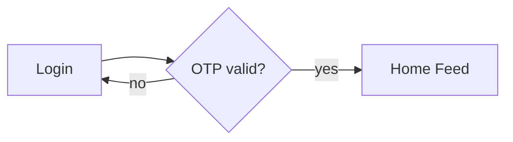

# 02 — Documentation Conventions

Consistent rules for every document in this repository so an LLM/engineer can
parse it reliably.

## 1. File naming

- Lowercase, hyphen-separated: `p07-home-feed.md`, `01-authentication-flow.md`.
- Page docs live in `docs/pages/` and are prefixed by page ID (`p`, `r`, `a`, `s`).
- Folders are numbered where order matters (`docs/architecture/00-overview.md`).

## 2. Page doc structure (mandatory sections)

Every file in `docs/pages/` MUST contain, in this order:

1. **Metadata** — page ID, platforms, roles, priority.
2. **Purpose** — one paragraph: why the page exists.
3. **UI Structure** — layout, regions, component list (mobile + web).
4. **Features / Functional Requirements** — numbered `REQ-*` items.
5. **User Interactions** — taps/clicks, gestures, animations.
6. **Validation & Error States** — field rules + error messages.
7. **Loading, Empty, Success States** — what each looks like.
8. **User Flow** — step-by-step primary flow.
9. **Dependencies** — screens, services, stores, components.
10. **API / Data Requirements** — endpoints + payloads (link to API doc).
11. **Navigation** — where you can go from here, and from where you arrive.
12. **Analytics Events** (optional).
13. **Open Questions** (optional).

Use [`03-page-template.md`](03-page-template.md).

## 3. Requirement IDs

Format: `REQ-<AREA>-<3-digit>`.

| Area | Covers |
|---|---|
| `AUTH` | Login, signup, OTP, reset, session |
| `FEED` | Home feed |
| `READ` | Article reading / scroller |
| `CAT` | Categories |
| `SEARCH` | Search |
| `BOOK` | Bookmarks |
| `NOTIF` | Notifications |
| `COMMENT` | Comments |
| `PROF` | Profile |
| `SET` | Settings |
| `REP` | Reporter |
| `ADM` | Admin |
| `REG` | Regions (state/district/constituency/mandal) & scope |
| `DEL` | Deletion policy (soft/hard delete, restore, purge) |
| `ADS` | App contact & advertisement settings |
| `SYS` | System/global (nav, error, offline) |

Example: `REQ-AUTH-003` = "Login via OTP".

## 4. Priority tags

- **P0** must-have for v1 launch.
- **P1** important, ship shortly after.
- **P2** nice-to-have / later.

## 5. Diagram conventions

Diagrams use [Mermaid](https://mermaid.js.org/) fenced blocks so they render on
GitHub:

````

````

- **Flowcharts** (`flowchart`) for page/decision flows.
- **Sequence diagrams** (`sequenceDiagram`) for API/client interactions.
- **ER diagrams** (`erDiagram`) for the database.
- **State diagrams** (`stateDiagram-v2`) for status lifecycles.

## 6. UI description conventions

- Describe mobile (phone) and web (desktop) separately when they differ.
- Reference design tokens by name (e.g. `--purple`, `space-4`, `radius-md`).
- Every interactive element states its **default / hover / active / disabled**
  behaviour where relevant.
- State the responsive breakpoint behaviour when a layout changes.

## 7. API conventions

- Base URL: `/api/v1`.
- Auth: `Authorization: Bearer <accessToken>`.
- Standard response envelope:

```json
{ "success": true, "data": {}, "meta": {}, "error": null }
```

- Errors:

```json
{ "success": false, "data": null, "error": { "code": "VALIDATION_ERROR", "message": "Email is required", "fields": { "email": "required" } } }
```

- Pagination: cursor-based (`?cursor=&limit=`), returns
  `meta.nextCursor`, `meta.hasMore`.

## 8. Validation conventions

- Validate on the client (immediate) and server (authoritative).
- All numeric IDs are UUID v4 unless stated otherwise.
- Dates are ISO-8601 UTC (`2026-09-22T10:15:00Z`).
- Relative times ("2h ago") are computed client-side.

## 9. Writing rules

- Be unambiguous. Prefer "Tapping X opens Y" over "user can navigate".
- No feature may be added that is not documented here.
- Each page lists explicit **Navigation** targets; keep the
  [navigation map](flows/07-navigation-map.md) in sync.
- Keep terminology consistent with the [glossary](00-overview.md#6-glossary).
