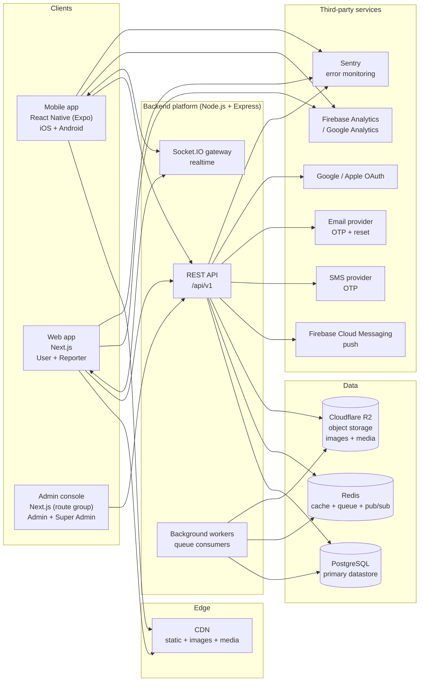
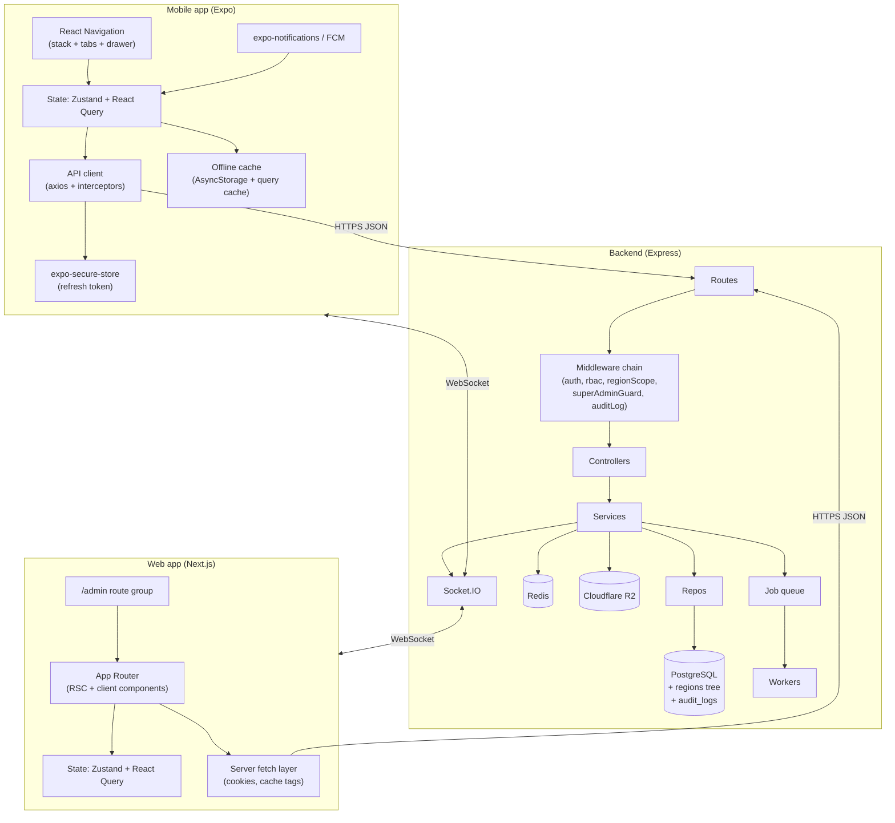

# 00 — Architecture Overview

> NewsWatch platform architecture. This document is the entry point for the
> `docs/architecture/` set. It defines the system context, runtime topology,
> environments, non-functional requirements, the technology stack, the
> recommended repository layout, and how the documentation maps to build phases.

Related: [Mobile](01-mobile-architecture.md) ·
[Web](02-web-architecture.md) · [Backend](03-backend-architecture.md) ·
[API](04-api.md) · [Database](05-database.md) ·
[Auth](06-auth-and-authorization.md) ·
[Integrations](07-third-party-integrations.md) ·
[Conventions](../02-conventions.md) · [Tokens](../design-system/00-tokens.md) ·
[Page Index](../01-page-index.md).

---

## 1. System context

NewsWatch is a **mobile-first news platform**. All content is **free**; there
is **no payments, subscriptions, or paywall** at any layer. The system is
composed of three first-party client surfaces and one backend platform.



### 1.1 Actors

| Actor | Surface | Trust level |
|---|---|---|
| Guest | Mobile + Web | Unauthenticated |
| User (`user`) | Mobile + Web | Authenticated |
| Reporter (`reporter`) | Mobile + Web | Authenticated + role `reporter` + approved + region-scoped |
| Admin (`admin`) | Admin console (Web) | Authenticated + role `admin` + region-scoped |
| Super Admin (`super_admin`) | Admin console (Web) | Authenticated + unrestricted ("God user") |

> The authoritative role model, **region hierarchy**
> (State → District → Constituency → Mandal), scoped authorization, and
> **deletion policy** (soft-delete users / hard-delete articles) live in
> [08-roles-regions-and-deletion.md](08-roles-regions-and-deletion.md).

### 1.2 Responsibilities per surface

| Surface | Owns | Does NOT own |
|---|---|---|
| Mobile | Offline cache, push receipt, deep links, native share, video surface | Authoritative validation, ranking |
| Web | SSR/SEO rendering, admin console UI, in-browser video | Authoritative validation, ranking |
| API | All business rules, authorization, persistence, ranking, moderation | Rendering decisions beyond metadata |
| Workers | Async processing (images, notifications, scheduled publish) | Synchronous request handling |

---

## 2. High-level component diagram



---

## 3. Environments

| Environment | Purpose | Data | Base URL | Notes |
|---|---|---|---|---|
| **dev** | Local developer machines | Seeded/fake | `http://localhost:4000/api/v1` | Docker Compose for PG + Redis + MinIO |
| **staging** | Pre-production QA, EAS internal builds | Anonymised copy or seed | `https://staging-api.newswatch.app/api/v1` | Mirrors prod config; test OAuth/FCM projects |
| **prod** | Live users | Real | `https://api.newswatch.app/api/v1` | HA, backups, alerting |

### 3.1 Environment configuration rules

- A single `.env` per environment; **no secrets in source control**. Production
  secrets are injected from a managed secret store.
- Config is loaded and validated at boot (fail fast if a required var is
  missing). See [Backend §9](03-backend-architecture.md#9-configuration--secrets).
- Client builds select the API base URL per build profile (Expo `app.config.ts`
  `extra`; Next.js `NEXT_PUBLIC_*`). Never hardcode hosts.

---

## 4. Non-functional requirements

Requirement IDs in the `SYS` area are used for cross-cutting platform concerns.

### 4.1 Performance

| ID | Requirement | Target |
|---|---|---|
| REQ-SYS-001 | Feed first paint with cached content | < 1.5 s on mid-tier device |
| REQ-SYS-002 | Time-to-first-article (cold start, online) | < 3 s |
| REQ-SYS-003 | P95 API read latency (feed/article) | < 250 ms server-side |
| REQ-SYS-004 | P95 API write latency (comment/like) | < 400 ms |
| REQ-SYS-005 | Article page web LCP | < 2.5 s (CDN + SSR + image opt) |
| REQ-SYS-006 | Feed scroll interaction | 60 fps; virtualised/snap lists |
| REQ-SYS-007 | Images | Served via CDN, responsive `srcset`, lazy-loaded below fold |

### 4.2 Scalability

| ID | Requirement |
|---|---|
| REQ-SYS-010 | All API instances stateless; horizontal scale behind a load balancer |
| REQ-SYS-011 | Session/refresh state in PostgreSQL; cache in Redis (not in-process) |
| REQ-SYS-012 | Pagination is cursor-based on every list endpoint (no offset scans) |
| REQ-SYS-013 | Socket.IO scales via Redis adapter across instances |
| REQ-SYS-014 | Background work is off the request path (queue + workers) |
| REQ-SYS-015 | Database read replicas for feed/search-heavy reads (phase 2) |

### 4.3 Security

| ID | Requirement |
|---|---|
| REQ-SYS-020 | TLS everywhere (HTTPS/WSS); HSTS on prod |
| REQ-SYS-021 | JWT access (~15 min) + rotated refresh (~30 d); see [Auth](06-auth-and-authorization.md) |
| REQ-SYS-022 | RBAC enforced server-side on every protected route |
| REQ-SYS-023 | Input validation + output encoding; parameterised DB queries only |
| REQ-SYS-024 | Rate limiting per IP + per user + per device |
| REQ-SYS-025 | Secrets never logged or committed; PII minimised |
| REQ-SYS-026 | OWASP Top 10 mitigations; security headers (helmet) |
| REQ-SYS-027 | Signed upload URLs; MIME/size validation on media |
| REQ-SYS-028 | Region-scoped authorization enforced server-side; only `super_admin` bypasses scope (REQ-REG-003/004/007) |
| REQ-SYS-029 | Deletions are audited; users are soft-deleted and articles hard-deleted by `super_admin` only (REQ-DEL-001/004/005) |

### 4.4 Data domains (region & lifecycle)

| Domain | Description |
|---|---|
| Region hierarchy | 4-level self-referencing tree (`regions`): State → District → Constituency → Mandal. `articles.region_id` references the most specific region. Admin/reporter authorization is scoped to assigned regions and their descendants (`admin_region_scopes`, `reporter_region_scopes`). |
| Deletion policy | Users: **soft delete** (`users.is_deleted`) with restore/purge, super admin only. Articles: **hard delete** (row + dependents + media), super admin only. All changes written to `audit_logs`. |
| App settings | Public contact/advertisement details in `app_settings`, writable by `super_admin` only. |

### 4.5 Availability & reliability

| ID | Requirement | Target |
|---|---|---|
| REQ-SYS-030 | API availability (prod, monthly) | ≥ 99.9% |
| REQ-SYS-031 | Crash-free sessions (mobile) | > 99.5% |
| REQ-SYS-032 | Graceful degradation: if realtime/cache/push fails, core reading still works | Required |
| REQ-SYS-033 | Automated DB backups (PITR) + tested restore | Daily / weekly test |
| REQ-SYS-034 | Health/readiness endpoints for orchestrator probes | `/health`, `/ready` |

### 4.6 Maintainability & observability

| ID | Requirement |
|---|---|
| REQ-SYS-040 | Layered backend (routes → controllers → services → repos) with typed contracts |
| REQ-SYS-041 | Structured JSON logs with request IDs and correlation IDs |
| REQ-SYS-042 | Error tracking (Sentry) across API, web, mobile |
| REQ-SYS-043 | Metrics + alerting for error rate, latency, queue depth, DB connections |
| REQ-SYS-044 | DB migrations are versioned, forward-only, and reviewed |

### 4.7 Accessibility & compatibility (summary)

| ID | Requirement |
|---|---|
| REQ-SYS-050 | Web WCAG 2.1 AA: keyboard, focus, contrast, semantics, alt text |
| REQ-SYS-051 | Mobile: dynamic type, screen-reader labels, ≥ 44×44 pt touch targets |
| REQ-SYS-052 | Support iOS 15+ / Android 9+; evergreen web browsers |

---

## 5. Technology stack

| Layer | Choice | Rationale |
|---|---|---|
| Mobile | React Native + Expo (SDK current stable), TypeScript | Cross-platform, EAS builds, OTA updates |
| Mobile navigation | React Navigation (native stack + bottom tabs + drawer) | Spec navigation model |
| Mobile state | Zustand (UI/session) + React Query (server state, cache) | Simple, cache-first |
| Mobile storage | `expo-secure-store` (tokens), AsyncStorage/SQLite cache | Secure token storage |
| Web | Next.js (App Router) + React + TypeScript | SSR/SSG/ISR for news SEO |
| Web state | Zustand + React Query | Shared mental model with mobile |
| Admin | Next.js route group `/admin` in the web app | "Admin is part of web" |
| Styling | CSS Modules / Tailwind mapped to design tokens; RN `StyleSheet` + theme | Token consistency |
| Backend | Node.js (LTS) + Express + TypeScript | Spec-mandated |
| Validation | Zod (shared schemas) | One schema for API + clients |
| DB | PostgreSQL 15+ | Relational integrity, `tsvector` FTS |
| ORM/migrations | Prisma (or Knex) | Typed client + versioned migrations |
| Cache/queue | Redis (cache + BullMQ queue + Socket.IO adapter) | Single dependency, multiple uses |
| Realtime | Socket.IO | Live comments (realtime) |
| Storage | Cloudflare R2 (S3 API compatibility; MinIO in dev) | Presigned PUT/GET uploads, public bucket behind Cloudflare CDN, zero egress fees |
| Auth | JWT (access+refresh), OTP, OAuth Google/Apple | Spec-mandated |
| Push | Firebase Cloud Messaging | Spec-mandated |
| Analytics | Firebase Analytics (clients) + backend events | Spec-mandated |
| Email/SMS | Provider abstraction (e.g. SES/SendGrid, Twilio/MSG91) | OTP + reset |
| Video | Uploaded article videos: progressive MP4 (H.264/AAC) + WebM, transcoded server-side with a generated poster | Uploaded article media only |
| Monitoring | Sentry + structured logs + metrics | REQ-SYS-042/043 |
| CI/CD | GitHub Actions; EAS for mobile; Vercel/Node for web; containerized API | Reproducible deploys |

---

## 6. Repository / monorepo suggestion

Recommended: a monorepo using a workspace manager (pnpm workspaces or Turborepo)
so that API types, validation schemas, and design tokens are shared.

```
newswatch/
├── apps/
│   ├── mobile/          # Expo React Native app
│   ├── web/             # Next.js app (user + reporter)
│   │   └── app/admin/   # Admin console route group
│   └── api/             # Express backend
├── packages/
│   ├── shared/          # Types, Zod schemas, API client, constants
│   ├── tokens/          # Design tokens -> CSS vars + RN theme
│   └── config/          # eslint/tsconfig presets
├── infra/
│   ├── docker-compose.yml   # local PG + Redis + MinIO
│   ├── migrations/          # SQL/Prisma migrations
│   └── deploy/              # IaC / container manifests
├── docs/                    # THIS documentation repo (spec)
└── turbo.json / pnpm-workspace.yaml
```

> The **spec repo** (this repository) stays documentation-only. The app code
> lives in the suggested monorepo above; this document set is the source of
> truth for building it.

### 6.1 Shared packages

| Package | Consumed by | Contents |
|---|---|---|
| `shared` | mobile, web, api | Request/response types, Zod schemas, error codes, REQ-linked constants |
| `tokens` | mobile, web | Token values exported as CSS vars (web) and a theme object (RN) |
| `config` | all | Lint, TS, formatting presets |

---

## 7. Build phases (how docs map to implementation)

| Phase | Goal | Primary docs | Exit criteria |
|---|---|---|---|
| **P1 — Foundations** | Repo, tokens, envs, DB schema, auth | [05-database](05-database.md), [06-auth](06-auth-and-authorization.md), [03-backend](03-backend-architecture.md) | Migrations run; OTP login works end-to-end |
| **P2 — Core reading** | Feed, listing, article, categories, search | [04-api](04-api.md), [01-mobile](01-mobile-architecture.md), [02-web](02-web-architecture.md), [FEED/CAT/SEARCH pages](../01-page-index.md) | Guest can read on mobile + web; SEO live |
| **P3 — Engagement** | Likes, comments, bookmarks, follows, notifications | [04-api](04-api.md), [07-integrations](07-third-party-integrations.md) | User can engage; push delivered |
| **P4 — Reporter** | Composer, status pipeline, media upload | [05-database](05-database.md) §status, [03-backend](03-backend-architecture.md) §jobs | Reporter submits; images processed |
| **P5 — Admin** | Moderation, categories, users, approvals, regions, app settings, danger zone, analytics | [02-web](02-web-architecture.md) admin section, [04-api](04-api.md) admin, [08-roles-regions-and-deletion](08-roles-regions-and-deletion.md) | Admin publishes/rejects within scope; super admin manages regions/deletion; metrics visible |
| **P6 — Hardening** | Realtime comments, perf/security | [07-integrations](07-third-party-integrations.md), NFRs §4 | SLOs met |

---

## 8. Cross-cutting decisions (ADR-style summary)

| # | Decision | Consequence |
|---|---|---|
| D1 | All content free, no paywall | No entitlement/billing services; every published article public |
| D2 | Cursor pagination everywhere | Stable infinite scroll; no page drift under inserts |
| D3 | Access token in memory, refresh token in secure store / httpOnly cookie | Limits XSS/native token theft; rotation on use |
| D4 | Server-side RBAC authoritative | Clients may hide UI, but API rejects forbidden actions |
| D5 | Article status is a state machine | Draft → Pending → Published/Rejected; audited in `article_status_history` |
| D6 | PostgreSQL full-text (`tsvector`) for v1 search | No external search cluster required initially |
| D7 | Redis for cache + queue + Socket.IO adapter | One operational dependency, three roles |
| D8 | Media always served via CDN with signed uploads | Fast images; upload abuse protection |
| D9 | Realtime is additive, never required | Reading/engagement work if WebSocket drops (REQ-SYS-032) |
| D10 | UUID v4 identifiers | Opaque, decentralised ID generation (per conventions) |
| D11 | Region hierarchy drives authorization | Admin/reporter actions are scoped to their assigned region and descendants; only `super_admin` is global |
| D12 | Asymmetric deletion policy | Users are soft-deleted (restorable, purgeable) by `super_admin`; articles are hard-deleted by `super_admin`; all audited |

---

## 9. Document map

| File | Scope |
|---|---|
| `00-overview.md` (this) | System context, NFRs, stack, repo layout, phases |
| `01-mobile-architecture.md` | Expo app: structure, navigation, state, offline, push, EAS |
| `02-web-architecture.md` | Next.js app: routing, SSR/ISR, admin, SEO, deployment |
| `03-backend-architecture.md` | Express layering, middleware, jobs, realtime, caching |
| `04-api.md` | Complete `/api/v1` contract, envelopes, error catalog |
| `05-database.md` | PostgreSQL schema, ERD, indexes, status state machine |
| `06-auth-and-authorization.md` | Auth flows, tokens, RBAC matrix, reporter gating |
| `07-third-party-integrations.md` | Every external integration + fallbacks |
| `08-roles-regions-and-deletion.md` | **Authoritative** roles, region hierarchy/scoping, deletion & app-settings policy |
