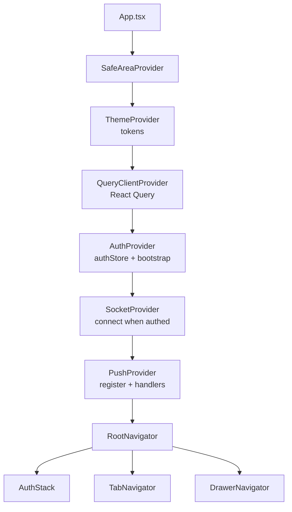
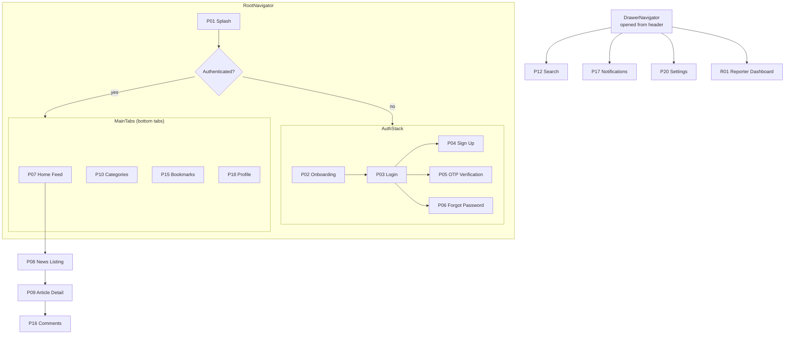
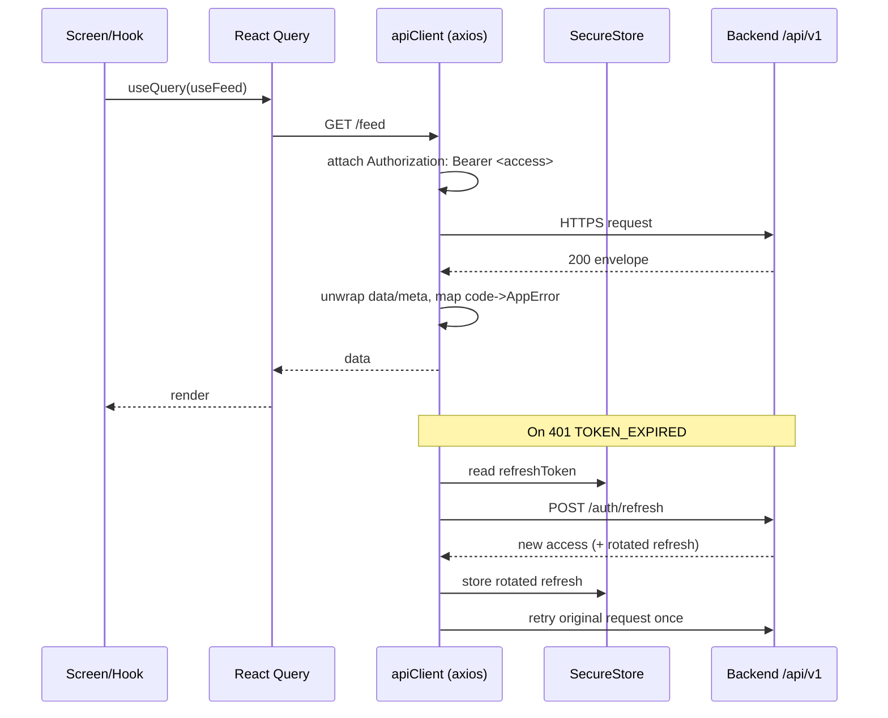
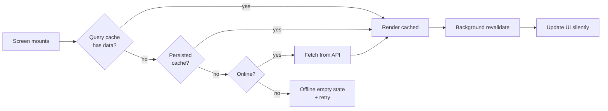
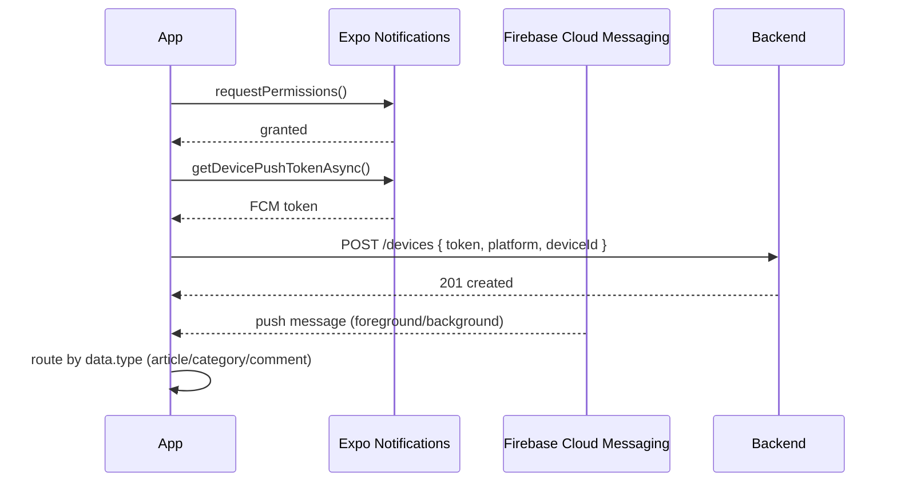
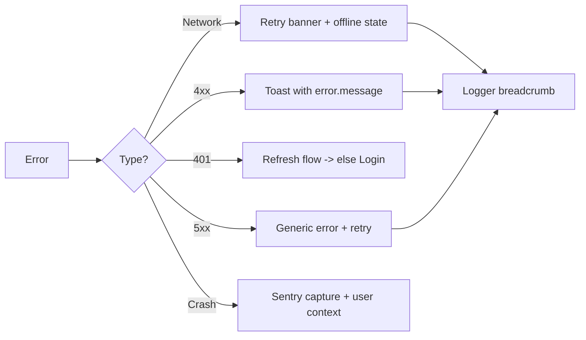
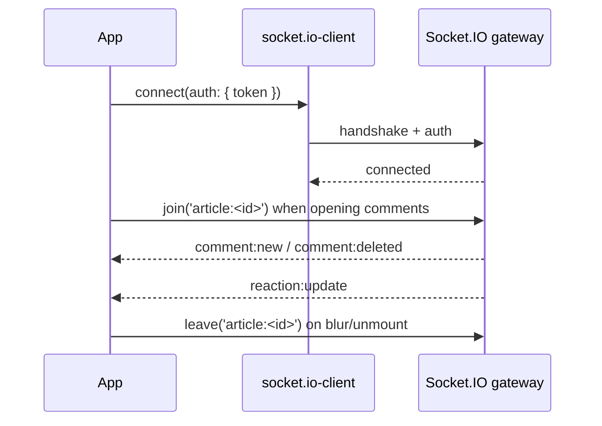

# 01 — Mobile Architecture (React Native / Expo)

> Architecture for the NewsWatch mobile app: iOS + Android via React Native
> and Expo. Covers folder structure, navigation, state, API layer, secure
> storage, offline/caching, image caching, push, deep linking, theming, builds,
> env config, and error/crash handling.

Related: [Overview](00-overview.md) · [Web](02-web-architecture.md) ·
[Backend](03-backend-architecture.md) · [API](04-api.md) ·
[Auth](06-auth-and-authorization.md) · [Tokens](../design-system/00-tokens.md) ·
[Page Index](../01-page-index.md).

Scope note: **no payments/subscriptions** exist in the app. All content is free.

---

## 1. Guiding principles

| ID | Principle |
|---|---|
| REQ-SYS-060 | Cache-first rendering: show cached content immediately, revalidate in background |
| REQ-SYS-061 | Optimistic UI for likes/bookmarks/comments with server reconciliation |
| REQ-SYS-062 | Every network call is cancellable, time-bounded, and retried with backoff |
| REQ-SYS-063 | No secrets in the app bundle; only public config ships |
| REQ-SYS-064 | Design tokens are the only source of colors/spacing/typography |
| REQ-SYS-065 | Accessibility: labels, dynamic type, ≥ 44×44 pt targets |

---

## 2. Tech choices

| Concern | Choice |
|---|---|
| Runtime | Expo (managed workflow, EAS Build) |
| Language | TypeScript (strict) |
| Navigation | React Navigation: native stack + bottom tabs + drawer |
| Server state | TanStack React Query |
| Client state | Zustand (session, UI, prefs) |
| HTTP | axios with request/response interceptors |
| Validation | Zod schemas from `packages/shared` |
| Secure storage | `expo-secure-store` |
| General storage | `@react-native-async-storage/async-storage` (+ optional SQLite for feed cache) |
| Images | `expo-image` (disk + memory cache, blurhash placeholders) |
| Video | `expo-video` (uploaded article videos: progressive MP4/WebM) |
| Push | `expo-notifications` + FCM |
| Realtime | `socket.io-client` |
| Analytics | `@react-native-firebase/analytics` |
| Crash/errors | `@sentry/react-native` |
| Deep links | Expo Linking + universal/app links |

---

## 3. Folder structure

```
apps/mobile/
├── app.config.ts              # Expo config, env -> extra, plugins
├── eas.json                   # Build profiles (dev/preview/prod)
├── babel.config.js
├── tsconfig.json
├── assets/                    # fonts, icons, splash, images
├── src/
│   ├── App.tsx                # Providers: Query, SafeArea, Theme, Auth, Socket
│   ├── navigation/
│   │   ├── RootNavigator.tsx  # Auth stack vs App (tabs + drawer)
│   │   ├── AuthStack.tsx      # Splash, Onboarding, Login, SignUp, OTP, Reset
│   │   ├── TabNavigator.tsx   # Home, Categories, Bookmarks, Profile
│   │   ├── DrawerNavigator.tsx# Secondary: Search, Notifications, Settings, Reporter
│   │   ├── linking.ts         # Deep link / universal link config
│   │   └── types.ts           # Param lists (typed navigation)
│   ├── screens/               # One folder per page ID (p07-home-feed, etc.)
│   │   ├── p01-splash/
│   │   ├── p07-home-feed/
│   │   ├── p08-news-listing/
│   │   ├── p09-article-detail/
│   │   ├── p10-categories/
│   │   ├── p12-search/
│   │   ├── p15-bookmarks/
│   │   ├── p16-comments/
│   │   ├── p17-notifications/
│   │   ├── p18-profile/
│   │   ├── p20-settings/
│   │   ├── r01-reporter-dashboard/
│   │   └── r02-article-composer/
│   ├── components/            # Shared UI: ArticleCard, Chip, Button, Skeleton...
│   ├── features/              # Domain logic (hooks + slices) per feature
│   │   ├── auth/
│   │   ├── feed/
│   │   ├── article/
│   │   ├── comments/
│   │   ├── bookmarks/
│   │   ├── notifications/
│   ├── api/
│   │   ├── client.ts          # axios instance + interceptors
│   │   ├── endpoints/         # One module per domain (articles.ts, auth.ts...)
│   │   ├── queryKeys.ts       # Canonical React Query keys
│   │   └── types.ts           # Re-export shared API types
│   ├── store/
│   │   ├── authStore.ts
│   │   ├── uiStore.ts
│   │   └── prefsStore.ts
│   ├── services/
│   │   ├── secureStorage.ts   # SecureStore wrapper
│   │   ├── push.ts            # FCM registration + handlers
│   │   ├── analytics.ts       # Firebase wrapper + typed events
│   │   ├── socket.ts          # Socket.IO lifecycle
│   │   └── deepLinks.ts
│   ├── theme/
│   │   ├── tokens.ts          # Imported from packages/tokens
│   │   └── ThemeProvider.tsx
│   ├── hooks/                 # useFeed, useArticle, useInfiniteList...
│   ├── utils/                 # date, format, retry, logger
│   └── i18n/                  # English strings, i18n-ready keys
└── __tests__/
```

---

## 4. Component / provider architecture



Bootstrap order on cold start: load tokens from SecureStore → if refresh token
exists, call `POST /auth/refresh` → hydrate `authStore` → connect Socket.IO →
register/refresh FCM token → render `RootNavigator`.

---

## 5. Navigation

Three layers, exactly as specified: **stack + bottom tabs + drawer**.



### 5.1 Navigation rules

| ID | Requirement |
|---|---|
| REQ-SYS-070 | Bottom tabs: Home, Categories, Bookmarks, Profile (fixed order) |
| REQ-SYS-071 | Drawer hosts Search, Notifications, Settings, Reporter (role-gated), Static pages |
| REQ-SYS-072 | Guest may browse Home/Categories/Search; Bookmarks/Profile prompt login |
| REQ-SYS-073 | Article opens as a native-stack push over the active tab |
| REQ-SYS-074 | Reporter entries in the drawer appear only when role = `reporter` + approved |
| REQ-SYS-075 | Unknown deep link falls back to Home with a toast |
| REQ-SYS-076 | Back gesture/button pops the stack; tabs preserve their own stack state |

### 5.2 Typed param lists (excerpt)

```ts
export type MainTabsParamList = {
  Home: undefined;
  Categories: undefined;
  Bookmarks: undefined;
  Profile: { userId?: string } | undefined;
};

export type RootStackParamList = {
  ArticleDetail: { slug: string; from?: 'home' | 'category' | 'search' | 'bookmark' };
  NewsListing: { categoryId?: string; categorySlug?: string };
  Search: { initialQuery?: string } | undefined;
  Notifications: undefined;
  ReporterDashboard: undefined;
  ArticleComposer: { articleId?: string };
};
```

---

## 6. State management

Two clearly separated layers; never duplicate server data into Zustand.

| Layer | Tool | Owns |
|---|---|---|
| Server state | React Query | Feed pages, article, categories, comments, bookmarks, notifications, profile |
| Client/session state | Zustand | Auth session, tokens (in memory), theme mode, UI flags, reporter draft |
| Persisted prefs | AsyncStorage (via Zustand persist) | Theme, font size, notification toggles |

### 6.1 React Query configuration

| ID | Requirement |
|---|---|
| REQ-SYS-080 | `staleTime` 60 s for feeds, 5 min for categories, 10 min for article body |
| REQ-SYS-081 | `gcTime` 24 h so cached feed survives app restarts |
| REQ-SYS-082 | Infinite queries for all list screens (cursor from `meta.nextCursor`) |
| REQ-SYS-083 | Retry: 2 attempts, exponential backoff; never retry 4xx except 408/429 |
| REQ-SYS-084 | Refetch on app foreground and on pull-to-refresh only |
| REQ-SYS-085 | Optimistic updates for like/bookmark/comment with rollback on error |
| REQ-SYS-086 | Persist query cache to AsyncStorage for offline read |

### 6.2 Query key convention

```ts
export const queryKeys = {
  feed: (params?: FeedParams) => ['feed', params ?? {}] as const,
  article: (slug: string) => ['article', slug] as const,
  articleComments: (articleId: string) => ['article', articleId, 'comments'] as const,
  categories: () => ['categories'] as const,
  categoryArticles: (slug: string) => ['category', slug, 'articles'] as const,
  search: (q: string) => ['search', q] as const,
  bookmarks: () => ['bookmarks'] as const,
  notifications: () => ['notifications'] as const,
  profile: (id: string) => ['profile', id] as const,
};
```

### 6.3 authStore (excerpt)

```ts
type AuthState = {
  status: 'booting' | 'guest' | 'authed';
  user: User | null;
  accessToken: string | null;   // memory only
  setSession: (s: { user: User; accessToken: string; refreshToken: string }) => Promise<void>;
  clearSession: () => Promise<void>;
  bootstrap: () => Promise<void>;
};
```

---

## 7. API client layer



### 7.1 Interceptors

| ID | Requirement |
|---|---|
| REQ-SYS-090 | Request interceptor injects `Authorization` and `X-Device-Id`, `X-App-Version` |
| REQ-SYS-091 | Response interceptor unwraps `data` and normalises errors to `AppError { code, message, fields }` |
| REQ-SYS-092 | A single-flight refresh mutex: concurrent 401s await one refresh, then retry |
| REQ-SYS-093 | On refresh failure (`REFRESH_INVALID`) → clear session, route to Login |
| REQ-SYS-094 | Timeout 15 s; uploads use progress + longer timeout (60 s) |
| REQ-SYS-095 | Dev builds log request method/path/status only — never tokens or bodies with PII |

### 7.2 AppError shape

```ts
export class AppError extends Error {
  code: string;              // e.g. 'VALIDATION_ERROR'
  fields?: Record<string, string>;
  status?: number;
  isNetwork?: boolean;
}
```

### 7.3 Example endpoint module

```ts
// api/endpoints/articles.ts
import { api } from '../client';
import type { Article, Paginated } from '@newswatch/shared';

export const getFeed = (params: FeedParams) =>
  api.get<Paginated<Article>>('/feed', { params });

export const getArticle = (slug: string) =>
  api.get<Article>(`/articles/${slug}`);

export const likeArticle = (id: string) =>
  api.post<{ liked: boolean; likeCount: number }>(`/articles/${id}/like`);
```

---

## 8. Secure token storage & session

| Item | Storage | Lifetime |
|---|---|---|
| Access token | `authStore` (memory) | ~15 min, auto-refreshed |
| Refresh token | `expo-secure-store` (Keychain/Keystore) | ~30 days, rotated on use |
| Device ID | SecureStore (generated once) | Persists until reinstall |
| User profile (non-sensitive) | AsyncStorage | Cache |

| ID | Requirement |
|---|---|
| REQ-SYS-100 | Refresh token MUST live only in SecureStore; never AsyncStorage or logs |
| REQ-SYS-101 | Access token MUST NOT be persisted to disk |
| REQ-SYS-102 | On `401 REFRESH_INVALID` or explicit logout, wipe both tokens + query cache |
| REQ-SYS-103 | App-lock/background privacy overlay hides article content in the app switcher (settings-controlled) |

---

## 9. Offline & caching strategy



| ID | Requirement |
|---|---|
| REQ-SYS-110 | Persist React Query cache (feed, articles, categories, bookmarks) to AsyncStorage |
| REQ-SYS-111 | Show a non-blocking "You're offline" banner (REQ-SYS area) when connectivity is lost |
| REQ-SYS-112 | Reads work offline from cache; writes (like/comment/bookmark) queue and flush on reconnect |
| REQ-SYS-113 | Queued writes use a persisted mutation queue with idempotency keys |
| REQ-SYS-114 | Media (images) cached on disk via `expo-image`; article bodies cached as JSON |
| REQ-SYS-115 | Cache eviction: LRU, cap 100 articles and 200 MB images |

Network detection uses `@react-native-community/netinfo`.

---

## 10. Image & media caching

| ID | Requirement |
|---|---|
| REQ-SYS-120 | Use `expo-image` with `cachePolicy="memory-disk"` and `placeholder` blurhash |
| REQ-SYS-121 | Request responsive sizes via URL params or `srcset`-equivalent widths; never load full-res in lists |
| REQ-SYS-122 | Hero images preload the next 2 feed items for swipe smoothness |
| REQ-SYS-123 | Uploaded article videos (progressive MP4/WebM) use `expo-video` with native controls; poster frame + buffer indicator states required |
| REQ-SYS-124 | Failed image → branded fallback placeholder, never a broken box |

---

## 11. Push notifications



| ID | Requirement |
|---|---|
| REQ-SYS-130 | Register device token after login and on token refresh; associate with user |
| REQ-SYS-131 | Unregister/rotate token on logout to prevent cross-account delivery |
| REQ-SYS-132 | Foreground notifications show an in-app banner, not a system tray duplicate |
| REQ-SYS-133 | Tapping a notification deep links to the referenced entity (see §12) |
| REQ-SYS-134 | Notification permission is requested contextually (after onboarding), never on first launch |
| REQ-SYS-135 | Deep link payload schema: `{ type, id, slug?, categoryId?, url? }` |

Notification categories: `new_article`, `breaking`, `comment_reply`, `comment_like`,
`reporter_article_status`. Deep-link mapping is handled centrally
in `services/deepLinks.ts`.

---

## 12. Deep linking

| Link pattern | Target |
|---|---|
| `newswatch://article/:slug` | P09 Article Detail |
| `https://newswatch.app/article/:slug` | P09 (universal/app link) |
| `newswatch://category/:slug` | P11 Category Listing |
| `newswatch://search?q=` | P12/P13 Search Results |
| `newswatch://reporter/dashboard` | R01 (role-gated) |

| ID | Requirement |
|---|---|
| REQ-SYS-140 | Configure React Navigation `linking` with the prefixes above |
| REQ-SYS-141 | Cold-start deep links queue until auth bootstrap completes |
| REQ-SYS-142 | Role-gated links for guests redirect to Login then resume the target |
| REQ-SYS-143 | Unrecognised paths redirect to Home with a "Link unavailable" toast |

---

## 13. Theming with design tokens

- `packages/tokens` exports the values from
  [`docs/design-system/00-tokens.md`](../design-system/00-tokens.md) as a typed
  object; `theme/tokens.ts` re-exports it.
- `ThemeProvider` supports `light` (v1 default) and a `dark` scaffold; screens
  consume `useTheme()` and never hardcode hex values.
- Map: `colors.purple`, `colors.text`, `colors.muted`, `colors.border`,
  `colors.background`, `space[1..10]`, `radius.sm..pill`, `shadow.card`,
  `motion.durFast/Medium/Slow`, `typography.title/summary/body/meta`.

| ID | Requirement |
|---|---|
| REQ-SYS-150 | No literal color/spacing values in components; always `useTheme()` |
| REQ-SYS-151 | Support system font-scale (dynamic type) up to 200% without clipping |
| REQ-SYS-152 | Status bar style adapts to theme; safe-area insets respected on all screens |

---

## 14. Environment configuration

`app.config.ts` reads `process.env.EAS_BUILD_PROFILE` and exposes a typed
`extra` object; runtime access via `expo-constants`.

```ts
const ENV = {
  development: { apiUrl: 'http://localhost:4000/api/v1', sentry: false },
  preview:     { apiUrl: 'https://staging-api.newswatch.app/api/v1', sentry: true },
  production:  { apiUrl: 'https://api.newswatch.app/api/v1', sentry: true },
}[process.env.EAS_BUILD_PROFILE ?? 'development'];
```

| ID | Requirement |
|---|---|
| REQ-SYS-160 | `apiUrl`, Firebase config, Sentry DSN, socket URL supplied per profile |
| REQ-SYS-161 | No secret keys (server secrets, SMS/email keys) ever embedded in the app |
| REQ-SYS-162 | Build fails if a required env var is missing |

Secrets that must not ship to the client: SMS/email provider keys, DB creds,
JWT signing keys, R2 secret. OAuth client IDs are public and may ship.

---

## 15. Build, release & OTA

| Profile | Channel | Output | Use |
|---|---|---|---|
| `development` | dev client | Dev build | Local dev with native modules |
| `preview` | preview | Internal distribution | QA on real devices |
| `production` | production | App Store + Play Store | Public release |

| ID | Requirement |
|---|---|
| REQ-SYS-170 | EAS Build for binaries; EAS Update for JS-only OTA within a runtime version |
| REQ-SYS-171 | Native/runtime changes bump `runtimeVersion`; OTA never crosses it |
| REQ-SYS-172 | Release notes + Sentry release tagging on every build |
| REQ-SYS-173 | Store metadata screenshots follow the page docs and tokens |

CI (GitHub Actions): lint → typecheck → unit tests → EAS build/update on tagged
release branches.

---

## 16. Error handling & crash reporting



| ID | Requirement |
|---|---|
| REQ-SYS-180 | Sentry initialised with environment, release, and non-PII user id |
| REQ-SYS-181 | Global React error boundary per navigator with a recover screen |
| REQ-SYS-182 | Unhandled promise rejections logged, never crash the UI |
| REQ-SYS-183 | Error messages are user-safe; never leak stack traces or internal codes |
| REQ-SYS-184 | Retry affordances on every failed fetch; pull-to-refresh always available |

---

## 17. Testing

| Level | Tooling | Coverage target |
|---|---|---|
| Unit | Jest + Testing Library | Hooks, utils, reducers |
| Component | RN Testing Library | Cards, forms, states |
| Integration | MSW (mock API) | Screen flows against mocked `/api/v1` |
| E2E | Maestro / Detox | Login, read, like, comment, bookmark |
| Performance | Flipper / perf monitor | Feed scroll, cold start |

| ID | Requirement |
|---|---|
| REQ-SYS-190 | All screens implement loading/empty/error/success states (per page docs) |
| REQ-SYS-191 | Critical flows (auth, read, engage) covered by E2E before release |

---

## 18. Analytics (client)

`services/analytics.ts` wraps Firebase Analytics with typed event names mirroring
the backend `analytics_events` table (see [Database](05-database.md)).

| Event | Trigger | Key props |
|---|---|---|
| `app_open` | Cold/warm start | source, deepLink? |
| `screen_view` | Screen focus | screenId (P07…) |
| `article_open` | Article detail mount | articleId, slug, source, position |
| `article_read_complete` | 100% or 30 s dwell | articleId, dwellMs |
| `feed_scroll` | Snap to next card | articleId, index |
| `like_toggle` | Like/unlike | articleId, liked |
| `comment_submit` | Comment posted | articleId, parentId? |
| `bookmark_toggle` | Save/unsave | articleId, saved |
| `search_performed` | Submit search | queryLength (never raw query), resultCount |
| `push_open` | Notification tap | type, entityId |

| ID | Requirement |
|---|---|
| REQ-SYS-195 | Analytics never sends raw search query strings or PII |
| REQ-SYS-196 | Events are also mirrored to backend where server truth is required |

---

## 19. Mapping to REQ areas

| Area | Mobile surfaces |
|---|---|
| AUTH | Auth stack; secure token storage (§8); OAuth via `expo-auth-session` |
| FEED | P07/P08 via infinite queries (§6.1) |
| READ | P09 article detail; image/video caching (§10) |
| CAT | P10/P11 |
| SEARCH | P12/P13 (drawer) |
| BOOK | P15 offline-capable bookmarks |
| NOTIF | P17 + push (§11) |
| COMMENT | P16 + realtime (§20) |
| PROF | P18/P19 |
| SET | P20 |
| REP | R01–R04 (role-gated drawer entries) |
| SYS | Navigation, offline, theming, errors, analytics |

---

## 20. Realtime (Socket.IO) in the mobile app



| ID | Requirement |
|---|---|
| REQ-SYS-200 | Connect only when authenticated; disconnect on logout |
| REQ-SYS-201 | Reconnect with backoff; rejoin previously subscribed rooms |
| REQ-SYS-202 | Realtime is additive: comments/likes still work via REST if the socket is down |

---

## 21. Open questions

- Dark theme launch timing (scaffolded but not committed for v1?).
- SQLite vs AsyncStorage for the persisted query cache at scale.
- Offline mutation conflict policy when the same item is edited elsewhere.
