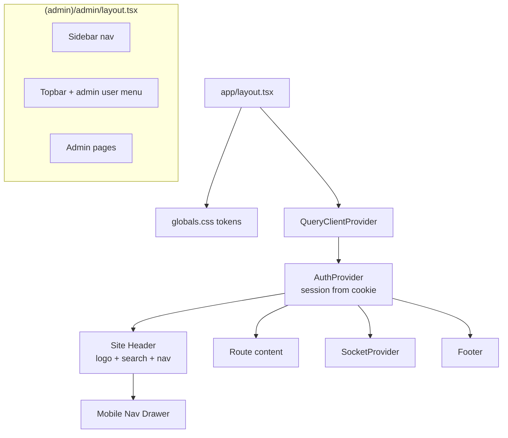
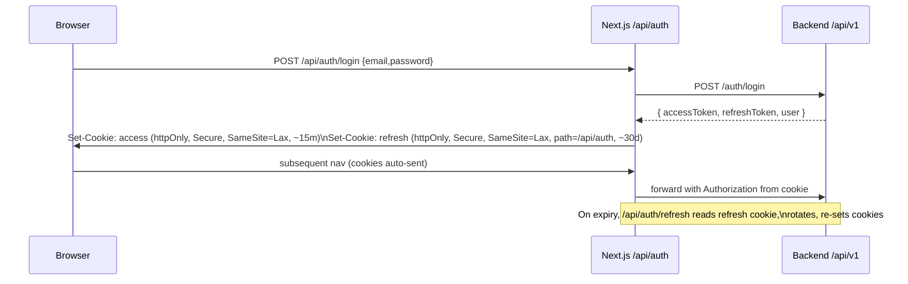
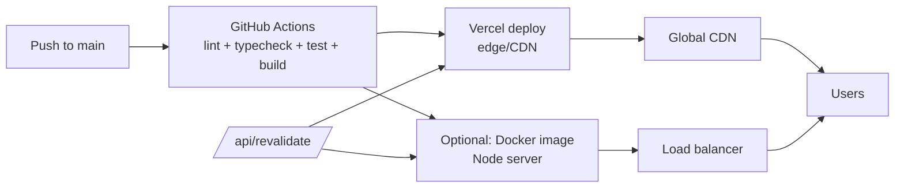

# 02 — Web Architecture (Next.js)

> Architecture for the NewsWatch web application: the reader/reporter site and
> the **admin console** (part of the same Next.js app, mounted under `/admin`).
> Covers the App Router structure, SSR/SSG/ISR strategy for news SEO, state
> management, API layer, auth/token handling, responsive design, admin
> structure, deployment, images, SEO, and accessibility.

Related: [Overview](00-overview.md) · [Mobile](01-mobile-architecture.md) ·
[Backend](03-backend-architecture.md) · [API](04-api.md) ·
[Auth](06-auth-and-authorization.md) · [Tokens](../design-system/00-tokens.md) ·
[Page Index](../01-page-index.md).

Scope note: **no payments/subscriptions/paywall**. All content is public.

---

## 1. Guiding principles

| ID | Principle |
|---|---|
| REQ-SYS-210 | News content is server-rendered for SEO and fast first paint |
| REQ-SYS-211 | Public reading works without JavaScript (progressive enhancement where feasible) |
| REQ-SYS-212 | Admin is a route group with its own shell, gating, and data fetching style |
| REQ-SYS-213 | Tokens are the only source of visual values (CSS variables from `packages/tokens`) |
| REQ-SYS-214 | WCAG 2.1 AA is a release gate |
| REQ-SYS-215 | Client components are opt-in; default to Server Components |

---

## 2. Tech choices

| Concern | Choice |
|---|---|
| Framework | Next.js (App Router) + React + TypeScript |
| Rendering | RSC by default; SSR for personalized; SSG/ISR for public articles |
| Server state | React Query in client components |
| Client state | Zustand (session mirror, UI prefs) |
| Styling | CSS Modules or Tailwind mapped to token CSS variables |
| HTTP (client) | fetch + a typed `apiClient` |
| HTTP (server) | fetch with `next: { revalidate, tags }` |
| Auth | Tokens via httpOnly cookies for web session; see §7 |
| Forms | React Hook Form + Zod (shared schemas) |
| Realtime | socket.io-client (comments) |
| Analytics | Firebase Analytics / GA4 |
| Errors | Sentry (`@sentry/nextjs`) |
| Deployment | Vercel (preferred) or Node server / container behind CDN |

---

## 3. App Router structure

```
apps/web/
├── next.config.mjs            # images domains, headers, redirects, rewrites
├── middleware.ts              # auth guard for /admin and /reporter, locale, headers
├── src/
│   ├── app/
│   │   ├── layout.tsx         # Root: tokens CSS, providers, header, footer
│   │   ├── globals.css        # token CSS variables (from packages/tokens)
│   │   ├── (public)/          # Public reading + reporter route group
│   │   │   ├── page.tsx                 # P07 Home / News Feed
│   │   │   ├── news/[slug]/page.tsx     # P09 Article Detail (ISR)
│   │   │   ├── listing/page.tsx         # P08 News Listing
│   │   │   ├── categories/page.tsx      # P10
│   │   │   ├── category/[slug]/page.tsx # P11 (ISR)
│   │   │   ├── search/page.tsx          # P12/P13
│   │   │   ├── bookmarks/page.tsx       # P15 (client, auth)
│   │   │   ├── notifications/page.tsx   # P17 (client, auth)
│   │   │   ├── profile/page.tsx         # P18/P19 (auth)
│   │   │   ├── settings/page.tsx        # P20 (auth)
│   │   │   ├── about/[page]/page.tsx    # P21 static
│   │   │   └── reporter/                # R01–R04 (auth + role)
│   │   │       ├── dashboard/page.tsx
│   │   │       ├── articles/page.tsx
│   │   │       ├── compose/page.tsx
│   │   │       └── apply/page.tsx
│   │   ├── (auth)/            # P01–P06
│   │   │   ├── login/page.tsx
│   │   │   ├── signup/page.tsx
│   │   │   ├── otp/page.tsx
│   │   │   └── forgot-password/page.tsx
│   │   ├── (admin)/admin/     # A01–A07 (admin shell)
│   │   │   ├── layout.tsx               # Admin sidebar + topbar
│   │   │   ├── login/page.tsx           # A01 (separate auth surface)
│   │   │   ├── page.tsx                 # A02 Dashboard
│   │   │   ├── articles/page.tsx        # A03 Moderation
│   │   │   ├── categories/page.tsx      # A04
│   │   │   ├── users/page.tsx           # A05
│   │   │   ├── reporters/page.tsx       # A06
│   │   │   └── analytics/page.tsx       # A07
│   │   ├── api/               # BFF route handlers (auth cookies, sitemap, revalidate)
│   │   │   ├── auth/login/route.ts
│   │   │   ├── auth/refresh/route.ts
│   │   │   ├── auth/logout/route.ts
│   │   │   └── revalidate/route.ts
│   │   ├── sitemap.ts         # dynamic sitemap from API
│   │   ├── robots.ts
│   │   ├── manifest.ts
│   │   ├── not-found.tsx
│   │   └── error.tsx
│   ├── components/            # Header, Footer, ArticleCard, Chip, Comment, etc.
│   ├── features/              # Client domain hooks (feed, article, comments, admin)
│   ├── lib/
│   │   ├── api/client.ts      # browser apiClient
│   │   ├── api/server.ts      # server fetch with tags/revalidate
│   │   ├── api/endpoints/
│   │   ├── auth/session.ts    # cookie read/write helpers
│   │   ├── seo/metadata.ts
│   │   ├── analytics.ts
│   │   └── socket.ts
│   ├── stores/
│   ├── styles/
│   └── types/
└── public/
```

---

## 4. Rendering strategy (SSR / SSG / ISR)

```mermaid
flowchart TB
  Req[Incoming request] --> Kind{Route type}
  Kind -- Public article --> ISR[ISR: revalidate 60s\n+ on-publish tag revalidate]
  Kind -- Category / Home --> ISR2[ISR: revalidate 60s]
  Kind -- Static page --> SSG[SSG at build]
  Kind -- Bookmarks/Profile/Reporter/Admin --> SSR[SSR per-request\nauth cookie]
  Kind -- Search results --> CSR[Client-side fetch\n(no index for query pages)]
  ISR --> CDN[CDN cache]
  ISR2 --> CDN
  SSG --> CDN
  SSR --> NoCache[no-store]
```

| Route | Strategy | Revalidation | Why |
|---|---|---|---|
| Home `/` | ISR | 60 s + tag `feed` | Fresh, cacheable, SEO |
| Article `/news/[slug]` | ISR (generateStaticParams for recent) | 60 s + tag `article:<slug>` | SEO + fast |
| Category `/category/[slug]` | ISR | 60 s + tag `category:<slug>` | Browse + SEO |
| Static `/about/[page]` | SSG | On deploy | Rarely changes |
| Search `/search` | CSR | — | Query-specific, add `noindex` |
| Bookmarks/Profile/Settings/Reporter | SSR | `no-store` | Personalized |
| Admin `/admin/*` | SSR | `no-store` | Sensitive, always fresh |

| ID | Requirement |
|---|---|
| REQ-SYS-220 | On publish/reject, backend or admin triggers `/api/revalidate?tag=article:<slug>` |
| REQ-SYS-221 | Article/category pages emit canonical URLs and `Article`/`BreadcrumbList` JSON-LD |
| REQ-SYS-222 | Search and other query pages set `robots: noindex,follow` |
| REQ-SYS-223 | Personalized routes are never cached by CDN (`Cache-Control: private, no-store`) |

---

## 5. Data fetching layers

### 5.1 Server fetch (`lib/api/server.ts`)

```ts
export async function serverFetch<T>(
  path: string,
  { tags, revalidate = 60 }: { tags?: string[]; revalidate?: number } = {}
): Promise<T> {
  const res = await fetch(`${API_URL}/api/v1${path}`, {
    headers: { 'X-Internal-Client': 'web' },
    next: { revalidate, tags },
  });
  const json = await res.json();
  if (!json.success) throw new ApiError(json.error);
  return json.data as T;
}
```

### 5.2 Browser fetch (`lib/api/client.ts`)

- Uses `/api` BFF routes for auth-sensitive operations where cookies must be set.
- Otherwise calls the API directly with `credentials: 'include'`.
- On `401 TOKEN_EXPIRED`, calls `/api/auth/refresh` once, then retries.

| ID | Requirement |
|---|---|
| REQ-SYS-230 | Server components use `serverFetch` with cache tags; never expose access tokens |
| REQ-SYS-231 | Client components use React Query with the same `queryKeys` convention as mobile |
| REQ-SYS-232 | All responses are unwrapped from the standard envelope; errors map to typed `ApiError` |

---

## 6. Component & provider architecture



Public and auth pages share the root layout (header/footer). The admin route
group provides its own shell and **does not** render the public header/footer.

---

## 7. Auth & token handling (web)

Two legitimate patterns are supported; pick **httpOnly cookies** for the web
session (recommended) with the BFF pattern.



| ID | Requirement |
|---|---|
| REQ-SYS-240 | Access + refresh tokens stored in `httpOnly`, `Secure`, `SameSite=Lax` cookies |
| REQ-SYS-241 | Refresh cookie scoped to `/api/auth` to limit exposure |
| REQ-SYS-242 | Client never reads tokens from JS; server/middleware reads cookies |
| REQ-SYS-243 | CSRF protection: SameSite + double-submit token on state-changing BFF routes |
| REQ-SYS-244 | `middleware.ts` redirects unauthenticated `/admin/*` and `/reporter/*` to login |
| REQ-SYS-245 | Admin requires role `admin` verified server-side on every request (not just middleware) |

Token TTLs, rotation, and logout semantics are defined in
[Auth & Authorization](06-auth-and-authorization.md).

---

## 8. Admin console architecture (part of web)

```mermaid
flowchart LR
  AdminLogin[A01 Admin Login] --> Guard{Role = admin?}
  Guard -- no --> Deny[403 page]
  Guard -- yes --> Dash[A02 Dashboard]
  Dash --> Mod[A03 Article Moderation]
  Dash --> Cat[A04 Category Management]
  Dash --> Users[A05 User Management]
  Dash --> Appr[A06 Reporter Approvals]
  Dash --> Analytics[A07 Analytics]
  Mod -->|approve/reject/publish| BE[Backend /admin/*]
  Mod -->|unwrap published| Rev[/api/revalidate]
```

| ID | Requirement |
|---|---|
| REQ-SYS-250 | Admin uses table-first layouts with server-side pagination, filters, and sorting |
| REQ-SYS-251 | All admin mutations go through the API with RBAC; UI gating is cosmetic only |
| REQ-SYS-252 | Admin data is never cached (`no-store`); lists refetch after mutations |
| REQ-SYS-253 | Destructive actions require a confirmation dialog with the target name |
| REQ-SYS-254 | Admin is responsive down to tablet; complex tables scroll horizontally on small screens |
| REQ-SYS-255 | Admin analytics reads backend aggregates, not client analytics |

---

## 9. Responsive design

| Breakpoint | Token | Layout |
|---|---|---|
| `xs` 0–390 | `xs` | Single column, stacked nav, larger tap targets |
| `mobile` 0–768 | `mobile` | Single column; hamburger drawer; horizontal category chips |
| `tablet` 769–1024 | `tablet` | Two-column article grid; condensed header |
| `desktop` ≥1025 | `desktop` | Full header with inline search (`search-width` 230px); content max-width 900px; admin sidebar visible |

| ID | Requirement |
|---|---|
| REQ-SYS-260 | Header height follows `header-height-web` (68px) on desktop; collapses on mobile |
| REQ-SYS-261 | Article hero uses `hero-height-web` 470px desktop / `hero-height-mobile` 300px |
| REQ-SYS-262 | Images use responsive `sizes`/`srcset`; no layout shift (explicit dimensions) |
| REQ-SYS-263 | Content column max-width 900px (`content-max-width`) centered with token padding (35px web) |

---

## 10. Image optimization

| ID | Requirement |
|---|---|
| REQ-SYS-270 | Use `next/image` with configured remote patterns for the CDN/storage domains |
| REQ-SYS-271 | Serve modern formats (AVIF/WebP) with fallback; CDN handles transforms |
| REQ-SYS-272 | Hero image `priority` + `sizes`; below-fold images lazy by default |
| REQ-SYS-273 | Blurhash/dominant-color placeholders prevent layout shift |
| REQ-SYS-274 | LCP image preloaded; never render an unbounded full-resolution image |

---

## 11. SEO & metadata

```ts
// lib/seo/metadata.ts (excerpt)
export function articleMetadata(a: Article): Metadata {
  return {
    title: `${a.title} | NewsWatch`,
    description: a.summary,
    alternates: { canonical: `https://newswatch.app/news/${a.slug}` },
    openGraph: {
      type: 'article', title: a.title, description: a.summary,
      images: [{ url: a.heroImage.url, width: a.heroImage.width, height: a.heroImage.height }],
      publishedTime: a.publishedAt, authors: [a.reporter.displayName],
    },
    twitter: { card: 'summary_large_image' },
  };
}
```

| ID | Requirement |
|---|---|
| REQ-SYS-280 | Every public page has title, description, canonical, and OG/Twitter tags |
| REQ-SYS-281 | Articles emit `NewsArticle` JSON-LD (headline, image, datePublished, author, publisher) |
| REQ-SYS-282 | Dynamic `sitemap.ts` (articles + categories) and `robots.ts` |
| REQ-SYS-283 | Clean, slug-based URLs; category and article slugs follow the DB slug strategy |
| REQ-SYS-284 | AMP is NOT required (fast Next.js output + valid structured data suffice) |

---

## 12. Accessibility

| ID | Requirement |
|---|---|
| REQ-SYS-290 | Semantic landmarks (`header`, `nav`, `main`, `article`, `aside`, `footer`) |
| REQ-SYS-291 | Full keyboard operability; visible focus rings using `--purple` |
| REQ-SYS-292 | Text contrast ≥ 4.5:1 for body, ≥ 3:1 for large text |
| REQ-SYS-293 | All images have meaningful `alt`; decorative images `alt=""` |
| REQ-SYS-294 | Forms: labels, error announcements (`aria-live`), field-level messages |
| REQ-SYS-295 | Respect `prefers-reduced-motion`; disable non-essential transitions |
| REQ-SYS-296 | Skip-to-content link; logical heading order (one `h1` per page) |

---

## 13. Realtime & notifications (web)

| ID | Requirement |
|---|---|
| REQ-SYS-300 | Socket.IO client connects after auth; joins article rooms for live comments |
| REQ-SYS-301 | Web push is optional (FCM web) and controlled in Settings; in-app notifications always work |
| REQ-SYS-303 | Realtime failures degrade silently to REST refresh |

---

## 14. Deployment



| ID | Requirement |
|---|---|
| REQ-SYS-310 | Preferred deploy: Vercel (ISR, image optimization, edge CDN) |
| REQ-SYS-311 | Alternative: Dockerized Next.js Node server behind a load balancer |
| REQ-SYS-312 | `NEXT_PUBLIC_*` only for non-secret config; server secrets in deploy env |
| REQ-SYS-313 | Preview deployments per PR; production deploys from `main` |
| REQ-SYS-314 | Auth-related BFF routes require Node runtime (cookies), not edge runtime |

### 14.1 Environment variables (web)

| Var | Scope | Purpose |
|---|---|---|
| `NEXT_PUBLIC_API_URL` | client | API base for browser calls |
| `API_URL` | server | API base for RSC/BFF |
| `NEXT_PUBLIC_SOCKET_URL` | client | Socket.IO endpoint |
| `NEXT_PUBLIC_FIREBASE_*` | client | Analytics / web push |
| `REVALIDATE_SECRET` | server | Protects `/api/revalidate` |
| `SENTRY_DSN` | server/client | Error monitoring |
| `OAUTH_*` (Google/Apple) | server | OAuth redirect flows |

---

## 15. Error handling & monitoring

| ID | Requirement |
|---|---|
| REQ-SYS-320 | `app/error.tsx` + `not-found.tsx` render branded error/404 pages |
| REQ-SYS-321 | Sentry captures RSC, route handler, and client errors with route + release |
| REQ-SYS-322 | Failed mutations show inline errors and preserve user input |
| REQ-SYS-323 | 5xx from API maps to a friendly retry screen; 4xx shows `error.message` |

---

## 16. Testing

| Level | Tooling |
|---|---|
| Unit | Vitest / Jest + Testing Library |
| Component | Testing Library (client components) |
| Integration | Playwright against a mocked or staging API |
| A11y | axe-core in Playwright/Storybook |
| Lighthouse | CI budget for LCP/CLS/SEO on home + article |

| ID | Requirement |
|---|---|
| REQ-SYS-330 | SEO metadata and JSON-LD validated in CI |
| REQ-SYS-331 | Lighthouse performance/accessibility/SEO budgets enforced on public pages |

---

## 17. Mapping to REQ areas

| Area | Web surfaces |
|---|---|
| AUTH | `(auth)` routes + BFF cookie flow (§7) |
| FEED | `/` ISR + React Query client refresh |
| READ | `/news/[slug]` ISR + JSON-LD |
| CAT | `/categories`, `/category/[slug]` |
| SEARCH | `/search` CSR, `noindex` |
| BOOK | `/bookmarks` SSR/auth |
| NOTIF | `/notifications` + optional web push |
| COMMENT | `/news/[slug]` comments + realtime |
| PROF | `/profile` |
| SET | `/settings` |
| REP | `/reporter/*` role-gated |
| ADM | `/admin/*` route group |
| SYS | Rendering strategy, SEO, a11y, deploy |
