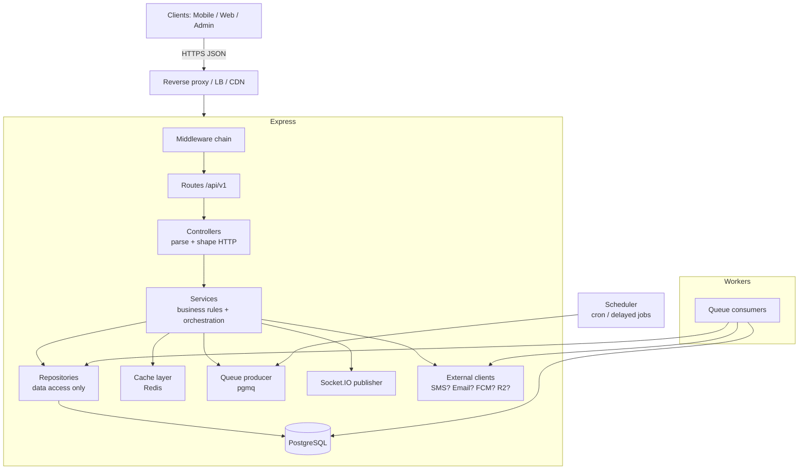
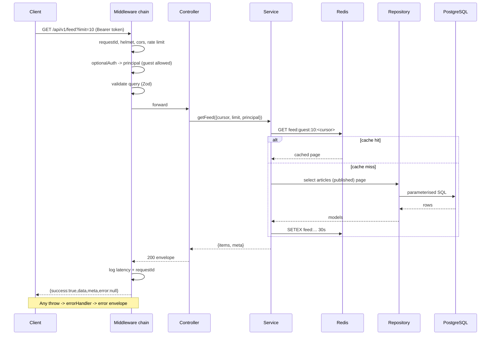
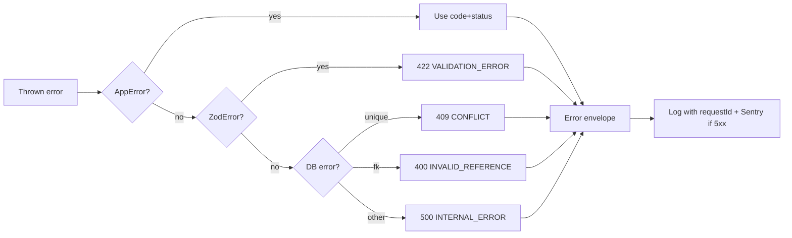
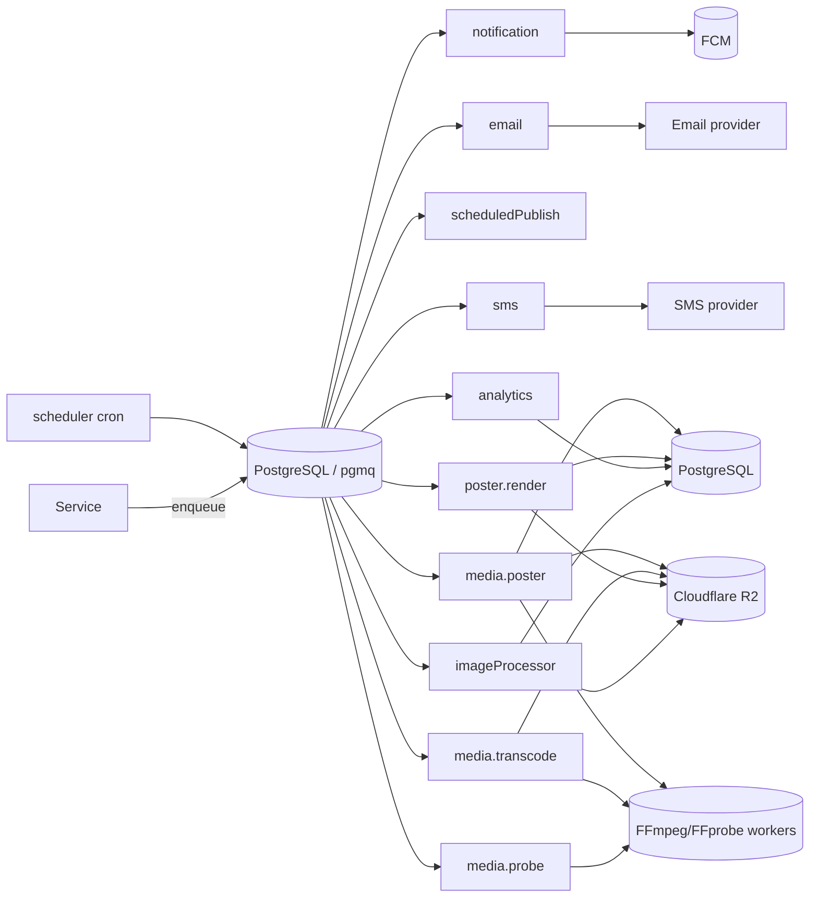
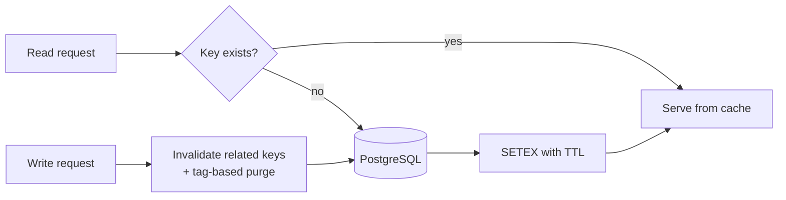
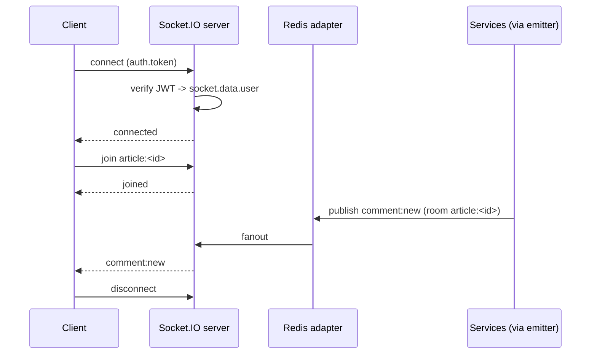
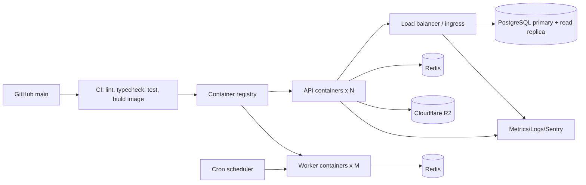

# 03 — Backend Architecture (Node.js + Express)

> Backend platform for NewsWatch. This document defines the layered
> architecture, folder structure, middleware chain, request lifecycle, background
> jobs, realtime gateway, logging/monitoring, caching, file upload flow,
> configuration/secrets, and deployment.

Related: [Overview](00-overview.md) · [API](04-api.md) ·
[Database](05-database.md) · [Auth](06-auth-and-authorization.md) ·
[Integrations](07-third-party-integrations.md) · [Mobile](01-mobile-architecture.md) ·
[Web](02-web-architecture.md).

Scope note: **no payments/subscriptions**. There is no billing module.

---

## 1. Guiding principles

| ID | Principle |
|---|---|
| REQ-SYS-340 | Strict layering: routes → controllers → services → repositories |
| REQ-SYS-341 | Stateless request handling; all shared state in PostgreSQL or Redis |
| REQ-SYS-342 | Validate and authorize at the edge of the request, before business logic |
| REQ-SYS-343 | Async work never blocks the request path (queue + workers) |
| REQ-SYS-344 | Every response uses the standard envelope (see [API](04-api.md)) |
| REQ-SYS-345 | Every request is traceable via a correlation ID |
| REQ-SYS-346 | Fail closed on auth/authorization; fail soft on optional services (realtime, push, cache) |

---

## 2. Layered architecture



### 2.1 Layer responsibilities

| Layer | Owns | Must NOT |
|---|---|---|
| Route | Path + method binding, middleware composition | Contain logic |
| Middleware | Cross-cutting concerns (auth, RBAC, validation, rate limit, errors) | Reach into DB directly |
| Controller | Parse params/query/body, call service, format envelope, set status | Contain business rules |
| Service | Business rules, orchestration, transactions, events | Know about `req`/`res` |
| Repository | SQL/queries via ORM/query builder, row↔model mapping | Contain business rules |
| Worker | Consume jobs, call services/repos, idempotent processing | Serve HTTP |

---

## 3. Folder structure

```
apps/api/
├── src/
│   ├── server.ts                 # http server + socket init
│   ├── app.ts                    # express app assembly (no listen)
│   ├── config/
│   │   ├── env.ts                # env schema + validation (fail fast)
│   │   ├── db/client.ts          # postgres.js + Drizzle
│   │   ├── redis.ts
│   │   ├── logger.ts
│   │   └── constants.ts
│   ├── routes/
│   │   ├── index.ts              # mounts /api/v1 routers
│   │   ├── auth.routes.ts
│   │   ├── users.routes.ts
│   │   ├── articles.routes.ts
│   │   ├── categories.routes.ts
│   │   ├── search.routes.ts
│   │   ├── comments.routes.ts
│   │   ├── reactions.routes.ts
│   │   ├── bookmarks.routes.ts
│   │   ├── notifications.routes.ts
│   │   ├── reporter.routes.ts
│   │   ├── admin.routes.ts
│   │   ├── media.routes.ts
│   │   ├── share.routes.ts
│   │   └── health.routes.ts
│   ├── controllers/
│   ├── services/
│   │   ├── auth.service.ts
│   │   ├── token.service.ts
│   │   ├── article.service.ts
│   │   ├── feed.service.ts
│   │   ├── search.service.ts
│   │   ├── comment.service.ts
│   │   ├── reaction.service.ts
│   │   ├── bookmark.service.ts
│   │   ├── notification.service.ts
│   │   ├── media.service.ts
│   │   ├── poster.service.ts
│   │   ├── reporter.service.ts
│   │   ├── region.service.ts
│   │   ├── appSettings.service.ts
│   │   ├── deletion.service.ts
│   │   └── admin.service.ts
│   ├── repositories/
│   │   ├── user.repo.ts
│   │   ├── article.repo.ts
│   │   ├── comment.repo.ts
│   │   ├── category.repo.ts
│   │   ├── region.repo.ts
│   │   ├── scope.repo.ts
│   │   ├── audit.repo.ts
│   │   ├── reaction.repo.ts
│   │   ├── bookmark.repo.ts
│   │   ├── notification.repo.ts
│   │   ├── device.repo.ts
│   │   └── ...
│   ├── middleware/
│   │   ├── requestContext.ts     # requestId, correlationId, logger
│   │   ├── auth.ts               # verify access token + resolve region scopes
│   │   ├── optionalAuth.ts       # guest-friendly routes
│   │   ├── rbac.ts               # requireRole(...roles)
│   │   ├── regionScope.ts        # region scope-or-descendant guard
│   │   ├── superAdminGuard.ts    # requireSuperAdmin() for privileged routes
│   │   ├── auditLog.ts           # record privileged actions to audit_logs
│   │   ├── validate.ts           # Zod schema binding
│   │   ├── rateLimit.ts
│   │   ├── idempotency.ts
│   │   ├── notFound.ts
│   │   └── errorHandler.ts
│   ├── validators/               # Zod schemas per route
│   ├── jobs/
│   │   ├── queue.ts              # pgmq send/read/archive
│   │   ├── workers/
│   │   │   ├── imageProcessor.worker.ts
│   │   │   ├── mediaProbe.worker.ts      # ffprobe: duration + dimensions
│   │   │   ├── transcode.worker.ts       # ffmpeg: progressive H.264 MP4 + WebM
│   │   │   ├── mediaPoster.worker.ts     # ffmpeg thumbnail -> poster asset
│   │   │   ├── notification.worker.ts
│   │   │   ├── scheduledPublish.worker.ts
│   │   │   ├── email.worker.ts
│   │   │   ├── sms.worker.ts
│   │   │   ├── mediaDelete.worker.ts
│   │   │   ├── posterRender.worker.ts
│   │   │   └── analytics.worker.ts
│   │   └── scheduler.ts          # cron registration
│   ├── realtime/
│   │   ├── io.ts                 # socket server + redis adapter
│   │   ├── auth.ts               # socket handshake auth
│   │   └── handlers/
│   │       └── articleRoom.ts
│   ├── errors/
│   │   ├── AppError.ts           # code, status, message, fields
│   │   └── codes.ts              # error code catalog
│   ├── utils/                    # pagination, slug, crypto, dates, retry
│   └── types/
├── db/                           # dbmate migrations + seed
├── tests/
├── Dockerfile
└── package.json
```

---

## 4. Middleware chain

Order matters. Registered top to bottom in `app.ts`.

```mermaid
flowchart LR
  A[requestContext] --> B[helmet/security headers]
  B --> C[cors]
  C --> D[body parser\njson limit 1mb]
  D --> E[compression]
  E --> F[rateLimit per IP]
  F --> G[route match]
  G --> H[optionalAuth / auth]
  H --> I[rbac]
  I --> I2[regionScope]
  I2 --> I3[superAdminGuard\nprivileged routes]
  I3 --> J[validate params/query/body]
  J --> K[idempotency\nwrites]
  K --> K2[auditLog\nprivileged actions]
  K2 --> L[controller]
  L --> M[errorHandler]
```



| # | Middleware | Responsibility | Notes |
|---|---|---|---|
| 1 | `requestContext` | Generate `requestId` + `correlationId`, attach logger, start timer | First; always runs |
| 2 | `helmet` | Security headers (CSP, HSTS, nosniff) | REQ-SYS-026/020 |
| 3 | `cors` | Allow mobile (`*` for native), web origins, admin origin; credentials for web | Origin allowlist per env |
| 4 | `express.json` | Body parse, 1 MB limit | Larger only on upload meta routes |
| 5 | `compression` | gzip/br responses | Skip for SSE/websocket |
| 6 | `rateLimit` (global + per-route) | Abuse protection | See §11 |
| 7 | `auth` | Verify JWT access token, load principal + region scopes | Sets `req.user` |
| 8 | `optionalAuth` | Populate user if token present, else continue | Feed/read routes |
| 9 | `rbac` | `requireRole('admin','super_admin')`, `requireRole('reporter')` | REQ-SYS-022 |
| 10 | `regionScope` | Enforce that a target `region_id` ∈ `req.user.regionScopes` or a descendant (super_admin bypasses) | REQ-REG-003/004/007 |
| 11 | `superAdminGuard` | `requireSuperAdmin()` for destructive/global routes (deletion, regions, app settings) | REQ-DEL-002/004, REQ-REG-005 |
| 12 | `validate` | Zod parse of `params`/`query`/`body`; 422 on failure | REQ-SYS-023 |
| 13 | `idempotency` | Dedup writes by `Idempotency-Key` | Likes/bookmarks/comments |
| 14 | `auditLog` | Record privileged/destructive actions to `audit_logs` | REQ-DEL-005, REQ-ADS-002 |
| 15 | `errorHandler` | Map thrown errors → envelope | Last |
| 16 | `notFound` | 404 envelope for unmatched routes | Before errorHandler |

### 4.1 Middleware signatures (excerpt)

```ts
export const authenticate = async (req: Request, res: Response, next: NextFunction) => {
  const header = req.header('Authorization');
  if (!header?.startsWith('Bearer ')) throw new AppError('AUTH_REQUIRED', 401);
  const token = header.slice(7);
  const payload = verifyAccessToken(token); // throws TOKEN_EXPIRED / TOKEN_INVALID
  req.user = await userRepo.findPrincipal(payload.sub);
  if (!req.user) throw new AppError('USER_NOT_FOUND', 401);
  next();
};

export const requireRole = (...roles: Role[]) =>
  (req: Request, _res: Response, next: NextFunction) => {
    if (!req.user) throw new AppError('AUTH_REQUIRED', 401);
    if (!roles.includes(req.user.role)) throw new AppError('FORBIDDEN', 403);
    next();
  };

// Super-admin-only guard for destructive/global routes (REQ-DEL, REQ-REG-005, REQ-ADS)
export const requireSuperAdmin = () =>
  (req: Request, _res: Response, next: NextFunction) => {
    if (!req.user) throw new AppError('AUTH_REQUIRED', 401);
    if (req.user.role !== 'super_admin') throw new AppError('FORBIDDEN', 403);
    next();
  };

// Region-scope guard: target region must be in scopes or a descendant.
// Region scopes are resolved by `auth` (req.user.regionScopes); super_admin has ['*'].
export const regionScope = (getRegionId: (req: Request) => Promise<string | null>) =>
  async (req: Request, _res: Response, next: NextFunction) => {
    if (!req.user) throw new AppError('AUTH_REQUIRED', 401);
    if (req.user.role === 'super_admin') return next();
    const regionId = await getRegionId(req);
    if (regionId && !(await regionRepo.isInScope(req.user.regionScopes, regionId))) {
      throw new AppError('OUT_OF_SCOPE', 403);
    }
    next();
  };
```

### 4.2 Validation middleware

```ts
export const validate = (schemas: { body?: ZodType; query?: ZodType; params?: ZodType }) =>
  (req: Request, _res: Response, next: NextFunction) => {
    try {
      if (schemas.params) req.params = schemas.params.parse(req.params);
      if (schemas.query)  req.query  = schemas.query.parse(req.query);
      if (schemas.body)   req.body   = schemas.body.parse(req.body);
      next();
    } catch (e) {
      if (e instanceof ZodError) {
        throw new AppError('VALIDATION_ERROR', 422, 'Validation failed', flatten(e));
      }
      throw e;
    }
  };
```

---

## 5. Request lifecycle



---

## 6. Controllers, services, repositories

### 6.1 Controller contract

- Read only from `req` (params/query/body/`req.user`/`req.context`).
- Call **one** service method.
- Return via a small `respond()` helper for the standard envelope.
- Never import the DB client.

```ts
export const getFeed = asyncHandler(async (req, res) => {
  const result = await feedService.getFeed({
    cursor: req.query.cursor,
    limit: req.query.limit,
    categoryId: req.query.categoryId,
    principal: req.user ?? null,
  });
  return respond(res, 200, result.items, result.meta);
});
```

### 6.2 Service contract

- Stateless; receives plain inputs; returns plain results.
- Owns transactions (`db.transaction(...)`).
- Emits domain events / enqueues jobs after commit.
- Throws `AppError` with a catalog code.

### 6.3 Repository contract

- Only place SQL/ORM lives.
- Returns domain models, not raw rows where practical.
- Always parameterised; no string interpolation of user input.
- Cursor pagination helpers (`buildCursor`, `parseCursor`).

```ts
export const articleRepo = {
  async listPublished({ cursor, limit, categoryId }: ListArgs): Promise<ArticlePage> {
    // WHERE status = 'published' AND deleted_at IS NULL
    // ORDER BY published_at DESC, id DESC
    // cursor on (published_at, id)
  },
};
```

### 6.4 Rich-text storage & sanitization

Article bodies are stored as **sanitized HTML** (`articles.body`,
`body_format = 'rich'`) or as markdown (`body_format = 'markdown'`). The server
is the security boundary: `article.service` runs a `sanitizeHtml` step on every
create/update **before** persistence and never trusts client HTML
(REQ-REP-085).

- Whitelist allowed tags only: `p, br, strong, b, em, i, u, h2, h3, blockquote,
  ul, ol, li, a, span` (+ `s`/`del` optional).
- Whitelist attributes: `href` (http/https/mailto only, `rel="noopener
  noreferrer"`, `target="_blank"`), per-run `style` limited to `color`,
  `background-color`, `font-size`, `font-weight`, `text-decoration`.
- Strip `<script>`, event handlers, `javascript:` URLs, `iframe`, `object`,
  embedded styles outside the whitelist, and inline `data:` images.
- Markdown input is rendered to HTML then sanitized with the same policy;
  store the sanitized HTML (and optionally the source) per `body_format`.
- `headlineStyle` / `descriptionStyle` / `poster` jsonb are validated with Zod
  (hex colour, size ranges) and re-sanitized — never interpolated raw into SSR
  or poster templates (REQ-REP-086..090).

| ID | Requirement |
|---|---|
| REQ-REP-085 | The server MUST sanitize article rich text against a strict tag/attribute/style whitelist before storage and rendering |
| REQ-SYS-347 | Sanitization runs in `article.service` on every write; stored HTML is always render-safe |

### 6.5 `poster.service`

Renders share posters for R05 either **client-side** (canvas/HTML→image) or
**server-side**; the service owns the server render and the canonical default
poster. (REQ-POSTER-001..014)

- Render engine: a headless renderer or canvas library — **`sharp` + `satori`**
  (JSX/HTML→SVG→PNG) or **`resvg`/`@resvg/resvg-js`** — with brand fonts
  embedded so output is pixel-identical across platforms (REQ-POSTER-008).
- Templates: the 5 fixed `poster_template` enum values (Classic, Breaking,
  Minimal, Gradient, Photo Hero); an unknown value throws `INVALID_TEMPLATE`,
  a missing render throws `TEMPLATE_NOT_FOUND` (REQ-POSTER-001).
- Inputs: article title/summary/category + `headlineStyle`/`descriptionStyle` +
  `poster` overrides; Photo Hero composes an owned, `ready` background
  `media_asset` under a dark gradient overlay (REQ-POSTER-007).
- Output: PNG ≥ 1080×1350 (4:5), stored via `media.service` (Cloudflare R2) and
  recorded in `article_posters` (`media_asset_id`, `template`, `width`,
  `height`, `created_by`, `is_default`, `overrides`) (REQ-POSTER-008/012).
- Long renders are off the request path: the endpoint enqueues the
  `poster.render` job and/or returns a cached asset; failures surface as
  `POSTER_RENDER_FAILED` (REQ-POSTER-014).
- Authorization: reporter owner, admin region-scoped, or super_admin
  (REQ-POSTER-013). Rendering is idempotent by `articleId + template + overrides`
  hash so repeated shares reuse the cached asset.

| ID | Requirement |
|---|---|
| REQ-POSTER-008 | Server renders MUST export PNG at a minimum of 1080×1350px with embedded fonts |
| REQ-POSTER-013 | Poster render authorization is owner / scoped admin / super_admin only |
| REQ-POSTER-014 | Render failures return `POSTER_RENDER_FAILED` and are retried via the `poster.render` job |

### 6.6 `media.service` + `transcode.worker`

`media.service` owns the **mixed image/video** upload lifecycle and is the only
place that signs uploads, validates media constraints, and enqueues processing.
Video transcoding runs in dedicated FFmpeg workers consuming **pgmq** (**`transcode.worker`**
plus probe/poster workers), never on the request path (REQ-SYS-343).

- **Kinds & limits.** `media_assets.kind` (type `media_kind`) is `image` or
  `video`. Images: JPG/PNG/WebP ≤ 10 MB. Videos: MP4/WebM/MOV ≤ 200 MB and
  ≤ 180 s. Validated at `/media/sign` and re-checked at `/media/:id/complete`
  (REQ-REP-093/094/095).
- **Uploads.** Single `PUT` for images; **resumable/multipart** (S3 API via
  Cloudflare R2 `CreateMultipartUpload`/`UploadPart`/`CompleteMultipartUpload`) for large
  videos, with one short-lived **presigned PUT URL** per part. `media.service` assembles
  parts on `/media/:id/complete`, then enqueues the pipeline.
- **Pipeline.** `media.probe` (`ffprobe`) → `media.transcode` (`ffmpeg` →
  progressive H.264 MP4 + WebM, optional adaptive renditions) → `media.poster` (thumbnail stored as
  a `kind='image'` asset, linked via `poster_media_id`). Images skip to
  `image.process`. (The `video.process` job named in
  [flows/10-media-upload-flow.md](../flows/10-media-upload-flow.md) is the
  umbrella for this probe→transcode→poster chain.)
- **Status transitions.** Each step writes `media_assets.processing_status` and
  the discriminator `media_assets.kind` (`image`/`video`):
  `pending → processing → ready`, or `→ failed` with `processing_error`; probe
  writes `duration_seconds` (mirrors
  [Database §8.1](05-database.md#81-media-processing-lifecycle-image--video)).
  Attaching non-ready media throws `MEDIA_NOT_READY`; a terminal processing
  failure surfaces `MEDIA_PROCESSING_FAILED`.
- **Optional managed video.** If `VIDEO_PROCESSING_PROVIDER` is set to a managed
  service (e.g. Mux), `media.service` delegates transcode/poster
  to the provider and consumes its verified webhook instead of running FFmpeg;
  the same `processing_status` states and fields are written.
- **Storage & delivery.** All media lives in **Cloudflare R2** via its
  S3 API. Uploads use presigned PUT URLs; private reads use presigned
  GET URLs (`R2_SIGNED_URL_TTL`); large videos use multipart upload. A public
  bucket behind Cloudflare CDN (custom domain) serves public delivery with zero
  egress fees.
- **Cleanup.** `media.delete` removes originals, renditions, and
  poster objects, then invalidates CDN paths.

```ts
// media.service — transcode dispatch (after multipart assembly)
if (asset.kind === 'video') {
  await mediaQueue.add('media.probe', { assetId: asset.id }, { jobId: `probe:${asset.id}` });
} else {
  await mediaQueue.add('image.process', { assetId: asset.id }, { jobId: `img:${asset.id}` });
}
```

| ID | Requirement |
|---|---|
| REQ-REP-093 | Hero media may be an image OR a video; `media.service` validates kind and enforces exactly one hero |
| REQ-REP-094 | Mixed image/video gallery is supported; `kind` mirrors the referenced asset |
| REQ-REP-095 | `media.service` validates type/size/duration before signing and re-checks on completion (image ≤ 10 MB; video ≤ 200 MB, ≤ 3 min) |
| REQ-REP-096 | Videos are transcoded server-side to progressive H.264 MP4 + WebM (optional adaptive renditions) and a poster is generated |
| REQ-REP-097 | Video upload is resumable/chunked with progress, retry, and cancel |
| REQ-REP-098 | Reporter can reorder mixed media and set a video poster/thumbnail |
| REQ-REP-099 | Delete/replace updates `processing_status` and detaches the asset; only `ready` media may attach |
| REQ-SYS-359 | Video transcode/probe/poster run in dedicated workers with retry + dead-letter; failures never block reading (REQ-SYS-346) |

---

## 7. Error handling

`AppError` carries an API error code, HTTP status, message, and optional fields.

```ts
export class AppError extends Error {
  constructor(
    public code: ErrorCode,
    public status = 400,
    message?: string,
    public fields?: Record<string, string>,
    public meta?: Record<string, unknown>,
  ) { super(message ?? code); }
}
```

`errorHandler` maps:
- `AppError` → its status + envelope with `error.code`.
- Zod (uncaught) → 422 `VALIDATION_ERROR`.
- Unique violation (Postgres `23505`) → 409 `CONFLICT`.
- Unknown → 500 `INTERNAL_ERROR`; log stack; never leak to client.



---

## 8. Background jobs

Queue: **pgmq** (PostgreSQL message queue extension). Producers enqueue from
services after DB commit; consumers are separate processes polling queues.



| Queue | Trigger | Work | Idempotency |
|---|---|---|---|
| `image.process` | Upload confirmed (`kind='image'`) | Resize/optimise, generate variants + blurhash, write `media_assets` dimensions | By asset id |
| `media.probe` | Video upload completed | `ffprobe` duration + dimensions; validate duration ≤ 180 s; set `codec`, `processing_status='processing'` | By asset id |
| `media.transcode` | After `media.probe` succeeds | `ffmpeg` transcode to progressive H.264 MP4 (faststart) + WebM (optional adaptive renditions); write `url`, `variants`, `codec` | By asset id + rendition |
| `media.poster` | After `media.transcode` succeeds | `ffmpeg` extract poster/thumbnail, store as image asset, link `poster_media_id`; advance `processing_status` to `ready` | By asset id |
| `notification.push` | Comment reply, like, publish, breaking, reporter status | Resolve devices, batch send via FCM, record delivery | By event id |
| `article.scheduledPublish` | Reporter sets `scheduledAt` | Publish when due; status history | By article id + run time |
| `email.send` | OTP, password reset | Send transactional email | By message id |
| `sms.send` | OTP | Send OTP SMS | By message id |
| `analytics.ingest` | Client/server events | Persist `analytics_events`, aggregate counters | By event id |
| `media.delete` | Article hard delete | Delete Cloudflare R2 objects + CDN invalidation | By asset id |
| `poster.render` | Poster render request or template/size change (R05) | Render poster PNG (headless/canvas), store as `media_asset`, upsert `article_posters` default | By article id + template + overrides hash |
| `feed.warm` | After publish | Warm Redis feed caches | Best effort |

| ID | Requirement |
|---|---|
| REQ-SYS-350 | Jobs are idempotent and safe to retry |
| REQ-SYS-351 | Exponential backoff with max attempts; terminal failures go to a dead-letter queue + alert |
| REQ-SYS-352 | Scheduled publishing is checked at least every minute |
| REQ-SYS-353 | Push/email/SMS failures never fail the originating request (REQ-SYS-346) |
| REQ-SYS-354 | Media processing completes before an article can be published with that image |

### 8.1 Job envelope

```ts
type JobPayload<T> = {
  eventId: string;      // idempotency key
  occurredAt: string;   // ISO-8601
  correlationId: string;
  data: T;
};
```

---

## 9. Configuration & secrets

`config/env.ts` uses Zod to validate `process.env` at boot; the process exits if
invalid.

| Group | Vars (examples) | Secret? |
|---|---|---|
| Core | `NODE_ENV`, `PORT`, `API_BASE_PATH=/api/v1`, `LOG_LEVEL` | no |
| DB | `DATABASE_URL`, `PG_POOL_MAX` | **yes** |
| Redis | `REDIS_URL` | **yes** |
| JWT | `JWT_ACCESS_SECRET`, `JWT_REFRESH_SECRET`, `ACCESS_TTL=15m`, `REFRESH_TTL=30d` | **yes** |
| Storage (Cloudflare R2) | `R2_ACCOUNT_ID`, `R2_ACCESS_KEY_ID`, `R2_SECRET_ACCESS_KEY`, `R2_BUCKET`, `R2_ENDPOINT`, `R2_PUBLIC_BASE_URL`, `R2_SIGNED_URL_TTL` | **yes** |
| FCM | `FIREBASE_PROJECT_ID`, `FIREBASE_CLIENT_EMAIL`, `FIREBASE_PRIVATE_KEY` | **yes** |
| OAuth | `GOOGLE_CLIENT_ID/SECRET`, `APPLE_CLIENT_ID/TEAM_ID/KEY_ID/PRIVATE_KEY` | mixed |
| OTP | `SMS_PROVIDER_KEY`, `EMAIL_PROVIDER_KEY`, `OTP_TTL=300`, `OTP_LENGTH=6` | **yes** |
| Realtime | `SOCKET_CORS_ORIGIN`, `SOCKET_PATH=/socket.io` | no |
| Sentry | `SENTRY_DSN` | **yes** |

| ID | Requirement |
|---|---|
| REQ-SYS-360 | Secrets are injected via a managed secret store, never committed |
| REQ-SYS-361 | `.env` is git-ignored; `.env.example` documents required keys with fake values |
| REQ-SYS-362 | Secrets never appear in logs, error payloads, or analytics |
| REQ-SYS-363 | Rotation supported without code changes (read at boot, restart to pick up) |

---

## 10. Caching (Redis)



| Cache | Key pattern | TTL | Invalidation |
|---|---|---|---|
| Feed page | `feed:{scope}:{limit}:{cursor}` | 30–60 s | On publish/reject/unpublish (`feed:*`) |
| Category articles | `cat:{slug}:{limit}:{cursor}` | 60 s | On article publish in category |
| Article body | `article:{slug}` | 300 s | On article update/publish/unpublish |
| Categories list | `categories:all` | 600 s | On category CRUD |
| Search results | `search:{hash(q+filters)}` | 60 s | Time-based only |
| Counters (likes/comments) | `count:{type}:{id}` | 30 s | On reaction/comment write |
| Rate limit counters | `rl:{scope}:{key}` | window | Automatic |
| Socket.io rooms | Redis pub/sub adapter | — | — |

| ID | Requirement |
|---|---|
| REQ-SYS-370 | Cache is read-through for reads; write-through invalidation by tag on writes |
| REQ-SYS-371 | Cache failures degrade to DB reads; never fail the request (REQ-SYS-346) |
| REQ-SYS-372 | Key versioning (`v1:`) allows safe schema changes without stale reads |
| REQ-SYS-373 | Per-user personalized responses are not cached in shared cache |

---

## 11. Rate limiting

Layered, using Redis token buckets.

| Scope | Key | Default limit | Applied to |
|---|---|---|---|
| Global per IP | `rl:ip:{ip}` | 300 req / 5 min | All requests |
| Auth per IP | `rl:auth:{ip}` | 10 req / 15 min | `/auth/login`, `/auth/otp/*` |
| OTP per phone/email | `rl:otp:{identifier}` | 5 req / 15 min | `/auth/otp/request` |
| Authenticated per user | `rl:user:{userId}` | 600 req / 5 min | Authenticated routes |
| Writes per user | `rl:write:{userId}` | 60 req / 5 min | Comments/likes/bookmarks |
| Search | `rl:search:{ip}` | 60 req / 5 min | `/search` |
| Upload | `rl:upload:{userId}` | 30 req / hour | `/media/upload` |
| Admin | `rl:admin:{userId}` | 300 req / 5 min | `/admin/*` |

| ID | Requirement |
|---|---|
| REQ-SYS-380 | Exceeded limits return `429 RATE_LIMITED` with `Retry-After` |
| REQ-SYS-381 | OTP requests are limited per identifier AND per IP to stop SMS abuse |
| REQ-SYS-382 | Rate limit state lives in Redis so limits hold across instances |

---

## 12. Authentication & authorization in the backend

Handled by `auth` + `rbac` middleware and `auth.service`/`token.service`. Full
design in [06-auth-and-authorization.md](06-auth-and-authorization.md).

| Concern | Location |
|---|---|
| Issue access/refresh on login/verify/OAuth | `token.service.ts` |
| Rotation + reuse detection | `token.service.ts` |
| Password hashing (argon2/bcrypt) | `auth.service.ts` |
| OTP generation/verify | `auth.service.ts` + `otp_codes` |
| RBAC role checks | `rbac.ts` middleware |
| Region-scope resolution + checks | `auth.ts` (resolve scopes) + `regionScope.ts` (enforce) |
| Super-admin-only guard | `superAdminGuard.ts` |
| Reporter approval gating | `reporter.middleware` / service guard |

### 12.1 Deletion

Deletion is split by entity per the authoritative policy in
[08-roles-regions-and-deletion.md](08-roles-regions-and-deletion.md) and the
schema in [05-database.md](05-database.md) §7.

**Users — soft-delete repository pattern (super admin only).**

- `user.repo.softDelete(id, actorId)`: sets `is_deleted = true`,
  `deleted_at = now()`, `deleted_by = actorId`; never issues a physical
  `DELETE` (REQ-DEL-001/002).
- `user.repo.restore(id)`: clears the flags and sets `restored_at`.
- `user.repo.purge(id)`: the only hard delete, gated by `requireSuperAdmin` and
  typed confirmation; anonymises PII (REQ-DEL-005).
- All normal queries include `WHERE is_deleted = false`; super-admin "include
  deleted" views opt in via an explicit filter (REQ-DEL-006).
- Auth rejects soft-deleted users with `401 ACCOUNT_DELETED` (REQ-DEL-003).

**Articles — hard-delete service (super admin only).**

- `deletion.service.hardDeleteArticle(id, actorId)` runs in one transaction:
  cascade-remove dependents (`article_images`, `article_categories`,
  `article_tags`, `reactions`, `bookmarks`, `comments`,
  `article_status_history`) then the article row (REQ-DEL-004).
- After commit, media objects are queued for deletion (`media.delete` job →
  Cloudflare R2 delete + CDN invalidation).
- Admin/reporter deletes remain **soft** status changes (`deleted` /
  `unpublished`) within region scope.

**Audit.** Every soft delete, restore, purge, and hard delete calls
`audit.repo.record(...)`, writing an immutable `audit_logs` row
(actor, action, target, before/after meta, ip) — also applied to app-settings
changes (REQ-DEL-005, REQ-ADS-002).

**App settings — application service.**

- `appSettings.service` reads the public subset (`is_public = true`) for
  `GET /app-settings` and the full set for super-admin routes.
- Writes are `requireSuperAdmin` + `auditLog`, versioned (before/after in meta)
  — REQ-ADS-001/002/003.

**Audit logging middleware.** `auditLog.ts` wraps privileged route groups
(`/admin/users/*`, `/admin/articles/*`, `/admin/regions/*`,
`/admin/app-settings`, `/admin/audit-logs`) and records the action after a
successful handler; it never blocks the response on audit failure but alerts.

| ID | Requirement |
|---|---|
| REQ-SYS-355 | User deletion is soft (`is_deleted=true`); only explicit super-admin purge physically removes a user |
| REQ-SYS-356 | Article hard delete runs in a transaction and cascades dependents before media cleanup is queued |
| REQ-SYS-357 | Every privileged/destructive action is written to `audit_logs` with actor, target, and before/after meta |
| REQ-SYS-358 | Region scope is resolved per-request and enforced by `regionScope.ts`; only `super_admin` bypasses it |

---

## 13. Socket.IO realtime gateway



| Namespace/Room | Events emitted | Events received |
|---|---|---|
| `article:<id>` | `comment:new`, `comment:updated`, `comment:deleted`, `reaction:update`, `comment:count` | `join`, `leave` |
| `user:<id>` | `notification:new`, `article:status` | — |

| ID | Requirement |
|---|---|
| REQ-SYS-390 | Socket handshake verifies the access token; invalid → disconnect with error |
| REQ-SYS-391 | Horizontal scaling via `@socket.io/redis-adapter` |
| REQ-SYS-392 | Rooms are authorization-checked on join where private |
| REQ-SYS-393 | Realtime emits are best-effort; REST remains the source of truth |
| REQ-SYS-394 | Rate-limit socket events per connection |

---

## 14. File upload flow

Media (images and videos) is uploaded **directly to object storage** via signed
URLs to keep payloads off the API. Small images use a single signed `PUT`; large
videos use **resumable/multipart** uploads with per-part signed URLs. A fallback
proxy upload exists for small clients.

```mermaid
sequenceDiagram
  participant App
  participant API as media.service
  participant R2 as Cloudflare R2 (S3 API)
  participant W as media.probe -> transcode -> poster
  participant CDN
  App->>API: POST /media/sign {kind, contentType, size, uploadType}
  API->>API: validate kind/type/size/duration + rate limit
  alt image or small single upload
    API-->>App: { uploadUrl, assetId, key }
    App->>R2: PUT file (presigned PUT URL)
  else large video (multipart)
    API-->>App: { assetId, uploadId, partUrls[] }
    App->>R2: UploadPart x N (presigned PUT per part)
    R2-->>App: ETag per part
  end
  App->>API: POST /media/:id/complete {parts?, etag?}
  API->>API: assemble parts; re-check size/duration
  API->>W: enqueue media.probe {assetId}
  W->>R2: ffprobe original (duration, dimensions)
  W->>R2: ffmpeg transcode -> progressive H.264 MP4 + WebM
  W->>R2: ffmpeg poster -> image asset
  W->>API: update media_assets (processing_status=ready, codec, poster_media_id, variants)
  App->>API: GET /media/:id (poll) or media:status socket event -> ready
  API-->>App: { url: CDN url, poster, durationSec, variants }
```

Status transitions are written by the workers (`pending → processing → ready`,
or `→ failed` with `processing_error`); see
[Database §8.1](05-database.md#81-media-processing-lifecycle-image--video).
Long uploads survive interruptions: the client can re-`UploadPart` without
restarting the whole file, and completion is idempotent by `uploadId`.

| ID | Requirement |
|---|---|
| REQ-SYS-400 | Allowed image types: image/jpeg, image/png, image/webp; max 10 MB per image |
| REQ-SYS-400A | Allowed video types: video/mp4, video/webm, video/quicktime; max 200 MB and ≤ 180 s |
| REQ-SYS-401 | Signed URLs are short-lived (≤ 10 min; part URLs ≤ 60 min) and scoped to one object key/part |
| REQ-SYS-402 | Uploads are owned by the uploading user (`media_assets.owner_id`) |
| REQ-SYS-403 | Image processing generates responsive variants (e.g. 320/640/1024/1600) + blurhash |
| REQ-SYS-403A | Videos are transcoded to progressive H.264 MP4 + WebM (optional adaptive renditions) and get a generated poster |
| REQ-SYS-404 | Only `processing_status='ready'` assets may be attached to a published article (REQ-REP-099) |
| REQ-SYS-405 | Original filenames are sanitised; storage keys are UUID-based |
| REQ-SYS-406 | Deletion is soft; CDN invalidation + object cleanup on hard delete by admin |
| REQ-SYS-406A | Large video uploads support resumable/multipart parts with idempotent completion |

---

## 15. Logging, metrics & monitoring

| Concern | Tool | Notes |
|---|---|---|
| Structured logs | pino (JSON) | `requestId`, `correlationId`, `userId`, route, latency |
| Errors | Sentry | 5xx and unhandled exceptions; no PII |
| Metrics | Prometheus-style counters/histograms or hosted APM | RPS, latency p95, error rate, queue depth, DB pool |
| Health | `/health` (liveness), `/ready` (DB+Redis ping) | For LB/orchestrator |
| Tracing | correlationId propagation | Across API → workers → integrations |

| ID | Requirement |
|---|---|
| REQ-SYS-410 | Every log line includes `requestId` and route; 5xx logs include stack |
| REQ-SYS-411 | Never log tokens, passwords, OTPs, or full request bodies with PII |
| REQ-SYS-412 | Alert on error rate, p95 latency, queue backlog, and DB connection saturation |
| REQ-SYS-413 | `/health` returns 200 without touching dependencies; `/ready` checks DB + Redis |

### 15.1 Log shape (excerpt)

```json
{
  "level": "info",
  "time": "2026-09-22T10:15:00Z",
  "requestId": "b1e2...",
  "correlationId": "b1e2...",
  "route": "GET /api/v1/feed",
  "status": 200,
  "latencyMs": 42,
  "userId": "a1f0..."
}
```

---

## 16. Transactions & consistency

| ID | Requirement |
|---|---|
| REQ-SYS-420 | Multi-step writes (article + images + categories, comment + counters) run in a DB transaction |
| REQ-SYS-421 | Side effects (push, email, socket) are enqueued **after** commit |
| REQ-SYS-422 | Counters (likes, comments) are updated in the same transaction as the row change |
| REQ-SYS-423 | Idempotency keys prevent duplicate likes/bookmarks/comments on retries |
| REQ-SYS-424 | Article publish is atomic with `article_status_history` + cache invalidation enqueue |

---

## 17. API versioning & compatibility

| ID | Requirement |
|---|---|
| REQ-SYS-430 | All routes live under `/api/v1`; breaking changes introduce `/api/v2` |
| REQ-SYS-431 | Additive, backward-compatible changes ship within v1 |
| REQ-SYS-432 | Deprecations are announced via response header `Sunset` and docs |

---

## 18. Deployment



| ID | Requirement |
|---|---|
| REQ-SYS-440 | API and workers are separate deployables scaling independently |
| REQ-SYS-441 | Rolling deploys with readiness gating; zero-downtime migrations (expand/contract) |
| REQ-SYS-442 | At least 2 API instances in prod for availability (REQ-SYS-030) |
| REQ-SYS-443 | `/api/v1/health` excluded from auth and rate limiting |
| REQ-SYS-444 | DB migrations run as a pre-deploy job, never at app start |

### 18.1 Docker (sketch)

```dockerfile
FROM node:20-alpine AS build
WORKDIR /app
COPY package*.json ./
RUN npm ci
COPY . .
RUN npm run build

FROM node:20-alpine
WORKDIR /app
ENV NODE_ENV=production
COPY --from=build /app/dist ./dist
COPY --from=build /app/node_modules ./node_modules
CMD ["node", "dist/server.js"]
```

---

## 19. Testing

| Level | Tooling | Scope |
|---|---|---|
| Unit | Jest/Vitest | Services, utils, validators |
| Integration | Supertest + test DB | Routes + middleware + repos |
| Contract | Schema tests | Envelope, error codes, pagination |
| Worker | Jest + fake queue | Idempotency + retry |
| Load | k6 | Feed/article read throughput |

| ID | Requirement |
|---|---|
| REQ-SYS-450 | Every endpoint has an integration test covering success + auth failure + validation failure |
| REQ-SYS-451 | Error codes asserted against the catalog in [04-api.md](04-api.md) |
| REQ-SYS-452 | Migrations tested forward on a fresh DB in CI |

---

## 20. Mapping to REQ areas

| Area | Backend services |
|---|---|
| AUTH | auth, token, OTP, OAuth |
| FEED | feed, article (published query) |
| READ | article (by slug, increment views) |
| CAT | category |
| SEARCH | search (tsvector) |
| BOOK | bookmark |
| NOTIF | notification + push worker |
| COMMENT | comment, reaction (realtime emit) |
| PROF | user profile |
| SET | user settings/preferences |
| REP | reporter (create/submit/status) + scheduled publish |
| MEDIA | media.service (sign/complete/status, resumable uploads), image.process/media.probe/transcode/media.poster/media.delete workers (FFmpeg) |
| POSTER | poster.service (render + default poster), article.service (body_format, headlineStyle/descriptionStyle, poster metadata), poster.render/media.delete workers |
| REG | region, scope (regionScope middleware, region.repo, scope.repo) |
| DEL | deletion service, user soft-delete repo, media.delete worker, audit.repo |
| ADS | appSettings.service + auditLog middleware |
| ADM | admin (moderation, categories, users, approvals, regions, settings, analytics, audit) |
| SYS | middleware, caching, jobs, realtime, health, logging, audit |
