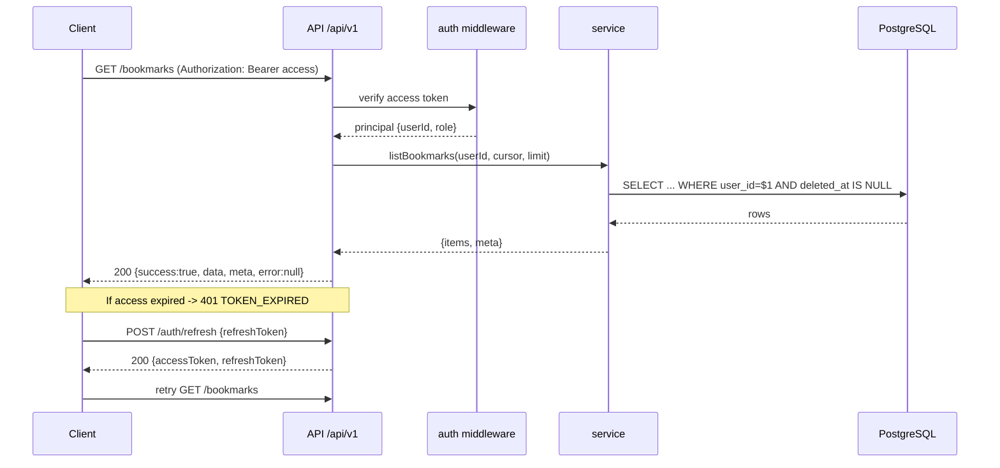

# 04 — REST API Contract (`/api/v1`)

> Complete REST contract for NewsWatch. Every client (mobile, web, admin) uses
> this API. This document is normative: field names, types, validation, status
> codes, envelopes, and error codes are exact.

Related: [Overview](00-overview.md) · [Backend](03-backend-architecture.md) ·
[Database](05-database.md) · [Auth](06-auth-and-authorization.md) ·
[Conventions §7–8](../02-conventions.md).

Scope note: **no payments/subscriptions/paywall endpoints exist.** All published
content is free and readable by guests.

---

## 1. Conventions

### 1.1 Base URL & versioning

| Item | Value |
|---|---|
| Base path | `/api/v1` |
| Content type | `application/json; charset=utf-8` |
| Time format | ISO-8601 UTC (`2026-09-22T10:15:00Z`) |
| IDs | UUID v4 strings |
| Breaking changes | New major path `/api/v2`; v1 kept during sunset |

### 1.2 Headers

| Header | Sent by | Required | Purpose |
|---|---|---|---|
| `Authorization: Bearer <accessToken>` | client | Protected routes | Auth |
| `Content-Type: application/json` | client | Body requests | Parsing |
| `Accept-Language` | client | No | Localisation-ready (English only in v1) |
| `X-Device-Id` | mobile | Recommended | Device-scoped features |
| `X-App-Version` | clients | Recommended | Compatibility/telemetry |
| `Idempotency-Key` | client | Writes | Dedup likes/bookmarks/comments |
| `X-Request-Id` | client | No | Client-generated correlation |
| `Retry-After` | server | On 429/503 | Backoff hint |

### 1.3 Standard response envelope

Success:

```json
{
  "success": true,
  "data": {},
  "meta": {},
  "error": null
}
```

Error:

```json
{
  "success": false,
  "data": null,
  "error": {
    "code": "VALIDATION_ERROR",
    "message": "Email is required",
    "fields": { "email": "required" }
  }
}
```

- `data` is `null` on error.
- `meta` is `{}` when unused; list endpoints always populate it.
- `error.fields` is present (possibly `{}`) on validation/conflict errors.

### 1.4 Pagination (cursor-based)

All list endpoints accept:

| Query | Type | Default | Max | Notes |
|---|---|---|---|---|
| `cursor` | string (opaque) | — | — | From previous `meta.nextCursor` |
| `limit` | integer | 20 | 50 | Items per page |

List `meta`:

```json
{
  "nextCursor": "eyJwdWJsaXNoZWRBdCI6IjIwMjYtMDktMjJUMTA6MTU6MDBaIiwiaWQiOiJhMWYwIn0=",
  "hasMore": true,
  "limit": 20,
  "total": 1342
}
```

| ID | Requirement |
|---|---|
| REQ-SYS-460 | Cursor encodes the sort key tuple; clients must treat it as opaque |
| REQ-SYS-461 | Invalid/expired cursor returns `400 INVALID_CURSOR` |
| REQ-SYS-462 | `meta.total` is optional; provided only on admin/cheap count routes |

### 1.5 Filtering & sorting

| Pattern | Example | Applies to |
|---|---|---|
| Equality filter | `?categoryId=<uuid>` | feeds |
| Multi-value | `?status=pending&status=draft` | admin lists |
| Date range | `?from=2026-09-01&to=2026-09-22` | analytics, admin |
| Sort | `?sort=publishedAt` + `?order=desc` | admin lists, search |
| Text | `?q=...` | search |

Allowed sort fields are whitelisted per endpoint; unknown fields → `400
INVALID_SORT`.

### 1.6 Idempotency

State-changing routes (`POST /like`, `POST /bookmarks`, `POST /comments`)
accept an `Idempotency-Key`. Replaying the same key within 24 h returns the
original result instead of creating a duplicate.

### 1.7 Rate limits (summary)

| Scope | Limit | Response |
|---|---|---|
| Global per IP | 300 / 5 min | 429 `RATE_LIMITED` |
| Auth endpoints per IP | 10 / 15 min | 429 `RATE_LIMITED` |
| OTP per identifier | 5 / 15 min | 429 `OTP_RATE_LIMITED` |
| Authenticated per user | 600 / 5 min | 429 `RATE_LIMITED` |
| Writes per user | 60 / 5 min | 429 `RATE_LIMITED` |
| Upload per user | 30 / hour | 429 `RATE_LIMITED` |

See [Backend §11](03-backend-architecture.md#11-rate-limiting).

### 1.8 Error code catalog

| Code | HTTP | Meaning |
|---|---|---|
| `VALIDATION_ERROR` | 422 | One or more fields invalid |
| `INVALID_CURSOR` | 400 | Malformed/expired pagination cursor |
| `INVALID_SORT` | 400 | Unsupported sort field/order |
| `AUTH_REQUIRED` | 401 | Missing/invalid Authorization |
| `TOKEN_INVALID` | 401 | Access token malformed/bad signature |
| `TOKEN_EXPIRED` | 401 | Access token expired (refresh expected) |
| `REFRESH_INVALID` | 401 | Refresh token invalid/expired/reused |
| `OTP_INVALID` | 400 | OTP incorrect |
| `OTP_EXPIRED` | 400 | OTP expired |
| `OTP_RATE_LIMITED` | 429 | Too many OTP requests |
| `INVALID_CREDENTIALS` | 401 | Email/password wrong |
| `ACCOUNT_LOCKED` | 423 | Too many failed attempts |
| `ACCOUNT_DISABLED` | 403 | Account suspended |
| `ACCOUNT_DELETED` | 401 | Account soft-deleted (cannot authenticate) |
| `EMAIL_NOT_VERIFIED` | 403 | Verification required |
| `OAUTH_FAILED` | 401 | Google/Apple exchange failed |
| `FORBIDDEN` | 403 | Authenticated but not allowed |
| `REPORTER_NOT_APPROVED` | 403 | Reporter pending/rejected |
| `USER_NOT_FOUND` | 404 | User missing |
| `NOT_FOUND` | 404 | Generic resource missing |
| `ARTICLE_NOT_FOUND` | 404 | Article missing/unpublished |
| `CATEGORY_NOT_FOUND` | 404 | Category missing |
| `COMMENT_NOT_FOUND` | 404 | Comment missing |
| `MEDIA_NOT_FOUND` | 404 | Asset missing |
| `CONFLICT` | 409 | Unique constraint violation |
| `SLUG_TAKEN` | 409 | Slug/username/email already exists |
| `ALREADY_LIKED` | 409 | Duplicate like without idempotency |
| `NOT_LIKED` | 409 | Unlike without existing like |
| `ALREADY_BOOKMARKED` | 409 | Duplicate bookmark |
| `NOT_BOOKMARKED` | 409 | Remove bookmark not present |
| `ALREADY_FOLLOWING` | 409 | Duplicate follow |
| `NOT_FOLLOWING` | 409 | Unfollow not present |
| `INVALID_STATUS_TRANSITION` | 409 | Illegal article state change |
| `REGION_HAS_CHILDREN` | 409 | Region delete blocked: has child regions |
| `REGION_HAS_ARTICLES` | 409 | Region delete blocked: has articles |
| `OUT_OF_SCOPE` | 403 | Target region not in actor's scope |
| `MEDIA_NOT_READY` | 409 | Attach asset still processing |
| `MEDIA_PROCESSING_FAILED` | 422 | Media transcode/probe/poster step failed |
| `POSTER_RENDER_FAILED` | 502 | Server-side poster render/export failed |
| `INVALID_TEMPLATE` | 422 | Poster template value not in the allowed enum |
| `TEMPLATE_NOT_FOUND` | 404 | Requested poster template does not exist |
| `UNSUPPORTED_MEDIA_TYPE` | 415 | Upload type not allowed (image JPG/PNG/WebP; video MP4/WebM/MOV) |
| `VIDEO_TOO_LARGE` | 413 | Video exceeds the 200 MB limit |
| `VIDEO_TOO_LONG` | 422 | Video exceeds the 3-minute (180 s) limit |
| `PAYLOAD_TOO_LARGE` | 413 | Body/file exceeds limit |
| `RATE_LIMITED` | 429 | Too many requests |
| `REVALIDATE_FAILED` | 502 | Cache tag revalidation failed |
| `UPSTREAM_ERROR` | 502 | SMS/email/FCM/OAuth provider error |
| `SERVICE_UNAVAILABLE` | 503 | Temporary outage/maintenance |
| `INTERNAL_ERROR` | 500 | Unhandled server error |

### 1.9 Typical authenticated request (sequence)



### 1.10 Shared object shapes

```ts
type UserSummary = {
  id: string; username: string; displayName: string;
  avatarUrl: string | null; role: 'user' | 'reporter' | 'admin' | 'super_admin';
  isVerifiedReporter: boolean;
};

type CategorySummary = {
  id: string; name: string; slug: string; colorToken?: string | null;
  articleCount?: number;
};

type ImageVariant = { url: string; width: number; height: number };

type MediaKind = 'image' | 'video';
type MediaProcessingStatus = 'pending' | 'processing' | 'ready' | 'failed';

// A generated still (image asset) and/or video rendition.
type MediaPoster = {
  mediaId: string; url: string; width: number; height: number;
};

type VideoRendition = {
  label: string;           // e.g. '720p', 'webm'
  url: string;             // progressive H.264/AAC MP4 or WebM
  mimeType: string;        // video/mp4 | video/webm
  width?: number; height?: number; bitrateKbps?: number;
};

type ArticleImage = {
  id: string; url: string; width: number; height: number;
  alt: string; blurhash: string | null;
  variants: ImageVariant[];
};

// Mixed image/video gallery item (maps to the article_images table).
type ArticleMedia = {
  id: string;
  kind: MediaKind;                 // 'image' | 'video'
  position: number;
  isHero: boolean;
  alt: string | null;
  image: ArticleImage | null;      // present when kind='image'
  video: {
    url: string | null;            // canonical progressive H.264/AAC MP4
    poster: MediaPoster | null;    // generated thumbnail (posterMediaId)
    durationSec: number | null;
    width: number; height: number;
    codec: string | null;          // 'h264'
    renditions: VideoRendition[];  // progressive MP4/WebM (+ optional adaptive)
  } | null;                        // present when kind='video'
};

type ArticleCard = {
  id: string; slug: string; title: string; summary: string;
  heroImage: ArticleImage | null;   // image hero, or the poster still when the hero is a video
  heroKind: MediaKind | null;       // 'image' | 'video' | null (REQ-REP-093)
  reporter: UserSummary;
  categories: CategorySummary[];
  publishedAt: string | null;
  readingMinutes: number;
  likeCount: number; commentCount: number;
  liked: boolean; bookmarked: boolean;   // relative to caller (false for guest)
};

type TextStyle = { color: string; fontSize: number; weight?: number };

type PosterMeta = {
  template: 'classic' | 'breaking' | 'minimal' | 'gradient' | 'photo_hero';
  headlineColor: string; headlineSize: number;
  descColor: string; descSize: number;
  categoryTag: string | null;
  bgPhotoMediaId: string | null;
};

type ArticleDetail = ArticleCard & {
  body: string;                // sanitized HTML
  bodyFormat: 'rich' | 'markdown';
  headlineStyle: TextStyle | null;
  descriptionStyle: TextStyle | null;
  poster: PosterMeta | null;
  tags: { id: string; name: string; slug: string }[];
  images: ArticleMedia[];           // mixed image/video gallery (was ArticleImage[])
  heroMedia: ArticleMedia | null;   // hero image or video (isHero=true), REQ-REP-093
  updatedAt: string;
  viewCount: number;
  shareUrl: string;
};
```

---

## 2. Auth (`/auth`)

Role names are `user`, `reporter`, `admin`, `super_admin` plus unauthenticated
**Guest**. See [Auth](06-auth-and-authorization.md) and the authoritative
[Roles & Regions](08-roles-regions-and-deletion.md).

**Region scoping:** authenticated principals may carry `regionScopes` (from
`admin_region_scopes` / `reporter_region_scopes`). Every region-bound endpoint
below enforces that the target `region_id` is in scope **or a descendant**;
`super_admin` bypasses scope entirely (REQ-REG-003/004/007). Out-of-scope access
returns `403 FORBIDDEN`.

### 2.1 POST `/auth/otp/request`

Request an OTP to a phone (and/or email) for passwordless login/signup.

- Auth: none
- Rate limit: 5 / 15 min per identifier, 10 / 15 min per IP

Body:

| Field | Type | Required | Validation |
|---|---|---|---|
| `channel` | string | yes | `sms` \| `email` |
| `phone` | string | conditional | E.164, required if channel=`sms` |
| `email` | string | conditional | valid email, required if channel=`email` |
| `purpose` | string | no | `login` (default) \| `signup` \| `reset` |

Success `200`:

```json
{
  "success": true,
  "data": { "requestId": "otp_req_01H...", "channel": "sms", "expiresInSec": 300, "resendAfterSec": 30 },
  "meta": {},
  "error": null
}
```

Errors: `VALIDATION_ERROR`, `OTP_RATE_LIMITED`, `UPSTREAM_ERROR`.

### 2.2 POST `/auth/otp/verify`

Verify an OTP; creates the account if new; returns tokens.

- Auth: none
- Rate limit: per IP + per `requestId`

Body:

| Field | Type | Required | Validation |
|---|---|---|---|
| `requestId` | string | yes | must match a pending OTP request |
| `code` | string | yes | 6 digits |
| `deviceInfo` | object | no | `{ platform, osVersion, appVersion }` |

Success `200`:

```json
{
  "success": true,
  "data": {
    "user": { "id": "a1f0...", "username": "aarav", "displayName": "Aarav", "avatarUrl": null, "role": "user", "isVerifiedReporter": false },
    "accessToken": "eyJ...",
    "refreshToken": "eyJ...",
    "tokenType": "Bearer",
    "expiresIn": 900,
    "isNewUser": true
  },
  "meta": {},
  "error": null
}
```

Errors: `VALIDATION_ERROR`, `OTP_INVALID`, `OTP_EXPIRED`, `ACCOUNT_DISABLED`.

### 2.3 POST `/auth/register`

Email + password signup.

- Auth: none

Body:

| Field | Type | Required | Validation |
|---|---|---|---|
| `email` | string | yes | valid email, unique |
| `password` | string | yes | 8–72 chars, ≥1 letter + ≥1 number |
| `displayName` | string | yes | 2–60 chars |
| `username` | string | no | 3–30 chars `[a-z0-9_]`, unique; auto-generated if omitted |

Success `201`: same token payload as `/auth/otp/verify` with `isNewUser: true`.
Errors: `VALIDATION_ERROR`, `SLUG_TAKEN`, `CONFLICT`.

### 2.4 POST `/auth/login`

Email + password login.

- Auth: none
- Rate limit: 10 / 15 min per IP; per-account lockout applies (see [Auth](06-auth-and-authorization.md))

Body: `{ email: string, password: string, deviceInfo?: object }`

Success `200`: token payload (see 2.2).
Errors: `INVALID_CREDENTIALS`, `ACCOUNT_LOCKED`, `ACCOUNT_DISABLED`, `EMAIL_NOT_VERIFIED`.

### 2.5 POST `/auth/oauth/google`

Exchange a Google ID token/authorization code for NewsWatch tokens.

- Auth: none

Body: `{ idToken: string, deviceInfo?: object }`
Success `200`: token payload. Errors: `OAUTH_FAILED`, `ACCOUNT_DISABLED`.

### 2.6 POST `/auth/oauth/apple`

Exchange an Apple identity token for tokens.

- Auth: none

Body: `{ identityToken: string, fullName?: { givenName?: string; familyName?: string }, deviceInfo?: object }`
Success `200`: token payload. Errors: `OAUTH_FAILED`, `ACCOUNT_DISABLED`.

### 2.7 POST `/auth/refresh`

Rotate the refresh token and issue a new access token.

- Auth: refresh token in body (mobile) or httpOnly cookie (web)

Body: `{ refreshToken: string }`
Success `200`:

```json
{ "success": true, "data": { "accessToken": "eyJ...", "refreshToken": "eyJ...", "tokenType": "Bearer", "expiresIn": 900 }, "meta": {}, "error": null }
```

Errors: `REFRESH_INVALID`, `ACCOUNT_DISABLED`. Reuse detection revokes the token
family and returns `REFRESH_INVALID`.

### 2.8 POST `/auth/logout`

Revoke the current refresh token (and optionally all sessions).

- Auth: required (access token)

Body: `{ refreshToken?: string, allDevices?: boolean }`
Success `200`: `{ "data": { "revoked": true } }`
Errors: `AUTH_REQUIRED`, `TOKEN_EXPIRED`.

### 2.9 POST `/auth/password/forgot`

Start a password reset (email link/token or OTP).

- Auth: none

Body: `{ email: string }`
Success `200`: `{ "data": { "requestId": "pr_...", "channel": "email", "expiresInSec": 900 } }`
Always returns success for valid-format emails (no account enumeration).
Errors: `VALIDATION_ERROR`, `OTP_RATE_LIMITED`.

### 2.10 POST `/auth/password/reset`

Complete a password reset.

- Auth: none

Body:

| Field | Type | Required | Validation |
|---|---|---|---|
| `requestId` | string | yes | pending reset |
| `code` | string | yes | OTP/token from email |
| `newPassword` | string | yes | 8–72 chars, ≥1 letter + ≥1 number |

Success `200`: `{ "data": { "reset": true } }`
Errors: `OTP_INVALID`, `OTP_EXPIRED`, `VALIDATION_ERROR`.

### 2.11 GET `/auth/me`

Return the current principal and session info.

- Auth: required

Success `200`:

```json
{
  "success": true,
  "data": {
    "id": "a1f0...", "username": "aarav", "email": "aarav@example.com",
    "displayName": "Aarav", "avatarUrl": null, "role": "user",
    "isVerifiedReporter": false, "emailVerified": true, "phoneVerified": true,
    "createdAt": "2026-01-04T09:00:00Z",
    "regionScopes": []
  },
  "meta": {}, "error": null
}
```

Errors: `AUTH_REQUIRED`, `TOKEN_EXPIRED`, `TOKEN_INVALID`.

---

## 3. Users / Profile (`/users`, `/me`)

### 3.1 GET `/me/profile`

- Auth: required. Returns the caller's full profile including settings summary.

### 3.2 PATCH `/me/profile`

- Auth: required

Body (all optional, at least one):

| Field | Type | Validation |
|---|---|---|
| `displayName` | string | 2–60 chars |
| `bio` | string | ≤ 200 chars |
| `avatarMediaId` | string (uuid) | asset owned + `ready` |
| `username` | string | 3–30 chars `[a-z0-9_]`, unique |
| `phone` | string | E.164 (triggers verification) |
| `email` | string | valid, unique (triggers verification) |

Success `200`: updated profile. Errors: `VALIDATION_ERROR`, `SLUG_TAKEN`, `MEDIA_NOT_READY`.

### 3.3 GET `/users/:userId`

Public profile of a user/reporter.

- Auth: none
- Success `200`: `{ id, username, displayName, avatarUrl, bio, role, isVerifiedReporter, followerCount, publishedArticleCount, followedByMe }`
- Errors: `USER_NOT_FOUND`.

### 3.4 GET `/users/:userId/articles`

List published articles by a reporter.

- Auth: none. Cursor pagination.
- Success `200`: list of `ArticleCard`.

### 3.5 POST `/users/:userId/follow` / DELETE `/users/:userId/follow`

Follow/unfollow a reporter.

- Auth: required
- Success `200`: `{ "following": true, "followerCount": 12 }`
- Errors: `USER_NOT_FOUND`, `FORBIDDEN` (cannot follow self), `ALREADY_FOLLOWING`, `NOT_FOLLOWING`.

### 3.6 GET `/me/follows`

- Auth: required. Query: `type=reporter|category`.
- Success `200`: list of followed reporters/categories.

---

## 4. Articles / News (`/articles`, `/feed`)

### 4.1 GET `/feed`

Home feed of published articles.

- Auth: optional (personalised order when authenticated; otherwise latest + trending)

Query:

| Param | Type | Default | Notes |
|---|---|---|---|
| `cursor` | string | — | pagination |
| `limit` | integer | 20 | max 50 |
| `categoryId` | uuid | — | filter |
| `sort` | string | `publishedAt` | `publishedAt` \| `trending` |
| `exclude` | uuid (repeatable) | — | already-seen ids |

Success `200`: `data: ArticleCard[]`, `meta` with `nextCursor/hasMore`.

### 4.2 GET `/feed/breaking`

Currently flagged breaking articles.

- Auth: optional
- Success `200`: `ArticleCard[]` (usually ≤ 5).

### 4.3 GET `/articles/:slug`

Full article by slug.

- Auth: optional (guests allowed; unpublished requires reporter owner or admin)
- Side effect: increments `view_count` (async/aggregated).

Success `200`: `ArticleDetail`.
Errors: `ARTICLE_NOT_FOUND`, `FORBIDDEN` (unpublished, not owner).

### 4.4 GET `/articles/:id/related`

Related/next-news cards.

- Auth: optional. Query: `limit` (default 6).
- Success `200`: `ArticleCard[]`.

### 4.5 POST `/articles/:id/view`

Explicit view beacon (alternative to implicit increment).

- Auth: optional

Body: `{ dwellMs: number, completed: boolean }`
Success `202`: `{ "recorded": true }`

### 4.6 POST `/articles/:id/like` / DELETE `/articles/:id/like`

Like/unlike an article.

- Auth: required
- Header: `Idempotency-Key` recommended
- Success `200`: `{ "liked": true, "likeCount": 43 }`
- Errors: `ARTICLE_NOT_FOUND`, `ALREADY_LIKED`, `NOT_LIKED`, `AUTH_REQUIRED`.

### 4.7 GET `/articles/:id/comments`

List comments (threaded). See §7.

### 4.8 Reporter-owned article endpoints

| Method | Path | Auth/Role | Purpose |
|---|---|---|---|
| POST | `/articles` | reporter (approved) | Create draft |
| PATCH | `/articles/:id` | reporter (owner) | Update draft/pending/rejected |
| DELETE | `/articles/:id` | reporter (owner) | Soft-delete own draft |
| POST | `/articles/:id/submit` | reporter (owner) | Move draft → pending |
| GET | `/reporter/articles` | reporter | List own articles by status |
| GET | `/reporter/articles/:id` | reporter (owner) | Own article detail incl. feedback |

#### 4.8.1 POST `/articles`

Body:

| Field | Type | Required | Validation |
|---|---|---|---|
| `title` | string | yes | 10–140 chars |
| `summary` | string | yes | 30–300 chars |
| `body` | string | yes | sanitized HTML (or markdown when `bodyFormat='markdown'`), 100–50,000 chars |
| `bodyFormat` | string | no | `rich` (default) \| `markdown`; selects body interpretation (REQ-REP-085) |
| `headlineStyle` | object | no | `{ color, fontSize, weight? }` — hex colour, 18–46px, weight ∈ `{400,600,700,800}` (REQ-REP-086) |
| `descriptionStyle` | object | no | `{ color, fontSize }` — hex colour, 11–24px (REQ-REP-087) |
| `poster` | object | no | `{ template, headlineColor, headlineSize, descColor, descSize, categoryTag, bgPhotoMediaId }` (REQ-REP-089/090, REQ-POSTER-012) |
| `categoryIds` | uuid[] | yes | 1–5 valid categories |
| `imageIds` | uuid[] | no | ≤ 10, all `ready` + owned (legacy image-only gallery) |
| `heroImageId` | uuid | no | must be in `imageIds`; image hero (legacy) |
| `heroMedia` | object | no | `{ mediaId, kind }` — mixed hero; `kind` ∈ `image`\|`video`; asset owned + `processing_status='ready'` (REQ-REP-093). Mutually exclusive with `heroImageId` |
| `gallery` | object[] | no | ≤ 10 ordered mixed media items `{ mediaId, kind, position?, alt?, durationSec?, posterMediaId? }`; replaces `imageIds` when present (REQ-REP-096) |
| `tagIds` / `tags` | string[] | no | ≤ 10 |
| `scheduledAt` | ISO date | no | must be future |

Mixed media sub-objects (`heroMedia`, `gallery[]`):

| Field | Type | Required | Validation |
|---|---|---|---|
| `kind` | string | yes | `image` \| `video`; MUST match the referenced asset's `media_assets.kind` |
| `mediaId` (hero) / `mediaId` (gallery item) | uuid | yes | owned, `processing_status='ready'`, not soft-deleted |
| `durationSec` | number | for video | ≤ 180; echoed from probe (read-only in practice) |
| `posterMediaId` | uuid\|null | no | owned image asset used as the video poster (`media_assets.poster_media_id`) |
| `position` | integer | no | gallery order; server assigns when omitted |
| `alt` | string | no | ≤ 200 chars |

Style/poster sub-objects:

| Field | Type | Required | Validation |
|---|---|---|---|
| `headlineStyle.color` | string | yes* | hex (`#RGB`/`#RRGGBB`/`#RRGGBBAA`) |
| `headlineStyle.fontSize` | integer | yes* | 18–46 |
| `headlineStyle.weight` | integer | no | 400 \| 600 \| 700 \| 800 |
| `descriptionStyle.color` | string | yes* | hex |
| `descriptionStyle.fontSize` | integer | yes* | 11–24 |
| `poster.template` | string | yes* | `classic` \| `breaking` \| `minimal` \| `gradient` \| `photo_hero` |
| `poster.headlineColor` / `poster.descColor` | string | no | hex |
| `poster.headlineSize` | integer | no | 18–46 |
| `poster.descSize` | integer | no | 11–24 |
| `poster.categoryTag` | string | no | ≤ 24 chars, uppercased server-side |
| `poster.bgPhotoMediaId` | uuid\|null | no | owned + `ready` asset (required for `photo_hero`, else `null`) |

\* required when the parent object is supplied.

Success `201`: article in `data` with `status: "draft"` and `slug`.
Errors: `VALIDATION_ERROR`, `MEDIA_NOT_READY`, `MEDIA_PROCESSING_FAILED`, `CATEGORY_NOT_FOUND`, `REPORTER_NOT_APPROVED`, `INVALID_TEMPLATE`, `TEMPLATE_NOT_FOUND`.

> The same payload is accepted by `PATCH /api/v1/reporter/articles/:id`
> (§11.6) for updates/autosave; poster/style fields are patched as a
> merge-by-key (absent keys are left unchanged, `null` clears optional keys).

#### 4.8.2 POST `/articles/:id/submit`

No body. Enforces state transition `draft|rejected → pending`.
Success `200`: `{ status: "pending", submittedAt }`.
Errors: `INVALID_STATUS_TRANSITION`, `REPORTER_NOT_APPROVED`, `FORBIDDEN`, `NOT_FOUND`.

---

## 5. Categories (`/categories`)

### 5.1 GET `/categories`

- Auth: none
- Query: `includeCounts=true|false` (default false)
- Success `200`: `CategorySummary[]`

### 5.2 GET `/categories/:slug`

- Auth: none
- Success `200`: `{ id, name, slug, description, colorToken, articleCount }`
- Errors: `CATEGORY_NOT_FOUND`.

### 5.3 GET `/categories/:slug/articles`

- Auth: optional. Cursor pagination, `sort=publishedAt|trending`.
- Success `200`: `ArticleCard[]`.

### 5.4 POST/DELETE `/categories/:id/follow`

- Auth: required
- Success `200`: `{ "following": true, "followerCount": 5 }`
- Errors: `CATEGORY_NOT_FOUND`, `ALREADY_FOLLOWING`, `NOT_FOLLOWING`.

---

## 6. Search (`/search`)

### 6.1 GET `/search`

Unified search across articles, categories, reporters.

- Auth: optional
- Rate limit: 60 / 5 min per IP

Query:

| Param | Type | Default | Notes |
|---|---|---|---|
| `q` | string | required | 2–100 chars, trimmed |
| `type` | string | `all` | `all` \| `articles` \| `categories` \| `reporters` |
| `cursor`/`limit` | | 20/50 | applies to the dominant `type` |
| `sort` | string | `relevance` | `relevance` \| `publishedAt` |
| `from`/`to` | date | — | article date range |

Success `200`:

```json
{
  "success": true,
  "data": {
    "articles": { "items": [], "meta": { "nextCursor": null, "hasMore": false } },
    "categories": [],
    "reporters": []
  },
  "meta": { "query": "election", "tookMs": 34 },
  "error": null
}
```

Errors: `VALIDATION_ERROR`.

### 6.2 GET `/search/suggest`

Typeahead suggestions (titles, categories, reporters).

- Auth: optional. Query: `q` (1–50 chars).
- Success `200`: `{ suggestions: { text: string; type: string; id: string }[] }`

### 6.3 GET `/search/trending`

Trending search terms / topics.

- Auth: optional
- Success `200`: `{ terms: { text: string; score: number }[] }`

---

## 7. Comments (`/articles/:id/comments`, `/comments`)

### 7.1 GET `/articles/:articleId/comments`

Threaded comments for an article.

- Auth: optional
- Query: `cursor`, `limit` (top-level), `sort=recent|top` (default `recent`), `includeReplies=true`

Success `200`:

```json
{
  "success": true,
  "data": [
    {
      "id": "c1...", "articleId": "ar1...", "parentId": null,
      "author": { "id": "u1...", "username": "meera", "displayName": "Meera", "avatarUrl": null, "role": "user", "isVerifiedReporter": false },
      "body": "Great reporting.",
      "likeCount": 4, "liked": false, "replyCount": 2,
      "createdAt": "2026-09-22T10:00:00Z",
      "replies": []
    }
  ],
  "meta": { "nextCursor": null, "hasMore": false, "total": 12 },
  "error": null
}
```

### 7.2 POST `/articles/:articleId/comments`

- Auth: required
- Header: `Idempotency-Key` recommended

Body:

| Field | Type | Required | Validation |
|---|---|---|---|
| `body` | string | yes | 1–1000 chars, sanitized |
| `parentId` | uuid | no | must be a comment on same article; max depth 2 |

Success `201`: created comment object. Emits `comment:new` on `article:<id>`.
Errors: `VALIDATION_ERROR`, `ARTICLE_NOT_FOUND`, `COMMENT_NOT_FOUND`, `FORBIDDEN` (blocked user).

### 7.3 PATCH `/comments/:id`

- Auth: required (author or admin)

Body: `{ body: string }` (1–1000 chars)
Success `200`: updated comment. Errors: `COMMENT_NOT_FOUND`, `FORBIDDEN`.

### 7.4 DELETE `/comments/:id`

- Auth: required (author or admin)
- Soft delete. Success `200`: `{ "deleted": true }`.
- Errors: `COMMENT_NOT_FOUND`, `FORBIDDEN`.

### 7.5 POST/DELETE `/comments/:id/like`

- Auth: required. Success `200`: `{ "liked": true, "likeCount": 5 }`.

### 7.6 GET `/comments/:id/replies`

- Auth: optional. Cursor pagination. Returns reply list.

### 7.7 POST `/comments/:id/report`

- Auth: required. Body: `{ reason: string }` (≤ 300 chars).
- Success `201`: `{ "reported": true }`.

---

## 8. Likes / Reactions (`/reactions`)

| Method | Path | Auth | Purpose |
|---|---|---|---|
| POST | `/articles/:id/like` | user+ | Like article (see 4.6) |
| DELETE | `/articles/:id/like` | user+ | Unlike article |
| POST | `/comments/:id/like` | user+ | Like comment |
| DELETE | `/comments/:id/like` | user+ | Unlike comment |

For a generic reaction endpoint (extensible):

### 8.1 POST `/reactions`

Body: `{ targetType: 'article'|'comment', targetId: uuid, type: 'like' }`
Success `200`: `{ "active": true, "count": 43 }`.
Idempotent by `(userId, targetType, targetId, type)`.

---

## 9. Bookmarks (`/bookmarks`)

### 9.1 GET `/bookmarks`

- Auth: required. Cursor pagination. Optional `categoryId` filter.
- Success `200`: `ArticleCard[]` (with `bookmarked: true`).

### 9.2 POST `/bookmarks`

Save an article.

- Auth: required. Header: `Idempotency-Key` recommended.
- Body: `{ articleId: uuid }`
- Success `201`: `{ "bookmarked": true, "bookmarkCount": 12 }`
- Errors: `ARTICLE_NOT_FOUND`, `ALREADY_BOOKMARKED`.

### 9.3 DELETE `/bookmarks/:articleId`

- Auth: required. Success `200`: `{ "bookmarked": false }`.
- Errors: `NOT_BOOKMARKED`, `ARTICLE_NOT_FOUND`.

### 9.4 GET `/bookmarks/ids`

Lightweight list of saved article ids (for offline sync).

- Auth: required. Success `200`: `{ "articleIds": ["..."], "syncedAt": "..." }`.

---

## 10. Notifications (`/notifications`, `/devices`)

### 10.1 GET `/notifications`

- Auth: required
- Query: `cursor`, `limit`, `unreadOnly=true|false`

Success `200`:

```json
{
  "success": true,
  "data": [
    { "id": "n1...", "type": "comment_reply", "title": "New reply",
      "body": "Meera replied to your comment", "entityType": "comment", "entityId": "c1...",
      "deepLink": "newswatch://article/xyz", "read": false, "createdAt": "2026-09-22T10:10:00Z" }
  ],
  "meta": { "nextCursor": null, "hasMore": false, "unreadCount": 3 },
  "error": null
}
```

### 10.2 GET `/notifications/unread-count`

- Auth: required. Success `200`: `{ "unreadCount": 3 }`.

### 10.3 POST `/notifications/:id/read`

- Auth: required. Success `200`: `{ "read": true }`. Errors: `NOT_FOUND`.

### 10.4 POST `/notifications/read-all`

- Auth: required. Success `200`: `{ "updated": 12 }`.

### 10.5 DELETE `/notifications/:id`

- Auth: required. Success `200`: `{ "deleted": true }`.

### 10.6 POST `/devices`

Register a push token.

- Auth: required

Body:

| Field | Type | Required | Validation |
|---|---|---|---|
| `token` | string | yes | FCM registration token |
| `platform` | string | yes | `ios` \| `android` \| `web` |
| `deviceId` | string | yes | stable device identifier |
| `appVersion` | string | no | semver |

Success `201`: `{ "deviceId": "...", "registered": true }`.

### 10.7 DELETE `/devices/:deviceId`

- Auth: required. Success `200`: `{ "removed": true }`.

### 10.8 GET `/me/notification-preferences` / PATCH

- Auth: required
- Body: `{ pushEnabled: boolean, breakingNews: boolean, commentReplies: boolean, reporterUpdates: boolean }`
- Success `200`: updated preferences.

---

## 11. Reporter (`/reporter`)

All routes require role `reporter` **and** `reporter_profiles.status = 'approved'`
except `POST /reporter/apply` and `GET /reporter/application`.

### 11.1 POST `/reporter/apply`

Submit a reporter application.

- Auth: required (user)

Body:

| Field | Type | Required | Validation |
|---|---|---|---|
| `fullName` | string | yes | 2–80 chars |
| `bio` | string | yes | 50–1000 chars |
| `beat` | string[] | yes | 1–5 topic areas |
| `portfolioUrl` | string | no | valid URL |
| `sampleArticleUrl` | string | no | valid URL |
| `phone` | string | yes | E.164 |

Success `201`: `{ applicationId, status: "pending" }`.
Errors: `VALIDATION_ERROR`, `CONFLICT` (already applied).

### 11.2 GET `/reporter/application`

- Auth: required. Current application status. Success `200`: `{ status, submittedAt, reviewerNote? }`.

### 11.3 GET `/reporter/dashboard`

- Auth: reporter (approved). Success `200`: `{ counts: { draft, pending, published, rejected }, totalViews, recentArticles: ArticleCard[] }`.

### 11.4 GET `/reporter/articles`

- Auth: reporter. Query: `status?`, `cursor`, `limit`, `sort=updatedAt`.
- Success `200`: `ArticleCard[]` + `meta`.

### 11.5 GET `/reporter/articles/:id`

- Auth: reporter (owner). Returns article with `reviewNote` if rejected.

### 11.6 POST `/reporter/articles` / PATCH `/reporter/articles/:id`

Create/update a draft. Same body as `/articles` (§4.8.1). Aliases to same service.
The payload additionally accepts `bodyFormat`, `headlineStyle`,
`descriptionStyle`, and `poster` (style/poster metadata); the same `PATCH`
persists poster template + overrides selected in the Share Poster editor
(§17.3, REQ-REP-086..090, REQ-POSTER-012).

### 11.7 POST `/reporter/articles/:id/submit`

Submit for review (`draft|rejected → pending`).

### 11.8 GET `/reporter/analytics`

- Auth: reporter. Query: `from`, `to`.
- Success `200`: `{ views, reads, likes, comments, bookmarks, perArticle: [{ articleId, views, likes }] }`.

---

## 12. Admin (`/admin`)

All `/admin/*` routes require role `admin` or `super_admin` (RBAC enforced
server-side). Unless marked **super admin only**, admin actions are
**region-scoped**: the actor may act only on resources whose `region_id` is in
`admin_region_scopes` or a descendant; `super_admin` is global. Admin lists
support server-side pagination/filter/sort and return `meta.total`.

### 12.1 GET `/admin/stats/overview`

- Success `200`: `{ users: { total, newToday }, articles: { published, pending, rejected, draft }, engagement: { likes, comments, bookmarks } }`.

### 12.2 GET `/admin/articles`

Query: `status?`, `reporterId?`, `categoryId?`, `q?`, `from?`, `to?`, `sort`, `order`, `cursor`, `limit`.
Success `200`: admin article rows with reporter + status.

### 12.3 GET `/admin/articles/:id`

Full article including status history and review note.

### 12.4 POST `/admin/articles/:id/approve`

Approve a pending article (pending → published). Optional `publishAt`.

- Auth: admin (region-scoped) or super_admin. Target article `region_id` must be in scope (REQ-REG-003).

Body: `{ publishAt?: ISO, note?: string }`
Success `200`: `{ status: "published", publishedAt }`.
Errors: `INVALID_STATUS_TRANSITION`, `MEDIA_NOT_READY`, `NOT_FOUND`, `FORBIDDEN`.

### 12.5 POST `/admin/articles/:id/reject`

Reject a pending article.

- Auth: admin (region-scoped) or super_admin.

Body: `{ reason: string }` (10–500 chars, required)
Success `200`: `{ status: "rejected", reason }`.

### 12.6 POST `/admin/articles/:id/unpublish`

published → draft/pending retraction.

- Auth: admin (region-scoped) or super_admin.

Body: `{ reason?: string }`. Success `200`: `{ status: "draft" }`.

### 12.7 PATCH `/admin/articles/:id`

Edit any article field (title, summary, body, categories, images, breaking flag).

- Auth: admin (region-scoped) or super_admin.

Body may include `{ isBreaking: boolean }`.
Success `200`: updated article.

### 12.8 DELETE `/admin/articles/:id`

**Soft delete** by an admin within scope (sets `status='deleted'`,
`deleted_at`). Row is retained.

- Auth: admin (region-scoped) or super_admin.
- Success `200`: `{ "deleted": true, "hard": false }`.
- Errors: `ARTICLE_NOT_FOUND`, `FORBIDDEN`.

> Hard deletion of an article is super-admin only and lives in §12.17
> (`DELETE /admin/articles/:id?hard=true` / purge endpoint).

### 12.9 Categories

| Method | Path | Purpose |
|---|---|---|
| POST | `/admin/categories` | Create `{ name, slug?, description?, colorToken?, order? }` |
| PATCH | `/admin/categories/:id` | Update |
| DELETE | `/admin/categories/:id` | Soft delete (fail if articles attached unless `reassignTo`) |
| POST | `/admin/categories/reorder` | `{ orderedIds: uuid[] }` |

Errors: `VALIDATION_ERROR`, `SLUG_TAKEN`, `CATEGORY_NOT_FOUND`, `CONFLICT`.

### 12.10 Users

- Auth: admin (region-scoped, normal `user`/`reporter` accounts only) or super_admin. Admins can never affect super_admins or admins outside scope.

| Method | Path | Auth | Purpose |
|---|---|---|---|
| GET | `/admin/users` | admin (scoped) / super_admin | List/filter users (`role?`, `status?`, `q?`) |
| GET | `/admin/users/:id` | admin (scoped) / super_admin | Detail |
| PATCH | `/admin/users/:id` | admin (scoped) / super_admin | Update role/status |
| POST | `/admin/users/:id/suspend` | admin (scoped) / super_admin | `{ reason, until? }` |
| POST | `/admin/users/:id/reactivate` | admin (scoped) / super_admin | Reactivate |
| GET | `/admin/users/:id/region-scopes` | admin (scoped) / super_admin | List region scopes |
| PUT | `/admin/users/:id/region-scopes` | super_admin | Replace region scopes (`{ regionIds: uuid[] }`) |
| DELETE | `/admin/users/:id` | **super admin only** | Soft delete user (see §12.17) |
| POST | `/admin/users/:id/restore` | **super admin only** | Restore soft-deleted user |
| POST | `/admin/users/:id/purge` | **super admin only** | Irreversible hard delete |

### 12.11 Reporter approvals

- Auth: admin (region-scoped) or super_admin. Approval assigns reporter region scopes (REQ-AUTH-091).

| Method | Path | Purpose |
|---|---|---|
| GET | `/admin/reporters/applications` | List applications (`status?`) |
| POST | `/admin/reporters/applications/:id/approve` | Approve → role reporter + approved + `{ regionIds: uuid[] }` |
| POST | `/admin/reporters/applications/:id/reject` | `{ reason }` |
| POST | `/admin/reporters/:userId/revoke` | Revoke reporter status |
| GET | `/admin/users/:id/reporter-scopes` | List reporter region scopes |
| PUT | `/admin/users/:id/reporter-scopes` | Replace reporter region scopes (`{ regionIds: uuid[] }`) |

### 12.12 Comments moderation

| Method | Path | Purpose |
|---|---|---|
| GET | `/admin/comments` | List/filter (`reported?`, `articleId?`, `q?`) |
| POST | `/admin/comments/:id/hide` | Hide comment |
| POST | `/admin/comments/:id/unhide` | Restore |
| DELETE | `/admin/comments/:id` | Hard delete |

### 12.13 Analytics

| Method | Path | Purpose |
|---|---|---|
| GET | `/admin/analytics/overview` | `from`,`to`; totals + deltas |
| GET | `/admin/analytics/articles` | Per-article metrics |
| GET | `/admin/analytics/top` | Top articles/categories/reporters |
| GET | `/admin/analytics/timeseries` | `metric`, `interval=day|hour` |

### 12.14 Cache revalidation

| Method | Path | Purpose |
|---|---|---|
| POST | `/admin/revalidate` | `{ tags: string[] }` → purge Next.js/CDN tags |

Success `200`: `{ "revalidated": true, "tags": ["article:xyz"] }`.
Errors: `REVALIDATE_FAILED`.

### 12.15 Regions (`/regions`, `/admin/regions`)

Region CRUD is **super admin only** (REQ-REG-005); reads are open to
authenticated users.

#### GET `/regions`

List regions (tree or flat).

- Auth: optional (public tree for clients)
- Query: `type?` (`state|district|constituency|mandal`), `parentId?`, `q?`, `flat=true|false`

Success `200`:

```json
{
  "success": true,
  "data": [
    { "id": "rg1...", "type": "state", "name": "Telangana", "slug": "telangana",
      "parentId": null, "children": [ { "id": "rg2...", "type": "district", "name": "Hyderabad", "parentId": "rg1..." } ] }
  ],
  "meta": {}, "error": null
}
```

Errors: `VALIDATION_ERROR`.

#### GET `/regions/:id`

Single region with ancestors and direct children.

- Auth: optional. Success `200`: region object. Errors: `NOT_FOUND`.

#### GET `/regions/:id/children`

Direct children of a region.

- Auth: optional. Query: `type?`, `cursor`, `limit`.
- Success `200`: region list + `meta`. Errors: `NOT_FOUND`.

#### POST `/regions`

Create a region.

- Auth: **super admin only** (REQ-REG-005)

Body:

| Field | Type | Required | Validation |
|---|---|---|---|
| `type` | string | yes | `state` \| `district` \| `constituency` \| `mandal` |
| `name` | string | yes | 2–120 chars |
| `parentId` | uuid | conditional | required unless `type=state`; parent must be the immediate higher level |
| `sortOrder` | integer | no | default 0 |

Success `201`: created region. Errors: `VALIDATION_ERROR`, `CONFLICT` (slug), `FORBIDDEN`.

#### PATCH `/regions/:id`

Update name/sort order.

- Auth: **super admin only**. Body: `{ name?, sortOrder? }`.
- Success `200`: updated region. Errors: `NOT_FOUND`, `VALIDATION_ERROR`, `FORBIDDEN`.

#### POST `/regions/:id/move`

Reparent a region (and its subtree) under a new parent.

- Auth: **super admin only**

Body: `{ parentId: uuid | null }` (null only to make it a state).
Success `200`: `{ "moved": true, "regionId": "rg..." }`.
Errors: `VALIDATION_ERROR`, `CONFLICT` (cycle / wrong level), `NOT_FOUND`, `FORBIDDEN`.

#### DELETE `/regions/:id`

Delete a region.

- Auth: **super admin only**
- Blocked if the region has children or articles unless `reassignTo` is given
  (REQ-REG-006).
- Query/body: `{ reassignTo?: uuid }`
- Success `200`: `{ "deleted": true }`.
- Errors: `CONFLICT` (`REGION_HAS_CHILDREN` / `REGION_HAS_ARTICLES`), `NOT_FOUND`, `FORBIDDEN`.

### 12.16 Admin & reporter region scopes

#### GET `/admin/users/:id/region-scopes`

List the region scopes assigned to an admin.

- Auth: admin (scoped) or super_admin.
- Success `200`: `{ "userId": "u1...", "regionIds": ["rg..."] }`. Errors: `USER_NOT_FOUND`.

#### PUT `/admin/users/:id/region-scopes`

Replace an admin's region scopes.

- Auth: **super admin only**

Body: `{ regionIds: uuid[] }` (0–N valid regions).
Success `200`: `{ "userId": "u1...", "regionIds": ["rg..."] }`.
Errors: `VALIDATION_ERROR`, `USER_NOT_FOUND`, `FORBIDDEN`.
Side effect: writes `audit_logs`.

#### GET `/admin/users/:id/reporter-scopes`

List reporter region scopes. Auth: admin (scoped) or super_admin.
Success `200`: `{ "userId": "u1...", "regionIds": ["rg..."] }`.

#### PUT `/admin/users/:id/reporter-scopes`

Replace a reporter's region scopes.

- Auth: admin (scoped) or super_admin.

Body: `{ regionIds: uuid[] }` (0–N valid regions).
Success `200`: `{ "userId": "u1...", "regionIds": ["rg..."] }`.
Errors: `VALIDATION_ERROR`, `USER_NOT_FOUND`, `FORBIDDEN`.

### 12.17 Deletion (danger zone)

Users are **soft-deleted** (`is_deleted=true`) and only restore/purge by super
admin; articles are **hard-deleted** by super admin only. All actions are
audited (REQ-DEL-001..007).

#### DELETE `/admin/users/:id`

Soft delete a user.

- Auth: **super admin only** (REQ-DEL-002)
- Effect: set `is_deleted=true`, `deleted_at`, `deleted_by`; user cannot log in
  (`401 ACCOUNT_DELETED`) and is excluded from listings (REQ-DEL-003).
- Success `200`: `{ "deleted": true, "soft": true }`.
- Errors: `USER_NOT_FOUND`, `FORBIDDEN`, `CONFLICT` (last super_admin).

#### POST `/admin/users/:id/restore`

Restore a soft-deleted user.

- Auth: **super admin only**
- Body: `{ note?: string }`
- Success `200`: `{ "restored": true }`. Errors: `USER_NOT_FOUND`, `FORBIDDEN`, `CONFLICT` (not deleted).

#### POST `/admin/users/:id/purge`

Irreversibly purge a soft-deleted user (row removed, PII anonymised).

- Auth: **super admin only**
- Body requires typed confirmation: `{ confirm: "<username>" }`
- Success `200`: `{ "purged": true }`.
- Errors: `VALIDATION_ERROR` (confirmation mismatch), `USER_NOT_FOUND`, `FORBIDDEN`, `CONFLICT` (not soft-deleted), `CONFLICT` (last super_admin).

#### DELETE `/admin/articles/:id?hard=true`

Hard delete an article (row + dependents physically removed, media queued).

- Auth: **super admin only** (REQ-DEL-004)
- Body/query: typed confirmation `{ confirm: "<article title>" }`; `hard` defaults `false` (soft delete, §12.8).
- Effect: cascade-delete `article_images`, `article_categories`,
  `article_tags`, `reactions`, `bookmarks`, `comments`,
  `article_status_history`; queue Cloudflare R2 media deletion.
- Success `200`: `{ "deleted": true, "hard": true }`.
- Errors: `ARTICLE_NOT_FOUND`, `FORBIDDEN`, `VALIDATION_ERROR`.

### 12.18 App settings (contact / advertisement)

#### GET `/app-settings`

Public subset of app contact/advertisement settings.

- Auth: none
- Success `200`: `{ "supportEmail": "...", "supportPhone": "...", "adSalesEmail": "...", "adSalesPhone": "...", "officeAddress": "...", "whatsapp": "...", "social": { "twitter": "...", "facebook": "..." }, "hours": "..." }` (only `is_public=true` keys; secrets never exposed — REQ-ADS-003).
- Errors: none.

#### GET `/admin/app-settings`

Full settings including non-public keys.

- Auth: **super admin only**. Success `200`: `{ settings: { key, value, isPublic, updatedBy, updatedAt }[] }`. Errors: `FORBIDDEN`.

#### PUT `/admin/app-settings`

Update contact/advertisement settings (versioned + audited).

- Auth: **super admin only** (REQ-ADS-001)

Body:

| Field | Type | Required | Validation |
|---|---|---|---|
| `settings` | object | yes | key→value map (whitelisted keys) |
| `isPublic` | object | no | key→boolean overrides |

Success `200`: `{ "updated": true, "keys": ["supportEmail"] }`.
Errors: `VALIDATION_ERROR`, `FORBIDDEN`.
Side effect: writes `audit_logs` with before/after (REQ-ADS-002).

### 12.19 Audit log

#### GET `/admin/audit-logs`

List privileged-action audit records.

- Auth: **super admin only**
- Query: `actorId?`, `action?`, `targetType?`, `targetId?`, `from?`, `to?`, `cursor`, `limit`
- Success `200`:

```json
{
  "success": true,
  "data": [
    { "id": "al1...", "actorId": "u1...", "action": "user.soft_delete",
      "targetType": "user", "targetId": "u9...",
      "meta": { "reason": "policy" }, "ip": "203.0.113.5",
      "createdAt": "2026-09-22T10:15:00Z" }
  ],
  "meta": { "nextCursor": null, "hasMore": false, "total": 42 },
  "error": null
}
```

Errors: `VALIDATION_ERROR`, `FORBIDDEN`.

---

## 13. Media / Upload (`/media`)

Supports **images and videos**. Media is stored in **Cloudflare R2**
(S3 API compatibility) with presigned PUT URLs for uploads and presigned GET URLs for
private reads. Images (`image/jpeg`, `image/png`,
`image/webp`) are ≤ 10 MB and use a single presigned `PUT`. Videos (`video/mp4`,
`video/webm`, `video/quicktime`) are ≤ 200 MB and ≤ 3 minutes; large videos use
**resumable/multipart** uploads with per-part presigned PUT URLs. Completion enqueues
the media processing pipeline (probe → transcode → poster) described in
[Database §8.1](05-database.md#81-media-processing-lifecycle-image--video) and
[Backend §14](03-backend-architecture.md#14-file-upload-flow). Only
`processing_status='ready'` assets may be attached to an article
(REQ-REP-099).

> Back-compat: `POST /media/upload-url` and `POST /media/confirm` remain accepted
> aliases of `/media/sign` and `/media/:id/complete` for single-part uploads.

### 13.1 POST `/media/sign`

Request signed upload target(s) for an image or a video.

- Auth: required (user+; reporters for article media)

Body:

| Field | Type | Required | Validation |
|---|---|---|---|
| `filename` | string | yes | ≤ 255 chars, sanitised |
| `contentType` | string | yes | image: `image/jpeg`\|`image/png`\|`image/webp`; video: `video/mp4`\|`video/webm`\|`video/quicktime` |
| `size` | integer | yes | image ≤ 10,485,760; video ≤ 209,715,200 |
| `kind` | string | yes | `image` \| `video` |
| `uploadType` | string | no | `single` (default) \| `multipart` (required for large videos) |
| `purpose` | string | yes | `avatar` \| `article` \| `hero` \| `gallery` \| `poster` \| `video` |
| `durationSec` | number | for video | ≤ 180 (advisory; probe is authoritative) |
| `partCount` | integer | for multipart | 1–10000; server returns one URL per part |

Success `201` (single):

```json
{
  "success": true,
  "data": {
    "assetId": "m1...", "kind": "image", "uploadType": "single",
    "uploadUrl": "https://<account>.r2.cloudflarestorage.com/...presigned",
    "method": "PUT", "headers": { "Content-Type": "image/jpeg" },
    "key": "media/u/user/2026/09/m1.jpg", "expiresInSec": 600
  },
  "meta": {}, "error": null
}
```

Success `201` (multipart video):

```json
{
  "success": true,
  "data": {
    "assetId": "m1...", "kind": "video", "uploadType": "multipart",
    "uploadId": "2~abc...", "key": "media/u/user/2026/09/m1.mp4",
    "partUrls": [
      { "partNumber": 1, "url": "https://<account>.r2.cloudflarestorage.com/...part1" },
      { "partNumber": 2, "url": "https://<account>.r2.cloudflarestorage.com/...part2" }
    ],
    "partSize": 10485760, "expiresInSec": 3600
  },
  "meta": {}, "error": null
}
```

Errors: `UNSUPPORTED_MEDIA_TYPE`, `VIDEO_TOO_LARGE`, `VIDEO_TOO_LONG`,
`PAYLOAD_TOO_LARGE`, `RATE_LIMITED`.

### 13.2 POST `/media/:id/complete`

Confirm upload completion; assemble multipart parts and enqueue processing.

- Auth: required (owner)

Body (single): `{ assetId?: uuid }`
Body (multipart):

| Field | Type | Required | Validation |
|---|---|---|---|
| `uploadId` | string | yes | from `/media/sign` |
| `parts` | object[] | yes | `{ partNumber, etag }[]`, ascending, all uploaded parts |
| `size` | integer | yes | final assembled size; re-checked against `kind` limit |
| `durationSec` | number | no | ≤ 180 (server re-probes) |

Success `202`: `{ "status": "processing", "processingStatus": "processing" }`.
Errors: `MEDIA_NOT_FOUND`, `VIDEO_TOO_LARGE`, `VIDEO_TOO_LONG`, `CONFLICT`.

### 13.3 GET `/media/:id`

Poll asset status and metadata (image or video).

Success `200`:

```json
{
  "success": true,
  "data": {
    "id": "m1...", "kind": "video",
    "status": "processing", "processingStatus": "processing",
    "processingError": null,
    "url": null, "codec": null,
    "width": 1920, "height": 1080, "durationSec": 42.5,
    "blurhash": null,
    "poster": { "mediaId": "m2...", "url": "https://cdn.../m2.jpg", "width": 1280, "height": 720 },
    "variants": {
      "h264": [{ "label": "720p", "url": "https://cdn.../m1-720.mp4", "mimeType": "video/mp4" }],
      "webm": [{ "label": "720p", "url": "https://cdn.../m1-720.webm", "mimeType": "video/webm" }]
    }
  },
  "meta": {}, "error": null
}
```

`processingStatus` ∈ `pending` \| `processing` \| `ready` \| `failed`. When
`failed`, `processingError` carries the reason. Errors: `MEDIA_NOT_FOUND`.

> Field mapping to `media_assets`: `kind` column type is `media_kind`; `processingStatus` →
> `processing_status`; `processingError` → `processing_error`;
> `durationSec` → `duration_seconds`; `codec` → `codec`; poster →
> `poster_media_id`; `variants` → `variants` (progressive H.264 MP4 + WebM, optional adaptive renditions).

### 13.3.1 Media processing status / webhook

Clients MAY poll `GET /media/:id`; servers MAY push completion to the owner over
Socket.IO room `user:<id>` as `media:status`
(`{ assetId, processingStatus, posterUrl, durationSec, variants }`). When a
managed transcode provider is used, its callback is received at the internal
`POST /media/webhook` route (HMAC-verified, not part of the public v1 surface)
and updates the same fields. Both paths converge on `processingStatus`
(REQ-REP-097/098).

### 13.4 POST `/media/upload` (fallback proxy)

Multipart (multipart/form-data) upload for small clients. Fields: `file`
(binary), `purpose`, `kind`. Success `201`: same as §13.1 minus `uploadUrl`,
plus processed `asset`. Video files are accepted subject to the same size/duration
limits.
Errors: `UNSUPPORTED_MEDIA_TYPE`, `VIDEO_TOO_LARGE`, `VIDEO_TOO_LONG`,
`PAYLOAD_TOO_LARGE`.

### 13.5 DELETE `/media/:id`

Delete an owned, unattached asset. Success `200`: `{ "deleted": true }`.
Deleting a video clears any `poster_media_id` references
(`ON DELETE SET NULL`).
Errors: `MEDIA_NOT_FOUND`, `FORBIDDEN` (attached to published article).

---

## 14. Settings & static (`/me/settings`, `/static`)

### 14.1 GET/PATCH `/me/settings`

- Auth: required
- Body fields: `{ theme: 'light'|'dark'|'system', fontSize: 'sm'|'md'|'lg', autoplayVideo: boolean }`
- Success `200`: settings object.

### 14.2 GET `/static/pages/:slug`

Static content (about, privacy, terms).

- Auth: none. Success `200`: `{ slug, title, body (HTML), updatedAt }`.
- Errors: `NOT_FOUND`.

### 14.3 GET `/app/config`

Remote config for clients.

- Auth: optional. Success `200`: `{ minSupportedVersion, maintenance: { enabled, message? }, features: { comments: true } }`.

---

## 15. Health & system

| Method | Path | Auth | Purpose |
|---|---|---|---|
| GET | `/health` | none | Liveness (no dependencies) |
| GET | `/ready` | none | Readiness (DB + Redis) |
| GET | `/version` | none | API version + build SHA |

Success `200` (health): `{ "success": true, "data": { "status": "ok" }, "meta": {}, "error": null }`.

---

## 16. Analytics events (`/events`)

### 16.1 POST `/events`

Ingest client analytics events (batched).

- Auth: optional

Body:

```json
{
  "events": [
    { "name": "article_open", "clientEventId": "evt_1", "occurredAt": "2026-09-22T10:15:00Z",
      "props": { "articleId": "ar1...", "source": "home" } }
  ]
}
```

Success `202`: `{ "accepted": 1, "rejected": 0 }`.
Errors: `VALIDATION_ERROR`, `PAYLOAD_TOO_LARGE`.

| ID | Requirement |
|---|---|
| REQ-SYS-470 | Event names must match the catalog in [Mobile §18](01-mobile-architecture.md#18-analytics-client) |
| REQ-SYS-471 | Props never include raw search queries or PII |
| REQ-SYS-472 | Deduplication by `clientEventId` within 24 h |

---

## 17. Poster / Sharing (`/share`, `/articles/:id/poster`)

Share-poster rendering and retrieval (R05, REQ-POSTER-001..014). Templates are a
fixed enum: `classic`, `breaking`, `minimal`, `gradient`, `photo_hero`
(REQ-POSTER-001). Client-side canvas export is supported; this group provides an
optional **server-side render** for pixel-perfect, font-embedded PNGs and a
canonical default poster per article. All responses use the standard envelope.

### 17.1 POST `/share/poster`

Render (or return a cached render of) a share poster server-side, persist the
resulting PNG as a `media_asset`, and record an `article_posters` row.

- Auth: required (reporter owner, admin region-scoped, or super_admin)
- Role: `reporter` (owner of the article) \| `admin` \| `super_admin`
- Region scope: admin must have the article's `region_id` in scope; `super_admin` global (REQ-REG-003/004/007)
- Rate limit: writes per user (60 / 5 min); poster renders additionally capped (see §1.7)
- Side effects: writes `article_posters` (marks new row `is_default = true` when `setDefault`), queues `poster.render`/`media.delete` jobs as needed, emits `poster_render` analytics

Body:

| Field | Type | Required | Validation |
|---|---|---|---|
| `articleId` | uuid | yes | existing, non-deleted article; caller must own / have scope |
| `template` | string | yes | `classic` \| `breaking` \| `minimal` \| `gradient` \| `photo_hero` (REQ-POSTER-001) |
| `overrides` | object | no | `{ headlineColor, headlineSize, descColor, descSize, categoryTag, bgPhotoMediaId, headline, description }`; sizes 18–46 (headline) / 11–24 (description), hex colours, `bgPhotoMediaId` owned+`ready` (REQ-POSTER-004/005/007) |
| `setDefault` | boolean | no | default `true`; persist as the article's default poster metadata |
| `format` | string | no | `png` (default); reserved for future `jpg` |
| `width` / `height` | integer | no | default `1080`×`1350` (4:5); min 1080×1350 (REQ-POSTER-008) |

Success `201`:

```json
{
  "success": true,
  "data": {
    "articleId": "7f1c2e9a-...-b3",
    "template": "classic",
    "posterMediaId": "m_900",
    "url": "https://cdn.../posters/7f1c2e9a-1080x1350.png",
    "width": 1080,
    "height": 1350,
    "isDefault": true,
    "poster": {
      "template": "classic",
      "headlineColor": "#ffffff", "headlineSize": 30,
      "descColor": "#f3d9ef", "descSize": 15,
      "categoryTag": "INDIA", "bgPhotoMediaId": null
    },
    "renderedAt": "2026-09-22T10:15:00Z"
  },
  "meta": { "cached": false, "renderMs": 412 },
  "error": null
}
```

Errors: `VALIDATION_ERROR`, `ARTICLE_NOT_FOUND`, `INVALID_TEMPLATE`,
`TEMPLATE_NOT_FOUND`, `MEDIA_NOT_READY`, `POSTER_RENDER_FAILED`, `FORBIDDEN`,
`OUT_OF_SCOPE`.

### 17.2 GET `/articles/:id/poster`

Get the **default** poster (rendered asset + metadata) for an article.

- Auth: optional for a published article; required (owner/admin scope) if unpublished
- Query: `template?` (return the latest render for that template instead of the article default)

Success `200`:

```json
{
  "success": true,
  "data": {
    "articleId": "7f1c2e9a-...-b3",
    "template": "classic",
    "posterMediaId": "m_900",
    "url": "https://cdn.../posters/7f1c2e9a-1080x1350.png",
    "width": 1080,
    "height": 1350,
    "poster": { "template": "classic", "headlineSize": 30, "descSize": 15, "categoryTag": "INDIA", "bgPhotoMediaId": null },
    "createdAt": "2026-09-22T10:15:00Z"
  },
  "meta": {},
  "error": null
}
```

Errors: `ARTICLE_NOT_FOUND`, `TEMPLATE_NOT_FOUND` (no render exists for the
requested template), `NOT_FOUND` (article has no poster yet), `FORBIDDEN`.

### 17.3 PATCH `/reporter/articles/:id` (poster metadata — note)

Poster template and colour/size overrides are persisted through the existing
reporter article update route (§11.6, same body as §4.8.1) via the `poster`,
`headlineStyle`, and `descriptionStyle` fields — no separate write endpoint is
needed. `POST /share/poster` (§17.1) persists `articles.poster` at render time
when `setDefault = true`; `GET /articles/:id/poster` (§17.2) then returns the
matching default asset (`article_posters.is_default = true`, REQ-POSTER-012).

Errors: see §4.8.1 (`VALIDATION_ERROR`, `INVALID_TEMPLATE`,
`TEMPLATE_NOT_FOUND`, `MEDIA_NOT_READY`).

---

## 18. Endpoint ↔ REQ mapping

| REQ area | Endpoints |
|---|---|
| AUTH | §2 all |
| PROF | §3.1–3.3, §14.1 |
| FEED | §4.1–4.2 |
| READ | §4.3–4.5, §4.8 (incl. mixed image/video hero + gallery — REQ-REP-093/094) |
| MEDIA | §13.1–13.5, §13.3.1 (image + video sign/complete/status — REQ-REP-093..099) |
| CAT | §5 |
| SEARCH | §6 |
| COMMENT | §7 |
| BOOK | §9 |
| NOTIF | §10 |
| REP | §11, §4.8 |
| ADM | §12.1–12.14, §12.16 |
| REG | §12.15, §12.16 |
| DEL | §12.17, §12.19 |
| ADS | §12.18 |
| POSTER | §17.1–17.3 |
| SYS | §15, §16 |

---

## 19. Open questions

- Whether `GET /feed` personalisation ranks client-side or server-side in v1
  (current: server returns both latest and trending; client mixes).
- Exact `total` availability on large public lists (cost trade-off).
- WebSocket event names final freeze before mobile P3.
