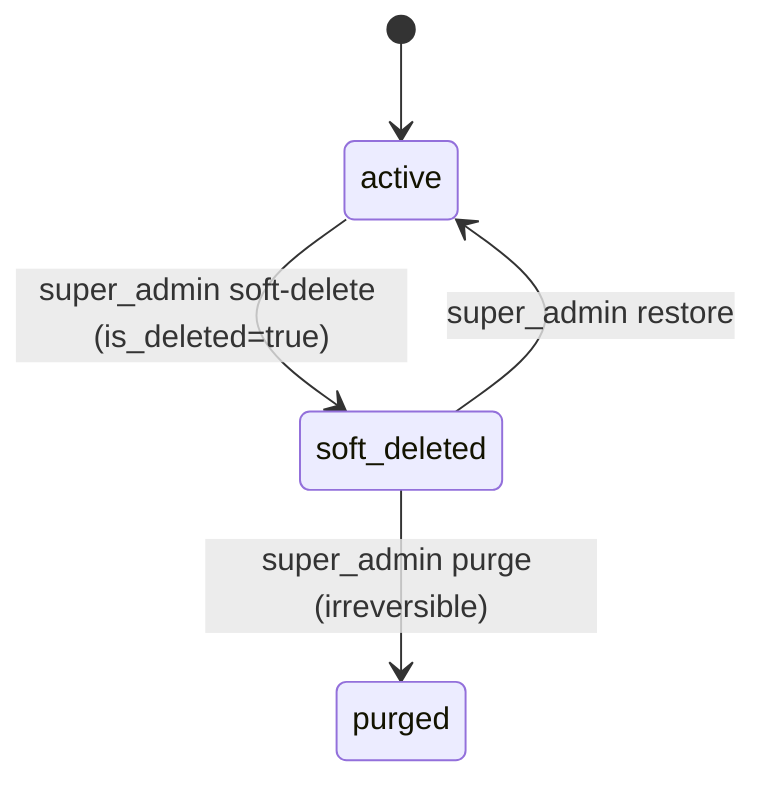
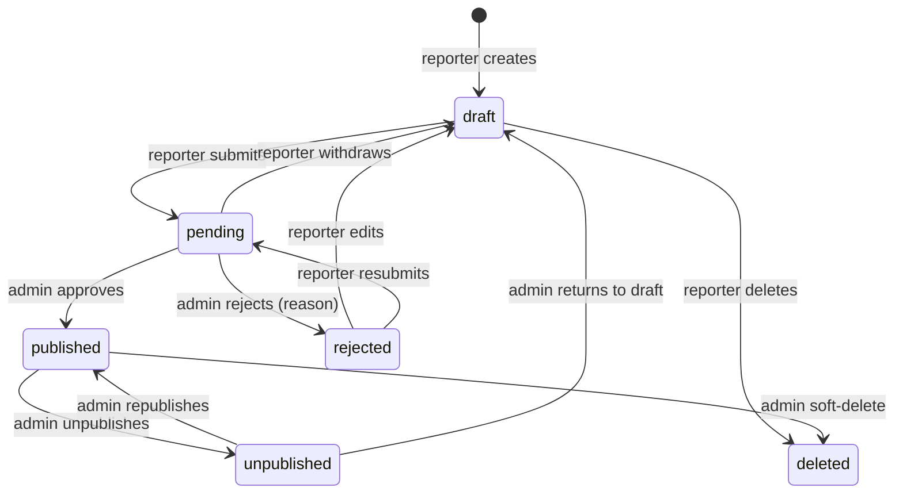
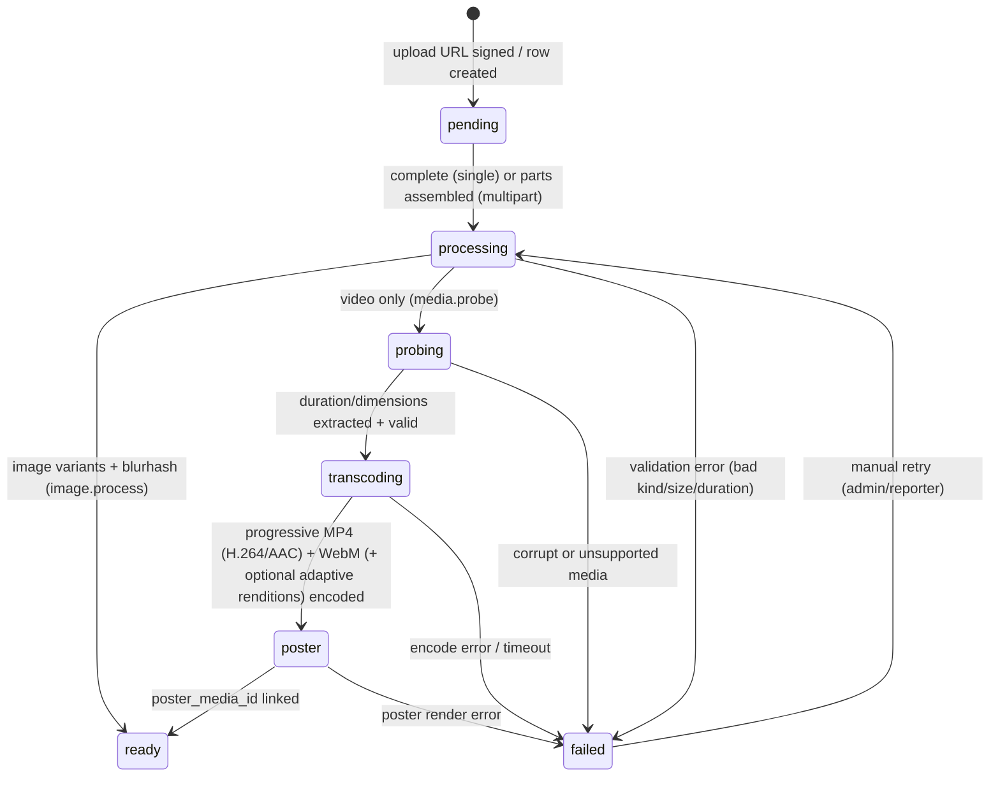

# 05 — Database Design (PostgreSQL)

> Relational schema for NewsWatch. This document defines the full ER diagram,
> per-table columns/types/constraints/indexes, indexing strategy, soft-delete and
> timestamp conventions, slug strategy, full-text search, migrations, and the
> article status state machine.

Related: [Overview](00-overview.md) · [Backend](03-backend-architecture.md) ·
[API](04-api.md) · [Auth](06-auth-and-authorization.md).

Scope note: **no billing/subscription/payment tables exist.** All content is free.

---

## 1. Conventions

| Rule | Value |
|---|---|
| Primary keys | `id uuid` default `gen_random_uuid()` (pgcrypto) |
| Timestamps | `timestamptz`, stored UTC; `created_at`, `updated_at` on every table |
| Soft delete | Two patterns: `deleted_at timestamptz` (content) and `is_deleted boolean` + `deleted_at`/`deleted_by` (users). Queries filter accordingly. See §2.3. |
| Enums | PostgreSQL `ENUM` types (see §2.2) |
| Casing | `snake_case` for tables/columns |
| Money | Not applicable (no payments) |
| JSON | `jsonb` for flexible metadata only, never for relational data |
| FKs | Explicit, with `ON DELETE` behaviour stated per table |

| ID | Requirement |
|---|---|
| REQ-SYS-480 | Every table has `created_at`/`updated_at` (except append-only history tables) |
| REQ-SYS-481 | `updated_at` is maintained by a trigger `set_updated_at()` |
| REQ-SYS-482 | All foreign keys are indexed |
| REQ-SYS-483 | Soft-deleted rows are excluded from all public queries |
| REQ-SYS-484 | UUID v4 identifiers everywhere (per [conventions §8](../02-conventions.md)) |

### 1.1 Common blocks

```sql
CREATE EXTENSION IF NOT EXISTS pgcrypto;      -- gen_random_uuid()
CREATE EXTENSION IF NOT EXISTS citext;        -- case-insensitive text (emails)

CREATE OR REPLACE FUNCTION set_updated_at() RETURNS trigger AS $$
BEGIN NEW.updated_at = now(); RETURN NEW; END;
$$ LANGUAGE plpgsql;
```

Every table with `updated_at` gets:

```sql
CREATE TRIGGER trg_<table>_updated
BEFORE UPDATE ON <table>
FOR EACH ROW EXECUTE FUNCTION set_updated_at();
```

### 1.2 Enum types

```sql
CREATE TYPE user_role           AS ENUM ('user','reporter','admin','super_admin');
CREATE TYPE user_status         AS ENUM ('active','suspended','deleted');
CREATE TYPE reporter_status     AS ENUM ('pending','approved','rejected','revoked');
CREATE TYPE article_status      AS ENUM ('draft','pending','published','rejected','unpublished','deleted');
CREATE TYPE region_type         AS ENUM ('state','district','constituency','mandal');
CREATE TYPE media_status        AS ENUM ('pending','processing','ready','failed');
CREATE TYPE media_kind          AS ENUM ('image','video');
CREATE TYPE media_processing_status AS ENUM ('pending','processing','ready','failed');
CREATE TYPE media_purpose       AS ENUM ('avatar','article','hero','gallery','poster','video');
CREATE TYPE notification_type   AS ENUM ('new_article','breaking','comment_reply','comment_like','reporter_article_status');
CREATE TYPE otp_purpose         AS ENUM ('login','signup','reset');
CREATE TYPE otp_channel         AS ENUM ('sms','email');
CREATE TYPE reaction_type       AS ENUM ('like');
CREATE TYPE follow_target       AS ENUM ('reporter','category');
CREATE TYPE body_format         AS ENUM ('rich','markdown');
CREATE TYPE poster_template     AS ENUM ('classic','breaking','minimal','gradient','photo_hero');
```

---

## 2. ER diagram

```mermaid
erDiagram
  users ||--o{ refresh_tokens : "has"
  users ||--o{ otp_codes : "requests"
  users ||--o| reporter_profiles : "may have"
  users ||--o{ articles : "authors"
  users ||--o{ comments : "writes"
  users ||--o{ reactions : "gives"
  users ||--o{ bookmarks : "saves"
  users ||--o{ follows : "follows"
  users ||--o{ notifications : "receives"
  users ||--o{ devices : "registers"
  users ||--o{ media_assets : "uploads"
  users ||--o{ admin_region_scopes : "scoped by"
  users ||--o{ reporter_region_scopes : "scoped by"
  users ||--o{ audit_logs : "acts in"
  users ||--o{ article_posters : "generates"

  regions ||--o{ regions : "parent of (self)"
  regions ||--o{ articles : "locates"
  regions ||--o{ admin_region_scopes : "grants"
  regions ||--o{ reporter_region_scopes : "grants"

  roles ||--o{ role_permissions : "grants"
  permissions ||--o{ role_permissions : "in"
  users }o--|| roles : "assigned (legacy/optional)"

  articles ||--o{ article_images : "has"
  articles ||--o{ article_status_history : "audited by"
  articles ||--o{ comments : "has"
  articles ||--o{ bookmarks : "saved as"
  articles ||--o{ article_categories : "in"
  categories ||--o{ article_categories : "groups"
  articles ||--o{ article_tags : "tagged"
  tags ||--o{ article_tags : "labels"

  articles ||--o{ article_posters : "renders"

  comments ||--o{ comments : "replies (self)"

  categories ||--o{ follows : "followed"
  reporter_profiles ||--o{ follows : "followed"

  media_assets ||--o{ article_images : "referenced by (mixed image/video)"
  media_assets ||--o{ article_posters : "backing image"
  media_assets ||--o| media_assets : "poster for (self-ref)"
  articles ||--o{ analytics_events : "tracked"

  users {
    uuid id PK
    citext email
    text phone
    text username
    text display_name
    text password_hash
    user_role role
    user_status status
    bool email_verified
    bool phone_verified
    text avatar_url
    text bio
    int failed_login_attempts
    timestamptz locked_until
    timestamptz last_login_at
    bool is_deleted
    timestamptz deleted_at
    uuid deleted_by FK
    timestamptz restored_at
    timestamptz created_at
    timestamptz updated_at
  }

  regions {
    uuid id PK
    region_type type
    text name
    text slug
    uuid parent_id FK
    int sort_order
    timestamptz created_at
    timestamptz updated_at
  }

  admin_region_scopes {
    uuid id PK
    uuid user_id FK
    uuid region_id FK
    timestamptz created_at
  }

  reporter_region_scopes {
    uuid id PK
    uuid user_id FK
    uuid region_id FK
    timestamptz created_at
  }

  app_settings {
    text key PK
    jsonb value
    bool is_public
    uuid updated_by FK
    timestamptz updated_at
  }

  audit_logs {
    uuid id PK
    uuid actor_id FK
    text action
    text target_type
    uuid target_id
    jsonb meta
    text ip
    timestamptz created_at
  }

  refresh_tokens {
    uuid id PK
    uuid user_id FK
    text token_hash
    uuid family_id
    text device_id
    text user_agent
    text ip
    timestamptz expires_at
    timestamptz revoked_at
    timestamptz rotated_at
    timestamptz created_at
  }

  otp_codes {
    uuid id PK
    uuid user_id FK
    text identifier
    otp_channel channel
    otp_purpose purpose
    text code_hash
    int attempts
    int max_attempts
    timestamptz expires_at
    timestamptz consumed_at
    timestamptz created_at
  }

  reporter_profiles {
    uuid id PK
    uuid user_id FK
    reporter_status status
    text full_name
    text bio
    text[] beats
    text portfolio_url
    text sample_article_url
    text phone
    uuid reviewed_by FK
    text reviewer_note
    timestamptz reviewed_at
    timestamptz created_at
    timestamptz updated_at
  }

  articles {
    uuid id PK
    text slug
    text title
    text summary
    text body
    body_format body_format
    jsonb headline_style
    jsonb description_style
    jsonb poster
    uuid reporter_id FK
    uuid hero_image_id FK
    uuid region_id FK
    article_status status
    bool is_deleted
    bool is_breaking
    int view_count
    int like_count
    int comment_count
    int bookmark_count
    int reading_minutes
    timestamptz scheduled_at
    timestamptz submitted_at
    timestamptz published_at
    text review_note
    uuid reviewed_by FK
    tsvector search_vector
    timestamptz created_at
    timestamptz updated_at
    timestamptz deleted_at
  }

  article_posters {
    uuid id PK
    uuid article_id FK
    uuid media_asset_id FK
    poster_template template
    int width
    int height
    uuid created_by FK
    bool is_default
    jsonb overrides
    timestamptz created_at
    timestamptz updated_at
  }

  article_images {
    uuid id PK
    uuid article_id FK
    uuid media_asset_id FK
    media_kind kind
    int position
    text alt
    bool is_hero
  }

  article_status_history {
    uuid id PK
    uuid article_id FK
    article_status from_status
    article_status to_status
    uuid changed_by FK
    text note
    timestamptz created_at
  }

  categories {
    uuid id PK
    text name
    text slug
    text description
    text color_token
    int sort_order
    int follower_count
    timestamptz created_at
    timestamptz updated_at
    timestamptz deleted_at
  }

  article_categories {
    uuid article_id FK
    uuid category_id FK
    bool is_primary
  }

  tags {
    uuid id PK
    text name
    text slug
    timestamptz created_at
  }

  article_tags {
    uuid article_id FK
    uuid tag_id FK
  }

  comments {
    uuid id PK
    uuid article_id FK
    uuid author_id FK
    uuid parent_id FK
    text body
    int depth
    int like_count
    int reply_count
    bool is_hidden
    timestamptz created_at
    timestamptz updated_at
    timestamptz deleted_at
  }

  reactions {
    uuid id PK
    uuid user_id FK
    reaction_type type
    text target_type
    uuid target_id
    timestamptz created_at
  }

  bookmarks {
    uuid id PK
    uuid user_id FK
    uuid article_id FK
    timestamptz created_at
  }

  follows {
    uuid id PK
    uuid user_id FK
    follow_target target_type
    uuid target_id
    timestamptz created_at
  }

  notifications {
    uuid id PK
    uuid user_id FK
    notification_type type
    text title
    text body
    text entity_type
    uuid entity_id
    text deep_link
    bool read
    timestamptz read_at
    jsonb data
    timestamptz created_at
  }

  devices {
    uuid id PK
    uuid user_id FK
    text device_id
    text push_token
    text platform
    text app_version
    bool push_enabled
    timestamptz last_seen_at
    timestamptz created_at
    timestamptz updated_at
  }

  media_assets {
    uuid id PK
    uuid owner_id FK
    media_purpose purpose
    media_kind kind
    media_status status
    media_processing_status processing_status
    text processing_error
    text storage_key
    text url
    text mime_type
    text codec
    bigint size_bytes
    int width
    int height
    numeric duration_seconds
    uuid poster_media_id FK
    text blurhash
    jsonb variants
    timestamptz created_at
    timestamptz updated_at
    timestamptz deleted_at
  }

  analytics_events {
    uuid id PK
    uuid user_id FK
    text event_name
    text client_event_id
    uuid article_id FK
    jsonb props
    text platform
    timestamptz occurred_at
    timestamptz created_at
  }

  roles {
    uuid id PK
    text name
    text description
  }

  permissions {
    uuid id PK
    text name
    text description
  }

  role_permissions {
    uuid role_id FK
    uuid permission_id FK
  }
```



---

## 3. Table definitions

### 3.1 `users`

| Column | Type | Constraints / Default |
|---|---|---|
| `id` | uuid | PK, default `gen_random_uuid()` |
| `email` | citext | UNIQUE, NULL allowed (phone-only users) |
| `phone` | text | UNIQUE, NULL allowed |
| `username` | text | NOT NULL, UNIQUE, `CHECK (username ~ '^[a-z0-9_]{3,30}$')` |
| `display_name` | text | NOT NULL, `CHECK (char_length(display_name) BETWEEN 2 AND 60)` |
| `password_hash` | text | NULL (OTP/OAuth-only users) |
| `role` | user_role | NOT NULL default `'user'` |
| `status` | user_status | NOT NULL default `'active'` |
| `email_verified` | boolean | NOT NULL default `false` |
| `phone_verified` | boolean | NOT NULL default `false` |
| `avatar_url` | text | NULL |
| `bio` | text | NULL, `CHECK (char_length(bio) <= 200)` |
| `failed_login_attempts` | int | NOT NULL default `0` |
| `locked_until` | timestamptz | NULL |
| `last_login_at` | timestamptz | NULL |
| `is_deleted` | boolean | NOT NULL default `false` (soft delete flag) |
| `deleted_at` | timestamptz | NULL (set when soft-deleted) |
| `deleted_by` | uuid | FK→users(id) ON DELETE SET NULL, NULL (super admin actor) |
| `restored_at` | timestamptz | NULL (last restore) |
| `created_at` / `updated_at` | timestamptz | NOT NULL default `now()` |

Indexes:
```sql
CREATE UNIQUE INDEX ux_users_email ON users (email) WHERE is_deleted = false;
CREATE UNIQUE INDEX ux_users_phone ON users (phone) WHERE is_deleted = false AND phone IS NOT NULL;
CREATE UNIQUE INDEX ux_users_username ON users (username) WHERE is_deleted = false;
CREATE INDEX ix_users_role ON users (role) WHERE is_deleted = false;
CREATE INDEX ix_users_not_deleted ON users (created_at DESC) WHERE is_deleted = false;
CREATE INDEX ix_users_deleted ON users (deleted_at DESC) WHERE is_deleted = true;
```

> **Soft delete (users, super admin only).** Deletion sets `is_deleted = true`,
> `deleted_at = now()`, `deleted_by = <super_admin id>`; the row is never
> physically removed (REQ-DEL-001/002). Soft-deleted users cannot authenticate
> and are excluded from normal queries (REQ-DEL-003). Restore clears the flags;
> an explicit super-admin **purge** may hard-delete. See §7.3 and
> [08-roles-regions-and-deletion.md](08-roles-regions-and-deletion.md).

### 3.2 `roles`, `permissions`, `role_permissions`

Roles are also represented by the `user_role` enum for the 4 fixed application
roles (`user`, `reporter`, `admin`, `super_admin`); the tables provide an
extensible permission layer for admin actions.

| Table | Columns | Notes |
|---|---|---|
| `roles` | `id uuid PK`, `name text UNIQUE NOT NULL`, `description text` | Seed: user, reporter, admin, super_admin |
| `permissions` | `id uuid PK`, `name text UNIQUE NOT NULL`, `description text` | e.g. `article.approve`, `region.manage`, `user.delete`, `app_settings.write` |
| `role_permissions` | `role_id uuid FK→roles(id)`, `permission_id uuid FK→permissions(id)`, PK `(role_id, permission_id)` | On delete cascade |

Indexes: `roles(name)`, `permissions(name)`, `role_permissions(permission_id)`.

See the RBAC matrix in [Auth §6.1](06-auth-and-authorization.md#61-rbac-matrix).

### 3.3 `refresh_tokens`

| Column | Type | Constraints / Default |
|---|---|---|
| `id` | uuid | PK |
| `user_id` | uuid | FK→users(id) ON DELETE CASCADE, NOT NULL |
| `token_hash` | text | NOT NULL, UNIQUE (store SHA-256 hash, never raw) |
| `family_id` | uuid | NOT NULL (rotation family for reuse detection) |
| `device_id` | text | NULL |
| `user_agent` | text | NULL |
| `ip` | text | NULL |
| `expires_at` | timestamptz | NOT NULL |
| `revoked_at` | timestamptz | NULL |
| `rotated_at` | timestamptz | NULL |
| `created_at` | timestamptz | NOT NULL default `now()` |

Indexes:
```sql
CREATE INDEX ix_refresh_user ON refresh_tokens (user_id) WHERE revoked_at IS NULL;
CREATE INDEX ix_refresh_family ON refresh_tokens (family_id);
CREATE INDEX ix_refresh_expires ON refresh_tokens (expires_at);
```

### 3.4 `otp_codes`

| Column | Type | Constraints / Default |
|---|---|---|
| `id` | uuid | PK |
| `user_id` | uuid | FK→users(id) ON DELETE CASCADE, NULL (new signups) |
| `identifier` | text | NOT NULL (phone E.164 or email) |
| `channel` | otp_channel | NOT NULL |
| `purpose` | otp_purpose | NOT NULL |
| `code_hash` | text | NOT NULL |
| `attempts` | int | NOT NULL default `0` |
| `max_attempts` | int | NOT NULL default `5` |
| `expires_at` | timestamptz | NOT NULL (now + 5 min) |
| `consumed_at` | timestamptz | NULL |
| `created_at` | timestamptz | NOT NULL default `now()` |

Indexes:
```sql
CREATE INDEX ix_otp_identifier ON otp_codes (identifier, purpose) WHERE consumed_at IS NULL;
CREATE INDEX ix_otp_expires ON otp_codes (expires_at);
```

### 3.5 `reporter_profiles`

| Column | Type | Constraints / Default |
|---|---|---|
| `id` | uuid | PK |
| `user_id` | uuid | FK→users(id) ON DELETE CASCADE, UNIQUE NOT NULL |
| `status` | reporter_status | NOT NULL default `'pending'` |
| `full_name` | text | NOT NULL |
| `bio` | text | NOT NULL |
| `beats` | text[] | NOT NULL default `'{}'` |
| `portfolio_url` | text | NULL |
| `sample_article_url` | text | NULL |
| `phone` | text | NOT NULL |
| `reviewed_by` | uuid | FK→users(id) ON DELETE SET NULL, NULL |
| `reviewer_note` | text | NULL |
| `reviewed_at` | timestamptz | NULL |
| `created_at` / `updated_at` | timestamptz | NOT NULL default `now()` |

Indexes: `ux_reporter_user (user_id)`, `ix_reporter_status (status)`.

### 3.6 `articles`

| Column | Type | Constraints / Default |
|---|---|---|
| `id` | uuid | PK |
| `slug` | text | NOT NULL, UNIQUE, `CHECK (slug ~ '^[a-z0-9]+(-[a-z0-9]+)*$')` |
| `title` | text | NOT NULL, `CHECK (char_length(title) BETWEEN 10 AND 140)` |
| `summary` | text | NOT NULL, `CHECK (char_length(summary) BETWEEN 30 AND 300)` |
| `body` | text | NOT NULL (sanitized HTML; allowed tags/styles whitelisted server-side per REQ-POSTER-* §7.6) |
| `body_format` | body_format | NOT NULL default `'rich'` (`rich` = sanitized HTML, `markdown` = markdown source) |
| `headline_style` | jsonb | NULL; `{ color, fontSize, weight }` for the headline/title (REQ-REP-086/088) |
| `description_style` | jsonb | NULL; `{ color, fontSize }` for the summary/description (REQ-REP-087/088) |
| `poster` | jsonb | NULL; default poster metadata `{ template, headlineColor, headlineSize, descColor, descSize, categoryTag, bgPhotoMediaId }` (REQ-REP-089/090, REQ-POSTER-012) |
| `reporter_id` | uuid | FK→users(id) ON DELETE RESTRICT, NOT NULL |
| `hero_image_id` | uuid | FK→media_assets(id) ON DELETE SET NULL, NULL (hero asset; may be `kind='image'` or `kind='video'`, mirroring `article_images.is_hero` — REQ-REP-096) |
| `region_id` | uuid | FK→regions(id) ON DELETE RESTRICT, NOT NULL (most specific region) |
| `status` | article_status | NOT NULL default `'draft'` (soft status; `deleted` = soft-deleted) |
| `is_deleted` | boolean | NOT NULL default `false` (soft delete flag) |
| `is_breaking` | boolean | NOT NULL default `false` |
| `view_count` | int | NOT NULL default `0` |
| `like_count` | int | NOT NULL default `0` |
| `comment_count` | int | NOT NULL default `0` |
| `bookmark_count` | int | NOT NULL default `0` |
| `reading_minutes` | int | NOT NULL default `1` |
| `scheduled_at` | timestamptz | NULL |
| `submitted_at` | timestamptz | NULL |
| `published_at` | timestamptz | NULL |
| `review_note` | text | NULL |
| `reviewed_by` | uuid | FK→users(id) ON DELETE SET NULL, NULL |
| `search_vector` | tsvector | Generated (see §5) |
| `created_at` / `updated_at` | timestamptz | NOT NULL default `now()` |
| `deleted_at` | timestamptz | NULL (soft status/delete timestamp) |

Indexes:
```sql
CREATE INDEX ix_articles_feed
  ON articles (published_at DESC, id DESC)
  WHERE status = 'published' AND deleted_at IS NULL;
CREATE INDEX ix_articles_reporter ON articles (reporter_id, status) WHERE deleted_at IS NULL;
CREATE INDEX ix_articles_region ON articles (region_id, published_at DESC) WHERE deleted_at IS NULL;
CREATE INDEX ix_articles_breaking ON articles (published_at DESC) WHERE is_breaking = true AND status = 'published';
CREATE INDEX ix_articles_scheduled ON articles (scheduled_at) WHERE status = 'pending' AND scheduled_at IS NOT NULL;
CREATE INDEX ix_articles_search ON articles USING GIN (search_vector);
CREATE INDEX ix_articles_body_format ON articles (body_format) WHERE deleted_at IS NULL;
CREATE INDEX ix_articles_poster_template ON articles ((poster->>'template')) WHERE deleted_at IS NULL;
```

> **Style & poster metadata validation.** `headline_style`, `description_style`,
> and `poster` are validated by Zod in `article.service` before persistence
> (JSON Schema at the app boundary; `jsonb` in the DB). Rules:
> - `headline_style.color` / `description_style.color` are 3/6/8-digit hex
>   (`#RGB`, `#RRGGBB`, `#RRGGBBAA`); `fontSize` is an integer in the UI range
>   (headline 18–46px, description 11–24px); `weight` ∈ `{400,600,700,800}`.
> - `poster.template` MUST be one of the `poster_template` enum values, stored
>   both as `poster->>'template'` (text) and enforced by `poster_template`
>   (`INVALID_TEMPLATE` on mismatch — REQ-POSTER-001).
> - `poster.headlineSize`/`descSize` reuse the style ranges; `bgPhotoMediaId`
>   (or `bgPhoto`) MUST reference an owned, `ready` `media_assets` row or be
>   `null` (REQ-POSTER-007).
> - Unknown/extra keys are stripped, never persisted.
> All ranges/defaults mirror the client contract (REQ-REP-084..092,
> REQ-POSTER-004/005).

> **Article delete policy.** Admins/reporters may only soft-change status
> (`deleted` / `unpublished`) within scope. Only a **super_admin** may
> HARD-delete an article (REQ-DEL-004): the row and its dependents
> (`article_images`, `article_categories`, `article_tags`, `reactions`,
> `bookmarks`, `comments`, `article_status_history`) are physically removed via
> `ON DELETE CASCADE`, and media objects are queued for deletion. See §7.2.
> `articles.region_id` references the most specific region (REQ-REG-001).

### 3.7 `article_images` (mixed media gallery)

The table name is **retained** (no rename) but it is now a **mixed image/video
gallery**. Each row references exactly one `media_assets` row of either kind;
`kind` is denormalised from `media_assets.kind` so clients can render an
image/video gallery from the join alone. An article's hero is the single row
with `is_hero = true` — an image or a video (REQ-REP-093/094).

> If a future rename to `article_media` is chosen, the mapping is 1:1
> (`article_media → article_images`, identical columns) and `media_asset_id`
> remains the join key to `media_assets`. Docs/API use `ArticleMedia` uniformly
> to keep the mapping explicit.

| Column | Type | Constraints / Default |
|---|---|---|
| `id` | uuid | PK |
| `article_id` | uuid | FK→articles(id) ON DELETE CASCADE, NOT NULL |
| `media_asset_id` | uuid | FK→media_assets(id) ON DELETE RESTRICT, NOT NULL |
| `kind` | media_kind | NOT NULL default `'image'` (`image`\|`video`); mirrors `media_assets.kind` (REQ-REP-094) |
| `position` | int | NOT NULL default `0` (gallery order) |
| `alt` | text | NULL |
| `is_hero` | boolean | NOT NULL default `false` (single hero per article, image or video) |

Indexes: `ix_article_images_article (article_id, position)`;
`ix_article_images_media (media_asset_id)`; unique
`ux_article_hero (article_id) WHERE is_hero = true`.

> The gallery is ordered by `(article_id, position)`. Attaching a row requires
> the referenced asset to be owned and `processing_status = 'ready'`
> (REQ-REP-099); the `kind` on the join row MUST match `media_assets.kind`
> (enforced by service/repo validation, since the FK is polymorphic by kind).

### 3.8 `article_status_history`

Append-only audit of every status change.

| Column | Type | Constraints / Default |
|---|---|---|
| `id` | uuid | PK |
| `article_id` | uuid | FK→articles(id) ON DELETE CASCADE, NOT NULL |
| `from_status` | article_status | NULL (initial draft) |
| `to_status` | article_status | NOT NULL |
| `changed_by` | uuid | FK→users(id) ON DELETE SET NULL, NULL |
| `note` | text | NULL |
| `created_at` | timestamptz | NOT NULL default `now()` |

Indexes: `ix_ash_article (article_id, created_at DESC)`.

### 3.9 `categories`

| Column | Type | Constraints / Default |
|---|---|---|
| `id` | uuid | PK |
| `name` | text | NOT NULL, UNIQUE |
| `slug` | text | NOT NULL, UNIQUE |
| `description` | text | NULL |
| `color_token` | text | NULL |
| `sort_order` | int | NOT NULL default `0` |
| `follower_count` | int | NOT NULL default `0` |
| `created_at` / `updated_at` | timestamptz | NOT NULL default `now()` |
| `deleted_at` | timestamptz | NULL |

Indexes: `ux_categories_slug (slug) WHERE deleted_at IS NULL`,
`ix_categories_order (sort_order)`.

### 3.10 `article_categories`

| Column | Type | Constraints / Default |
|---|---|---|
| `article_id` | uuid | FK→articles(id) ON DELETE CASCADE |
| `category_id` | uuid | FK→categories(id) ON DELETE RESTRICT |
| `is_primary` | boolean | NOT NULL default `false` |
| PK | `(article_id, category_id)` | |

Indexes: `ix_ac_category (category_id, article_id)`; unique
`ux_ac_primary (article_id) WHERE is_primary = true`.

### 3.11 `tags` & `article_tags`

`tags`: `id uuid PK`, `name text UNIQUE NOT NULL`, `slug text UNIQUE NOT NULL`,
`created_at`.

`article_tags`: `article_id uuid FK→articles(id) ON DELETE CASCADE`,
`tag_id uuid FK→tags(id) ON DELETE CASCADE`, PK `(article_id, tag_id)`.
Index: `ix_article_tags_tag (tag_id, article_id)`.

### 3.12 `comments`

Self-referential for replies (max depth 2 enforced in service).

| Column | Type | Constraints / Default |
|---|---|---|
| `id` | uuid | PK |
| `article_id` | uuid | FK→articles(id) ON DELETE CASCADE, NOT NULL |
| `author_id` | uuid | FK→users(id) ON DELETE CASCADE, NOT NULL |
| `parent_id` | uuid | FK→comments(id) ON DELETE CASCADE, NULL |
| `body` | text | NOT NULL, `CHECK (char_length(body) BETWEEN 1 AND 1000)` |
| `depth` | smallint | NOT NULL default `0`, `CHECK (depth BETWEEN 0 AND 2)` |
| `like_count` | int | NOT NULL default `0` |
| `reply_count` | int | NOT NULL default `0` |
| `is_hidden` | boolean | NOT NULL default `false` |
| `created_at` / `updated_at` | timestamptz | NOT NULL default `now()` |
| `deleted_at` | timestamptz | NULL |

Indexes:
```sql
CREATE INDEX ix_comments_article ON comments (article_id, created_at DESC)
  WHERE deleted_at IS NULL AND is_hidden = false;
CREATE INDEX ix_comments_parent ON comments (parent_id, created_at) WHERE deleted_at IS NULL;
CREATE INDEX ix_comments_author ON comments (author_id);
```

### 3.13 `reactions`

| Column | Type | Constraints / Default |
|---|---|---|
| `id` | uuid | PK |
| `user_id` | uuid | FK→users(id) ON DELETE CASCADE, NOT NULL |
| `type` | reaction_type | NOT NULL default `'like'` |
| `target_type` | text | NOT NULL, `CHECK (target_type IN ('article','comment'))` |
| `target_id` | uuid | NOT NULL |
| `created_at` | timestamptz | NOT NULL default `now()` |

Indexes:
```sql
CREATE UNIQUE INDEX ux_reactions_unique ON reactions (user_id, target_type, target_id, type);
CREATE INDEX ix_reactions_target ON reactions (target_type, target_id);
```

> `likes` are modelled as `reactions` with `type='like'` to allow future reaction
> types without schema change.

### 3.14 `bookmarks`

| Column | Type | Constraints / Default |
|---|---|---|
| `id` | uuid | PK |
| `user_id` | uuid | FK→users(id) ON DELETE CASCADE, NOT NULL |
| `article_id` | uuid | FK→articles(id) ON DELETE CASCADE, NOT NULL |
| `created_at` | timestamptz | NOT NULL default `now()` |

Indexes:
```sql
CREATE UNIQUE INDEX ux_bookmarks_unique ON bookmarks (user_id, article_id);
CREATE INDEX ix_bookmarks_user ON bookmarks (user_id, created_at DESC);
```

### 3.15 `follows`

Polymorphic follow (reporters via `users`, categories via `categories`).

| Column | Type | Constraints / Default |
|---|---|---|
| `id` | uuid | PK |
| `user_id` | uuid | FK→users(id) ON DELETE CASCADE, NOT NULL (follower) |
| `target_type` | follow_target | NOT NULL |
| `target_id` | uuid | NOT NULL (user id or category id) |
| `created_at` | timestamptz | NOT NULL default `now()` |

Indexes:
```sql
CREATE UNIQUE INDEX ux_follows_unique ON follows (user_id, target_type, target_id);
CREATE INDEX ix_follows_target ON follows (target_type, target_id);
```

> Referential integrity for the polymorphic target is enforced in the service
> layer (check existence on insert) rather than by an FK.

### 3.16 `notifications`

| Column | Type | Constraints / Default |
|---|---|---|
| `id` | uuid | PK |
| `user_id` | uuid | FK→users(id) ON DELETE CASCADE, NOT NULL |
| `type` | notification_type | NOT NULL |
| `title` | text | NOT NULL |
| `body` | text | NOT NULL |
| `entity_type` | text | NULL |
| `entity_id` | uuid | NULL |
| `deep_link` | text | NULL |
| `read` | boolean | NOT NULL default `false` |
| `read_at` | timestamptz | NULL |
| `data` | jsonb | NOT NULL default `'{}'` |
| `created_at` | timestamptz | NOT NULL default `now()` |

Indexes:
```sql
CREATE INDEX ix_notifications_user ON notifications (user_id, created_at DESC);
CREATE INDEX ix_notifications_unread ON notifications (user_id) WHERE read = false;
```

### 3.17 `devices`

| Column | Type | Constraints / Default |
|---|---|---|
| `id` | uuid | PK |
| `user_id` | uuid | FK→users(id) ON DELETE CASCADE, NOT NULL |
| `device_id` | text | NOT NULL |
| `push_token` | text | NULL, UNIQUE |
| `platform` | text | NOT NULL, `CHECK (platform IN ('ios','android','web'))` |
| `app_version` | text | NULL |
| `push_enabled` | boolean | NOT NULL default `true` |
| `last_seen_at` | timestamptz | NOT NULL default `now()` |
| `created_at` / `updated_at` | timestamptz | NOT NULL default `now()` |

Indexes: unique `ux_devices_user_device (user_id, device_id)`,
`ix_devices_token (push_token)`.

### 3.18 `media_assets`

An uploaded media object. **Images and videos share this table**; `kind`
discriminates the row and enables video-only metadata. `purpose` is refined to
`avatar`, `article`, `hero`, `gallery`, `poster`, or `video`. For a video row the
poster image is itself a `media_assets` row referenced by `poster_media_id`
(self-referential FK).

| Column | Type | Constraints / Default |
|---|---|---|
| `id` | uuid | PK |
| `owner_id` | uuid | FK→users(id) ON DELETE CASCADE, NOT NULL |
| `purpose` | media_purpose | NOT NULL (`avatar`\|`article`\|`hero`\|`gallery`\|`poster`\|`video`) |
| `kind` | media_kind | NOT NULL default `'image'` (`image`\|`video`) |
| `status` | media_status | NOT NULL default `'pending'` (coarse upload status) |
| `processing_status` | media_processing_status | NOT NULL default `'pending'` (`pending`\|`processing`\|`ready`\|`failed`) |
| `processing_error` | text | NULL (failure reason when `processing_status='failed'`) |
| `storage_key` | text | NOT NULL (original object key) |
| `url` | text | NULL (canonical deliverable URL; set when ready) |
| `mime_type` | text | NOT NULL |
| `codec` | text | NULL (video codec, e.g. `h264`; NULL for images) |
| `size_bytes` | bigint | NOT NULL, `CHECK` type-aware (images ≤ 10,485,760; videos ≤ 209,715,200) — see below |
| `width` | int | NULL |
| `height` | int | NULL |
| `duration_seconds` | numeric | NULL (`CHECK (duration_seconds IS NULL OR duration_seconds >= 0)`); video only |
| `poster_media_id` | uuid | FK→media_assets(id) ON DELETE SET NULL, NULL (video poster image; self-ref) |
| `blurhash` | text | NULL |
| `variants` | jsonb | NOT NULL default `'{}'` (image renditions and/or video renditions — progressive MP4/WebM + optional adaptive renditions) |
| `created_at` / `updated_at` | timestamptz | NOT NULL default `now()` |
| `deleted_at` | timestamptz | NULL |

Size limit is enforced **type-aware** by a single kind-conditioned CHECK, so the
10 MB image limit and 200 MB video limit coexist without application-only
enforcement (REQ-REP-095):

```sql
ALTER TABLE media_assets ADD CONSTRAINT ck_media_size_by_kind CHECK (
  (kind = 'image' AND size_bytes <= 10485760)  -- 10 MB
  OR
  (kind = 'video' AND size_bytes <= 209715200) -- 200 MB
);

ALTER TABLE media_assets ADD CONSTRAINT ck_media_video_fields CHECK (
  kind = 'video'
  OR (duration_seconds IS NULL AND codec IS NULL AND poster_media_id IS NULL)
);

ALTER TABLE media_assets ADD CONSTRAINT ck_media_duration_max CHECK (
  duration_seconds IS NULL OR duration_seconds <= 180  -- max 3 min (REQ-REP-095)
);
```

Indexes:
```sql
CREATE INDEX ix_media_owner ON media_assets (owner_id, created_at DESC);
CREATE INDEX ix_media_status ON media_assets (status);
CREATE INDEX ix_media_processing_status ON media_assets (processing_status)
  WHERE processing_status IN ('pending','processing');   -- worker queue polling
CREATE INDEX ix_media_kind ON media_assets (kind);
CREATE INDEX ix_media_poster ON media_assets (poster_media_id);
CREATE UNIQUE INDEX ux_media_key ON media_assets (storage_key);
```

> `status` is the legacy coarse state used by existing image flows;
> `processing_status` is the authoritative **media lifecycle** state (see §8.1)
> and is what `GET /media/:id` and article-attach guards read. For images both
> track together; for videos `processing_status` additionally covers transcode
> and poster generation. Only `processing_status = 'ready'` assets may be
> attached to an article (REQ-REP-099).

### 3.19 `analytics_events`

| Column | Type | Constraints / Default |
|---|---|---|
| `id` | uuid | PK |
| `user_id` | uuid | FK→users(id) ON DELETE SET NULL, NULL (guests) |
| `event_name` | text | NOT NULL |
| `client_event_id` | text | NULL |
| `article_id` | uuid | FK→articles(id) ON DELETE SET NULL, NULL |
| `props` | jsonb | NOT NULL default `'{}'` |
| `platform` | text | NULL, `CHECK (platform IN ('ios','android','web','server'))` |
| `occurred_at` | timestamptz | NOT NULL |
| `created_at` | timestamptz | NOT NULL default `now()` |

Indexes:
```sql
CREATE INDEX ix_events_name_time ON analytics_events (event_name, occurred_at DESC);
CREATE INDEX ix_events_article ON analytics_events (article_id, occurred_at DESC);
CREATE INDEX ix_events_user ON analytics_events (user_id, occurred_at DESC);
CREATE UNIQUE INDEX ux_events_client_id ON analytics_events (client_event_id) WHERE client_event_id IS NOT NULL;
```

Partitioning (phase 2): monthly range partitions on `occurred_at`.

### 3.20 `regions`

Self-referencing 4-level geography tree: `state → district → constituency →
mandal` (REQ-REG-001..007).

| Column | Type | Constraints / Default |
|---|---|---|
| `id` | uuid | PK |
| `type` | region_type | NOT NULL (`state`\|`district`\|`constituency`\|`mandal`) |
| `name` | text | NOT NULL |
| `slug` | text | NOT NULL, UNIQUE |
| `parent_id` | uuid | FK→regions(id) ON DELETE RESTRICT, NULL (NULL only for `state`) |
| `sort_order` | int | NOT NULL default `0` |
| `created_at` / `updated_at` | timestamptz | NOT NULL default `now()` |

Indexes:
```sql
CREATE UNIQUE INDEX ux_regions_slug ON regions (slug);
CREATE INDEX ix_regions_parent ON regions (parent_id);
CREATE INDEX ix_regions_type ON regions (type);
CREATE INDEX ix_regions_name_trgm ON regions USING GIN (name gin_trgm_ops);
```

### 3.21 `admin_region_scopes` / `reporter_region_scopes`

Which regions an `admin` / `reporter` may act on. An actor may act on a scoped
region **or any descendant** (REQ-REG-003/004).

| Column | Type | Constraints / Default |
|---|---|---|
| `id` | uuid | PK |
| `user_id` | uuid | FK→users(id) ON DELETE CASCADE, NOT NULL |
| `region_id` | uuid | FK→regions(id) ON DELETE RESTRICT, NOT NULL |
| `created_at` | timestamptz | NOT NULL default `now()` |

Indexes:
```sql
CREATE UNIQUE INDEX ux_admin_scope ON admin_region_scopes (user_id, region_id);
CREATE INDEX ix_admin_scope_region ON admin_region_scopes (region_id);
CREATE UNIQUE INDEX ux_reporter_scope ON reporter_region_scopes (user_id, region_id);
CREATE INDEX ix_reporter_scope_region ON reporter_region_scopes (region_id);
```

### 3.22 `app_settings`

Keyed store for public contact/advertisement info (REQ-ADS-001..003). Only
`super_admin` may write (§7.4).

| Column | Type | Constraints / Default |
|---|---|---|
| `key` | text | PK |
| `value` | jsonb | NOT NULL default `'{}'` |
| `is_public` | boolean | NOT NULL default `false` (exposed via public endpoint) |
| `updated_by` | uuid | FK→users(id) ON DELETE SET NULL, NULL (super admin actor) |
| `updated_at` | timestamptz | NOT NULL default `now()` |

Indexes: `ix_app_settings_public (is_public) WHERE is_public = true`.

### 3.23 `audit_logs`

Append-only, immutable record of privileged/destructive actions
(REQ-DEL-005, REQ-ADS-002, REQ-AUTH-084).

| Column | Type | Constraints / Default |
|---|---|---|
| `id` | uuid | PK |
| `actor_id` | uuid | FK→users(id) ON DELETE SET NULL, NULL (system actions) |
| `action` | text | NOT NULL (e.g. `user.soft_delete`, `article.hard_delete`, `app_settings.update`) |
| `target_type` | text | NOT NULL |
| `target_id` | uuid | NULL |
| `meta` | jsonb | NOT NULL default `'{}'` (before/after snapshot, reason) |
| `ip` | text | NULL |
| `created_at` | timestamptz | NOT NULL default `now()` |

Indexes:
```sql
CREATE INDEX ix_audit_actor ON audit_logs (actor_id, created_at DESC);
CREATE INDEX ix_audit_target ON audit_logs (target_type, target_id, created_at DESC);
CREATE INDEX ix_audit_action ON audit_logs (action, created_at DESC);
```

> `audit_logs` is append-only: no `UPDATE`/`DELETE` grants; enforced with a
> DB role/trigger (REQ-DEL-005).

### 3.24 `article_posters`

History of **generated/exported share posters** for an article (R05). Each row
is an immutable rendered asset (the PNG stored as a `media_assets` row) produced
from a template + overrides at a point in time; the article's *current* poster
configuration remains in `articles.poster` (REQ-POSTER-008/009/012). Optional but
recommended so exports are reproducible, cacheable, and attributable.

| Column | Type | Constraints / Default |
|---|---|---|
| `id` | uuid | PK |
| `article_id` | uuid | FK→articles(id) ON DELETE CASCADE, NOT NULL |
| `media_asset_id` | uuid | FK→media_assets(id) ON DELETE RESTRICT, NOT NULL (rendered PNG) |
| `template` | poster_template | NOT NULL (REQ-POSTER-001) |
| `width` | int | NOT NULL, `CHECK (width >= 1080)` (REQ-POSTER-008) |
| `height` | int | NOT NULL, `CHECK (height >= 1350)` |
| `created_by` | uuid | FK→users(id) ON DELETE SET NULL, NULL (reporter/admin who rendered) |
| `is_default` | boolean | NOT NULL default `false` (the poster returned by `GET /articles/:id/poster`) |
| `overrides` | jsonb | NOT NULL default `'{}'` (headline/description colour+size, categoryTag, bg photo) |
| `created_at` / `updated_at` | timestamptz | NOT NULL default `now()` |

Indexes:
```sql
CREATE INDEX ix_article_posters_article ON article_posters (article_id, created_at DESC);
CREATE UNIQUE INDEX ux_article_posters_default ON article_posters (article_id) WHERE is_default = true;
CREATE INDEX ix_article_posters_media ON article_posters (media_asset_id);
CREATE INDEX ix_article_posters_created_by ON article_posters (created_by);
```

> Hard-deleting an article (super_admin, REQ-DEL-004) cascades
> `article_posters`; the referenced `media_assets` rows are queued via the
> `media.delete` job (see [Backend §8](03-backend-architecture.md#8-background-jobs)).
> Exactly one `is_default = true` row per article (partial unique index); a new
> default demotes the previous one in the same transaction (REQ-POSTER-012).

---

## 4. Indexing strategy

| Goal | Approach |
|---|---|
| Feed query (published, newest first) | Partial composite index on `(published_at DESC, id DESC)` where published |
| Cursor pagination | Sort-key tuple `(published_at, id)` matched by composite index |
| Category feeds | Join via `article_categories`; index `(category_id, article_id)` |
| Reporter dashboards | `(reporter_id, status)` partial on not-deleted |
| Counters | Denormalised `*_count` columns updated in-transaction |
| Search | GIN index on `search_vector` (§5) |
| Unread notifications | Partial index where `read = false` |
| Active sessions | Partial index where `revoked_at IS NULL` |
| Unique constraints | Partial unique indexes so soft-deleted rows do not block reuse |
| FK coverage | Every foreign key has a supporting index |
| Hot timestamps | `created_at DESC` indexes for admin/analytics lists |

| ID | Requirement |
|---|---|
| REQ-SYS-485 | Every feed query MUST be index-supported; no sequential scans on `articles` at scale |
| REQ-SYS-486 | Partial indexes MUST be used for status/soft-delete filtered queries |
| REQ-SYS-487 | Indexes are reviewed with `EXPLAIN ANALYZE` before release for new list queries |

---

## 5. Full-text search

v1 search uses PostgreSQL native FTS; no external search cluster.

```sql
ALTER TABLE articles ADD COLUMN search_vector tsvector
  GENERATED ALWAYS AS (
    setweight(to_tsvector('english', coalesce(title, '')), 'A') ||
    setweight(to_tsvector('english', coalesce(summary, '')), 'B') ||
    setweight(to_tsvector('english', coalesce(body, '')), 'C')
  ) STORED;

CREATE INDEX ix_articles_search ON articles USING GIN (search_vector);
```

Query pattern (relevance-ranked, published only):

```sql
SELECT a.*, ts_rank(a.search_vector, websearch_to_tsquery('english', $1)) AS rank
FROM articles a
WHERE a.status = 'published'
  AND a.deleted_at IS NULL
  AND a.search_vector @@ websearch_to_tsquery('english', $1)
ORDER BY rank DESC, a.published_at DESC
LIMIT $2;
```

- Users use `websearch_to_tsquery` for natural input.
- Categories/reporters are searched with `ILIKE` + trigram index
  (`pg_trgm`) for short names:

```sql
CREATE EXTENSION IF NOT EXISTS pg_trgm;
CREATE INDEX ix_categories_name_trgm ON categories USING GIN (name gin_trgm_ops);
CREATE INDEX ix_users_display_trgm ON users USING GIN (display_name gin_trgm_ops);
```

| ID | Requirement |
|---|---|
| REQ-SYS-490 | Article search uses weighted `tsvector` + GIN index |
| REQ-SYS-491 | Search only returns `published`, non-deleted articles |
| REQ-SYS-492 | Name search uses trigram indexes for partial matches |
| REQ-SYS-493 | Search results are never personalised in shared cache |

---

## 6. Slug strategy

| Entity | Source | Format | Collision handling |
|---|---|---|---|
| Article | `title` | lower, ascii, hyphen-separated, stops removed | Append `-2`, `-3`, … |
| Category | `name` | same | Admin sets; enforce unique |
| Tag | `name` | same | Merge into existing if slug matches |
| Reporter/User | `displayName` | same + numeric suffix | Unique username constraint |

```ts
function slugify(input: string): string {
  return input
    .normalize('NFKD').replace(/[\u0300-\u036f]/g, '')
    .toLowerCase().replace(/[^a-z0-9]+/g, '-')
    .replace(/^-+|-+$/g, '')
    .slice(0, 80);
}
```

| ID | Requirement |
|---|---|
| REQ-SYS-495 | Slugs are immutable after publish; changing a title does not change the slug |
| REQ-SYS-496 | A changed slug (rare, admin-only) keeps a redirect record (phase 2) |
| REQ-SYS-497 | Slug generation is atomic with insert (retry on unique violation) |

---

## 7. Timestamps, soft deletes & counters

| Concern | Rule |
|---|---|
| Created/updated | `timestamptz` UTC; `updated_at` via trigger |
| Publish time | `published_at` set on publish; drives feed ordering |
| Soft delete (content) | `deleted_at` set; row retained for analytics/audit |
| Soft delete (users) | `is_deleted = true` (+ `deleted_at`, `deleted_by`); partial indexes `WHERE is_deleted = false` |
| Restore | Clear `is_deleted`/`deleted_at`, set `restored_at` (super admin only) |
| Hard delete (articles) | Super-admin only; row + dependents physically removed; media queued |
| Cascade vs restrict | Content children cascade; `reporter_id`/`category_id`/`region_id` restrict |
| Counters | `like_count`, `comment_count`, `bookmark_count`, `view_count`, `follower_count` updated in-transaction |
| View count | Debounced/aggregated via Redis, flushed periodically (not per request) |

| ID | Requirement |
|---|---|
| REQ-SYS-500 | Soft-deleted content is invisible to public and reporter queries |
| REQ-SYS-501 | Hard delete occurs only via explicit action by a super_admin |
| REQ-SYS-502 | Counter updates happen in the same transaction as the originating row change (REQ-SYS-422) |
| REQ-SYS-503 | `view_count` uses aggregated flushes to avoid write amplification |

### 7.1 Region hierarchy & scope queries

Regions form a self-referencing tree via `regions.parent_id`
(`state → district → constituency → mandal`). `articles.region_id` references
the **most specific** region; a region's effective scope is itself and all its
ancestors/descendants as applicable.

Scope resolution for an actor uses a recursive CTE that expands each scoped
region to include its descendants (REQ-REG-003/004):

```sql
WITH RECURSIVE scope AS (
  SELECT r.id
  FROM regions r
  JOIN admin_region_scopes s ON s.region_id = r.id
  WHERE s.user_id = $1
  UNION ALL
  SELECT c.id
  FROM regions c
  JOIN scope p ON c.parent_id = p.id
)
SELECT a.* FROM articles a
WHERE a.region_id IN (SELECT id FROM scope)
  AND a.deleted_at IS NULL;
```

For a `super_admin`, the scope predicate is omitted entirely (global access,
REQ-REG-007). Deleting or moving a region with children or articles is blocked
until reassigned (REQ-REG-006); region CRUD is super-admin only (REQ-REG-005).

### 7.2 Deletion policy (data-level)

| Entity | Kind | Who | Mechanism |
|---|---|---|---|
| User | SOFT | super_admin only | `is_deleted=true`, `deleted_at`, `deleted_by`; partial indexes exclude deleted |
| User (restore) | — | super_admin only | clear flags, set `restored_at` |
| User (purge) | HARD (irreversible) | super_admin only | physical delete after soft delete; audited |
| Article | SOFT status | reporter (own draft) / admin (scoped) | `status='deleted'` or `deleted_at` |
| Article | HARD | super_admin only | row + dependents cascade; media delete queued |

### 7.3 User soft-delete state machine



| ID | Requirement |
|---|---|
| REQ-DEL-001 | User deletion is a SOFT delete via `users.is_deleted = true`; rows are never physically removed except by explicit purge |
| REQ-DEL-002 | Only `super_admin` may soft-delete or restore users |
| REQ-DEL-003 | Soft-deleted users are excluded from all normal queries and cannot authenticate |
| REQ-DEL-004 | Only `super_admin` may HARD delete articles; the row and dependents are physically removed |
| REQ-DEL-005 | Every soft delete, restore, purge, and hard delete writes an immutable `audit_logs` record |
| REQ-DEL-006 | Soft-deleted entities support an "include deleted" filter for super_admin views only |
| REQ-DEL-007 | The system must never allow the last `super_admin` to be deleted or demoted |

### 7.4 `app_settings` (contact / advertisement)

Keyed store for support email/phone, ad-sales contacts, office address,
WhatsApp, social links, and hours. Only `super_admin` may write; `is_public`
rows are exposed via a public endpoint. Every change is versioned/audited.

| ID | Requirement |
|---|---|
| REQ-ADS-001 | Only `super_admin` can update app contact/advertisement details |
| REQ-ADS-002 | Contact changes are versioned and audited (actor, before, after, timestamp) |
| REQ-ADS-003 | Public contact info is exposed via a public endpoint; secrets are never exposed |

### 7.5 Region & settings requirement IDs

| ID | Requirement |
|---|---|
| REQ-REG-001 | Every article MUST reference a `region_id` |
| REQ-REG-002 | A reporter may only create articles in regions they are assigned to (or descendants) |
| REQ-REG-003 | An admin may only approve/reject/publish/unpublish articles in scope or a descendant |
| REQ-REG-004 | Region scope is enforced server-side on every region-bound action |
| REQ-REG-005 | Only a super_admin may create, edit, move, or delete regions |
| REQ-REG-006 | Deleting a region with children or articles is blocked until reassigned (or cascades per policy) |
| REQ-REG-007 | Super admin actions are global; scope checks are bypassed only for `super_admin` |

### 7.6 Rich-text, style & poster metadata

| ID | Requirement |
|---|---|
| REQ-REP-085 | `articles.body` stores server-sanitized rich text; allowed tags/styles are whitelisted and `body_format` records `rich` (HTML) or `markdown` |
| REQ-REP-086 | `articles.headline_style` (jsonb) persists headline colour + font size |
| REQ-REP-087 | `articles.description_style` (jsonb) persists description colour + font size |
| REQ-REP-088 | Style metadata is structured and reused by feeds, article detail, and posters |
| REQ-REP-089 | Exactly 5 poster templates are supported via the `poster_template` enum (Classic, Breaking, Minimal, Gradient, Photo Hero) |
| REQ-REP-090 | `articles.poster` (jsonb) stores the selected template + colour/size overrides |
| REQ-REP-091 | Generated posters plus their metadata are reproducible and shareable with the article link |
| REQ-REP-092 | The poster editor stores per-article choices that reload on return |
| REQ-POSTER-001 | The `poster_template` enum MUST contain exactly `classic`, `breaking`, `minimal`, `gradient`, `photo_hero` |
| REQ-POSTER-007 | A Photo Hero background photo MUST reference an owned, `ready` `media_assets` row (`bgPhotoMediaId`) |
| REQ-POSTER-008 | Rendered posters are stored at a minimum of 1080×1350px (`article_posters.width/height`) |
| REQ-POSTER-012 | `articles.poster` + at most one default `article_posters` row per article persist template/overrides |

### 7.7 Media & video requirements

The canonical media requirements are defined in
[flows/10-media-upload-flow.md](../flows/10-media-upload-flow.md) §11; the schema
below backs them. `REQ-REP-093..099` govern hero/gallery kind, limits, transcode,
resumable upload, poster, and delete/replace.

| ID | Schema mapping |
|---|---|
| REQ-REP-093 | Hero is exactly one media row (`article_images.is_hero`) that may be `kind='image'` or `'video'`; `media_assets.kind` distinguishes type |
| REQ-REP-094 | `article_images` is a mixed gallery (≤ 10 rows per article); `kind` mirrors the asset kind |
| REQ-REP-095 | `ck_media_size_by_kind` (image ≤ 10 MB, video ≤ 200 MB) + `ck_media_duration_max` (≤ 180 s); types JPG/PNG/WebP and MP4/WebM/MOV |
| REQ-REP-096 | `media_assets.codec`, `variants` (progressive H.264 MP4 + WebM, optional adaptive renditions), `poster_media_id`; probe stores dimensions/duration |
| REQ-REP-097 | Resumable uploads; `processing_status` transitions tracked per §8.1 |
| REQ-REP-098 | `poster_media_id` self-ref links the generated poster; `article_images.position` orders reordered mixed media |
| REQ-REP-099 | Attach/detach guarded on `processing_status='ready'`; delete soft-deletes + queues `media.delete` |
| REQ-READ-033..040 | Reader behavior (inline playback, poster, autoplay, data saver, mixed gallery) — no schema beyond the above |

---

## 8. Article status state machine



| From | To | Actor | Guard |
|---|---|---|---|
| `draft` | `pending` | reporter (owner) | approved reporter; required fields; media ready |
| `pending` | `published` | admin | all fields valid; media ready |
| `pending` | `rejected` | admin | reason required |
| `pending` | `draft` | reporter (owner) | withdraw |
| `rejected` | `draft` / `pending` | reporter (owner) | edit then resubmit |
| `published` | `unpublished` | admin (scoped) | reason optional |
| `unpublished` | `published` / `draft` | admin (scoped) | republish or return |
| any | `deleted` | admin (scoped) / reporter (own draft) | soft delete (row kept) |
| any | *row removed* | super_admin | hard delete; dependents cascade (REQ-DEL-004) |

| ID | Requirement |
|---|---|
| REQ-SYS-510 | Every transition writes `article_status_history` with actor + note |
| REQ-SYS-511 | Illegal transitions return `409 INVALID_STATUS_TRANSITION` |
| REQ-SYS-512 | Only admin (region-scoped) or super_admin can set `published`/`unpublished`; reporters cannot self-publish |
| REQ-SYS-513 | A reporter with `reporter_profiles.status != 'approved'` cannot submit (REQ-REP gating) |
| REQ-SYS-514 | Publishing enqueues cache-tag revalidation and notification jobs |
| REQ-SYS-515 | Article publisher/admin actions are region-scoped (REQ-REG-003); only `super_admin` bypasses scope |

### 8.1 Media processing lifecycle (image & video)

Every `media_assets` row moves through `processing_status`
(`pending → processing → ready`, or `→ failed`). Images only need variant/blurhash
generation; videos additionally require **probe** (duration + dimensions), a
**transcode to progressive MP4 (H.264/AAC) + WebM**, and **poster generation**
(REQ-REP-096). Article publish/attach guards read
`processing_status = 'ready'` (REQ-REP-099, REQ-SYS-354).



| Stage | Applies to | Worker / job | Writes on success |
|---|---|---|---|
| Validate (type, size, duration) | image + video | edge (`media.service`) | `processing_status='processing'` |
| Variants + blurhash | image | `image.process` | `variants`, `blurhash`, `width`, `height`, `url` |
| Probe | video | `media.probe` | `duration_seconds`, `width`, `height`, `codec` |
| Transcode | video | `media.transcode` | `url` (progressive H.264 MP4), `variants` (MP4/WebM + optional adaptive renditions), `codec='h264'` |
| Poster/thumbnail | video | `media.poster` | new `media_assets` row (`kind='image'`) + `poster_media_id` |
| Terminal state | image + video | worker | `processing_status='ready'` or `'failed'` + `processing_error` |

Rules:

- Enforce type/size/duration **before** signing an upload: images
  JPG/PNG/WebP ≤ 10 MB; videos MP4/WebM/MOV ≤ 200 MB and ≤ 180 s
  (REQ-REP-093/094/095). Violations return `UNSUPPORTED_MEDIA_TYPE`,
  `PAYLOAD_TOO_LARGE`, `VIDEO_TOO_LARGE`, or `VIDEO_TOO_LONG`.
- Large videos use **resumable/multipart** uploads: the object is assembled in
  storage, then `POST /media/:id/complete` records the parts/`etag` and enqueues
  the media jobs (see [API §13](04-api.md#13-media--upload-media) and
  [Backend §14](03-backend-architecture.md#14-file-upload-flow)).
- A failed asset never blocks reading or other media; the owning reporter/admin
  may re-upload. Failed videos surface `MEDIA_PROCESSING_FAILED`, and attaching
  a non-ready asset surfaces `409 MEDIA_NOT_READY`.
- Deleting an asset soft-deletes the row and queues `media.delete`; the
  self-referential `poster_media_id` is cleared via `ON DELETE SET NULL`.

| ID | Requirement |
|---|---|
| REQ-REP-095 | Media type/size/duration are validated before upload signing and re-checked at completion |
| REQ-REP-096 | Video is transcoded to progressive H.264 MP4 + WebM (optional adaptive renditions) with a generated poster |
| REQ-REP-097 | Video upload is resumable/chunked; `processing_status` tracks each stage |
| REQ-REP-099 | Only `processing_status='ready'` media may be attached to an article |
| REQ-SYS-354 | Media processing completes before an article can be published with that media |

---

## 9. Migrations

Recommended ORM/migration tool: **Prisma** (default) or **Knex**.

| Concern | Rule |
|---|---|
| Versioning | Sequential, forward-only migration files committed to the repo |
| Naming | `<timestamp>_<description>` (e.g. `20260922_add_breaking_flag`) |
| Execution | Pre-deploy job, never at app boot (REQ-SYS-444) |
| Expand/contract | Add nullable/backfilled columns first; drop old columns in a later release |
| Seed data | Roles, permissions, base categories, sample channels |
| Rollback | Emergency down-migrations only; forward-fix preferred |

### 9.1 Prisma sketch

```prisma
model User {
  id            String    @id @default(uuid())
  email         String?   @unique
  phone         String?   @unique
  username      String    @unique
  displayName   String    @map("display_name")
  passwordHash  String?   @map("password_hash")
  role          UserRole  @default(user)
  status        UserStatus @default(active)
  isDeleted     Boolean   @default(false) @map("is_deleted")
  deletedAt     DateTime? @map("deleted_at")
  deletedBy     String?   @map("deleted_by")
  restoredAt    DateTime? @map("restored_at")
  createdAt     DateTime  @default(now()) @map("created_at")
  updatedAt     DateTime  @updatedAt @map("updated_at")
  articles      Article[]
  comments      Comment[]
  @@index([role])
  @@map("users")
}

model Region {
  id        String     @id @default(uuid())
  type      RegionType
  name      String
  slug      String     @unique
  parentId  String?    @map("parent_id")
  parent    Region?    @relation("RegionTree", fields: [parentId], references: [id])
  children  Region[]   @relation("RegionTree")
  articles  Article[]
  @@index([parentId])
  @@index([type])
  @@map("regions")
}
```

### 9.2 Seed essentials

| Seed | Contents |
|---|---|
| Roles | user, reporter, admin, super_admin + permission rows |
| Regions | A minimal state → district → constituency → mandal tree sample |
| Categories | India, World, Sports, Business, Technology, Entertainment, Health |
| Static pages | about, privacy, terms |

| ID | Requirement |
|---|---|
| REQ-SYS-520 | Migrations run in CI against a fresh database to prove forward compatibility |
| REQ-SYS-521 | Seed scripts are idempotent (`ON CONFLICT DO NOTHING`) |
| REQ-SYS-522 | Production migrations are reviewed and never destructive without a backup |

---

## 10. Data retention & privacy

| Data | Retention |
|---|---|
| `refresh_tokens` | Purge expired/revoked after 30 days |
| `otp_codes` | Purge consumed/expired after 24 hours |
| `analytics_events` | Aggregate then retain raw 180 days (partition drop) |
| `notifications` | Retain 90 days, then purge read ones |
| Deleted users | Soft-deleted (`is_deleted=true`); PII anonymised on purge; aggregate analytics retained |
| `audit_logs` | Immutable; retained for the compliance window (never mutated) |
| `media_assets` | Soft delete; hard delete + CDN purge on super-admin article hard delete |

| ID | Requirement |
|---|---|
| REQ-SYS-530 | PII (email/phone) is minimised and never written to logs |
| REQ-SYS-531 | Deletion requests anonymise `users` and soft-delete authored content |
| REQ-SYS-532 | Scheduled purge jobs enforce retention windows |

---

## 11. Mapping to REQ areas

| Area | Tables |
|---|---|
| AUTH | users, refresh_tokens, otp_codes, reporter_profiles |
| REG | regions, admin_region_scopes, reporter_region_scopes, articles.region_id |
| DEL | users.is_deleted/deleted_at/deleted_by/restored_at, audit_logs |
| ADS | app_settings, audit_logs |
| FEED/READ | articles, article_images (mixed image/video gallery), article_categories, analytics_events |
| MEDIA | media_assets (media_kind, video metadata, poster self-ref), article_images.kind, media_purpose |
| CAT | categories, article_categories, follows |
| SEARCH | articles.search_vector, tags, article_tags, pg_trgm indexes |
| BOOK | bookmarks |
| NOTIF | notifications, devices |
| COMMENT | comments, reactions |
| PROF | users, follows, media_assets |
| SET | users (preferences; see API `/me/settings`) |
| REP | reporter_profiles, articles, article_status_history, media_assets, article_posters |
| POSTER | articles.body_format/headline_style/description_style/poster, article_posters, poster_template |
| ADM | roles, permissions, role_permissions, article_status_history, analytics_events, audit_logs |
| SYS | migrations, indexes, retention jobs |

---

## 12. Open questions

- Whether to promote `reactions.target_id` to typed FKs (article_id/comment_id)
  instead of polymorphic columns.
- Partitioning timeline for `analytics_events` (volume dependent).
- Whether reporter profiles should support multiple beats as a join table.
