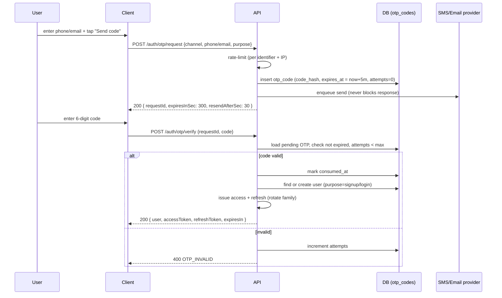
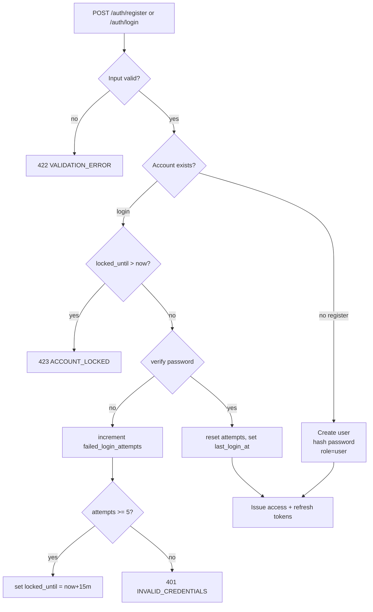
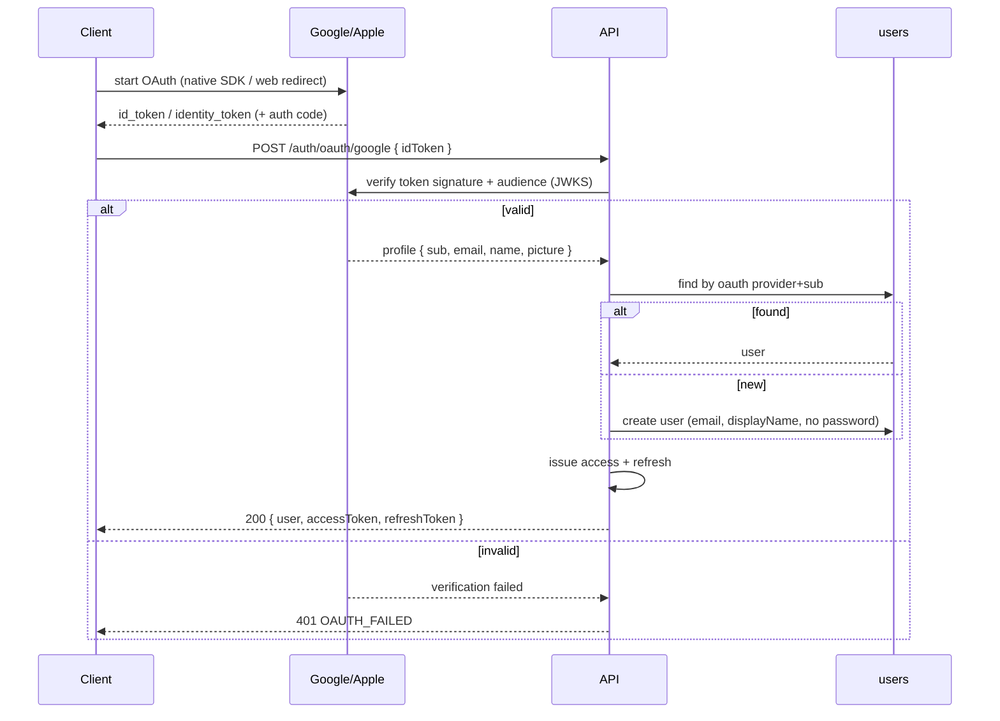
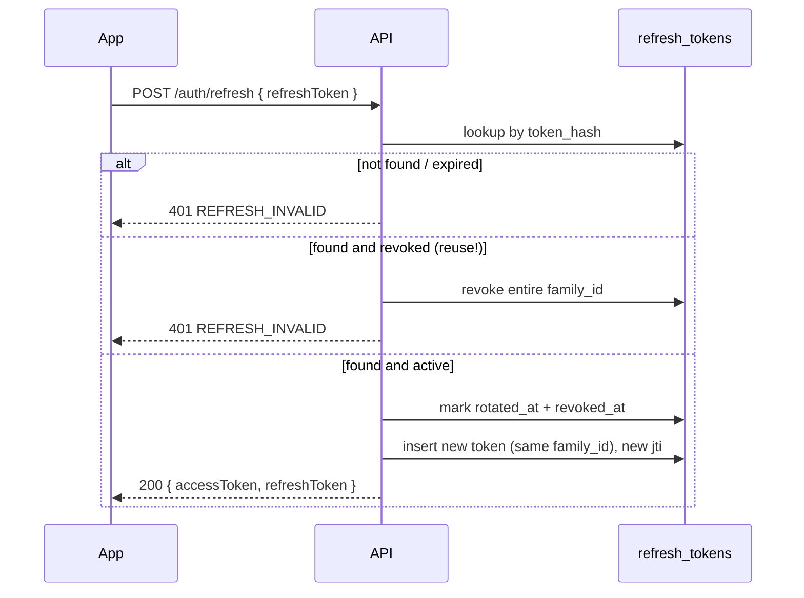
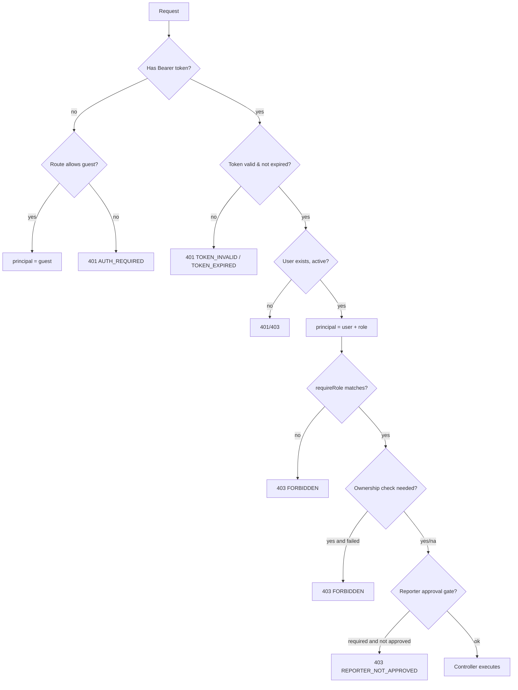
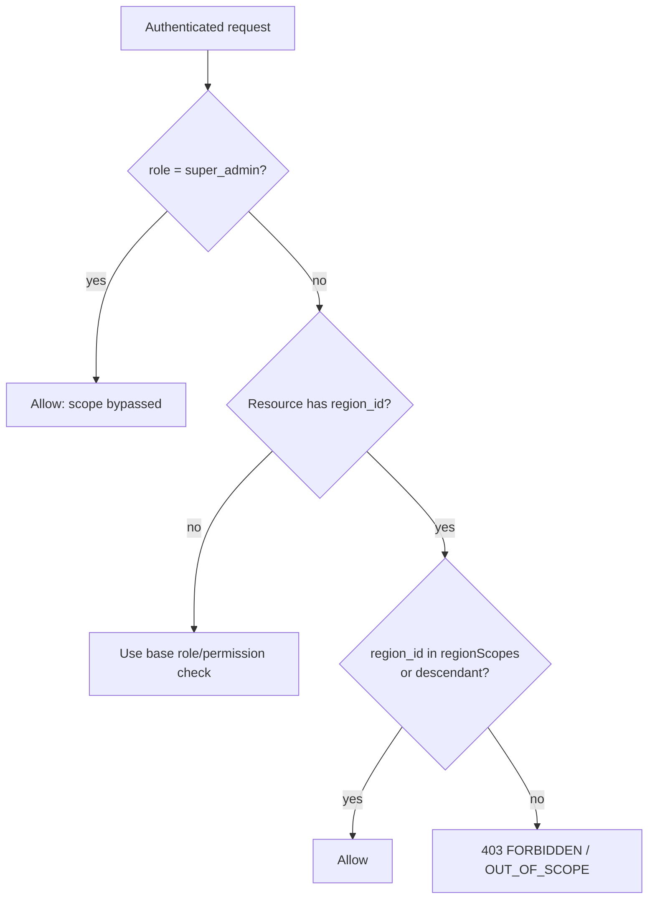
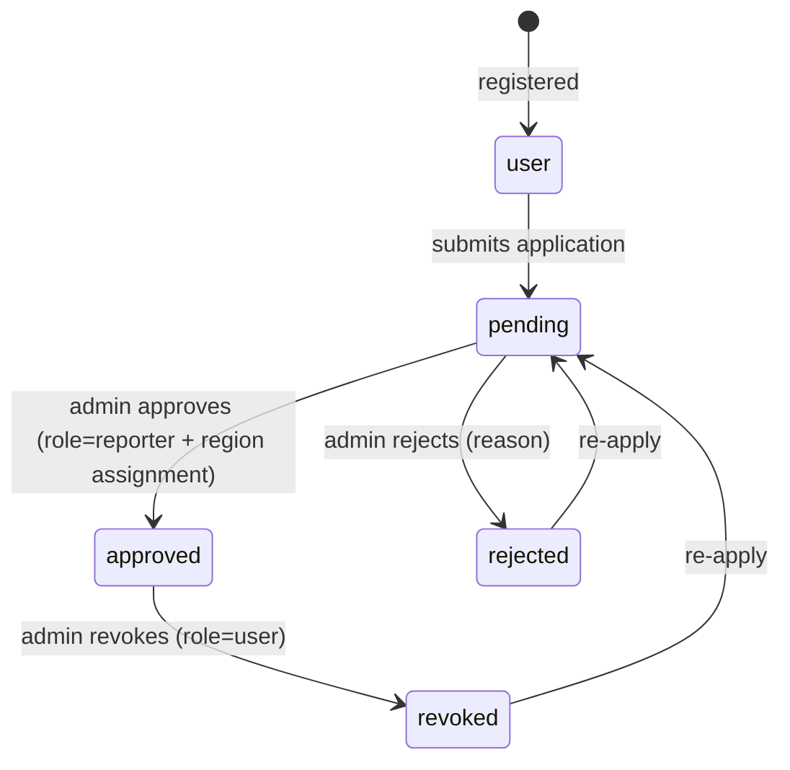

# 06 — Authentication & Authorization

> Complete auth design for NewsWatch: OTP login, email + password, OAuth
> (Google/Apple), JWT access + refresh with rotation, logout, session expiry,
> RBAC matrix, reporter-approval gating, rate limiting, and account lockout.

Related: [API §2 Auth](04-api.md#2-auth-auth) · [Database](05-database.md) ·
[Backend](03-backend-architecture.md) · [Mobile](01-mobile-architecture.md) ·
[Web](02-web-architecture.md) · [Integrations](07-third-party-integrations.md).

Scope note: **no payments/subscriptions**; there is no entitlement check. Every
authenticated User has full access to all free content. The authoritative role,
region, and deletion model lives in
[08-roles-regions-and-deletion.md](08-roles-regions-and-deletion.md).

---

## 1. Goals & principles

| ID | Principle |
|---|---|
| REQ-AUTH-001 | Users can sign in with OTP (phone/email), email+password, or OAuth (Google/Apple) |
| REQ-AUTH-002 | Guests can read all published content; auth is required only for engagement/personal features |
| REQ-AUTH-003 | Access tokens are short-lived; refresh tokens rotate and are single-use |
| REQ-AUTH-004 | RBAC is enforced server-side on every protected endpoint; UI gating is cosmetic |
| REQ-AUTH-005 | Reporter privileges require admin approval; an unapproved reporter cannot publish/submit |
| REQ-AUTH-006 | Auth endpoints are aggressively rate-limited and lock out on abuse |
| REQ-AUTH-007 | Tokens are never logged; refresh tokens are stored hashed |

---

## 2. Roles

There are **4 authenticated roles** plus unauthenticated **Guest** (see
[08-roles-regions-and-deletion.md](08-roles-regions-and-deletion.md) §1).

| Role (`users.role`) | Description | How obtained |
|---|---|---|
| **Guest** | Unauthenticated visitor | Default (no stored role) |
| **User** (`user`) | Normal user; engages and manages profile | Register / OTP / OAuth |
| **Reporter** (`reporter`) | Content creator; must be approved; added news within assigned regions | User applies → admin approves + region assignment |
| **Admin** (`admin`) | Approves/publishes news for a **specific region** (state → district → constituency → mandal) | Provisioned/seeded; promoted only by a super admin |
| **Super Admin** (`super_admin`) | "God user"; unrestricted. Only role that bypasses region scope | Provisioned/seeded; promoted only by another super admin |

Role is stored in `users.role` (`user_role` enum:
`user` / `reporter` / `admin` / `super_admin`). Reporter approval state is in
`reporter_profiles.status`. A user with `role='reporter'` but
`reporter_profiles.status='pending'` is an **unapproved reporter**. Reporter and
admin region assignments are stored in `reporter_region_scopes` and
`admin_region_scopes` respectively.

---

## 3. Authentication methods

### 3.1 Method comparison

| Method | Client | Identifier | Credential | Endpoints |
|---|---|---|---|---|
| OTP (SMS) | Mobile primary | `phone` (E.164) | 6-digit OTP | `POST /auth/otp/request`, `/auth/otp/verify` |
| OTP (Email) | Web/mobile | `email` | 6-digit OTP | same |
| Email + password | Web/mobile | `email` | password | `POST /auth/register`, `/auth/login` |
| Google OAuth | Mobile/web | Google account | ID token / code | `POST /auth/oauth/google` |
| Apple OAuth | iOS/mobile | Apple ID | identity token | `POST /auth/oauth/apple` |
| Password reset | All | email | email link/OTP | `/auth/password/forgot`, `/reset` |

### 3.2 OTP login flow



| ID | Requirement |
|---|---|
| REQ-AUTH-010 | OTP is 6 digits, expires in 300 s, max 5 verify attempts |
| REQ-AUTH-011 | OTPs are stored hashed (`code_hash`), never in plaintext |
| REQ-AUTH-012 | `purpose=reset` OTPs cannot create accounts |
| REQ-AUTH-013 | OTP verify creates a `user` account when no matching user exists |
| REQ-AUTH-014 | OTP request responds identically whether or not the account exists (no enumeration) |
| REQ-AUTH-015 | A consumed or expired OTP cannot be reused |
| REQ-AUTH-016 | Requests are limited to 5 / 15 min per identifier and 10 / 15 min per IP (REQ-SYS-381) |

### 3.3 Email + password



| ID | Requirement |
|---|---|
| REQ-AUTH-020 | Passwords hashed with **argon2id** (preferred) or bcrypt cost ≥ 12 |
| REQ-AUTH-021 | Password policy: 8–72 chars, at least one letter and one number |
| REQ-AUTH-022 | 5 failed logins lock the account for 15 minutes (`locked_until`) |
| REQ-AUTH-023 | Successful login resets `failed_login_attempts` to 0 |
| REQ-AUTH-024 | `INVALID_CREDENTIALS` never reveals whether the email exists |
| REQ-AUTH-025 | Registration enforces unique email and username (`409 SLUG_TAKEN`) |

### 3.4 OAuth (Google / Apple)



| ID | Requirement |
|---|---|
| REQ-AUTH-030 | OAuth tokens are verified against the provider JWKS (signature + `aud` + `exp` + `iss`) |
| REQ-AUTH-031 | Accounts are linked by provider subject; email match links to existing account |
| REQ-AUTH-032 | Apple "Hide My Email" relay addresses are stored as-is and treated as primary email |
| REQ-AUTH-033 | Apple requires `fullName` only on first authorization; persist it on first login |
| REQ-AUTH-034 | OAuth users have no password until they set one via reset |
| REQ-AUTH-035 | Provider outages return `502 UPSTREAM_ERROR`; password/OTP login remains available |

---

## 4. Tokens

### 4.1 JWT structure

Access token (JWT, HS256 or RS256):

```json
{
  "sub": "a1f0c2e4-...",
  "role": "user",
  "typ": "access",
  "iat": 1758536100,
  "exp": 1758537000,
  "jti": "b1e2...",
  "ver": 1
}
```

| Claim | Meaning |
|---|---|
| `sub` | User id (UUID) |
| `role` | `user` / `reporter` / `admin` / `super_admin` (snapshot; DB is authoritative) |
| `typ` | `access` or `refresh` |
| `iat` / `exp` | Issued/expiry (epoch seconds) |
| `jti` | Token id (enables revocation/blacklisting) |
| `ver` | Token schema version |

Refresh token is an opaque, high-entropy string (or JWT with `typ=refresh`),
**stored as a SHA-256 hash** in `refresh_tokens`. Raw value only ever shared with
the client.

### 4.2 TTLs

| Token | TTL | Storage |
|---|---|---|
| Access | 15 minutes (`ACCESS_TTL=15m`) | Mobile: memory. Web: httpOnly cookie |
| Refresh | 30 days (`REFRESH_TTL=30d`) | Mobile: `expo-secure-store`. Web: httpOnly cookie (path `/api/auth`) |
| OTP | 5 minutes | DB |
| Password reset | 15 minutes | DB |
| Account lock | 15 minutes | DB |

| ID | Requirement |
|---|---|
| REQ-AUTH-040 | Access tokens expire in ≤ 15 minutes |
| REQ-AUTH-041 | Refresh tokens expire in ≤ 30 days and are single-use |
| REQ-AUTH-042 | The `role` claim is advisory; authorization always re-reads the DB user |
| REQ-AUTH-043 | Tokens include `jti` for revocation |

### 4.3 Refresh rotation & reuse detection



| ID | Requirement |
|---|---|
| REQ-AUTH-050 | Every refresh rotates the refresh token (old one is revoked) |
| REQ-AUTH-051 | Reusing a revoked token revokes the entire token family and forces re-login |
| REQ-AUTH-052 | A unique `family_id` groups all descendants of one login |
| REQ-AUTH-053 | Rotation is atomic; concurrent refreshes must not both succeed |
| REQ-AUTH-054 | Expired/revoked refresh rows are purged after 30 days (REQ-SYS retention) |

### 4.4 Logout & session expiry

| Action | Effect |
|---|---|
| `POST /auth/logout` (single) | Revoke current refresh token family branch |
| `POST /auth/logout { allDevices: true }` | Revoke all active refresh tokens for the user |
| Access token expiry | Client refreshes transparently; no user-visible logout |
| Refresh token expiry/revocation | Session ends; client routes to Login |
| Password reset | Revoke all refresh tokens for the user (all devices) |
| Account suspension | `ACCOUNT_DISABLED`; all requests rejected |
| Reporter revocation | Role demoted; active refresh tokens remain but reporter routes deny |

| ID | Requirement |
|---|---|
| REQ-AUTH-060 | Logout revokes refresh tokens server-side (not just client deletion) |
| REQ-AUTH-061 | Password reset revokes every active session |
| REQ-AUTH-062 | A suspended user receives `403 ACCOUNT_DISABLED` on any authenticated request |
| REQ-AUTH-063 | Token expiry is enforced server-side using `exp`, not client clocks |

---

## 5. Client token handling

| Client | Access token | Refresh token | Notes |
|---|---|---|---|
| Mobile | Memory (Zustand) | `expo-secure-store` | Never persisted to AsyncStorage (REQ-SYS-101) |
| Web | httpOnly `Secure` cookie | httpOnly `Secure` cookie scoped `/api/auth` | JS never reads tokens (REQ-SYS-242) |
| Admin (web) | Same cookie flow | Same | Plus server-side role verification |

| ID | Requirement |
|---|---|
| REQ-AUTH-070 | Refresh tokens never touch localStorage/sessionStorage on the web |
| REQ-AUTH-071 | Mobile access token is memory-only and re-fetched via refresh on cold start |
| REQ-AUTH-072 | Web refresh uses SameSite=Lax + CSRF double-submit on BFF routes (REQ-SYS-243) |
| REQ-AUTH-073 | Tokens are scrubbed from logs, crash reports, and analytics |

---

## 6. Authorization (RBAC)

### 6.1 RBAC matrix

Legend: **Y** = allowed, **—** = denied, **O** = own/owned only, **A** = approved
reporter required, **S** = region-scoped (actor may act only on their assigned
region or a descendant; `super_admin` bypasses all scope).

| Resource / Action | Guest | User | Reporter | Admin | Super Admin |
|---|---|---|---|---|---|
| Read published article | Y | Y | Y | Y | Y |
| Read unpublished article | — | — | O (author) | Y (scoped) | Y |
| Browse feed/categories/search | Y | Y | Y | Y | Y |
| Like / bookmark article | — | Y | Y | Y | Y |
| Comment | — | Y | Y | Y | Y |
| Reply to comment | — | Y | Y | Y | Y |
| Edit/delete own comment | — | O | O | Y | Y |
| Follow reporter/category | — | Y | Y | Y | Y |
| Save/manage own bookmarks | — | Y | Y | Y | Y |
| View notifications | — | O | O | O | O |
| Register device (push) | — | Y | Y | Y | Y |
| Update own profile/settings | — | O | O | O | O |
| Apply to become reporter | — | Y | — | — | — |
| Create/edit draft article | — | — | Y + A | Y (scoped) | Y |
| Submit article for review | — | — | O + A | Y (scoped) | Y |
| Delete own draft | — | — | O | Y (scoped) | Y |
| View own reporter dashboard/analytics | — | — | Y + A | Y (scoped) | Y |
| Approve/reject/publish article | — | — | — | Y (scoped) | Y |
| Unpublish/soft-delete any article | — | — | — | Y (scoped) | Y |
| Manage categories | — | — | — | Y (scoped) | Y |
| Manage users / suspend | — | — | — | Y (scoped, users only) | Y |
| Approve/revoke reporters | — | — | — | Y (scoped) | Y |
| Moderate comments | — | — | — | Y (scoped) | Y |
| View platform analytics | — | — | — | Y (scoped) | Y |
| Purge CDN/cache tags | — | — | — | Y (scoped) | Y |
| Manage roles/permissions | — | — | — | — | Y |
| Manage regions (state/district/constituency/mandal) | — | — | — | — | Y |
| **Soft-delete a user** | — | — | — | — | Y |
| **Restore a soft-deleted user** | — | — | — | — | Y |
| **Purge a soft-deleted user** | — | — | — | — | Y |
| **Hard-delete an article** | — | — | — | — | Y |
| **Update app contact / ad settings** | — | — | — | — | Y |
| Manage super admins | — | — | — | — | Y |

Notes:
- **Admin** actions are **region-scoped**: an admin may act only on resources
  whose region is in `admin_region_scopes` or a descendant. Admin can never
  affect a `super_admin`, another `admin` outside scope, regions, or global
  settings.
- Only **Super Admin** bypasses scope (`REQ-REG-007`). Every other role is
  constrained by region on region-bound actions (`REQ-REG-004`).
- Only a **Super Admin** may soft-delete/restore/purge users, hard-delete
  articles, or edit app contact/advertisement settings.
- A user can never change their own role.

### 6.2 Enforcement



| ID | Requirement |
|---|---|
| REQ-AUTH-080 | Every protected route declares required roles; unmatched role → `403 FORBIDDEN` |
| REQ-AUTH-081 | Ownership checks (edit own comment, edit own draft) happen in the service layer |
| REQ-AUTH-082 | Admin bypasses ownership checks for moderation actions |
| REQ-AUTH-083 | Guest-readable routes never require a token; if present it is validated optionally |
| REQ-AUTH-084 | RBAC decisions are logged (actor, action, target, result) for audit |

### 6.3 Permission layer

Beyond the 5 fixed roles, `permissions` + `role_permissions` allow granular admin
capabilities (e.g. `article.approve`, `user.suspend`, `category.manage`).
`super_admin` holds all permissions globally; `admin` holds its capability set
**subject to region scope**; `reporter` holds `article.create` and
`article.submit` (subject to reporter region scope); `user` holds engagement
permissions.

| ID | Requirement |
|---|---|
| REQ-AUTH-085 | Permission checks are additive: role grants a permission set |
| REQ-AUTH-086 | Adding a new admin capability means adding a permission row, not code branching |
| REQ-AUTH-087 | Admin-only endpoints require `role IN ('admin','super_admin')` even if a permission is misconfigured |
| REQ-AUTH-088 | For region-bound actions, a permission grant is additionally gated by region scope (see §6.4) |

### 6.4 Region-scoped authorization

Authorization for anything tied to a region (articles, users, reporters,
categories) combines the role check with a **region scope** check.

- `auth` middleware resolves `req.user.regionScopes` after loading the principal:
  - `admin` → `SELECT region_id FROM admin_region_scopes WHERE user_id = $1`.
  - `reporter` → `SELECT region_id FROM reporter_region_scopes WHERE user_id = $1`.
  - `super_admin` → sentinel `['*']` (all regions); scope checks are bypassed.
  - `user` / guest → empty.
- The `regionScope` middleware (see [Backend §4](03-backend-architecture.md#4-middleware-chain))
  checks that the target resource's `region_id` is in `req.user.regionScopes`
  **or is a descendant** of a scoped region, using a recursive CTE over
  `regions.parent_id`.
- Scope is re-checked server-side on **every** request; it is never trusted from
  the client or cached beyond the request.



| ID | Requirement |
|---|---|
| REQ-AUTH-089 | `req.user.regionScopes` is resolved server-side from `admin_region_scopes` / `reporter_region_scopes` on each authenticated request |
| REQ-AUTH-089a | A region-bound action is allowed only if the target region is a scoped region or a descendant (REQ-REG-003, REQ-REG-004) |
| REQ-AUTH-089b | Only `super_admin` bypasses region scope (REQ-REG-007); out-of-scope access returns `403 FORBIDDEN` |
| REQ-AUTH-089c | Region scope is enforced for approve/publish, manage-users, reporter-approval, and category actions (see RBAC matrix §6.1) |

---

## 7. Reporter approval gating



| State | Can apply | Can create draft | Can submit | Visible in admin |
|---|---|---|---|---|
| user | yes | no | no | no |
| pending | no | no | no | yes |
| approved | no | yes | yes | yes |
| rejected | re-apply | no | no | yes |
| revoked | re-apply | no | no | yes |

| ID | Requirement |
|---|---|
| REQ-AUTH-090 | Only `user` role (and rejected/revoked former reporters) may submit a reporter application |
| REQ-AUTH-091 | Admin approval sets `users.role='reporter'` AND `reporter_profiles.status='approved'` AND writes one or more `reporter_region_scopes` rows, atomically |
| REQ-AUTH-091a | A reporter may only create/submit articles in an assigned region or a descendant (REQ-REG-002) |
| REQ-AUTH-092 | A pending reporter receives `403 REPORTER_NOT_APPROVED` on any reporter write route |
| REQ-AUTH-093 | Revocation demotes role to `user`; existing published articles remain but cannot be edited |
| REQ-AUTH-094 | Approval/rejection is recorded with reviewer id, note, and timestamp |

---

## 8. Abuse protection

| Control | Setting | Applies to |
|---|---|---|
| Per-IP auth rate limit | 10 / 15 min | login, register, otp, oauth |
| Per-identifier OTP limit | 5 / 15 min | otp request |
| Failed-login lockout | 5 attempts → 15 min lock | login |
| Token reuse detection | revoke family | refresh |
| OTP attempt cap | 5 attempts | otp verify |
| Generic auth responses | no account enumeration | register, forgot, otp |
| CAPTCHA (optional) | after repeated failures | register, otp request |
| Session anomaly logging | log ip + user agent | login, refresh |

| ID | Requirement |
|---|---|
| REQ-AUTH-100 | Auth abuse limits are enforced in Redis so they hold across instances |
| REQ-AUTH-101 | Lockout is per-account and per-IP to prevent both targeted and spray attacks |
| REQ-AUTH-102 | Repeated OTP requests to the same identifier are throttled and logged |
| REQ-AUTH-103 | Suspicious refresh reuse immediately invalidates the family and notifies the user |

---

## 9. Security hardening summary

| Area | Control |
|---|---|
| Transport | HTTPS/WSS only; HSTS in prod (REQ-SYS-020) |
| Password storage | argon2id / bcrypt ≥ 12 |
| Token storage | Hashed refresh tokens; access token never persisted on web |
| Secrets | JWT signing keys in secret store; rotation supported |
| Headers | helmet defaults (CSP, nosniff, frameguard) |
| CORS | Explicit origin allowlist; credentials only for trusted web origins |
| Input | Zod validation on all auth bodies; strict types |
| Logging | No tokens/passwords/OTPs in logs (REQ-SYS-411) |
| Enumeration | Uniform responses for register/forgot/otp |
| Revocation | `jti` blacklist / family revocation on compromise |

---

## 10. Failure & fallback behavior

| Failure | Behavior |
|---|---|
| SMS provider down | OTP request returns `502 UPSTREAM_ERROR`; email OTP may be offered; login by password/OAuth still works |
| Email provider down | Same as above; retry queued with backoff |
| OAuth provider down | `502 UPSTREAM_ERROR`; other login methods remain available |
| Redis down | Rate limits fail open with logging; token rotation still uses DB |
| DB down | Auth unavailable; API returns `503 SERVICE_UNAVAILABLE` |
| Clock skew | Server validates `exp` with a small leeway (±30 s) |

| ID | Requirement |
|---|---|
| REQ-AUTH-110 | No single third-party auth provider outage blocks all login methods |
| REQ-AUTH-111 | Auth failures degrade safely; never grant access on error |
| REQ-AUTH-112 | Provider errors are logged with correlation id, surfaced as `UPSTREAM_ERROR` |

---

## 11. Mapping to REQ-AUTH-* IDs

| ID range | Topic | Endpoints / artifacts |
|---|---|---|
| REQ-AUTH-001–007 | Principles | All auth |
| REQ-AUTH-010–016 | OTP | `/auth/otp/*` |
| REQ-AUTH-020–025 | Email+password | `/auth/register`, `/auth/login` |
| REQ-AUTH-030–035 | OAuth | `/auth/oauth/*` |
| REQ-AUTH-040–043 | JWT/TTL | `token.service` |
| REQ-AUTH-050–054 | Rotation | `/auth/refresh` |
| REQ-AUTH-060–063 | Logout/expiry | `/auth/logout` |
| REQ-AUTH-070–073 | Client storage | Mobile/Web |
| REQ-AUTH-080–089 | RBAC + region scope | `auth`/`rbac`/`regionScope` middleware |
| REQ-AUTH-090–094 | Reporter gating | `/reporter/*`, `/admin/reporters/*` |
| REQ-AUTH-100–103 | Abuse protection | `rateLimit` middleware |
| REQ-AUTH-110–112 | Fallbacks | All providers |

---

## 12. Open questions

- Whether to support passkeys/WebAuthn in a later phase.
- Refresh token binding to device fingerprint (currently `device_id` only).
- Whether admins need MFA (recommended but not specified for v1).
