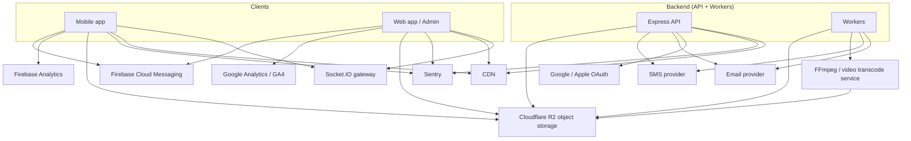

# 07 — Third-Party Integrations

> Every external service NewsWatch depends on: purpose, SDK/API, configuration
> and environment variables, and failure/fallback behavior. Also includes an
> integration diagram and a consolidated config table.

Related: [Overview](00-overview.md) · [Backend](03-backend-architecture.md) ·
[Mobile](01-mobile-architecture.md) · [Web](02-web-architecture.md) ·
[Auth](06-auth-and-authorization.md) · [API §13 Media](04-api.md#13-media--upload-media).

Scope note: **no payment integrations exist.**

---

## 1. Integration overview

---

## 2. Summary table

| # | Integration | Purpose | SDK / API | Env vars | Criticality | Fallback |
|---|---|---|---|---|---|---|
| 1 | Cloudflare R2 | Media upload + delivery | S3 API compatibility via AWS SDK v3 `@aws-sdk/client-s3` + `@aws-sdk/s3-request-presigner` | `R2_ACCOUNT_ID`, `R2_ACCESS_KEY_ID`, `R2_SECRET_ACCESS_KEY`, `R2_BUCKET`, `R2_ENDPOINT`, `R2_PUBLIC_BASE_URL`, `R2_SIGNED_URL_TTL` | Critical | Alternate bucket/region by config |
| 2 | Firebase Cloud Messaging | Push notifications | `firebase-admin` (server), FCM SDK (client) | `FIREBASE_*` | Important | In-app notifications still work |
| 3 | Google OAuth | Social login | Google Identity / `google-auth-library` | `GOOGLE_CLIENT_ID/SECRET` | Important | Other login methods |
| 4 | Apple OAuth | Social login (iOS) | Apple Sign In / JWKS | `APPLE_*` | Important | Other login methods |
| 5 | Firebase Analytics / GA4 | Product analytics | `@react-native-firebase/analytics`, `gtag` | `NEXT_PUBLIC_FIREBASE_*`, `GA_MEASUREMENT_ID` | Nice-to-have | Backend `/events` |
| 6 | Email provider | OTP + password reset | Provider REST/SDK (SES/SendGrid) | `EMAIL_PROVIDER_KEY`, `EMAIL_FROM` | Important | Queue + retry; alternate channel |
| 7 | SMS provider | OTP | Provider REST (Twilio/MSG91) | `SMS_PROVIDER_KEY`, `SMS_SENDER_ID` | Important | Email OTP |
| 8 | Socket.IO | Realtime comments | `socket.io`, `socket.io-client` | `SOCKET_PATH`, `SOCKET_CORS_ORIGIN` | Nice-to-have | REST polling/refresh |
| 9 | CDN | Static + image edge | Cloudflare CDN (R2 custom domain) / Vercel Edge | `R2_PUBLIC_BASE_URL`, CDN API key | Critical | Direct origin (slower) |
| 10 | Video processing / transcoding | Uploaded article video transcode + poster | Self-hosted FFmpeg workers **or** managed (e.g. Mux) | `VIDEO_PROCESSING_PROVIDER`, `FFMPEG_PATH`, `FFPROBE_PATH`, `VIDEO_MAX_BYTES`, `VIDEO_MAX_DURATION_SEC`, `MUX_*` | Important | Keep original; retry; upload `failed` state |
| 11 | Sentry | Error monitoring | `@sentry/node`, `@sentry/nextjs`, `@sentry/react-native` | `SENTRY_DSN` | Important | Structured logs |
| 12 | Maps (optional) | Location tagging | Map SDK | `MAPS_API_KEY` | Optional | No map; text location |

---

## 3. Object storage (Cloudflare R2)

### Purpose
Store and deliver all uploaded media: article images, avatars, and uploaded
article videos. Serve responsive image variants and video renditions through
Cloudflare's CDN with **zero egress fees**.

### API / SDK
- **Cloudflare R2** via its **S3 API compatibility**, using `@aws-sdk/client-s3`
  and `@aws-sdk/s3-request-presigner` (MinIO or R2 in dev).
- **Uploads:** the server issues **presigned PUT URLs** (and per-part presigned
  PUT URLs for multipart video uploads); clients upload directly to R2.
- **Private reads:** the server issues **presigned GET URLs** with a bounded TTL
  (`R2_SIGNED_URL_TTL`).
- **Large videos:** **multipart upload** (S3 API:
  `CreateMultipartUpload`/`UploadPart`/`CompleteMultipartUpload`).
- **Delivery:** a **public bucket behind Cloudflare CDN** (custom domain,
  `R2_PUBLIC_BASE_URL`) serves public media; no egress fees.

### Config / env vars

| Var | Example | Notes |
|---|---|---|
| `R2_ACCOUNT_ID` | `a1b2c3...` | Cloudflare account id |
| `R2_ACCESS_KEY_ID` | — | **Secret** (R2 API token) |
| `R2_SECRET_ACCESS_KEY` | — | **Secret** (R2 API token) |
| `R2_BUCKET` | `newswatch-media` | Bucket name |
| `R2_ENDPOINT` | `https://<account_id>.r2.cloudflarestorage.com` | R2 S3 API endpoint |
| `R2_PUBLIC_BASE_URL` | `https://cdn.newswatch.app` | Public bucket behind Cloudflare CDN (custom domain) |
| `R2_SIGNED_URL_TTL` | `600` | Presigned GET/PUT URL TTL (seconds) |
| `STORAGE_MAX_IMAGE_BYTES` / `VIDEO_MAX_BYTES` | `10485760` / `209715200` | Enforced per `media_assets.kind` (`media_kind` enum) |

### Behavior
- Image flow: `POST /media/sign` (presigned PUT) → client `PUT` → `POST /media/:id/complete` →
  worker processes variants + blurhash (`media_assets.processing_status = ready`).
- Video flow (large): `POST /media/sign` with `uploadType=multipart` →
  client `UploadPart` × N (per-part presigned PUT URLs) → `POST /media/:id/complete`
  with `parts/etag` → probe/transcode/poster workers (see §3.1).
- Public URLs are CDN-prefixed (`R2_PUBLIC_BASE_URL`); storage keys are
  UUID-based. Video renditions and poster images are stored as separate objects
  (`variants`, `poster_media_id`).

### Failure / fallback
| Failure | Behavior |
|---|---|
| Presigned URL generation fails | `502 UPSTREAM_ERROR`; client shows retry |
| Direct upload times out | Client retries with a fresh presigned URL |
| Upload confirms but processing fails | Asset `processing_status=failed` (+ `processing_error`); UI shows re-upload |
| Provider outage (R2) | Fallback proxy upload path (`POST /media/upload`) if configured; else block publishing new media; existing CDN content still serves |
| CDN outage | Serve from origin (slower) if configured; otherwise degraded media loading |
| Large multipart upload aborted | Parts remain in storage; `AbortMultipartUpload` cleanup job removes them after TTL; client restarts with a fresh `/media/sign` |

| ID | Requirement |
|---|---|
| REQ-SYS-540 | Uploads use short-lived presigned PUT URLs (≤ 10 min) scoped to one key |
| REQ-SYS-541 | Allowed image types jpeg/png/webp; max 10 MB |
| REQ-SYS-541A | Allowed video types mp4/webm/mov; max 200 MB and ≤ 3 minutes; large videos use multipart/resumable uploads |
| REQ-SYS-542 | Only `processing_status='ready'` assets may be attached to published articles (REQ-REP-099) |
| REQ-SYS-543 | Public delivery (`R2_PUBLIC_BASE_URL`, Cloudflare CDN) is separate from the R2 storage endpoint; private reads use presigned GET URLs |
| REQ-SYS-543A | Media is stored in Cloudflare R2 (S3 API compatibility) with zero egress fees |

### 3.1 Video processing / transcoding

### Purpose
Transcode **uploaded article videos** to broadly-playable **progressive
H.264/AAC MP4** and **WebM** (optionally packaging adaptive renditions),
generate a poster/thumbnail, and extract duration + dimensions — so a news
article can use an IMAGE **or** VIDEO hero and a mixed gallery
(REQ-REP-093..099). Transcoding output is stored in Cloudflare R2. Only
uploaded videos are supported; no broadcast/live ingest.

### API / SDK
Two supported modes, selected by `VIDEO_PROCESSING_PROVIDER`:

- **Self-hosted (default):** BullMQ workers invoking `ffmpeg`/`ffprobe` binaries
  (`FFMPEG_PATH`/`FFPROBE_PATH`) inside dedicated worker containers. Jobs:
  `media.probe`, `media.transcode`, `media.poster` (see
  [Backend §6.6](03-backend-architecture.md#66-mediaservice--transcodeworker)).
- **Managed:** Mux (`@mux/mux-node`) — direct upload + a
  provider webhook updates `processing_status`, renditions, and poster. The
  provider abstraction is the same `MediaProcessor` interface.

### Config / env vars

| Var | Example | Notes |
|---|---|---|
| `VIDEO_PROCESSING_PROVIDER` | `ffmpeg` \| `mux` | Selects the adapter |
| `FFMPEG_PATH` / `FFPROBE_PATH` | `/usr/bin/ffmpeg` | Self-hosted binary paths |
| `VIDEO_MAX_BYTES` | `209715200` | 200 MB hard limit |
| `VIDEO_MAX_DURATION_SEC` | `180` | 3-minute hard limit |
| `VIDEO_ADAPTIVE_RENDITIONS` | `true` \| `false` | Optional adaptive MP4 renditions |
| `MUX_TOKEN_ID` / `MUX_TOKEN_SECRET` | — | **Secret** (managed mode) |
| `MUX_WEBHOOK_SECRET` | — | **Secret** (webhook HMAC verify) |

### Behavior
- On `/media/:id/complete`, a video enqueues `media.probe`; probe validates
  duration ≤ 180 s, then `media.transcode` (progressive H.264/AAC MP4 with
  `+faststart`, plus WebM, optionally adaptive renditions) and `media.poster`
  (thumbnail stored as an image asset, linked via `poster_media_id`). Output is
  written to Cloudflare R2.
- `media_assets` moves `processing_status` `pending → processing → ready`, or
  `→ failed` with `processing_error`; `media_assets.kind` (`media_kind` enum)
  `='video'` selects this path, `codec` records `h264`, and `duration_seconds`
  records the probed length.

### Failure / fallback
| Failure | Behavior |
|---|---|
| Transcode job fails transiently | Retry with backoff; dead-letter after max attempts |
| Transcode/probe terminal failure | `processing_status=failed` + `processing_error`; offer re-upload (`MEDIA_PROCESSING_FAILED`) |
| Managed provider outage | Retry; optionally fall back to self-hosted FFmpeg if configured |
| WebM rendition fails | Serve progressive H.264 MP4 (`url`) as the primary rendition |
| Poster generation fails | Video remains `processing`/`failed`; client shows a placeholder frame |
| Duration > 3 min or size > 200 MB | Rejected at sign/complete: `VIDEO_TOO_LONG` / `VIDEO_TOO_LARGE` |

| ID | Requirement |
|---|---|
| REQ-REP-097 | Uploaded videos are transcoded server-side to progressive H.264 MP4 + WebM (optional adaptive renditions) |
| REQ-REP-098 | A poster/thumbnail is generated per video and duration + dimensions are extracted |
| REQ-SYS-544 | Video processing is asynchronous, retried, and never blocks article reading (REQ-SYS-346) |
| REQ-SYS-545 | The video adapter is swappable (self-hosted FFmpeg or managed Mux) without API changes |
| REQ-SYS-546 | Transcoded renditions and posters are stored in Cloudflare R2; only uploaded videos are supported (no broadcast/live ingest) |

---

## 4. Firebase Cloud Messaging (push)

### Purpose
Deliver push notifications for new/breaking articles, comment replies/likes,
and reporter status changes.

### API / SDK
- Server: `firebase-admin` (HTTP v1 API), batching + per-token error handling.
- Mobile: `expo-notifications` → FCM token.
- Web: FCM Web SDK (optional).

### Config / env vars
`FIREBASE_PROJECT_ID`, `FIREBASE_CLIENT_EMAIL`, `FIREBASE_PRIVATE_KEY` (secret),
plus client `google-services.json` / `GoogleService-Info.plist` / Firebase web
config.

### Behavior
- On login and token refresh, client sends token to `POST /devices`.
- Notification worker resolves the target devices and sends batches; invalid
  tokens (`UNREGISTERED`/`INVALID_ARGUMENT`) are deleted from `devices`.

### Failure / fallback
| Failure | Behavior |
|---|---|
| FCM send fails transiently | Retry with backoff (worker) |
| Token invalid | Remove token; do not retry |
| FCM outage | Notification still stored in `notifications`; badge/in-app list updates via Socket.IO |
| Permission denied | No push; in-app notifications only |

| ID | Requirement |
|---|---|
| REQ-SYS-550 | Server sends via FCM HTTP v1 using a service account |
| REQ-SYS-551 | Invalid tokens are pruned automatically |
| REQ-SYS-552 | Push is best-effort; `notifications` table is the source of truth |
| REQ-SYS-553 | Notification type/payload maps to deep links (see Mobile §11) |

---

## 5. Google OAuth

### Purpose
Social sign-in with a Google account.

### API / SDK
Google Identity Services (web), native Google Sign-In, verified server-side with
`google-auth-library` against Google JWKS.

### Config / env vars
`GOOGLE_CLIENT_ID`, `GOOGLE_CLIENT_SECRET` (secret), and platform client IDs
(iOS/Android/Web). Client IDs are public; the secret is server-only.

### Failure / fallback
| Failure | Behavior |
|---|---|
| Token verification fails | `401 OAUTH_FAILED` |
| Google outage | `502 UPSTREAM_ERROR`; password/OTP login still works |
| Email collision | Link to existing account after verification |

| ID | Requirement |
|---|---|
| REQ-SYS-560 | Verify `aud`, `iss`, `exp`, and signature before trusting the token |
| REQ-SYS-561 | Never trust client-supplied email without token verification |

---

## 6. Apple OAuth (Sign in with Apple)

### Purpose
Required for iOS apps offering third-party social login; also usable on web.

### API / SDK
Apple Sign In (native/web); server verifies the identity token against Apple
JWKS. Client secret (for web/code exchange) generated from a key.

### Config / env vars
`APPLE_CLIENT_ID` (Service ID / bundle id), `APPLE_TEAM_ID`, `APPLE_KEY_ID`,
`APPLE_PRIVATE_KEY` (secret), `APPLE_REDIRECT_URI`.

### Failure / fallback
| Failure | Behavior |
|---|---|
| Identity token invalid | `401 OAUTH_FAILED` |
| Apple outage | `502 UPSTREAM_ERROR`; other methods available |
| Private relay email | Stored as primary email; treated normally |
| Name only on first auth | Persist `fullName` on first successful login |

| ID | Requirement |
|---|---|
| REQ-SYS-570 | Verify identity token signature, `aud`, `iss`, `exp` |
| REQ-SYS-571 | Handle Apple private relay addresses without rejection |
| REQ-SYS-572 | Store Apple user identifier (sub) for account linking |

---

## 7. Analytics (Firebase Analytics / GA4)

### Purpose
Product analytics: screen views, article opens, engagement, search behaviour.

### API / SDK
- Mobile: `@react-native-firebase/analytics`.
- Web: Firebase Analytics / GA4 (`gtag`).
- Backend: mirror critical events to `analytics_events` via `POST /events` and
  worker ingestion.

### Config / env vars
Client: `NEXT_PUBLIC_FIREBASE_API_KEY`, `..._PROJECT_ID`, `..._APP_ID`,
`..._MEASUREMENT_ID`. Server inherits Firebase service account.

### Behavior
- Event names are a fixed catalog (Mobile §18). No raw search queries or PII.
- Server-side aggregates power the admin analytics console.

### Failure / fallback
| Failure | Behavior |
|---|---|
| Analytics SDK blocked/fails | Silent; never blocks UI |
| Backend `/events` fails | Client batches and retries; drop oldest beyond buffer |
| Mismatch client vs server | Backend events are authoritative for admin metrics |

| ID | Requirement |
|---|---|
| REQ-SYS-580 | Analytics never sends PII or raw search strings |
| REQ-SYS-581 | Analytics failures are non-blocking |
| REQ-SYS-582 | Admin analytics reads backend aggregates, not the client SDK |

---

## 8. Email provider

### Purpose
Deliver OTP codes and password-reset messages; optional digests.

### API / SDK
Provider abstraction (`EmailProvider`) implemented with Amazon SES / SendGrid.
Sending is always queued (`email.send` worker).

### Config / env vars
`EMAIL_PROVIDER` (`ses`|`sendgrid`|`smtp`), `EMAIL_PROVIDER_KEY` (secret),
`EMAIL_FROM` (e.g. `no-reply@newswatch.app`), `EMAIL_FROM_NAME`.

### Failure / fallback
| Failure | Behavior |
|---|---|
| Transient provider error | Retry with exponential backoff |
| Persistent failure | Dead-letter queue + alert; user offered SMS OTP or retry |
| Bounce/complaint | Mark email invalid; require re-verification |

| ID | Requirement |
|---|---|
| REQ-SYS-590 | Emails are sent via a queue, never inline in a request |
| REQ-SYS-591 | OTP correctness never depends on successful delivery (user can resend) |
| REQ-SYS-592 | Templates are versioned and contain no secrets |

---

## 9. SMS provider

### Purpose
Deliver OTP codes for phone login/signup and password reset.

### API / SDK
Provider abstraction (`SmsProvider`) with Twilio / MSG91 implementations; queued
via `sms.send` worker.

### Config / env vars
`SMS_PROVIDER` (`twilio`|`msg91`), `SMS_PROVIDER_KEY` (secret),
`SMS_SENDER_ID`, `SMS_TEMPLATE_OTP_ID` (DLT/template id where required).

### Failure / fallback
| Failure | Behavior |
|---|---|
| Transient error | Retry with backoff |
| Persistent error | Fallback to email OTP if the account has a verified email |
| Rate/abuse | Throttle per identifier + IP; return `OTP_RATE_LIMITED` |
| Delivery report failure | Log; do not block the request |

| ID | Requirement |
|---|---|
| REQ-SYS-595 | OTP SMS uses a DLT/template id where the provider requires it |
| REQ-SYS-596 | SMS sending is rate-limited per identifier AND per IP (REQ-SYS-381) |
| REQ-SYS-597 | Fallback to email OTP when SMS is unavailable and an email exists |

---

## 10. Socket.IO (realtime)

### Purpose
Live comments, reaction updates, and notification badges.

### API / SDK
Server `socket.io` + `@socket.io/redis-adapter`; clients `socket.io-client`.

### Config / env vars
`SOCKET_PATH` (default `/socket.io`), `SOCKET_CORS_ORIGIN`, `REDIS_URL` (adapter).

### Behavior
- Handshake authenticates the access token; rooms are `article:<id>`,
  `user:<id>`.
- Events: `comment:new`, `comment:updated`, `comment:deleted`,
  `reaction:update`, `notification:new`.

### Failure / fallback
| Failure | Behavior |
|---|---|
| Redis adapter down | Single-instance only; scale impaired but cached? — logged + alert |
| Client cannot connect | UI falls back to REST; pull-to-refresh works |
| Room emit fails | Best-effort; persisted state remains correct |
| Auth fails on handshake | Disconnect; client stays on REST |

| ID | Requirement |
|---|---|
| REQ-SYS-600 | Realtime is additive; REST is the source of truth (REQ-SYS-393) |
| REQ-SYS-601 | Socket scaling uses the Redis adapter for multi-instance fanout |
| REQ-SYS-602 | Private rooms are authorization-checked on join |

---

## 11. CDN

### Purpose
Edge-cache static assets, images, videos, and ISR/SSR output for fast
global delivery.

### API / SDK
Cloudflare CDN in front of the public R2 bucket (custom domain) or platform CDN
(Vercel). Purge via provider API or Next.js `revalidateTag`.

### Config / env vars
`R2_PUBLIC_BASE_URL`, `CDN_PROVIDER`, `CDN_API_KEY` (secret), `CDN_ZONE_ID`.
Cache tags flow through the admin `POST /admin/revalidate` endpoint.

### Behavior
- Immutable hashed static assets cached long-term.
- Images served via CDN with transform params (`w`, `q`, `fm`).
- **Video** renditions (progressive H.264 MP4 / WebM) and **posters** are
  CDN-cached as immutable, content-addressed objects (long-term cache).
- Article/category pages ISR-cached with tag-based invalidation on publish.

### Failure / fallback
| Failure | Behavior |
|---|---|
| CDN purge fails | Return `502 REVALIDATE_FAILED`; schedule retry; content refreshes on TTL |
| CDN origin pull fails | Serve direct from origin (slower) |
| Stale content after publish | TTL (60 s) eventually refreshes |

| ID | Requirement |
|---|---|
| REQ-SYS-610 | Media and static assets are always CDN-fronted in prod |
| REQ-SYS-611 | Publish/reject triggers cache-tag revalidation (REQ-SYS-220) |
| REQ-SYS-612 | Cache purge failures are retried and alerted |

---

## 12. Sentry (error monitoring)

### Purpose
Capture, group, and alert on errors across API, web, and mobile with release and
environment context.

### API / SDK
`@sentry/node` (API/workers), `@sentry/nextjs` (web + admin), and
`@sentry/react-native` (mobile). Release tagging per build.

### Config / env vars
`SENTRY_DSN` (secret), `SENTRY_ENVIRONMENT`, `SENTRY_TRACES_SAMPLE_RATE`,
`SENTRY_AUTH_TOKEN` (CI source maps).

### Behavior
- Request id / correlation id attached to events.
- 5xx and unhandled rejections captured; 4xx not treated as errors.
- Source maps uploaded in CI.

### Failure / fallback
| Failure | Behavior |
|---|---|
| Sentry unreachable | Events dropped; local structured logs remain |
| Sampling limits | Errors always sampled; traces sampled at configured rate |
| DSN missing | SDK no-ops; logging still active |

| ID | Requirement |
|---|---|
| REQ-SYS-630 | Errors include environment, release, and correlation id |
| REQ-SYS-631 | No PII or tokens in Sentry payloads |
| REQ-SYS-632 | Sentry outage never affects user requests |

---

## 13. Maps (optional, later phase)

### Purpose
Optional location tagging on reporter articles (e.g. dateline/city).

### API / SDK
Map/geocoding SDK (e.g. Google Maps, Mapbox).

### Config / env vars
`MAPS_PROVIDER`, `MAPS_API_KEY` (secret), `MAPS_STYLE_URL`.

### Failure / fallback
| Failure | Behavior |
|---|---|
| Map fails to load | Hide the map; show the location as text |
| Geocoding fails | Reporter enters location manually |
| Quota exceeded | Disable map picker until quota resets |

| ID | Requirement |
|---|---|
| REQ-SYS-640 | Maps are strictly optional; article creation and reading never depend on maps |
| REQ-SYS-641 | Location data is stored as text + optional lat/lng, never as a map-only field |

---

## 14. Environment variable reference (all integrations)

| Var | Integration | Secret |
|---|---|---|
| `R2_ACCOUNT_ID`, `R2_BUCKET`, `R2_ENDPOINT`, `R2_PUBLIC_BASE_URL` | Cloudflare R2 / CDN | no |
| `R2_ACCESS_KEY_ID`, `R2_SECRET_ACCESS_KEY` | Cloudflare R2 | **yes** |
| `R2_SIGNED_URL_TTL` | Cloudflare R2 | no |
| `CDN_PROVIDER`, `CDN_ZONE_ID` | CDN | no |
| `CDN_API_KEY` | CDN | **yes** |
| `FIREBASE_PROJECT_ID`, `FIREBASE_CLIENT_EMAIL` | FCM/Analytics | no |
| `FIREBASE_PRIVATE_KEY` | FCM | **yes** |
| `NEXT_PUBLIC_FIREBASE_*` | Analytics | no |
| `GA_MEASUREMENT_ID` | Analytics | no |
| `GOOGLE_CLIENT_ID` | OAuth | no |
| `GOOGLE_CLIENT_SECRET` | OAuth | **yes** |
| `APPLE_CLIENT_ID`, `APPLE_TEAM_ID`, `APPLE_KEY_ID` | OAuth | no |
| `APPLE_PRIVATE_KEY` | OAuth | **yes** |
| `EMAIL_PROVIDER`, `EMAIL_FROM`, `EMAIL_FROM_NAME` | Email | no |
| `EMAIL_PROVIDER_KEY` | Email | **yes** |
| `SMS_PROVIDER`, `SMS_SENDER_ID`, `SMS_TEMPLATE_OTP_ID` | SMS | no |
| `SMS_PROVIDER_KEY` | SMS | **yes** |
| `SOCKET_PATH`, `SOCKET_CORS_ORIGIN` | Realtime | no |
| `REDIS_URL` | Realtime/Queue | **yes** |
| `VIDEO_PROCESSING_PROVIDER`, `VIDEO_ADAPTIVE_RENDITIONS` | Video processing | no |
| `FFMPEG_PATH`, `FFPROBE_PATH`, `VIDEO_MAX_BYTES`, `VIDEO_MAX_DURATION_SEC` | Video processing | no |
| `MUX_TOKEN_ID`, `MUX_TOKEN_SECRET`, `MUX_WEBHOOK_SECRET` | Video processing (managed) | **yes** |
| `SENTRY_DSN`, `SENTRY_AUTH_TOKEN` | Monitoring | **yes** |
| `MAPS_PROVIDER`, `MAPS_STYLE_URL` | Maps | no |
| `MAPS_API_KEY` | Maps | **yes** |

| ID | Requirement |
|---|---|
| REQ-SYS-650 | All secrets are injected from a managed secret store, never committed (REQ-SYS-360) |
| REQ-SYS-651 | `.env.example` documents every key with placeholder values |
| REQ-SYS-652 | Client bundles expose only `NEXT_PUBLIC_*` / Expo `extra` non-secret config |

---

## 15. Integration patterns

| Pattern | Applies to | Rule |
|---|---|---|
| Adapter interface | Storage, Email, SMS | One interface, provider-specific implementations selectable by env |
| Queue + worker | Email, SMS, push, image processing, video transcode/probe/poster, analytics ingest | Never call providers inline on the request path |
| Circuit breaker (light) | All providers | After N consecutive failures, short-circuit with `UPSTREAM_ERROR` and cool down |
| Retry with backoff | All transient failures | Exponential, capped, then dead-letter |
| Idempotency | Send operations | `eventId`/`messageId` prevents duplicate sends |
| Secrets isolation | All | Secrets only in the API/worker environment, never clients |
| Observability | All | Log provider + operation + correlation id + latency; no PII |

| ID | Requirement |
|---|---|
| REQ-SYS-660 | Every provider call is wrapped by the adapter and time-bounded |
| REQ-SYS-661 | Provider failures are isolated; no single integration can take down reading |
| REQ-SYS-662 | Each integration reports success/failure metrics and alerts on error spikes |

---

## 16. Mapping to REQ areas

| Area | Integrations used |
|---|---|
| AUTH | SMS, Email, Google OAuth, Apple OAuth |
| FEED/READ/CAT/SEARCH | CDN, Cloudflare R2, Sentry, Analytics |
| NOTIF | FCM, Socket.IO, Email (optional) |
| COMMENT | Socket.IO |
| REP | Cloudflare R2 (image processing worker), Video processing / transcoding (FFmpeg or managed) |
| MEDIA | Cloudflare R2 (multipart/resumable uploads), Video processing / transcoding, CDN (video renditions + posters) |
| ADM | CDN revalidation, Analytics aggregates, Sentry |
| SYS | All (observability, secrets, adapters) |

---

## 17. Open questions

- Whether web push (FCM web) ships in v1 or later.
- Cloudflare R2 bucket/region placement and cache rules for `R2_PUBLIC_BASE_URL`.
- Whether email digest notifications are in scope.
