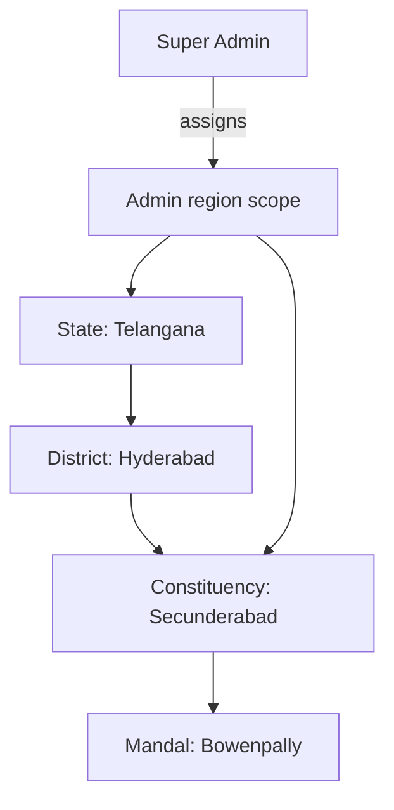
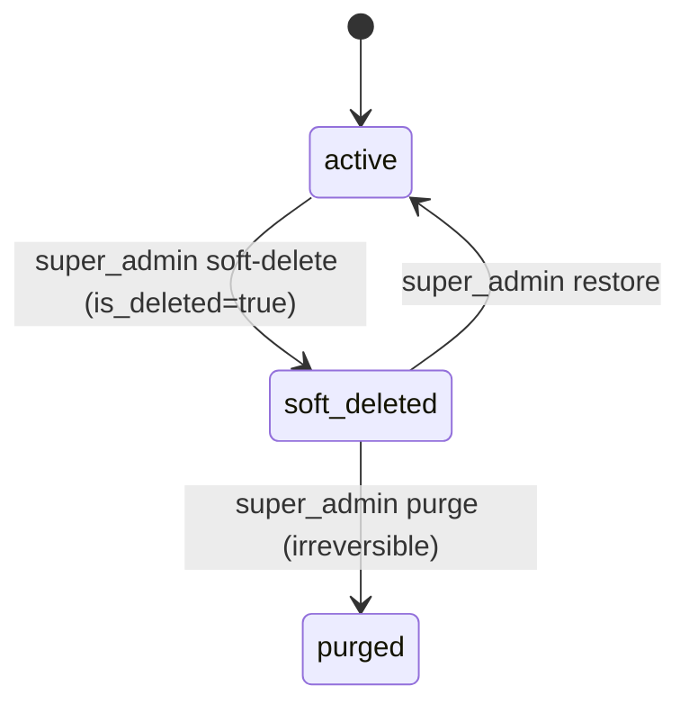

# 08 — Roles, Regions & Deletion Policy

Authoritative source for the platform's **role model**, **regional scoping**,
and **deletion policy**. Every other document MUST follow this file.

---

## 1. Roles

There are **4 authenticated roles** (plus unauthenticated **Guest**).

| # | Role (`users.role`) | Name | Summary |
|---|---|---|---|
| 0 | — | **Guest** | Not logged in. Browse, read, search. |
| 1 | `user` | **User** | Normal user. Engage (like, comment, bookmark, follow), manage profile. |
| 2 | `reporter` | **Reporter** | Can add news. Creates/submits articles within assigned regions. |
| 3 | `admin` | **Admin** | Approves/publishes news for a **specific region** (state → district → constituency → mandal). |
| 4 | `super_admin` | **Super Admin (God user)** | Unrestricted. Can do anything any other role can, plus dangerous actions. |

> **Guest** is not a stored role; it is the absence of an authenticated user.
> `users.role` is one of `user`, `reporter`, `admin`, `super_admin`.

### 1.1 Capability summary

| Capability | User | Reporter | Admin | Super Admin |
|---|:---:|:---:|:---:|:---:|
| Read / browse / search | Y | Y | Y | Y |
| Like / comment / bookmark / follow | Y | Y | Y | Y |
| Create & submit news | — | Y | Y | Y |
| Approve / reject / publish news | — | — | Y (own region) | Y (all regions) |
| Manage categories | — | — | Y (scoped) | Y (global) |
| Manage users (suspend, role change) | — | — | Y (own region, users only) | Y (all) |
| Approve/revoke reporters | — | — | Y (own region) | Y (all) |
| Manage regions (state/district/…) | — | — | — | Y |
| **Soft-delete a user** | — | — | — | Y |
| **Hard-delete an article** | — | — | — | Y |
| **Update app contact / ad details** | — | — | — | Y |
| Manage super admins | — | — | — | Y |

Hard rules:
- An **Admin** can NEVER affect a `super_admin`, another `admin` outside scope,
  or global settings.
- Only a **Super Admin** may soft-delete users, hard-delete articles, or edit
  app contact details.
- A user can never change their own role.

---

## 2. Region hierarchy

Geography is a 4-level tree. Each node is a **region** with a `type`:

```
State
 └── District
      └── Constituency
           └── Mandal
```

- Exactly one parent per region (self-referencing `regions.parent_id`).
- `regions.type ∈ {state, district, constituency, mandal}`.
- An article belongs to **exactly one region** (`articles.region_id`), normally
  the most specific one (mandal/constituency). Its effective scope is that
  region and all ancestors.

### 2.1 Admin regional scope

An Admin is assigned to one or more regions via `admin_region_scopes`
(`user_id`, `region_id`). An Admin may act on a region if the region is in their
scope **or is a descendant** of a scoped region.



Example: an Admin scoped to `Constituency: Secunderabad` may approve articles
in `Secunderabad` and its mandals (e.g. `Bowenpally`), but not in another
constituency. An Admin scoped to `State: Telangana` covers all its descendants.

### 2.2 Enforcement

| ID | Requirement |
|---|---|
| REQ-REG-001 | Every article MUST reference a `region_id`. |
| REQ-REG-002 | A reporter may only create articles in regions they are assigned to (or descendants). |
| REQ-REG-003 | An admin may only approve/reject/publish/unpublish articles whose `region_id` is in scope or a descendant. |
| REQ-REG-004 | Region scope is enforced server-side on every region-bound action. |
| REQ-REG-005 | Only a super_admin may create, edit, move, or delete regions. |
| REQ-REG-006 | Deleting a region with children or articles is blocked until those are reassigned (or cascades per policy). |
| REQ-REG-007 | Super admin actions are global; scope checks are bypassed only for `super_admin`. |

---

## 3. Deletion policy

### 3.1 Users — SOFT delete (Super Admin only)

- Deletion sets `users.is_deleted = true` (plus `deleted_at`, `deleted_by`).
- **No rows are physically removed.** All relations (comments, articles,
  bookmarks) are retained.
- Effects of soft delete:
  - The account cannot log in (`401 ACCOUNT_DELETED`).
  - The user is excluded from all normal listings/searches.
  - Their comments/articles remain but are attributed to "Deleted user" if the
    profile is hidden (anonymize-on-delete option).
- A Super Admin can **restore**: set `is_deleted = false`, clear `deleted_at`.
- Permanent purge of a soft-deleted user is an explicit Super Admin action
  ("purge") and still writes an audit record.



### 3.2 Articles — HARD delete (Super Admin only)

- Super Admin hard delete **permanently removes** the article row and its
  dependent rows (images, categories, likes, bookmarks, comments) via cascade.
- Media objects (Cloudflare R2) are queued for deletion.
- This is irreversible. A confirmation with typed title is required.
- Admins/reporters may **unpublish** or delete their own draft (soft status
  change), but only a Super Admin may hard delete a published article.

| Actor | Action on article | Effect |
|---|---|---|
| Reporter | Delete own draft | status set to `deleted` (soft), row kept |
| Admin | Unpublish | status → `unpublished` (soft) |
| Admin | Delete own-scope article | soft delete (`is_deleted = true`) |
| Super Admin | Hard delete | row + dependents physically removed |

### 3.3 Deletion requirement IDs

| ID | Requirement |
|---|---|
| REQ-DEL-001 | User deletion is a SOFT delete via `users.is_deleted = true`; rows are never physically removed except by explicit purge. |
| REQ-DEL-002 | Only `super_admin` may soft-delete or restore users. |
| REQ-DEL-003 | Soft-deleted users are excluded from all normal queries and cannot authenticate. |
| REQ-DEL-004 | Only `super_admin` may HARD delete articles; the row and dependents are physically removed. |
| REQ-DEL-005 | Every soft delete, restore, purge, and hard delete writes an immutable audit record. |
| REQ-DEL-006 | Soft-deleted entities support an "include deleted" filter for super_admin views only. |
| REQ-DEL-007 | The system must never allow the last `super_admin` to be deleted or demoted. |

---

## 4. App contact / advertisement details (Super Admin only)

- A keyed settings store (`app_settings`) holds public contact and advertising
  info: support email/phone, ad-sales email/phone, office address, WhatsApp,
  social links, and hours.
- Only `super_admin` may read-write these settings; `admin` and below may only
  read the public subset.

| ID | Requirement |
|---|---|
| REQ-ADS-001 | Only `super_admin` can update app contact/advertisement details. |
| REQ-ADS-002 | Contact changes are versioned and audited (actor, before, after, timestamp). |
| REQ-ADS-003 | Public contact info is exposed via a public endpoint; secrets are never exposed. |

---

## 5. Data model touchpoints

- `users.role`, `users.is_deleted`, `users.deleted_at`, `users.deleted_by`,
  `users.restored_at`.
- `regions(id, type, name, parent_id, ...)`.
- `admin_region_scopes(user_id, region_id)`.
- `reporter_region_scopes(user_id, region_id)`.
- `articles.region_id`, `articles.is_deleted` (soft), `articles.status`.
- `app_settings(key, value, is_public, updated_by, updated_at)`.
- `audit_logs(actor_id, action, target_type, target_id, meta, created_at)`.

See [`05-database.md`](05-database.md) for full schema and
[`06-auth-and-authorization.md`](06-auth-and-authorization.md) for enforcement.

---

## 6. Prototype mapping

| Feature | Prototype page |
|---|---|
| Role badges & user management | `prototypes/pages/a05-user-management.html` |
| Region management (super admin) | `prototypes/pages/a08-region-management.html` |
| App contact / ad settings (super admin) | `prototypes/pages/a09-app-settings-contacts.html` |
| Danger zone: soft-deleted users + hard delete articles | `prototypes/pages/a10-danger-zone.html` |
