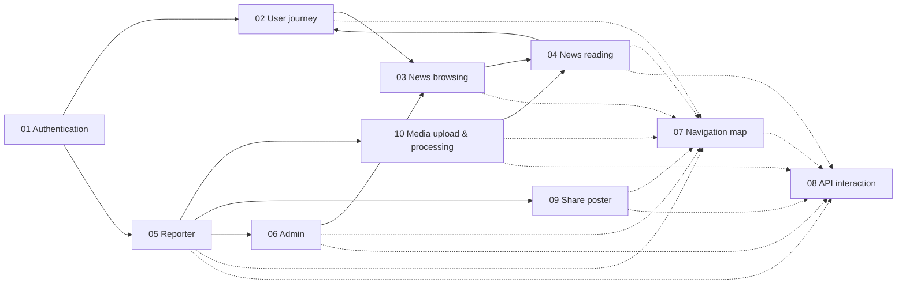

# Flows — Index

Cross-cutting flow and connectivity documentation for the NewsWatch platform.
Each flow describes how pages, roles, clients, and backend services connect for a
specific journey. Diagrams use [Mermaid](https://mermaid.js.org/) per
[`02-conventions.md`](../02-conventions.md).

> **Scope:** spec-only. No app code. All page references use IDs from
> [`01-page-index.md`](../01-page-index.md) and requirement IDs follow
> `REQ-<AREA>-<3-digit>`.

---

## 1. Flow catalog

| # | Flow | Doc | One-line description |
|---|---|---|---|
| 01 | Authentication | [01-authentication-flow.md](01-authentication-flow.md) | Guest becomes User: splash → onboarding → login/signup → OTP → role + region-scope resolution → role-based landing, plus OAuth, reset, refresh, logout, session expiry, reporter gate. |
| 02 | User journey | [02-user-flow.md](02-user-flow.md) | End-to-end user journey from launch through browse, engage, and return, including first-time vs returning branches and guest restrictions. |
| 03 | News browsing | [03-news-browsing-flow.md](03-news-browsing-flow.md) | Home feed ↔ listing scroller ↔ category ↔ search ↔ notifications, with region-scoped filtering, refresh, infinite scroll, filter/sort, empty states. |
| 04 | News reading | [04-news-reading-flow.md](04-news-reading-flow.md) | Entering and reading an article from all sources, in-article engagement, next-news, gallery, deep links, guest gating. |
| 05 | Reporter | [05-reporter-flow.md](05-reporter-flow.md) | User applies → admin approves + assigns region scope → compose for assigned regions → draft → submit → moderation → publish/reject → edit/resubmit, then generate a share poster (R05), with status lifecycle. |
| 06 | Admin | [06-admin-flow.md](06-admin-flow.md) | Region-scoped admin login → dashboard → in-scope article moderation, categories, users, reporter approvals, analytics; plus Super Admin branches for regions (A08), app/ad settings (A09), and danger zone (A10). |
| 07 | Navigation map | [07-navigation-map.md](07-navigation-map.md) | Full page-to-page map for mobile, web, and the admin console, including tabs, stacks, super-admin-only sidebar items, deep-link URL table, back/forward behavior. |
| 08 | API interaction | [08-api-interaction-flow.md](08-api-interaction-flow.md) | Client → gateway → middleware → controller → service → repo → DB lifecycle, auth/refresh, caching, pagination, errors, Socket.IO, uploads, push. |
| 09 | Share poster | [09-share-poster-flow.md](09-share-poster-flow.md) | Compose → open R05 Share Poster → pick 1 of 5 templates → headline/description colour + size → optional background photo → preview → export/share poster image + headline + description + link, with metadata saved on the article. |
| 10 | Media upload & processing | [10-media-upload-flow.md](10-media-upload-flow.md) | Reporter picks image/video → validate → (video) chunked/resumable upload to Cloudflare R2 → `/media/sign` + `/media/:id/complete` → transcode H.264/AAC MP4 (+ WebM) + poster job → status polling/webhook → `ready` → attach hero (image OR video) + mixed gallery (≤10) → P09 inline playback, with data-saver and per-media analytics. |

---

## 2. How flows relate

- **01–06** are role/journey flows (what the user and system do).
- **07** is the structural map (where every page can navigate).
- **08** is the technical substrate (how every client call reaches the backend).
- **09–10** are feature flows (share poster; image/video media upload + processing).

---

## 3. Role entry points

| Role | Primary flows | First landing page |
|---|---|---|
| Guest | 01, 02, 03, 04 | P01 → P07 (Home Feed, read-only) |
| User (`user`) | 01, 02, 03, 04 | P07 (Home Feed) |
| Reporter (`reporter`) | 01, 05, 09, 10, 03, 04 | R01 (Reporter Dashboard) or P07 |
| Admin (`admin`, region-scoped) | 01, 06 | A02 (Admin Dashboard) |
| Super Admin (`super_admin`) | 01, 06 | A02 (Admin Dashboard) |

Admin flows ([`06-admin-flow.md`](06-admin-flow.md)) are **region-scoped**: an
Admin only sees and acts on articles, users, and reporter applications within
their `admin_region_scopes` (and descendants). Super Admin flows are **global**
and additionally unlock A08 Region Management, A09 App Contact & Ad Settings, and
A10 Danger Zone.

---

## 4. Conventions used in every flow

- **Requirement IDs**: `REQ-<AREA>-<n>`; areas `AUTH, FEED, READ, CAT, SEARCH, BOOK, NOTIF, COMMENT, PROF, SET, REP, POSTER, ADM, REG, DEL, ADS, SYS`.
- **Page IDs**: `P01–P21` (reader/public), `R01–R05` (reporter), `A01–A10` (admin; A08–A10 super-admin only), `S01–S02` (system).
- **API base**: `/api/v1`; response envelope and errors per [`02-conventions.md`](../02-conventions.md#7-api-conventions).
- **Pagination**: cursor-based (`?cursor=&limit=`, `meta.nextCursor`, `meta.hasMore`).
- **Auth**: `Authorization: Bearer <accessToken>`; refresh via rotating refresh token.
- **Dates**: ISO-8601 UTC.
- **Mermaid types**: `flowchart TD/LR` for journeys, `sequenceDiagram` for API/client interactions, `stateDiagram-v2` for lifecycles.

---

## 5. Cross-flow invariants

| ID | Invariant |
|---|---|
| SYS-001 | Every network screen MUST render a loading (skeleton), empty, and error state. |
| SYS-002 | Every client request MUST attach the access token when authenticated and retry once after refresh on `401`. |
| SYS-003 | Guest gating MUST never block reading; it only gates write actions (like, comment, bookmark, follow, report). |
| SYS-004 | All navigation transitions MUST use `dur-slow` (300ms) and `ease-standard`. |
| ADM-001 | Only `admin` or `super_admin` role may access the admin console (`A01–A10`); server MUST enforce, not just the client. |
| REG-001 | Region scope (`admin_region_scopes` / `reporter_region_scopes`) MUST be enforced server-side; only `super_admin` bypasses scope checks. |
| DEL-001 | User deletion is SOFT (`is_deleted=true`, super-admin only, restorable); article deletion is HARD (super-admin only). |
| REP-001 | Only `reporter` (approved) or `admin`/`super_admin` role may create/submit articles, and only within assigned regions. |
