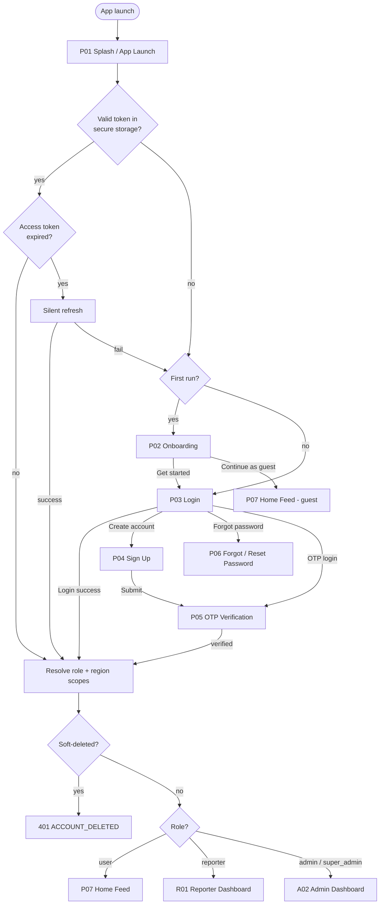
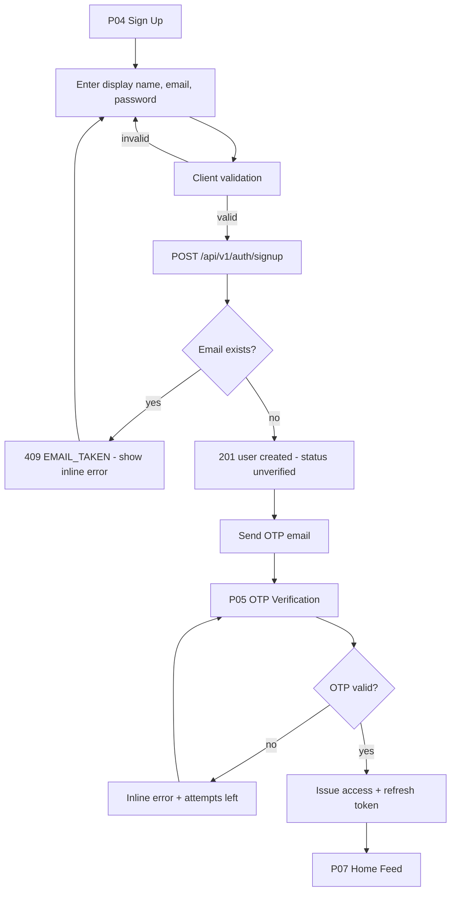
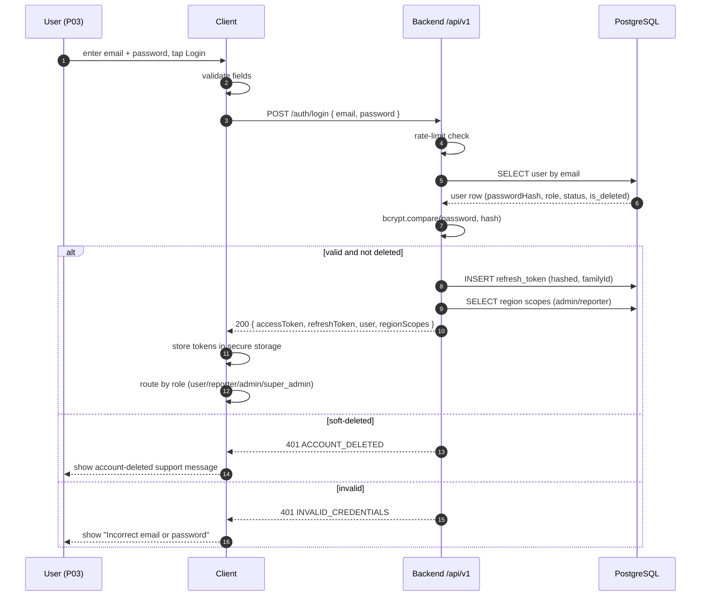
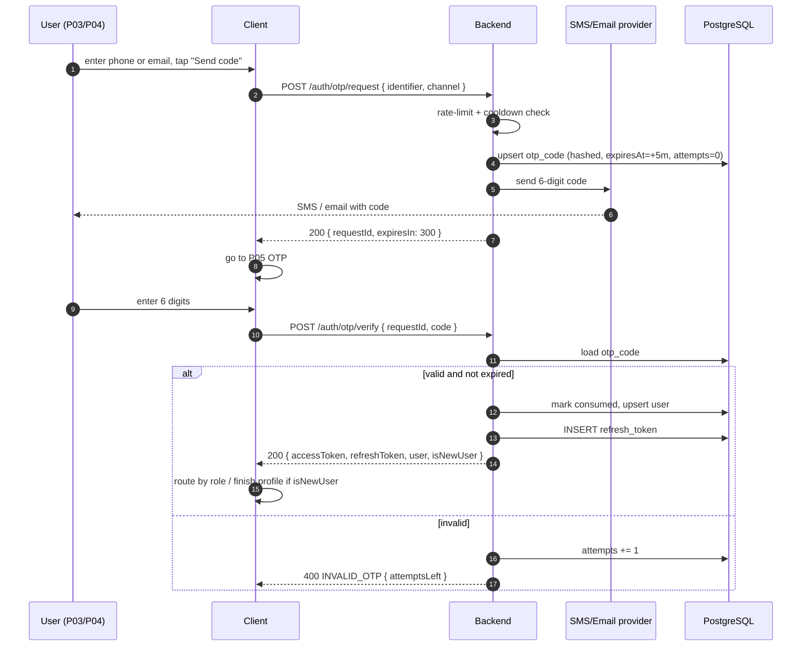
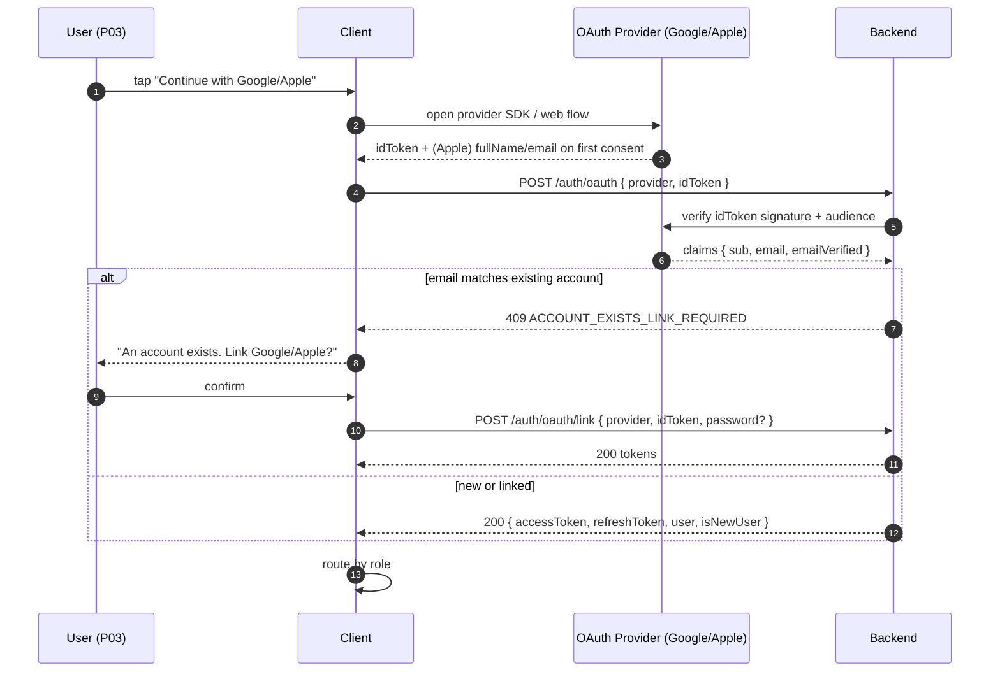
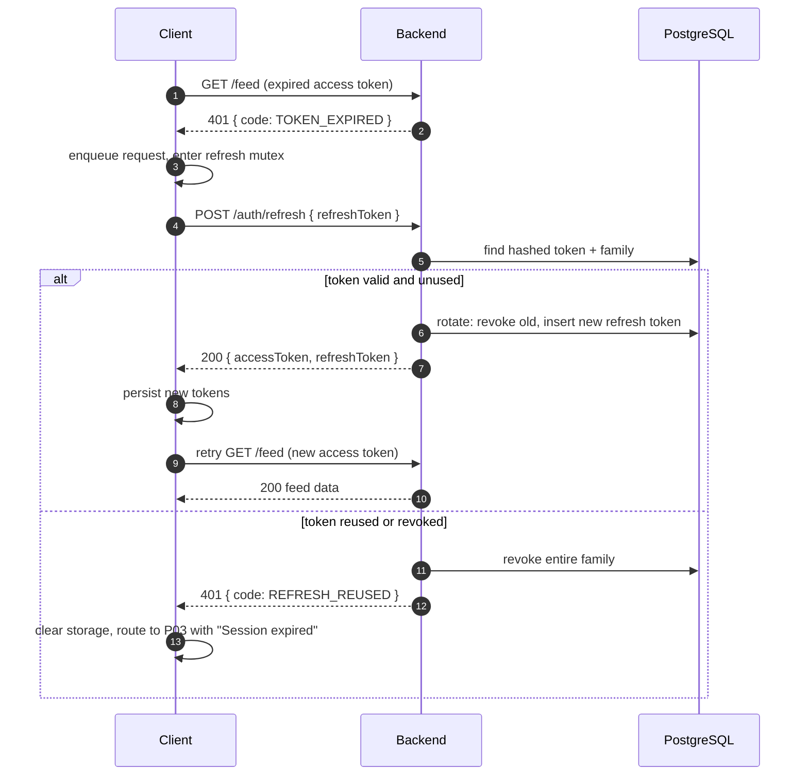
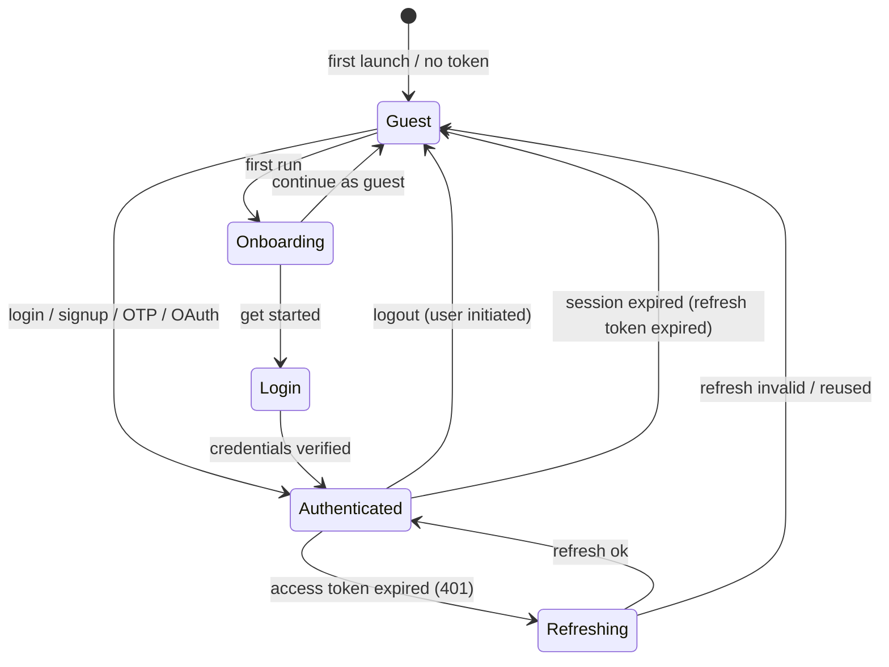
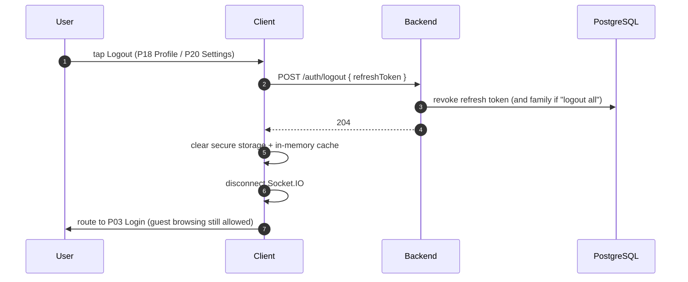

# 01 — Authentication Flow

Covers the complete Guest → User transition: app launch, onboarding,
login/signup, OTP verification, OAuth, password reset, token lifecycle, logout,
session expiry, role + region-scope resolution, and the reporter-approval gate.

| Field | Value |
|---|---|
| Roles | Guest → User (and Reporter/Admin/Super Admin variants) |
| Entry pages | P01 Splash / App Launch |
| Auth pages | P02 Onboarding, P03 Login, P04 Sign Up, P05 OTP Verification, P06 Forgot / Reset Password |
| Success target | P07 Home / News Feed (role-dependent; see §2) |
| Requirement areas | `AUTH` (primary), `SYS`, `REP`, `REG` |
| Priority | P0 (P06 is P1) |

---

## 1. Requirement map

| ID | Requirement | Priority |
|---|---|---|
| REQ-AUTH-001 | Guest MUST be able to continue to P07 without authenticating ("Continue as guest"). | P0 |
| REQ-AUTH-002 | Sign Up MUST support email + password, validating email uniqueness and password strength. | P0 |
| REQ-AUTH-003 | Login MUST support phone/email + OTP (passwordless). | P0 |
| REQ-AUTH-004 | Login MUST support email + password. | P0 |
| REQ-AUTH-005 | Login MUST support Google OAuth. | P0 |
| REQ-AUTH-006 | Login MUST support Apple OAuth (iOS mandatory when other social login exists). | P0 |
| REQ-AUTH-007 | OTP MUST be 6 digits, expire in 5 minutes, and allow max 5 verification attempts. | P0 |
| REQ-AUTH-008 | OTP MUST support resend with a 30-second cooldown and max 3 resends per session. | P0 |
| REQ-AUTH-009 | Forgot Password MUST send a reset link/OTP to the registered email and expire in 15 minutes. | P1 |
| REQ-AUTH-010 | Session MUST use a short-lived access token (15 min) and rotating refresh token (30 days). | P0 |
| REQ-AUTH-011 | Client MUST silently refresh the access token on `401 TOKEN_EXPIRED` and retry the request once. | P0 |
| REQ-AUTH-012 | Refresh token reuse detection MUST invalidate the whole session family. | P0 |
| REQ-AUTH-013 | Logout MUST revoke the refresh token server-side and clear local secure storage. | P0 |
| REQ-AUTH-014 | Session expiry MUST redirect to P03 with a "Session expired" message; guests are unaffected. | P0 |
| REQ-AUTH-015 | First successful login MUST route by role: user → P07, reporter → R01, admin/super_admin → A02. | P0 |
| REQ-AUTH-016 | Reporter/Admin features MUST be gated by server-side role checks; applying for reporter is P2. | P1 |
| REQ-AUTH-017 | OAuth account linking MUST merge with an existing email account after explicit confirmation. | P1 |
| REQ-AUTH-018 | Sign Up MUST capture a display name and optional avatar. | P1 |
| REQ-AUTH-019 | All auth endpoints MUST be rate-limited (e.g. 10 req/min per IP + identifier). | P0 |
| REQ-AUTH-020 | Tokens MUST be stored in OS secure storage (Keychain / Keystore) on mobile; `httpOnly` cookie or in-memory + secure storage on web. | P0 |
| REQ-AUTH-021 | On login the app MUST resolve the user's role (`user`, `reporter`, `admin`, `super_admin`) and, for reporter/admin, their assigned region scopes before landing. | P0 |
| REQ-AUTH-022 | A soft-deleted user (`is_deleted=true`) MUST be rejected at login with `401 ACCOUNT_DELETED`; see [`08-roles-regions-and-deletion.md`](../architecture/08-roles-regions-and-deletion.md). | P0 |

---

## 2. High-level launch → authenticated flow



### 2.1 Role + region-scope resolution

After credentials/OTP/OAuth succeed (or a stored session is restored), the client
calls `GET /auth/me` (or reads the token claims) to resolve:

- `user.role` — one of `user`, `reporter`, `admin`, `super_admin`
  (`users.role` is never `reader`).
- **Region scopes** — for `reporter`/`admin`, the assigned regions from
  `reporter_region_scopes` / `admin_region_scopes`. `super_admin` is global (no
  scope); a normal `user` has none.

The app then lands by role: **user → P07**, **reporter → R01**,
**admin/super_admin → A02**. Scope data drives which regions a reporter can
compose for and which articles/users an admin can act on
(REQ-REG-002, REQ-REG-003).

### 2.2 Soft-deleted accounts are rejected

A user whose `is_deleted = true` MUST NOT authenticate. Login (password, OTP, or
OAuth) returns `401 ACCOUNT_DELETED` and the client shows a support message; the
account can only be restored by a Super Admin (see
[`08-roles-regions-and-deletion.md`](../architecture/08-roles-regions-and-deletion.md#31-users--soft-delete-super-admin-only)).

---

## 3. Sign Up (email + password)



### Sign Up validation rules

| Field | Rule | Error message |
|---|---|---|
| Display name | Required, 2–50 chars, trimmed | "Enter your name (2–50 characters)" |
| Email | Required, valid RFC-5322, max 254 chars, unique | "Enter a valid email address" / "This email is already registered" |
| Password | Required, min 8 chars, ≥1 letter + ≥1 number | "Password must be at least 8 characters with a letter and a number" |
| Confirm password | Must equal password | "Passwords do not match" |
| Terms | Must be checked | "Please accept the Terms to continue" |

---

## 4. Login variants

### 4.1 Email + password



### 4.2 Phone/email + OTP (passwordless) and OTP signup



**OTP rules:** 6 digits, 5-minute TTL, max 5 attempts then invalidate, resend
cooldown 30s (max 3). UI on P05 shows a per-digit input, a live countdown, and a
"Resend code" button that is disabled until the cooldown elapses.

### 4.3 Google / Apple OAuth



**Apple notes:** name/email are only returned on first authorization, so the
client MUST POST `fullName` to `/auth/profile` immediately after first Apple
sign-in. "Hide My Email" relay addresses are accepted as the account email.

---

## 5. Forgot / Reset password (P06)

```mermaid
flowchart TD
  A[P06 request] --> B[Enter registered email/phone]
  B --> C[POST /auth/password/forgot]
  C --> D{Account exists?}
  D -- yes --> E[Send reset OTP/link expiring in 15 min]
  D -- no --> E2[200 generic response - do not leak existence]
  E --> F[User enters OTP / opens link]
  E2 --> F
  F --> G[Set new password meeting strength rules]
  G --> H[POST /auth/password/reset { token, newPassword }]
  H --> I{Valid token?}
  I -- no --> J[400 RESET_TOKEN_INVALID - retry]
  J --> F
  I -- yes --> K[Revoke all refresh tokens for user]
  K --> L[Auto-login or route to P03]
```

Security: the forgot response is always generic to prevent account enumeration.
Resetting the password revokes every active session (REQ-AUTH-012 family
invalidation).

---

## 6. Token lifecycle, refresh, and session expiry

### 6.1 Refresh retry



Only one refresh runs at a time (mutex); concurrent 401s await the same refresh
promise (REQ-AUTH-011, SYS-002).

### 6.2 Session state machine



| Session event | Access token | Refresh token | Client behavior |
|---|---|---|---|
| Login | issued (15 min) | issued (30 days) | store both securely |
| Refresh | re-issued | rotated | replace both atomically |
| Logout | client discards | server revokes | clear storage, go to P03/P07 guest |
| Expiry | invalid | invalid | redirect P03, toast "Session expired" |
| Reuse detected | invalid | whole family revoked | force re-login |

---

## 7. Logout



"Log out of all devices" additionally revokes all token families for the user.

---

## 8. Reporter-approval gate

A User may apply to become a Reporter (R04). Until approved, reporter routes
are inaccessible. Approval is performed by an Admin (A06), which also assigns a
**reporter region scope** (`reporter_region_scopes`); the reporter may then only
compose articles for those regions and their descendants (REQ-REG-002). See
[`05-reporter-flow.md`](05-reporter-flow.md) for the full lifecycle.

```mermaid
flowchart TD
  R7[User in P07/P18] --> APPLY[R04 Reporter Application]
  APPLY --> SUBMIT[POST /reporter/applications]
  SUBMIT --> PENDING[application status = pending]
  PENDING --> DASH[User sees "Application under review" in P18]
  DASH --> DEC{Admin decision A06}
  DEC -- approve --> ROLE[role upgraded user -> reporter + region scope assigned]
  ROLE --> NOTIF[Push + in-app notification]
  NOTIF --> R01[R01 Reporter Dashboard unlocked]
  DEC -- reject --> REJ[status = rejected + reason]
  REJ --> DASH
```

Gate enforcement:

- Client hides reporter entry points when `user.role` is not
  `reporter`/`admin`/`super_admin`.
- Server rejects `POST /articles` and reporter routes with `403 FORBIDDEN`
  unless the role claim is `reporter`/`admin`/`super_admin` (REQ-AUTH-016,
  REP-001), and further rejects regions outside the reporter's scope
  (REQ-REG-002).
- On approval, the issued access token's role claim is stale until the next
  refresh; clients MUST listen for the `role:updated` realtime event or refetch
  `/auth/me` to update the UI.

---

## 9. Auth API endpoints

| Method | Endpoint | Purpose | Auth |
|---|---|---|---|
| POST | `/api/v1/auth/signup` | Create account (email+password) | No |
| POST | `/api/v1/auth/login` | Email/password login | No |
| POST | `/api/v1/auth/otp/request` | Send OTP to phone/email | No |
| POST | `/api/v1/auth/otp/verify` | Verify OTP, issue tokens | No |
| POST | `/api/v1/auth/oauth` | Exchange Google/Apple idToken | No |
| POST | `/api/v1/auth/oauth/link` | Link OAuth to existing account | Yes/partial |
| POST | `/api/v1/auth/refresh` | Rotate tokens | Refresh token |
| POST | `/api/v1/auth/logout` | Revoke refresh token | Yes |
| POST | `/api/v1/auth/password/forgot` | Start reset | No |
| POST | `/api/v1/auth/password/reset` | Complete reset | Reset token |
| GET | `/api/v1/auth/me` | Current user profile + role | Yes |
| POST | `/api/v1/auth/profile` | Finish OAuth profile (name/avatar) | Yes |

All responses use the standard envelope
(`{ success, data, meta, error }`) from
[`02-conventions.md`](../02-conventions.md#7-api-conventions).

### Example — login success

```json
{
  "success": true,
  "data": {
    "accessToken": "eyJhbGciOi...",
    "refreshToken": "rt_9f2c...",
    "user": { "id": "0b6c...", "name": "Aarav", "role": "user", "avatarUrl": null }
  },
  "meta": { "accessExpiresIn": 900, "refreshExpiresIn": 2592000 },
  "error": null
}
```

### Example — login failure

```json
{
  "success": false,
  "data": null,
  "error": { "code": "INVALID_CREDENTIALS", "message": "Incorrect email or password", "fields": {} }
}
```

---

## 10. Auth error catalogue

| Code | HTTP | Meaning | Client handling |
|---|---|---|---|
| `VALIDATION_ERROR` | 400 | Field invalid | Inline field errors |
| `INVALID_OTP` | 400 | Wrong/expired code | Show attempts left, keep on P05 |
| `OTP_RATE_LIMITED` | 429 | Too many requests | Disable resend, show countdown |
| `INVALID_CREDENTIALS` | 401 | Bad email/password | Generic message on P03 |
| `TOKEN_EXPIRED` | 401 | Access token expired | Silent refresh + retry |
| `REFRESH_REUSED` | 401 | Refresh reuse detected | Clear session, go to P03 |
| `REFRESH_INVALID` | 401 | Refresh expired/revoked | Go to P03 "Session expired" |
| `EMAIL_TAKEN` | 409 | Signup email exists | Inline error + "Log in instead" |
| `ACCOUNT_EXISTS_LINK_REQUIRED` | 409 | OAuth email exists | Show link-account prompt |
| `RESET_TOKEN_INVALID` | 400 | Bad/expired reset token | Restart P06 |
| `ACCOUNT_SUSPENDED` | 403 | User blocked by admin | Show support message |
| `ACCOUNT_DELETED` | 401 | User soft-deleted (`is_deleted=true`) | Show account-deleted support message; do not retry |
| `FORBIDDEN` | 403 | Role lacks access | Hide route, redirect to home |

---

## 11. Navigation

| Action | From | To |
|---|---|---|
| Get started | P02 | P03 |
| Continue as guest | P02 | P07 (guest) |
| Create account | P03 | P04 |
| Send OTP / OTP login | P03 | P05 |
| Forgot password | P03 | P06 |
| Sign Up success + OTP verified | P05 | P07 |
| Reset complete | P06 | P03 (or P07 auto-login) |
| Login success (user) | P03 | P07 |
| Login success (reporter) | P03 | R01 |
| Login success (admin/super_admin) | P03 | A02 |
| Soft-deleted login attempt | P03 | stays on P03 with ACCOUNT_DELETED |
| Logout | P18 / P20 | P03 |
| Session expired | any protected screen | P03 |

---

## 12. Analytics events

| Event | Trigger | Properties |
|---|---|---|
| `auth_onboarding_view` | P02 shown | `firstRun` |
| `auth_signup_start` | P04 opened | `method` |
| `auth_signup_success` | Account created | `method` |
| `auth_login_start` | P03 submitted | `method` (password/otp/google/apple) |
| `auth_login_success` | Tokens issued | `method`, `role` |
| `auth_login_fail` | Login rejected | `method`, `errorCode` |
| `auth_otp_sent` | OTP requested | `channel` |
| `auth_otp_verified` | OTP verified | `channel`, `isNewUser` |
| `auth_password_reset` | Reset completed | — |
| `auth_logout` | Logout confirmed | `scope` (current/all) |
| `auth_session_expired` | Forced re-login | `reason` |
| `reporter_apply_submitted` | R04 submitted | — |

---

## 13. Open questions

- Should guest browsing be allowed indefinitely, or prompt login after N articles?
- Is phone OTP available globally or only in supported regions?
- Do we require email verification for email/password signups before full access?
