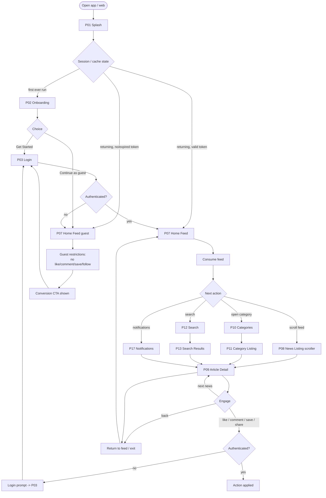
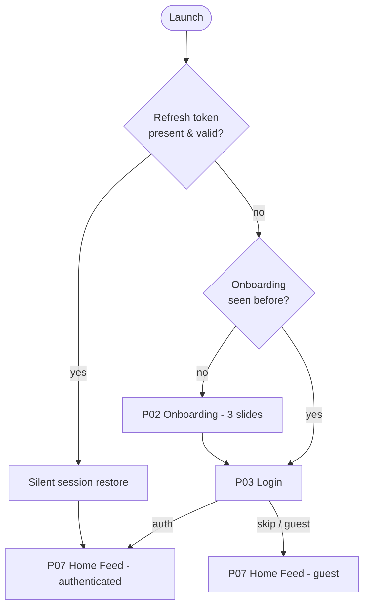
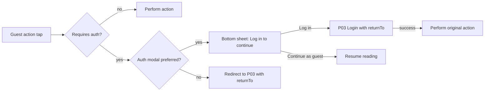
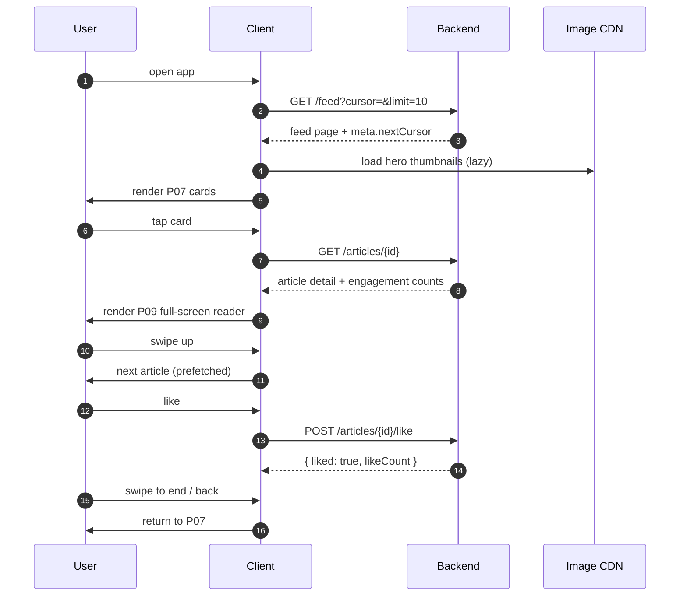

# 02 — User Flow (End-to-End User Journey)

The complete user journey from app launch through onboarding, optional
authentication, home feed consumption, browsing, reading, engagement, and
return — including first-time vs returning users, guest restrictions, and
conversion points.

| Field | Value |
|---|---|
| Roles | Guest, User |
| Start | P01 Splash / App Launch |
| End state | Returning user at P07 Home Feed (session persists) |
| Requirement areas | `SYS`, `FEED`, `READ`, `CAT`, `SEARCH`, `BOOK`, `COMMENT`, `NOTIF`, `PROF` |

---

## 1. Journey overview

---

## 2. First-time vs returning user

| Branch | Condition | Behavior |
|---|---|---|
| First-time | No onboarding flag AND no token | Show P02 (3 slides) → P03 → P07 |
| Returning, authenticated | Valid refresh token | Silent refresh, land on P07 logged in |
| Returning, logged out | No token, onboarding seen | Land on P07 guest; P03 reachable from profile |
| Expired session | Refresh invalid | Land on P07 guest + toast "Session expired" |

Onboarding flag stored at `s1.onboardingSeen = true` after P02 completion;
matches web `localStorage`, mobile secure/AsyncStorage.

---

## 3. Guest restrictions & conversion points

Guests can **read everything** but cannot perform write/social actions
(SYS-003). The first attempt at a gated action triggers a login prompt.

| Capability | Guest | User |
|---|---|---|
| Browse feed, listing, categories | Yes | Yes |
| Read article detail | Yes | Yes |
| Search | Yes | Yes |
| Like an article | No — prompt | Yes |
| Comment / reply | No — prompt | Yes |
| Bookmark / save | No — prompt | Yes |
| Follow category / reporter | No — prompt | Yes |
| View Bookmarks (P15) | No — prompt | Yes |
| Notifications (P17) | No — prompt | Yes |
| Profile / settings (P18–P20) | No — prompt | Yes |

Conversion points: P02 "Get Started", gated action sheet, P18 profile avatar
(guest → P03), end-of-article next-news card, and bookmark tab in S02 nav.

---

## 4. Core consumption loop

The loop repeats until the user exits. Prefetch of the next article begins when
the current article is 60% read or on swipe-down intent to keep
time-to-first-article < 3s (overview goal G1/G2).

---

## 5. Journey stages

| # | Stage | Pages | Key requirements |
|---|---|---|---|
| 1 | Launch | P01 | Fast cold start, restore session, cached feed |
| 2 | Onboarding | P02 | 3 slides, skip, value props |
| 3 | Auth (optional) | P03–P06 | Any of password/OTP/OAuth, guest bypass |
| 4 | Home feed | P07 | Scroll-snap cards, pull-to-refresh, infinite scroll |
| 5 | Browse | P08, P10, P11, P12, P13 | Continuous scroller, category rails, search |
| 6 | Read | P09 | Full-screen reader, gallery, next-news |
| 7 | Engage | P16 comments, like, bookmark, share | Guest gating, realtime counts |
| 8 | Return | P15, P17, P18–P20 | Bookmarks, notifications, profile |
| 9 | Exit / resume | P01 | Persist position, cache last feed |

---

## 6. Return & retention

- **Deep links** reopen directly at an article (P09) or category (P11); see the
  deep-link table in [`07-navigation-map.md`](07-navigation-map.md).
- **Push notification** taps (P17 entries) route to the referenced article.
- **Resume reading** restores the last feed position from cache within a TTL.
- **Bookmarks** (P15) provide a personal return surface for logged-in users.

---

## 7. Analytics events

| Event | Trigger | Properties |
|---|---|---|
| `app_launch` | P01 shown | `firstRun`, `hasSession` |
| `onboarding_complete` | P02 finished/skipped | `step` |
| `feed_view` | P07 visible | `source` |
| `feed_scroll_depth` | cards viewed | `count` |
| `article_open` | P09 entered | `articleId`, `source` (feed/cat/search/bookmark/notif) |
| `article_read_complete` | 90% scroll | `articleId`, `dwellMs` |
| `engagement_action` | like/comment/save/share | `action`, `authState` |
| `login_prompt_shown` | gated action by guest | `gateAction` |
| `login_prompt_converted` | guest logs in from prompt | `gateAction` |
| `session_exit` | app backgrounded/closed | `lastPage`, `cardsRead` |

---

## 8. Open questions

- Should onboarding slides be shown on web too, or only mobile?
- After N guest article reads, do we force a soft login wall?
- Should the app restore the exact scroll position on cold start? 
