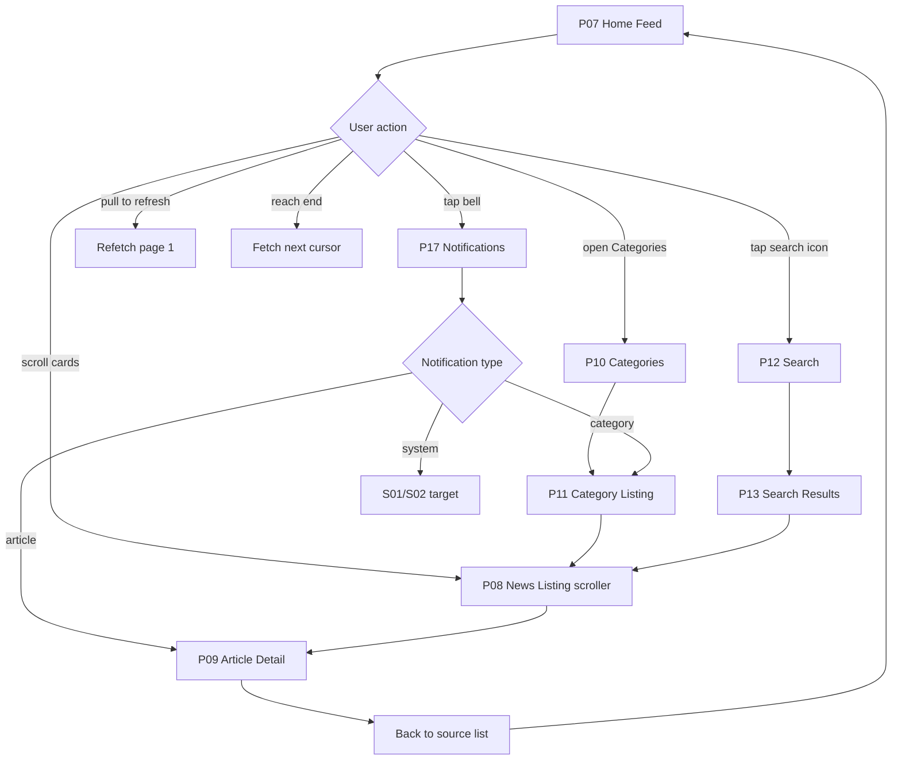
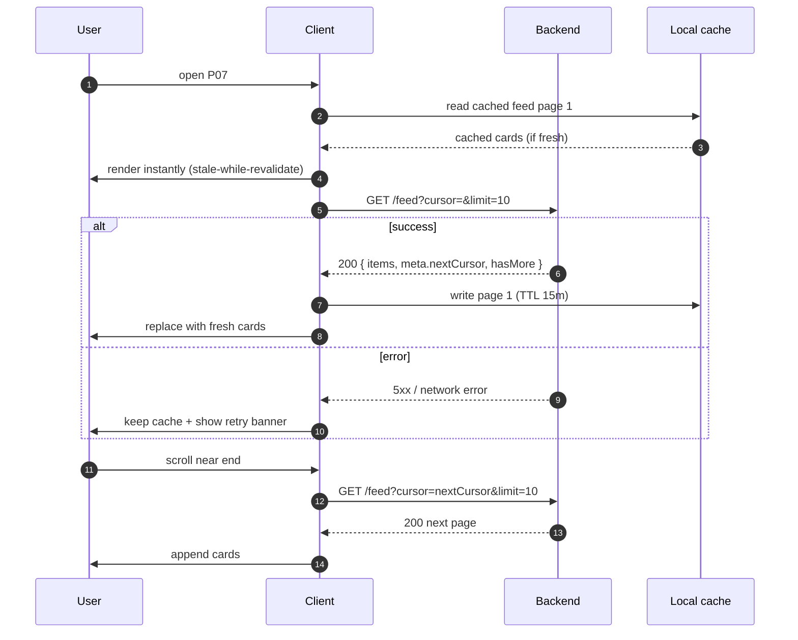
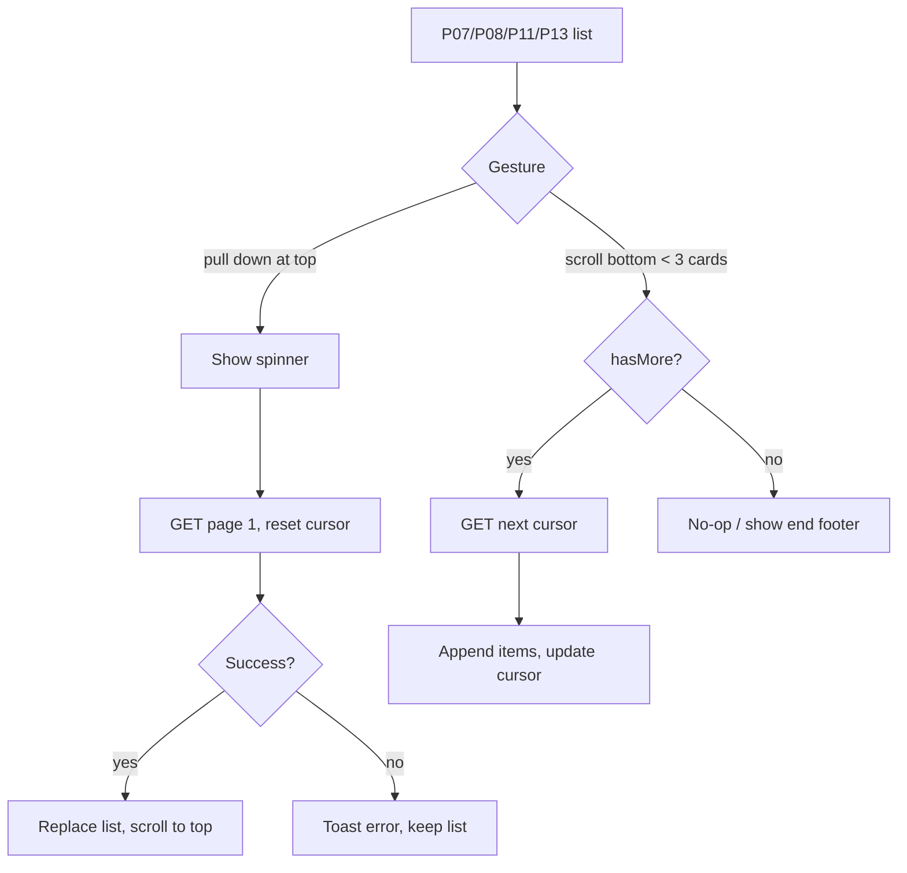
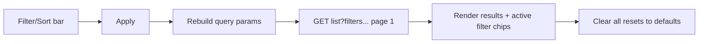
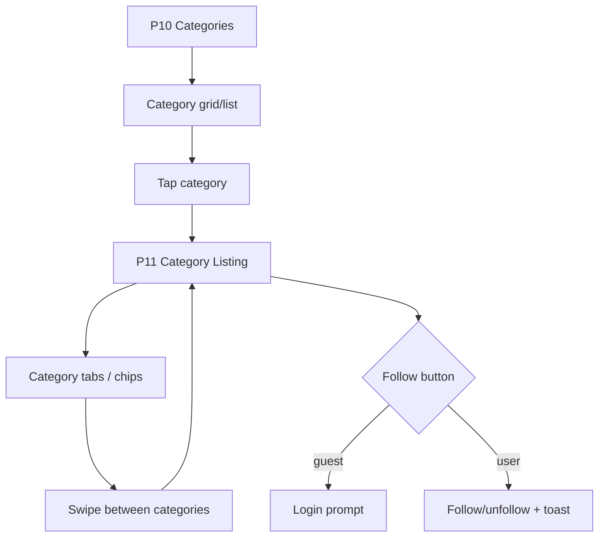
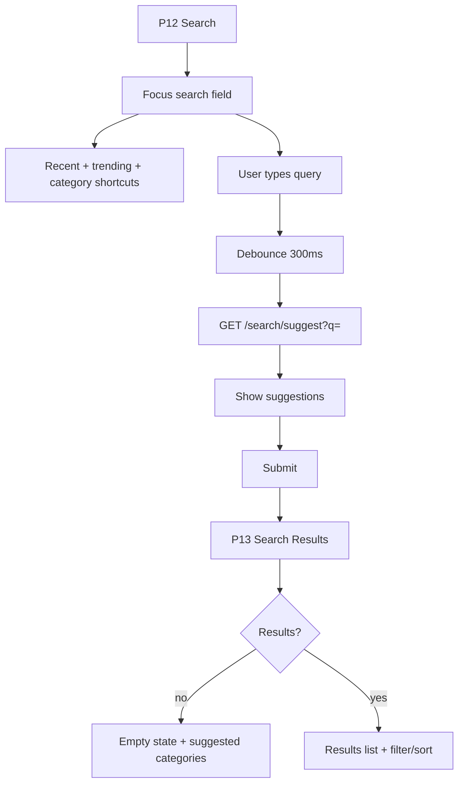
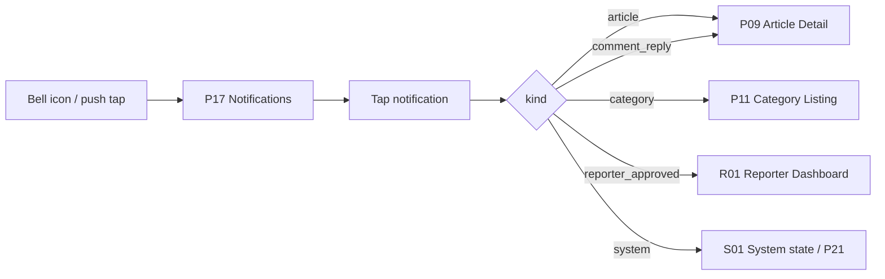

# 03 — News Browsing Flow

How users discover and move through content: Home Feed (P07) → News Listing
scroller (P08) → Categories (P10/P11) → Search (P12/P13) → Notifications (P17)
entry points → back to feed. Includes pull-to-refresh, infinite scroll,
filter/sort, empty and error states.

| Field | Value |
|---|---|
| Roles | Guest, User |
| Hub page | P07 Home / News Feed |
| Discovery pages | P08, P10, P11, P12, P13, P17 |
| Requirement areas | `FEED`, `CAT`, `SEARCH`, `NOTIF`, `REG`, `SYS` |

---

## 1. Requirement map

| ID | Requirement | Priority |
|---|---|---|
| REQ-FEED-001 | P07 MUST show a vertically scrollable, scroll-snapped list of article cards. | P0 |
| REQ-FEED-002 | P07 MUST support pull-to-refresh that re-fetches page 1 and resets cursor. | P0 |
| REQ-FEED-003 | P07 MUST support infinite scroll, fetching the next cursor when within 3 cards of the end. | P0 |
| REQ-FEED-004 | P07 MUST cache the last fetched page for offline/fast cold start (TTL 15 min). | P1 |
| REQ-FEED-005 | Each card MUST show hero image, category chip, title, summary, author, relative time, and like/comment counts. | P0 |
| REQ-FEED-006 | P07 MUST show a featured/hero article rail plus the chronological feed. | P1 |
| REQ-FEED-007 | P07 MUST expose entry points to categories, search, and notifications. | P0 |
| REQ-CAT-001 | P10 MUST list all active categories with name, icon/accent, and article count. | P0 |
| REQ-CAT-002 | P11 MUST list articles for one category with the same scroll/refresh behavior as P07. | P0 |
| REQ-CAT-003 | Users MUST be able to follow/unfollow a category (User only). | P1 |
| REQ-SEARCH-001 | P12 MUST offer query input, recent searches, trending topics, and category shortcuts. | P0 |
| REQ-SEARCH-002 | P13 MUST support filtering by type (articles/categories/reporters) and sort (relevance/latest). | P0 |
| REQ-SEARCH-003 | P13 MUST support infinite scroll and empty/no-result states. | P0 |
| REQ-NOTIF-001 | P17 entries MUST deep-link to their referenced article, category, or system page. | P0 |
| REQ-SYS-001 | Every list MUST render skeleton loading, empty, and error states. | P0 |
| REQ-SYS-002 | Offline state MUST show cached content and a retry banner. | P1 |

---

## 2. Discovery map



> **Region scoping:** feeds and listings can be filtered/scoped by region
> (`articles.region_id`), letting users browse state → district → constituency →
> mandal content (see [`08-roles-regions-and-deletion.md`](../architecture/08-roles-regions-and-deletion.md)).
> Discovery is for Guest/User; `admin`/`super_admin` are not primary consumers of
> these surfaces — they moderate via the admin console and preview articles only.

---

## 3. Home Feed (P07) load and pagination



### Feed states

| State | Mobile | Web |
|---|---|---|
| Loading | 3 skeleton cards (`shadow-card`, shimmer) | 6 skeleton cards in grid |
| Empty | Illustration + "No news yet" + Retry | Same, centered in content column |
| Error | Retry banner + cached content if any | Inline error block |
| Offline | Cached feed + "You're offline" toast | Cached feed + offline chip in header |
| End of list | "You're all caught up" footer | Same |

---

## 4. Pull-to-refresh & infinite scroll



Rules:

- Refresh resets `cursor` to `null` and **replaces** the list (no duplicates).
- Infinite scroll debounced; a loading footer spinner shows while fetching.
- Duplicate IDs are de-duplicated by `articleId` on append.
- A single in-flight page request per list; subsequent triggers are ignored.

---

## 5. Filter / sort

P11 (category) and P13 (search results) share the filter/sort bar:

| Control | Options | Default | Effect |
|---|---|---|---|
| Sort | Latest, Most read, Most liked | Latest | `order=publishedAt\|views\|likes` |
| Time | Any, Today, This week, This month | Any | `from=` / `to=` |
| Region (optional) | State / District / Constituency / Mandal | None (all) | `regionId=` (in-scope feed) |
| Type (P13 only) | Articles, Categories, Reporters | Articles | `type=` |
| Category (P13 only) | Multi-select active categories | None | `categoryIds=` |



Filters are encoded in the URL (web) and query params (mobile deep link) so
state is shareable and survives refresh.

---

## 6. Categories



- P10 shows active categories from `GET /categories`; inactive ones are hidden.
- P11 header shows category name, follow toggle, and filter/sort bar.
- Horizontal category chips let users switch categories without returning to P10.

---

## 7. Search



| State | Behavior |
|---|---|
| Idle | Recent searches (local), trending topics, category shortcuts |
| Typing | Debounced suggestions (300ms), max 8 items |
| No results | Illustration + "No results for '<q>'" + suggested categories |
| Error | Retry button preserving the query |
| Query too short | Require ≥2 chars before searching |

---

## 8. Notifications entry (P17)



Unread count badges the bell in S02; opening P17 marks items read via
`POST /notifications/read`.

---

## 9. Caching strategy

| Layer | What | TTL | Invalidation |
|---|---|---|---|
| Client memory | Current feed pages | session | Pull-to-refresh, category switch |
| Client disk | Last feed page 1, categories, bookmarks | 15 min | TTL, logout clears |
| CDN | Images, static assets | 24 h+ | Content hash |
| API response cache | Trending, categories | 60 s | Redis key per query |

---

## 10. API endpoints

| Method | Endpoint | Purpose |
|---|---|---|
| GET | `/api/v1/feed?cursor=&limit=` | Home feed page |
| GET | `/api/v1/feed/featured` | Featured/hero rail |
| GET | `/api/v1/articles?categoryId=&cursor=&limit=&sort=&from=&to=` | Listing / category feed |
| GET | `/api/v1/categories` | Active categories |
| GET | `/api/v1/categories/{id}` | Category detail |
| POST | `/api/v1/categories/{id}/follow` | Follow category |
| DELETE | `/api/v1/categories/{id}/follow` | Unfollow category |
| GET | `/api/v1/search?q=&type=&sort=&cursor=` | Search results |
| GET | `/api/v1/search/suggest?q=` | Suggestions |
| GET | `/api/v1/search/trending` | Trending topics |
| GET | `/api/v1/notifications?cursor=` | Notification list |

Pagination envelope:

```json
{
  "success": true,
  "data": { "items": [ { "...": "..." } ] },
  "meta": { "nextCursor": "eyJpZCI6...", "hasMore": true, "limit": 10 },
  "error": null
}
```

---

## 11. Navigation

| Action | From | To |
|---|---|---|
| Open categories | P07 | P10 |
| Open category | P10 | P11 |
| Open article card | P07/P08/P11/P13 | P09 |
| Open search | P07/P08 header | P12 |
| Submit search | P12 | P13 |
| Open notifications | P07/S02 bell | P17 |
| Notification tap | P17 | P09 / P11 / R01 / S01 |
| Back | P08/P09/P11/P13 | Source list |
| Back | P10/P12 | P07 |

---

## 12. Analytics events

| Event | Trigger | Properties |
|---|---|---|
| `feed_refresh` | Pull-to-refresh | `surface` |
| `feed_paginate` | Next cursor fetch | `surface`, `page` |
| `category_open` | P10 → P11 | `categoryId` |
| `category_follow` | Follow toggled | `categoryId`, `state` |
| `search_submit` | P12 → P13 | `query`, `resultCount` |
| `search_empty` | Zero results | `query` |
| `filter_apply` | Filter/sort changed | `filters` |
| `notification_open` | P17 item tapped | `kind`, `targetId` |
| `empty_state_view` | Empty list shown | `surface` |

---

## 13. Open questions

- Should the home feed be algorithmic/personalised or strictly chronological in v1?
- Do guests get personalised trending or a global trending list?
- Should category follow affect the home feed ranking or only notifications?
