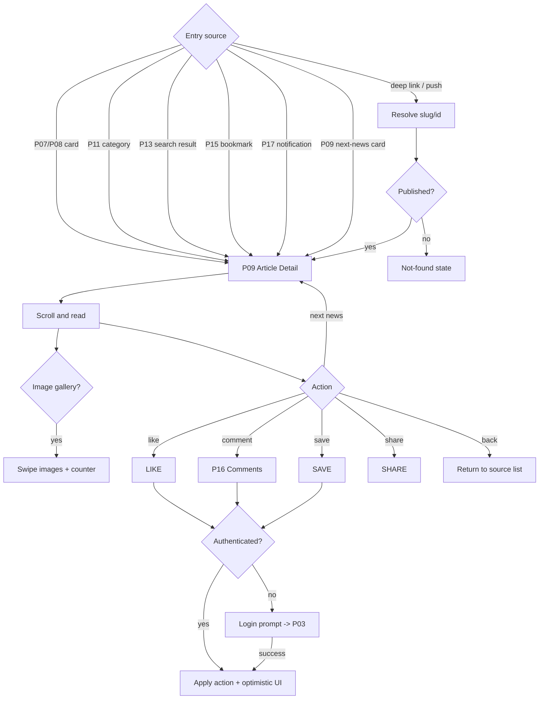
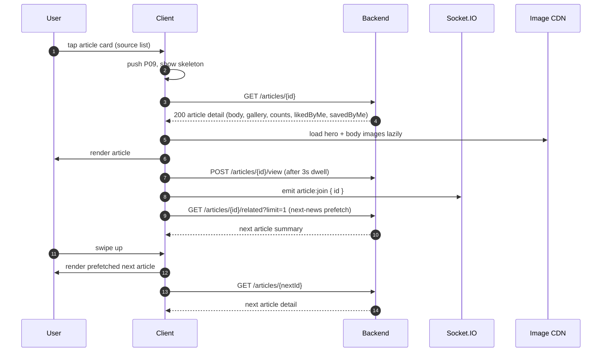
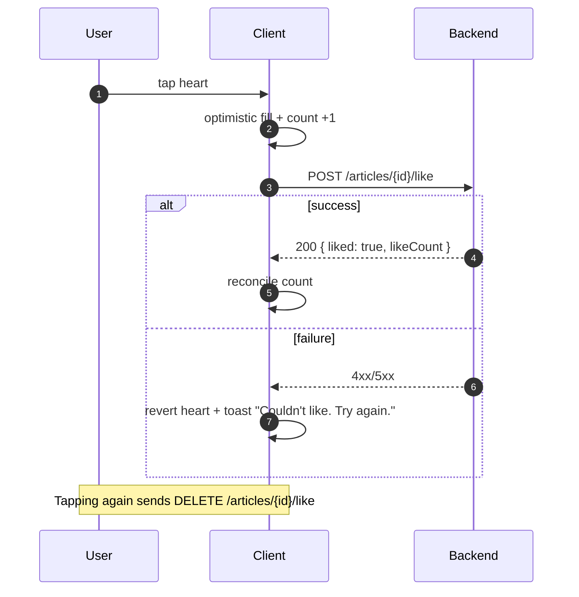
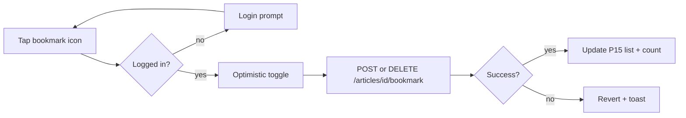
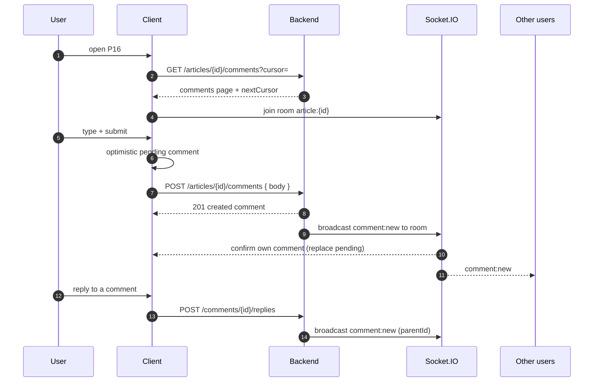
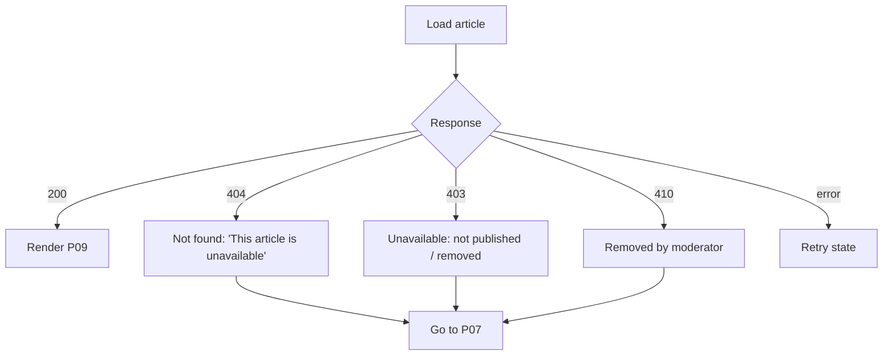

# 04 — News Reading Flow

Entering an article (P09 Article Detail / Reader) from any source, reading
full-screen, engaging (like / comment / share / save, P16), moving to next-news,
deep links, image gallery, and guest action gating.

| Field | Value |
|---|---|
| Roles | Guest, User |
| Entry points | P07 feed, P08 listing, P11 category, P13 search, P15 bookmarks, P17 notifications, deep link, push |
| Primary page | P09 Article Detail / Reader |
| Engagement page | P16 Comments |
| Requirement areas | `READ`, `COMMENT`, `BOOK`, `NOTIF`, `REG`, `POSTER`, `SYS` |

> **Region note:** an article carries `articles.region_id`; its effective scope is
> that region plus ancestors. Related/next-news and feeds may be filtered/scoped
> by region. Reading is a Guest/User-facing surface; `admin`/`super_admin` are not
> primary consumers (they preview articles from the console).

---

## 1. Requirement map

| ID | Requirement | Priority |
|---|---|---|
| REQ-READ-001 | P09 MUST render title, hero image/gallery, author, publish time, category, body, and counts. | P0 |
| REQ-READ-002 | P09 MUST support vertical scroll-snap between articles (next/previous). | P0 |
| REQ-READ-003 | P09 MUST prefetch the next article for instant swipe. | P1 |
| REQ-READ-004 | P09 MUST show a reading-progress indicator. | P1 |
| REQ-READ-005 | P09 MUST support multi-image gallery with swipe and image counter. | P0 |
| REQ-READ-006 | Article body MUST support rich text (headings, lists, quotes, links, embeds). | P0 |
| REQ-READ-007 | P09 MUST expose like, comment, share, and save actions. | P0 |
| REQ-READ-008 | P09 MUST include a "Next news" card linking to a related article. | P0 |
| REQ-READ-009 | Deep links MUST open the referenced article directly, with web fallback metadata. | P0 |
| REQ-READ-010 | Guest tapping a gated action MUST see a login prompt, then resume the action after login. | P0 |
| REQ-READ-011 | Article views MUST be counted once per user/session after 3s dwell. | P1 |
| REQ-READ-012 | P09 MUST render a not-found state for missing/unpublished articles. | P0 |
| REQ-COMMENT-001 | P16 MUST list comments with pagination, replies, and like counts. | P1 |
| REQ-COMMENT-002 | Users MUST be able to post and reply; edits are not supported in v1. | P1 |
| REQ-COMMENT-003 | New comments MUST appear in realtime via Socket.IO. | P1 |
| REQ-BOOK-001 | Save MUST toggle bookmark; state MUST persist across devices. | P1 |
| REQ-BOOK-002 | Saved state MUST be reflected on the P09 action bar. | P1 |

---

## 2. Entry sources → reading → next

---

## 3. Full read sequence (authenticated)

---

## 4. Engagement actions

### 4.1 Like

### 4.2 Save / bookmark

### 4.3 Share

Share uses the OS share sheet: link `https://newswatch.app/a/{slug}` plus
title. Web falls back to `navigator.share` or copy-link with a toast.

Where the reporter has generated a poster (R05 Share Poster), the P09 share
button surfaces that poster image and shares it with the headline, description,
and article link (REQ-POSTER-010); otherwise it falls back to link-only share.

### 4.4 Comments (P16)

Guest comment attempt: prompt to log in, preserve typed text, resume submit
after login (REQ-READ-010).

---

## 5. Scroll-snap scroller behavior

| Behavior | Mobile | Web |
|---|---|---|
| Snap | `pagingEnabled` vertical, one article per viewport | `scroll-snap-type: y mandatory` on reader container |
| Transition | `dur-slow` (300ms), `ease-standard` | CSS smooth scroll |
| Prefetch | Next article fetched at 60% read | Fetch on scroll threshold |
| Progress | Thin right-edge bar with `z-scroll-indicator` | Top progress bar |
| Gallery | Horizontal swipe within hero, counter `1/3` over `--scrim` | Arrow controls + dots |
| Back | Swipe-down or header back returns to source list, preserving scroll | Browser back / header back |
| Overscroll | Bounce disabled; last article shows "You're all caught up" | Same |

---

## 6. Deep links

Canonical article URL: `https://newswatch.app/a/{slug}`
App link: `newswatch://article/{id}` (with universal/app links fallback).

| Input | Resolution | Fallback |
|---|---|---|
| `https://newswatch.app/a/{slug}` | Fetch by slug → P09 | If app not installed, web renders P09 |
| `newswatch://article/{id}` | Fetch by id → P09 | — |
| Malformed/unknown slug | P09 not-found state | Link to P07 |

Web pages MUST emit OpenGraph/Twitter meta (title, description, image) for
share previews; app deep links respect the same slug.

---

## 7. Article not-found / unpublished

---

## 8. States

| State | Description |
|---|---|
| Loading | Skeleton hero block, title lines, body lines |
| Loaded | Full article + sticky action bar |
| Offline | Cached article if available, else offline banner + retry |
| Empty (comments) | "Be the first to comment" + composer |
| Error | Inline retry for article; optimistic revert for actions |
| End | Next-news card + "You're all caught up" |

---

## 9. API endpoints

| Method | Endpoint | Purpose |
|---|---|---|
| GET | `/api/v1/articles/{id}` | Article detail |
| GET | `/api/v1/articles/slug/{slug}` | Article by slug (deep link) |
| GET | `/api/v1/articles/{id}/related?limit=1` | Next-news |
| POST | `/api/v1/articles/{id}/view` | View count (3s dwell) |
| POST / DELETE | `/api/v1/articles/{id}/like` | Like / unlike |
| POST / DELETE | `/api/v1/articles/{id}/bookmark` | Save / unsave |
| GET | `/api/v1/articles/{id}/comments?cursor=` | Comments page |
| POST | `/api/v1/articles/{id}/comments` | Post comment |
| POST | `/api/v1/comments/{id}/replies` | Post reply |
| POST / DELETE | `/api/v1/comments/{id}/like` | Like / unlike comment |
| POST | `/api/v1/reports` | Report article/comment |

---

## 10. Navigation

| Action | From | To |
|---|---|---|
| Tap card | any list | P09 |
| Next news | P09 | P09 (next article) |
| Open comments | P09 | P16 |
| Back | P09 | source list / P07 |
| Deep link | external | P09 |
| Not-found CTA | P09 | P07 |
| Login prompt | P09/P16 gated action | P03 (returns to P09) |

---

## 11. Analytics events

| Event | Trigger | Properties |
|---|---|---|
| `article_open` | P09 rendered | `articleId`, `source`, `position` |
| `article_view` | 3s dwell | `articleId` |
| `article_read_complete` | 90% scroll | `articleId`, `dwellMs` |
| `article_scroll_depth` | 25/50/75/100% | `articleId`, `depth` |
| `gallery_swipe` | Image changed | `articleId`, `index`, `total` |
| `article_like` | Like toggled | `articleId`, `state` |
| `article_bookmark` | Save toggled | `articleId`, `state` |
| `article_share` | Share invoked | `articleId`, `channel` |
| `comment_open` | P16 opened | `articleId` |
| `comment_post` | Comment submitted | `articleId`, `isReply` |
| `next_news_tap` | Next-news card tapped | `fromId`, `toId` |
| `login_prompt_shown` | Gated action | `gateAction` |

---

## 12. Open questions

- Should reading progress sync across devices for logged-in users?
- Do we allow comment editing/deletion within a grace period?
- Is reporting content available to guests (anonymous) or users only?
