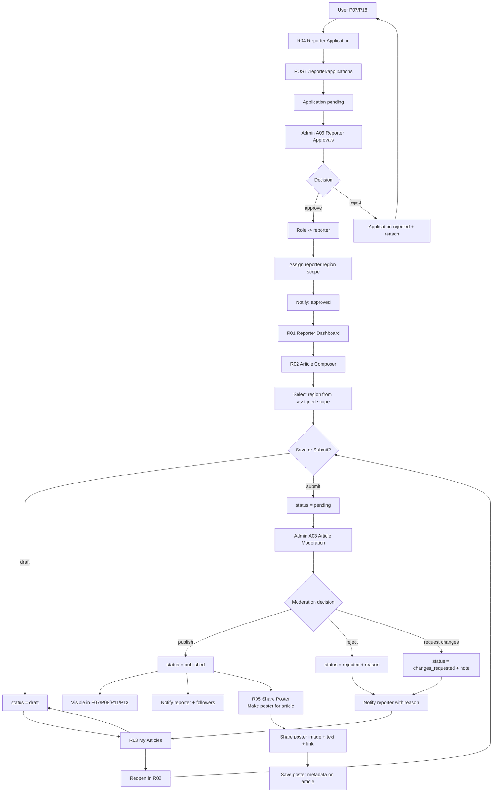
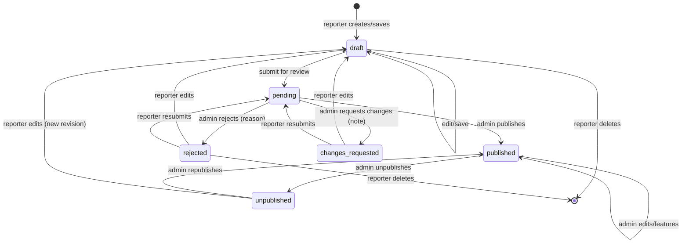
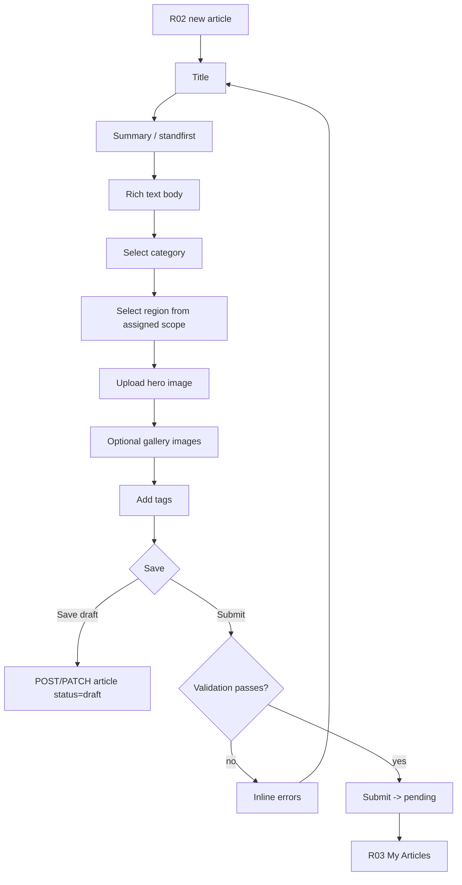
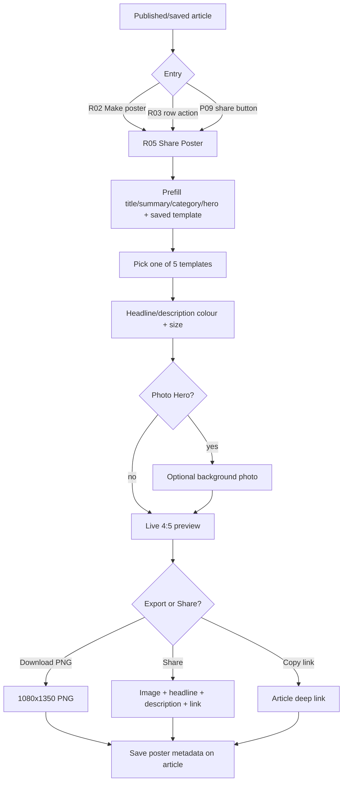
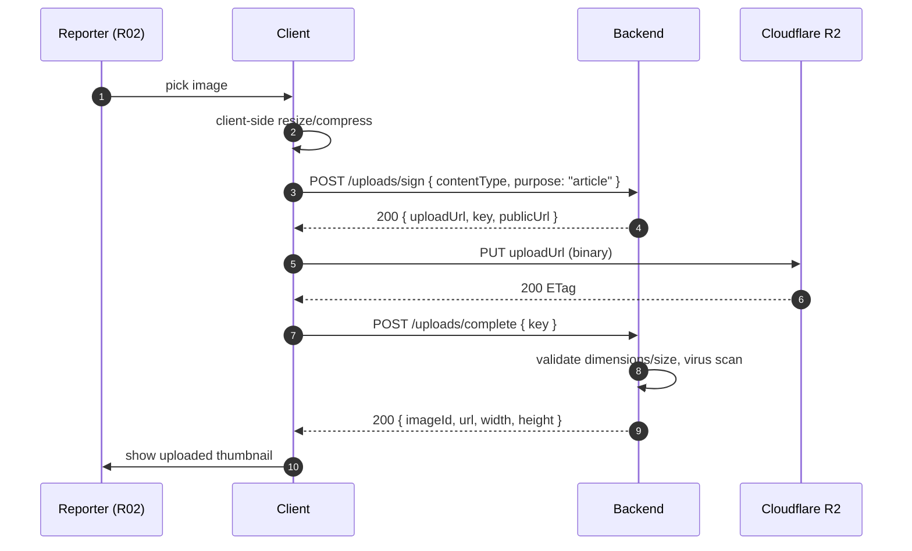
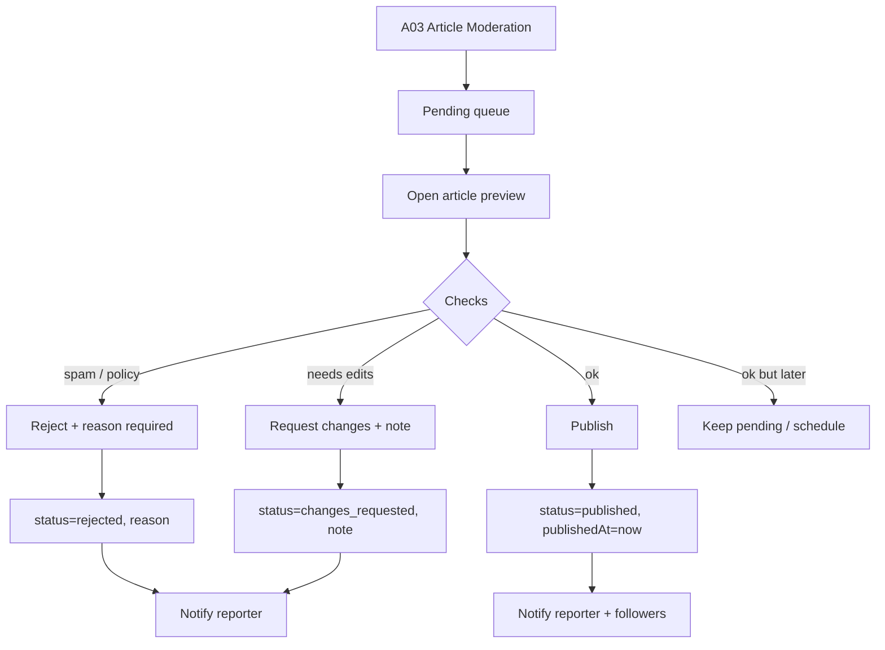
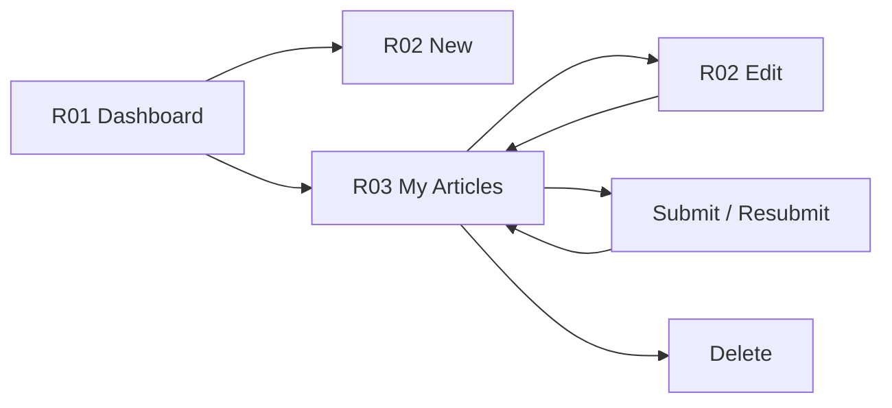

# 05 — Reporter Flow

The path from User → Reporter: apply (R04), admin approval + region-scope
assignment (A06), reporter dashboard (R01), compose article for assigned regions
(R02), save draft, submit, pending review, admin moderation (A03), publish or
reject with reason, then edit/resubmit. After publish, the reporter can generate
a **share poster** (R05) for the article.

| Field | Value |
|---|---|
| Roles | User → Reporter (approved), Admin (region-scoped), Super Admin |
| Pages | R04 apply, A06 approvals, R01 dashboard, R02 composer, R03 my articles, R05 share poster, A03 moderation |
| Requirement areas | `REP`, `POSTER`, `ADM`, `NOTIF`, `REG` |

---

## 1. Requirement map

| ID | Requirement | Priority |
|---|---|---|
| REQ-REP-001 | A User MUST be able to submit a reporter application (R04). | P2 |
| REQ-REP-002 | An Admin MUST approve or reject applications with an optional reason (A06). | P1 |
| REQ-REP-003 | On approval the user's role MUST change to `reporter`, a reporter region scope MUST be assigned, and the user MUST be notified. | P1 |
| REQ-REP-004 | Reporters MUST see a dashboard (R01) with status counts and quick actions. | P1 |
| REQ-REP-005 | R02 MUST support title, summary, body (rich text), category, region, hero image, gallery, and tags. | P1 |
| REQ-REP-006 | Reporters MUST be able to save an article as a draft. | P1 |
| REQ-REP-007 | Reporters MUST be able to submit a draft for review; status becomes `pending`. | P1 |
| REQ-REP-008 | R03 MUST list the reporter's articles with status and rejection reason. | P1 |
| REQ-REP-009 | A rejected article MUST be editable and resubmittable. | P1 |
| REQ-REP-010 | Reporters MUST only edit/delete their own articles. | P1 |
| REQ-REP-011 | Admin MUST be able to publish, reject (with reason), unpublish, or feature an article (A03). | P1 |
| REQ-REP-012 | Reporter MUST be notified on publish/reject. | P1 |
| REQ-REP-013 | Server MUST reject article writes unless role is `reporter`/`admin`/`super_admin`. | P0 |
| REQ-REP-014 | On approval an Admin MUST assign a region scope (`reporter_region_scopes`); a reporter may only compose articles for assigned regions and their descendants (REQ-REG-002). | P1 |
| REQ-REP-089 | The composer MUST offer 5 share-poster templates (Classic, Breaking, Minimal, Gradient, Photo Hero) with live preview and per-article selection. | P0 |
| REQ-REP-090 | The selected poster template and overrides MUST be stored on the article as `poster` metadata. | P1 |
| REQ-REP-091 | When sharing, the app MUST generate a poster image and send it with the headline, description, and article link. | P0 |
| REQ-REP-092 | The composer MUST link to the full Share Poster editor (R05). | P1 |
| REQ-POSTER-001 | R05 MUST offer exactly 5 poster templates: Classic, Breaking, Minimal, Gradient, Photo Hero. | P0 |
| REQ-POSTER-008 | The poster MUST render at 4:5 and export at a minimum of 1080×1350px PNG. | P0 |
| REQ-POSTER-010 | Sharing MUST send the poster image together with the headline, description, and article link. | P0 |
| REQ-POSTER-012 | Template + overrides MUST be saved on the article (`poster` metadata) and reloaded. | P1 |
| REQ-POSTER-013 | Poster generation MUST be accessible to the owning reporter; admins in scope; super admin for any article. | P1 |

---

## 2. End-to-end reporter pipeline



> **Region rule:** the composer region picker only offers regions in the
> reporter's assigned scope (`reporter_region_scopes`) and their descendants.
> Submitting to any other region is rejected server-side with `403`
> (REQ-REG-002, REQ-REP-014).

---

## 3. Application & approval sequence

```mermaid
sequenceDiagram
  autonumber
  participant U as User
  participant App as Client
  participant API as Backend
  participant DB as PostgreSQL
  participant AD as Admin (A06)
  participant N as Notifications

  U->>App: fill R04 (bio, topics, sample links)
  App->>API: POST /reporter/applications
  API->>DB: INSERT application (status=pending)
  API-->>App: 201 { id, status: "pending" }
  App->>U: "Application under review"
  AD->>API: GET /admin/reporter-applications?status=pending (in region scope)
  API-->>AD: list
  AD->>API: PATCH /admin/reporter-applications/{id} { decision: "approve", regionIds: [...] }
  API->>DB: UPDATE application; UPDATE user.role=reporter; INSERT reporter_region_scopes
  API->>N: enqueue reporter_approved
  N-->>U: push + in-app + realtime role:updated
  API-->>AD: 200 updated
```

Rules:

- One active (pending) application per user; re-apply allowed after rejection.
- Approval is idempotent and audit-logged (`actorId`, `at`, `decision`).
- Approval MUST assign at least one region to the reporter
  (`reporter_region_scopes`); the reporter can only create articles in those
  regions or their descendants (REQ-REG-002).
- Role claim refreshes on next token refresh or via `role:updated` event.

---

## 4. Article status lifecycle



| Status | Visible to readers | Editable by reporter | Badge color |
|---|---|---|---|
| `draft` | No | Yes | `--muted` |
| `pending` | No | No (locked) | `--warning` |
| `changes_requested` | No | Yes | `--warning` |
| `rejected` | No | Yes | `--error` |
| `published` | Yes (P07/P08/P11/P13) | Via new revision only | `--success` |
| `unpublished` | No | Yes | `--muted` |

Status transitions are server-authoritative; the client only renders the
allowed actions per status.

---

## 5. Composer (R02)



### Composer validation rules

| Field | Rule | Error message |
|---|---|---|
| Title | Required, 8–140 chars | "Title must be 8–140 characters" |
| Summary | Required, 20–300 chars | "Summary must be 20–300 characters" |
| Body | Required, ≥100 chars, sanitised HTML | "Article body is too short" |
| Category | Required, one active category | "Select a category" |
| Region | Required, must be within the reporter's assigned scope (or descendant) | "Select a region you are assigned to" |
| Hero image | Required for submit (JPG/PNG/WebP, ≤5 MB, ≥1200×675) | "Add a hero image (min 1200×675)" |
| Gallery | Optional, max 10 images | "Up to 10 images" |
| Tags | Optional, max 8, each ≤24 chars | "Up to 8 tags" |

Autosave: draft autosaves every 30s and on navigation away (REQ-REP-006).
Drafts that fail validation can still be saved (submit-only validation for
hero/category).

---

## 6. Share poster (R05)

After an article is published (or saved), the reporter can turn it into a
shareable image poster from R05 Share Poster. See
[`09-share-poster-flow.md`](09-share-poster-flow.md) for the full flow.



Rules:

- Templates: Classic, Breaking, Minimal, Gradient, Photo Hero
  (REQ-POSTER-001, REQ-REP-089).
- Export is 4:5 at minimum 1080×1350 PNG (REQ-POSTER-008).
- Share sends the poster image together with the headline, description, and
  article link (REQ-POSTER-010, REQ-REP-091).
- The chosen template and colour/size overrides persist on the article as
  `poster` metadata (REQ-POSTER-012, REQ-REP-090).
- Only the owning reporter (or an in-scope admin / super admin) may generate
  the poster (REQ-POSTER-013).

---

## 7. Image upload flow



The composer references `imageId` values in the article payload; the API
validates ownership and sets the hero/first gallery image for cards.

---

## 8. Admin moderation decision



Permissions: only `admin`/`super_admin` may access A03; an admin may only act on
articles whose `region_id` is in their scope or a descendant (REQ-REG-003).
`super_admin` is global. Each decision records `actorId`, `action`, `reason`,
`timestamp` in the audit log (ADM-001).

---

## 9. Reporter dashboard (R01) and My Articles (R03)

| Surface | Content |
|---|---|
| R01 header | Greeting, role badge, "New article" CTA |
| R01 stats | Drafts, Pending, Published, Rejected counts |
| R01 recent | Latest 5 articles with status chips |
| R01 performance | Views, likes, comments for published articles |
| R03 list | All own articles, filter by status, sort by updated |
| R03 row | Title, status chip, updated time, rejection reason, actions |
| R03 actions | Edit (if allowed), Submit/Resubmit, Delete (draft/rejected) |



---

## 10. API endpoints

| Method | Endpoint | Purpose | Role |
|---|---|---|---|
| POST | `/api/v1/reporter/applications` | Submit application | User |
| GET | `/api/v1/reporter/applications/me` | Own application status | User |
| GET | `/api/v1/admin/reporter-applications?status=` | List applications (region-scoped) | Admin |
| PATCH | `/api/v1/admin/reporter-applications/{id}` | Approve/reject + assign region scope | Admin |
| POST | `/api/v1/articles` | Create article (draft) in assigned region | Reporter/Admin |
| PATCH | `/api/v1/articles/{id}` | Update own article (in-scope region) | Reporter/Admin |
| POST | `/api/v1/articles/{id}/submit` | Submit for review | Reporter |
| POST | `/api/v1/articles/{id}/resubmit` | Resubmit after changes | Reporter |
| DELETE | `/api/v1/articles/{id}` | Delete draft/rejected | Reporter/Admin |
| GET | `/api/v1/reporter/articles?status=&cursor=` | Own articles | Reporter |
| GET | `/api/v1/reporter/stats` | Dashboard counts/perf | Reporter |
| GET | `/api/v1/reporter/regions` | Assigned region scopes for composer | Reporter |
| GET | `/api/v1/admin/articles?status=pending` | Moderation queue (region-scoped) | Admin |
| PATCH | `/api/v1/admin/articles/{id}/moderate` | Publish/reject/request changes | Admin |
| POST | `/api/v1/uploads/sign` | Signed upload URL | Reporter/Admin |
| POST | `/api/v1/uploads/complete` | Finalise upload | Reporter/Admin |
| POST | `/api/v1/media/sign` | Sign background photo upload for poster | Reporter/Admin |
| POST | `/api/v1/share/poster` | (Optional) server-side poster render | Reporter/Admin |

### Example — create draft

```json
{
  "title": "Monsoon arrives early across the western coast",
  "summary": "IMD reports a two-week advance in seasonal onset.",
  "body": "<p>...</p>",
  "categoryId": "7d1a...",
  "regionId": "reg_bowenpally...",
  "heroImageId": "img_42...",
  "galleryImageIds": ["img_43..."],
  "tags": ["monsoon", "weather"],
  "status": "draft"
}
```

### Example — moderate

```json
{ "decision": "reject", "reason": "Unverified claims in paragraph 3; add sources." }
```

---

## 11. Navigation

| Action | From | To |
|---|---|---|
| Apply | P18 Profile | R04 |
| Application submitted | R04 | P18 |
| Approve reporter | A06 | A06 (list refresh) |
| New/edit article | R01/R03 | R02 |
| Save draft | R02 | R03 |
| Submit | R02 | R03 (status pending) |
| Moderate | A03 | A03 |
| Published article | R03 | P09 (public view) |
| Make poster | R02/R03 | R05 Share Poster |
| Share poster | R05 | Native share sheet / target app |
| Back | R02 | R01/R03 |
| Back | R05 | R02/R03/P09 (origin) |

---

## 12. Analytics events

| Event | Trigger | Properties |
|---|---|---|
| `reporter_apply_submitted` | R04 submitted | — |
| `reporter_approved` | Admin approved | `applicationId` |
| `reporter_rejected` | Admin rejected | `applicationId` |
| `article_draft_saved` | Draft saved | `articleId`, `autosave` |
| `article_submitted` | Submitted | `articleId`, `resubmit` |
| `article_moderated` | Admin decision | `articleId`, `decision` |
| `article_published` | Status published | `articleId`, `adminId` |
| `image_uploaded` | Upload complete | `purpose`, `bytes` |
| `poster_opened` | R05 opened | `article_id`, `source` |
| `poster_template_selected` | Template change | `template` |
| `poster_downloaded` | Poster export success | `template`, `format` |
| `poster_shared` | Poster shared | `template`, `channel` |
| `poster_render_failed` | Poster export error | `reason` |
| `poster_metadata_saved` | Poster metadata persisted | `article_id`, `template` |

---

## 13. Open questions

- Should admin be able to schedule a publish time?
- Should reporters see aggregate analytics for their own articles (views/likes)?
- Is a revision history required for published articles?
- Client-side vs server-side poster rendering for pixel-perfect PNG (REQ-POSTER-008)?
- Should the poster template be a per-reporter default with per-article override?
