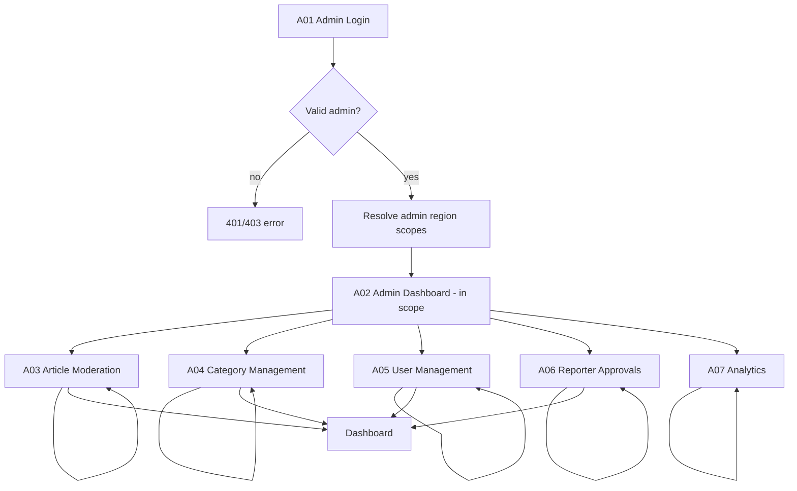
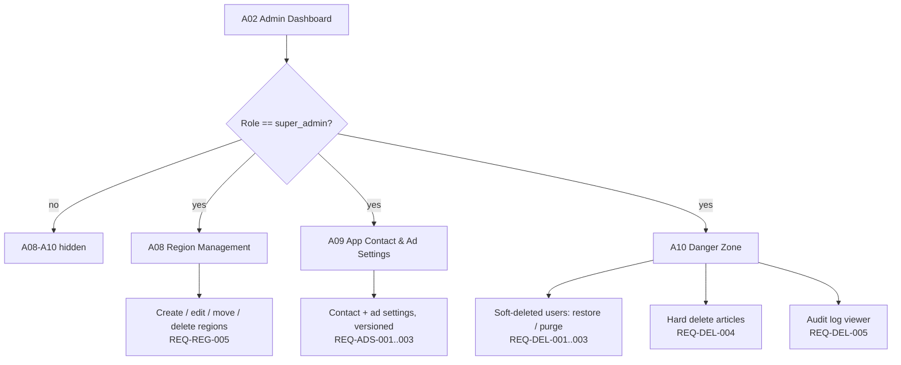
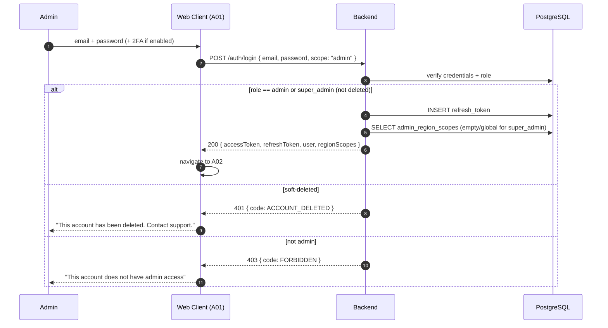
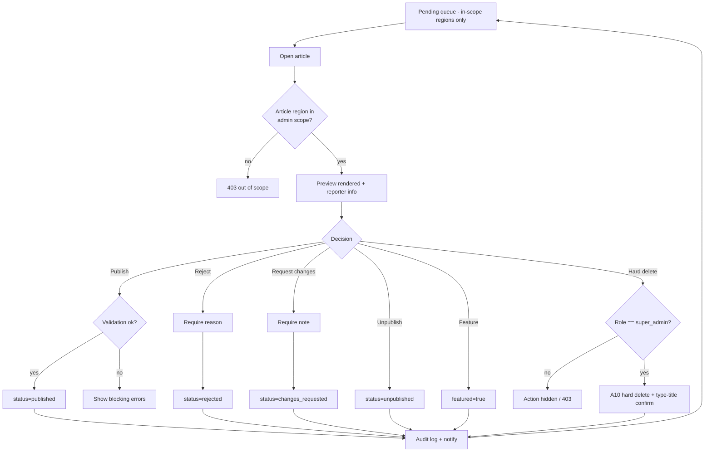
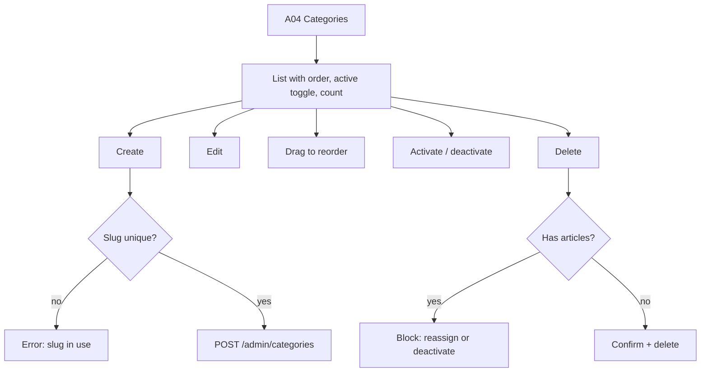
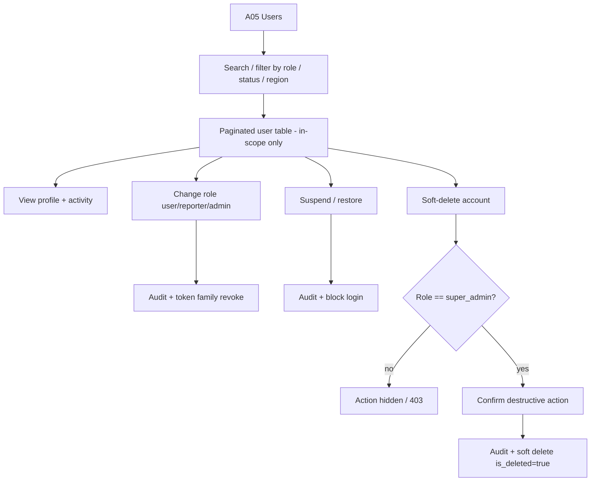
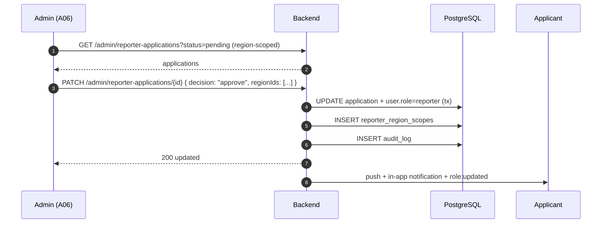
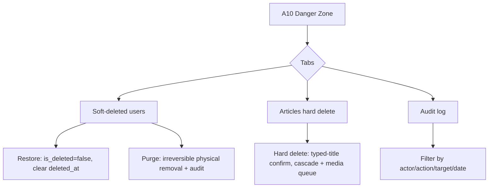
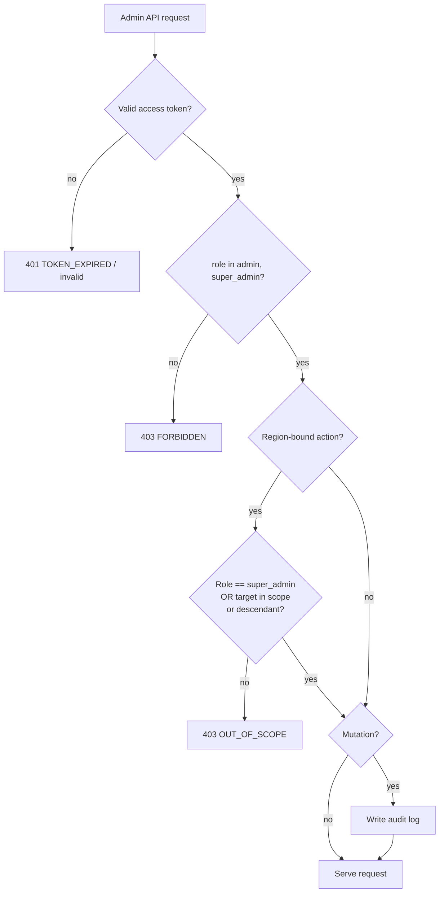

# 06 — Admin Flow

The admin journey: login (A01) → dashboard (A02) → article moderation (A03) →
category management (A04) → user management (A05) → reporter approvals (A06) →
analytics (A07). Admin operations are **region-scoped** to the admin's assigned
regions (and descendants). **Super Admin** is global and additionally unlocks
region management (A08), app contact / ad settings (A09), and the danger zone
(A10: soft-deleted users, hard-delete articles, audit log). Includes moderation
decision flow and permission checks.

| Field | Value |
|---|---|
| Roles | Admin (region-scoped, web console only), Super Admin (global) |
| Pages | A01–A10 (A08–A10 Super Admin only) |
| Requirement areas | `ADM`, `REG`, `DEL`, `ADS`, `NOTIF`, `SYS` |

---

## 1. Requirement map

| ID | Requirement | Priority |
|---|---|---|
| REQ-ADM-001 | A01 MUST authenticate admins and reject non-admin roles with `403 FORBIDDEN`. | P1 |
| REQ-ADM-002 | A02 MUST show KPIs: articles, users, reporters, pending items, views — **scoped to the admin's regions**. | P1 |
| REQ-ADM-003 | A03 MUST list pending articles with preview, search, and bulk actions, limited to the admin's region scope. | P1 |
| REQ-ADM-004 | A03 decisions MUST be publish, reject (reason), request changes (note), feature/unfeature, unpublish. | P1 |
| REQ-ADM-005 | A04 MUST support create, edit, reorder, activate/deactivate, and delete categories. | P1 |
| REQ-ADM-006 | A05 MUST list/search users, view profiles, change roles, suspend/restore, and delete — limited to the admin's region scope. | P1 |
| REQ-ADM-007 | A06 MUST list, approve, and reject reporter applications, limited to the admin's region scope; approval assigns region scope. | P1 |
| REQ-ADM-008 | A07 MUST show engagement and content analytics with date ranges and export. | P2 |
| REQ-ADM-009 | Every admin mutation MUST be audit-logged (actor, action, target, timestamp). | P1 |
| REQ-ADM-010 | Server MUST enforce admin-only access on all `/admin/*` routes. | P0 |
| REQ-ADM-011 | Destructive actions MUST require a confirmation dialog. | P1 |
| REQ-ADM-012 | An Admin MUST only act on articles, users, and applications whose region is in scope or a descendant (REQ-REG-003). | P0 |
| REQ-ADM-013 | A08 (Region Management) MUST be available to `super_admin` only. | P1 |
| REQ-ADM-014 | A09 (App Contact & Ad Settings) MUST be available to `super_admin` only (REQ-ADS-001). | P1 |
| REQ-ADM-015 | A10 (Danger Zone) MUST expose soft-deleted users (restore/purge), hard-delete articles, and the audit log to `super_admin` only. | P1 |
| REQ-REG-005 | Only a `super_admin` may create, edit, move, or delete regions. | P0 |
| REQ-DEL-002 | Only `super_admin` may soft-delete or restore users. | P0 |
| REQ-DEL-004 | Only `super_admin` may HARD delete articles. | P0 |

---

## 2. Admin shell and navigation

### 2.1 Admin console (region-scoped, A01–A07)



### 2.2 Super Admin branches (global, A08–A10)

Only `super_admin` sees these sidebar items; scope checks are bypassed for
`super_admin` (REQ-REG-007). An Admin can NEVER reach them.



Admin web uses a fixed left sidebar (S02) with the item order A02–A07; the
sidebar adds **Regions**, **App Settings**, and **Danger Zone** only when
`role == super_admin`. Header shows search, notifications, and admin avatar.
Mobile admin is out of scope.

---

## 3. Admin login sequence



---

## 4. Moderation decision flow (A03)



The queue and every decision are confined to the admin's region scope
(REQ-REG-003, REQ-ADM-012); `super_admin` sees all regions. Hard delete is
Super Admin only and runs from A10 (REQ-DEL-004).

| Decision | Required input | Status result | Notification |
|---|---|---|---|
| Publish | — | `published` | reporter + followers |
| Reject | reason (≥10 chars) | `rejected` | reporter with reason |
| Request changes | note (≥10 chars) | `changes_requested` | reporter with note |
| Feature | — | `featured=true` | none |
| Unpublish | reason optional | `unpublished` | reporter |
| Hard delete (super_admin, A10) | typed article title | row physically removed | reporter (optional) |

Bulk actions support publish/reject for multiple selected articles; each item
is validated and the response returns per-item results.

---

## 5. Category management (A04)



| Field | Rule | Error |
|---|---|---|
| Name | Required, 2–40 chars, unique (case-insensitive) | "Category name already exists" |
| Slug | Required, `[a-z0-9-]+`, unique | "Slug already in use" |
| Order | Integer ≥0 | "Order must be a number" |
| Active | Boolean | — |

Deleting a category with articles is blocked; admins must reassign articles or
deactivate the category instead.

---

## 6. User management (A05)



Rules:

- An admin only sees and manages users within their region scope; a
  `super_admin` sees all (REQ-ADM-012, REQ-REG-003).
- An admin cannot demote or delete their own account (self-protection), and can
  NEVER affect a `super_admin`.
- Changing role revokes existing refresh tokens so permissions take effect.
- Suspension returns `ACCOUNT_SUSPENDED` on login and hides gated actions.
- **User deletion is SOFT and Super Admin only** (`is_deleted=true`, plus
  `deleted_at`/`deleted_by`); it is reversible and never physically removes rows.
  Restore and purge live in A10 (REQ-DEL-001, REQ-DEL-002).

---

## 7. Reporter approvals (A06)



Rejections require a reason; the applicant may reapply after a cooldown. On
approval the admin MUST assign a region scope (defaulting to the admin's own
scope), and the reporter can then only compose for those regions and descendants
(REQ-REP-014, REQ-REG-002).

---

## 7.1 Region management (A08, Super Admin only)

```mermaid
flowchart TD
  A08[A08 Region Management] --> TREE[Region tree: state > district > constituency > mandal]
  TREE --> CREATE[Create region]
  TREE --> EDIT[Edit name/type]
  TREE --> MOVE[Move under new parent]
  TREE --> DELETE[Delete region]
  CREATE --> SAVE[POST /admin/regions]
  MOVE --> SAVE2[PATCH /admin/regions/{id} parent_id]
  DELETE --> GUARD{Has children or articles?}
  GUARD -- yes --> BLOCK[Blocked: reassign first REQ-REG-006]
  GUARD -- no --> CONFIRM[Confirm + delete]
  SAVE --> AUDIT[Audit log]
  SAVE2 --> AUDIT
  CONFIRM --> AUDIT
```

Only `super_admin` may create, edit, move, or delete regions (REQ-REG-005,
REQ-ADM-013). A region with children or articles cannot be deleted until those are
reassigned (REQ-REG-006).

---

## 7.2 App contact & ad settings (A09, Super Admin only)

Keyed `app_settings` (support email/phone, ad-sales email/phone, office address,
WhatsApp, social links, hours). Only `super_admin` may read-write; changes are
versioned and audit-logged (REQ-ADS-001..003, REQ-ADM-014). Public contact info is
exposed via a public endpoint and never includes secrets.

---

## 7.3 Danger zone (A10, Super Admin only)



- Users are listed with an **include deleted** filter; restore/purge are Super
  Admin only (REQ-DEL-001..003, REQ-DEL-006).
- Articles are HARD deleted (row + dependents physically removed, media queued);
  typed-title confirmation is required (REQ-DEL-004).
- Every soft delete, restore, purge, and hard delete writes an immutable audit
  record (REQ-DEL-005). The system never allows the last `super_admin` to be
  deleted or demoted (REQ-DEL-007).

---

## 8. Analytics (A07)

| Widget | Metric | Source |
|---|---|---|
| KPI cards | Articles published, total views, likes, comments | `analytics_kpi` |
| Content performance | Top articles by views/likes | `article_metrics` |
| Category split | Articles/views per category | `category_metrics` |
| Reporter leaderboard | Articles + engagement per reporter | `reporter_metrics` |
| User growth | New users per day/week | `user_metrics` |
| Time series | Views/likes over selected range | `engagement_series` |

Filters: date range (7d/30d/90d/custom), category, reporter. Export CSV via
`GET /api/v1/admin/analytics/export`.

---

## 9. Permission matrix

| Capability | User | Reporter | Admin | Super Admin |
|---|---|---|---|---|
| Browse/read | Yes | Yes | Yes | Yes |
| Like/comment/bookmark | Yes | Yes | Yes | Yes |
| Create/edit own articles | No | Yes (in region) | Yes (in region) | Yes (all) |
| Submit for review | No | Yes | Yes | Yes |
| Moderate articles | No | No | Yes (own region) | Yes (all regions) |
| Manage categories | No | No | Yes (scoped) | Yes (global) |
| Manage users | No | No | Yes (own region, users only) | Yes (all) |
| Approve reporters | No | No | Yes (own region) | Yes (all) |
| View analytics | No | Own only | Yes (scoped) | Yes (global) |
| Manage regions (A08) | No | No | No | Yes |
| App contact / ad settings (A09) | No | No | No | Yes |
| Soft-delete / restore users (A10) | No | No | No | Yes |
| Hard-delete articles (A10) | No | No | No | Yes |
| Audit log (A10) | No | No | No | Yes |



Permission and region-scope checks run in backend middleware before controllers;
the client hides unavailable items but never relies on that for security
(REQ-ADM-010, REQ-ADM-012, REQ-REG-004).

---

## 10. API endpoints

| Method | Endpoint | Purpose |
|---|---|---|
| GET | `/api/v1/admin/dashboard` | KPI summary |
| GET | `/api/v1/admin/articles?status=&q=&cursor=` | Article queue |
| PATCH | `/api/v1/admin/articles/{id}/moderate` | Publish/reject/changes/feature |
| POST | `/api/v1/admin/articles/bulk-moderate` | Bulk decisions |
| GET | `/api/v1/admin/categories` | List all categories |
| POST | `/api/v1/admin/categories` | Create |
| PATCH | `/api/v1/admin/categories/{id}` | Edit/reorder/activate |
| DELETE | `/api/v1/admin/categories/{id}` | Delete (guarded) |
| GET | `/api/v1/admin/users?q=&role=&cursor=&includeDeleted=` | List users (region-scoped) |
| PATCH | `/api/v1/admin/users/{id}` | Change role / suspend / restore |
| DELETE | `/api/v1/admin/users/{id}` | Soft-delete user (super_admin) |
| POST | `/api/v1/admin/users/{id}/restore` | Restore soft-deleted user (super_admin) |
| DELETE | `/api/v1/admin/users/{id}/purge` | Purge soft-deleted user (super_admin, irreversible) |
| GET | `/api/v1/admin/reporter-applications?status=` | Applications (region-scoped) |
| PATCH | `/api/v1/admin/reporter-applications/{id}` | Approve/reject + assign region scope |
| GET | `/api/v1/admin/analytics?range=&categoryId=` | Analytics |
| GET | `/api/v1/admin/audit-log?cursor=&action=&actorId=` | Audit trail (super_admin) |
| GET | `/api/v1/admin/regions` | Region tree (super_admin) |
| POST | `/api/v1/admin/regions` | Create region (super_admin) |
| PATCH | `/api/v1/admin/regions/{id}` | Edit/move region (super_admin) |
| DELETE | `/api/v1/admin/regions/{id}` | Delete region (super_admin, guarded) |
| GET | `/api/v1/admin/settings` | Read app contact/ad settings (super_admin) |
| PATCH | `/api/v1/admin/settings` | Update settings, versioned + audited (super_admin) |
| DELETE | `/api/v1/admin/articles/{id}` | HARD delete article + dependents (super_admin) |

### Example — moderation response

```json
{
  "success": true,
  "data": { "id": "art_7c1...", "status": "rejected", "reason": "Unverified claims.", "moderatedBy": "adm_2a..." },
  "meta": { "notified": true },
  "error": null
}
```

---

## 11. Navigation

| Action | From | To |
|---|---|---|
| Login | A01 | A02 |
| Open moderation | A02 | A03 |
| Open categories | A02 | A04 |
| Open users | A02 | A05 |
| Open approvals | A02 | A06 |
| Open analytics | A02 | A07 |
| Open regions (super_admin) | A02 | A08 |
| Open app settings (super_admin) | A02 | A09 |
| Open danger zone (super_admin) | A02 | A10 |
| Open public preview | A03 | P09 (preview) |
| Sign out | header | A01 |

---

## 12. Analytics events

| Event | Trigger | Properties |
|---|---|---|
| `admin_login` | A01 success | `adminId` |
| `admin_dashboard_view` | A02 loaded | — |
| `admin_article_moderated` | A03 decision | `articleId`, `decision` |
| `admin_bulk_moderate` | Bulk action | `count`, `decision` |
| `admin_category_created` | A04 create | `categoryId` |
| `admin_category_deleted` | A04 delete | `categoryId` |
| `admin_user_role_changed` | A05 role change | `userId`, `from`, `to` |
| `admin_user_suspended` | A05 suspend | `userId` |
| `admin_user_soft_deleted` | A05/A10 soft delete | `userId` |
| `admin_user_restored` | A10 restore | `userId` |
| `admin_user_purged` | A10 purge | `userId` |
| `admin_article_hard_deleted` | A10 hard delete | `articleId` |
| `admin_region_created` | A08 create | `regionId`, `type` |
| `admin_region_deleted` | A08 delete | `regionId` |
| `admin_settings_updated` | A09 update | `keys` |
| `admin_reporter_decided` | A06 decision | `applicationId`, `decision` |
| `admin_analytics_view` | A07 loaded | `range` |
| `admin_audit_view` | A10 audit log | `filters` |

---

## 13. Open questions

- Is two-factor authentication required for admin accounts in v1?
- Should moderation support scheduled publishing and content queues per category?
- Should region scope support temporary delegated admins with expiry?
