# 07 — Navigation Map

The complete page-to-page navigation map for **mobile**, **web**, and the
**admin console**, including mobile bottom-tab structure, stack screens, web
header/sidebar, deep-link URL mapping, and back/forward behavior.

| Field | Value |
|---|---|
| Roles | Guest, User, Reporter, Admin, Super Admin |
| Shell page | S02 Global Navigation Shell |
| Requirement area | `SYS`, `REG`, `ADS`, `DEL` |

---

## 1. Requirement map

| ID | Requirement | Priority |
|---|---|---|
| REQ-SYS-010 | Mobile MUST use a bottom tab bar with 5 tabs (Home, Categories, Search, Bookmarks, Profile). | P0 |
| REQ-SYS-011 | The tab bar MUST be hidden on full-screen reader (P09) and auth screens. | P0 |
| REQ-SYS-012 | Web MUST use a fixed top header with primary nav, search, and account menu. | P0 |
| REQ-SYS-013 | Admin console MUST use a fixed left sidebar. | P1 |
| REQ-SYS-014 | Every primary page MUST have a unique, shareable URL on web. | P0 |
| REQ-SYS-015 | Deep links MUST resolve to the correct page on mobile and web. | P0 |
| REQ-SYS-016 | Back MUST return to the previous in-app screen, preserving list scroll state. | P0 |
| REQ-SYS-017 | Tab switches MUST reset that tab's stack to its root. | P0 |
| REQ-SYS-018 | Protected pages MUST redirect guests to P03 with a `returnTo` parameter. | P0 |
| REQ-SYS-019 | 404/unknown routes MUST show a not-found state linking to P07. | P0 |

---

## 2. Mobile navigation structure

### 2.1 Bottom tabs (S02)

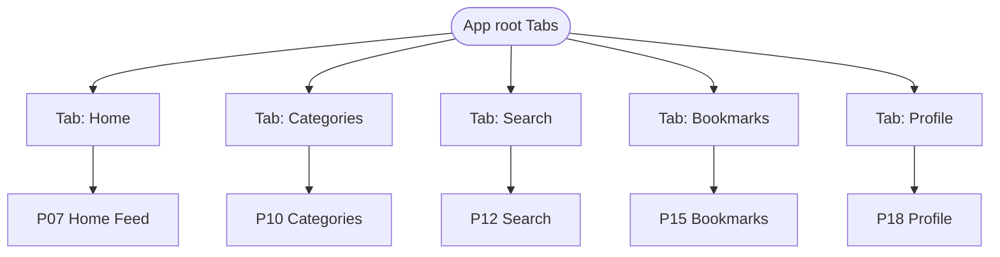

| Tab | Icon | Root page | Auth required |
|---|---|---|---|
| Home | `home` | P07 | No |
| Categories | `grid` | P10 | No |
| Search | `search` | P12 | No |
| Bookmarks | `bookmark` | P15 | Yes (prompt if guest) |
| Profile | `user` | P18 | Yes (guest sees login CTA) |

### 2.2 Home tab stack

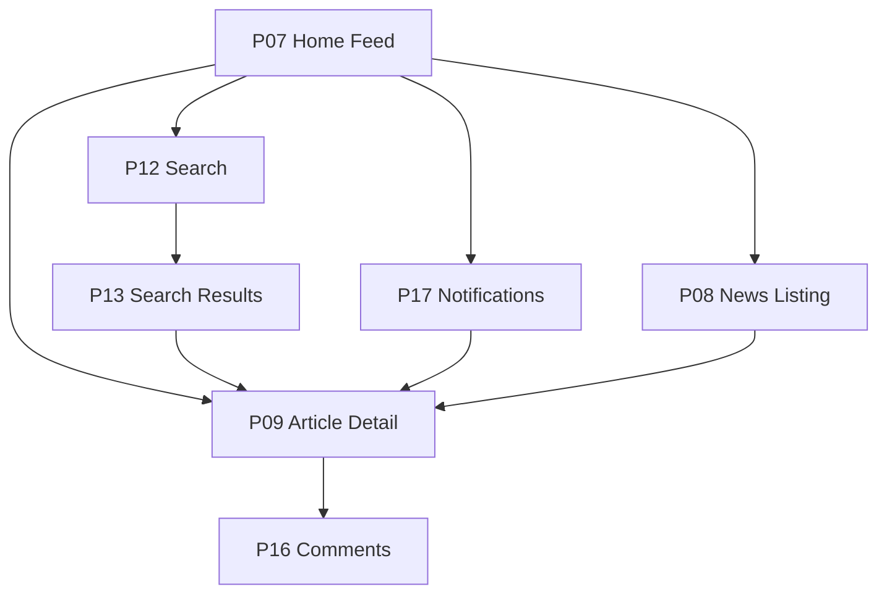

### 2.3 Categories tab stack

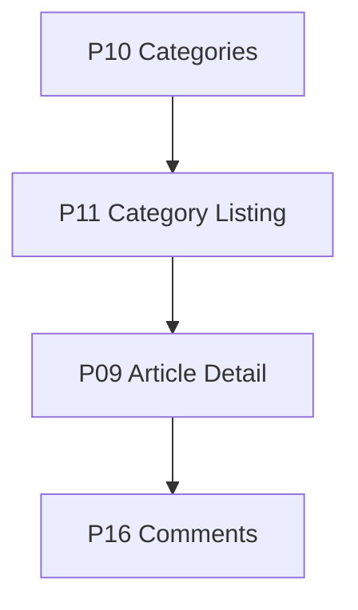

### 2.4 Search tab stack

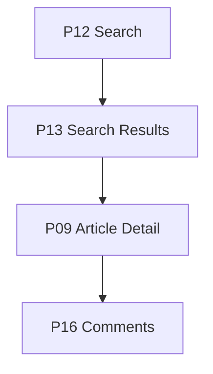

### 2.5 Bookmarks tab stack

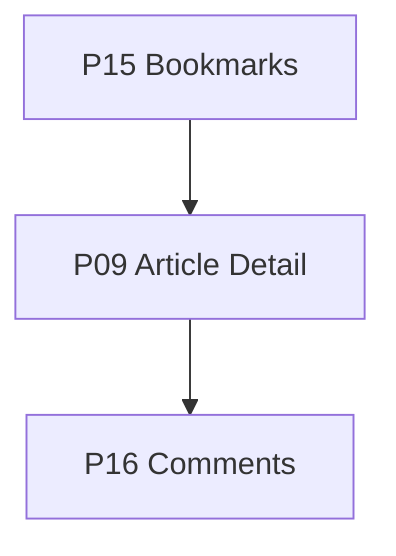

### 2.6 Profile tab stack

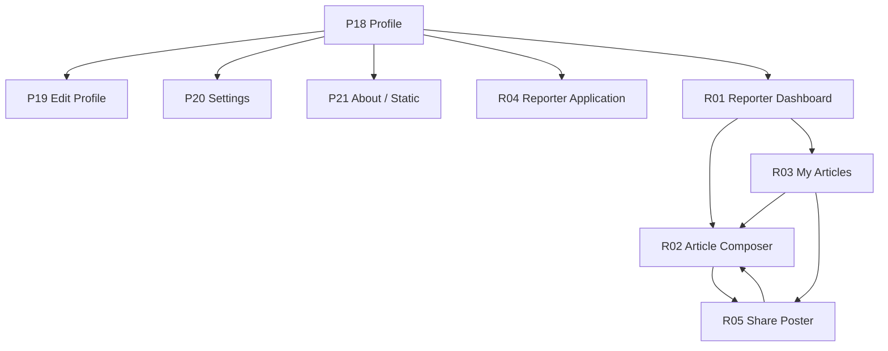

### 2.7 Full-screen (tab bar hidden) routes

| Route | Page | Reason |
|---|---|---|
| Auth stack | P01–P06 | No tab chrome during auth |
| Reader | P09 | Immersive scroll-snap (REQ-SYS-011) |
| Modals | image viewer, share sheet, filter sheet | Overlay presentation |

---

## 3. Mobile root stack

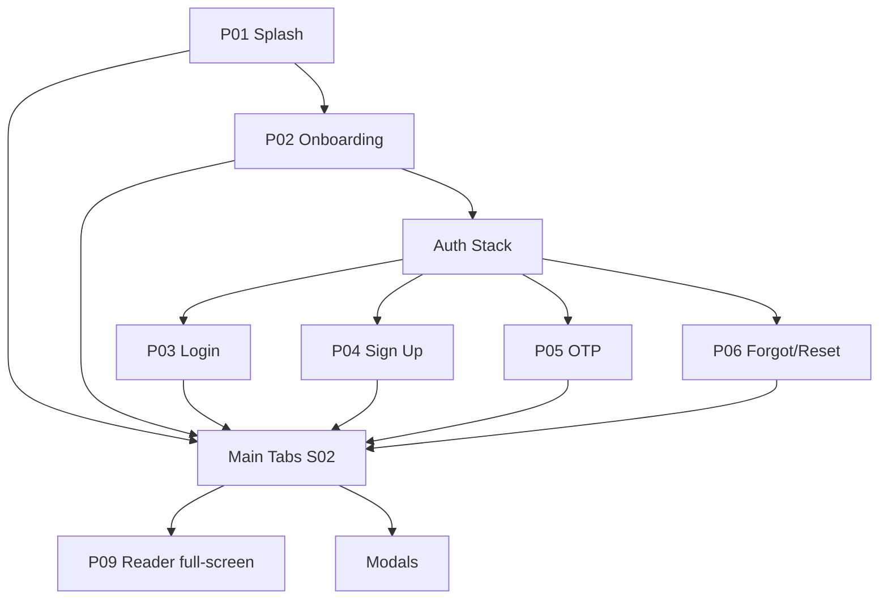

Navigation library assumption: Expo Router / React Navigation native stack +
bottom tabs. Each tab owns an independent stack; the root stack owns auth and
modal groups.

---

## 4. Web navigation structure

### 4.1 Public/reader header (S02)

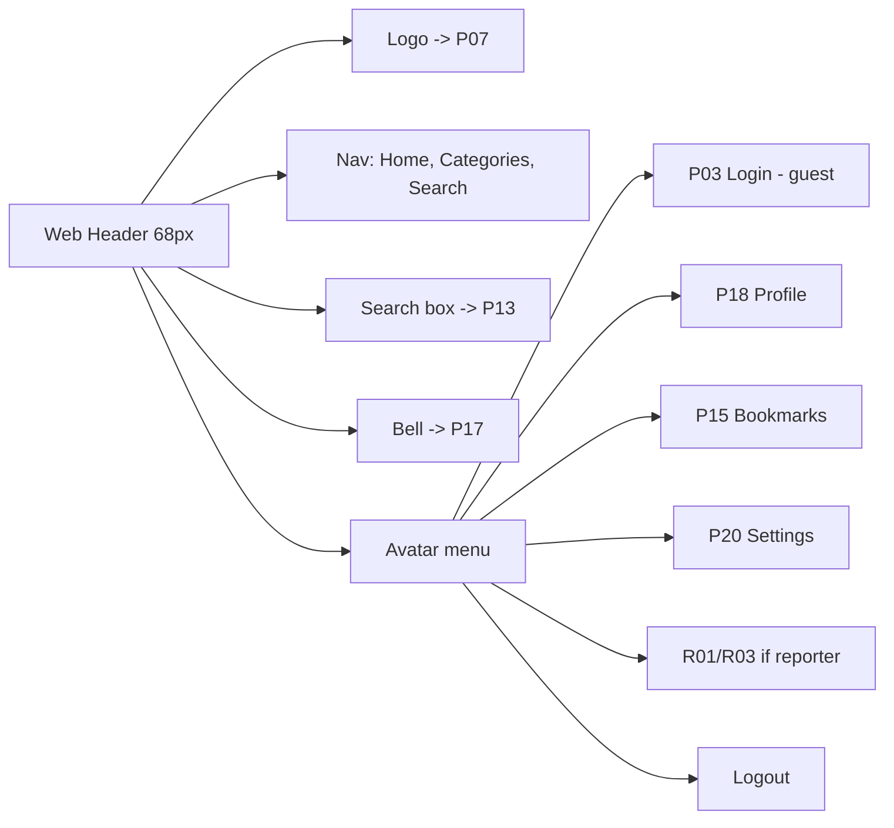

- Header is `position: fixed`, height `header-height-web` (68px),
  `z-header` (1000), content offset by 68px.
- Search box: `search-width` 230px, `search-height` 40px; Enter → P13.
- Below `mobile` (≤768px), primary nav collapses into a hamburger drawer
  (`z-drawer` 1100) with the same destinations.

### 4.2 Reader web page map

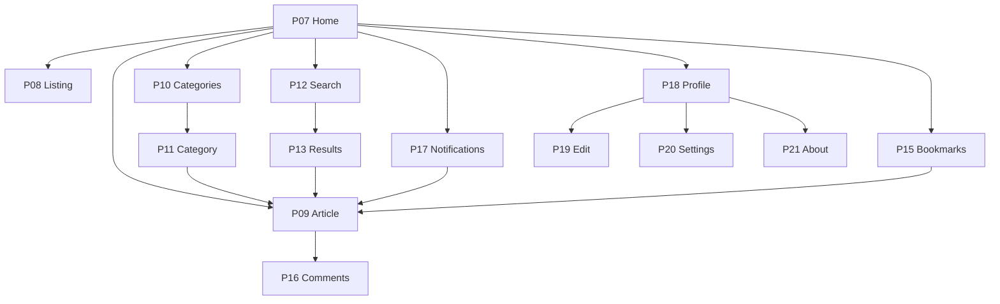

### 4.3 Admin console sidebar (A01–A10)

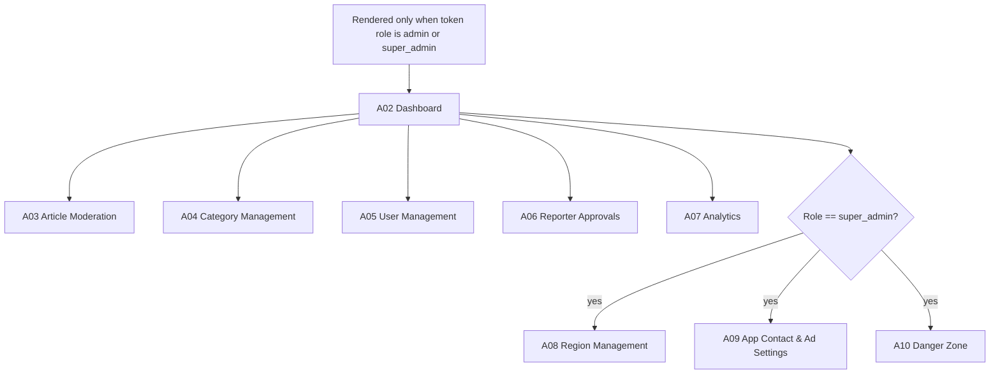

Regular admins see A02–A07 only, scoped to their assigned regions. The
Super Admin sidebar **adds Regions, App Settings, and Danger Zone** (A08–A10);
these items are hidden otherwise, and the server still enforces access
(REQ-ADM-010, REQ-ADM-013..015).

---

## 5. Deep-link URL mapping

| Page | Mobile route (scheme `newswatch://`) | Web URL (`https://newswatch.app`) |
|---|---|---|
| P01 Splash | — (app internal) | `/` (redirects to feed) |
| P02 Onboarding | `/onboarding` | `/onboarding` |
| P03 Login | `/auth/login` | `/login` |
| P04 Sign Up | `/auth/signup` | `/signup` |
| P05 OTP | `/auth/otp?identifier=` | `/verify?identifier=` |
| P06 Forgot/Reset | `/auth/reset?token=` | `/reset?token=` |
| P07 Home Feed | `/home` | `/home` |
| P08 News Listing | `/news` | `/news` |
| P09 Article Detail | `/article/{id}` or `/a/{slug}` | `/a/{slug}` |
| P10 Categories | `/categories` | `/categories` |
| P11 Category Listing | `/category/{id}` or `/c/{slug}` | `/c/{slug}` |
| P12 Search | `/search` | `/search` |
| P13 Search Results | `/search?q=` | `/search?q=` |
| P15 Bookmarks | `/bookmarks` | `/bookmarks` |
| P16 Comments | `/article/{id}/comments` | `/a/{slug}#comments` |
| P17 Notifications | `/notifications` | `/notifications` |
| P18 Profile | `/profile` | `/profile` |
| P19 Edit Profile | `/profile/edit` | `/profile/edit` |
| P20 Settings | `/profile/settings` | `/settings` |
| P21 About / Static | `/about/{page}` | `/about/{page}` |
| R01 Reporter Dashboard | `/reporter` | `/reporter` |
| R02 Article Composer | `/reporter/compose` or `/reporter/compose/{id}` | `/reporter/compose` |
| R03 My Articles | `/reporter/articles` | `/reporter/articles` |
| R04 Reporter Application | `/reporter/apply` | `/reporter/apply` |
| R05 Share Poster | `/reporter/articles/{id}/poster` (`Composer → Make poster`) | `/reporter/articles/:id/poster` |
| A01 Admin Login | — (web only) | `/admin/login` |
| A02 Admin Dashboard | — | `/admin` |
| A03 Article Moderation | — | `/admin/articles` |
| A04 Category Management | — | `/admin/categories` |
| A05 User Management | — | `/admin/users` |
| A06 Reporter Approvals | — | `/admin/reporters` |
| A07 Analytics | — | `/admin/analytics` |
| A08 Region Management | — | `/admin/regions` |
| A09 App Contact & Ad Settings | — | `/admin/app-settings` |
| A10 Danger Zone | — | `/admin/danger-zone` |
| S01 System States | — | `/error/{code}` |
| S02 Nav Shell | app shell | layout wrapper |

Query parameters: `q` (search), `type`, `sort`, `from`, `to`, `cursor` (list
state). Unknown IDs/slugs route to the not-found state (REQ-SYS-019).

---

## 6. Deep-link resolution

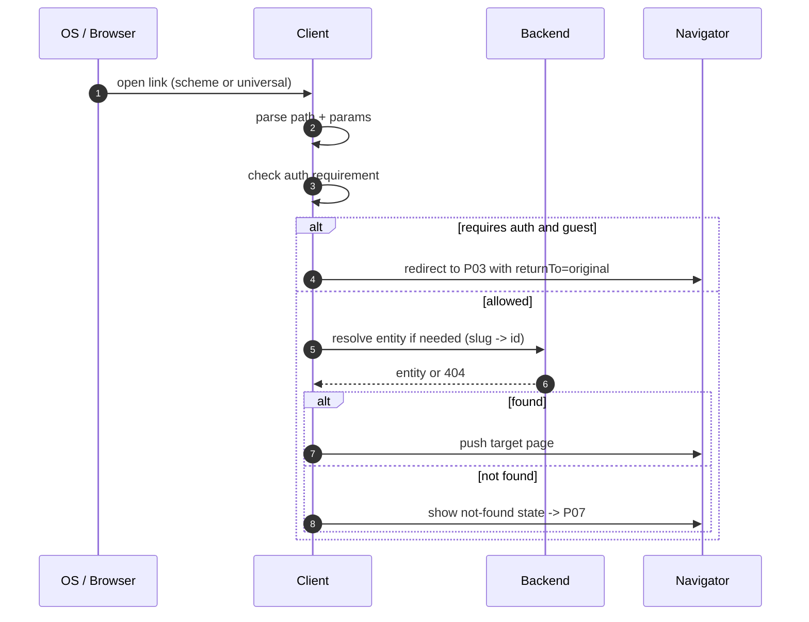

Web resolves server-side via Next.js routing + `getServerSideProps`/RSC for
article SEO metadata; mobile resolves client-side after cold start.

---

## 7. Back / forward behavior

| Context | Mobile back | Web back |
|---|---|---|
| Tab root (P07/P10/P12) | Android: exit app; iOS: no-op | Browser history / previous site |
| Push screen (P08/P09/P11/P13) | Pop to previous screen, restore scroll | History back, restore scroll |
| Article from list | Return to list at same index | History back to list, restore scroll |
| Deep link cold start | Back goes to P07 root | Back goes to referrer or `/home` |
| Auth success | Replace auth stack with target; back does not return to login | `router.replace` target; back skips login |
| Logout | Reset all stacks to guest P07 | Redirect to P07 (`replace`) |
| Tab switch | Each tab keeps its own stack (REQ-SYS-017 resets on re-tap) | Full navigation, header persists |
| Modal/overlay | Back/gesture dismisses overlay only | Esc or back closes overlay |

Rules:

- Prefer `push` for forward navigation; use `replace` for auth completion,
  logout, and redirects so back never re-enters a transient screen.
- List scroll position is cached per list identity (`surface + filters`) and
  restored on back (REQ-SYS-016).
- Unknown/expired deep links fall back to P07 with a toast, not a blank screen.

---

## 8. Protected-route gate

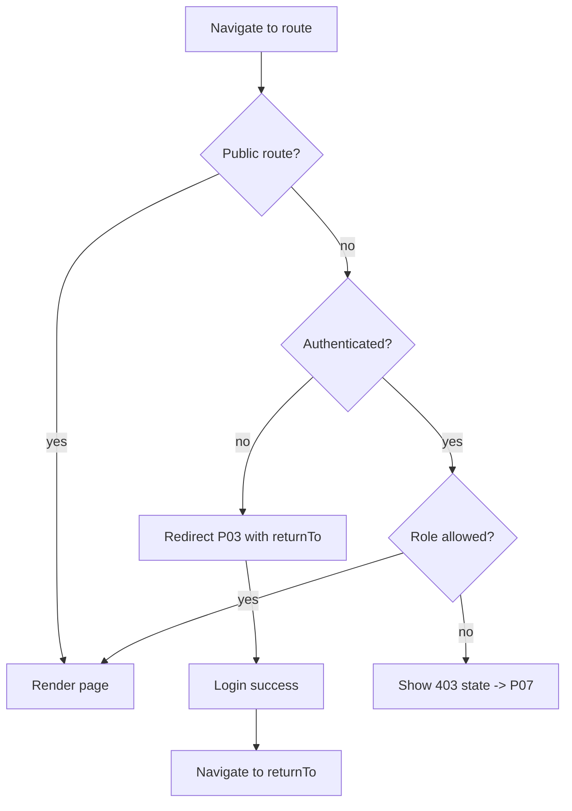

Public routes: P01, P02, P03–P06, P07, P08, P09, P10, P11, P12, P13,
P21. Gated: P15, P16 (write), P17, P18–P20, R01–R05, A01–A10. A08–A10 require
`super_admin` specifically; A02–A07 require `admin` or `super_admin` (in-scope
for admin).

---

## 9. Complete page connectivity graph

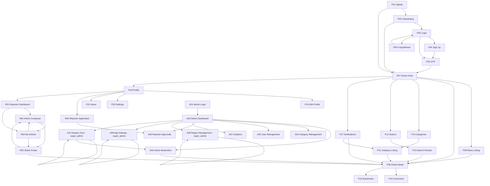

---

## 10. Analytics events

| Event | Trigger | Properties |
|---|---|---|
| `nav_tab_select` | Tab changed | `tab`, `fromTab` |
| `nav_push` | New screen pushed | `from`, `to` |
| `nav_back` | Back used | `from`, `to` |
| `nav_deeplink` | Deep link opened | `path`, `resolved`, `source` |
| `nav_not_found` | Unknown route | `path` |
| `nav_guard_redirect` | Auth/role gate triggered | `route`, `reason` |

---

## 11. Open questions

- Do we need a persistent "Continue reading" bar across tabs?
- Should web support browser forward navigation fully or use replace semantics?
- Are admin routes served from a subdomain (`admin.`) or path (`/admin`)?
