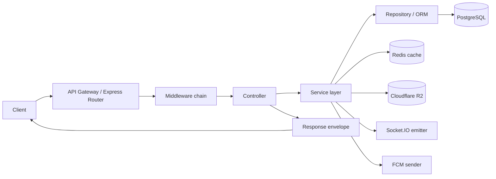
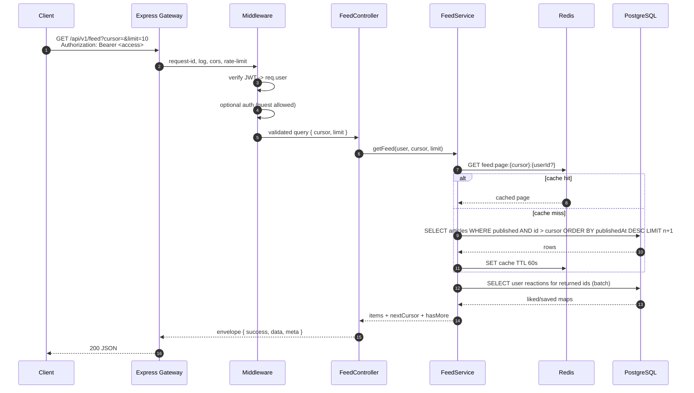
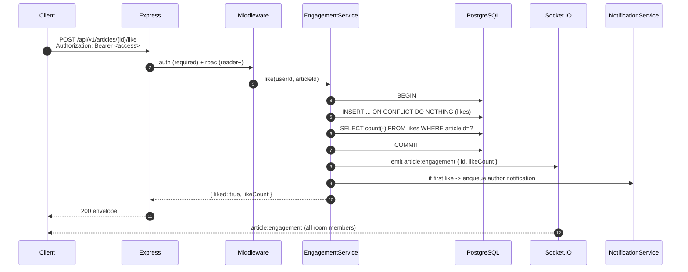
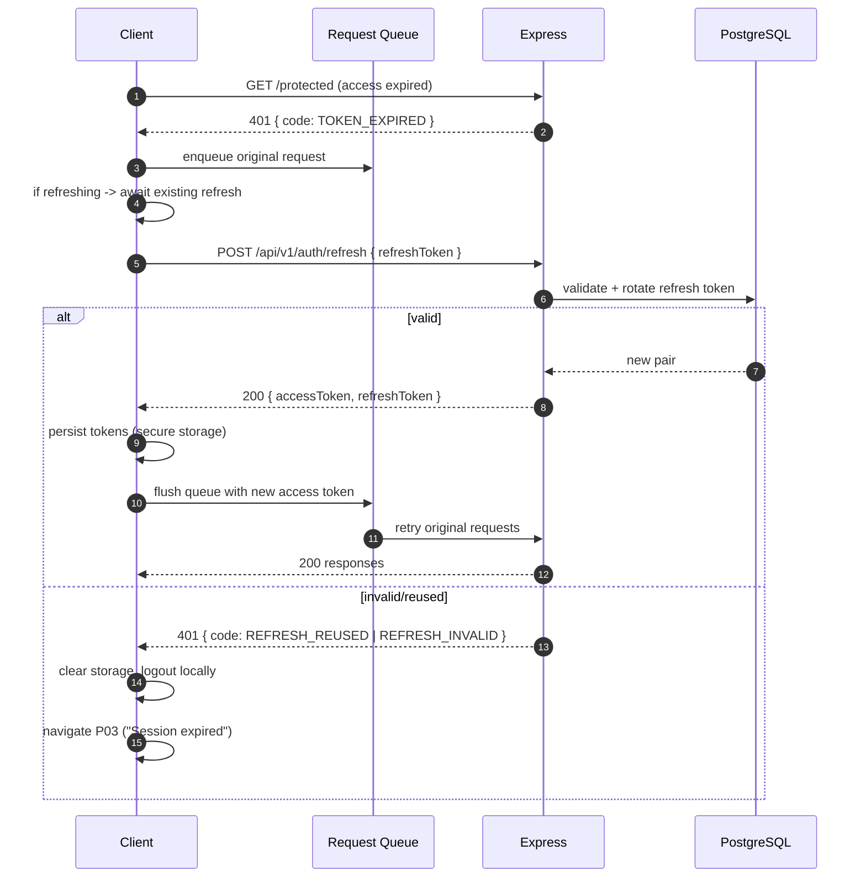
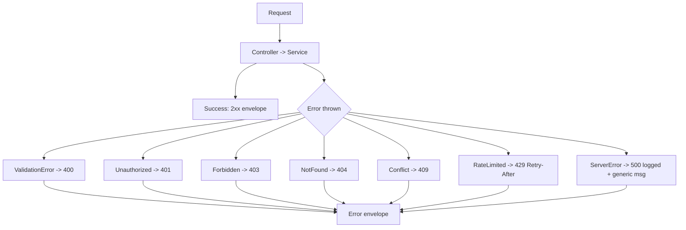
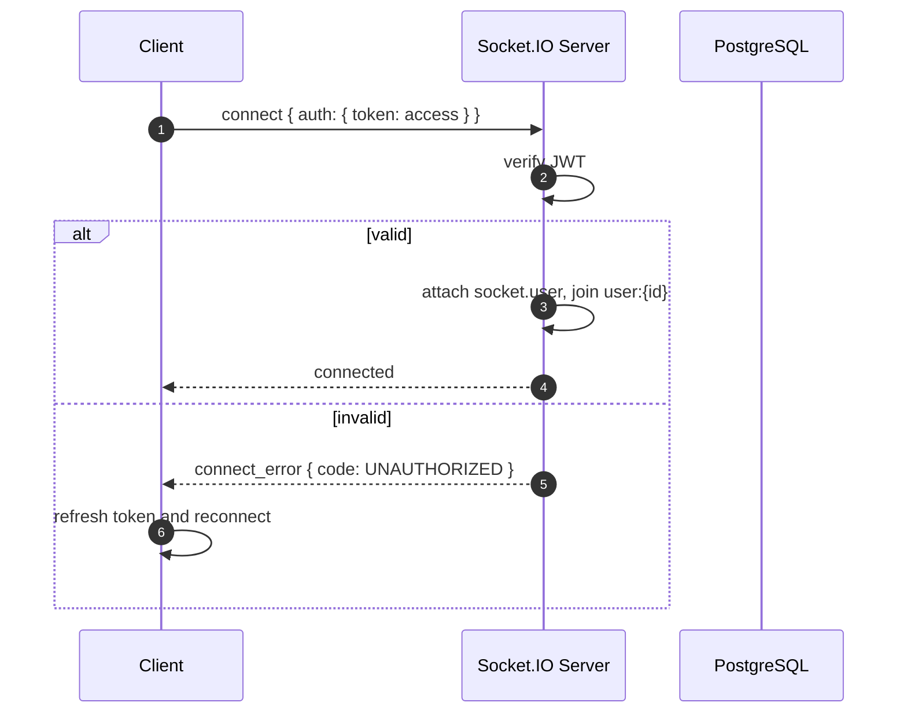
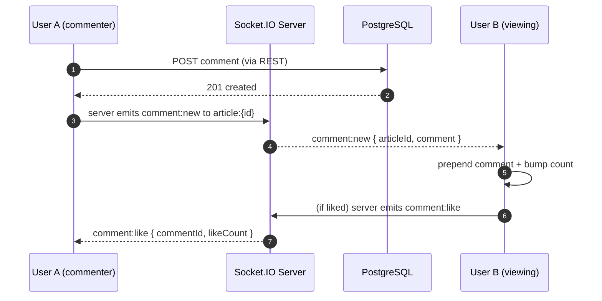
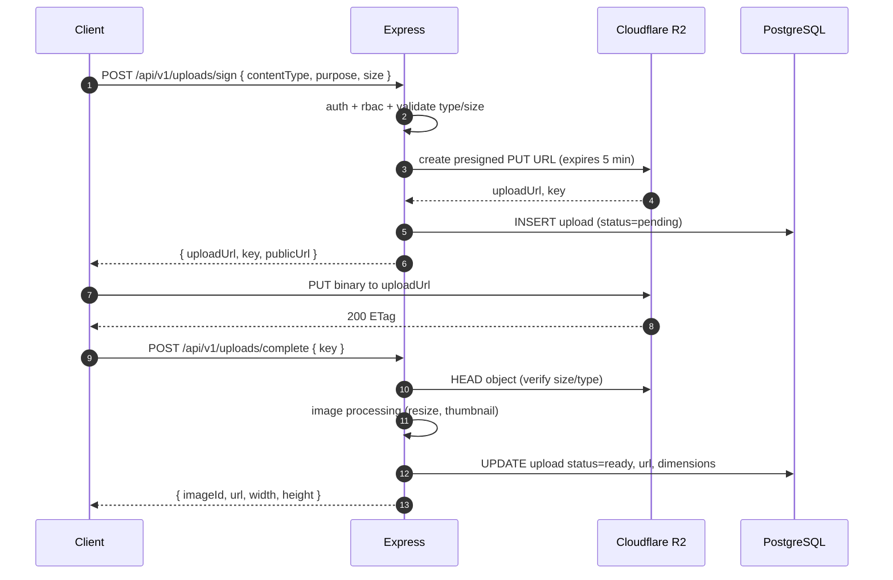
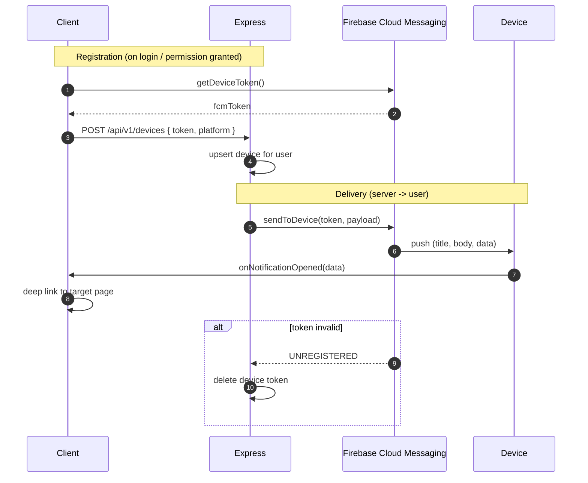

# 08 — API Interaction Flow

How every client (mobile, web, admin) talks to the backend: request lifecycle,
auth header + refresh retry, caching, pagination, error handling, Socket.IO
realtime, file upload, and push notification delivery.

| Field | Value |
|---|---|
| Clients | React Native (Expo) mobile, React/Next.js web, Admin web |
| Backend | Node.js + Express, PostgreSQL, Redis, Socket.IO |
| Base URL | `/api/v1` |
| Requirement areas | `SYS`, `AUTH`, `NOTIF`, and all feature areas |

---

## 1. Requirement map

| ID | Requirement | Priority |
|---|---|---|
| REQ-SYS-020 | All clients MUST call the backend through the versioned `/api/v1` base. | P0 |
| REQ-SYS-021 | Requests MUST send `Authorization: Bearer <accessToken>` when authenticated. | P0 |
| REQ-SYS-022 | Responses MUST use the standard envelope `{ success, data, meta, error }`. | P0 |
| REQ-SYS-023 | Lists MUST use cursor pagination and return `meta.nextCursor` + `meta.hasMore`. | P0 |
| REQ-SYS-024 | On `401 TOKEN_EXPIRED`, clients MUST refresh once and retry the original request. | P0 |
| REQ-SYS-025 | Refresh MUST be serialised (single-flight); concurrent 401s await one refresh. | P0 |
| REQ-SYS-026 | Requests MUST time out after 15s and be retried (idempotent GETs) with backoff. | P1 |
| REQ-SYS-027 | Realtime events MUST be delivered over Socket.IO with authenticated rooms. | P1 |
| REQ-SYS-028 | Uploads MUST use short-lived signed URLs and complete validation server-side. | P1 |
| REQ-SYS-029 | Push MUST be delivered via FCM with device-token registration and cleanup. | P1 |
| REQ-SYS-030 | Errors MUST be structured (`error.code`, `error.message`, `error.fields`). | P0 |

---

## 2. Layered request lifecycle



### Middleware chain (in order)

| # | Middleware | Responsibility |
|---|---|---|
| 1 | Request ID | Attach `x-request-id` for tracing |
| 2 | Logger | Structured request/response logs |
| 3 | CORS | Allow known mobile/web origins |
| 4 | Body parser | JSON (limit 1 MB), multipart for uploads |
| 5 | Rate limiter | Per-IP and per-identifier (auth stricter) |
| 6 | Auth | Verify JWT, attach `req.user` (optional on public routes) |
| 7 | RBAC | Enforce role (`reader`/`reporter`/`admin`) per route |
| 8 | Validation | Schema validation (zod/Joi), 400 on failure |
| 9 | Controller | Invoke service, shape envelope |
| 10 | Error handler | Map thrown errors to standard error envelope |

### Layer responsibilities

| Layer | Does | Does not |
|---|---|---|
| Controller | Parse input, call service, set status | Business rules, SQL |
| Service | Business rules, transactions, cache, events | HTTP concerns |
| Repository | Queries, transactions, DB mapping | Business rules |
| DB | Persistence, constraints, indexes | Any app logic |

---

## 3. Authenticated feed load (sequence)



Notes:

- `limit` is capped (default 10, max 30).
- `n+1` rows determine `hasMore`; the extra row is dropped.
- User-specific flags (`likedByMe`, `savedByMe`) are always fetched fresh, never
  cached across users.
- Guest requests skip the per-user query and return flags as `false`.

---

## 4. Like / comment action (sequence)



Comment post additionally inserts the comment row, emits `comment:new` to
`article:{id}`, and notifies the article author and any parent-comment author.

---

## 5. Token refresh (sequence)



Single-flight guarantee (REQ-SYS-025): the first 401 starts the refresh; every
other 401 while refreshing subscribes to the same promise and retries on
resolution. The refresh endpoint itself is never retried on 401.

---

## 6. Caching strategy

| Layer | Key | TTL | Invalidate on |
|---|---|---|---|
| Client memory | feed/list pages | session | refresh, filter change |
| Client disk | last feed page, categories, bookmarks meta | 15 min | TTL, logout |
| Redis | `feed:{cursor}`, `trending`, `categories`, `article:{id}` | 60 s | publish/moderate, category change |
| CDN | images, static JS/CSS | long | content hash change |
| HTTP | `Cache-Control: public, max-age=60` for public GETs | 60 s | — |
| HTTP authed GETs | `Cache-Control: private, no-store` | — | never cached at edge |

Cache rules:

- User-specific data is never cached in shared Redis keys.
- Mutations invalidate related Redis keys (publish → clear `feed:*`,
  `article:{id}`, `trending`).
- Cache stampede is mitigated with a short lock + serve-stale on lock contention.

---

## 7. Pagination contract

| Parameter | Meaning |
|---|---|
| `cursor` | Opaque base64 token encoding the last row's sort key (`id`, `publishedAt`) |
| `limit` | Page size, default 10, max 30 |
| `sort` | `latest` \| `views` \| `likes` (list endpoints) |

```json
{
  "success": true,
  "data": { "items": [ "..." ] },
  "meta": { "nextCursor": "eyJwdWJsaXNoZWRBdCI6..." , "hasMore": true, "limit": 10 },
  "error": null
}
```

```mermaid
flowchart LR
  R[Request page] --> P{cursor present?}
  P -- no --> F[First page ORDER BY sort DESC LIMIT n+1]
  P -- yes --> N[Decode cursor -> keyset WHERE (sort,id) < cursor LIMIT n+1]
  F --> M[Build nextCursor from last row if hasMore]
  N --> M
  M --> RESP[Return items + meta]
```

Cursor pagination is stable under inserts (unlike offset); clients must treat
`cursor` as opaque and stop when `hasMore` is `false`.

---

## 8. Error handling



```json
{
  "success": false,
  "data": null,
  "error": { "code": "VALIDATION_ERROR", "message": "Title is required", "fields": { "title": "required" } }
}
```

Client policy:

| Status | Client behavior |
|---|---|
| 400 | Show field errors, do not retry |
| 401 `TOKEN_EXPIRED` | Silent refresh + retry once |
| 401 other | Logout + redirect P03 |
| 403 | Hide feature, show "not allowed" toast |
| 404 | Not-found state (article/list) |
| 409 | Inline conflict message |
| 429 | Back off using `Retry-After`, disable action |
| 5xx | Retry idempotent GETs (max 3, exponential backoff), show error state |
| Network/timeout | Offline banner + retry |

Never expose stack traces or SQL in `error.message`; log server-side with the
request ID.

---

## 9. Socket.IO realtime

### 9.1 Connection & authentication



### 9.2 Rooms & events

| Room | Join trigger | Events received |
|---|---|---|
| `user:{id}` | On connect | `notification:new`, `role:updated`, `article:status` |
| `article:{id}` | Open P09/P16 | `comment:new`, `comment:like`, `article:engagement` |
| `category:{id}` | Open P11 | `article:published` |

| Event | Direction | Payload |
|---|---|---|
| `notification:new` | server → client | `{ id, kind, title, targetId }` |
| `role:updated` | server → client | `{ role }` |
| `article:status` | server → client | `{ articleId, status, reason? }` |
| `comment:new` | server → client | `{ articleId, comment }` |
| `comment:like` | server → client | `{ commentId, likeCount }` |
| `article:engagement` | server → client | `{ articleId, likeCount, commentCount }` |
| `article:published` | server → client | `{ articleId, categoryId }` |
| `article:join` / `article:leave` | client → server | `{ articleId }` |

Reconnection uses exponential backoff and re-joins active rooms. If the socket
drops, clients fall back to polling refetch on screen focus.

### 9.3 Realtime comment update



Clients MUST ignore echoes of their own optimistic events (dedupe by client
`tempId` → server `id` mapping).

---

## 10. File upload flow



| Constraint | Value |
|---|---|
| Content types | `image/jpeg`, `image/png`, `image/webp` |
| Max size | 5 MB |
| Min dimensions (hero) | 1200×675 |
| Gallery max | 10 images |
| Presign TTL | 5 min |
| Orphan cleanup | Delete pending uploads older than 24 h |

---

## 11. Push notification delivery



### Push envelope

```json
{
  "notification": { "title": "Breaking: ...", "body": "Tap to read" },
  "data": { "kind": "article", "targetId": "art_7c1...", "deeplink": "/a/slug" },
  "android": { "priority": "high" },
  "apns": { "payload": { "aps": { "sound": "default", "badge": 1 } } }
}
```

| Kind | Trigger | Deep link |
|---|---|---|
| `article` | Published / followed category article | `/a/{slug}` |
| `comment_reply` | Someone replies to your comment | `/article/{id}/comments` |
| `article_status` | Reporter article published/rejected | `/reporter/articles` |
| `reporter_approved` | Application approved | `/reporter` |
| `system` | Admin broadcast | `/notifications` |

On notification open, the app routes via the deep-link map in
[`07-navigation-map.md`](07-navigation-map.md#5-deep-link-url-mapping); if the
app is foregrounded, it shows an in-app toast and updates the P17 badge.

---

## 12. Idempotency, timeouts & retries

| Aspect | Rule |
|---|---|
| Idempotency | `POST /articles/{id}/like`, `/bookmark` are idempotent (toggle by existence); mutations accept `Idempotency-Key` header for safe retry |
| Timeouts | 15s client timeout; 30s server upstream timeout |
| GET retries | Up to 3 with exponential backoff on 5xx/network |
| Write retries | Only with `Idempotency-Key`; otherwise no auto-retry |
| Backoff | 500ms, 1s, 2s (+ jitter) |
| Circuit breaker | On repeated upstream failure, fail fast for 30s |

---

## 13. Observability

| Signal | Detail |
|---|---|
| Request ID | `x-request-id` propagated client → middleware → logs |
| Structured logs | method, path, status, duration, userId, errorCode |
| Metrics | p50/p95 latency, error rate, cache hit rate, socket count |
| Traces | Span per middleware → controller → service → DB |
| Alerts | 5xx rate, auth failures spike, DB pool saturation, FCM failures |

---

## 14. Endpoint surface by area

| Area | Representative endpoints |
|---|---|
| AUTH | `/auth/signup`, `/auth/login`, `/auth/otp/*`, `/auth/oauth`, `/auth/refresh`, `/auth/logout`, `/auth/me` |
| FEED | `/feed`, `/feed/featured` |
| READ | `/articles/{id}`, `/articles/{id}/view`, `/articles/{id}/like`, `/articles/{id}/bookmark` |
| CAT | `/categories`, `/categories/{id}/follow` |
| SEARCH | `/search`, `/search/suggest`, `/search/trending` |
| BOOK | `/bookmarks` |
| NOTIF | `/notifications`, `/notifications/read`, `/devices` |
| COMMENT | `/articles/{id}/comments`, `/comments/{id}/replies`, `/comments/{id}/like` |
| PROF | `/profile`, `/profile/avatar` |
| SET | `/settings` |
| REP | `/reporter/*`, `/articles` (create/submit) |
| ADM | `/admin/*` |
| SYS | `/health`, `/config`, `/uploads/*` |

---

## 15. Analytics events

| Event | Trigger | Properties |
|---|---|---|
| `api_request` | Any request | `path`, `status`, `durationMs` |
| `api_error` | Non-2xx | `path`, `errorCode`, `status` |
| `token_refresh` | Refresh attempted | `success`, `reason` |
| `socket_connect` | Socket connected | `userId`, `reconnect` |
| `upload_complete` | Upload finished | `purpose`, `bytes` |
| `push_received` | Push delivered/open | `kind`, `opened` |

---

## 16. Open questions

- Do we need GraphQL or REST-only in v1? (Assumed REST.)
- Is Redis mandatory for v1 or can we launch with in-process cache?
- Should Socket.IO scale via Redis adapter or a managed pub/sub from day one?
- Do we require request signing for financial-grade security? (Out of scope: no payments.)
