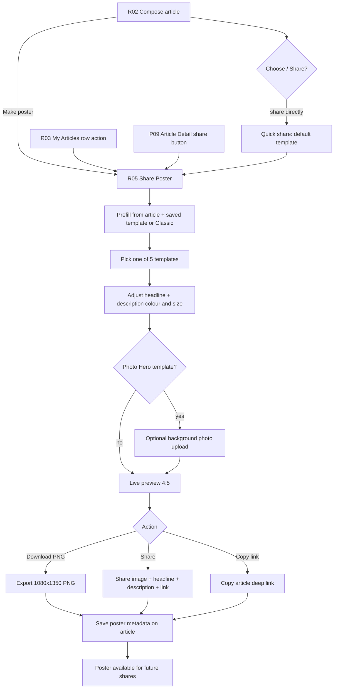
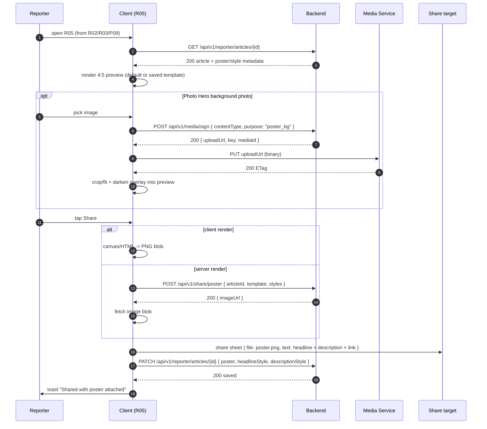

# 09 — Share Poster Flow

Turning a composed article into a shareable **image poster** with R05 Share
Poster: prefill from the article, pick one of **5 templates** (Classic,
Breaking, Minimal, Gradient, Photo Hero), tune headline/description colour and
font size, optionally add a background photo, preview, then export (4:5 PNG) or
share the poster image together with the headline, description, and article
link. The chosen template and style overrides are persisted on the article as
`poster` metadata so the poster is reproducible.

| Field | Value |
|---|---|
| Roles | Reporter (owner), Admin (region-scoped), Super Admin (all) |
| Pages | R02 composer, R03 my articles, R05 share poster, P09 article detail |
| Requirement areas | `POSTER`, `REP`, `READ`, `REG` |

---

## 1. Purpose & participants

- **Purpose** — give a reporter a ready-made graphic to share alongside a
  story, so recipients get a branded poster (headline + description + link)
  instead of a bare URL, while keeping the poster reproducible from stored
  metadata.
- **Participants**
  - **Reporter (owner)** — opens R05, picks a template, styles text, exports or
    shares (REQ-POSTER-013).
  - **Admin (region-scoped)** — may generate a poster for articles whose
    `region_id` is in their scope or a descendant.
  - **Super Admin** — may generate for any article (global).
  - **Client (mobile/web)** — renders the poster (canvas/HTML→image) and drives
    the share sheet; optionally calls server render.
  - **Backend / media service** — persists `poster` metadata, signs background
    photo uploads, and optionally renders a high-res poster via
    `POST /share/poster`.

---

## 2. End-to-end poster pipeline

---

## 3. Render & share sequence

---

## 4. Entry points

| # | Entry | Trigger | Notes |
|---|---|---|---|
| 1 | R02 Make poster | Composer action after compose/save/publish | Passes current draft/article to R05 (REQ-REP-092). |
| 2 | R03 row action | "Make poster" / "Share" on an article row | Loads article by id; any status the reporter owns. |
| 3 | P09 share button | Reader taps share on a published article | If the reporter's article already has `poster` metadata, the share button surfaces the generated poster image; otherwise falls back to link-only share (REQ-READ-007). |
| 4 | Quick share | R02/R03 "Share" without opening R05 | Uses default/saved template; can open R05 for finer control. |

All entries resolve to `GET /api/v1/reporter/articles/{id}` before rendering so
saved `poster` + `headlineStyle`/`descriptionStyle` are reapplied.

---

## 5. Template selection logic

| # | Template | Look | Default headline | Default description |
|---|---|---|---|---|
| 1 | Classic | Solid brand `--purple`, white text | White, 30px, 800 | `#f3d9ef`, 15px |
| 2 | Breaking | Solid `--error` red, high urgency | White, 32px, 800 | `#ffe0e0`, 15px |
| 3 | Minimal | White bg, purple rule + purple headline | `--purple`, 30px, 800 | `--muted-strong`, 15px |
| 4 | Gradient | `--purple → --info` 150° gradient | White, 30px, 800 | `#e5def2`, 15px |
| 5 | Photo Hero | Full-bleed photo + dark overlay | White, 30px, 800 | `#e0e0e0`, 15px |

Rules:

- Exactly 5 templates are offered (REQ-POSTER-001); selecting one swaps the
  live preview immediately (REQ-POSTER-002).
- The article's saved `poster.template` wins; otherwise default **Classic**.
- Template defaults are applied unless the user has explicit per-field
  overrides, which are preserved across template switches.
- Prefill maps `title → headline`, `summary → description`, `category →
  categoryTag`, `heroImage → Photo Hero background` (REQ-POSTER-003).
- Headline/description/category may be edited independently of the article
  fields (REQ-POSTER-006).

---

## 6. Styling controls

| Control | Range / options | Requirement |
|---|---|---|
| Headline colour | Preset swatches + custom picker | REQ-POSTER-004 |
| Headline size | 18–46px slider | REQ-POSTER-004 |
| Description colour | Preset swatches + custom picker | REQ-POSTER-005 |
| Description size | 11–24px slider | REQ-POSTER-005 |
| Background photo | Upload / replace / remove (Photo Hero) | REQ-POSTER-007 |
| Content | Editable headline, description, category tag | REQ-POSTER-006 |

Styling is stored as structured metadata so feeds, article detail, and posters
render identically (REQ-REP-088), and reloads on return (REQ-POSTER-012).

---

## 7. Export formats

- **Canvas size:** 4:5 portrait, minimum **1080×1350** (REQ-POSTER-008).
- **PNG** — primary export via download (REQ-POSTER-009).
- **Clipboard** — copy poster to clipboard where supported (REQ-POSTER-009).
- **Web/social variants** (open question) — 16:9 or 1:1 per channel.

---

## 8. Share channels & fallbacks

| Channel | Behavior |
|---|---|
| Native share sheet | Mobile: OS sheet with image file + text (primary). |
| Web Share API | Web: `navigator.share({ files, text })` where available. |
| WhatsApp | Prefilled text + image; app scheme / `wa.me` fallback. |
| X (Twitter) | Prefilled text + link; image attached where the client supports files. |
| Facebook | Link + image share dialog. |
| Copy link | Copies the article deep link (always available). |
| Download | Saves the PNG when no share target exists. |

Sharing sends the **image together with** the headline, description, and
article link (REQ-POSTER-010). If the native share sheet is unavailable or
cannot accept files, the client falls back to channel-specific share links plus
download/copy (error message: "Sharing isn't available — download or copy
instead.").

---

## 9. Error handling & states

| Case | Behavior | Message |
|---|---|---|
| Poster render/canvas failure | Inline error panel over preview + Retry | "Couldn't create the poster. Try again." |
| No share target available | Fall back to download + copy link | "Sharing isn't available — download or copy instead." |
| Missing headline | Block export | "Add a headline before exporting" |
| Headline > 120 chars | Block export | "Add a headline before exporting" |
| Description > 300 chars | Inline validation | "Description must be 300 characters or fewer" |
| Headline size out of range | Clamp/slider guard | "Choose a size between 18 and 46" |
| Description size out of range | Clamp/slider guard | "Choose a size between 11 and 24" |
| Background photo invalid | Reject upload | "Images must be JPEG, PNG, or WebP and under 10MB" |
| Loading | Skeleton poster + spinner while fonts/images load | — |
| Empty | Brand mark + "Add a headline" hint | — |
| Success | Toast "Poster downloaded" / "Shared with poster attached" | — |

The screen MUST show a loading state while rendering and an error state with
Retry on failure (REQ-POSTER-014).

---

## 10. Analytics events

| Event | Trigger | Properties |
|---|---|---|
| `poster_opened` | R05 mount | `article_id`, `source` |
| `poster_template_selected` | Template change | `template` |
| `poster_color_changed` | Colour change | `field` (headline/description), `color` |
| `poster_size_changed` | Size change | `field`, `size` |
| `poster_downloaded` | Export success | `template`, `format` |
| `poster_shared` | Share invoked | `template`, `channel` |
| `poster_render_failed` | Export error | `reason` |

---

## 11. Requirement map

| ID | Requirement | Priority |
|---|---|---|
| REQ-POSTER-001 | Offer exactly 5 poster templates: Classic, Breaking, Minimal, Gradient, Photo Hero. | P0 |
| REQ-POSTER-002 | Selecting a template MUST update the live preview immediately. | P0 |
| REQ-POSTER-003 | The template MUST be pre-filled from the article's title, summary, category, and hero image. | P0 |
| REQ-POSTER-004 | Set the headline text colour (presets + custom) and font size (18–46px). | P0 |
| REQ-POSTER-005 | Set the description text colour (presets + custom) and font size (11–24px). | P0 |
| REQ-POSTER-006 | Edit the poster headline, description, and category tag independently of the article fields. | P1 |
| REQ-POSTER-007 | Photo Hero MUST support uploading/replacing/removing a background photo. | P1 |
| REQ-POSTER-008 | Render at 4:5 and export a minimum 1080×1350 PNG. | P0 |
| REQ-POSTER-009 | Download the poster as PNG and copy it to the clipboard. | P0 |
| REQ-POSTER-010 | Sharing MUST send the poster image together with the headline, description, and article link. | P0 |
| REQ-POSTER-011 | Provide back-link to article detail, reset, and "save as article template". | P2 |
| REQ-POSTER-012 | Template + overrides MUST be saved on the article (`poster` metadata) and reloaded. | P1 |
| REQ-POSTER-013 | Poster generation accessible to the owning reporter; admins in scope; super admin any article. | P1 |
| REQ-POSTER-014 | Show a loading state while rendering and an error state with Retry on failure. | P1 |
| REQ-REP-085 | Body editor supports per-run formatting (bold/italic/underline, headings, lists, quote, link, text colour, highlight). | P0 |
| REQ-REP-086 | Set headline (title) text colour and font size with live preview. | P0 |
| REQ-REP-087 | Set description (summary) text colour and font size with live preview. | P0 |
| REQ-REP-088 | Styling persists as `headlineStyle`/`descriptionStyle` and renders identically in feeds, detail, and posters. | P0 |
| REQ-REP-089 | Composer offers 5 share-poster templates with live preview and per-article selection. | P0 |
| REQ-REP-090 | Selected poster template + overrides stored on the article as `poster` metadata. | P1 |
| REQ-REP-091 | Sharing MUST generate a poster image and send it with headline, description, and link. | P0 |
| REQ-REP-092 | Composer MUST link to the full Share Poster editor (R05). | P1 |

---

## 12. Navigation

| Action | From | To |
|---|---|---|
| Make poster | R02 | R05 |
| Make poster / Share | R03 | R05 |
| Share article | P09 | R05 (when poster available) or link-only share |
| Download PNG | R05 | Device downloads |
| Share | R05 | Native share sheet / target app |
| Open article link (poster footer) | Shared poster | P09 Article Detail (deep link) |
| Back | R05 | R02 / R03 / P09 (origin) |

---

## 13. Open questions

- Client-side canvas rendering vs server-side render (`POST /share/poster`) for
  pixel-perfect PNG export (fonts must be embedded either way)?
- Per-article template choice, per-reporter default, or both?
- Restrict custom colours to brand-safe palettes, or allow any colour?
- Support landscape (16:9) and square (1:1) ratios per channel in addition to
  4:5?
- Add a branded watermark/QR code linking to the article on every poster?
