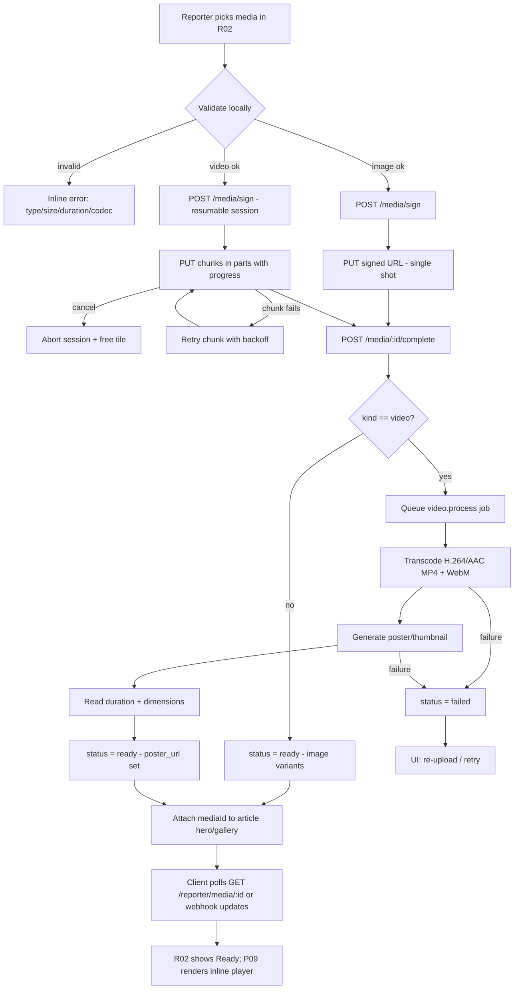
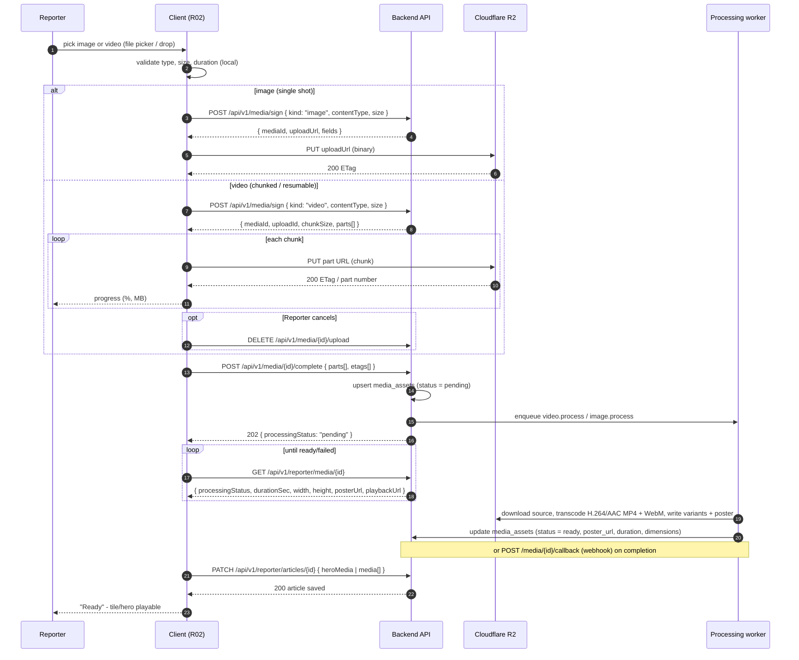
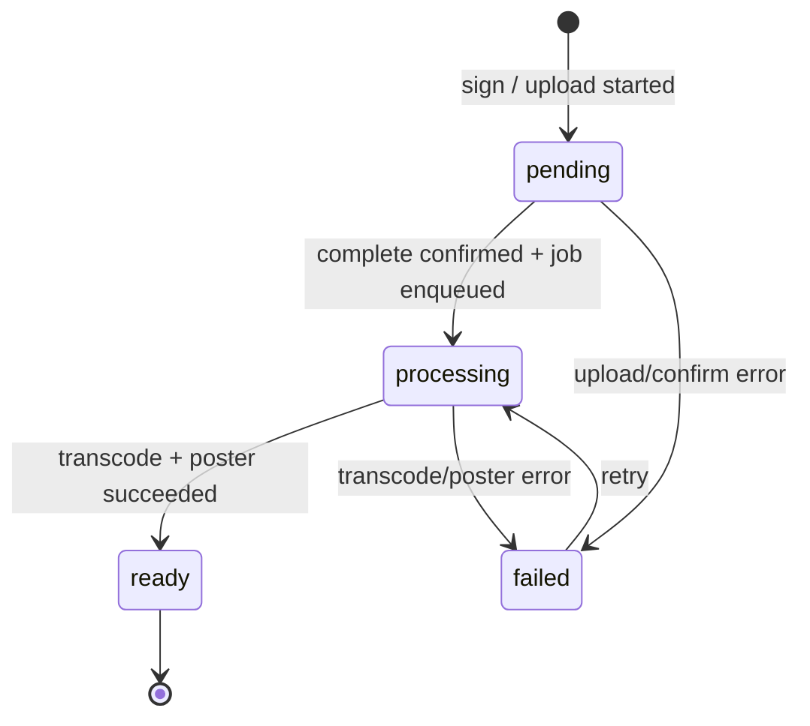

# 10 — Media Upload & Processing Flow

How reporters attach **images and videos** to an article and how those assets
become playable: pick media → validate → (video) chunked/resumable upload →
`/media/sign` + `/media/:id/complete` → processing job (transcode + poster) →
status polling/webhook → `ready` → attach to the article. A hero may be exactly
one **image OR video**; a gallery holds up to 10 **mixed** items that the reader
plays inline. Video is transcoded server-side to H.264/AAC MP4 + WebM with a
generated poster (`media_assets.poster_url`). Uploads go to **Cloudflare R2**
via its S3-compatible API (presigned PUT for images, multipart for large
videos), and deliverables are served from a public R2 bucket through the
Cloudflare CDN.

| Field | Value |
|---|---|
| Roles | Reporter (owner), Admin (region-scoped), Super Admin (all) |
| Pages | R02 composer, R03 my articles, P09 article detail, P20 settings (data saver) |
| Requirement areas | `REP`, `READ`, `SYS`, `REG` |
| Entry | R02 composer hero/gallery dropzone; R02 "Replace"/"Remove" |

---

## 1. Purpose & participants

- **Purpose** — let a reporter publish a story whose hero and gallery may
  contain video as well as images, while guaranteeing every published video is
  web-playable (H.264/AAC MP4 + WebM) and has a poster, and every image is
  optimised.
- **Participants**
  - **Reporter (owner)** — picks media, sets hero (image OR video), reorders the
    mixed gallery, chooses a video poster, retries/cancels uploads
    (REQ-REP-093..099).
  - **Admin (region-scoped) / Super Admin** — may moderate/replace media on
    articles in their scope; super admin any article (REQ-REG-001).
  - **Client (mobile/web)** — validates locally, uploads single-shot (images) or
    chunked/resumable (videos), polls media status, renders progress.
  - **API** — issues signed upload params + chunk manifests, records
    `media_assets`, enqueues processing, exposes status.
  - **Object storage** — **Cloudflare R2** (S3-compatible API) bucket receiving
    uploads; public bucket served via the Cloudflare CDN.
  - **Processing worker** — transcodes video, generates poster + variants +
    blurhash, writes duration/dimensions, sets `status = ready`.

---

## 2. End-to-end upload pipeline

Attaching media to an article references **owned, `ready`** `media_assets` rows
(REQ-REP-096). A video whose processing is not `ready` (or is `failed`) MAY be
held in the composer but MUST NOT be published (REQ-SYS-354).

---

## 3. Client ↔ API ↔ storage ↔ worker sequence

---

## 4. Supported types & limits

| Kind | Accepted types | Max size | Max duration | Processing |
|---|---|---|---|---|
| Image | JPG, PNG, WebP | 10MB | — | Resize/optimise, variants + blurhash, dimensions |
| Video | MP4, WebM, MOV | 200MB | 3 min | Transcode to H.264/AAC MP4 + WebM, poster/thumbnail, duration + dimensions |

| Rule | Value | Requirement |
|---|---|---|
| Hero count | Exactly one, **image OR video** (never both) | REQ-REP-093 |
| Gallery count | Up to 10 items total, mixed kinds | REQ-REP-094 |
| Image constraints | JPG/PNG/WebP, ≤10MB | REQ-REP-095 |
| Video constraints | MP4/WebM/MOV, ≤200MB, ≤3 min | REQ-REP-095 |
| Video transcode | Server-side H.264/AAC MP4 + WebM + poster | REQ-REP-096 |
| Reorder / poster | Reporter reorders mixed media; sets video poster | REQ-REP-098 |
| Delete / replace | Updates processing status; detaches asset | REQ-REP-099 |

**Audio extraction is not required** — only the video stream and poster are
produced.

---

## 5. Resumable / chunked upload (video)

1. Client calls `POST /api/v1/media/sign` with `kind: "video"`, `contentType`,
   and `size`; the API creates a `media_assets` row (`status = pending`) and
   returns an `uploadId`, `chunkSize` (default 5MB), and per-part pre-signed
   URLs.
2. Client uploads parts sequentially (small concurrency allowed), each with its
   own progress; the overall progress is `uploadedBytes / size`.
3. A failed chunk is retried with exponential backoff; the client resumes from
   the last acknowledged part (REQ-REP-097).
4. On all parts uploaded, the client calls `POST /api/v1/media/:id/complete`
   with the part list + ETags; the API finalises the object and enqueues
   processing.
5. **Cancel** aborts the multipart session (`DELETE /api/v1/media/:id/upload`)
   and frees the tile.

Images use the same sign/complete contract but a single PUT (no chunking).

---

## 6. Processing pipeline

| Stage | Input | Output | Queue |
|---|---|---|---|
| Ingest | Confirmed upload in object storage | `media_assets` row (`pending`) | — |
| Transcode | Source video | H.264/AAC MP4 + WebM renditions | `video.process` |
| Poster | Transcoded/source video | `poster_url` thumbnail (also `poster_media_id`) | `video.process` |
| Metadata | Rendition | `durationSec`, `width`, `height` | `video.process` |
| Image process | Source image | Optimised variants + blurhash + dimensions | `image.process` |
| Ready | — | `media_assets.status = ready`; URLs CDN-prefixed | — |

Jobs are idempotent by asset id, retried with exponential backoff, and terminal
failures go to the DLQ + alert (REQ-SYS-350..354). A failed job sets
`status = failed` and the composer offers re-upload/retry (REQ-REP-099).

---

## 7. Status lifecycle

- `pending` — upload/session created, bytes not yet finalised.
- `processing` — job running; composer shows "Processing video…".
- `ready` — playable; `poster_url`, `durationSec`, dimensions set; shows "Ready".
- `failed` — processing/upload error; composer shows re-upload/retry.

The composer polls `GET /api/v1/reporter/media/:id` (with backoff) and/or
receives a webhook/POST callback that flips the tile to "Ready".

---

## 8. Retries & error handling

| Case | Behavior | Message |
|---|---|---|
| Invalid type | Block before upload | "Use JPG, PNG, WebP, MP4, WebM, or MOV files" |
| Image > 10MB | Block before upload | "Images must be under 10MB" |
| Video > 200MB | Block before upload | "Videos must be under 200MB" |
| Video > 3 min | Block before upload | "Videos must be 3 minutes or shorter" |
| Unsupported codec | Reject / flag for processing | "This video format isn't supported" |
| Chunk upload fails | Retry with backoff, resume from last part | "Upload failed. Tap to retry" |
| Upload cancelled | Abort session, free tile | — |
| Confirm fails | Retry complete | "Couldn't finish upload. Retry." |
| Transcode/poster fails | `status = failed`; offer re-upload | "We couldn't process this video. Re-upload or retry." |
| Signed URL generation fails | Surface error + retry | "Couldn't start upload. Try again." |
| Provider outage (R2) | Fallback proxy upload path if configured, else block new media | "Uploads are temporarily unavailable" |
| Offline | Queue draft + media intent; sync on reconnect | "Offline — changes kept locally" |

---

## 9. Reader playback (P09 downstream)

A `ready` video hero/gallery item carries `posterUrl`, `playbackUrl`,
`durationSec`, `width`, and `height`. P09 renders it inline with
native controls, shows the poster until play, overlays a duration badge,
supports fullscreen, may autoplay muted per the user setting, and respects data
saver by not autoplaying and preferring the lower-bitrate MP4 rendition
(REQ-READ-033..040, P20).

---

## 10. Analytics events

| Event | Trigger | Properties |
|---|---|---|
| `media_upload_started` | Sign/upload begins | `context` (hero/gallery), `kind`, `size_kb` |
| `media_upload_progress` | Chunk progress (milestone) | `context`, `kind`, `percent` |
| `media_upload_succeeded` | `/complete` returns 202 | `context`, `kind`, `size_kb`, `duration_sec`, `chunks` |
| `media_upload_failed` | Upload/chunk error | `context`, `kind`, `reason`, `retried` |
| `media_upload_cancelled` | Reporter cancels | `context`, `kind`, `uploaded_bytes` |
| `media_processing_completed` | Status → ready | `media_id`, `kind`, `duration_sec`, `processing_ms` |
| `media_processing_failed` | Status → failed | `media_id`, `kind`, `reason` |
| `media_poster_set` | Reporter sets poster | `media_id`, `source` (scrub/auto) |
| `media_reordered` | Mixed gallery reorder | `from_index`, `to_index`, `kind` |
| `media_deleted` | Media removed/replaced | `context`, `media_id`, `kind` |

---

## 11. Requirement map

| ID | Requirement | Priority |
|---|---|---|
| REQ-REP-093 | Hero media MAY be an image OR a video; exactly one hero required (one of). | P0 |
| REQ-REP-094 | Gallery supports mixed images and videos, up to 10 items. | P0 |
| REQ-REP-095 | Videos MP4/WebM/MOV ≤200MB ≤3 min; images JPG/PNG/WebP ≤10MB. | P0 |
| REQ-REP-096 | Video MUST be transcoded server-side (H.264/AAC MP4 + WebM) + poster generated. | P0 |
| REQ-REP-097 | Video upload MUST be resumable/chunked with progress, retry, cancel. | P0 |
| REQ-REP-098 | Reporter MUST reorder mixed media and set a video poster/thumbnail. | P1 |
| REQ-REP-099 | Delete/replace media MUST update processing status and detach the asset. | P1 |
| REQ-READ-033 | Video hero plays inline with native controls; no navigation required. | P0 |
| REQ-READ-034 | Show the generated poster until playback begins. | P0 |
| REQ-READ-035 | MAY autoplay muted per user setting; otherwise wait for tap. | P1 |
| REQ-READ-036 | Fullscreen playback on mobile and web. | P0 |
| REQ-READ-037 | Data saver: no autoplay, "Tap to play" overlay, prefer low-bitrate MP4. | P1 |
| REQ-READ-038 | Mixed gallery renders images and videos inline with duration badge. | P0 |
| REQ-READ-039 | Emit per-media analytics keyed by `mediaId`. | P1 |
| REQ-READ-040 | Playback failures show poster fallback + error + Retry. | P1 |
| REQ-SYS-350 | Jobs are idempotent and safe to retry. | P0 |
| REQ-SYS-354 | Media processing MUST complete before an article publishes with that image/video. | P0 |

---

## 12. Navigation

| Action | From | To |
|---|---|---|
| Pick hero/gallery media | R02 | R02 (inline upload) |
| Upload / processing | R02 | R02 (tile status) |
| Media ready | R02 | R02 (Ready) / P09 preview |
| Play video | P09 | P09 (inline player) / fullscreen |
| Data saver setting | P20 | P20 (toggle affects P09 autoplay) |

---

## 13. Open questions

- WebM always alongside MP4, or only when the source is WebM?
- Poster auto-selection: first frame, smart frame, or server-chosen best frame?
- Client-side pre-transcode/preview for large videos, or server-only?
- Per-video caption/subtitle tracks in v1 (audio extraction is out of scope)?
- Storage lifecycle/cost: keep original MOV/WebM sources, or purge after
  transcode?
