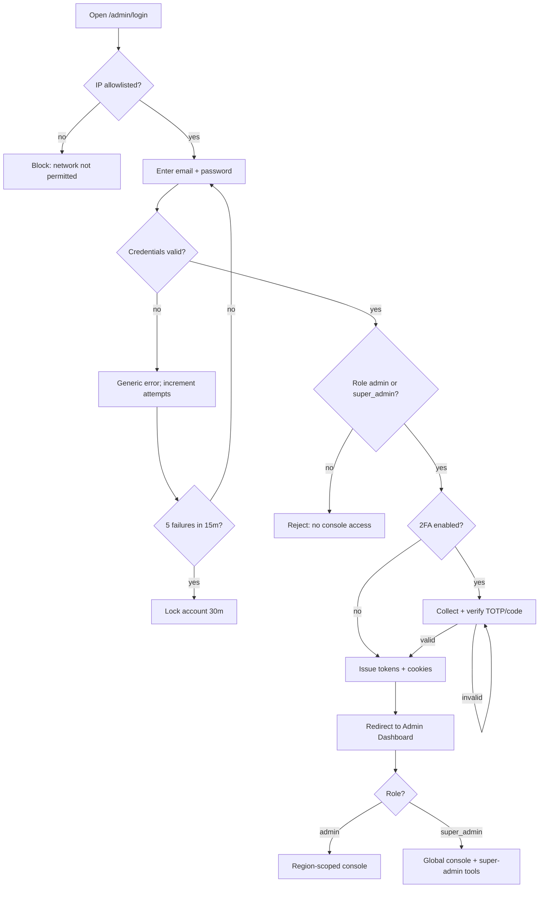

# A01 — Admin Login

## Metadata

| Field | Value |
|---|---|
| Page ID | A01 |
| Platforms | Admin console (Web; desktop-first, tablet-responsive) |
| Roles | Admin (region-scoped), Super Admin (global) |
| Priority | P1 |
| Route / Path | `/admin/login` |
| Prototype | `prototypes/pages/a01-admin-login.html` |

## Purpose

Provides a dedicated, hardened authentication entry point for the NewsWatch
admin console that is completely separate from the reader/reporter login
(`P03`). It exists to restrict console access to the two console roles —
`admin` and `super_admin` (see
[`08-roles-regions-and-deletion.md`](../architecture/08-roles-regions-and-deletion.md)) —
enforce two-factor authentication for staff, apply IP allowlisting where
configured, and protect against credential-stuffing via failed-attempt lockout.
Regular readers (`user`) and reporters (`reporter`) who attempt to authenticate
here are rejected even with valid credentials because their role is not a
console role. A `super_admin` signs in through the same entry point and is
redirected to the full console (all regions, all super-admin tools).

## UI Structure

### Desktop (primary)

- **Layout:** single centered auth card on a full-height `--background` canvas.
  A two-column split at `desktop` (≥1025px): left brand panel (`--purple` →
  `--purple-dark` gradient) with logo mark (`logo-icon`), product name, and trust
  copy; right panel holds the form card centered with `space-9` outer padding.
- **Brand panel regions:** logo row (icon + "NewsWatch Admin" — `weight-bold`,
  `--white`), tagline (`--text-secondary` on tint, 17px), footer note with
  environment badge (`PRODUCTION` = `--error` chip, `STAGING` = `--warning` chip).
- **Form card:** surface `--white`, `radius-xl`, `shadow-card`, max-width 420px,
  padding `space-8`. Regions top-to-bottom:
  1. Heading "Admin sign in" (`font-size-title`, `weight-bold`, `--text`).
  2. Sub-copy "Staff access only" (`--muted`).
  3. Email field (`space-4` gap).
  4. Password field with show/hide toggle.
  5. "Remember this device for 30 days" checkbox (off by default on shared
     machines).
  6. Primary button "Sign in" (`--purple`; hover `--purple-dark`; disabled 40%
     opacity; `radius-md`; height 44px).
  7. "Forgot password?" link (`--purple`, `weight-medium`).
  8. Divider + optional SSO row (Google Workspace — only if org enables it).
- **2FA step:** after credential success, the card transitions (fade `dur-medium`)
  to an OTP/TOTP panel. Six single-digit inputs (`radius-md`, `--border`, focus
  ring `--purple`), "Verify" button, "Use a recovery code instead" link, "Resend
  code" text-button with 60s countdown (email-OTP variant only).
- **Footer strip:** version string, region (`--muted`, `font-size-meta`), and
  "Privacy · Security" links.

### Tablet / Narrow laptop (769–1024px)

- Brand panel collapses to a slim top banner (`header-height-web`, `--purple`)
  containing only the logo mark and product name.
- Form card becomes full-width with `space-6` gutters, vertically centered.

### Responsive behavior

| Breakpoint | Behavior |
|---|---|
| `desktop` ≥1025px | Two-column split, brand panel visible, card max-width 420px. |
| `tablet` 769–1024px | Single column, top purple banner, full-width card. |
| `mobile` 0–768px | Console is unsupported for routine use but the login remains usable: single column, padding `space-4`, inputs full-width. Displays an advisory "Best viewed on desktop" notice. |

## Features / Functional Requirements

| ID | Requirement | Priority |
|---|---|---|
| REQ-ADM-001 | The page MUST be served at `/admin/login` and MUST be visually and functionally separate from the reader/reporter login. | P0 |
| REQ-ADM-002 | The system MUST authenticate staff via email + password over HTTPS only (HSTS enforced). | P0 |
| REQ-ADM-003 | The system MUST reject any authenticated user whose role is not `admin` or `super_admin`, even with correct credentials. | P0 |
| REQ-ADM-004 | The system MUST support optional TOTP-based 2FA; when enabled for an account, a valid TOTP code is REQUIRED after password success. | P0 |
| REQ-ADM-005 | The system MUST support an email-OTP fallback as a second factor when TOTP is unavailable and the option is enabled by an admin. | P1 |
| REQ-ADM-006 | The system MUST enforce an IP allowlist when one is configured for the environment; requests from non-allowlisted IPs MUST be blocked before credential evaluation. | P1 |
| REQ-ADM-007 | The system MUST lock an account after 5 consecutive failed attempts within 15 minutes, for a 30-minute cool-down. | P0 |
| REQ-ADM-008 | The system MUST apply per-IP rate limiting (e.g. 10 attempts/minute) independent of the per-account lockout. | P0 |
| REQ-ADM-009 | The system MUST issue short-lived access tokens (15 min) and rotated refresh tokens stored in `HttpOnly`, `Secure`, `SameSite=Strict` cookies. | P0 |
| REQ-ADM-010 | Successful login MUST invalidate other active refresh tokens for that account only when the user chooses "Sign out everywhere" from security settings (not by default). | P2 |
| REQ-ADM-011 | The system MUST log every login attempt (success/failure, IP, user-agent, timestamp) to an immutable audit log. | P0 |
| REQ-ADM-012 | The system MUST NOT reveal whether an email exists (generic "Invalid email or password" error). | P0 |
| REQ-ADM-013 | Sessions MUST expire after 12 hours of inactivity and MUST force re-authentication for sensitive actions after 60 minutes regardless of activity. | P1 |
| REQ-ADM-014 | All POST auth endpoints MUST be CSRF-protected via double-submit token. | P0 |

## User Interactions

- **Typing:** immediate client-side validation; email format checked on blur.
- **Show/hide password:** eye button toggles input type; icon swaps; state is not
  persisted across reloads.
- **Submit:** clicking "Sign in" or pressing `Enter` submits. Button enters a
  loading state (spinner replaces label, stays 44px tall, `disabled`).
- **2FA panel:** each digit input auto-advances on entry; `Backspace` moves back;
  pasting a 6-digit code fills all boxes; auto-submits on sixth digit.
- **Resend code:** disabled with a live 60-second countdown, then enables;
  each send is rate-limited.
- **Recovery code:** opens a modal (`z-modal`) with a single input; submit
  verifies and consumes the one-time code.
- **Errors:** field-level errors appear beneath inputs (`--error`, 13px); a
  page-level banner appears above the card for lockout/IP/role errors.
- **Animations:** card fade/slide-in on mount (`dur-medium`, `ease-standard`);
  panel transitions between credential and 2FA steps fade `dur-medium`.
- **Hover/active:** button hover shifts to `--purple-dark`; active scales to
  0.99; focus-visible ring `--purple` 2px offset 2px.

## Validation & Error States

| Field/Action | Rule | Error message |
|---|---|---|
| Email | Required, valid email format | "Enter a valid work email address" |
| Password | Required, min 8 chars | "Enter your password" |
| 2FA code | Required when enabled, exactly 6 digits | "Enter the 6-digit code" |
| Recovery code | Required, valid unused code | "That recovery code is invalid or already used" |
| Credentials | Email + password must match | "Invalid email or password" |
| Role check | Role must be `admin` or `super_admin` | "This account does not have admin console access" |
| Lockout | ≥5 failed attempts in 15 min | "Too many failed attempts. Try again in 30 minutes." |
| Rate limit | >10 attempts/min per IP | "Too many requests. Please wait a moment." |
| IP allowlist | Source IP not allowlisted | "Access from your network is not permitted" |
| Network | Request fails/times out | "We couldn't reach the server. Check your connection and retry." |

## Loading, Empty, Success States

- **Loading:** initial page shows the card with disabled inputs and a subtle
  shimmer over the brand tagline; submit shows an inline spinner on the button.
- **Empty:** N/A — the form is always present. Absence of a 2FA challenge simply
  hides that panel.
- **Success:** on valid credentials and role check, an `admin` is redirected to
  `A02 Admin Dashboard` (`/admin/dashboard`), scoped to their assigned regions.
  A `super_admin` is also admitted and lands on the same dashboard, but with the
  unrestricted global console (super-admin sidebar items: Region Management
  `A08`, App Settings `A09`, Danger Zone `A10`). A toast `--success` "Signed in"
  appears, and the last-login timestamp is shown on the dashboard. If 2FA is
  enabled, success lands on the 2FA step first, then the dashboard.

## User Flow

1. Staff member navigates to `/admin/login` (directly or via redirect from any
   `/admin/*` route while unauthenticated).
2. System checks IP allowlist; a non-allowlisted source is blocked with a
   page-level error.
3. User enters email + password and submits.
4. Server validates credentials and rate limits. On failure, a generic error is
   shown and the attempt is counted; at 5 failures the account locks.
5. On success, server checks role. Only `admin` and `super_admin` are admitted;
   all other accounts are rejected and the event is logged.
6. If 2FA is enabled, the 2FA panel is shown; the user enters a TOTP/email code.
7. Server issues tokens, sets secure cookies, and redirects to the dashboard.
   `super_admin` gets the unrestricted (global) console; `admin` gets the
   region-scoped console.



## Dependencies

- **Screens:** `A02 Admin Dashboard` (success target), `P06 Forgot/Reset Password`
  (staff reset variant), `S02 Navigation Shell` (post-login frame).
- **Components:** AuthCard, TextInput, PasswordInput, Checkbox, PrimaryButton,
  OTPInput, Modal, Toast, EnvironmentBadge, Banner.
- **Services/stores:** `authStore` (tokens, roles, session expiry),
  `scopeStore` (admin region scope), `auditLog` service, `rateLimiter`
  middleware, `ipAllowlist` middleware.
- **Backend endpoints:** `/api/v1/admin/auth/login`, `/api/v1/admin/auth/verify-2fa`,
  `/api/v1/admin/auth/refresh`, `/api/v1/admin/auth/logout`, `/api/v1/admin/auth/forgot`.

## API / Data Requirements

| Method | Endpoint | Purpose |
|---|---|---|
| POST | `/api/v1/admin/auth/login` | Validate email/password; return 2FA challenge or tokens. |
| POST | `/api/v1/admin/auth/verify-2fa` | Verify TOTP/email/recovery code; issue tokens. |
| POST | `/api/v1/admin/auth/refresh` | Rotate access token using refresh cookie. |
| POST | `/api/v1/admin/auth/logout` | Revoke refresh token and clear cookies. |
| POST | `/api/v1/admin/auth/forgot` | Send staff password-reset email. |
| GET | `/api/v1/admin/auth/session` | Return current session/role for guard checks. |

**Request — login**

```json
{ "email": "sana@newswatch.com", "password": "••••••••", "rememberDevice": true }
```

**Response — 2FA required**

```json
{ "success": true, "data": { "mfaRequired": true, "methods": ["totp", "email"] }, "meta": {}, "error": null }
```

**Response — success**

```json
{ "success": true, "data": { "user": { "id": "uuid", "name": "Sana", "role": "admin", "scope": { "regionIds": ["uuid-state-telangana"], "isGlobal": false } }, "accessToken": "jwt", "expiresIn": 900 }, "meta": {}, "error": null }
```

**Error — role rejected**

```json
{ "success": false, "data": null, "error": { "code": "FORBIDDEN_ROLE", "message": "This account does not have admin console access", "fields": {} } }
```

**Error**

```json
{ "success": false, "data": null, "error": { "code": "INVALID_CREDENTIALS", "message": "Invalid email or password", "fields": {} } }
```

## Navigation

| Action | From | To |
|---|---|---|
| Successful sign-in (admin) | `/admin/login` | `/admin/dashboard` (A02, region-scoped) |
| Successful sign-in (super_admin) | `/admin/login` | `/admin/dashboard` (A02, global + A08/A09/A10) |
| Forgot password | `/admin/login` | `/admin/forgot-password` (P06 staff variant) |
| Already authenticated | `/admin/login` | `/admin/dashboard` (auto-redirect) |
| Unauthenticated access to any `/admin/*` | any admin route | `/admin/login` |
| Sign out | any admin route | `/admin/login` |

## Analytics Events

| Event | Trigger | Properties |
|---|---|---|
| `admin_login_viewed` | Page mount | `environment`, `referrer` |
| `admin_login_submitted` | Submit credentials | `rememberDevice`, `method: "password"` |
| `admin_login_failed` | Invalid credentials | `reason`, `attemptCount` |
| `admin_login_locked` | Account lockout triggered | `attemptCount` |
| `admin_2fa_prompted` | 2FA panel shown | `methods` |
| `admin_2fa_verified` | Code accepted | `method: "totp"\|"email"\|"recovery"` |
| `admin_2fa_failed` | Code rejected | `method`, `attemptCount` |
| `admin_login_succeeded` | Tokens issued | `role`, `mfaUsed` |
| `admin_login_blocked_ip` | IP allowlist block | `ip` |

## Open Questions

- Should Google Workspace SSO be enabled for v1, or deferred to P2?
- Is IP allowlisting per-environment (prod only) or per-account?
- What is the exact inactive-session timeout the security team wants (12h vs 8h)?
- Should recovery codes be generated at TOTP enrollment (10 codes) or admin-issued?
- Does the org require WebAuthn/passkeys as a second factor in v1?
