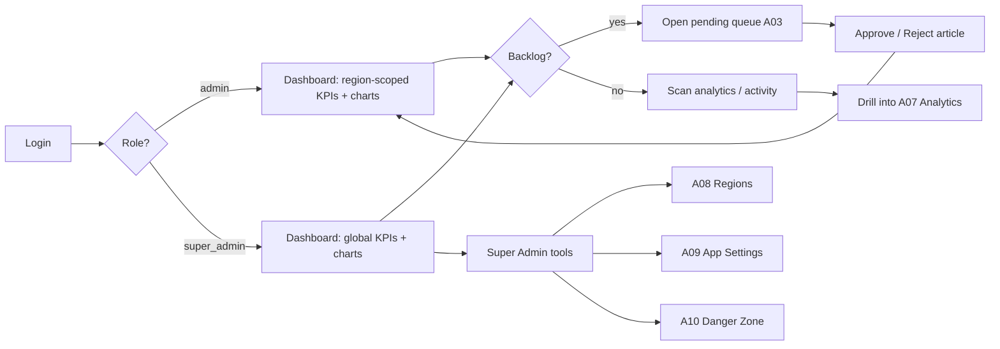

# A02 — Admin Dashboard

## Metadata

| Field | Value |
|---|---|
| Page ID | A02 |
| Platforms | Admin console (Web; desktop-first, tablet-responsive) |
| Roles | Admin (region-scoped KPIs), Super Admin (global KPIs + extra quick actions) |
| Priority | P1 |
| Route / Path | `/admin/dashboard` |
| Prototype | `prototypes/pages/a02-admin-dashboard.html` |

## Purpose

The command center of the NewsWatch admin console. It gives staff an
at-a-glance operational picture — content volume, pending moderation backlog,
publishing velocity, audience reach, and reporter/user activity — plus one-click
shortcuts into the pending review queue and the most common quick actions. It
surfaces trends through charts so admins can spot spikes or drops and drill into
the relevant management page. Data is **region-scoped**: an `admin` sees only
KPIs, charts, and feeds for their assigned regions and descendants
(REQ-REG-003). A `super_admin` sees **global** KPIs across all regions plus
extra quick actions into the super-admin tools (Region Management `A08`, App
Settings `A09`, Danger Zone `A10`).

## UI Structure

### Desktop (primary)

- **Persistent left sidebar** (240px, `--white`, right border `--border`):
  logo row, nav items (Dashboard active with `--purple-light` fill and `--purple`
  text, Moderation, Categories, Users, Reporter Approvals, Analytics, Settings),
  each with an icon + label; bottom block shows signed-in user with role chip.
- **Super Admin section (conditional):** when `authStore.role === "super_admin"`,
  a separated nav group labelled "Super Admin" appears below a divider with
  items: Region Management (`A08`), App Settings (`A09`), Danger Zone (`A10`),
  each with icon + label and a `--purple-dark` accent. The group is completely
  hidden for `admin`.
- **Region scope indicator (top bar, left of search):** an "All regions" pill
  (`--purple-light` fill) for `super_admin`; for `admin`, one chip per assigned
  region (`--purple-light`, region icon + name) with a "+N" overflow chip and a
  tooltip listing full scope. Clicking opens a popover that explains scope
  ("You see content for these regions and their sub-regions").
- **Top bar** (`header-height-web`, `--white`, bottom border `--border`):
  page title "Dashboard", global search (`search-width`, `search-height`),
  time-range select (Today / 7d / 30d / Custom), notification bell with unread
  badge (`--error`), user avatar menu. For `super_admin` an optional
  region-filter select (All regions / specific region — filters the whole
  dashboard) is shown next to the scope indicator.
- **KPI card row:** 6 responsive cards (`--white`, `radius-lg`, `shadow-card`,
  padding `space-5`). Each card = label (`--muted`, `font-size-meta`), big value
  (`font-size-title`, `weight-extrabold`, `--text`), delta chip vs previous
  period (`--success` up / `--error` down), and a small sparkline. Cards:
  1. Total Articles — all-time count.
  2. Pending Review — count with `--warning` accent and "Review now" link.
  3. Published Today — count with `--success` accent.
  4. Active Reporters — reporters with ≥1 submission in period.
  5. Total Users — all registered users.
  6. Total Views — article views in the selected period.
- **Charts region (2-column grid):**
  - **Views over time** (line/area chart, spans 2/3 width): x = date, y = views;
    hover crosshair + tooltip; legend for Views vs Unique readers.
  - **Top categories** (horizontal bar chart, 1/3 width): top 5 categories by
    views, bars `--purple`, label + count.
  - **Article status breakdown** (donut): Published / Pending / Rejected / Draft
    using `--success`, `--warning`, `--error`, `--muted`.
- **Bottom region (2-column):**
  - **Recent activity feed:** chronological list (last 20) of moderation events,
    reporter approvals, role changes — actor, action, target, relative time.
  - **Pending review queue shortcut:** compact table of the 5 oldest pending
    articles with title, reporter, category, submitted time, & "Review" button.
- **Quick actions bar:** sticky row of buttons — "New Category",
  "Review Queue", "Pending Reporters", "Invite Admin", "Export Report".
  For `super_admin`, three additional actions appear — "Manage Regions" (`A08`),
  "App Settings" (`A09`), "Danger Zone" (`A10`) — each opening the respective
  page.

### Tablet / Narrow laptop (769–1024px)

- Sidebar collapses to icon-only rail (64px) with tooltips; nav labels hidden.
- KPI grid drops from 6 columns to 3; charts stack vertically (views chart
  full-width, then a 2-up for categories + status donut).

### Responsive behavior

| Breakpoint | Behavior |
|---|---|
| `desktop` ≥1280px | Full 6-up KPI row; sidebar expanded; 2-col charts. |
| `tablet` 769–1279px | KPI 3-up; sidebar icon rail; charts stack. |
| `mobile` 0–768px | Sidebar becomes a bottom sheet/drawer (`z-drawer`); KPI single column; charts stacked; advisory "best on desktop". |

## Features / Functional Requirements

| ID | Requirement | Priority |
|---|---|---|
| REQ-ADM-015 | The dashboard MUST display KPI cards for total articles, pending review, published today, active reporters, total users, and total views. | P0 |
| REQ-ADM-016 | KPI values MUST reflect the selected time range and MUST show a delta vs the previous equivalent period. | P0 |
| REQ-ADM-017 | The dashboard MUST render a "views over time" chart and a "top categories" chart. | P0 |
| REQ-ADM-018 | The dashboard MUST render an article status breakdown (published/pending/rejected/draft). | P1 |
| REQ-ADM-019 | The dashboard MUST show a recent activity feed with actor, action, and target. | P1 |
| REQ-ADM-020 | The dashboard MUST provide a shortcut list of the oldest pending articles with a direct link to moderation. | P0 |
| REQ-ADM-021 | The "Pending Review" KPI MUST link to the moderation page pre-filtered to `status=pending`. | P0 |
| REQ-ADM-022 | The dashboard MUST offer quick actions: new category, open review queue, pending reporters, invite admin, export report. | P1 |
| REQ-ADM-023 | KPI and chart data MUST be scoped to the viewer's role and permissions. | P0 |
| REQ-ADM-024 | The dashboard MUST refresh automatically every 60s and support manual refresh. | P2 |
| REQ-ADM-025 | The time-range selector MUST support Today, Last 7 days, Last 30 days, and Custom. | P1 |
| REQ-ADM-026 | Time-range and chart selections MUST be reflected in the URL query for shareable deep links. | P2 |
| REQ-ADM-027 | Export Report MUST download CSV/PDF of the current dashboard view. | P2 |
| REQ-ADM-110 | The dashboard MUST display a region scope indicator showing the viewer's effective scope (assigned regions + descendants for `admin`; "All regions" for `super_admin`). | P0 |
| REQ-ADM-111 | All KPIs, charts, feeds, and exports MUST be region-scoped for `admin` and global for `super_admin` (REQ-REG-003, REQ-REG-007). | P0 |
| REQ-ADM-112 | The sidebar MUST show the Super Admin nav group (Region Management A08, App Settings A09, Danger Zone A10) only when the viewer's role is `super_admin`. | P0 |
| REQ-ADM-113 | The quick actions bar MUST include "Manage Regions", "App Settings", and "Danger Zone" actions for `super_admin` only. | P1 |
| REQ-ADM-114 | For `super_admin`, the dashboard MUST offer an optional region filter (All regions / specific region) that scopes all widgets. | P1 |

## User Interactions

- **KPI card hover:** lifts with `shadow-md`, cursor pointer where drillable.
- **KPI click:** navigates to the corresponding filtered page (e.g. Pending →
  `/admin/moderation?status=pending`).
- **Time-range change:** all cards and charts refetch; charts animate
  (`dur-slow`) to new values; range persists in URL.
- **Chart hover:** crosshair + tooltip with exact value and date; click a data
  point to open analytics filtered to that date/category.
- **Activity item click:** opens the related article/reporter/user detail.
- **Auto-refresh:** silent every 60s; a subtle "Updated 12s ago" timestamp with
  manual refresh icon; no layout shift.
- **Quick actions:** buttons open the relevant page or modal (e.g. Invite Admin
  opens a modal at `z-modal`).
- **Region scope indicator:** hovering a scope chip shows a tooltip with the full
  region path; clicking opens the scope popover (`dur-fast`). For `super_admin`,
  the region filter select updates all widgets and the URL (`?region=:id`).
- **Super Admin nav group:** appears only for `super_admin`; items route to
  `A08`, `A09`, `A10` respectively.
- **Skeleton → content transition:** fades in `dur-medium`.
- **Sidebar collapse toggle** persists preference in `localStorage`.

## Validation & Error States

| Field/Action | Rule | Error message |
|---|---|---|
| Custom range | Start ≤ end; max span 366 days | "Choose a valid date range (max 1 year)" |
| Custom range | Both dates required | "Select both a start and end date" |
| Chart fetch | Non-2xx response | Card shows "Couldn't load chart" + Retry |
| KPI fetch | Timeout/non-2xx | Card shows "—" with retry icon |
| Export | No data in range | "No data to export for this range" |
| Auto-refresh | Recurring failure | Persistent banner "Live updates paused" + Retry |
| Permission | Role lacks a widget | Widget hidden (not an error) |
| Region filter (`super_admin`) | Unknown/empty region | "Select a valid region" |
| Scope | `admin` with no assigned regions | Banner "No region assigned — contact a super admin"; KPIs render as empty |

## Loading, Empty, Success States

- **Loading:** KPI cards show shimmer blocks for value and delta; charts show a
  centered spinner over an empty grid; activity feed shows 5 skeleton rows.
- **Empty:** "No activity yet" illustration in the feed; pending shortcut shows
  "All caught up — no articles awaiting review" with `--success` check icon;
  charts show "No data for this period".
- **Success:** populated grid fades in; toast `--success` "Dashboard updated"
  after a manual refresh; export triggers a file download with toast
  "Report downloaded".
- **Scope-blocked:** if an `admin` has no assigned region, widgets render empty
  with the scope banner rather than a global fallback (never leaks cross-region
  data).

## User Flow

1. Admin or super_admin signs in at `A01` and lands on `/admin/dashboard`.
2. Dashboard loads KPIs and charts for the default range (Last 7 days), scoped
   to the viewer's region scope (`admin`) or globally (`super_admin`).
3. Admin scans the pending-review KPI or the pending shortcut table, checking
   the region scope indicator.
4. Admin clicks a pending article or "Review Queue" quick action.
5. System navigates to `A03 Article Moderation` filtered to pending.
6. Admin returns to the dashboard after acting, or uses quick actions for other
   tasks (categories, reporters, users).



## Dependencies

- **Screens:** `A01 Admin Login`, `A03 Article Moderation`, `A04 Category
  Management`, `A05 User Management`, `A06 Reporter Approvals`, `A07 Analytics`,
  `A08 Region Management`, `A09 App Settings`, `A10 Danger Zone`,
  `S02 Navigation Shell`.
- **Components:** Sidebar, TopBar, ScopeIndicator, RegionFilter, KpiCard,
  LineChart, BarChart, DonutChart, ActivityFeed, PendingTable, QuickActions,
  DateRangePicker, Toast, Modal.
- **Services/stores:** `dashboardStore` (stats, range), `analyticsService`,
  `activityService`, `authStore` (role), `scopeStore` (admin region scope),
  polling service.
- **Backend endpoints:** see table below.

## API / Data Requirements

| Method | Endpoint | Purpose |
|---|---|---|
| GET | `/api/v1/admin/dashboard/stats?range=7d&region=` | KPI values + deltas (region-scoped). |
| GET | `/api/v1/admin/dashboard/views?range=7d&interval=day&region=` | Time-series view/unique data. |
| GET | `/api/v1/admin/dashboard/top-categories?range=7d&limit=5&region=` | Top categories by views. |
| GET | `/api/v1/admin/dashboard/status-breakdown?region=` | Article status counts. |
| GET | `/api/v1/admin/dashboard/activity?limit=20&region=` | Recent audit/activity feed. |
| GET | `/api/v1/admin/dashboard/pending?limit=5&sort=oldest&region=` | Oldest pending articles. |
| GET | `/api/v1/admin/dashboard/scope` | Viewer's effective region scope (assigned + descendants; `isGlobal` for super_admin). |
| POST | `/api/v1/admin/dashboard/export` | Generate CSV/PDF export. |
| POST | `/api/v1/admin/users/invite` | Invite a new admin (quick action). |

> All dashboard endpoints resolve scope server-side: requests from an `admin`
> are automatically filtered to their assigned regions and descendants; a
> `super_admin` may pass `region=` to narrow globally (REQ-REG-003/007).

**Response — stats**

```json
{
  "success": true,
  "data": {
    "totalArticles": 12840,
    "pendingReview": 37,
    "publishedToday": 142,
    "activeReporters": 86,
    "totalUsers": 248900,
    "totalViews": 1352000,
    "deltas": { "pendingReview": 0.12, "publishedToday": -0.04 }
  },
  "meta": { "range": "7d", "generatedAt": "2026-09-22T10:15:00Z" },
  "error": null
}
```

**Response — views series**

```json
{
  "success": true,
  "data": { "series": [ { "date": "2026-09-16", "views": 182300, "uniques": 99120 } ] },
  "meta": {}, "error": null
}
```

## Navigation

| Action | From | To |
|---|---|---|
| Open review queue | KPI / quick action / pending row | `/admin/moderation?status=pending` (A03) |
| Manage categories | Sidebar / quick action | `/admin/categories` (A04) |
| Manage users | Sidebar | `/admin/users` (A05) |
| Reporter approvals | Sidebar / KPI | `/admin/reporter-approvals` (A06) |
| Analytics | Sidebar / chart drilldown | `/admin/analytics` (A07) |
| Region Management (super_admin) | Sidebar / quick action | `/admin/regions` (A08) |
| App Settings (super_admin) | Sidebar / quick action | `/admin/settings/contacts` (A09) |
| Danger Zone (super_admin) | Sidebar / quick action | `/admin/danger-zone` (A10) |
| Open activity target | Activity feed item | article/reporter/user detail |
| Sign out | Avatar menu | `/admin/login` (A01) |

## Analytics Events

| Event | Trigger | Properties |
|---|---|---|
| `admin_dashboard_viewed` | Page mount | `role`, `range`, `scopeCount` |
| `admin_dashboard_range_changed` | Range selector change | `range`, `custom` |
| `admin_kpi_clicked` | KPI card click | `kpi`, `value` |
| `admin_chart_drilled` | Chart point click | `chart`, `date`, `category` |
| `admin_quick_action_clicked` | Quick action click | `action` |
| `admin_dashboard_refreshed` | Manual refresh | `mode: "manual"` |
| `admin_dashboard_exported` | Export action | `format`, `range` |
| `admin_dashboard_auto_refresh_failed` | Polling error | `code` |
| `admin_scope_indicator_viewed` | Scope popover open | `isGlobal`, `regionCount` |
| `admin_region_filter_changed` | Super-admin region filter | `regionId` |
| `admin_super_nav_clicked` | Super Admin nav item | `target` |

## Open Questions

- Which KPIs are P0 for launch vs deferred (e.g. total users may be P1)?
- Should charts support comparison against the previous period overlay?
- Auto-refresh interval: is 60s appropriate, or should it be user-configurable?
- Is a realtime WebSocket feed desired for pending count instead of polling?
- Which export format is primary — CSV, XLSX, or PDF?
- Should the super_admin region filter persist across sessions and other pages?
- When an `admin` has multiple scopes, should KPIs aggregate all of them or allow
  per-region slicing on the dashboard?
