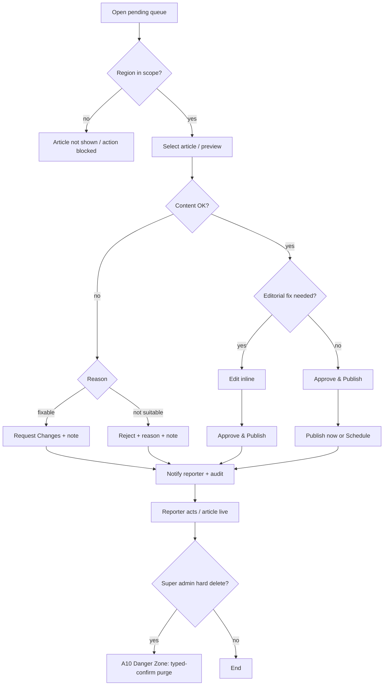

# A03 — Article Moderation

## Metadata

| Field | Value |
|---|---|
| Page ID | A03 |
| Platforms | Admin console (Web; desktop-first, tablet-responsive) |
| Roles | Admin (region-scoped moderation), Super Admin (global + hard delete) |
| Priority | P1 |
| Route / Path | `/admin/moderation` |
| Prototype | `prototypes/pages/a03-article-moderation.html` |

## Purpose

The editorial control room where staff review reporter-submitted articles and
decide their fate: publish immediately, schedule a publish time, reject with a
mandatory reason, or send back for changes. It centralizes the review queue,
inline editing for light fixes, bulk operations for high-volume periods, and a
complete audit trail. Moderation is **region-scoped**: an `admin` may only act
on articles whose `region_id` is in their assigned scope or is a descendant of
it (REQ-REG-003); a `super_admin` sees and acts on all regions. Every decision
notifies the reporter and is recorded so that content provenance and editorial
accountability are preserved. Only a `super_admin` can **hard-delete** an
article from this page (REQ-DEL-004); that destructive tool lives in
`A10 Danger Zone`.

## UI Structure

### Desktop (primary)

- **Persistent sidebar + top bar** (see `A02`), with "Moderation" active.
- **Region scope bar (sticky, `--purple-light` tint):** shows the viewer's
  effective scope — an `admin` sees one chip per assigned region (with "+N"
  overflow and descendant note); a `super_admin` sees an "All regions" pill plus
  an optional region filter select. Explains "You see articles for these regions
  and their sub-regions" (REQ-REG-003).
- **Filter bar** (sticky under top bar, `--white`, bottom border `--border`):
  - Status tabs: All / Pending / Scheduled / Published / Rejected / Changes
    requested, each with a count badge (pending badge `--warning`).
  - **Region filter** (cascading State → District → Constituency → Mandal
    selects): available to `super_admin`; for `admin` the options are restricted
    to their in-scope regions and disabled outside scope (`--muted`).
  - Category multi-select dropdown.
  - Reporter search input (typeahead).
  - Date-range picker (submitted between).
  - Sort select: Submitted (newest/oldest), Priority, Category.
  - Secondary actions: "Refresh", "Columns" chooser, "Export CSV".
- **Bulk action bar** (appears when ≥1 row selected, `--purple-light` fill,
  `--purple-tint-border`): "N selected", Approve & Publish, Schedule, Reject,
  Request Changes, Clear selection.
- **Queue table** (virtualized, `--white`, `radius-lg`, `shadow-card`):
  - Header checkbox for select-all-on-page.
  - Columns: checkbox · Title (truncated, 2 lines max) · Reporter (avatar +
    name) · Category chip · **Region** (breadcrumb, e.g. Telangana › Hyderabad ›
    Secunderabad) · Submitted (relative + exact tooltip) · Status badge ·
    Word count · Actions (⋯ menu).
  - Row hover highlights `--purple-light`; clicking the title opens the preview
    drawer; clicking elsewhere selects/opens as configured.
  - Status badges: `--warning` pending, `--success` published, `--error`
    rejected, `--info` scheduled, `--muted` changes requested.
  - Sticky table header; zebra rows optional; pagination footer with
    "Rows per page" and cursor-based next/prev.
- **Article preview drawer/panel** (slides from right, 60% width, `z-drawer`):
  - Header: title, reporter, category, submitted time, status badge, close.
  - Tabs: **Preview** (rendered article with hero image, meta, body), **Details**
    (metadata, tags, word count, image count), **History** (audit log entries),
    **Comments** (internal editorial notes).
  - Footer action bar: Approve & Publish, Schedule, Reject, Request Changes,
    Edit inline, Open full editor. For `super_admin` only, an additional
    destructive "Hard delete" action (`--error`) is shown, which links to the
    typed-confirmation tool in `A10 Danger Zone` (REQ-DEL-004).
- **Reject modal** (`z-modal`): reason dropdown (required) — Inaccurate,
  Off-topic, Duplicate, Poor quality, Policy violation, Other — plus a required
  free-text note (min 15 chars) sent to the reporter.
- **Schedule modal:** date + time picker (min = now + 5 min), timezone shown,
  optional "add to Breaking" toggle.
- **Inline edit:** opens the article body in a rich-text editor overlay; saving
  records an audit entry and keeps status unchanged unless the moderator also
  approves.
- **Toasts** (`z-toast`) confirm every action.

### Tablet / Narrow laptop (769–1024px)

- Filter bar wraps to two rows; some filters collapse into a "Filters" popover.
- Preview drawer becomes full-width modal-style overlay.
- Table hides Word count and reduces title to one line; horizontal scroll enabled.

### Responsive behavior

| Breakpoint | Behavior |
|---|---|
| `desktop` ≥1025px | Full filter bar, drawer at 60%, all columns. |
| `tablet` 769–1024px | Wrapped filters, full-width preview, reduced columns. |
| `mobile` 0–768px | Unsupported for moderation; read-only advisory. Table scrolls horizontally. |

## Features / Functional Requirements

| ID | Requirement | Priority |
|---|---|---|
| REQ-ADM-028 | The moderation page MUST list submitted articles with title, reporter, category, region, submitted time, and status. | P0 |
| REQ-ADM-029 | The queue MUST support filtering by status, region, category, reporter, and submitted date range. | P0 |
| REQ-ADM-030 | The queue MUST support sorting by submitted time, priority, and category. | P1 |
| REQ-ADM-031 | The table MUST support row selection, select-all-on-page, and a bulk action bar. | P0 |
| REQ-ADM-032 | Bulk actions MUST support approve & publish, schedule, reject, and request changes for all selected rows. | P0 |
| REQ-ADM-033 | Clicking an article MUST open a preview drawer showing the rendered article. | P0 |
| REQ-ADM-034 | Approve & Publish MUST transition the article to `published` and make it visible to readers immediately. | P0 |
| REQ-ADM-035 | The system MUST allow scheduling a publish date/time at least 5 minutes in the future. | P1 |
| REQ-ADM-036 | Reject MUST require a reason category and a free-text note (min 15 chars); the reporter MUST be notified. | P0 |
| REQ-ADM-037 | Request Changes MUST send the article back to the reporter as `changes_requested` with a required note. | P0 |
| REQ-ADM-038 | Moderators MUST be able to edit article content inline; every edit MUST create an audit entry. | P1 |
| REQ-ADM-039 | Every moderation decision MUST push a notification to the reporter (in-app + FCM) and send an email digest for rejections. | P0 |
| REQ-ADM-040 | Every action MUST be recorded in an immutable audit log capturing actor, action, timestamp, and reason. | P0 |
| REQ-ADM-041 | Bulk publish MUST validate all selected articles and report per-item failures without aborting the batch. | P1 |
| REQ-ADM-042 | The system MUST prevent publishing an article with no hero image or empty body. | P0 |
| REQ-ADM-043 | Only roles with the `publish` permission (admin/editor) MAY publish; moderators MAY only reject/flag. | P0 |
| REQ-ADM-044 | The preview MUST show internal editorial notes and full history. | P2 |
| REQ-ADM-045 | The page MUST support keyboard shortcuts (J/K navigate, A approve, R reject, X select). | P2 |
| REQ-ADM-115 | The queue MUST be region-scoped: an `admin` sees only articles whose `region_id` is in their scope or a descendant; a `super_admin` sees all regions (REQ-REG-003, REQ-REG-004). | P0 |
| REQ-ADM-116 | The page MUST display a region scope indicator and offer a cascading region filter (State → District → Constituency → Mandal) restricted to the viewer's scope. | P0 |
| REQ-ADM-117 | Every publish/reject/request-changes/schedule action MUST be re-validated server-side against the actor's region scope (REQ-REG-004). | P0 |
| REQ-ADM-118 | Only a `super_admin` MAY hard-delete an article; the queue MUST expose a super_admin-only hard-delete entry point linking to `A10 Danger Zone` (REQ-DEL-004). | P1 |
| REQ-ADM-119 | Admins MAY soft-delete (unpublish) articles within scope, but MUST NOT physically remove any article row. | P0 |

## User Interactions

- **Row click:** opens preview drawer (fade/slide `dur-slow`).
- **Checkbox click / Shift+click:** range-selects rows; header checkbox toggles
  the visible page.
- **Bulk bar:** slides down `dur-medium`; buttons show per-item progress and turn
  into success/partial-failure summaries.
- **Approve & Publish:** optimistic status badge change to `--success`; toast
  "Article published"; row leaves the pending filter.
- **Reject:** opens modal; submit disabled until reason + note valid; on success
  row badge becomes `--error` and a notification is queued.
- **Schedule:** opens date/time picker with validation; on success badge becomes
  `--info` and a countdown label appears.
- **Request changes:** modal with note; badge becomes `--muted`.
- **Inline edit:** editor overlay; unsaved-changes warning on close.
- **Keyboard:** J/K move row focus, A/R/X shortcuts, Esc closes drawer/modals.
- **Drag to select text** in preview works; images open in a lightbox.
- **Animations:** drawer `dur-slow`, modals `dur-medium`, toast auto-dismiss 4s.

## Validation & Error States

| Field/Action | Rule | Error message |
|---|---|---|
| Reject reason | Required, from list | "Select a rejection reason" |
| Reject note | Required, ≥15 chars | "Add a note (at least 15 characters) for the reporter" |
| Schedule time | ≥ now + 5 min, valid date | "Choose a time at least 5 minutes from now" |
| Schedule time | Within 1 year | "Schedule date can't be more than 1 year ahead" |
| Publish | Hero image present | "Add a hero image before publishing" |
| Publish | Body ≥ 50 words | "Article body is too short to publish" |
| Bulk action | ≥1 row selected | "Select at least one article" |
| Bulk partial failure | Some items invalid | "3 of 10 published; 7 failed — view details" |
| Permission | Role lacks publish | "Your role can't publish articles" |
| Region scope | Article outside actor's scope | "This article is outside your assigned regions" |
| Region filter (`admin`) | Region not in scope | "You can only filter regions within your scope" |
| Hard delete | Actor not `super_admin` | "Only a super admin can permanently delete articles" |
| Network | Request fails | "Action failed. Retry" with per-row retry |

## Loading, Empty, Success States

- **Loading:** table skeleton (8 shimmer rows with column placeholders); preview
  drawer shows article skeleton; bulk actions disabled.
- **Empty:** "No articles in this queue" illustration; if filtered, "No results
  match your filters" with "Clear filters" CTA; pending-all-clear shows
  "All caught up" with `--success` checkmark. An `admin` with no assigned region
  sees "No region assigned — contact a super admin".
- **Success:** toast (`--success`) "Article published" / "Changes requested" /
  "Article scheduled for {time}"; reporter notification queued toast
  (`--info`) "Reporter notified"; row badge updates without full reload.

## User Flow

1. Admin opens Moderation (from `A02` KPI or sidebar), defaulting to `Pending`;
   the queue is pre-scoped to their regions (or all regions for `super_admin`).
2. Admin filters by region/category/reporter and opens an article preview.
3. Admin reviews content, then either:
   - **Approve** → article published immediately; reporter notified.
   - **Schedule** → pick future time; article queued; reporter notified.
   - **Reject** → choose reason + note; reporter notified; audit logged.
   - **Request Changes** → add note; article returns to reporter.
   - **Edit inline** → fix content, then approve.
4. System records the audit entry and updates the queue. Every action is
   re-validated against the actor's region scope server-side (REQ-REG-004).
5. Admin handles multiple items via bulk actions.
6. Reporter receives the notification and acts (republish/edit).
7. A `super_admin` may hard-delete an offending article from `A10 Danger Zone`
   (typed confirmation required); the row and dependents are physically removed
   (REQ-DEL-004).



## Dependencies

- **Screens:** `A02 Admin Dashboard`, `R02 Article Composer` (full editor),
  `R03 My Articles` (reporter status), `P09 Article Detail` (reader view),
  `A07 Analytics`, `A08 Region Management`, `A10 Danger Zone` (hard delete).
- **Components:** DataTable, BulkActionBar, FilterBar, RegionFilter, ScopeBar,
  StatusBadge, PreviewDrawer, RichTextEditor, DatePicker, Modal, Toast,
  ConfirmDialog, Lightbox.
- **Services/stores:** `moderationStore` (queue, selection, filters),
  `articleService`, `notificationService`, `auditService`, `permissionService`,
  `scopeStore` (region scope).
- **Backend endpoints:** see table below.

## API / Data Requirements

| Method | Endpoint | Purpose |
|---|---|---|
| GET | `/api/v1/admin/articles?status=pending&region=&...` | Paginated moderation queue (region-scoped). |
| GET | `/api/v1/admin/articles/:id` | Full article detail for preview. |
| PATCH | `/api/v1/admin/articles/:id/publish` | Publish immediately (scope-checked). |
| PATCH | `/api/v1/admin/articles/:id/schedule` | Schedule publish time. |
| PATCH | `/api/v1/admin/articles/:id/reject` | Reject with reason + note. |
| PATCH | `/api/v1/admin/articles/:id/request-changes` | Send back with note. |
| PATCH | `/api/v1/admin/articles/:id` | Inline edit content. |
| PATCH | `/api/v1/admin/articles/:id/unpublish` | Soft unpublish (admin, in scope). |
| POST | `/api/v1/admin/articles/bulk` | Bulk action across IDs (per-item scope check). |
| GET | `/api/v1/admin/articles/:id/history` | Audit/history entries. |
| POST | `/api/v1/admin/articles/:id/notes` | Add internal editorial note. |
| DELETE | `/api/v1/admin/articles/:id/hard` | Hard delete — `super_admin` only (REQ-DEL-004); UI entry point in A10. |

> Region-bound mutations resolve scope server-side; an out-of-scope request
> returns `403 OUT_OF_SCOPE` regardless of the client filter (REQ-REG-004).

**Request — reject**

```json
{
  "reason": "inaccurate",
  "note": "Sources conflict with the official statement; please re-verify.",
  "notifyReporter": true
}
```

**Response — bulk**

```json
{
  "success": true,
  "data": {
    "succeeded": ["uuid-1", "uuid-2"],
    "failed": [ { "id": "uuid-3", "code": "MISSING_HERO_IMAGE", "message": "No hero image" } ]
  },
  "meta": { "requested": 3, "successCount": 2, "failureCount": 1 },
  "error": null
}
```

**Error — validation**

```json
{ "success": false, "data": null, "error": { "code": "VALIDATION_ERROR", "message": "Rejection note required", "fields": { "note": "required" } } }
```

**Error — out of region scope**

```json
{ "success": false, "data": null, "error": { "code": "OUT_OF_SCOPE", "message": "This article is outside your assigned regions", "fields": {} } }
```

**Error — hard delete by non-super-admin**

```json
{ "success": false, "data": null, "error": { "code": "FORBIDDEN", "message": "Only a super admin can permanently delete articles", "fields": {} } }
```

## Navigation

| Action | From | To |
|---|---|---|
| Open preview | Queue row | same page (drawer) |
| Open full editor | Preview footer | `/admin/articles/:id/edit` (R02) |
| View as reader | Preview | `/news/:slug` (P09) |
| View reporter | Reporter name | `/admin/users/:id` (A05) |
| View history | Preview tab | same page (tab) |
| Back to dashboard | Breadcrumb | `/admin/dashboard` (A02) |
| Analytics | Sidebar | `/admin/analytics` (A07) |
| Manage regions | Scope bar / sidebar (super_admin) | `/admin/regions` (A08) |
| Hard delete article | Preview footer (super_admin) | `/admin/danger-zone?article=:id` (A10) |

## Analytics Events

| Event | Trigger | Properties |
|---|---|---|
| `moderation_queue_viewed` | Page mount | `status`, `filters`, `count` |
| `moderation_filter_applied` | Filter change | `filter`, `value` |
| `moderation_article_opened` | Preview open | `articleId`, `status`, `ageHours` |
| `moderation_approved` | Approve action | `articleId`, `bulk`, `editedInline` |
| `moderation_scheduled` | Schedule action | `articleId`, `publishAt` |
| `moderation_rejected` | Reject action | `articleId`, `reason` |
| `moderation_changes_requested` | Request changes | `articleId` |
| `moderation_inline_edited` | Inline save | `articleId`, `fieldsChanged` |
| `moderation_bulk_action` | Bulk action | `action`, `count`, `successCount`, `failureCount` |
| `moderation_bulk_partial_failure` | Partial failure | `action`, `failedCount` |
| `moderation_region_filter_applied` | Region filter change | `regionId`, `level` |
| `moderation_out_of_scope_blocked` | Scope rejection | `articleId`, `code` |
| `moderation_hard_delete_opened` | Super-admin hard-delete link | `articleId` |

## Open Questions

- Can moderators publish, or is publish strictly admin/editor?
- Should editors be able to reject, or is rejection admin-only?
- Is a two-person approval required for "Breaking" articles?
- Should scheduled articles auto-unpublish, and can they be pre-approved by two roles?
- Do we need diff view for inline edits?
- What is the SLA/aging indicator — highlight articles pending > 24h?
- Should an `admin` scoped to a parent region also get a roll-up view of child
  regions in the queue?
- Should the hard-delete entry point be inline (modal) or always delegated to
  `A10 Danger Zone`?
- Should the region filter default to the admin's narrowest scope for speed?
