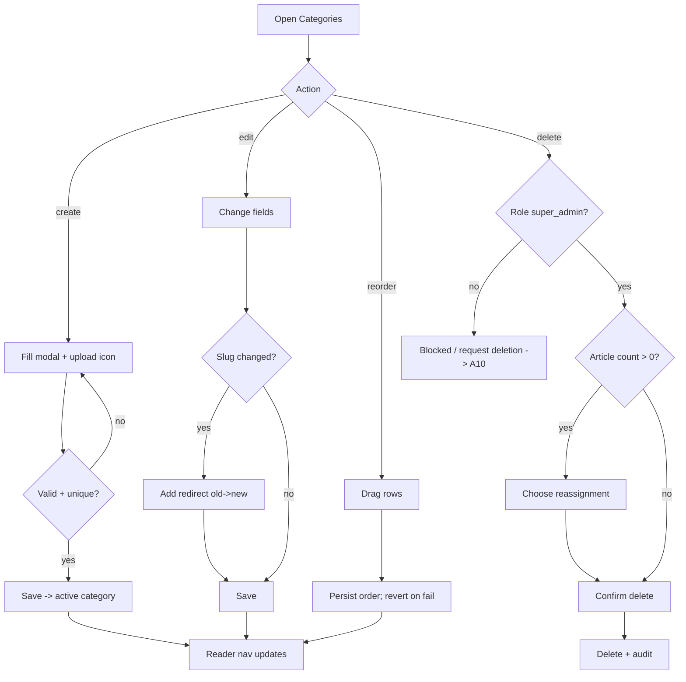

# A04 — Category Management

## Metadata

| Field | Value |
|---|---|
| Page ID | A04 |
| Platforms | Admin console (Web; desktop-first, tablet-responsive) |
| Roles | Admin (create/edit/reorder; destructive actions guarded), Super Admin (global, destructive allowed) |
| Priority | P1 |
| Route / Path | `/admin/categories` |
| Prototype | `prototypes/pages/a04-category-management.html` |

## Purpose

Manage the topic taxonomy that organizes all NewsWatch content and drives
reader navigation. Staff create, edit, reorder, activate/deactivate, and delete
categories, and can see how many articles each category holds. Deletion is
guarded by reassignment rules so no article is ever orphaned.

**Categories are global.** Unlike articles, users, and regions, the taxonomy is
not region-scoped: a category is shared across every region (region scoping is
not applied to categories unless explicitly documented otherwise). An `admin`
manages categories within their permission; destructive actions (delete,
deactivate, duplicate-overwrite) are guarded and reserved for `super_admin`
(`REQ-REG-007`). The ordering set here defines the display order of the
Categories page (`P10`) on mobile and web.

## UI Structure

### Desktop (primary)

- **Persistent sidebar + top bar** (see `A02`), with "Categories" active.
- **Page header:** title "Categories", subtitle with total count and active
  count, a "Global taxonomy" badge (`--info`, tooltip "Categories apply to all
  regions"), and primary button "New Category" (`--purple`). Destructive row
  actions show a lock affordance (`--muted`) for non-super-admin users.
- **Toolbar:** search input (name/slug), status filter (All / Active / Inactive),
  sort (Custom order / Name / Article count / Updated), "Export CSV".
- **Category list (two modes):**
  1. **Drag-and-drop reorder list (default):** vertical rows (`--white`,
     `radius-lg`, `shadow-card`, padding `space-4`) each with:
     - Drag handle (`⋮⋮`, cursor grab) — `--muted`.
     - Icon/image thumbnail (`48×48`, `radius-md`) or placeholder.
     - Name (`weight-semibold`, `--text`) and slug (`--muted`, mono, 13px).
     - Description (single line, truncated, `--muted-strong`).
     - Article count chip (`--purple-light` / `--purple`).
     - Active toggle switch (on `--success`, off `--muted`).
     - Row actions: Edit, Duplicate, Delete (⋯ menu; Delete `--error`).
  2. **Table mode (toggle):** columns — drag handle · Name · Slug · Icon ·
     Articles · Order · Status · Updated · Actions. Sortable headers; sticky.
- **Create / Edit modal** (`z-modal`, max-width 560px):
  - Name (required, 2–40 chars).
  - Slug (auto-generated from name, editable; lowercase, hyphenated, unique).
  - Description (optional, ≤160 chars).
  - Icon / image upload (drag-drop or picker; recommended 128×128 PNG/SVG,
    max 1 MB) with live preview and Remove.
  - Display order (number input; or set by drag in list mode).
  - Active toggle (default on).
  - Optional: color accent picker (defaults to `--purple`).
  - Footer: Cancel (secondary), Save (primary; disabled until valid).
- **Delete confirmation modal** (`z-modal`, `super_admin` only): shows article
  count; requires the user to choose a reassignment target category (or "Move to
  Uncategorized") when the count > 0; typed confirmation of the category name
  when count > 50; Delete button (`--error`). For `admin`, the Delete action is
  replaced with a "Request deletion" link that routes to `A10 Danger Zone`
  (or is hidden, per §Open Questions).
- **Toasts** (`z-toast`) for every mutation.

### Tablet / Narrow laptop (769–1024px)

- List mode preferred; drag handle remains functional via long-press.
- Edit modal becomes a full-width panel; description field grows.
- Table mode switches to horizontal scroll.

### Responsive behavior

| Breakpoint | Behavior |
|---|---|
| `desktop` ≥1025px | Two-column: reorder list left (60%), detail/preview right (40%) optional. |
| `tablet` 769–1024px | Single column; modal full-width. |
| `mobile` 0–768px | Management unsupported; read-only list with "manage on desktop" notice. |

## Features / Functional Requirements

| ID | Requirement | Priority |
|---|---|---|
| REQ-ADM-046 | The page MUST list all categories with name, slug, icon, article count, order, and active status. | P0 |
| REQ-ADM-047 | Staff MUST be able to create a category with name, slug, description, icon/image, order, and active flag. | P0 |
| REQ-ADM-048 | Slugs MUST be auto-generated from the name, editable, lowercase, hyphenated, max 60 chars, and unique. | P0 |
| REQ-ADM-049 | Category names MUST be unique (case-insensitive). | P0 |
| REQ-ADM-050 | The list MUST support drag-and-drop reordering that persists display order. | P1 |
| REQ-ADM-051 | Each category MUST show its article count. | P0 |
| REQ-ADM-052 | Deactivating a category MUST hide it from reader navigation and category listings without deleting content. | P0 |
| REQ-ADM-053 | Deleting a category with articles MUST require reassigning those articles to another category (or Uncategorized). | P0 |
| REQ-ADM-054 | Deleting a category with >50 articles MUST require typed name confirmation. | P1 |
| REQ-ADM-055 | Editing a category MUST NOT break existing article associations or URLs (slug change adds a redirect). | P1 |
| REQ-ADM-056 | Icon/image upload MUST accept PNG/SVG/JPG ≤1 MB; an invalid type or size MUST be rejected client- and server-side. | P1 |
| REQ-ADM-057 | Reordering MUST be persisted atomically; a failed save MUST revert the UI. | P1 |
| REQ-ADM-058 | The toolbar MUST support search, status filter, and sort. | P1 |
| REQ-ADM-059 | All mutations MUST be recorded in the audit log. | P1 |
| REQ-ADM-060 | The system MUST prevent deleting the last remaining active category. | P1 |
| REQ-ADM-061 | Delete and deactivate actions MUST be restricted to users with the `category:delete` permission. | P1 |
| REQ-ADM-120 | Categories MUST be global (region-agnostic); the same taxonomy MUST apply across all regions unless a future doc states otherwise. | P0 |
| REQ-ADM-121 | Only a `super_admin` MAY permanently delete a category; an `admin` MUST NOT hard-delete a category (REQ-REG-007). | P0 |
| REQ-ADM-122 | The UI MUST hide or disable destructive category actions (delete, deactivate) for non-`super_admin` users and show a guard message on attempted force. | P1 |
| REQ-ADM-123 | All category mutations remain global in effect; mutations MUST be audited with actor and scope (REQ-DEL-005). | P1 |

## User Interactions

- **Drag reorder:** row lifts with `shadow-md`, drop placeholder (`--purple-light`
  dashed border); on drop, order saves optimistically and shows a toast; failure
  reverts with an error toast.
- **Toggle active:** switch animates `dur-fast`; optimistic update; toast
  "Category activated/deactivated"; readers reflect within 60s (cache TTL).
- **New/Edit:** modal fades in `dur-medium`; slug auto-fills from name until
  manually edited; character counters on description.
- **Duplicate:** clones a category with " (copy)" suffix, inactive by default.
- **Delete:** opens confirmation; reassignment dropdown appears when count > 0;
  typed confirmation appears when count > 50; delete disabled until resolved.
- **Search/filter:** debounced 250ms; list filters client-side for <200 items and
  server-side beyond.
- **Hover states:** row background `--purple-light` on hover; icon buttons show
  tooltips.
- **Keyboard:** Enter opens edit for focused row; Esc closes modals.

## Validation & Error States

| Field/Action | Rule | Error message |
|---|---|---|
| Name | Required, 2–40 chars, unique | "Enter a category name (2–40 characters)" / "A category with this name already exists" |
| Slug | Required, `^[a-z0-9]+(?:-[a-z0-9]+)*$`, unique | "Slug can only use lowercase letters, numbers, and hyphens" / "This slug is already in use" |
| Description | ≤160 chars | "Description must be 160 characters or fewer" |
| Icon | PNG/SVG/JPG, ≤1 MB | "Upload a PNG, SVG, or JPG under 1 MB" |
| Order | Integer ≥0 | "Enter a valid order number" |
| Delete (count >0) | Reassignment required | "Choose a category to move {n} articles to" |
| Delete (count >50) | Typed name match | "Type the category name to confirm deletion" |
| Delete (last active) | Blocked | "You can't delete the last active category" |
| Delete / destructive | Actor must be `super_admin` | "Only a super admin can delete categories" |
| Reorder save | Server failure | "Couldn't save the new order. Try again." |
| Network | Request fails | "Something went wrong. Retry" |

## Loading, Empty, Success States

- **Loading:** list shows 6 skeleton rows including thumbnail, text bars, toggle.
- **Empty:** "No categories yet" illustration + "Create your first category"
  button; filtered empty: "No categories match your filters" + Clear filters.
- **Success:** new/updated row appears with a brief `--purple-light` highlight
  (`dur-slow`); toast (`--success`) "Category created/updated/deleted"; reorder
  persists silently with toast "Order saved".

## User Flow

1. Admin opens Categories from the sidebar or dashboard quick action.
2. Admin clicks "New Category", fills the modal, uploads an icon, saves.
3. New category appears at the end of the list (or chosen order) and is active.
4. Admin drags categories to set the reader display order; order auto-saves.
5. To remove a category, admin opens Delete; if it has articles, picks a
   reassignment target; deletions are audited.
6. Changes propagate to reader Categories (`P10`) and listing (`P11`).



## Dependencies

- **Screens:** `A02 Admin Dashboard`, `P10 Categories`, `P11 Category Listing`,
  `A03 Article Moderation` (category filter source), `A07 Analytics`,
  `A10 Danger Zone` (super-admin destructive actions).
- **Components:** DataTable, ReorderList, ToggleSwitch, FileUploader, Modal,
  ConfirmDialog, Toast, EmptyState, StatusBadge, SearchInput, PermissionGuard.
- **Services/stores:** `categoryStore` (list, order, mutations),
  `uploadService`, `auditService`, `permissionService` (super_admin guard),
  `readerCacheInvalidator`.
- **Backend endpoints:** see table below.

## API / Data Requirements

| Method | Endpoint | Purpose |
|---|---|---|
| GET | `/api/v1/admin/categories?search=&status=&sort=` | List categories with counts. |
| POST | `/api/v1/admin/categories` | Create category. |
| GET | `/api/v1/admin/categories/:id` | Category detail. |
| PATCH | `/api/v1/admin/categories/:id` | Update fields. |
| PATCH | `/api/v1/admin/categories/order` | Persist reorder (array of IDs). |
| PATCH | `/api/v1/admin/categories/:id/status` | Activate/deactivate. |
| DELETE | `/api/v1/admin/categories/:id?reassignTo=` | Delete with reassignment (`super_admin` only). |
| POST | `/api/v1/admin/categories/:id/duplicate` | Duplicate category. |
| POST | `/api/v1/uploads/image` | Upload icon/image, returns URL. |

**Request — create**

```json
{ "name": "Technology", "slug": "technology", "description": "Gadgets, AI, and the web.", "iconUrl": "https://cdn/newswatch/tech.svg", "order": 4, "isActive": true }
```

**Response — list**

```json
{
  "success": true,
  "data": {
    "categories": [
      { "id": "uuid", "name": "India", "slug": "india", "iconUrl": "…", "articleCount": 3120, "order": 1, "isActive": true }
    ]
  },
  "meta": { "total": 12, "active": 11 },
  "error": null
}
```

**Error — duplicate**

```json
{ "success": false, "data": null, "error": { "code": "CONFLICT", "message": "Slug already in use", "fields": { "slug": "duplicate" } } }
```

**Error — destructive action by non-super-admin**

```json
{ "success": false, "data": null, "error": { "code": "FORBIDDEN", "message": "Only a super admin can delete categories", "fields": {} } }
```

## Navigation

| Action | From | To |
|---|---|---|
| Back to dashboard | Breadcrumb | `/admin/dashboard` (A02) |
| View category articles | Article count chip | `/admin/moderation?category=:id` (A03) |
| Preview in reader | Row preview | `P10` / `P11` (new tab) |
| Analytics | Sidebar | `/admin/analytics?category=:id` (A07) |
| Delete success | Modal | same page (list refreshed) |
| Danger Zone (super_admin) | Guarded delete / lock affordance | `/admin/danger-zone` (A10) |

## Analytics Events

| Event | Trigger | Properties |
|---|---|---|
| `admin_categories_viewed` | Page mount | `total`, `active` |
| `admin_category_created` | Create success | `categoryId`, `slug` |
| `admin_category_updated` | Update success | `categoryId`, `changedFields` |
| `admin_category_reordered` | Order saved | `fromIndex`, `toIndex` |
| `admin_category_status_toggled` | Toggle active | `categoryId`, `isActive` |
| `admin_category_delete_initiated` | Delete click | `categoryId`, `articleCount` |
| `admin_category_deleted` | Delete success | `categoryId`, `reassignTo`, `articleCount` |
| `admin_category_duplicated` | Duplicate | `sourceId`, `newId` |
| `admin_category_upload_failed` | Upload error | `reason` |
| `admin_category_destructive_blocked` | Non-super-admin delete attempt | `categoryId`, `role` |
| `admin_category_scope_note_viewed` | Global taxonomy tooltip open | `role` |

## Open Questions

- Is a "Uncategorized" category auto-created and protected from deletion?
- Should categories support nesting/subcategories in v1?
- Do we need a per-category featured image separate from the icon?
- Should deactivated categories still be visible to authors when composing?
- Is the color accent a real feature or deferred?
- Should `admin` be able to hard-delete categories at all, or must destructive
  taxonomy changes always route through `super_admin` / `A10`?
- Are categories truly global forever, or will region-specific categories be
  introduced later (which would require a scoping migration)?
