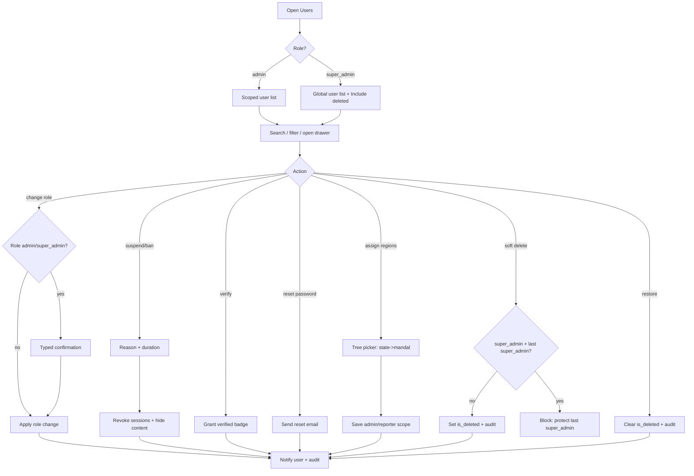

# A05 — User Management

## Metadata

| Field | Value |
|---|---|
| Page ID | A05 |
| Platforms | Admin console (Web; desktop-first, tablet-responsive) |
| Roles | Admin (region-scoped, users only), Super Admin (global) |
| Priority | P1 |
| Route / Path | `/admin/users` |
| Prototype | `prototypes/pages/a05-user-management.html` |

## Purpose

Central directory for managing every person on NewsWatch — `user`, `reporter`,
`admin`, and `super_admin`. Staff can search and filter the user base, inspect
profiles and activity, change roles, assign region scopes, verify reporters,
suspend/ban/activate accounts, reset passwords, and **soft-delete** accounts
with safeguards. All privileged actions are audited, and role changes are
strictly permission-gated to prevent accidental escalation.

The page follows the role and region model in
[`08-roles-regions-and-deletion.md`](../architecture/08-roles-regions-and-deletion.md):
an `admin` may act on `user` accounts in their own region scope and can never
affect a `super_admin`, another `admin` outside scope, or global settings
(REQ-REG-003/004). Only a `super_admin` may **soft-delete** a user
(REQ-DEL-001/002) and restore or purge them (see `A10 Danger Zone`). This page
is the operational tool for trust and safety and for promoting readers into
reporters and reporters into admins.

## UI Structure

### Desktop (primary)

- **Persistent sidebar + top bar** (see `A02`), with "Users" active.
- **Region scope bar:** mirrors `A02`/`A03` — an `admin` sees chips for their
  assigned regions ("You see users in these regions and their sub-regions"); a
  `super_admin` sees an "All regions" pill. The scope bar is informational here
  because region binding for users is via region scope assignment (§ below).
- **Toolbar:** search (name/email/id, debounced typeahead), Role filter
  (All / User / Reporter / Admin / Super Admin), Status filter
  (All / Active / Suspended / Banned / Unverified), Region filter (cascading,
  scope-restricted), **"Include deleted" toggle (super_admin only)**, "Verified
  reporters only" toggle, "Export CSV", and a "Filters" expander for joined-date
  and report-count ranges.
- **Users table** (virtualized, `--white`, `radius-lg`, `shadow-card`):
  - Header checkbox for select-all-on-page.
  - Columns: checkbox · User (avatar + name + email) · Role (chip with dropdown
    quick-change) · **Region Scopes** (chips, or "—" for global roles) · Status
    badge · Verified (badge) · Joined (relative) · Last active ·
    Articles/comments counts · Actions (⋯ menu).
  - Role chips: `user` `--muted`, `reporter` `--info`, `admin` `--purple`,
    `super_admin` `--purple-dark`.
  - Each role chip also shows a scope qualifier: `admin` → "Admin (scoped)",
    `super_admin` → "Super Admin (global)".
  - **Region scopes cell:** up to 2 region chips (e.g. "Telangana", "Secunderabad
    › Bowenpally") plus a "+N" overflow; a small edit (pencil) icon opens the
    region-scope editor. `super_admin` and `user` show "—" (global / none).
  - Status badges: Active `--success`, Suspended `--warning`, Banned `--error`,
    Unverified `--muted`; **Soft-deleted** rows show a `--error` "Deleted" badge
    with strikethrough name and a `deletedAt` tooltip (only visible when
    "Include deleted" is on).
  - Row hover `--purple-light`; clicking the user opens the profile drawer.
  - Pagination footer: cursor-based, rows-per-page, total count.
- **Bulk action bar** (on selection, `--purple-light`): Change Role, Assign
  Regions, Suspend, Activate, Export selected, Clear.
- **Profile drawer** (slides from right, 55%, `z-drawer`) with tabs:
  - **Overview:** avatar, name, email, role (with scope qualifier), status,
    joined, last active, bio, social links, verified badge, **region scopes
    summary**, and a soft-delete banner (`--error`) with `deletedAt/deletedBy`
    when applicable.
  - **Regions:** editable region-scope assignment (state/district/constituency/
    mandal multi-select tree) for `admin` and `reporter`; read-only "Global" note
    for `super_admin`.
  - **Activity:** recent articles (reporter), comments, likes, reports filed.
  - **Moderation history:** suspensions/bans/warnings with reasons and actors.
  - **Audit:** role changes, region-scope changes, and admin actions on this
    account.
  - Footer actions: Edit role, Assign Regions, Verify reporter,
    Suspend/Ban/Activate, Reset password, and — **for `super_admin` only** —
    Soft delete / Restore.
- **Role change modal:** radio/select of the four roles (`user`, `reporter`,
  `admin`, `super_admin`) with permission summary text; typed confirmation
  required when granting `admin` or `super_admin`; warning for self-demotion;
  `super_admin` grants are further restricted (REQ-DEL-007). Changing a role to
  `admin`/`reporter` reveals the region-scope assignment step.
- **Assign Regions modal/editor:** cascading tree picker (State → District →
  Constituency → Mandal) with checkboxes, search, and a "scope preview" listing
  the selected regions plus descendants. Used for both `admin` scopes
  (`admin_region_scopes`) and `reporter` scopes (`reporter_region_scopes`)
  (REQ-REG-002/003).
- **Suspend/Ban modal:** duration (1 day / 7 days / 30 days / Permanent), reason
  dropdown + required note; ban hides the user's comments from the public feed.
- **Soft-delete modal (`super_admin` only):** non-destructive wording — "This
  account is hidden and can't sign in; it can be restored later"; typed email
  confirmation; optional "Anonymize authored content as Deleted user" toggle.
  Sets `is_deleted = true`, `deleted_at`, `deleted_by` (REQ-DEL-001/002). There
  is no hard-delete control here; permanent purge lives in `A10 Danger Zone`.
- **Restore action (`super_admin` only):** one-click on a soft-deleted row with
  confirmation; clears `is_deleted`/`deleted_at` and writes an audit record.
- **Reset password modal:** sends a reset email; shows "Email sent to {address}".
- **Toasts** (`z-toast`) for every action.

### Tablet / Narrow laptop (769–1024px)

- Columns reduce to User · Role · Status · Joined; other data moves into the
  drawer. Toolbar filters collapse into a popover.
- Profile drawer becomes full-width overlay.

### Responsive behavior

| Breakpoint | Behavior |
|---|---|
| `desktop` ≥1025px | All columns, drawer 55%, inline filters. |
| `tablet` 769–1024px | Reduced columns, filter popover, full-width drawer. |
| `mobile` 0–768px | Unsupported for management; read-only list with advisory. |

## Features / Functional Requirements

| ID | Requirement | Priority |
|---|---|---|
| REQ-ADM-062 | The page MUST list users with avatar, name, email, role, region scopes, status, verified flag, joined, and last active. | P0 |
| REQ-ADM-063 | The list MUST support search by name, email, or user ID. | P0 |
| REQ-ADM-064 | The list MUST support filtering by role, status, and region (scope-restricted for `admin`). | P0 |
| REQ-ADM-065 | Staff MUST be able to view a full user profile with activity and moderation history. | P0 |
| REQ-ADM-066 | Admins MUST be able to change a user's role among `user`, `reporter`, `admin`, and `super_admin` (subject to REQ-ADM-127). | P0 |
| REQ-ADM-067 | Granting `admin` or `super_admin` MUST require typed confirmation. | P0 |
| REQ-ADM-068 | Staff MUST be able to suspend, ban, and reactivate accounts with a required reason. | P0 |
| REQ-ADM-069 | Suspended/banned users MUST be blocked from authenticating and their sessions revoked. | P0 |
| REQ-ADM-070 | Admins MUST be able to verify a reporter, granting the verified badge on published content. | P1 |
| REQ-ADM-071 | Staff MUST be able to trigger a password-reset email for a user. | P1 |
| REQ-ADM-072 | Deleting a user MUST be a SOFT delete (`is_deleted = true`, `deleted_at`, `deleted_by`) restricted to `super_admin`, with explicit confirmation and protection of the last `super_admin` (REQ-DEL-001/002/007). | P0 |
| REQ-ADM-073 | Soft-deleted users MUST remain fully restorable; authored content is retained and optionally anonymized ("Deleted user") (REQ-DEL-001/003). | P0 |
| REQ-ADM-074 | Role changes, region-scope changes, suspensions, bans, verifications, soft deletes, and restores MUST be written to the audit log (REQ-DEL-005). | P0 |
| REQ-ADM-075 | The list MUST support cursor-based pagination and rows-per-page selection. | P0 |
| REQ-ADM-076 | Bulk role change, bulk region-scope assignment, and bulk suspend/activate MUST be supported. | P1 |
| REQ-ADM-077 | Users MUST NOT be able to suspend/ban/demote themselves. | P0 |
| REQ-ADM-078 | The page MUST show per-user counts of articles and comments. | P2 |
| REQ-ADM-124 | The role chips and role picker MUST use exactly `user`, `reporter`, `admin`, and `super_admin`; legacy roles (reader/editor/moderator) MUST NOT appear. | P0 |
| REQ-ADM-125 | An `admin` MUST only see and act on users within their assigned region scope; the server MUST reject out-of-scope actions (REQ-REG-003/004). | P0 |
| REQ-ADM-126 | An `admin` MUST NOT be able to change roles to/from `admin` or `super_admin`, or modify any `super_admin`/out-of-scope `admin` account (hard rule). | P0 |
| REQ-ADM-127 | Region-scope assignment for `admin` and `reporter` MUST use the State → District → Constituency → Mandal tree and persist to `admin_region_scopes` / `reporter_region_scopes` (REQ-REG-001/002/003). | P0 |
| REQ-ADM-128 | A "Include deleted" filter MUST be available to `super_admin` only; soft-deleted users MUST be excluded from all normal listings/searches (REQ-DEL-006). | P0 |
| REQ-ADM-129 | Only `super_admin` MAY soft-delete or restore a user; the soft-delete control MUST NOT be rendered for any other role (REQ-DEL-002). | P0 |

## User Interactions

- **Search:** debounced 250ms; highlights matches; Enter keeps focus in search.
- **Role quick-change dropdown:** inline on the row; opens the role modal for
  confirmation before applying.
- **Row click:** opens profile drawer (`dur-slow` slide).
- **Bulk bar:** slides in `dur-medium`; shows count; actions open the relevant
  modal applied to all selected.
- **Suspend/Ban:** modal requires reason; on success row badge updates and user
  sessions are revoked server-side; toast confirms.
- **Verify reporter:** one-click with confirmation; badge animates in.
- **Reset password:** modal → send → toast; cooldown 60s per user.
- **Assign Regions:** tree picker with instant descendant preview; saving is
  optimistic with a toast "Region scope updated"; out-of-scope selections are
  disabled for `admin`.
- **Soft delete (`super_admin`):** modal uses non-destructive wording
  ("Account hidden — restorable"); typed email confirmation; on success the row
  shows a `--error` "Deleted" badge when "Include deleted" is on, and the row is
  otherwise removed from normal listings.
- **Restore (`super_admin`):** from the row or drawer on a soft-deleted user;
  confirmation then the badge clears and the user reappears in normal listings.
- **Include deleted toggle (`super_admin`):** filters `is_deleted = true` rows in
  and out; the toggle is hidden for `admin`.
- **Hover/active:** row hover `--purple-light`; buttons `--purple-dark` on hover;
  disabled states at 40% opacity; destructive actions `--error`.
- **Keyboard:** `Esc` closes drawer/modals; `/` focuses search.

## Validation & Error States

| Field/Action | Rule | Error message |
|---|---|---|
| Search | ≤100 chars | "Search term is too long" |
| Role change | One of user/reporter/admin/super_admin; not self-demote | "You can't change your own role" / "Select a valid role" |
| Grant Admin/Super Admin | Typed confirmation matches | "Type the user's email to confirm" |
| Role change (admin actor) | Cannot grant admin/super_admin or touch super_admin/out-of-scope admin | "You don't have permission to change this role" |
| Region scope | ≥1 region when role is admin/reporter | "Assign at least one region" |
| Region scope (out of scope) | Selection must be within actor's scope for admin | "You can only assign regions within your scope" |
| Suspend reason | Required | "Select a reason for suspension" |
| Suspend note | ≥10 chars | "Add a note (at least 10 characters)" |
| Suspend duration | Future/valid | "Choose a valid suspension duration" |
| Soft delete | Actor must be `super_admin`; typed email matches | "Only a super admin can delete users" / "Type the user's email to confirm deletion" |
| Soft delete last super_admin | Blocked | "You can't delete the last super admin account" |
| Restore | Actor must be `super_admin`; user is soft-deleted | "Only a super admin can restore users" |
| Reset password | Known email | "No account found for that email" |
| Action | Request fails | "Action failed. Retry" |

## Loading, Empty, Success States

- **Loading:** table skeleton (10 shimmer rows); drawer shows profile skeleton.
- **Empty:** "No users found" with Clear filters; a fresh install shows "No users
  yet". An `admin` with no region scope sees "No region assigned — contact a
  super admin".
- **Success:** toast (`--success`) "User updated" / "Reporter verified" /
  "User suspended until {date}" / "Reset email sent" / "Region scope updated" /
  "User deleted (restorable)" / "User restored"; inline row updates without
  full reload.

## User Flow

1. Admin or super_admin opens Users from the sidebar or dashboard.
2. The list loads region-scoped (admin) or globally (super_admin).
3. Admin searches/filters to find a user (e.g. an applicant reporter).
4. Admin opens the profile drawer and reviews activity/history and region scopes.
5. Admin chooses an action: change role, assign regions, verify reporter,
   suspend/ban, reset password, or (super_admin only) soft delete/restore.
6. System validates permission rules (including region scope), applies the
   change, revokes sessions where needed, notifies the user, and writes the audit
   entry.
7. List and counts update immediately.



## Dependencies

- **Screens:** `A02 Admin Dashboard`, `A06 Reporter Approvals`, `A08 Region
  Management` (region tree source), `A10 Danger Zone` (purge/audit),
  `P18 Profile`, `P19 Edit Profile`, `A03 Article Moderation`, `A07 Analytics`.
- **Components:** DataTable, FilterBar, RegionFilter, ScopeBar, BulkActionBar,
  ProfileDrawer, RoleSelect, RegionScopeEditor, ConfirmDialog, Modal, Toast,
  StatusBadge, Avatar, Pagination, PermissionGuard.
- **Services/stores:** `userStore` (list, filters, selection), `userService`,
  `regionService` (tree, descendants), `scopeStore`, `permissionService`,
  `auditService`, `authStore` (self-action guards).
- **Backend endpoints:** see table below.

## API / Data Requirements

| Method | Endpoint | Purpose |
|---|---|---|
| GET | `/api/v1/admin/users?search=&role=&status=&region=&includeDeleted=&cursor=&limit=` | Paginated user list (scoped; `includeDeleted` super_admin only). |
| GET | `/api/v1/admin/users/:id` | Full profile + counts + region scopes. |
| GET | `/api/v1/admin/users/:id/activity` | Activity (articles, comments, likes). |
| GET | `/api/v1/admin/users/:id/history` | Moderation + audit history. |
| PATCH | `/api/v1/admin/users/:id/role` | Change role. |
| PUT | `/api/v1/admin/users/:id/regions` | Replace region scope (`admin_region_scopes`/`reporter_region_scopes`) (REQ-REG-002/003). |
| GET | `/api/v1/admin/users/:id/regions` | Read current region scope + descendants. |
| PATCH | `/api/v1/admin/users/:id/status` | Suspend/ban/activate. |
| PATCH | `/api/v1/admin/users/:id/verify` | Verify reporter. |
| POST | `/api/v1/admin/users/:id/reset-password` | Send reset email. |
| DELETE | `/api/v1/admin/users/:id` | SOFT delete — `super_admin` only; sets `is_deleted`/`deleted_at`/`deleted_by` (REQ-DEL-001/002). |
| POST | `/api/v1/admin/users/:id/restore` | Restore a soft-deleted user — `super_admin` only. |
| POST | `/api/v1/admin/users/bulk` | Bulk role/region/status operations. |

**Request — suspend**

```json
{ "status": "suspended", "durationDays": 7, "reason": "spam", "note": "Repeated promotional comments." }
```

**Request — assign region scope (admin/reporter)**

```json
{ "regionIds": ["uuid-state-telangana", "uuid-const-secunderabad"] }
```

**Request — soft delete (super_admin)**

```json
{ "anonymizeContent": true, "confirmEmail": "rahul@example.com" }
```

**Response — user list (with scope)**

```json
{
  "success": true,
  "data": {
    "users": [
      { "id": "uuid", "name": "Rahul Verma", "email": "rahul@example.com", "role": "reporter", "regionScopes": [ { "id": "uuid-const-secunderabad", "name": "Secunderabad", "type": "constituency" } ], "status": "active", "isDeleted": false, "isVerified": true, "joinedAt": "2026-01-12T08:00:00Z", "lastActiveAt": "2026-09-22T09:40:00Z", "articleCount": 48, "commentCount": 12 }
    ]
  },
  "meta": { "nextCursor": "eyJ...", "hasMore": true, "total": 248900 },
  "error": null
}
```

**Error — self action**

```json
{ "success": false, "data": null, "error": { "code": "FORBIDDEN", "message": "You can't suspend your own account", "fields": {} } }
```

**Error — soft delete by non-super-admin**

```json
{ "success": false, "data": null, "error": { "code": "FORBIDDEN", "message": "Only a super admin can delete users", "fields": {} } }
```

**Error — admin out of region scope**

```json
{ "success": false, "data": null, "error": { "code": "OUT_OF_SCOPE", "message": "This user is outside your assigned regions", "fields": {} } }
```

## Navigation

| Action | From | To |
|---|---|---|
| View user's articles | Activity tab | `/admin/moderation?reporter=:id` (A03) |
| Reporter applications | Sidebar / link | `/admin/reporter-approvals` (A06) |
| Manage regions | Scope bar / sidebar (super_admin) | `/admin/regions` (A08) |
| Restore/purge soft-deleted users | Include deleted toggle (super_admin) | `/admin/danger-zone` (A10) |
| Public profile | Drawer | `P18` (new tab) |
| Back to dashboard | Breadcrumb | `/admin/dashboard` (A02) |
| Analytics | Sidebar | `/admin/analytics?reporter=:id` (A07) |
| Sign out (self) | Top bar | `/admin/login` (A01) |

## Analytics Events

| Event | Trigger | Properties |
|---|---|---|
| `admin_users_viewed` | Page mount | `total`, `filters` |
| `admin_users_search` | Search input | `queryLength`, `resultCount` |
| `admin_user_profile_opened` | Drawer open | `userId`, `role` |
| `admin_user_role_changed` | Role update | `userId`, `fromRole`, `toRole` |
| `admin_user_status_changed` | Suspend/ban/activate | `userId`, `status`, `durationDays` |
| `admin_user_verified` | Verify reporter | `userId` |
| `admin_user_password_reset` | Reset sent | `userId` |
| `admin_user_region_scope_changed` | Region scope saved | `userId`, `role`, `regionCount` |
| `admin_user_soft_deleted` | Soft delete success | `userId`, `anonymizeContent` |
| `admin_user_restored` | Restore success | `userId` |
| `admin_user_include_deleted_toggled` | Include deleted toggle | `enabled` |
| `admin_user_bulk_action` | Bulk action | `action`, `count` |
| `admin_user_out_of_scope_blocked` | Scope rejection | `userId`, `actorRole` |

## Open Questions

- Should suspension require a second admin's approval for staff accounts?
- Should verified reporters be eligible for a public "verified" filter in search?
- What is the default suspension duration when none is chosen?
- Do we need an "impersonate user" capability for support? (likely no, privacy)
- Can an `admin` assign region scopes to reporters in their scope, or is scope
  assignment `super_admin`-only (this doc assumes admin may assign within scope)?
- How many region scopes may a single admin/reporter hold before the UI needs a
  dedicated list view rather than chips?
- Should soft delete require a reason/note in addition to typed email
  confirmation?
