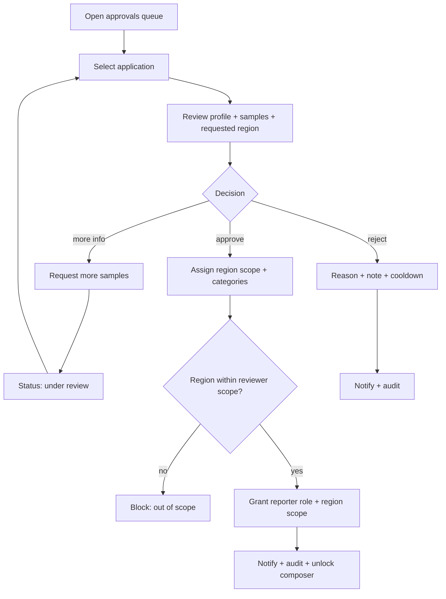

# A06 — Reporter Approvals

## Metadata

| Field | Value |
|---|---|
| Page ID | A06 |
| Platforms | Admin console (Web; desktop-first, tablet-responsive) |
| Roles | Admin (approve/reject/assign, region-scoped), Super Admin (all regions) |
| Priority | P1 |
| Route / Path | `/admin/reporter-approvals` |
| Prototype | `prototypes/pages/a06-reporter-approvals.html` |

## Purpose

A dedicated queue for reviewing users who have applied to become reporters.
Staff inspect each applicant's profile, motivation, and sample articles, then
approve (granting the `reporter` role plus a **region scope** and category
assignments) or reject with a reason. Approval notifies the applicant and
unlocks the article composer, while rejection keeps the door open for
re-application. The queue is region-scoped for an `admin` (they review
applicants for their regions; a `super_admin` reviews globally). Status tracking
and full history make the review process transparent and auditable.

Per the role model in
[`08-roles-regions-and-deletion.md`](../architecture/08-roles-regions-and-deletion.md),
a reporter may only create articles in their assigned regions or descendants
(REQ-REG-002), so approval MUST capture a region scope
(State → District → Constituency → Mandal).

## UI Structure

### Desktop (primary)

- **Persistent sidebar + top bar** (see `A02`), with "Reporter Approvals" active.
- **Page header:** title, subtitle with pending count (`--warning`), and an
  "Auto-assign categories" settings link.
- **Status tabs:** Pending (default, count badge) · Under review · Approved ·
  Rejected · All.
- **Toolbar:** search (name/email), sort (Applied newest/oldest, Experience),
  "Export CSV", refresh.
- **Two-pane layout:**
  - **Left queue list** (35%, scrollable, `--white`, right border `--border`):
    each applicant card shows avatar, name, email, applied relative time, number
    of samples, and a status badge (`--warning` pending, `--info` under review,
    `--success` approved, `--error` rejected). Selected card highlighted with
    `--purple-light` and `--purple` left accent bar.
  - **Right detail pane** (65%, `--white`, `radius-lg`, `shadow-card`):
    - **Applicant header:** avatar, name, email, location, joined, current role,
      external links (portfolio/social), "View full profile" link.
    - **Motivation block:** applicant's cover note (multi-line).
    - **Sample articles:** list of up to 5 submitted samples, each with title,
      excerpt, link/open button, and a quality rating control (1–5 stars) the
      reviewer can set.
    - **Internal notes:** free-text area for reviewer notes (not visible to
      applicant) with save.
    - **Reviewer checklist:** identity, writing quality, topic fit, no policy
      violations — each checkbox with optional note.
    - **Action bar (sticky bottom):** Approve, Reject, Mark Under Review,
      Request More Samples.
- **Approve modal:** choose a **region scope** (cascading multi-select tree
  State → District → Constituency → Mandal) and categories to assign
  (multi-select, both required ≥1), optional reviewer assignment, optional
  welcome note; confirm. The region tree is restricted to the reviewing
  `admin`'s scope; a `super_admin` may select any region. A live "scope preview"
  lists selected regions and their descendants (REQ-REG-002).
- **Region scope column/chip:** each application card and the detail pane show
  the applicant's requested/assigned region scope so reviewers can confirm fit
  before approving.
- **Reject modal:** reason dropdown (Insufficient quality, Off-topic, Policy
  violation, Incomplete application, Other) + required note (min 20 chars) with
  re-application allowed toggle (default on), cooldown select (30/90/180 days).
- **Request more samples modal:** note + optional deadline.
- **Toasts** (`z-toast`) for each action.

### Tablet / Narrow laptop (769–1024px)

- The two-pane layout collapses to master list with the detail opening as a
  full-width overlay on selection.
- Action bar becomes a fixed bottom bar.

### Responsive behavior

| Breakpoint | Behavior |
|---|---|
| `desktop` ≥1025px | Side-by-side queue + detail (35/65). |
| `tablet` 769–1024px | List-first, detail overlay. |
| `mobile` 0–768px | Unsupported for review; read-only list with advisory. |

## Features / Functional Requirements

| ID | Requirement | Priority |
|---|---|---|
| REQ-ADM-079 | The page MUST list reporter applications with applicant details, applied time, and status. | P0 |
| REQ-ADM-080 | Each application MUST show the applicant's motivation note and submitted sample articles. | P0 |
| REQ-ADM-081 | Staff MUST be able to approve an application, which grants the `reporter` role and assigns ≥1 category and ≥1 region scope. | P0 |
| REQ-ADM-082 | Staff MUST be able to reject an application with a required reason and note. | P0 |
| REQ-ADM-083 | Approving or rejecting MUST notify the applicant (in-app + email). | P0 |
| REQ-ADM-084 | Staff MUST be able to mark an application "Under review" and leave internal notes. | P1 |
| REQ-ADM-085 | Staff MUST be able to request more samples with a note and optional deadline. | P1 |
| REQ-ADM-086 | Rejection MUST support an optional re-application cooldown (30/90/180 days). | P1 |
| REQ-ADM-087 | The queue MUST track status transitions and expose a full per-application history. | P0 |
| REQ-ADM-088 | Reviewers MUST be able to rate each sample article (1–5) and complete a review checklist. | P2 |
| REQ-ADM-089 | The queue MUST support filtering by status and searching by name/email. | P1 |
| REQ-ADM-090 | All decisions MUST be recorded in the audit log with reviewer identity. | P0 |
| REQ-ADM-091 | Approving MUST send a welcome notification containing onboarding next steps. | P1 |
| REQ-ADM-092 | The system MUST prevent an applicant from submitting a new application while one is pending. | P1 |
| REQ-ADM-093 | Approved reporters MUST appear immediately in User Management with the reporter role. | P0 |
| REQ-ADM-094 | The detail pane MUST be keyboard-navigable (arrow up/down to move between applications). | P2 |
| REQ-ADM-130 | On approval, staff MUST assign a reporter region scope (State → District → Constituency → Mandal multi-select) persisted to `reporter_region_scopes` (REQ-REG-002). | P0 |
| REQ-ADM-131 | The region tree presented to an `admin` MUST be limited to their own scope; a `super_admin` may select any region (REQ-REG-003/007). | P0 |
| REQ-ADM-132 | The reporter's scope MUST take effect immediately on approval and gate article creation regions (REQ-REG-002). | P0 |
| REQ-ADM-133 | The queue MUST be region-scoped for `admin` reviewers. | P1 |

## User Interactions

- **Select applicant:** click card → detail loads (`dur-medium` fade); selection
  persists while navigating with arrow keys.
- **Sample open:** opens the article in a new tab or modal preview; rating stars
  are interactive (hover preview, click to set).
- **Checklist:** checkboxes update instantly (optimistic) and persist per
  reviewer.
- **Internal note save:** auto-saves on blur with a subtle "Saved" indicator.
- **Approve:** modal with region tree + category multi-select; confirm button
  disabled until a region and a category are chosen; the region tree expands
  lazily (state → district → constituency → mandal) and shows descendant counts;
  success shows a check animation and moves the card out of Pending.
- **Reject:** modal with reason + note; typed note validated live; on success the
  card badge becomes `--error` and moves based on tab filter.
- **Request more samples:** modal; on success status becomes Under review with a
  visible pending-deadline chip.
- **Mark under review:** instant status change; toast confirms.
- **Hover states:** cards lift `shadow-sm`; buttons `--purple-dark` on hover.

## Validation & Error States

| Field/Action | Rule | Error message |
|---|---|---|
| Approve region scope | ≥1 required | "Assign at least one region" |
| Approve region scope (admin) | All selections within reviewer's scope | "You can only assign regions within your scope" |
| Approve categories | ≥1 required | "Assign at least one category" |
| Reject reason | Required, from list | "Select a rejection reason" |
| Reject note | Required, ≥20 chars | "Add a note (at least 20 characters)" |
| Cooldown | One of 30/90/180 or none | "Choose a valid cooldown period" |
| Request samples note | Required, ≥10 chars | "Explain what samples are needed" |
| Sample deadline | Future date | "Deadline must be in the future" |
| Duplicate application | One pending max | "This applicant already has a pending application" |
| Permission | Role lacks approve | "You don't have permission to approve reporters" |
| Network | Request fails | "Action failed. Retry" |

## Loading, Empty, Success States

- **Loading:** queue shows 6 skeleton cards; detail pane shows a content skeleton
  with shimmer blocks for header, samples, and actions.
- **Empty:** "No pending applications" illustration with `--success` accent;
  filtered empty shows "No applications match this filter".
- **Success:** toast (`--success`) "Reporter approved — welcome email sent" /
  "Application rejected — applicant notified"; card color/badge updates; on
  approve, the applicant appears in `A05` with role `reporter` and the assigned
  region scope.

## User Flow

1. Admin opens Reporter Approvals (from `A02` KPI, sidebar, or a `A05` link).
2. Admin selects a pending applicant and reviews motivation + samples.
3. Admin may mark Under review, add notes, rate samples, or request more samples.
4. Admin approves (assigning a region scope + categories) or rejects (with
   reason + note).
5. System updates the applicant's role and `reporter_region_scopes`, sends a
   notification/email, and records the audit entry.
6. Approved reporters proceed to onboarding and the composer, able to submit
   only within their assigned regions (REQ-REG-002); rejected applicants are
   informed with re-application rules.



## Dependencies

- **Screens:** `A02 Admin Dashboard`, `A05 User Management`, `A08 Region
  Management` (region tree source), `R02 Article Composer`,
  `R04 Reporter Application` (applicant side), `P17 Notifications`.
- **Components:** MasterDetailLayout, ApplicantCard, StatusTabs, SampleList,
  StarRating, Checklist, NotesEditor, RegionScopeEditor, Modal, ConfirmDialog,
  Toast, StatusBadge.
- **Services/stores:** `reporterApplicationStore` (queue, selection, notes),
  `reporterService`, `categoryStore` (assignments), `regionService` (tree,
  descendants), `scopeStore`, `notificationService`, `auditService`,
  `emailService`.
- **Backend endpoints:** see table below.

## API / Data Requirements

| Method | Endpoint | Purpose |
|---|---|---|
| GET | `/api/v1/admin/reporter-applications?status=&search=&region=` | Paginated application queue (region-scoped). |
| GET | `/api/v1/admin/reporter-applications/:id` | Full application detail. |
| GET | `/api/v1/admin/reporter-applications/:id/history` | Status/history timeline. |
| PATCH | `/api/v1/admin/reporter-applications/:id/review` | Mark under review / save notes/checklist. |
| PATCH | `/api/v1/admin/reporter-applications/:id/approve` | Approve + assign region scope and categories. |
| PATCH | `/api/v1/admin/reporter-applications/:id/reject` | Reject + reason/cooldown. |
| POST | `/api/v1/admin/reporter-applications/:id/request-samples` | Request more samples. |
| POST | `/api/v1/admin/reporter-applications/:id/sample-rating` | Rate a sample article. |

**Request — approve**

```json
{ "regionIds": ["uuid-const-secunderabad", "uuid-mandal-bowenpally"], "categoryIds": ["uuid-1", "uuid-2"], "reviewerId": "uuid-admin", "welcomeNote": "Welcome aboard!" }
```

**Response — queue**

```json
{
  "success": true,
  "data": {
    "applications": [
      { "id": "uuid", "applicant": { "id": "uuid", "name": "Priya Nair", "email": "priya@example.com" }, "requestedRegions": [ { "id": "uuid-const-secunderabad", "name": "Secunderabad", "type": "constituency" } ], "status": "pending", "sampleCount": 3, "appliedAt": "2026-09-20T11:00:00Z" }
    ]
  },
  "meta": { "nextCursor": "eyJ...", "hasMore": false, "pending": 8 },
  "error": null
}
```

**Error — region out of reviewer scope**

```json
{ "success": false, "data": null, "error": { "code": "OUT_OF_SCOPE", "message": "You can only assign regions within your scope", "fields": {} } }
```

**Error — duplicate**

```json
{ "success": false, "data": null, "error": { "code": "CONFLICT", "message": "Applicant already has a pending application", "fields": {} } }
```

## Navigation

| Action | From | To |
|---|---|---|
| View full profile | Detail pane | `/admin/users/:id` (A05) |
| Open sample article | Sample list | `P09 Article Detail` (new tab) |
| Open composer (after approve) | Welcome toast link | `R02 Article Composer` |
| Back to dashboard | Breadcrumb | `/admin/dashboard` (A02) |
| Manage regions (super_admin) | Region tree header link | `/admin/regions` (A08) |
| Edit approved reporter scope | Welcome toast link | `/admin/users/:id` (A05, Regions tab) |
| Notifications | Sidebar | `/admin/notifications` (P17 admin view) |
| Bulk export | Toolbar | same page (file download) |

## Analytics Events

| Event | Trigger | Properties |
|---|---|---|
| `reporter_approvals_viewed` | Page mount | `pendingCount` |
| `reporter_application_opened` | Selection | `applicationId`, `status` |
| `reporter_application_review_marked` | Mark under review | `applicationId` |
| `reporter_application_approved` | Approve success | `applicationId`, `categoryCount`, `regionCount`, `reviewerAssigned` |
| `reporter_application_rejected` | Reject success | `applicationId`, `reason`, `cooldownDays` |
| `reporter_samples_requested` | Request samples | `applicationId`, `hasDeadline` |
| `reporter_sample_rated` | Star rating | `applicationId`, `sampleId`, `rating` |
| `reporter_checklist_completed` | Checklist item | `applicationId`, `item` |
| `reporter_region_scope_assigned` | Region scope saved on approve | `applicationId`, `regionCount`, `levels` |
| `reporter_approve_out_of_scope_blocked` | Scope rejection | `applicationId`, `regionId` |

## Open Questions

- Can editors approve, or only recommend and admins approve? (assumed admin)
- How many sample articles are required vs optional for an application?
- Should approval auto-assign categories based on the applicant's chosen topics?
- Is a background/identity verification step required before approval?
- Should there be a maximum number of approved reporters per category?
- Should a reporter's region scope be pre-filled from the applicant's declared
  location in `R04`?
- Can an `admin` approve reporters for regions outside their own scope, or is
  that strictly `super_admin`?
