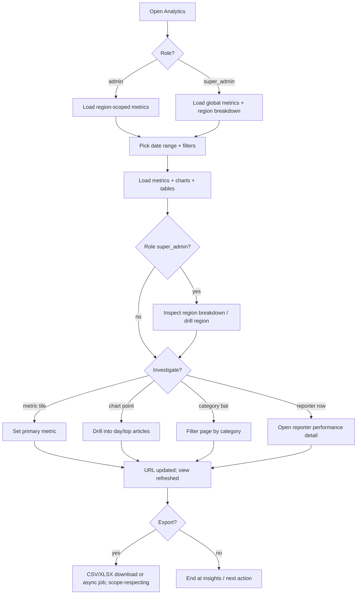

# A07 — Analytics

## Metadata

| Field | Value |
|---|---|
| Page ID | A07 |
| Platforms | Admin console (Web; desktop-first, tablet-responsive) |
| Roles | Admin (region-scoped analytics), Super Admin (global + region breakdown) |
| Priority | P2 |
| Route / Path | `/admin/analytics` |
| Prototype | `prototypes/pages/a07-analytics.html` |

## Purpose

The deep-dive analytics workspace for measuring content performance and audience
behavior. It lets staff pick a date range, inspect reach and engagement metrics
(page views, unique readers, average read time, scroll depth, likes, comments,
shares), find top articles and top categories, assess reporter performance, and
export the underlying data as CSV. It complements the dashboard (`A02`) by
offering filters, granularity, and drill-downs rather than at-a-glance KPIs.

Analytics are **region-scoped**: an `admin` sees metrics only for their assigned
regions and descendants (REQ-REG-003), while a `super_admin` sees global metrics
plus a **region breakdown** table/chart that splits the same metrics by region
level (state → district → constituency → mandal) for comparison.

## UI Structure

### Desktop (primary)

- **Persistent sidebar + top bar** (see `A02`), with "Analytics" active.
- **Region scope indicator:** an `admin` sees chips for their assigned regions
  (with descendant note); a `super_admin` sees an "All regions" pill. For
  `super_admin`, a region filter (All regions / specific region) scopes every
  widget; for `admin` the region filter is restricted to in-scope regions.
- **Filter bar** (sticky): Date range picker (presets: Today, 7d, 30d, 90d,
  This month, Last month, Custom) · Granularity (Hour/Day/Week/Month) · Region
  filter · Category multi-select · Reporter multi-select · Article search ·
  "Reset" and "Export CSV".
- **Metric summary row:** 7 scrollable stat tiles (`--white`, `radius-lg`,
  `shadow-card`): Page Views, Unique Readers, Avg Read Time, Avg Scroll Depth,
  Likes, Comments, Shares. Each shows value, delta chip (`--success`/`--error`),
  and sparkline; tiles are clickable to make that metric the primary chart series.
- **Primary chart panel:** large time-series line/area chart of the selected
  primary metric with comparison overlay (previous period, dashed `--muted`).
  Hover crosshair + tooltip. Toggle series visibility via legend.
- **Secondary grid (2×2):**
  - **Top articles table:** rank, title, category, views, avg read time, likes,
    comments, shares; sortable columns; row click opens article detail; top 10
    by default with "View all".
  - **Top categories bar chart:** bars `--purple`; click to filter the whole page.
  - **Engagement funnel:** opened → 25% scroll → 50% → 75% → 100% (horizontal
    funnel or stacked bar with `--purple` shades).
  - **Reporter performance table:** reporter, articles published, total views,
    avg views/article, avg read time, engagement rate; sortable.
- **Region breakdown (super_admin only):** a table/chart section splitting the
  primary metric by region level (State → District → Constituency → Mandal).
  Columns: region, level, views, readers, avg read time, engagement, delta;
  rows expand/collapse down the tree; clicking a row applies the region filter.
  The section is hidden for `admin` (who already see only their scope).
- **Insights strip:** auto-generated callouts ("Technology views up 24% vs last
  week", "Avg read time dipped on Sports") with `--info` accents.
- **Export modal:** choose format (CSV/XLSX), datasets (metrics, top articles,
  categories, reporters), and range; triggers download.

### Tablet / Narrow laptop (769–1024px)

- Metric tiles become a 2-row horizontal scroller; secondary grid becomes a
  single column stack; tables scroll horizontally; filter bar wraps.

### Responsive behavior

| Breakpoint | Behavior |
|---|---|
| `desktop` ≥1025px | Full grid, 7 tiles in a row, 2×2 secondary grid. |
| `tablet` 769–1024px | Tiles scroll, secondary grid stacks, wrapped filters. |
| `mobile` 0–768px | Summary read-only; charts simplified; advisory "best on desktop". |

## Features / Functional Requirements

| ID | Requirement | Priority |
|---|---|---|
| REQ-ADM-095 | The page MUST provide a date-range picker with presets and custom range (max 1 year). | P0 |
| REQ-ADM-096 | The page MUST display page views, unique readers, average read time, and average scroll depth. | P0 |
| REQ-ADM-097 | The page MUST display likes, comments, and shares totals for the range. | P0 |
| REQ-ADM-098 | The page MUST show a time-series chart with selectable granularity (hour/day/week/month). | P1 |
| REQ-ADM-099 | The page MUST list top articles with views, read time, and engagement metrics. | P0 |
| REQ-ADM-100 | The page MUST list top categories by views and allow clicking a category to filter. | P1 |
| REQ-ADM-101 | The page MUST provide an engagement funnel based on scroll depth. | P1 |
| REQ-ADM-102 | The page MUST show reporter performance (published, views, avg read time, engagement). | P1 |
| REQ-ADM-103 | The page MUST support filtering by category, reporter, and article search. | P0 |
| REQ-ADM-104 | The page MUST support exporting the current view as CSV. | P1 |
| REQ-ADM-105 | All filters and selections MUST be reflected in the URL query for shareable deep links. | P1 |
| REQ-ADM-106 | The page MUST show a comparison against the previous equivalent period. | P2 |
| REQ-ADM-107 | Metric widgets MUST be permission-scoped to the viewer's role. | P0 |
| REQ-ADM-108 | Large exports MUST be processed asynchronously with a notification when ready. | P2 |
| REQ-ADM-109 | Times MUST be displayed in the viewer's timezone with ISO-8601 UTC in the API. | P1 |
| REQ-ADM-134 | All analytics MUST be region-scoped for `admin` (assigned regions + descendants) and global for `super_admin` (REQ-REG-003/007). | P0 |
| REQ-ADM-135 | A `super_admin` MUST see a region breakdown that splits metrics by region level (state → district → constituency → mandal) and allows drill-down. | P1 |
| REQ-ADM-136 | The region filter MUST be limited to the viewer's scope for `admin`; out-of-scope filters MUST be rejected server-side (REQ-REG-004). | P0 |
| REQ-ADM-137 | Exports MUST respect region scope; an `admin` export MUST never include other regions' data. | P0 |

## User Interactions

- **Date range:** presets apply instantly; custom opens a two-month calendar with
  start/end selection; invalid ranges blocked.
- **Granularity toggle:** re-renders the chart (`dur-medium`) and refetches.
- **Metric tile click:** sets the primary chart metric; active tile gets
  `--purple-light` fill and `--purple` border.
- **Chart hover:** crosshair, tooltip with value/date, and the previous-period
  value; click a point to drill into the day's top articles.
- **Legend toggle:** shows/hides series without refetch.
- **Top article row click:** opens the article detail (reader view or admin
  preview).
- **Category bar click:** applies the category filter page-wide (URL updates).
- **Region filter / breakdown:** for `super_admin`, changing the region filter
  refetches all widgets (`?region=`); clicking a breakdown row drills into that
  region and updates the URL. For `admin`, the region control is read-only scope
  display and out-of-scope options are disabled.
- **Reporter table sort:** toggles asc/desc; sticky sort indicator.
- **Export:** opens modal; large ranges show a background-processing toast.
- **Insights:** dismissible callouts (`dur-fast` fade).

## Validation & Error States

| Field/Action | Rule | Error message |
|---|---|---|
| Custom range | Start ≤ end | "Start date must be before end date" |
| Custom range | Max span 366 days | "Date range can't exceed one year" |
| Custom range | Both dates required | "Select both start and end dates" |
| Granularity | Valid option for range | "Hourly data isn't available for ranges over 90 days" |
| Export | Data exists | "No data to export for this range" |
| Export | Valid format | "Choose a format (CSV or XLSX)" |
| Chart fetch | Non-2xx/timeout | "Couldn't load analytics" + Retry |
| Permission | Metric not permitted | Widget hidden (not an error) |
| Region filter (`admin`) | Selection outside scope | "You can only filter regions within your scope" |
| Region filter (`super_admin`) | Unknown/empty region | "Select a valid region" |

## Loading, Empty, Success States

- **Loading:** tiles show shimmer values; primary chart shows a spinner over an
  empty axis; tables show 5 skeleton rows each.
- **Empty:** if no data in range, charts show "No data for this period"; tables
  show "No articles/categories/reporters match your filters" with Reset. An
  `admin` with no region scope sees "No region assigned — contact a super
  admin".
- **Success:** populated charts fade in; CSV export downloads with toast
  "Export ready"; async exports set a notification and toast
  "We'll notify you when your export is ready".

## User Flow

1. Admin or super_admin opens Analytics from the dashboard or sidebar.
2. The page loads region-scoped (admin) or global (super_admin) metrics.
3. Staff selects a date range (default 30 days) and optional
   region/category/reporter filters.
4. System loads metrics, time-series, and tables scoped to the selection.
5. A `super_admin` may inspect the region breakdown and drill into a region; an
   `admin` sees their scope only.
6. Staff clicks a metric tile or chart point to drill down, or clicks a category
   bar to filter.
7. Staff exports the view as CSV for reporting.
8. Staff acts on insights by jumping to moderation/reporter management.



## Dependencies

- **Screens:** `A02 Admin Dashboard`, `A03 Article Moderation`, `A05 User
  Management`, `A06 Reporter Approvals`, `A08 Region Management`, `P09 Article
  Detail`.
- **Components:** DateRangePicker, MetricTile, LineChart, BarChart, FunnelChart,
  DataTable, FilterBar, RegionFilter, ScopeIndicator, BreakdownTable,
  ExportModal, Toast, Sparkline, InsightsStrip.
- **Services/stores:** `analyticsStore` (range, filters, series, region),
  `analyticsService`, `regionService`, `scopeStore`, `exportService`,
  `permissionService`, `urlStateSync`.
- **Backend endpoints:** see table below.

## API / Data Requirements

| Method | Endpoint | Purpose |
|---|---|---|
| GET | `/api/v1/admin/analytics/summary?from=&to=&region=&category=&reporter=` | Metric totals + deltas (region-scoped). |
| GET | `/api/v1/admin/analytics/timeseries?metric=&granularity=&from=&to=&region=` | Time-series + comparison. |
| GET | `/api/v1/admin/analytics/top-articles?from=&to=&limit=10&region=` | Top articles table. |
| GET | `/api/v1/admin/analytics/top-categories?from=&to=&limit=10&region=` | Top categories. |
| GET | `/api/v1/admin/analytics/funnel?from=&to=&region=` | Scroll-depth engagement funnel. |
| GET | `/api/v1/admin/analytics/reporters?from=&to=&region=` | Reporter performance. |
| GET | `/api/v1/admin/analytics/region-breakdown?from=&to=&level=` | Region-split metrics (`super_admin` only). |
| POST | `/api/v1/admin/analytics/export` | Queue CSV/XLSX export (scope-respecting). |
| GET | `/api/v1/admin/analytics/export/:jobId` | Export job status + download URL. |

> Scope is resolved server-side: an `admin` is always limited to their assigned
> regions and descendants regardless of `region=` (REQ-REG-003/004); only a
> `super_admin` may read cross-region or global data (REQ-REG-007).

**Response — summary**

```json
{
  "success": true,
  "data": {
    "pageViews": 1352000, "uniqueReaders": 812400, "avgReadTimeSec": 94,
    "avgScrollDepth": 0.62, "likes": 48210, "comments": 9120, "shares": 15330,
    "deltas": { "pageViews": 0.11, "uniqueReaders": 0.07, "avgReadTimeSec": -0.03 }
  },
  "meta": { "from": "2026-08-24", "to": "2026-09-22", "timezone": "Asia/Kolkata" },
  "error": null
}
```

**Request — export**

```json
{ "format": "csv", "datasets": ["summary", "topArticles", "categories"], "from": "2026-08-24", "to": "2026-09-22" }
```

**Response — export queued**

```json
{ "success": true, "data": { "jobId": "uuid", "status": "queued" }, "meta": {}, "error": null }
```

**Response — region breakdown (super_admin)**

```json
{
  "success": true,
  "data": {
    "level": "district",
    "regions": [
      { "id": "uuid-dist-hyderabad", "name": "Hyderabad", "type": "district", "parentId": "uuid-state-telangana", "pageViews": 420100, "uniqueReaders": 250300, "avgReadTimeSec": 97, "delta": 0.08 }
    ]
  },
  "meta": { "from": "2026-08-24", "to": "2026-09-22" },
  "error": null
}
```

**Error — invalid range**

```json
{ "success": false, "data": null, "error": { "code": "INVALID_RANGE", "message": "Date range can't exceed one year", "fields": { "to": "range_too_large" } } }
```

**Error — region out of scope (admin)**

```json
{ "success": false, "data": null, "error": { "code": "OUT_OF_SCOPE", "message": "You can only filter regions within your scope", "fields": {} } }
```

## Navigation

| Action | From | To |
|---|---|---|
| Open article | Top articles row | `/news/:slug` (P09) or `/admin/moderation?article=:id` (A03) |
| View reporter | Reporter table row | `/admin/users/:id` (A05) |
| Moderate category | Category drilldown | `/admin/moderation?category=:id` (A03) |
| Region breakdown row | Breakdown table (super_admin) | same page (region filter applied) |
| Manage regions (super_admin) | Scope bar / sidebar | `/admin/regions` (A08) |
| Back to dashboard | Breadcrumb | `/admin/dashboard` (A02) |
| Reporter approvals | Sidebar | `/admin/reporter-approvals` (A06) |
| Export ready | Notification | same page (download) |

## Analytics Events

| Event | Trigger | Properties |
|---|---|---|
| `admin_analytics_viewed` | Page mount | `from`, `to`, `role` |
| `admin_analytics_range_changed` | Range change | `preset`, `from`, `to` |
| `admin_analytics_granularity_changed` | Granularity change | `granularity` |
| `admin_analytics_filter_applied` | Category/reporter/search | `filter`, `value` |
| `admin_analytics_metric_selected` | Metric tile click | `metric` |
| `admin_analytics_chart_drilled` | Chart point click | `metric`, `date` |
| `admin_analytics_exported` | Export action | `format`, `datasets`, `async` |
| `admin_analytics_insight_dismissed` | Insight dismissed | `insightId` |
| `admin_analytics_load_failed` | Fetch error | `code` |
| `admin_analytics_region_filter_changed` | Region filter change | `regionId`, `level` |
| `admin_analytics_region_breakdown_viewed` | Breakdown section | `level`, `role` |
| `admin_analytics_region_drilled` | Breakdown row click | `regionId`, `level` |
| `admin_analytics_out_of_scope_blocked` | Scope rejection | `regionId`, `code` |

## Open Questions

- Which analytics backend is authoritative — Firebase Analytics, a warehouse, or
  a first-party events table?
- What defines "unique reader" (device, user id, or cookie) and the reset window?
- Is XLSX export required, or is CSV only sufficient for v1?
- Should reporter performance be visible to moderators, or content metrics only?
- What is the data freshness SLA — near-real-time, hourly, or nightly?
- Do we need scheduled/emailed recurring reports?
- For a parent-scope `admin`, should analytics aggregate descendants by default
  or require explicit drill-down?
- Should the region breakdown compare regions side-by-side (ranked) or as a
  tree roll-up only?
- Should `admin` exports be watermarked/limited to their scope for compliance?
