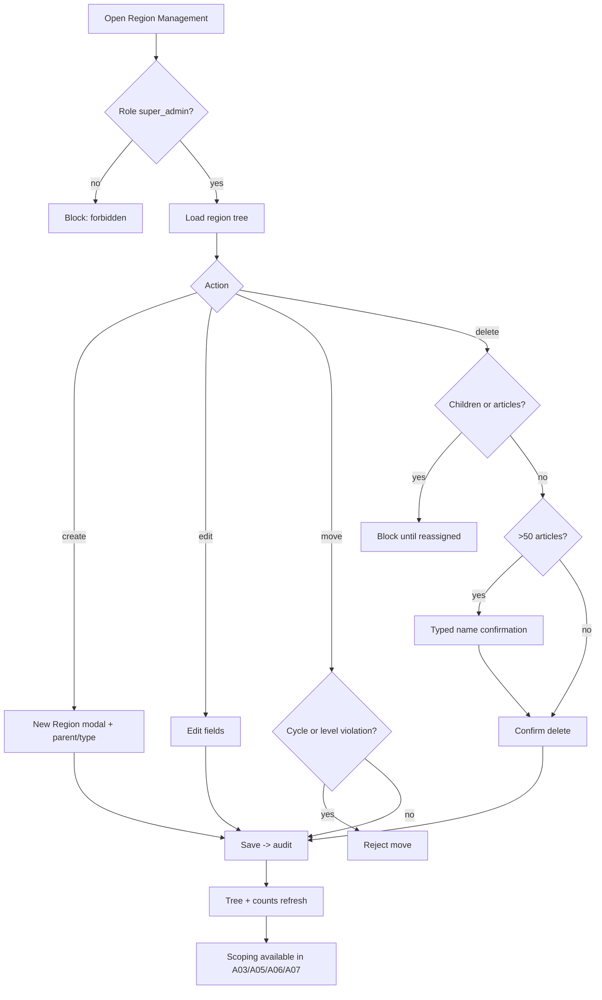

# A08 — Region Management

## Metadata

| Field | Value |
|---|---|
| Page ID | A08 |
| Platforms | Admin console (Web; desktop-first, tablet-responsive) |
| Roles | Super Admin only |
| Priority | P1 |
| Route / Path | `/admin/regions` |
| Prototype | `prototypes/pages/a08-region-management.html` |

## Purpose

The authoritative editor for the platform's four-level geography tree —
**State → District → Constituency → Mandal** — defined in
[`08-roles-regions-and-deletion.md`](../architecture/08-roles-regions-and-deletion.md).
It exists so a `super_admin` can create, edit, re-parent (move), and delete
region nodes, while the rest of the platform relies on the same tree for region
scoping of articles (REQ-REG-001), reporters (REQ-REG-002), and admins
(REQ-REG-003). Because every region-bound feature depends on this tree, the page
is **super-admin only** (REQ-REG-005) and applies strict guards: a region with
children or attached articles cannot be deleted until those are reassigned
(REQ-REG-006). The page also provides a cross-reference view of which admins are
scoped to which regions, so coverage gaps are visible at a glance.

## UI Structure

### Desktop (primary)

- **Persistent sidebar + top bar** (see `A02`), with "Region Management" active
  under the **Super Admin** group (visible only to `super_admin`).
- **Page header:** title "Region Management", subtitle "State → District →
  Constituency → Mandal", a `--purple-dark` "Super Admin" badge, and two
  buttons: "Expand all / Collapse all" (secondary) and "New Region" (primary).
- **Two-pane layout:**
  - **Left tree pane (45%, `--white`, right border `--border`):**
    - Search input (region name), level filter chips
      (All / State / District / Constituency / Mandal), and an "Include archived"
      toggle (P2).
    - **Region tree:** nested, lazily-loaded rows. Each row shows a chevron
      (expand/collapse), a level icon, the region name (`weight-semibold`), a
      type badge (`state` `--purple-dark`, `district` `--purple`,
      `constituency` `--info`, `mandal` `--muted`), a child count chip, and an
      article count chip (`--purple-light`).
    - Row hover `--purple-light`; selected row gets a `--purple` left accent bar.
    - Each row's ⋯ menu: Add child, Edit, Move, View admins, View articles,
      Delete (`--error`, disabled with a tooltip when blocked).
    - Keyboard: ↑/↓ navigate, →/← expand/collapse, Enter opens detail.
  - **Right detail pane (55%, `--white`, `radius-lg`, `shadow-card`):**
    - **Breadcrumb:** ancestors of the selected node (e.g. Telangana › Hyderabad
      › Secunderabad), each clickable.
    - **Node summary:** name, type, parent, slug/code, created/updated with
      actor, child count, article count, and descendant count.
    - **Tabs:**
      - **Details:** editable form (name, type, parent picker, code/slug,
        optional coordinates, active flag).
      - **Children:** table of immediate children (name, type, articles,
        admins) with quick actions.
      - **Admins:** list of admins whose scope includes this node (directly or
        via an ancestor), with a link to `A05` to edit scope.
      - **Articles:** recent articles with `region_id` equal to this node (or a
        descendant filter toggle), linking to `A03`.
      - **History:** immutable audit entries (create/edit/move/delete) with
        actor and before/after.
    - **Footer action bar:** Add child, Edit, Move, Delete (guarded).
- **New / Edit Region modal** (`z-modal`, max-width 520px):
  - Name (required, 2–80 chars, unique within parent).
  - Type (select; constrained by parent level — a child of a state is a
    district, etc.).
  - Parent (cascading picker; read-only when editing type is disallowed).
  - Code / slug (optional, lowercase-hyphenated, unique).
  - Coordinates (optional lat/lng, validated range).
  - Active toggle (default on).
  - Footer: Cancel (secondary), Save (primary; disabled until valid).
- **Move Region modal:** destination parent picker; validates that the move does
  not create a cycle and does not violate level rules; shows a preview "N
  descendants move with this node and M articles keep their region".
- **Delete Region modal** (`z-modal`): shows child count and article count;
  blocked when either > 0 until reassigned; typed region-name confirmation when
  article count > 50; Delete button (`--error`).
- **Admin coverage view** (toggle in the left pane header): flattens the tree
  into a table — region, level, #admins, #articles, coverage status
  (Covered `--success` / Uncovered `--warning`) with a "Assign admin" link to
  `A05`.
- **Toasts** (`z-toast`) for every mutation.

### Tablet / Narrow laptop (769–1024px)

- Two-pane collapses to list-first; the detail pane opens as a full-width
  overlay on selection.
- Tree indentation reduces; type badges become icons with tooltips.
- Modals become full-width sheets.

### Responsive behavior

| Breakpoint | Behavior |
|---|---|
| `desktop` ≥1025px | Side-by-side tree + detail (45/55); full table columns. |
| `tablet` 769–1024px | Tree-first, detail overlay; condensed rows. |
| `mobile` 0–768px | Read-only tree with advisory "Manage regions on desktop"; no mutations. |

## Features / Functional Requirements

| ID | Requirement | Priority |
|---|---|---|
| REQ-REG-001 | Every region MUST have a `type ∈ {state, district, constituency, mandal}` and reference a parent (except root states). | P0 |
| REQ-REG-005 | Only a `super_admin` MAY create, edit, move, or delete regions; the page and all its endpoints MUST reject any other role. | P0 |
| REQ-ADM-138 | The page MUST render the region hierarchy as an interactive, expand/collapse tree with search and level filtering. | P0 |
| REQ-ADM-139 | A `super_admin` MUST be able to create a child region whose type is the immediate successor of the parent's type. | P0 |
| REQ-ADM-140 | Region names MUST be unique within the same parent and type (case-insensitive). | P0 |
| REQ-ADM-141 | Editing MUST allow renaming, re-typing (only when legal), and changing the parent (Move) without orphaning descendants. | P0 |
| REQ-ADM-142 | A Move MUST be rejected if it would create a cycle or violate the level ordering. | P0 |
| REQ-REG-006 | Deleting a region with children or articles MUST be blocked until those children/articles are reassigned or deleted. | P0 |
| REQ-REG-004 | Region scope MUST be enforced server-side on every region-bound action that consumes this tree (article, reporter, admin scoping); the UI hints are advisory only. | P0 |
| REQ-REG-007 | Super admin region actions are global; scope checks are bypassed only for `super_admin`. | P0 |
| REQ-ADM-143 | Deleting a region with >50 articles MUST require typed region-name confirmation. | P1 |
| REQ-ADM-144 | The detail pane MUST expose the admins whose scope includes the node (direct or inherited) and link to `A05` for editing. | P1 |
| REQ-ADM-145 | The page MUST offer an admin coverage view that flags regions with no scoped admin. | P2 |
| REQ-ADM-146 | Every create/edit/move/delete MUST be written to the immutable audit log with actor and before/after (REQ-REG-007, REQ-DEL-005). | P0 |
| REQ-ADM-147 | The tree MUST load children lazily and support deep trees without blocking the UI. | P1 |
| REQ-ADM-148 | Region codes/slugs, when provided, MUST be unique across the system. | P2 |
| REQ-ADM-149 | The page MUST show per-node article and child counts to inform safe deletion. | P0 |
| REQ-ADM-150 | Root states MUST NOT have a parent and MUST NOT be deletable while any descendant or article exists. | P0 |

## User Interactions

- **Expand/collapse:** chevron click toggles children (`dur-fast`); lazily
  fetches children the first time; state persists in `localStorage`.
- **Select node:** click a row loads the detail pane (`dur-medium` fade);
  keyboard ↑/↓ moves selection.
- **Add child:** "New Region" pre-fills the parent from the selected node and
  constrains the type; the primary button stays disabled until the form is valid.
- **Edit:** inline modal; changing the type is only enabled when no children
  exist (otherwise the type select is disabled with an explanatory tooltip).
- **Move:** destination picker highlights legal drop targets; illegal targets are
  disabled with a "would create a cycle" tooltip; on save the tree re-renders and
  a toast confirms.
- **Delete:** opens the guard modal; child/article counts are shown live; the
  Delete button is disabled until reassignment resolves the blockers; typed
  confirmation appears for large article counts.
- **Coverage toggle:** switches the left pane to the flattened coverage table;
  clicking "Assign admin" deep-links to `A05` with the region pre-selected.
- **Drag-and-drop move (optional):** rows can be dragged onto a legal parent;
  an invalid drop snaps back with an error toast. (P2)
- **Hover/active:** buttons `--purple-dark` on hover; destructive actions
  `--error`; disabled states 40% opacity with tooltips.
- **Keyboard:** arrow keys navigate/expand; `Esc` closes modals; `/` focuses
  search.

## Validation & Error States

| Field/Action | Rule | Error message |
|---|---|---|
| Name | Required, 2–80 chars, unique within parent+type | "Enter a region name" / "A region with this name already exists here" |
| Type | Must be the child level of the chosen parent | "Choose the correct level for this parent" |
| Parent | Required for non-state; valid region | "Select a parent region" |
| Code/slug | Optional, `^[a-z0-9]+(?:-[a-z0-9]+)*$`, unique | "Code can only use lowercase letters, numbers, and hyphens" / "This code is already in use" |
| Coordinates | Lat −90..90, Lng −180..180 | "Enter valid coordinates" |
| Edit type with children | Blocked | "You can't change the type while this region has children" |
| Move | No cycle, level legal | "That move would break the region hierarchy" |
| Move | Dest valid | "Choose a valid destination" |
| Delete | No children/articles | "Reassign or delete its {n} children first" / "Move its {n} articles to another region first" |
| Delete (>50) | Typed name match | "Type the region name to confirm deletion" |
| Delete root with descendants | Blocked | "You can't delete a state that still has regions" |
| Permission | Actor not `super_admin` | "Only a super admin can manage regions" |
| Network | Request fails | "Something went wrong. Retry" |

## Loading, Empty, Success States

- **Loading:** tree shows 3–4 skeleton rows at the root; detail pane shows a
  content skeleton; lazy child loads show inline spinners.
- **Empty:** "No regions yet" illustration + "Create your first state" button;
  filtered empty: "No regions match your search" + Clear.
- **Success:** new/edited node appears with a brief `--purple-light` highlight
  (`dur-slow`); toast (`--success`) "Region created/updated/moved/deleted";
  tree and counts refresh without a full reload. If an `admin` somehow reaches
  the page, a `--error` banner "Only super admins can manage regions" is shown
  and all mutations are hidden.

## User Flow

1. Super admin opens Region Management from the sidebar (Super Admin group) or
   the `A02` quick action "Manage Regions".
2. The tree loads root states; the super admin expands to find a parent node.
3. The super admin creates a child (e.g. a Mandal under a Constituency) or edits
   an existing node.
4. To reorganize, the super admin moves a node to a new parent; the system
   validates the hierarchy and audits the change.
5. To remove a node, the super admin resolves blocking children/articles, then
   deletes with confirmation.
6. The updated tree immediately drives scoping in `A03`, `A05`, `A06`, and
   `A07`.



## Dependencies

- **Screens:** `A02 Admin Dashboard`, `A03 Article Moderation` (region filter),
  `A05 User Management` (scope assignment), `A06 Reporter Approvals`,
  `A07 Analytics`, `A10 Danger Zone` (audit log).
- **Components:** RegionTree, TreeNode, RegionTypeBadge, DetailTabs,
  ParentPicker, ConfirmDialog, TypedConfirmDialog, Modal, Toast, SearchInput,
  CoverageTable, EmptyState, PermissionGuard.
- **Services/stores:** `regionStore` (tree, selection, expansion),
  `regionService`, `userService` (scoped admins), `articleService` (counts),
  `auditService`, `permissionService` (super_admin guard).
- **Backend endpoints:** see table below.

## API / Data Requirements

| Method | Endpoint | Purpose |
|---|---|---|
| GET | `/api/v1/admin/regions?parentId=&type=&search=` | List regions (roots or children of a parent). |
| GET | `/api/v1/admin/regions/tree?depth=` | Full (or depth-limited) region tree. |
| GET | `/api/v1/admin/regions/:id` | Region detail + counts. |
| GET | `/api/v1/admin/regions/:id/descendants` | Descendant list (scope expansion). |
| GET | `/api/v1/admin/regions/:id/admins` | Admins scoped to this region. |
| GET | `/api/v1/admin/regions/coverage` | Regions with/without an assigned admin. |
| POST | `/api/v1/admin/regions` | Create a region (super_admin). |
| PATCH | `/api/v1/admin/regions/:id` | Edit fields (super_admin). |
| PATCH | `/api/v1/admin/regions/:id/move` | Re-parent a region (super_admin). |
| DELETE | `/api/v1/admin/regions/:id` | Delete with reassignment guard (super_admin). |
| GET | `/api/v1/admin/regions/:id/history` | Audit/history entries. |

**Request — create**

```json
{ "name": "Bowenpally", "type": "mandal", "parentId": "uuid-const-secunderabad", "code": "bowenpally", "isActive": true }
```

**Request — move**

```json
{ "newParentId": "uuid-const-secunderabad" }
```

**Response — tree**

```json
{
  "success": true,
  "data": {
    "regions": [
      {
        "id": "uuid-state-telangana", "name": "Telangana", "type": "state", "parentId": null,
        "childCount": 3, "articleCount": 0,
        "children": [
          { "id": "uuid-dist-hyderabad", "name": "Hyderabad", "type": "district", "parentId": "uuid-state-telangana", "childCount": 5, "articleCount": 12 }
        ]
      }
    ]
  },
  "meta": { "total": 214, "levels": ["state", "district", "constituency", "mandal"] },
  "error": null
}
```

**Error — blocked delete**

```json
{ "success": false, "data": null, "error": { "code": "CONFLICT", "message": "Reassign or delete its 4 children first", "fields": { "regionId": "has_children" } } }
```

**Error — illegal move**

```json
{ "success": false, "data": null, "error": { "code": "VALIDATION_ERROR", "message": "That move would break the region hierarchy", "fields": { "newParentId": "cycle" } } }
```

**Error — permission**

```json
{ "success": false, "data": null, "error": { "code": "FORBIDDEN", "message": "Only a super admin can manage regions", "fields": {} } }
```

## Navigation

| Action | From | To |
|---|---|---|
| View articles in region | Detail Articles tab | `/admin/moderation?region=:id` (A03) |
| Edit admin scope | Detail Admins tab / coverage table | `/admin/users/:id` (A05) |
| Reporter scopes | Detail Admins tab | `/admin/reporter-approvals` (A06) |
| Analytics breakdown | Detail/count chip | `/admin/analytics?region=:id` (A07) |
| Audit history | Detail History tab | same page (tab) / `/admin/danger-zone` (A10) |
| Back to dashboard | Breadcrumb | `/admin/dashboard` (A02) |
| App settings | Super Admin sidebar | `/admin/settings/contacts` (A09) |

## Analytics Events

| Event | Trigger | Properties |
|---|---|---|
| `region_management_viewed` | Page mount | `rootCount`, `totalRegions` |
| `region_node_expanded` | Tree expand | `regionId`, `level` |
| `region_selected` | Node select | `regionId`, `type` |
| `region_created` | Create success | `regionId`, `type`, `parentId` |
| `region_updated` | Edit success | `regionId`, `changedFields` |
| `region_moved` | Move success | `regionId`, `oldParentId`, `newParentId`, `descendantsMoved` |
| `region_delete_blocked` | Guard triggered | `regionId`, `childCount`, `articleCount` |
| `region_deleted` | Delete success | `regionId`, `type`, `articleCount` |
| `region_coverage_viewed` | Coverage toggle | `uncoveredCount` |
| `region_admin_assign_clicked` | Coverage/Admins tab link | `regionId` |

## Open Questions

- Should region deletion ever cascade (delete descendants and detach articles),
  or is blocking with reassignment the only allowed behavior (per REQ-REG-006)?
- Are region codes/slugs needed for integrations, or is the UUID sufficient?
- Should the hierarchy support more than four levels in future (e.g. Ward)?
- When moving a region, should articles keep their `region_id` (default) or be
  re-evaluated?
- Is an "archived/inactive" region state needed separate from deletion?
- Should coverage warnings block publishing in uncovered regions, or only alert?
