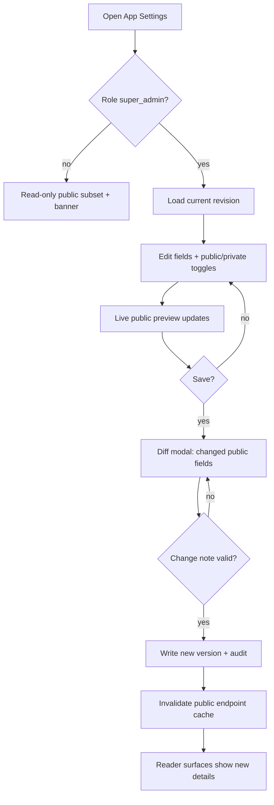

# A09 — App Contact & Advertisement Settings

## Metadata

| Field | Value |
|---|---|
| Page ID | A09 |
| Platforms | Admin console (Web; desktop-first, tablet-responsive) |
| Roles | Super Admin only (admin and below read the public subset only) |
| Priority | P1 |
| Route / Path | `/admin/settings/contacts` |
| Prototype | `prototypes/pages/a09-app-settings-contacts.html` |

## Purpose

The single source of truth for the platform's externally visible contact and
advertising details: support email/phone, ad-sales email/phone, office address,
WhatsApp, social links, and business hours. These values back the public
"Contact us" surfaces (e.g. `P20 Settings`, `P21 About`) and the ad-sales
enquiry entry points in the reader apps. The page is **super-admin only**
(REQ-ADS-001) because these fields expose the organization publicly. Every change
is versioned and audited (REQ-ADS-002), and fields are explicitly split into
**public** (safe to expose) versus **private/internal** so secrets are never
leaked through the public endpoint (REQ-ADS-003).

## UI Structure

### Desktop (primary)

- **Persistent sidebar + top bar** (see `A02`), with "App Settings" active under
  the **Super Admin** group (visible only to `super_admin`).
- **Page header:** title "App Contact & Advertisement Settings", subtitle
  "Public contact and ad-sales details", a `--purple-dark` "Super Admin" badge,
  and a "View history" secondary button.
- **Two-column layout:**
  - **Left form column (65%):** grouped sections, each a card (`--white`,
    `radius-lg`, `shadow-card`, padding `space-6`):
    1. **Support contact:**
       - Support email (`--purple` link preview), support phone.
       - "Public" toggle per field (`--success` when on).
    2. **Advertisement sales:**
       - Ad-sales email, ad-sales phone, optional ad-sales contact name.
       - "Public" toggle per field.
    3. **Office:**
       - Office address (multi-line textarea), city, state/region (optional
         region picker), postal code, country.
       - Map coordinate preview (optional).
    4. **Messaging:**
       - WhatsApp number (validated E.164), optional WhatsApp prefilled message.
    5. **Social links:** repeatable rows for platform (X/Twitter, Facebook,
       Instagram, YouTube, LinkedIn, Telegram) + URL; add/remove rows.
    6. **Hours:** weekly schedule (Mon–Sun) with open/close time pairs, plus a
       "Closed" toggle per day; optional timezone select.
  - **Right rail (35%):**
    - **Publish panel:** Draft/Published status, "Last updated by/at",
      character counts, "Discard changes" and "Save changes" (primary;
      disabled when unchanged or invalid).
    - **Field visibility legend:** explains Public vs Private (`--info` /
      `--muted`) and warns "Private fields never leave the admin console".
    - **Live preview:** a mock of the public "Contact us" card rendered from the
      currently-public fields only, updating live (`dur-fast`).
    - **Recent changes:** last 5 audit entries (actor, field, before → after,
      relative time) with a link to the full history.
- **Change confirmation modal** (`z-modal`): lists exactly which public fields
  changed, with before/after diff; requires a short change note (min 5 chars);
  Confirm (primary) / Cancel.
- **History drawer** (`z-drawer`, 55%): versioned timeline of settings
  revisions; each entry expands to a field-level diff; a "Restore this version"
  action (super_admin) creates a new revision rather than rewriting history.
- **Toasts** (`z-toast`) for save/restore.

### Tablet / Narrow laptop (769–1024px)

- Two columns collapse to a single column; the right rail becomes a sticky
  bottom summary bar.
- Social link rows stack; hours become a compact accordion.

### Responsive behavior

| Breakpoint | Behavior |
|---|---|
| `desktop` ≥1025px | Form + right rail side-by-side (65/35); live preview visible. |
| `tablet` 769–1024px | Single column; preview in a collapsible panel. |
| `mobile` 0–768px | Read-only summary with advisory "Edit on desktop"; no mutations. |

## Features / Functional Requirements

| ID | Requirement | Priority |
|---|---|---|
| REQ-ADS-001 | Only a `super_admin` MAY create or update app contact/advertisement details; all write endpoints MUST reject other roles. | P0 |
| REQ-ADS-002 | Every change MUST create a versioned, audited revision capturing actor, timestamp, and field-level before/after values. | P0 |
| REQ-ADS-003 | Public contact fields MUST be exposed via a public read-only endpoint that NEVER returns private/internal fields or secrets. | P0 |
| REQ-ADM-151 | The page MUST allow editing support email/phone, ad-sales email/phone, office address, WhatsApp, social links, and hours. | P0 |
| REQ-ADM-152 | Each field MUST be classifiable as public or private (`app_settings.is_public`) and the visibility MUST be reflected in the public endpoint. | P0 |
| REQ-ADM-153 | The page MUST show a live preview of the public contact card built only from public fields. | P1 |
| REQ-ADM-154 | Saving MUST present a diff of changed public fields and require a short change note. | P1 |
| REQ-ADM-155 | The history drawer MUST list revisions with field-level diffs and support restoring a prior version as a new revision. | P1 |
| REQ-ADM-156 | Emails MUST be valid email addresses and phones MUST be valid E.164 (or the local format documented) numbers. | P0 |
| REQ-ADM-157 | Social links MUST be valid `https` URLs on the selected platform's domains (or explicitly allowlisted). | P1 |
| REQ-ADM-158 | Hours MUST define open ≤ close per open day and a valid IANA timezone. | P1 |
| REQ-ADM-159 | `admin` and below MUST be able to read only the public subset; the edit UI MUST be inaccessible to them. | P0 |
| REQ-ADM-160 | Concurrent edits MUST be guarded by optimistic locking; a stale save MUST be rejected with a conflict. | P2 |

## User Interactions

- **Edit field:** inputs validate on blur; the "Save changes" button enables once
  the form differs from the loaded revision.
- **Public toggle:** switching Public/Private updates the live preview instantly
  (`dur-fast`); private fields are greyed in the preview with a lock note.
- **Add/remove social link:** "Add link" appends a row; removing requires a
  confirm if the row had content; platform select constrains URL validation.
- **Hours:** toggling "Closed" disables the time pair for that day; time pairs
  support keyboard entry and a dropdown.
- **Save:** opens the change confirmation modal with a diff; entering a note and
  confirming shows a `--success` toast "Settings published" and appends an audit
  entry.
- **Discard changes:** reverts to the last saved revision with a confirmation if
  dirty.
- **Restore version:** from the history drawer, hard-confirm; produces a new
  revision (never destroys history) and a toast.
- **Copy public JSON:** a small "Copy public payload" button copies the exact
  JSON the public endpoint returns (useful for QA).
- **Hover/active:** buttons `--purple-dark` on hover; disabled at 40% opacity.
- **Keyboard:** `Esc` closes modals/drawer; `Ctrl/Cmd+S` triggers save.

## Validation & Error States

| Field/Action | Rule | Error message |
|---|---|---|
| Support email | Required, valid email | "Enter a valid support email" |
| Support phone | Required, valid E.164/local | "Enter a valid phone number" |
| Ad-sales email | Optional, valid email | "Enter a valid ad-sales email" |
| Ad-sales phone | Optional, valid number | "Enter a valid phone number" |
| Office address | Required, ≤200 chars | "Enter the office address" |
| WhatsApp | Optional, E.164 | "Enter a valid WhatsApp number with country code" |
| Social URL | Valid `https` URL, platform-matched | "Enter a valid https link" / "That link doesn't match the selected platform" |
| Hours | open ≤ close on open days; timezone required | "Close time must be after open time" / "Select a timezone" |
| Save note | Required, ≥5 chars | "Add a short note describing the change" |
| Save conflict | Stale revision | "Someone else updated these settings. Reload to continue." |
| Save | Actor not `super_admin` | "Only a super admin can change these settings" |
| Network | Request fails | "Couldn't save settings. Retry" |

## Loading, Empty, Success States

- **Loading:** form sections show shimmer rows; the history drawer shows a
  skeleton timeline.
- **Empty:** first-run shows sensible placeholder defaults with a `--info`
  banner "No contact details published yet"; the preview shows "Add public
  details to populate the contact card".
- **Success:** save shows a `--success` toast "Settings published" and the
  "Last updated by/at" refreshes; the public endpoint reflects changes within
  the cache TTL (≤60s); "Copy public payload" shows "Copied".

If a non-super-admin somehow reaches the page, the form is read-only with a
`--error` banner "Only super admins can change these settings" and public fields
only.

## User Flow

1. Super admin opens App Settings from the sidebar (Super Admin group) or the
   `A02` quick action "App Settings".
2. The page loads the current revision, marking each field public/private.
3. The super admin edits contact/ad details and toggles field visibility,
   watching the live public preview.
4. On Save, the confirmation modal shows the public-field diff; the super admin
   adds a change note and confirms.
5. The system writes a new version, appends an audit entry, and invalidates the
   public endpoint cache.
6. Reader surfaces (`P20`, `P21`) show the new public details within the cache
   TTL.



## Dependencies

- **Screens:** `A02 Admin Dashboard`, `A10 Danger Zone` (audit log),
  `P20 Settings`, `P21 About` (public consumers), `P18 Profile` (support links).
- **Components:** SettingsForm, FieldVisibilityToggle, SocialLinksEditor,
  HoursEditor, LivePreviewCard, DiffModal, HistoryDrawer, Modal, Toast,
  PermissionGuard, CopyButton.
- **Services/stores:** `settingsStore` (revision, dirty state),
  `settingsService`, `publicSettingsCache`, `auditService`,
  `permissionService` (super_admin guard), `urlValidator`.
- **Backend endpoints:** see table below.

## API / Data Requirements

| Method | Endpoint | Purpose |
|---|---|---|
| GET | `/api/v1/admin/settings/contacts` | Read full settings (super_admin) including private fields. |
| PUT | `/api/v1/admin/settings/contacts` | Create a new version (super_admin) with change note. |
| GET | `/api/v1/admin/settings/contacts/history` | Versioned revision timeline. |
| GET | `/api/v1/admin/settings/contacts/history/:version` | Field-level diff for a revision. |
| POST | `/api/v1/admin/settings/contacts/restore` | Restore a prior version as a new revision (super_admin). |
| GET | `/api/v1/settings/contacts/public` | Public, unauthenticated subset (`is_public = true` only). |

**Request — update**

```json
{
  "changeNote": "Updated ad-sales phone for the new desk",
  "revision": 7,
  "values": {
    "supportEmail": { "value": "help@newswatch.com", "isPublic": true },
    "supportPhone": { "value": "+914012345678", "isPublic": true },
    "adSalesEmail": { "value": "ads@newswatch.com", "isPublic": true },
    "adSalesPhone": { "value": "+914098765432", "isPublic": true },
    "officeAddress": { "value": "2nd Floor, TV Tower, Hyderabad", "isPublic": true },
    "whatsapp": { "value": "+919812345678", "isPublic": true },
    "socialLinks": { "value": [ { "platform": "youtube", "url": "https://youtube.com/@newswatch" } ], "isPublic": true },
    "hours": { "value": { "timezone": "Asia/Kolkata", "days": { "mon": { "open": "09:00", "close": "18:00" } } }, "isPublic": true },
    "internalOnCall": { "value": "+919800000000", "isPublic": false }
  }
}
```

**Response — public endpoint**

```json
{
  "success": true,
  "data": {
    "supportEmail": "help@newswatch.com",
    "supportPhone": "+914012345678",
    "adSalesEmail": "ads@newswatch.com",
    "adSalesPhone": "+914098765432",
    "officeAddress": "2nd Floor, TV Tower, Hyderabad",
    "whatsapp": "+919812345678",
    "socialLinks": [ { "platform": "youtube", "url": "https://youtube.com/@newswatch" } ],
    "hours": { "timezone": "Asia/Kolkata", "days": { "mon": { "open": "09:00", "close": "18:00" } } }
  },
  "meta": { "version": 7, "updatedAt": "2026-09-22T10:15:00Z" },
  "error": null
}
```

> The public payload contains **only** `is_public = true` fields; `internalOnCall`
> and any private field are omitted entirely (REQ-ADS-003).

**Error — validation**

```json
{ "success": false, "data": null, "error": { "code": "VALIDATION_ERROR", "message": "Enter a valid support email", "fields": { "supportEmail": "invalid" } } }
```

**Error — stale revision**

```json
{ "success": false, "data": null, "error": { "code": "CONFLICT", "message": "Someone else updated these settings. Reload to continue.", "fields": { "revision": "stale" } } }
```

## Navigation

| Action | From | To |
|---|---|---|
| View full history | Header / right rail | same page (history drawer) |
| Audit log | History drawer link | `/admin/danger-zone` (A10) |
| Manage regions | Office region picker / sidebar | `/admin/regions` (A08) |
| Public contact page | Preview card link | `P21 About` (new tab) |
| Back to dashboard | Breadcrumb | `/admin/dashboard` (A02) |
| Danger Zone | Super Admin sidebar | `/admin/danger-zone` (A10) |

## Analytics Events

| Event | Trigger | Properties |
|---|---|---|
| `app_settings_viewed` | Page mount | `role`, `version` |
| `app_settings_field_changed` | Field edit | `field`, `visibility` |
| `app_settings_save_clicked` | Save button | `changedFieldCount` |
| `app_settings_saved` | Save success | `version`, `changedFields` |
| `app_settings_save_conflict` | Stale revision | `version` |
| `app_settings_version_restored` | Restore action | `fromVersion`, `newVersion` |
| `app_settings_public_payload_copied` | Copy button | `version` |
| `app_settings_preview_viewed` | Preview interaction | `visibilityFilter` |

## Open Questions

- Should internal-only fields even live on this page, or move to a separate
  integrations page (this doc assumes they coexist with a private flag)?
- Is a single "Contact us" set enough, or do we need per-region office/contact
  details (which would add region scoping to `app_settings`)?
- Should restoring a version require the change note or a typed confirmation?
- What is the acceptable cache TTL for the public endpoint (assumed ≤60s)?
- Should ad-sales enquiries be logged/forwarded anywhere, or is the email/phone
  purely informational?
- Do social links need ordering/visibility per reader platform?
