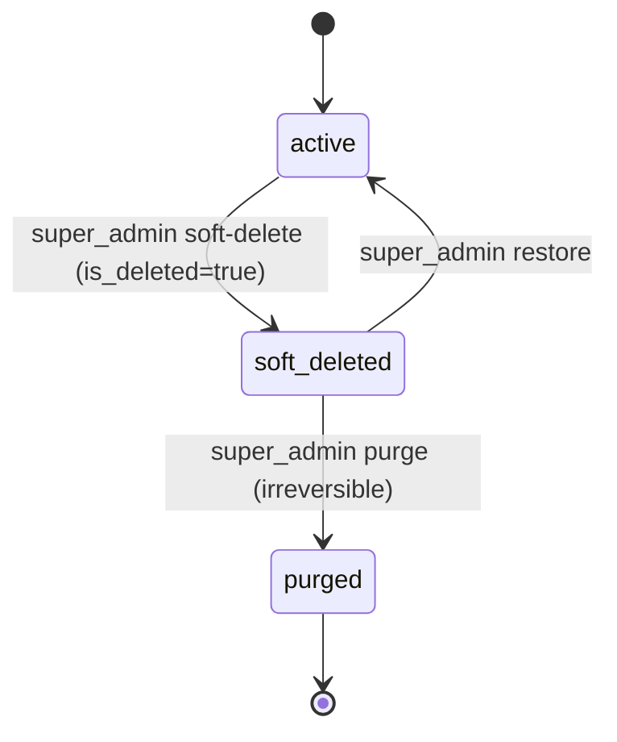
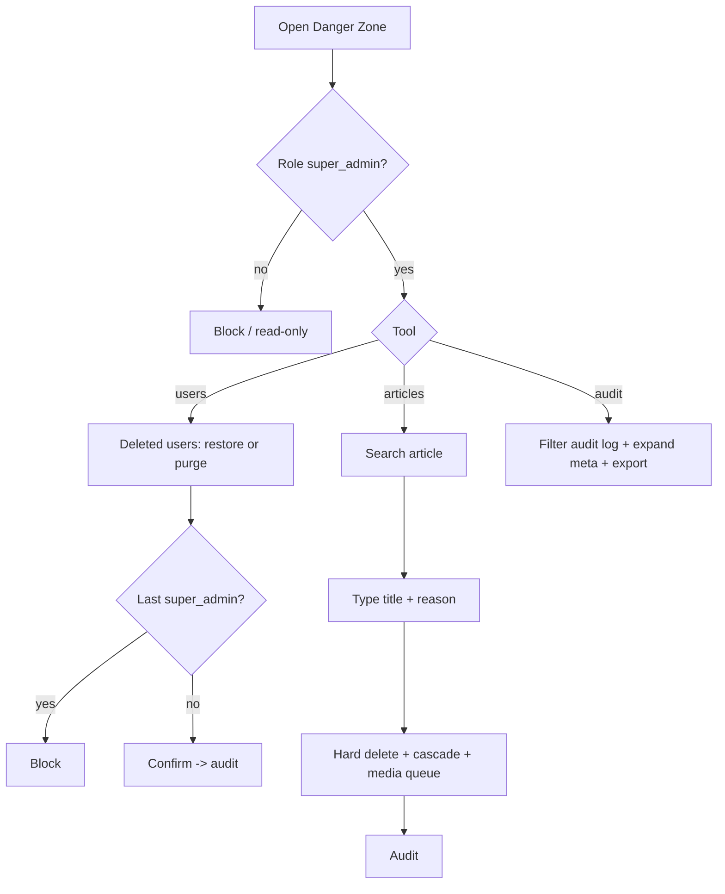

# A10 — Danger Zone

## Metadata

| Field | Value |
|---|---|
| Page ID | A10 |
| Platforms | Admin console (Web; desktop-first, tablet-responsive) |
| Roles | Super Admin only |
| Priority | P1 |
| Route / Path | `/admin/danger-zone` |
| Prototype | `prototypes/pages/a10-danger-zone.html` |

## Purpose

The consolidated home for the platform's irreversible and highly sensitive
operations, restricted to `super_admin`. It provides three tools, each tied to
the deletion policy in
[`08-roles-regions-and-deletion.md`](../architecture/08-roles-regions-and-deletion.md):

1. **Soft-deleted users** — list users with `is_deleted = true`, and **restore**
   (`is_deleted = false`) or permanently **purge** them (REQ-DEL-001/002).
2. **Article hard delete** — permanently remove a published or draft article row
   and its dependent rows via cascade, with a **typed-title confirmation**
   (REQ-DEL-004).
3. **Audit log viewer** — an immutable, filterable record of every soft delete,
   restore, purge, hard delete, and sensitive admin action (REQ-DEL-005).

The page exists so destructive power is centralized, deliberate, and fully
auditable, rather than scattered across normal management screens.

## UI Structure

### Desktop (primary)

- **Persistent sidebar + top bar** (see `A02`), with "Danger Zone" active under
  the **Super Admin** group. The sidebar item uses a `--error` accent and a
  warning icon.
- **Page header:** title "Danger Zone", subtitle "Irreversible actions —
  restricted to super admins", a `--error` "Restricted" badge, and a persistent
  `--warning` banner: "These actions cannot be undone. Every action is audited."
- **Three tool sections (vertical tabs on the left, content on the right):**
  1. **Soft-deleted users**
  2. **Article hard delete**
  3. **Audit log**

#### 1. Soft-deleted users

- **Toolbar:** search (name/email/id), deleted-date range picker, "Sort: Deleted
  newest/oldest", "Export CSV".
- **Table** (`--white`, `radius-lg`, `shadow-card`, virtualized): columns —
  checkbox · User (avatar, name with strikethrough, email) · Role chip ·
  Region scopes · Deleted at (relative + exact tooltip) · Deleted by (actor
  avatar) · Articles/comments retained · Actions (Restore, Purge).
- **Row actions:** **Restore** (primary/`--success`) and **Purge** (`--error`).
- **Bulk bar** (on selection): Restore selected, Clear. (Bulk purge is
  deliberately not offered.)
- **Restore confirmation:** simple modal, non-destructive wording; clears
  `is_deleted`/`deleted_at` and writes an audit entry.
- **Purge modal** (`z-modal`, `--error`): explains that purge permanently
  removes the account and its profile data (relations may be anonymized, per
  policy); typed email confirmation; disabled if the account is the last
  `super_admin` (REQ-DEL-007). Purge is irreversible.

#### 2. Article hard delete

- **Lookup:** article search by title/slug/ID (typeahead) plus recent published
  articles list for quick selection.
- **Selected article card:** title, author, category, region, status, published
  date, view/like/comment counts, and a `--error` note "Permanently removes the
  article and images, categories, likes, bookmarks, and comments (cascade)."
- **Hard-delete control:** a **typed-title** input — the super admin must type
  the exact article title to enable the `--error` "Delete permanently" button.
  A required reason dropdown (Policy violation / Legal request / Malware /
  Duplicate error / Other) is captured in the audit record.
- **Media notice:** a checklist confirms media objects (Cloudflare R2) are
  queued for deletion.
- **Post-delete:** the article immediately 404s for readers; related
  notifications are not retroactively edited but links resolve to a "removed"
  notice.

#### 3. Audit log

- **Filters:** date-range picker, actor (typeahead), action type multi-select
  (soft_delete / restore / purge / hard_delete / role_change / scope_change /
  settings_change), target type (user / article / region / category / settings),
  and free-text search over meta.
- **Table** (virtualized, read-only): timestamp (with timezone), actor (avatar +
  role), action chip, target type + link, target summary, source IP, and an
  expandable row showing the `meta` JSON (before/after).
- **Immutability:** rows are append-only; there are no edit/delete controls. A
  "chain verified" indicator (P2) shows tamper-evidence status.
- **Export:** "Export CSV" of the filtered audit view; large exports process
  asynchronously with a notification.
- **Detail drawer** (`z-drawer`): full JSON meta, actor details, request id, and
  related timeline for the same target.

### Tablet / Narrow laptop (769–1024px)

- Left vertical tabs become a horizontal tab row; tables reduce columns and
  scroll horizontally.
- Hard-delete and purge modals become full-width sheets.

### Responsive behavior

| Breakpoint | Behavior |
|---|---|
| `desktop` ≥1025px | Vertical tool tabs + content; full tables and audit filters. |
| `tablet` 769–1024px | Horizontal tabs; condensed tables; full-width modals. |
| `mobile` 0–768px | Read-only audit view permitted; all destructive tools show an advisory "Use desktop" and are disabled. |

## Features / Functional Requirements

| ID | Requirement | Priority |
|---|---|---|
| REQ-DEL-001 | User deletion MUST be a SOFT delete via `users.is_deleted = true` (with `deleted_at`/`deleted_by`); rows MUST NOT be physically removed except by explicit purge. | P0 |
| REQ-DEL-002 | Only a `super_admin` MAY soft-delete, restore, or purge users; all endpoints and UI controls MUST enforce this. | P0 |
| REQ-DEL-003 | Soft-deleted users MUST be excluded from all normal queries and MUST NOT authenticate; they appear only in this page. | P0 |
| REQ-DEL-004 | Only a `super_admin` MAY HARD delete an article; the row and dependents MUST be physically removed via cascade and media queued for deletion. | P0 |
| REQ-DEL-005 | Every soft delete, restore, purge, and hard delete MUST write an immutable audit record (actor, target, action, meta, timestamp). | P0 |
| REQ-DEL-006 | Soft-deleted entities MUST support an "include deleted" filter for `super_admin` views only (implemented here and in `A05`). | P0 |
| REQ-DEL-007 | The system MUST NEVER allow the last `super_admin` to be deleted, purged, or demoted. | P0 |
| REQ-ADM-161 | The page MUST list soft-deleted users with deleted-at/by and support single and bulk restore. | P0 |
| REQ-ADM-162 | Purge MUST be a distinct, explicit action from soft delete, require typed email confirmation, and be irreversible. | P0 |
| REQ-ADM-163 | Article hard delete MUST require typed-title confirmation and a reason, and MUST cascade dependents and queue media deletion. | P0 |
| REQ-ADM-164 | The audit log MUST be filterable by date, actor, action, and target and be read-only/append-only. | P0 |
| REQ-ADM-165 | The audit row MUST expose the full `meta` (before/after) via an expandable detail. | P1 |
| REQ-ADM-166 | Bulk purge MUST NOT be offered; purge is one account at a time. | P1 |
| REQ-ADM-167 | The last `super_admin` guard MUST block soft delete, purge, and demotion both in the UI and server-side. | P0 |
| REQ-ADM-168 | Audit export MUST respect the active filters and process large exports asynchronously. | P2 |

## User Interactions

- **Section switch:** left tool tabs swap content (`dur-medium` fade); the
  active tab gets a `--purple-light` fill.
- **Restore:** row action → confirm modal → optimistic badge clear → toast
  "User restored"; the row leaves the list.
- **Purge:** row action → `--error` modal → typed email unlocks "Delete
  permanently" → confirm → row removed and audit appended. The last super_admin
  shows a disabled Purge with tooltip "You can't purge the last super admin".
- **Article lookup:** typing debounced 250ms; selecting an article loads the
  card; the Delete button stays disabled until both title match and reason are
  set.
- **Type-to-confirm:** input border turns `--success` while matching, `--error`
  while not; paste is allowed but must match exactly (trimmed, case-sensitive).
- **Audit filters:** debounced; applied filters reflected in the URL
  (`?action=&actor=&from=&to=`) for shareable views.
- **Audit row expand:** inline JSON panel (`dur-fast`); detail drawer for the
  full record.
- **Bulk restore:** selecting rows reveals the bulk bar; confirm restores all
  selected with a per-item result summary.
- **Hover/active:** destructive buttons `--error` → darker on hover; disabled at
  40% opacity; focus-visible ring.
- **Keyboard:** `Esc` closes modals/drawer; `/` focuses search; destructive
  buttons are not the default focus target to prevent accidental activation.

## Validation & Error States

| Field/Action | Rule | Error message |
|---|---|---|
| Restore | User must be soft-deleted | "This account isn't deleted" |
| Purge | Actor `super_admin`; typed email matches | "Only a super admin can purge users" / "Type the user's email to confirm" |
| Purge | Not the last super_admin | "You can't purge the last super admin account" |
| Hard delete | Actor `super_admin` | "Only a super admin can permanently delete articles" |
| Hard delete | Typed title matches exactly | "Type the exact article title to confirm" |
| Hard delete | Reason selected | "Select a reason for deletion" |
| Hard delete | Article exists | "That article no longer exists" |
| Audit filter | Range start ≤ end, max 1 year | "Choose a valid date range" |
| Audit export | Data exists | "No audit entries match your filters" |
| Network | Request fails | "Action failed. Nothing was changed. Retry" |

## Loading, Empty, Success States

- **Loading:** tables show 8 shimmer rows; the article card shows a skeleton; the
  audit log shows a timeline skeleton.
- **Empty:** soft-deleted list: "No deleted users" with a `--success` check;
  article tool: "Search for an article to delete"; audit log: "No audit entries
  for these filters" with Clear.
- **Success:** toast (`--success`) "User restored" / "User purged" / "Article
  permanently deleted" / "Audit export ready"; the audit log prepends the new
  entry without a full reload. Purge toasts are `--warning`-toned to signal
  irreversibility.
- **Permission:** a non-super-admin reaching any route is redirected with a
  `--error` banner "Restricted to super admins"; read-only audit access may be
  allowed only if a future role is explicitly granted it.

## User Flow

### Restore / purge a user

1. Super admin opens Danger Zone → "Soft-deleted users".
2. Searches the deleted list and selects an account.
3. Chooses **Restore** (account returns to `A05` active) or **Purge**
   (irreversible).
4. Purge requires typed email and is blocked for the last super_admin.
5. The system writes an audit entry; the audit tab reflects it immediately.

### Hard delete an article

1. Super admin opens "Article hard delete" and locates the article.
2. Reviews the cascade notice and dependent counts.
3. Selects a reason and types the exact title.
4. Confirms; the row and dependents are removed and media deletion is queued.
5. Readers receive a "removed" notice; the audit entry is written.

### Review the audit log

1. Super admin opens "Audit log" and filters by action/target/date.
2. Expands a row to inspect before/after `meta`.
3. Exports the filtered view if needed.





## Dependencies

- **Screens:** `A02 Admin Dashboard`, `A03 Article Moderation`, `A05 User
  Management`, `A08 Region Management`, `A09 App Settings`, `P17
  Notifications`.
- **Components:** DangerTabs, DeletedUsersTable, PurgeModal, RestoreConfirm,
  ArticleLookup, TypeToConfirmInput, ReasonSelect, AuditTable, AuditFilters,
  AuditDetailDrawer, DiffViewer, Modal, Toast, PermissionGuard, ExportButton.
- **Services/stores:** `dangerZoneStore` (deleted users, selected article, audit
  filters), `userService`, `articleService`, `auditService`, `mediaService`,
  `permissionService` (super_admin + last-admin guard), `exportService`.

## API / Data Requirements

| Method | Endpoint | Purpose |
|---|---|---|
| GET | `/api/v1/admin/users?includeDeleted=true&deleted=true&search=&cursor=&limit=` | List soft-deleted users (super_admin). |
| POST | `/api/v1/admin/users/:id/restore` | Restore a soft-deleted user (REQ-DEL-002). |
| DELETE | `/api/v1/admin/users/:id/purge` | Permanently purge a user (irreversible; REQ-DEL-002/007). |
| POST | `/api/v1/admin/users/restore-bulk` | Bulk restore (no bulk purge). |
| GET | `/api/v1/admin/articles/search?q=` | Find an article for hard delete. |
| DELETE | `/api/v1/admin/articles/:id/hard` | Hard delete article + dependents + media queue (REQ-DEL-004). |
| GET | `/api/v1/admin/audit-logs?action=&actor=&targetType=&from=&to=&cursor=&limit=` | Filterable immutable audit log (REQ-DEL-005). |
| GET | `/api/v1/admin/audit-logs/:id` | Audit entry detail incl. `meta`. |
| POST | `/api/v1/admin/audit-logs/export` | Queue filtered audit export. |

**Request — purge user**

```json
{ "confirmEmail": "rahul@example.com" }
```

**Request — hard delete article**

```json
{ "confirmTitle": "City council approves new flyover", "reason": "legal_request", "queueMediaDeletion": true }
```

**Response — deleted users**

```json
{
  "success": true,
  "data": {
    "users": [
      { "id": "uuid", "name": "Rahul Verma", "email": "rahul@example.com", "role": "reporter", "regionScopes": [ { "id": "uuid-const-secunderabad", "name": "Secunderabad", "type": "constituency" } ], "isDeleted": true, "deletedAt": "2026-09-18T06:20:00Z", "deletedBy": { "id": "uuid-sa", "name": "Root" }, "articleCount": 48, "commentCount": 12 }
    ]
  },
  "meta": { "nextCursor": "eyJ...", "hasMore": false, "total": 27 },
  "error": null
}
```

**Response — audit log**

```json
{
  "success": true,
  "data": {
    "entries": [
      { "id": "uuid", "action": "hard_delete", "targetType": "article", "targetId": "uuid-art", "targetSummary": "City council approves new flyover", "actor": { "id": "uuid-sa", "name": "Root", "role": "super_admin" }, "meta": { "reason": "legal_request", "dependentsRemoved": { "images": 3, "comments": 42, "likes": 310 } }, "ip": "203.0.113.7", "createdAt": "2026-09-22T10:15:00Z" }
    ]
  },
  "meta": { "nextCursor": "eyJ...", "hasMore": true },
  "error": null
}
```

**Error — protect last super admin**

```json
{ "success": false, "data": null, "error": { "code": "CONFLICT", "message": "You can't purge the last super admin account", "fields": {} } }
```

**Error — typed title mismatch**

```json
{ "success": false, "data": null, "error": { "code": "VALIDATION_ERROR", "message": "Type the exact article title to confirm", "fields": { "confirmTitle": "mismatch" } } }
```

**Error — permission**

```json
{ "success": false, "data": null, "error": { "code": "FORBIDDEN", "message": "Only a super admin can perform this action", "fields": {} } }
```

## Navigation

| Action | From | To |
|---|---|---|
| Soft-deleted user profile | Row | `/admin/users/:id?includeDeleted=true` (A05) |
| Article moderation | Hard-delete card link | `/admin/moderation?article=:id` (A03) |
| Region of article | Article card region chip | `/admin/regions` (A08) |
| Settings changes in audit | Audit row target | `/admin/settings/contacts` (A09) |
| Manage regions | Super Admin sidebar | `/admin/regions` (A08) |
| Back to dashboard | Breadcrumb | `/admin/dashboard` (A02) |
| Restore success | Toast link | `/admin/users` (A05) |

## Analytics Events

| Event | Trigger | Properties |
|---|---|---|
| `danger_zone_viewed` | Page mount | `tab`, `deletedUserCount` |
| `danger_tab_changed` | Tab switch | `tab` |
| `deleted_users_search` | Search input | `queryLength`, `resultCount` |
| `user_restore_clicked` | Restore action | `userId` |
| `user_restored` | Restore success | `userId`, `bulk` |
| `user_purge_clicked` | Purge action | `userId` |
| `user_purged` | Purge success | `userId` |
| `user_purge_blocked_last_super_admin` | Last-admin guard | `userId` |
| `article_hard_delete_started` | Article selected | `articleId` |
| `article_hard_delete_confirmed` | Hard delete success | `articleId`, `reason`, `dependentsRemoved` |
| `article_hard_delete_blocked` | Guard/validation fail | `articleId`, `code` |
| `audit_log_viewed` | Audit tab | `filters` |
| `audit_log_filtered` | Filter change | `filter`, `value` |
| `audit_entry_expanded` | Row expand | `entryId`, `action` |
| `audit_export_requested` | Export action | `filters`, `async` |
| `danger_action_forbidden` | Non-super-admin attempt | `action`, `role` |

## Open Questions

- On purge, should authored articles/comments be anonymized, reassigned to a
  system account, or cascade-deleted? (Policy says soft-delete retains them;
  purge behavior needs an explicit decision.)
- Should purge require a second super admin's approval (four-eyes principle)?
- Should hard-deleted articles be recoverable from a cold backup for a grace
  period, or is deletion truly final?
- Is the audit log truly append-only in storage (e.g. WORM/ledger), and is a
  tamper-evidence chain in scope for v1?
- Should an `admin` (not super admin) be able to see a region-scoped, read-only
  slice of the audit log?
- Should soft-deleted users auto-purge after a retention window (e.g. 90 days),
  and if so, is that still audited as a system actor?
