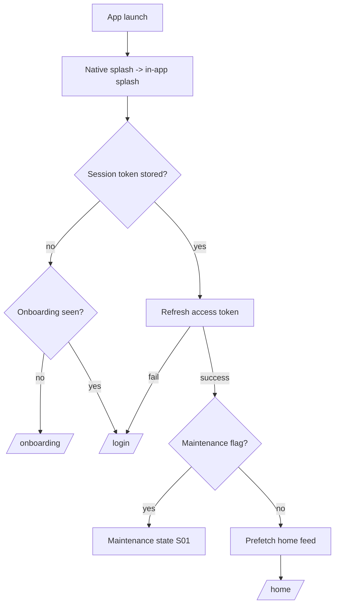

# P01 — Splash / App Launch

## Metadata

| Field | Value |
|---|---|
| Page ID | P01 |
| Platforms | Mobile / Web |
| Roles | Guest / User / Reporter / Admin |
| Priority | P0 |
| Route / Path | Mobile: launch screen (no route) → resolves to `/onboarding`, `/home`, or `/login`. Web: `/` |
| Prototype | `prototypes/shared/splash.html` (TBD), brand mark from `newslistingscreen.html` `.logo-icon` |

## Purpose

The splash screen is the first surface every user sees. It presents the NewsWatch
brand, masks cold-start work (JS bundle load, token restore, config fetch, API
health check), decides where the user should land (onboarding, home feed, login,
or maintenance), and enforces a minimum display time so the animation is never
jarringly interrupted. It exists to make launch feel instant, branded, and
deterministic while session bootstrap runs in the background.

## UI Structure

### Mobile
- **Root canvas:** full-bleed `--white` background (light) or `--purple` (brand
  variant A). Native splash uses a solid `--purple` field with the white logo.
- **Brand mark:** `logo-icon` 34px (see token `logo-icon`), white on purple or
  purple on white, with the 20° rotation and white notch detail reused from the
  prototype's `.logo-icon`.
- **Wordmark:** "newswatch" in `font-size-title-sm`, `weight-extrabold`,
  letter-spacing `-0.5px`, centered under the mark.
- **Animation stage:** centered column, `space-8` gap between mark and wordmark.
- **Bottom region:** subtle 3-dot loading indicator (`--purple-light` track,
  `--purple` active dot) placed `space-9` from the bottom safe area.
- **Progress accent:** optional 2px indeterminate bar pinned to the very bottom
  using `--purple` on `--purple-light`.
- All elements are non-interactive; the screen has no header, tabs, or back.

### Web
- **Root canvas:** `--background` full viewport, content centered with flex.
- **Brand block:** logo mark 34px + wordmark `font-size-title` (34px),
  `weight-extrabold`, `--purple`; may sit on a `shadow-card` white card of
  `radius-xl` with `space-8` padding for a "launch card" look.
- **Route behavior:** served at `/`; Next.js performs a client-side redirect
  once bootstrap resolves. While resolving, the same centered brand is shown.
- **No desktop nav, search, or login button** during splash.

### Responsive behavior
- `xs` (0–390px): mark 29px (`logo-icon` mobile), wordmark 22px, paddings
  reduced to `space-4`.
- `mobile` (≤768px): native-style full-bleed purple splash, mark 29px.
- `tablet`/`desktop` (≥769px): launch card layout, mark 34px, wordmark 34px.
- Orientation changes do not restart the animation; the minimum timer is set
  once per process launch.

## Features / Functional Requirements

| ID | Requirement | Priority |
|---|---|---|
| REQ-SYS-001 | The app MUST display the branded splash with logo animation for a minimum of 900ms and a maximum of 3000ms before routing. | P0 |
| REQ-SYS-002 | On cold start the app MUST restore the session from secure storage (refresh token) and validate the access token before routing. | P0 |
| REQ-SYS-003 | Routing MUST resolve to exactly one of: `/onboarding` (first run), `/home` (valid session), `/login` (no session or refresh failure), or `/maintenance` (kickoff flag). | P0 |
| REQ-SYS-004 | The splash MUST perform an API health check (`GET /health`) and a config/feature-flag fetch in parallel with session restore. | P0 |
| REQ-SYS-005 | If device connectivity is absent, the app MUST NOT block; it MUST route using cached session and show the offline banner (S01). | P1 |
| REQ-SYS-006 | If the backend reports maintenance mode, the app MUST route to the maintenance state (S01) regardless of session. | P1 |
| REQ-SYS-007 | The splash animation MUST respect the OS "reduce motion" setting and fall back to a static brand + spinner. | P1 |
| REQ-SYS-008 | The splash MUST preload the home feed's first page in the background so time-to-first-article is under 3s. | P1 |
| REQ-SYS-009 | A forced app-update flag (config `minAppVersion`) MUST route to the update-required state instead of home. | P2 |

## User Interactions

- **None required.** The splash is non-interactive by design.
- **Reduce motion / skip:** allowing a single tap anywhere advances early to the
  resolved route once bootstrap is complete (never before it completes).
- **Animation sequence (mobile):**
  1. `0ms` — mark fades in `dur-medium` with `ease-standard`, scale `0.9 → 1.0`.
  2. `120ms` — wordmark slides up `space-2` and fades in over `dur-medium`.
  3. `400ms` — three-dot loader begins a looping `1.2s` opacity breathe.
  4. `≥900ms` — if bootstrap done, crossfade (`dur-slow`) to the resolved route.
- **Animation sequence (web):** same but the launch card lifts with `shadow-md`
  (`dur-medium`); redirect uses a `dur-slow` opacity crossfade.
- **Press/tap feedback:** none; no hover states.

## Validation & Error States

| Field/Action | Rule | Error message |
|---|---|---|
| Refresh token | Must be present and non-expired | (silent) → route to `/login` |
| Access token refresh | Server must return `success:true` | (silent) → route to `/login`, clear storage |
| Health check | Timeout 5s | Do not block; continue with cached config |
| Config fetch | Timeout 5s | Fall back to bundled default config |
| App version | `minAppVersion` from config | Redirect to update-required state |

## Loading, Empty, Success States

- **Loading:** the splash itself is the loading state: animated brand mark,
  wordmark, and a 3-dot loader. No skeleton is shown here.
- **Empty:** N/A (there is always content to render).
- **Success:** the splash crossfades into the resolved route; the destination's
  own skeleton loads (home feed skeleton, or login form).
- **Failure:** silent fallback to `/login` or S01 offline/maintenance; no error
  toast is shown on the splash because there is no actionable UI yet.

## User Flow



1. User taps the app icon or opens the web root.
2. Native splash (mobile) or SSR shell (web) renders the brand.
3. Session restore, health check, config fetch run in parallel.
4. Minimum display timer (900ms) and bootstrap both resolve.
5. App crossfades to onboarding, home, login, or maintenance.

## Dependencies

- **Screens:** P02 Onboarding, P03 Login, P07 Home Feed, S01 System States.
- **Components:** `BrandMark`, `Wordmark`, `DotLoader`, `ProgressBar`.
- **Services/stores:** `AuthStore` (token restore), `ConfigStore` (feature flags),
  `HealthService`, `QueryClient` (home prefetch), `SecureStorage`.
- **Backend endpoints:** `/health`, `/api/v1/config`, `/api/v1/auth/refresh`.

## API / Data Requirements

| Method | Endpoint | Purpose |
|---|---|---|
| GET | `/health` | Liveness/readiness + maintenance flag |
| GET | `/api/v1/config` | Feature flags, `minAppVersion`, maintenance mode |
| POST | `/api/v1/auth/refresh` | Exchange refresh token for new access token |
| GET | `/api/v1/users/me` | Validate session and hydrate user/role |

`GET /api/v1/config` response:

```json
{
  "success": true,
  "data": {
    "maintenance": false,
    "minAppVersion": "1.4.0",
    "features": { "comments": true, "reporter": true }
  },
  "meta": {},
  "error": null
}
```

`POST /api/v1/auth/refresh` request/response:

```json
{ "refreshToken": "<opaque-or-jwt>" }
```

```json
{
  "success": true,
  "data": { "accessToken": "<jwt>", "expiresIn": 900, "role": "user" },
  "meta": {},
  "error": null
}
```

## Navigation

| Action | From | To |
|---|---|---|
| First run, onboarding unseen | P01 Splash | P02 Onboarding |
| Valid session | P01 Splash | P07 Home Feed |
| No/invalid session | P01 Splash | P03 Login |
| Maintenance flag set | P01 Splash | S01 Maintenance |
| Force update required | P01 Splash | S01 Update Required |

## Analytics Events

| Event | Trigger | Properties |
|---|---|---|
| `app_launch` | Splash mount | `platform`, `appVersion`, `coldStart` |
| `splash_bootstrap_time` | Resolve complete | `ms`, `sessionRestored` |
| `splash_route_decision` | Route chosen | `destination`, `reason` |
| `app_update_required_shown` | minAppVersion gate | `current`, `min` |

## Open Questions

- Brand variant: purple full-bleed or white launch card as the primary?
- Should splash prefetch only the first feed page, or first page + next?
- Maximum tolerable minimum display time (900ms vs 1200ms)?
- Is a user-tappable "skip" permitted, or should it be fully passive?
