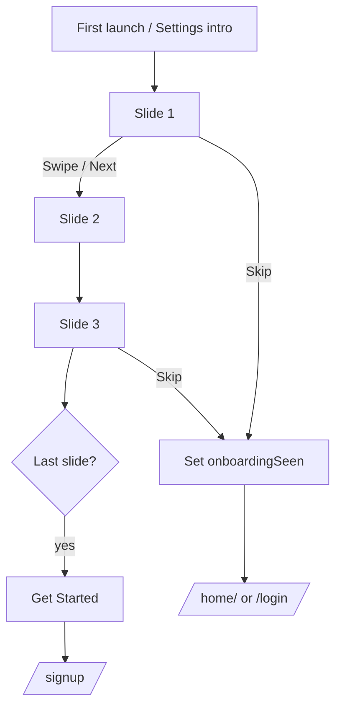

# P02 — Onboarding

## Metadata

| Field | Value |
|---|---|
| Page ID | P02 |
| Platforms | Mobile / Web |
| Roles | Guest (pre-auth; also reachable from Settings) |
| Priority | P0 |
| Route / Path | Mobile: `/onboarding`. Web: `/onboarding` |
| Prototype | `prototypes/shared/onboarding.html` (TBD) |

## Purpose

Onboarding introduces the platform's core value in 3–4 swipeable slides so a
first-time visitor understands what NewsWatch offers (immersive scroll reading,
categories, search, and saving) and reaches a clear "Get Started" entry into
sign-up or browsing. It exists to reduce first-session drop-off, explain the
swipe/scroll reading model up front, and persist a "seen" flag so returning users
skip straight to their destination.

## UI Structure

### Mobile
- **Top region:** "Skip" text button top-right, `space-4` inset, `font-size-nav`,
  `weight-semibold`, `--muted` (turns `--purple` on press).
- **Slide stage:** horizontally paged `FlatList` (`pagingEnabled`, `horizontal`),
  each slide full-width:
  - **Illustration:** Lottie/vector, ~55% of viewport height, centered,
    on a `--purple-light` rounded (`radius-xl`) panel or transparent.
  - **Title:** `font-size-title-sm` (22px), `weight-bold`, `--text`, centered.
  - **Body:** `font-size-body` (15px), `line-height-body`, `--muted-strong`,
    centered, max 2–3 lines.
- **Pagination dots:** centered row, `space-5` above the CTA block; inactive dot
  7px `--border`, active dot expands to an 18px `--purple` pill (`radius-pill`).
- **CTA block:** bottom, `space-6` inset, safe-area aware.
  - Primary button "Next" → becomes "Get Started" on the last slide.
  - Secondary text button "I already have an account" → Login.
- **Swipe affordance:** subtle chevron hint on slide 1, fades after first swipe.
- No bottom tab bar (onboarding sits outside the app shell).

### Web
- **Split layout (desktop ≥1025px):** left half `--purple` brand panel with the
  logo mark and the current slide's title in white; right half `--background`
  with the illustration, body copy, dots, and CTAs centered. This mirrors the
  mobile content 1:1 but uses horizontal space.
- **Top-right:** "Skip" link, `font-size-nav`.
- **Dots:** clickable on web (each dot jumps to its slide).
- **Keyboard:** ArrowLeft/ArrowRight change slides; Enter activates the CTA;
  Tab order follows Skip → slide nav → secondary → primary.

### Responsive behavior
- `xs` (0–390px): illustration height reduced to ~45vh; title 20px.
- `mobile` (≤768px): single-column stacked mobile layout (above).
- `tablet` (769–1024px): centered single column, max-width 480px card with
  `shadow-card` on `--background`.
- `desktop` (≥1025px): split brand/content layout described above.

## Features / Functional Requirements

| ID | Requirement | Priority |
|---|---|---|
| REQ-SYS-010 | Onboarding MUST present 3–4 ordered slides, each with illustration, title, and body. | P0 |
| REQ-SYS-011 | Slides MUST be horizontally swipeable (mobile) and arrow-key navigable (web), one slide at a time. | P0 |
| REQ-SYS-012 | Pagination dots MUST reflect the active slide and update during the swipe gesture. | P0 |
| REQ-SYS-013 | "Next" MUST advance one slide; on the last slide it MUST read "Get Started" and route to P04 Sign Up. | P0 |
| REQ-SYS-014 | "Skip" MUST be available on every slide and MUST mark onboarding seen and route to P07 Home (guest) or P03 Login. | P0 |
| REQ-SYS-015 | Completing or skipping onboarding MUST persist a `onboardingSeen=true` flag (per profile + device) for later launch routing (REQ-SYS-003). | P0 |
| REQ-SYS-016 | "I already have an account" MUST route to P03 Login. | P0 |
| REQ-SYS-017 | Onboarding MUST NOT be shown again after `onboardingSeen=true`, unless re-opened from Settings → "View intro". | P0 |
| REQ-SYS-018 | Slide content MUST be remotely configurable (CMS/config) so copy can change without an app release. | P1 |
| REQ-SYS-019 | Web MUST serve each onboarding slide at a deep link (`/onboarding?slide=2`) for shareable marketing links. | P2 |

## User Interactions

- **Swipe** left/right (mobile) changes slides; `space-3` between slides shows
  the parallax of the illustration (`dur-slow`, `ease-standard`).
- **Tap dot** (web) / **tap Next** jumps to a slide with a `dur-medium` slide
  transition.
- **Press states:** primary button `--purple` → `--purple-dark` on press
  (`dur-fast`); secondary text underlines on hover (web) and tints `--purple`.
- **Skip** (mobile) is a single tap; no confirmation.
- **First-swipe hint** chevron animates `translateX` 4px loop then disappears.
- **Reduced motion:** replace slide parallax with a plain opacity crossfade.

## Validation & Error States

| Field/Action | Rule | Error message |
|---|---|---|
| Slide content fetch | Remote config may fail | (silent) fall back to bundled slide set |
| Get Started | Must route to signup even if offline | Offline banner "You're offline — connect to sign up" |
| Double tap Next | Debounced 300ms | (no error; ignores extra taps) |

## Loading, Empty, Success States

- **Loading:** if slides are fetched remotely, show the brand mark + 3-dot
  loader for up to 2s, then fall back to bundled content.
- **Empty:** never empty; bundled slides guarantee content. If CMS returns zero
  slides with `onboardingSeen=false`, route directly to P07 Home.
- **Success:** last slide CTA reads "Get Started"; tapping it sets
  `onboardingSeen=true` and routes to sign-up.

## User Flow



1. User arrives from splash (first run) or Settings.
2. User swipes through slides or taps Next.
3. Dots track progress; Skip is always available.
4. On the last slide, "Get Started" routes to Sign Up.
5. `onboardingSeen` is persisted so future launches skip onboarding.

## Dependencies

- **Screens:** P01 Splash, P03 Login, P04 Sign Up, P07 Home Feed.
- **Components:** `SlideCarousel`, `PaginationDots`, `PrimaryButton`,
  `TextButton`, `BrandMark`, `LottieIllustration`.
- **Services/stores:** `ConfigStore` (slides, seen flag), `LocalPrefs` (persist),
  `AnalyticsService`.
- **Backend endpoints:** `/api/v1/config`, `/api/v1/onboarding`.

## API / Data Requirements

| Method | Endpoint | Purpose |
|---|---|---|
| GET | `/api/v1/onboarding` | Fetch slide content (order, title, body, media) |
| GET | `/api/v1/config` | Feature flags / bundled slide fallback |

`GET /api/v1/onboarding` response:

```json
{
  "success": true,
  "data": {
    "slides": [
      { "order": 1, "title": "Read the news, one swipe at a time", "body": "Full-screen stories you can flick through.", "mediaUrl": "https://cdn/.../s1.json" },
      { "order": 2, "title": "Your topics, your feed", "body": "Follow categories you care about.", "mediaUrl": "https://cdn/.../s2.json" },
      { "order": 3, "title": "Save now, read later", "body": "Bookmark any story in one tap.", "mediaUrl": "https://cdn/.../s3.json" }
    ],
    "version": 4
  },
  "meta": {},
  "error": null
}
```

## Navigation

| Action | From | To |
|---|---|---|
| Get Started (last slide) | P02 Onboarding | P04 Sign Up |
| I already have an account | P02 Onboarding | P03 Login |
| Skip | P02 Onboarding | P07 Home (guest) |
| View intro (Settings) | P20 Settings | P02 Onboarding |

## Analytics Events

| Event | Trigger | Properties |
|---|---|---|
| `onboarding_view` | Page mount | `entryPoint`, `slideCount` |
| `onboarding_slide_view` | Slide becomes active | `slideIndex`, `slideTitle` |
| `onboarding_skip` | Skip tapped | `slideIndex` |
| `onboarding_complete` | Get Started tapped | `slideCount`, `durationMs` |
| `onboarding_cta_login` | Login link tapped | `slideIndex` |

## Open Questions

- Is onboarding shown before login only, or also before guest browsing?
- Should Skip default destination be Home (guest) or Login?
- How many slides final (3 vs 4)? Copy ownership?
- Should returning logged-in users ever see onboarding again after a major update?
