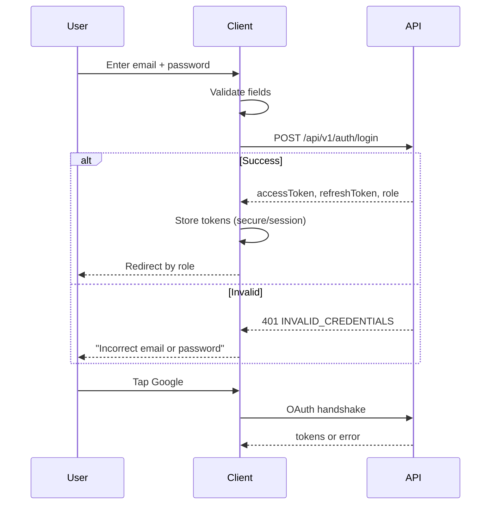

# P03 — Login

## Metadata

| Field | Value |
|---|---|
| Page ID | P03 |
| Platforms | Mobile / Web |
| Roles | Guest |
| Priority | P0 |
| Route / Path | Mobile: `/login`. Web: `/login` |
| Prototype | `prototypes/shared/login.html` (TBD) |

## Purpose

The Login page authenticates returning users via email+password, one-time
password (OTP), or social OAuth (Google/Apple). It restores the user's session
and role-scoped destination (User/Reporter home, Admin console for admins), and
provides clear recovery paths to sign-up and password reset. It exists to be the
single trusted gate into personalised features (bookmarks, comments, following,
reporter tools) while still allowing guest browsing.

## UI Structure

### Mobile
- **Header:** back chevron (if reached from a guarded action) + brand mark,
  `header-height-mobile` (62px) transparent over `--white`.
- **Title block:** "Welcome back" `font-size-title` (24px) `weight-extrabold`,
  subtext "Log in to save, comment and follow." `--muted`, `space-4` inset.
- **Segmented tabs:** "Password" | "OTP", pill segmented control on
  `--purple-light`, active segment `--white` with `shadow-sm`, `radius-md`,
  height 40px.
- **Password tab fields:** Email, Password (with show/hide eye), "Remember me"
  checkbox row, "Forgot password?" link right-aligned.
- **OTP tab fields:** Email or phone, "Send OTP" primary button (turns into
  "Resend in 30s").
- **Primary CTA:** full-width "Log in" button, `--purple`, `radius-md`,
  height 48px, `weight-semibold`.
- **Divider:** "or continue with" with hairlines `--border`.
- **OAuth row:** Google and Apple buttons, outlined `--border`, `radius-md`,
  `space-3` gap, each with brand icon + label.
- **Footer:** "New here? Create account" (`--purple` link) and
  "Continue as guest" (`--muted`).
- No bottom tab bar (auth shell).

### Web
- **Two-column layout (≥1025px):** left `--purple` brand panel with mark,
  tagline, and a subtle radial gradient (`--purple` → `--purple-dark`); right
  centered auth card (max-width 420px) on `--background` with `shadow-card`,
  `radius-xl`, `space-8` padding.
- **Card contents:** same tabs/fields/CTAs as mobile; fields are 44px tall with
  `space-2` focus ring `--purple-light`.
- **Remember me** is a checkbox; "Forgot password?" is a link top-right of the
  password field.
- **Keyboard:** Enter submits the active form; Tab order Email → Password →
  Show → Remember → Forgot → Log in → Google → Apple → Sign up.

### Responsive behavior
- `xs` (0–390px): title 22px, OAuth buttons stack full width, reduced insets.
- `mobile` (≤768px): single-column mobile layout above, sticky CTA optional.
- `tablet` (769–1024px): centered card max-width 440px.
- `desktop` (≥1025px): split brand/auth layout.

## Features / Functional Requirements

| ID | Requirement | Priority |
|---|---|---|
| REQ-AUTH-001 | The page MUST authenticate users with email + password and return access + refresh tokens. | P0 |
| REQ-AUTH-002 | The page MUST offer an OTP tab that sends a 6-digit code to email or phone and routes to P05 OTP. | P0 |
| REQ-AUTH-003 | The page MUST support Google OAuth sign-in and Apple Sign-In on supported platforms. | P0 |
| REQ-AUTH-004 | The page MUST validate email format and require a non-empty password before enabling submit. | P0 |
| REQ-AUTH-005 | "Remember me" MUST, when checked, persist the refresh token in secure storage; when unchecked, use session-only storage. | P0 |
| REQ-AUTH-006 | The page MUST rate-limit and lock repeated failed attempts and show remaining attempts. | P1 |
| REQ-AUTH-007 | On success the page MUST route by role: Admin → admin console (A02), Reporter → R01, User → P07 Home. | P0 |
| REQ-AUTH-008 | The page MUST show distinct errors for invalid credentials, unverified account, and deactivated account. | P0 |
| REQ-AUTH-009 | The page MUST link to P06 Forgot Password and P04 Sign Up. | P0 |
| REQ-AUTH-010 | OAuth failures (cancelled, email missing, provider error) MUST return to this page with a clear, non-blocking message. | P1 |
| REQ-AUTH-011 | The page MUST honour a post-login `redirect` param for guarded deep links. | P1 |
| REQ-AUTH-012 | Admins MUST NOT be able to log in through the public app without the admin flag; show a generic error. | P1 |

## User Interactions

- **Tab switch** animates the active segment with `dur-medium`,
  `ease-standard`; invalidates field errors on switch.
- **Password visibility** eye toggles `secureTextEntry`; icon `--muted` →
  `--purple` when active.
- **Submit:** button shows an inline spinner and becomes disabled (`--purple`
  at 50% opacity, not-allowed cursor on web) while the request is in flight.
- **Input focus (web):** 2px `--purple` ring + `--purple-light` fill.
- **Press states:** buttons `--purple` → `--purple-dark` `dur-fast`.
- **OAuth:** tapping opens the provider system sheet/web popup; the button shows
  a spinner until the redirect resolves.
- **Error shake:** on failed submit the form card shakes `translateX ±6px` twice
  over `dur-medium` (disabled under reduce-motion).

## Validation & Error States

| Field/Action | Rule | Error message |
|---|---|---|
| Email | Required, valid email | "Enter a valid email address" |
| Password | Required, min 8 chars | "Password must be at least 8 characters" |
| Credentials | Server verifies | "Incorrect email or password" |
| Account unverified | Email/phone not verified | "Verify your account to continue" + resend link |
| Account disabled | Admin-deactivated | "This account has been deactivated." |
| Too many attempts | >5 in 10 min | "Too many attempts. Try again in {n} minutes." |
| OTP send | Valid email/phone | "Enter a valid email or phone number" |
| OAuth email missing | Provider returns no email | "We couldn't get your email from Google. Try another method." |
| Network | Request fails/timeout | "Something went wrong. Check your connection." |

## Loading, Empty, Success States

- **Loading:** submit button inline spinner; social buttons disabled; page-level
  skeleton only if a session probe is running.
- **Empty:** N/A (form is always present). OAuth provider list hides gracefully
  if unavailable on the platform.
- **Success:** brief `--success` check overlay (`dur-medium`) then redirect to
  the role destination; a toast "Welcome back, {name}" appears on the
  destination.

## User Flow



1. User arrives from splash, guard redirect, or signup link.
2. User chooses Password, OTP, or OAuth method.
3. Client validates locally, then calls the API.
4. API returns tokens or a typed error.
5. Client stores tokens per "Remember me" and routes by role.

## Dependencies

- **Screens:** P01 Splash, P04 Sign Up, P05 OTP, P06 Forgot Password,
  P07 Home Feed, A02 Admin Dashboard, R01 Reporter Dashboard.
- **Components:** `AuthCard`, `SegmentedTabs`, `TextField`, `PasswordField`,
  `Checkbox`, `PrimaryButton`, `SocialButton`, `Divider`, `FormError`.
- **Services/stores:** `AuthStore`, `SecureStorage`, `OAuthService`,
  `AnalyticsService`, `QueryClient`.
- **Backend endpoints:** `/api/v1/auth/login`, `/api/v1/auth/otp/request`,
  `/api/v1/auth/oauth/google`, `/api/v1/auth/oauth/apple`, `/api/v1/users/me`.

## API / Data Requirements

| Method | Endpoint | Purpose |
|---|---|---|
| POST | `/api/v1/auth/login` | Email + password login |
| POST | `/api/v1/auth/otp/request` | Send OTP to email/phone |
| POST | `/api/v1/auth/oauth/google` | Exchange Google token for session |
| POST | `/api/v1/auth/oauth/apple` | Exchange Apple identity token for session |
| GET | `/api/v1/users/me` | Hydrate profile/role after login |

`POST /api/v1/auth/login` request:

```json
{ "email": "aarav@example.com", "password": "••••••••", "rememberMe": true }
```

Success envelope:

```json
{
  "success": true,
  "data": {
    "accessToken": "<jwt>",
    "refreshToken": "<jwt>",
    "expiresIn": 900,
    "user": { "id": "uuid", "name": "Aarav", "role": "user", "emailVerified": true }
  },
  "meta": {},
  "error": null
}
```

Error envelope:

```json
{ "success": false, "data": null, "error": { "code": "INVALID_CREDENTIALS", "message": "Incorrect email or password", "fields": {} } }
```

## Navigation

| Action | From | To |
|---|---|---|
| Successful login | P03 Login | P07 Home / R01 / A02 (by role) |
| Create account | P03 Login | P04 Sign Up |
| Forgot password | P03 Login | P06 Forgot Password |
| Send OTP | P03 Login | P05 OTP |
| Continue as guest | P03 Login | P07 Home (guest) |
| Guarded deep link | Any guarded page | P03 Login → original target |

## Analytics Events

| Event | Trigger | Properties |
|---|---|---|
| `login_view` | Page mount | `source`, `redirect` |
| `login_method_select` | Tab tapped | `method` |
| `login_submit` | Submit tapped | `method`, `rememberMe` |
| `login_success` | API success | `method`, `role` |
| `login_failure` | API error | `method`, `errorCode` |
| `oauth_start` | Social tapped | `provider` |
| `oauth_result` | Callback | `provider`, `status` |

## Open Questions

- Is phone-only (no email) login supported, and does OTP allow phone?
- Should "Continue as guest" be shown on the web header as well?
- Rate-limit thresholds and lockout policy final values?
- Do admins use a separate A01 login rather than this page? (Index lists A01.)
