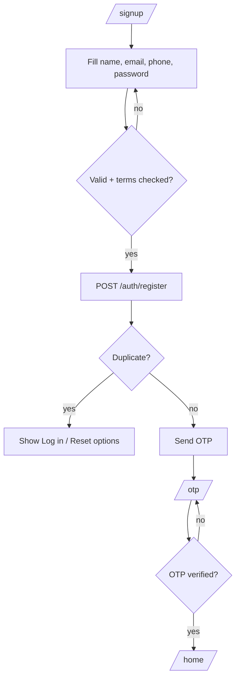

# P04 — Sign Up

## Metadata

| Field | Value |
|---|---|
| Page ID | P04 |
| Platforms | Mobile / Web |
| Roles | Guest |
| Priority | P0 |
| Route / Path | Mobile: `/signup`. Web: `/signup` |
| Prototype | `prototypes/shared/signup.html` (TBD) |

## Purpose

Sign Up creates a new NewsWatch account with name, email, phone, and password,
enforces acceptance of the Terms & Privacy Policy, guides the user through
email/phone OTP verification, and handles duplicate-account and validation
edge cases. It exists to convert first-time visitors into authenticated readers
who can save, comment, follow, and (later) apply to report.

## UI Structure

### Mobile
- **Header:** back chevron → P03 Login, brand mark small, transparent on
  `--white` (`header-height-mobile` 62px).
- **Title block:** "Create your account" `font-size-title` (24px)
  `weight-extrabold`; subtext "Join NewsWatch in a few seconds." `--muted`.
- **Form fields (stacked, `space-4` gap):**
  - Full name — text, autocomplete `name`.
  - Email — email keyboard, autocomplete `email`.
  - Phone — tel keyboard with country-code selector, autocomplete `tel`.
  - Password — with show/hide eye.
  - **Password strength meter:** 4-segment bar under the field; `--error` →
    `--warning` → `--info` → `--success` as strength rises; helper text lists
    unmet rules.
- **Terms row:** checkbox + "I agree to the Terms of Service and Privacy
  Policy" (links open P21).
- **Primary CTA:** "Create account" full-width, `--purple`, `radius-md`,
  48px, disabled until required fields valid and terms checked.
- **Secondary:** "Already have an account? Log in".
- **OTP step:** after submit, transitions in-place (or routes) to P05 OTP with
  the target email/phone shown.
- No bottom tab bar.

### Web
- **Two-column (≥1025px):** left brand panel (`--purple` gradient, value props
  bullet list in white); right centered card (max-width 460px) `shadow-card`,
  `radius-xl`, `space-8`, on `--background`.
- **Field layout:** name/email/phone/password in a single column; phone with
  inline country selector (flag + code).
- **Password strength** shown as a horizontal 4-segment bar plus rule checklist.
- **Keyboard:** Enter advances/submits; focus-visible ring `--purple-light`.
- **OAuth quick path (optional):** Google/Apple buttons above the divider
  ("Or sign up with") to skip OTP when the provider email is verified.

### Responsive behavior
- `xs` (0–390px): title 22px, CTA sticky to bottom safe area.
- `mobile` (≤768px): single column, full-width inputs.
- `tablet` (769–1024px): centered card max-width 480px.
- `desktop` (≥1025px): split brand/form layout.

## Features / Functional Requirements

| ID | Requirement | Priority |
|---|---|---|
| REQ-AUTH-013 | The page MUST collect name, email, phone, password, and terms acceptance to create an account. | P0 |
| REQ-AUTH-014 | Password MUST meet the strength rules (≥8 chars, upper, lower, number, optional symbol) with a live strength meter. | P0 |
| REQ-AUTH-015 | The Terms & Privacy checkbox MUST be required before account creation. | P0 |
| REQ-AUTH-016 | On valid submit the system MUST send an OTP and route to P05 OTP verification. | P0 |
| REQ-AUTH-017 | The page MUST detect duplicate email or phone and offer "Log in" or "Reset password" without losing entered data. | P0 |
| REQ-AUTH-018 | Phone MUST be validated per selected country code and normalised to E.164 before submit. | P1 |
| REQ-AUTH-019 | The page MUST prevent double submission and show an inline loading state. | P0 |
| REQ-AUTH-020 | Users MUST be able to sign up with Google/Apple when the provider returns a verified email (OTP skipped). | P1 |
| REQ-AUTH-021 | On success the account MUST be created in an unverified state until OTP completes. | P0 |
| REQ-AUTH-022 | The page MUST show confirmation of which email/phone the OTP was sent to, with an edit affordance. | P0 |
| REQ-AUTH-023 | The client MUST NOT store the raw password anywhere outside the secure submit call. | P0 |

## User Interactions

- **Field focus (web):** 2px `--purple` ring; error fields get `--error` border
  and `space-2` helper text.
- **Password strength** updates on each keystroke (`dur-fast`), segment fills
  animate width `dur-medium`.
- **Terms link** opens P21 in a new tab (web) / in-app browser (mobile).
- **Submit:** button spinner; fields become read-only for the duration.
- **OTP transition:** the form slides left `dur-slow` and the OTP step slides in
  `ease-standard`; on mobile the same transition runs full-screen.
- **Duplicate email:** non-blocking inline banner with "Log in" and "Reset
  password" actions, preserving entered values.
- **Reduce motion:** transitions become opacity crossfades.

## Validation & Error States

| Field/Action | Rule | Error message |
|---|---|---|
| Full name | Required, 2–60 chars | "Enter your full name" |
| Email | Required, valid, unique | "Enter a valid email address" / "An account with this email already exists" |
| Phone | Required, valid for country, unique | "Enter a valid phone number" / "This phone number is already registered" |
| Password | ≥8, upper, lower, number | "Password must be at least 8 characters" |
| Password confirm (if shown) | Must match password | "Passwords do not match" |
| Terms | Must be checked | "Please accept the Terms to continue" |
| OTP send | Server success | "We couldn't send the code. Try again." |
| Network | Request fails/timeout | "Something went wrong. Check your connection." |

## Loading, Empty, Success States

- **Loading:** disabled form with inline button spinner during account creation;
  a full-page skeleton only if provider config is being fetched.
- **Empty:** N/A — form always present. If OAuth is unsupported on a platform,
  the social row is hidden.
- **Success:** after OTP (P05) completes, account becomes verified; user is
  routed to P07 Home with a toast "Account created" and a one-time prompt to
  follow categories.

## User Flow



1. User arrives from onboarding "Get Started" or login "Create account".
2. User fills the form and accepts terms.
3. Client validates, then POSTs to register.
4. Server creates an unverified account and sends OTP.
5. User verifies OTP (P05) and lands on Home as an authenticated User.

## Dependencies

- **Screens:** P03 Login, P05 OTP, P07 Home Feed, P21 Terms/Privacy.
- **Components:** `AuthCard`, `TextField`, `PhoneField`, `PasswordField`,
  `StrengthMeter`, `Checkbox`, `PrimaryButton`, `SocialButton`, `InlineBanner`.
- **Services/stores:** `AuthStore`, `OtpStore`, `ValidationService`,
  `AnalyticsService`.
- **Backend endpoints:** `/api/v1/auth/register`, `/api/v1/auth/otp/request`,
  `/api/v1/auth/oauth/google`, `/api/v1/auth/oauth/apple`.

## API / Data Requirements

| Method | Endpoint | Purpose |
|---|---|---|
| POST | `/api/v1/auth/register` | Create unverified account, trigger OTP |
| POST | `/api/v1/auth/otp/request` | (Re)send OTP to email/phone |
| POST | `/api/v1/auth/oauth/google` | Passwordless signup via Google |
| POST | `/api/v1/auth/oauth/apple` | Passwordless signup via Apple |
| GET | `/api/v1/meta/countries` | Country codes/dial codes for phone field |

`POST /api/v1/auth/register` request:

```json
{
  "name": "Aarav Sharma",
  "email": "aarav@example.com",
  "phone": "+919876543210",
  "password": "••••••••",
  "acceptedTerms": true
}
```

Success envelope:

```json
{
  "success": true,
  "data": {
    "userId": "uuid",
    "otpChannel": "email",
    "otpTarget": "a***@example.com",
    "verificationRequired": true
  },
  "meta": {},
  "error": null
}
```

Duplicate error envelope:

```json
{
  "success": false,
  "data": null,
  "error": { "code": "DUPLICATE_ACCOUNT", "message": "An account with this email already exists", "fields": { "email": "duplicate" } }
}
```

## Navigation

| Action | From | To |
|---|---|---|
| Successful register | P04 Sign Up | P05 OTP |
| Already have an account | P04 Sign Up | P03 Login |
| Terms / Privacy link | P04 Sign Up | P21 About / Static |
| Duplicate → Log in | P04 Sign Up (banner) | P03 Login |
| Back | P04 Sign Up | P03 Login / P02 Onboarding |

## Analytics Events

| Event | Trigger | Properties |
|---|---|---|
| `signup_view` | Page mount | `source` |
| `signup_field_error` | Validation fails | `field`, `code` |
| `signup_submit` | Submit tapped | `method`, `hasPhone` |
| `signup_success` | Register success | `otpChannel` |
| `signup_duplicate` | Duplicate detected | `field` |
| `signup_oauth_start` | Social tapped | `provider` |
| `terms_opened` | Terms link tapped | `document` |

## Open Questions

- Is phone mandatory, or optional with email-only signup?
- Do we require password confirmation (second field) or single-entry + eye?
- Is OAuth signup enabled at launch or deferred to P1?
- Should duplicate phone vs duplicate email present different copy/actions?
