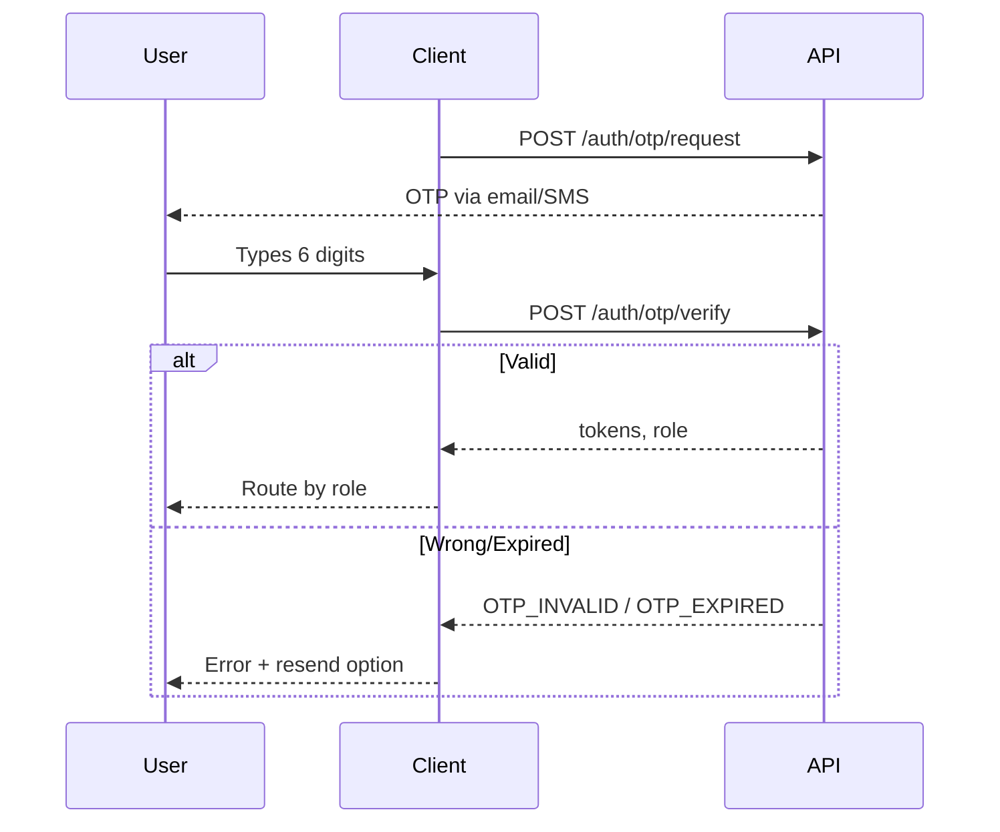

# P05 — OTP Verification

## Metadata

| Field | Value |
|---|---|
| Page ID | P05 |
| Platforms | Mobile / Web |
| Roles | Guest (mid-auth) |
| Priority | P0 |
| Route / Path | Mobile: `/otp?channel=email&target=…`. Web: `/otp` |
| Prototype | `prototypes/shared/otp.html` (TBD) |

## Purpose

OTP Verification confirms ownership of the email or phone supplied during signup
or OTP-based login. It provides a 6-digit code input with auto-advance and
auto-submit, a resend cooldown timer, clear handling of wrong/expired codes, and
an escape hatch to change the number/email. It exists to secure account creation
and passwordless login while keeping the flow fast.

## UI Structure

### Mobile
- **Header:** back chevron → previous auth step; brand mark centered; transparent
  on `--white` (`header-height-mobile` 62px).
- **Title block:** "Verify your email/phone" `font-size-title` (24px)
  `weight-extrabold`; subtext "Enter the 6-digit code we sent to
  **a***@example.com**" `--muted`, with the target in `--text` `weight-semibold`.
- **OTP inputs:** 6 individual boxes, each 48×56px, `radius-md`, `--border`
  default; filled box border `--purple`; focused box 2px `--purple` ring +
  `--purple-light` fill; error state border `--error` with a shake.
- **Resend block:** "Didn't get the code?" `--muted`; a "Resend" text button
  that is disabled and shows "Resend in {n}s" during the 30s cooldown, then
  becomes `--purple` and tappable.
- **Change target:** "Change email/phone" link → returns to P03/P04 with the
  field focused.
- **Primary CTA:** "Verify" full-width `--purple` button, enabled only when all
  6 digits are entered.
- **Alternate channel:** when both email and phone exist, a "Send to phone
  instead" toggle.
- **Auto-submit:** fills the last digit → verification fires automatically.
- No bottom tab bar. A keypad-friendly layout keeps boxes above the keyboard.

### Web
- **Centered auth card** (max-width 420px) `shadow-card`, `radius-xl`,
  `space-8`, on `--background`; brand mark above the card.
- **OTP boxes** are 44×52px with `space-2` gap; paste support fills from the
  active box onward.
- **Keyboard:** digits type/advance; Backspace clears and moves back; left/right
  arrows navigate; Enter submits when complete. Focus-visible ring `--purple`.
- **Resend** shows the same cooldown; disabled cursor `not-allowed`.
- Same alternate-channel and change-target affordances.

### Responsive behavior
- `xs` (0–390px): boxes shrink to 40×50px, `space-2` gap; title 22px.
- `mobile` (≤768px): single-column, sticky CTA above safe area.
- `tablet`/`desktop` (≥769px): centered card, fixed box sizes.

## Features / Functional Requirements

| ID | Requirement | Priority |
|---|---|---|
| REQ-AUTH-024 | The page MUST accept a 6-digit numeric OTP and auto-advance focus as digits are entered. | P0 |
| REQ-AUTH-025 | The page MUST auto-submit when the 6th digit is entered; an explicit "Verify" button MUST also be available. | P0 |
| REQ-AUTH-026 | The OTP MUST expire after 10 minutes; an expired code MUST produce a distinct error and offer resend. | P0 |
| REQ-AUTH-027 | A wrong code MUST increment an attempt counter; after 5 wrong attempts the code MUST be invalidated and resend forced. | P0 |
| REQ-AUTH-028 | "Resend" MUST be cooldown-gated to 30 seconds and show a live countdown. | P0 |
| REQ-AUTH-029 | The page MUST show the masked destination (email/phone) and allow switching channel if both exist. | P0 |
| REQ-AUTH-030 | "Change email/phone" MUST return to P03/P04 with the relevant field focused and previous data preserved. | P0 |
| REQ-AUTH-031 | On success the page MUST complete authentication, store tokens, and route by role. | P0 |
| REQ-AUTH-032 | OTP input MUST be paste-friendly (web) and read the OS SMS autofill code (mobile). | P1 |
| REQ-AUTH-033 | The page MUST be usable without exposing whether an account exists (enumeration-safe copy). | P1 |

## User Interactions

- **Digit entry:** box scales `1.0 → 1.05` for `dur-fast` on fill; caret advances
  automatically.
- **Backspace:** clears current box; a second backspace moves to the previous box.
- **Paste (web):** distributing digits fills all boxes and triggers submit.
- **Auto-submit:** on the 6th digit, boxes briefly show a spinner overlay and
  become read-only (`--muted`) while verifying.
- **Error feedback:** all boxes shake `translateX ±6px` twice and turn
  `--error`; error text appears `space-3` below (`dur-medium`).
- **Resend:** tapping shows an inline spinner, then resets the cooldown and
  clears the boxes for a fresh entry.
- **Success:** boxes turn `--success` then the page crossfades (`dur-slow`) to
  the destination.
- **Reduce motion:** shake replaced by a color pulse; transitions become fades.

## Validation & Error States

| Field/Action | Rule | Error message |
|---|---|---|
| OTP | 6 digits, numeric | "Enter the 6-digit code" |
| OTP (wrong) | Server rejects | "Incorrect code. {n} attempts left." |
| OTP (expired) | >10 min or invalidated | "This code has expired. Request a new one." |
| Attempts exceeded | >5 wrong | "Too many attempts. Request a new code." |
| Resend (cooldown) | <30s since last send | "Please wait {n}s before requesting a new code" |
| Resend (rate cap) | >5 sends/hour | "Too many requests. Try again later." |
| Network | Request fails/timeout | "Something went wrong. Check your connection." |

## Loading, Empty, Success States

- **Loading:** a 2px indeterminate `--purple` bar under the title and box
  read-only state while verifying; resend button shows an inline spinner.
- **Empty:** N/A — the six boxes are always present.
- **Success:** `--success` boxes + check icon, toast "Verified", then route to
  the role destination (P07 / R01 / A02).

## User Flow



1. User arrives from P04 Sign Up or the OTP tab of P03 Login.
2. Code is delivered via email or SMS.
3. User enters the 6 digits; the client auto-submits on completion.
4. Server verifies and returns tokens, or a typed error.
5. Client stores tokens and routes by role.

## Dependencies

- **Screens:** P03 Login, P04 Sign Up, P07 Home Feed, R01, A02.
- **Components:** `OtpInput`, `CountdownResend`, `AuthCard`, `InlineError`,
  `ChannelSwitch`.
- **Services/stores:** `AuthStore`, `OtpStore`, `SecureStorage`,
  `AnalyticsService`.
- **Backend endpoints:** `/api/v1/auth/otp/request`,
  `/api/v1/auth/otp/verify`, `/api/v1/auth/otp/resend`.

## API / Data Requirements

| Method | Endpoint | Purpose |
|---|---|---|
| POST | `/api/v1/auth/otp/request` | Send/switch OTP channel |
| POST | `/api/v1/auth/otp/verify` | Verify OTP, issue tokens |
| POST | `/api/v1/auth/otp/resend` | Resend OTP (cooldown enforced) |

`POST /api/v1/auth/otp/verify` request:

```json
{ "target": "a***@example.com", "channel": "email", "code": "123456", "purpose": "signup" }
```

Success envelope:

```json
{
  "success": true,
  "data": {
    "accessToken": "<jwt>",
    "refreshToken": "<jwt>",
    "expiresIn": 900,
    "user": { "id": "uuid", "role": "user", "emailVerified": true }
  },
  "meta": {},
  "error": null
}
```

## Navigation

| Action | From | To |
|---|---|---|
| OTP verified | P05 OTP | P07 Home / R01 / A02 (by role) |
| Change email/phone | P05 OTP | P04 Sign Up / P03 Login (field focused) |
| Switch channel | P05 OTP | P05 OTP (new target shown) |
| Back | P05 OTP | Previous auth step |

## Analytics Events

| Event | Trigger | Properties |
|---|---|---|
| `otp_view` | Page mount | `channel`, `purpose` |
| `otp_resend` | Resend tapped | `channel`, `resendCount` |
| `otp_submit` | Auto/explicit verify | `channel`, `method` |
| `otp_success` | Verify success | `channel`, `durationMs` |
| `otp_failure` | Verify error | `channel`, `errorCode` |
| `otp_change_target` | Change link tapped | `channel` |

## Open Questions

- Is phone OTP SMS supported at launch, or email-only?
- Auto-submit on entry vs require explicit "Verify" tap for accessibility?
- Cooldown (30s) and attempt limits (5) final values?
- Should there be a visible expiry countdown (10 min), or only on expiry?
