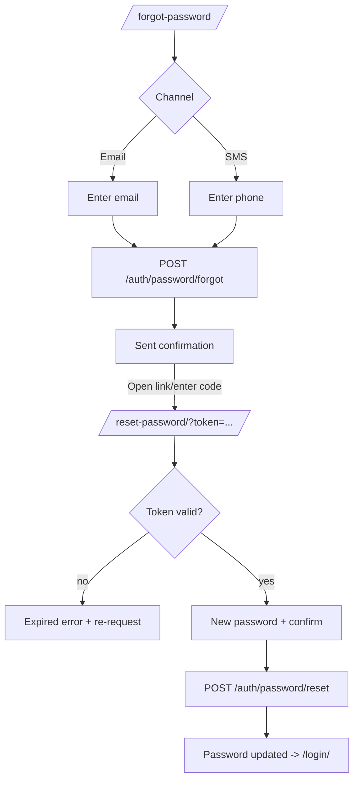

# P06 — Forgot / Reset Password

## Metadata

| Field | Value |
|---|---|
| Page ID | P06 |
| Platforms | Mobile / Web |
| Roles | Guest |
| Priority | P1 |
| Route / Path | Mobile: `/forgot-password`, `/reset-password?token=…`. Web: `/forgot-password`, `/reset-password` |
| Prototype | `prototypes/shared/forgot-password.html` (TBD) |

## Purpose

Forgot / Reset Password lets a user who cannot log in request a reset link or
OTP via email or SMS, then set a new password using a time-limited reset token.
It shows delivery confirmation without revealing whether an account exists,
enforces strong-password rules on the new password with a confirmation field, and
confirms success with a prompt to log in. It exists to recover locked-out users
securely and quickly.

## UI Structure

### Mobile
- **Header:** back chevron → P03 Login; brand mark centered; transparent on
  `--white` (`header-height-mobile` 62px).
- **Step 1 — Request:**
  - Title "Reset your password" `font-size-title` (24px) `weight-extrabold`.
  - Subtext "We'll send a reset link to your email." `--muted`.
  - Channel segmented control: Email | SMS.
  - Single field (Email or Phone based on channel).
  - Primary "Send reset link" (or "Send code") full-width `--purple`.
  - Secondary "Back to login".
- **Step 2 — Sent confirmation:**
  - Success illustration (envelope/SMS, `--purple-light` circle), title "Check
    your inbox", body with masked destination, "Didn't receive it? Resend"
    (30s cooldown), "Try another email/phone".
- **Step 3 — Reset form** (arrived from deep link `/reset-password?token=…`):
  - New password field with show/hide eye + 4-segment strength meter and rule
    checklist.
  - Confirm password field; inline mismatch error.
  - Primary "Update password"; secondary "Back to login".
  - Token validity countdown or immediate expiry error if the link lapsed.

### Web
- **Centered auth card** (max-width 420px) `shadow-card`, `radius-xl`,
  `space-8`, on `--background`; the three steps swap within the same card.
- **Keyboard:** Enter submits; focus ring `--purple-light`; strength meter
  animates per keystroke.
- **Reset deep links** from email/SMS open `/reset-password?token=…`; an expired
  token renders an inline error card with a "Request a new link" CTA.

### Responsive behavior
- `xs` (0–390px): title 22px; controls full width; CTA sticky to safe area.
- `mobile` (≤768px): single-column, keyboard-aware.
- `tablet`/`desktop` (≥769px): centered card, fixed widths.

## Features / Functional Requirements

| ID | Requirement | Priority |
|---|---|---|
| REQ-AUTH-034 | The request step MUST accept an email or phone and send a reset link/OTP through the chosen channel. | P1 |
| REQ-AUTH-035 | The confirmation step MUST always show the same success copy regardless of whether the account exists (enumeration-safe). | P0 |
| REQ-AUTH-036 | Reset tokens MUST be single-use, expire in 30 minutes, and be invalidated after a successful reset. | P0 |
| REQ-AUTH-037 | The reset form MUST require a new password meeting strength rules plus a matching confirmation. | P0 |
| REQ-AUTH-038 | On success the page MUST invalidate all existing sessions and prompt the user to log in with the new password. | P0 |
| REQ-AUTH-039 | The page MUST handle invalid, expired, or already-used tokens with a clear error and re-request CTA. | P0 |
| REQ-AUTH-040 | Resend MUST be cooldown-gated to 30 seconds with a live countdown. | P1 |
| REQ-AUTH-041 | The new password MUST NOT equal the immediately previous password. | P1 |
| REQ-AUTH-042 | The page MUST link back to P03 Login and P04 Sign Up. | P0 |
| REQ-AUTH-043 | The reset form MUST NOT autofill or store the token in logs; the token is read from the URL/fragment once and cleared. | P1 |

## User Interactions

- **Channel switch** animates the segmented control (`dur-medium`); swaps the
  input between email and phone and clears its error.
- **Submit:** button spinner, fields read-only during the request.
- **Step transition:** card content slides `dur-slow` with `ease-standard`
  between Request → Sent → Reset (mobile and web identical).
- **Strength meter** fills segments as the user types; rule checklist items turn
  `--success` with a check when met.
- **Confirm mismatch** shows inline `--error` text and disables submit.
- **Resend** enters cooldown state (disabled, countdown), then re-enables.
- **Reduce motion:** step changes become opacity crossfades.

## Validation & Error States

| Field/Action | Rule | Error message |
|---|---|---|
| Email | Required, valid | "Enter a valid email address" |
| Phone | Required, valid for country | "Enter a valid phone number" |
| Channel | Must be selected | (defaults to email; no error) |
| Reset token | Present, unexpired, unused | "This reset link is invalid or has expired." |
| New password | ≥8, upper, lower, number | "Password must be at least 8 characters" |
| Confirm password | Must match | "Passwords do not match" |
| New = old | Not equal to previous | "Choose a password different from your old one." |
| Resend (cooldown) | <30s | "Please wait {n}s before requesting a new link" |
| Network | Fails/timeout | "Something went wrong. Check your connection." |

## Loading, Empty, Success States

- **Loading:** submit button inline spinner; a page skeleton only while the reset
  token is being validated on deep link.
- **Empty:** N/A — a form is always present. If both channels are unavailable
  (rare), only the supported channel renders.
- **Success:** confirmation step ("Check your inbox") on request; after reset, a
  `--success` panel "Password updated" with a "Log in" CTA to P03.

## User Flow



1. User taps "Forgot password?" on P03 Login.
2. User chooses a channel and submits.
3. Server sends a reset link/code; the page confirms generically.
4. User opens the link, sets a new password, and confirms.
5. Server resets the password, invalidates sessions, and the user logs in.

## Dependencies

- **Screens:** P03 Login, P04 Sign Up, P07 Home Feed.
- **Components:** `AuthCard`, `SegmentedTabs`, `TextField`, `PhoneField`,
  `PasswordField`, `StrengthMeter`, `PrimaryButton`, `SuccessPanel`,
  `InlineError`.
- **Services/stores:** `AuthStore`, `ResetStore`, `ValidationService`,
  `AnalyticsService`.
- **Backend endpoints:** `/api/v1/auth/password/forgot`,
  `/api/v1/auth/password/reset`, `/api/v1/auth/password/validate-token`.

## API / Data Requirements

| Method | Endpoint | Purpose |
|---|---|---|
| POST | `/api/v1/auth/password/forgot` | Send reset link/OTP (email/SMS) |
| GET | `/api/v1/auth/password/validate-token` | Validate reset token on deep link |
| POST | `/api/v1/auth/password/reset` | Set new password using token |

`POST /api/v1/auth/password/forgot` request:

```json
{ "channel": "email", "target": "aarav@example.com" }
```

Success envelope (enumeration-safe):

```json
{
  "success": true,
  "data": { "message": "If an account exists, a reset link has been sent." },
  "meta": {},
  "error": null
}
```

Expired-token error:

```json
{
  "success": false,
  "data": null,
  "error": { "code": "RESET_TOKEN_EXPIRED", "message": "This reset link is invalid or has expired.", "fields": {} }
}
```

## Navigation

| Action | From | To |
|---|---|---|
| Request submitted | P06 Forgot | P06 Sent confirmation |
| Open reset link | Email/SMS | P06 Reset form |
| Reset success | P06 Reset form | P03 Login |
| Back to login | P06 Forgot | P03 Login |
| Re-request (expired) | P06 Reset form | P06 Request step |

## Analytics Events

| Event | Trigger | Properties |
|---|---|---|
| `forgot_view` | Page mount | `channel` |
| `forgot_submit` | Request sent | `channel` |
| `forgot_sent` | API returns | `channel` |
| `reset_view` | Reset form mount | `hasToken` |
| `reset_submit` | Reset submitted | — |
| `reset_success` | Password updated | — |
| `reset_invalid_token` | Token rejected | `reason` |

## Open Questions

- Is SMS reset supported at launch, or email-only?
- Reset token TTL — 30 minutes confirmed?
- Should reset also invalidate the account's OTP codes?
- Do we need a "password changed" security email notification?
