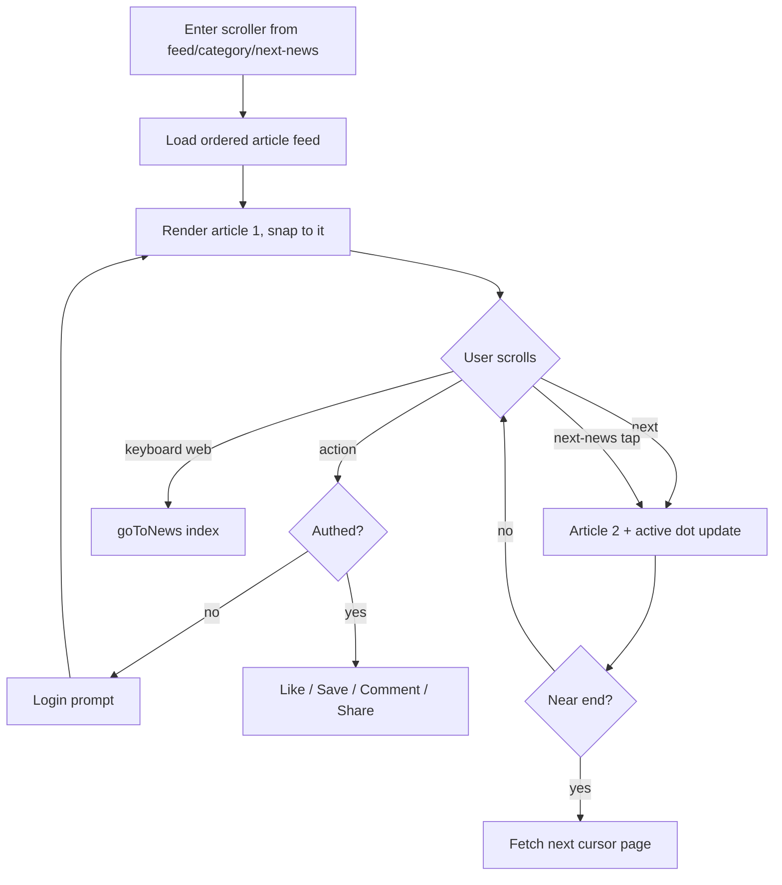

# P08 — News Listing (Scroll Reader)

## Metadata

| Field | Value |
|---|---|
| Page ID | P08 |
| Platforms | Mobile / Web |
| Roles | Guest / User / Reporter / Admin |
| Priority | P0 |
| Route / Path | Mobile: `/scroller?category=&id=`. Web: `/scroller` / `/news` |
| Prototype | `newslistingscreen.html` (canonical reference — read it first) |

## Purpose

The News Listing (Scroll Reader) is the immersive, full-screen scroll-snap
reading experience that defines NewsWatch. Users flick vertically through
complete articles, one card per viewport, with the hero image, category badge,
image counter, title, summary, author/time/views meta, action bar, article body,
and a next-news card. It replaces endless-list browsing with focused, one-story-
at-a-time reading. This page is a **1:1 implementation of `newslistingscreen.html`**
— match its structure, class behaviours, dimensions, and interactions exactly,
then productionise icons, images, and APIs.

## UI Structure

### Mobile (≤768px) — from prototype
- **Header:** fixed, height **62px** (`header-height-mobile`), background
  **`--purple`**, no bottom border, horizontal padding `0 16px`. Logo mark 29px
  white (`logo-icon`, still 20° rotated, white notch recolored `--purple`) +
  "newswatch" 19px `weight-extrabold` white. Right side actions `space-4`
  apart: **mobile icons only** (search `⌕`, overflow `⋮`) at 21px white.
  Desktop nav, search box, and login button are hidden.
- **Scroller:** fixed, `top: 62px`, `bottom: 0`, `overflow-y: auto`,
  `scroll-snap-type: y mandatory`, `scroll-behavior: smooth`, scrollbar hidden.
- **News page (snap section):** `min-height: calc(100vh - 62px)`,
  `scroll-snap-align: start`, `scroll-snap-stop: always`, `padding: 0`,
  `background: white`, `display: block`.
- **News container:** full width, `min-height: calc(100vh - 62px)`,
  `border-radius: 0`, `box-shadow: none`, `display: flex; flex-direction:
  column` (flush, edge-to-edge).
- **Hero image wrapper:** height **300px** (`hero-height-mobile`), flex-shrink 0;
  hero at **270px** on ≤390px (`hero-height-mobile-sm`). Image `object-fit:
  cover`. **Category badge** absolute left 15px / bottom 15px, `--purple`
  background, white 12px `weight-bold`, padding 6px 11px, `radius-sm`.
  **Image counter** absolute right 15px / bottom 15px, `--scrim` background,
  white 12px, padding 6px 10px, `radius-sm` ("1/12").
- **News content:** padding `20px 17px 30px`.
- **Title:** 24px, `line-height: 1.22`, `weight-extrabold`,
  `letter-spacing: -0.5px`, margin-bottom 10px.
- **Summary:** 14px, `line-height: 1.5`, `--muted-strong` (#555),
  margin-bottom 15px.
- **Meta:** flex, gap 10px, `flex-wrap: wrap`, padding-bottom 15px,
  border-bottom `1px solid var(--border)`. Author: 12px `weight-bold` +
  27px `--purple` circle avatar (`avatar`). Meta items (`meta-item`) `--muted`
  11px: `◷ 2h ago`, `◉ 24.8K views`.
- **Actions:** flex, `justify-content: space-between`, padding `13px 0`,
  border-bottom `1px solid var(--border)`. Each `.action-btn`: transparent,
  min-width 55px, column layout, 12px #666. `.action-icon`: 34px circle,
  `1px solid var(--border)`, glyph 15px. Press: `--purple-light` fill +
  `--purple` border/icon.
- **Article body:** padding-top 16px; paragraphs 15px, `line-height: 1.65`,
  `--text-secondary` (#333), margin-bottom 16px.
- **Next-news card:** margin-top 20px, padding 10px, background `#faf7fa`
  (≈`--purple-light`), border `1px solid #eee0ed`
  (`--purple-tint-border`), `radius-lg` (12px), flex row gap 14px.
  Thumbnail 88×64, `radius-md`. "UP NEXT" label `--purple` 11px `weight-extrabold`
  margin-bottom 6px. Title 13px `weight-bold` `line-height: 1.35`. Arrow
  `margin-left:auto`, `--purple` 22px.
- **Scroll indicator:** fixed right 8px, vertically centered, column gap 8px,
  `z-index: 100` (`z-scroll-indicator`). Dots 5px, `--border`/`#ccc`; active dot
  expands to height 18px, `--purple`, `radius-pill`.
- **No bottom tab bar** — the scroller is immersive; a back chevron may be added
  top-left as the only chrome addition (see Open Questions).

### Web (≥769px) — from prototype
- **Header:** fixed, height **68px** (`header-height-web`),
  `rgba(255,255,255,0.97)` background, `1px solid var(--border)` bottom border,
  padding `0 40px`, `z-header`.
  - Logo: `--purple`, 23px `weight-extrabold`, mark 34px.
  - Desktop nav: margin-left 55px, gap 28px, 14px `weight-semibold` #444; hover
    `--purple`.
  - Right actions: gap 15px. **Search box** 230×40 (`search-width`/
    `search-height`), `1px solid var(--border)`, `radius-md` (9px), padding
    `0 13px`, inner input 13px borderless + magnifier glyph. **Login** button
    `--purple`, white, padding `10px 20px`, `radius-md`, `weight-semibold`.
    Mobile icons hidden.
- **Scroller:** fixed `top: 68px`, bottom 0, `scroll-snap-type: y mandatory`,
  smooth, scrollbar hidden.
- **News page:** `min-height: calc(100vh - 68px)`, snap start/always,
  `display: flex; justify-content: center`, `padding: 35px 20px 60px`.
- **News container:** width 100%, `max-width: 900px` (`content-max-width`),
  `--white`, `border-radius: 16px` (`radius-xl`), overflow hidden,
  `shadow-card`.
- **Hero wrapper:** height **470px** (`hero-height-web`). Category badge
  left 24px / bottom 24px; counter right 20px / bottom 20px.
- **News content:** padding `28px 35px 35px`.
- **Title:** 34px, `line-height: 1.15`, `weight-extrabold`, `-0.5px`
  letter-spacing, margin-bottom 14px.
- **Summary:** 17px, `line-height: 1.6`, `--muted-strong`, margin-bottom 20px.
- **Meta / actions / body / next-news** as mobile but with desktop spacing
  (meta gap 15px; action min-width 72px, icons 38px, glyph 17px; body
  paragraphs 16px `line-height: 1.8`; next-news margin-top 30px, padding 14px,
  thumb 105×75).
- **Scroll indicator:** fixed right 25px, vertically centered, gap 8px, dots
  7px; active expands to 24px `--purple` `radius-pill`.
- **Mouse wheel:** one wheel notch snaps to the next/previous page (throttled);
  trackpad native snap retained.
- **Keyboard:** ArrowDown/PageDown = next; ArrowUp/PageUp = previous; Home/End
  optional. `event.preventDefault()` is applied (as in the prototype) so the
  page-level snap is driven by `goToNews(index)`.

### Responsive behavior
- `xs` (0–390px): hero 270px, title 22px, content padding `17px 14px 25px`,
  body 14px.
- `mobile` (≤768px): purple 62px header, flush cards, 300px hero, 5px dots.
- `tablet` (769–1024px): web white header, 470px hero capped by container,
  900px max-width card centered.
- `desktop` (≥1025px): 900px card centered with side gutters, right dot rail.

## Features / Functional Requirements

| ID | Requirement | Priority |
|---|---|---|
| REQ-READ-001 | The reader MUST present one article per viewport with vertical CSS scroll-snap (`y mandatory`, `snap-stop: always`). | P0 |
| REQ-READ-002 | The hero image block MUST show the category badge (bottom-left) and an image counter `current/total` (bottom-right). | P0 |
| REQ-READ-003 | Each article MUST show title, summary, author (avatar + name), relative publish time, and abbreviated view count. | P0 |
| REQ-READ-004 | The action bar MUST expose Like, Comments, Share, and Save with live counts/states. | P0 |
| REQ-READ-005 | The article body MUST render rich paragraphs below the action bar. | P0 |
| REQ-READ-006 | A next-news card MUST link to the following article and, on tap, snap/navigate to it. | P0 |
| REQ-READ-007 | The right-side scroll indicator dots MUST reflect the active article and animate the active dot into a `--purple` pill. | P0 |
| REQ-READ-008 | Web MUST support ArrowDown/ArrowUp and PageDown/PageUp keyboard navigation via `goToNews(index)`. | P0 |
| REQ-READ-009 | Multi-image articles MUST let the user swipe/tap the hero to advance images and update the counter. | P1 |
| REQ-READ-010 | The reader MUST load articles as an ordered cursor feed so swiping past the last loaded article fetches more. | P0 |
| REQ-READ-011 | The reader MUST track a view once per article per session when it becomes ≥65% visible (IntersectionObserver threshold 0.65 as in the prototype). | P0 |
| REQ-READ-012 | The reader MUST restore the last-read article index when re-entering from the same category/session. | P1 |
| REQ-READ-013 | Like/Save MUST require auth; guests get a login prompt without leaving the reader. | P0 |
| REQ-READ-014 | Share MUST generate a deep link (`/article/:slug`) and open the native/OS share UI. | P0 |
| REQ-READ-015 | Article body links MUST open in an in-app browser (mobile) / new tab (web). | P1 |
| REQ-READ-016 | The reader MUST show skeletons for hero/content while an article loads and an error card with retry on failure. | P0 |
| REQ-READ-017 | On mobile, swipe-down from the first article MAY dismiss the reader back to the previous feed (P2). | P2 |
| REQ-READ-018 | Reading progress per article MUST be recorded for resume and analytics. | P1 |

## User Interactions

- **Vertical swipe/wheel:** advances exactly one article per gesture. Snap
  transition uses `scroll-behavior: smooth` (`scroll-behavior` token),
  `scroll-snap-stop: always` prevents skipping two.
- **Active-dot update:** the IntersectionObserver (root = scroller,
  `threshold: 0.65`) toggles `active` on the matching dot and dims others
  (`dur-medium`).
- **Action buttons (mobile):** press fills the 34px circle `--purple-light` and
  recolors the glyph `--purple`; (web) hover does the same plus a small lift.
  Like applies a heart bounce (`dur-medium`); active like/save switch to filled
  `--purple` icons.
- **Hero image (multi-image):** horizontal swipe paging inside the wrapper;
  counter updates `n/total`; pinch-to-zoom (mobile, P2).
- **Next-news tap:** `goToNews(currentIndex + 1)` via
  `scrollIntoView({ behavior: "smooth", block: "start" })` (as in prototype);
  the card press scales `0.99`.
- **Keyboard (web):** ArrowDown/PageDown → `goToNews(min(current+1, last))`;
  ArrowUp/PageUp → `goToNews(max(current-1, 0))`; both `preventDefault`.
- **Comments:** opens P16 as a bottom sheet (mobile) / side panel (web) with the
  article context.
- **Share:** OS share sheet / copy-link popover with `--purple` toast "Link
  copied".
- **Pull-up at end:** when `meta.hasMore` is true, reaching the last article
  fetches the next page; a 3-dot `--purple` loader fills the viewport briefly.
- **Reduced motion:** disable smooth snap (instant), keep fade states.

## Validation & Error States

| Field/Action | Rule | Error message |
|---|---|---|
| Article fetch | Must return published article | "Couldn't load this story" + Retry |
| Feed cursor | Valid UUID cursor | Silent stop; footer "No more stories" |
| Like/Save (guest) | Auth required | "Log in to like and save stories" + Log in |
| Like/Save API fail | Optimistic revert | "Couldn't update. Try again." |
| Share deep link | Valid slug | Fallback to current URL |
| Image load | CDN reachable | `--background` placeholder + alt text |
| Offline | No connectivity | "You're offline — cached stories only" |
| Comment post | Auth + body | "Log in to comment" |

## Loading, Empty, Success States

- **Loading:** full-viewport skeleton mirroring the article: 470/300px
  `--background` hero shimmer, title/summary/meta/action bars, 3 body lines;
  the next article's skeleton pre-renders during fetch.
- **Empty:** if the category/feed has no articles, a centered illustration +
  "No stories to read" + "Browse categories" CTA (and "Back to Home").
- **Error:** a card with `--error` icon, "Couldn't load this story", and a
  "Retry" button; the scroller remains usable for already-loaded articles.
- **Success:** articles render flush; the dot rail reflects position; next-news
  is available on the last card; view is recorded at 65% visibility.

## User Flow



1. User arrives from the Home feed, a category, search, or a next-news tap.
2. The scroller loads the ordered article set and snaps to the target article.
3. Swiping moves one article at a time; dots and view tracking update.
4. Actions engage or prompt login; the next-news card advances the reader.
5. Reaching the end pulls the next cursor page, keeping the immersion unbroken.

## Dependencies

- **Screens:** P07 Home Feed, P09 Article Detail, P10 Categories,
  P11 Category Listing, P12 Search, P15 Bookmarks, P16 Comments, P03 Login.
- **Components:** `ScrollReader`, `NewsPage`, `HeroGallery`, `CategoryBadge`,
  `ImageCounter`, `ArticleMeta`, `ReaderActionBar`, `ArticleBody`,
  `NextNewsCard`, `ScrollIndicator`, `ReaderSkeleton`, `ReaderError`.
- **Services/stores:** `ReaderStore`, `FeedStore`, `LikeStore`,
  `BookmarkStore`, `AuthStore`, `ViewTracker`, `ShareService`,
  `AnalyticsService`.
- **Backend endpoints:** `/api/v1/articles`, `/api/v1/articles/:id`,
  `/api/v1/articles/:id/view`, `/api/v1/articles/:id/like`,
  `/api/v1/bookmarks`, `/api/v1/comments`.

## API / Data Requirements

| Method | Endpoint | Purpose |
|---|---|---|
| GET | `/api/v1/articles?cursor=&limit=&category=` | Ordered feed for the scroller |
| GET | `/api/v1/articles/:id` | Full body + image gallery for one article |
| POST | `/api/v1/articles/:id/view` | Record a view (once per session) |
| POST | `/api/v1/articles/:id/like` | Like/unlike |
| POST | `/api/v1/bookmarks` | Save/unsave |
| GET | `/api/v1/comments?articleId=&cursor=` | Comments preview for the sheet |

`GET /api/v1/articles/:id` response:

```json
{
  "success": true,
  "data": {
    "id": "uuid",
    "slug": "pm-modi-inaugurates-projects",
    "title": "PM Modi Inaugurates New Infrastructure Projects in Andhra Pradesh",
    "summary": "The Prime Minister laid the foundation stone for several infrastructure projects...",
    "category": { "id": "uuid", "name": "India", "slug": "india" },
    "author": { "id": "uuid", "name": "NewsWatch", "avatar": null },
    "publishedAt": "2026-09-22T08:15:00Z",
    "viewCount": 24800,
    "likeCount": 1200,
    "commentCount": 48,
    "images": [
      { "url": "https://cdn/.../hero-1120.jpg", "width": 1400, "height": 788, "alt": "News" }
    ],
    "body": [
      { "type": "paragraph", "text": "Andhra Pradesh, Oct 12: Prime Minister Narendra Modi on Saturday inaugurated..." },
      { "type": "paragraph", "text": "The projects include new roads, rail connectivity, industrial corridors..." }
    ],
    "nextNews": { "id": "uuid", "slug": "india-vs-australia-3rd-odi", "title": "India vs Australia 3rd ODI: Rohit, Kohli Make It Count", "image": "https://cdn/.../next.jpg" }
  },
  "meta": {},
  "error": null
}
```

## Navigation

| Action | From | To |
|---|---|---|
| Enter scroller | P07 feed card / P11 / P13 / next-news | P08 News Listing |
| Next-news tap | P08 | P08 (next article, same feed) |
| Comments | P08 | P16 Comments (sheet/panel) |
| Share | P08 | OS share / P09 deep link |
| Back / close (web) | P08 | Previous feed |
| Login prompt | P08 guest action | P03 Login (returns to reader) |
| Category badge tap | P08 | P11 Category Listing |

## Analytics Events

| Event | Trigger | Properties |
|---|---|---|
| `reader_view` | Scroller mount | `entry`, `category`, `feedSize` |
| `reader_article_view` | Article ≥65% visible | `articleId`, `index`, `category` |
| `reader_article_dwell` | Article changes/unmount | `articleId`, `dwellMs`, `scrollDepth` |
| `reader_next` | Scroll/keyboard/next-card | `fromIndex`, `toIndex`, `method` |
| `reader_action` | Like/Save/Comment/Share | `articleId`, `action`, `state` |
| `reader_image_view` | Image counter change | `articleId`, `imageIndex`, `total` |
| `reader_end_reached` | Last loaded article | `feedSize`, `hasMore` |
| `reader_load_failure` | Fetch error | `articleId`, `code` |

## Open Questions

- Is P08 the default reader (vs P09)? The prototype implies immersive-first.
- Should the mobile header stay purple in the reader or turn white like the web
  article scroller to maximise reading area?
- Add an explicit back chevron on mobile (prototype has none)?
- Multi-image gallery interaction on desktop: arrows, thumbnails, or swipe?
- Mouse-wheel snap throttle value to avoid over-advancing on trackpads?
- Default feed size before first next-page fetch (12 as in the prototype's
  "1/12" counter, or 10/20)?
