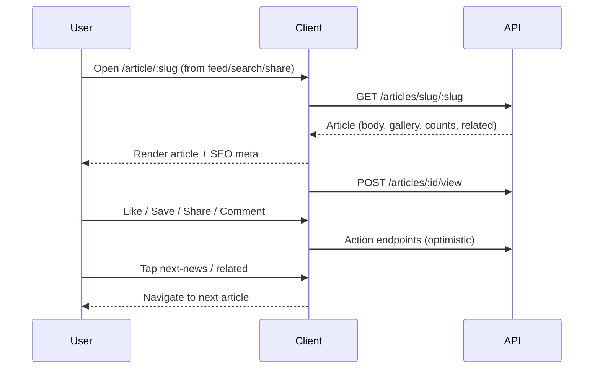

# P09 — Article Detail / Reader

## Metadata

| Field | Value |
|---|---|
| Page ID | P09 |
| Platforms | Mobile / Web |
| Roles | Guest / User / Reporter / Admin |
| Priority | P0 |
| Route / Path | Mobile: `/article/:slug`. Web: `/article/:slug` (SSR/ISR for SEO) |
| Prototype | `newslistingscreen.html` (article card anatomy reused), `prototypes/article/detail.html` (TBD) |

## Purpose

The Article Detail page is the canonical, addressable article surface: a single
story with its own URL/slug, hero **image or video** media (inline player) plus
a mixed image/video gallery, rich formatted body, author and timestamps,
share/like/bookmark actions, comments entry, related and next-news cards,
deep-link sharing, and (on web) full SEO metadata and reading progress.
Unlike the immersive scroll reader (P08), this page is linked, shareable, and
optimised for direct arrival from search, social, notifications, and the web.
It exists to give every article a stable, crawlable, engaging home.

## UI Structure

### Mobile
- **Header:** height 62px (`header-height-mobile`); `--white` surface with a
  bottom `1px solid var(--border)` and a subtle blur/scrim so text remains legible
  while scrolling. Left: back chevron. Center: article category label
  (`font-size-meta`, `--muted`). Right: share icon + overflow `⋮`. The header
  transitions from transparent-over-hero to solid white after the hero scrolls
  out (`dur-medium`).
- **Hero media:** full-bleed, aspect ratio ~16:9, height 300px (270px on
  ≤390px). If the hero is an **image**, it behaves as a paged image gallery with
  dots; category badge bottom-left (`--purple`, white, `radius-sm`), media
  counter bottom-right (`--scrim`, white, e.g. "2/6"). If the hero is a
  **video**, an inline `<video>` player (native controls) fills the slot: the
  generated **poster** is shown until play, a **duration badge** sits
  bottom-right, and fullscreen is supported; autoplay is muted when the user's
  "Autoplay video on Wi‑Fi" setting is on (P20), otherwise it waits for a tap.
  Image tap opens a full-screen lightbox with pinch-zoom and swipe. If a
  data-saver setting is on, video does not autoplay and shows a "Tap to play"
  overlay with a data-saver note.
- **Article head (padding `space-4`):**
  - Title 24px `weight-extrabold`, `line-height: 1.22`, `-0.5px`.
  - Summary 15px, `line-height-body`, `--muted-strong`.
  - Author row: avatar 27px (`--purple` circle), author name `font-size-meta`
    `weight-bold`, verified badge if applicable; follow button (P1) `--purple`
    outline.
  - Meta row (`--muted`, `font-size-meta`, `space-2` gaps): published relative
    time (e.g. "2h ago") + full datetime on tap, reading time ("4 min read"),
    view count (`◉ 24.8K views`).
- **Action bar (sticky under header on scroll or inline below meta):**
  Like (heart + count), Comments (count), Share, Bookmark. 34px circles
  `--purple-light` on press; active states filled `--purple`.
- **Body:** rich content blocks — paragraphs 16px `line-height-body`,
  `--text-secondary`; H2/H3 headings `weight-bold` `--text`; blockquotes with
  `--purple` left border; unordered/ordered lists; inline images with captions;
  embedded tweets/videos (responsive 16:9); inline links `--purple` underlined on
  hover. **Gallery media** (mixed images/videos) render inline in the body where
  the article places them: videos use the same native-controls player, poster
  first frame, duration badge, and fullscreen support. Body padding `space-4`,
  bottom `space-9`.
- **Tags row:** `radius-pill` chips on `--purple-light`, tap → P13 search results
  for that tag.
- **Comments entry:** "Comments (48)" section header with a "View all" link →
  P16; shows the top 2 comments inline with a compact composer prompt; tapping
  the composer opens P16 with the keyboard focused.
- **Related / Next news:** "More from {category}" horizontal `ScrollView` of
  compact cards (`radius-lg`) and/or a full-width next-news card matching P08
  (`--purple-light`, `--purple-tint-border`, thumb 88×64, "UP NEXT").
- **Bottom:** "Back to top" floating action (appears after scroll, `z-header`),
  and the S02 bottom tab bar (this page is inside the tab shell, unlike P08).
- **Reading progress:** a 2px `--purple` bar pinned to the top under the header,
  width = `scrollTop / (scrollHeight - clientHeight)`.

### Web
- **Header:** the 68px (`header-height-web`) white web header from
  `newslistingscreen.html`: purple logo + wordmark, desktop nav
  (Home/Categories/Search/About), 230×40 search box, Login/avatar. A 2px
  `--purple` reading-progress bar sits along the bottom edge of the header.
- **Layout (≥1025px):** centered article column max-width `content-max-width`
  (900px) on `--background`, with an optional sticky right rail (≥1280px) for
  "Related" and a share/back-to-top cluster.
- **Article container:** `--white`, `radius-xl`, `shadow-card`, hero 470px
  (`hero-height-web`), content padding `28px 35px 35px` — matching the prototype
  card exactly.
- **Hero media:** arrow controls on hover + thumbnail strip for galleries;
  counter and category badge as mobile; click opens a lightbox (`z-modal`).
  Video hero renders an inline HTML5 `<video>` (progressive MP4 H.264/AAC +
  WebM) with native controls, poster frame,
  duration badge, and fullscreen; keyboard `Space`/`K` play-pause, `F`
  fullscreen, `M` mute when the player is focused.
- **Typography:** title 34px `line-height: 1.15` `-0.5px`; summary 17px;
  body 16px `line-height: 1.8`.
- **Action bar:** horizontal with labels (Like 1.2K, Comments, Share, Save);
  38px icon circles, hover `--purple-light` + `--purple`.
- **Share:** OS share (mobile web) / popover with copy-link, X/Twitter, Facebook,
  WhatsApp, LinkedIn, and "Copy link"; deep link `https://newswatch.app/article/:slug`
  with UTM params.
- **SEO:** server-rendered `<title>`, `<meta name="description">` (summary),
  canonical URL, Open Graph (`og:title`, `og:description`, `og:image`,
  `og:type=article`), Twitter card, `article:published_time`,
  `article:author`, `article:section`, and JSON-LD `NewsArticle` schema.
- **Keyboard:** `←`/`→` navigate gallery when focused; `S` opens share; Space/
  PageDown scrolls; `Home` jumps to top.

### Responsive behavior
- `xs` (0–390px): hero 270px, title 22px, body 15px, action labels hidden
  (icons only).
- `mobile` (≤768px): white blurred header, tab bar visible, inline comments
  preview.
- `tablet` (769–1024px): 900px column centered, no right rail.
- `desktop` (≥1025px): 900px column + optional 280px sticky right rail.

## Features / Functional Requirements

| ID | Requirement | Priority |
|---|---|---|
| REQ-READ-019 | The page MUST render a single article by slug at `/article/:slug` and 404 gracefully for unknown slugs. | P0 |
| REQ-READ-020 | The page MUST show a hero that MAY be an image or a video, with category badge and media counter; image heroes support gallery swipe/arrow navigation and lightbox. | P0 |
| REQ-READ-021 | The page MUST render rich body blocks (paragraph, heading, quote, list, image, embed) preserving formatting. | P0 |
| REQ-READ-022 | The page MUST display author (avatar, name, verified), published/updated timestamps, reading time, and views. | P0 |
| REQ-READ-023 | The page MUST expose Like, Comment, Share, and Bookmark with optimistic state and auth gating. | P0 |
| REQ-READ-024 | The page MUST show a comments entry point with count and a preview linking to P16. | P0 |
| REQ-READ-025 | The page MUST show related articles and a next-news card. | P0 |
| REQ-READ-026 | The page MUST generate and expose deep links with Open Graph/Twitter meta and JSON-LD `NewsArticle` on web. | P0 |
| REQ-READ-027 | The page MUST display a reading-progress indicator reflecting scroll depth. | P1 |
| REQ-READ-028 | The page MUST track a view once per article per session and increment `viewCount`. | P0 |
| REQ-READ-029 | The page MUST support follow-author action for logged-in users. | P1 |
| REQ-READ-030 | The page MUST open body links in an in-app browser (mobile) / new tab (web) with safe `rel`. | P1 |
| REQ-READ-031 | The page MUST record reading progress per article for resume and analytics. | P1 |
| REQ-READ-032 | Unknown/removed articles MUST return a 404 state with "Browse latest news" CTA. | P0 |
| REQ-READ-033 | A video hero MUST play inline with native controls (play/pause, seek, volume, fullscreen) and MUST NOT require leaving the page. | P0 |
| REQ-READ-034 | A video MUST display its generated **poster** until playback begins (no blank/black frame at first paint). | P0 |
| REQ-READ-035 | A video MAY autoplay **muted** when the user's autoplay setting allows; otherwise it waits for an explicit tap. | P1 |
| REQ-READ-036 | Video playback MUST support fullscreen on mobile and web. | P0 |
| REQ-READ-037 | When **data saver** is enabled, video MUST NOT autoplay, MUST show a "Tap to play" overlay with a data-saver note, and MUST prefer the lower-bitrate MP4 rendition (P20). | P1 |
| REQ-READ-038 | Mixed gallery items MUST render images and videos inline, with a duration badge and play affordance on video thumbnails. | P0 |
| REQ-READ-039 | The page MUST emit **per-media analytics** (impression, play, progress quartiles, completion, error) keyed by `mediaId`. | P1 |
| REQ-READ-040 | Video playback failures MUST show a poster fallback with an error state and a "Retry" affordance. | P1 |

## User Interactions

- **Header transition:** as the hero scrolls out, the header background
  crossfades transparent → `--white` and the title collapses into the center
  label (`dur-medium`).
- **Gallery:** swipe (mobile) / arrows + thumbnails (web) change images with a
  `dur-medium` slide; counter updates; tap opens lightbox (pinch-zoom, double-tap
  zoom, swipe to dismiss on mobile). Video items play inline in place of the
  thumbnail with native controls and a duration badge.
- **Play hero video:** tap the poster (or the control) to start; playback shows
  the poster until play, and offers play/pause, seek, volume, and fullscreen.
  When autoplay-muted is enabled, playback starts muted and a mute/unmute control
  is prominent. With data saver on, a "Tap to play" overlay and data-saver note
  appear and the lower-bitrate rendition is used.
- **Like:** heart bounce + optimistic count; guests get a login sheet.
- **Bookmark:** fills `--purple`, toast "Saved" with Undo (`z-toast`).
- **Share:** opens share surface; on copy, toast "Link copied".
- **Comments:** tapping the entry opens P16 as a sheet (mobile) / side panel
  (web); the inline composer focuses on tap.
- **Reading progress:** the top bar width follows scroll (`requestAnimationFrame`
  throttled); "Back to top" FAB fades in after 1 viewport.
- **Follow author:** button toggles Following state (`--purple` filled) with
  optimistic update.
- **Tag tap:** routes to P13 with the tag as the query.
- **Hover (web):** headings and cards lift `shadow-sm`; links underline.
- **Reduced motion:** disable parallax/bounce; keep fades.

## Validation & Error States

| Field/Action | Rule | Error message |
|---|---|---|
| Slug | Must exist and be published | 404 page "This story isn't available" + CTA |
| Article fetch | Success within 10s | "Couldn't load this story" + Retry |
| Like/Save | Auth required | "Log in to like and save" |
| Like/Save API fail | Optimistic revert | "Couldn't update. Try again." |
| Comment post | Auth + non-empty body | "Log in to comment" / "Comment can't be empty" |
| Share link | Valid slug | Fallback to current page URL |
| Image load | CDN reachable | Placeholder + alt text |
| Video poster load | Poster URL reachable | Show `--background` placeholder with a play affordance |
| Video playback | Media file reachable and decodable | Poster fallback + "Video unavailable" + Retry |
| Video autoplay blocked | Browser/user blocks autoplay | Start muted or show "Tap to play" |
| Data saver | User enabled data saver | No autoplay; "Tap to play" overlay + data-saver note |
| Embedded media | Provider available | "Media unavailable" fallback card |

## Loading, Empty, Success States

- **Loading:** hero shimmer + title/summary/meta/action/body line skeletons in
  the article container; a 2px indeterminate `--purple` bar under the header.
  A video hero shows a **poster skeleton** (blurred placeholder) and an inline
  loading spinner until the media file and poster resolve; gallery video tiles
  show a spinner over their poster skeleton.
- **Playback error:** if a video stream fails, the poster remains with a
  "Video unavailable" overlay and a "Retry" button.
- **Empty:** N/A for a valid article; if the author has no related articles,
  the related section is hidden rather than empty.
- **Error/404:** centered `--error` illustration, "This story isn't available",
  "Browse latest news" CTA → P07.
- **Success:** fully rendered article, meta/share present, comments preview and
  related/next populated; web shows complete SEO meta in the document head.

## User Flow



1. User arrives from feed, search results, notification, or a shared deep link.
2. Client fetches the article by slug and renders it (SSR/ISR on web).
3. A view is recorded; reading progress and dwell are tracked.
4. User engages (like/save/share/comment/follow) with optimistic updates.
5. User continues via related or next-news, or returns to the feed.

## Dependencies

- **Screens:** P07 Home Feed, P08 News Listing, P13 Search Results, P15 Bookmarks,
  P16 Comments, P17 Notifications, P18 Profile (author), P03 Login.
- **Components:** `ArticleHeader`, `HeroMedia`, `HeroGallery`, `VideoPlayer`,
  `DurationBadge`, `Lightbox`, `ArticleMeta`, `FollowButton`,
  `ArticleActionBar`, `RichBodyRenderer`, `MediaGallery`, `TagList`,
  `CommentsPreview`, `RelatedCarousel`, `NextNewsCard`, `ReadingProgress`,
  `ShareSheet`, `BackToTop`, `SeoHead` (web).
- **Services/stores:** `ArticleStore`, `MediaStore` (video playback state,
  poster, data-saver), `LikeStore`, `BookmarkStore`, `CommentStore`,
  `FollowStore`, `ViewTracker`, `MediaPlaybackTracker`, `ShareService`,
  `AuthStore`, `AnalyticsService`, `SettingsStore` (autoplay/data-saver, P20).
- **Backend endpoints:** `/api/v1/articles/slug/:slug`,
  `/api/v1/articles/:id/view`, `/api/v1/articles/:id/like`,
  `/api/v1/bookmarks`, `/api/v1/comments`, `/api/v1/articles/:id/related`,
  `/api/v1/users/:id/follow`; video posters/streams are served from
  `CDN_BASE_URL` (MP4/WebM), with poster URLs supplied in `heroMedia`/`media`.

## API / Data Requirements

| Method | Endpoint | Purpose |
|---|---|---|
| GET | `/api/v1/articles/slug/:slug` | Full article by slug, incl. `heroMedia` + mixed `media` (SSR/ISR on web) |
| GET | `/api/v1/articles/:id` | Full article by id |
| POST | `/api/v1/articles/:id/view` | Record a view |
| POST | `/api/v1/articles/:id/like` | Like/unlike |
| POST | `/api/v1/bookmarks` / DELETE `/api/v1/bookmarks/:articleId` | Save/unsave |
| GET | `/api/v1/comments?articleId=&cursor=&limit=2` | Comments preview |
| GET | `/api/v1/articles/:id/related` | Related articles |
| POST | `/api/v1/users/:id/follow` | Follow/unfollow author |

`GET /api/v1/articles/slug/:slug` response:

```json
{
  "success": true,
  "data": {
    "id": "uuid",
    "slug": "pm-modi-inaugurates-projects",
    "title": "PM Modi Inaugurates New Infrastructure Projects in Andhra Pradesh",
    "summary": "The Prime Minister laid the foundation stone for several infrastructure projects...",
    "category": { "id": "uuid", "name": "India", "slug": "india" },
    "author": { "id": "uuid", "name": "NewsWatch", "avatar": null, "verified": true, "following": false },
    "publishedAt": "2026-09-22T08:15:00Z",
    "updatedAt": "2026-09-22T09:00:00Z",
    "readingMinutes": 4,
    "viewCount": 24800,
    "likeCount": 1200,
    "commentCount": 48,
    "liked": false,
    "saved": false,
    "heroMedia": {
      "mediaId": "m_123",
      "kind": "video",
      "posterUrl": "https://cdn/.../hero-poster.jpg",
      "playbackUrl": "https://cdn/.../hero-1080.mp4",
      "webmUrl": "https://cdn/.../hero-1080.webm",
      "durationSec": 84,
      "width": 1920,
      "height": 1080,
      "alt": "Rescue boats in a flooded street",
      "captionsUrl": null
    },
    "images": [
      { "url": "https://cdn/.../hero-1120.jpg", "width": 1400, "height": 788, "alt": "News" }
    ],
    "media": [
      { "mediaId": "m_124", "kind": "image", "url": "https://cdn/.../g1.jpg", "width": 1200, "height": 800, "alt": "Drainage work" },
      { "mediaId": "m_125", "kind": "video", "posterUrl": "https://cdn/.../g2-poster.jpg", "playbackUrl": "https://cdn/.../g2.mp4", "webmUrl": null, "durationSec": 156, "width": 1280, "height": 720, "alt": "On-site interview" }
    ],
    "body": [
      { "type": "paragraph", "text": "Andhra Pradesh, Oct 12: Prime Minister Narendra Modi..." },
      { "type": "heading", "level": 2, "text": "Projects across districts" },
      { "type": "paragraph", "text": "The projects include new roads, rail connectivity..." }
    ],
    "tags": ["India", "Infrastructure", "Modi"],
    "related": [
      { "id": "uuid", "slug": "sensex-rises-700-points", "title": "Sensex Rises 700 Points on Positive Global Cues", "image": "https://cdn/.../r1.jpg" }
    ],
    "nextNews": { "id": "uuid", "slug": "india-vs-australia-3rd-odi", "title": "India vs Australia 3rd ODI: Rohit, Kohli Make It Count", "image": "https://cdn/.../next.jpg" }
  },
  "meta": {},
  "error": null
}
```

Web SEO document head (derived):

```html
<title>PM Modi Inaugurates New Infrastructure Projects — NewsWatch</title>
<meta name="description" content="The Prime Minister laid the foundation stone..." />
<link rel="canonical" href="https://newswatch.app/article/pm-modi-inaugurates-projects" />
<meta property="og:type" content="article" />
<meta property="og:title" content="PM Modi Inaugurates New Infrastructure Projects..." />
<meta property="og:image" content="https://cdn/.../hero-1120.jpg" />
<script type="application/ld+json">{"@context":"https://schema.org","@type":"NewsArticle",...}</script>
```

## Navigation

| Action | From | To |
|---|---|---|
| Open article | P07 feed / P13 results / P17 notification / deep link | P09 Article Detail |
| Next-news tap | P09 | P09 (next article) |
| Related card tap | P09 | P09 (related article) |
| Comments | P09 | P16 Comments |
| Tag tap | P09 | P13 Search Results (tag query) |
| Author tap | P09 | P18 Profile (author) |
| Guest action | P09 | P03 Login (returns to article) |
| 404 CTA | P09 | P07 Home Feed |
| Share | P09 | OS share / copy link |

## Analytics Events

| Event | Trigger | Properties |
|---|---|---|
| `article_view` | Page mount | `articleId`, `slug`, `source`, `category` |
| `article_dwell` | Unmount/navigation | `articleId`, `dwellMs`, `maxScrollDepth` |
| `article_action` | Like/Save/Share/Comment/Follow | `articleId`, `action`, `state` |
| `article_gallery_view` | Image/media change/lightbox | `articleId`, `mediaId`, `kind`, `index`, `total` |
| `article_video_impression` | Video hero/gallery item in view | `articleId`, `mediaId`, `context` (hero/gallery), `durationSec` |
| `article_video_play` | Playback starts | `articleId`, `mediaId`, `context`, `autoplay`, `muted`, `dataSaver` |
| `article_video_progress` | 25/50/75% reached | `articleId`, `mediaId`, `quartile`, `positionSec` |
| `article_video_complete` | Playback completes | `articleId`, `mediaId`, `watchedSec`, `durationSec` |
| `article_video_error` | Playback/poster error | `articleId`, `mediaId`, `reason` |
| `article_related_click` | Related card tap | `articleId`, `targetId`, `position` |
| `article_next_click` | Next-news tap | `articleId`, `targetId` |
| `article_tag_click` | Tag tap | `tag` |
| `article_share` | Share completed | `articleId`, `channel` |
| `article_404` | Unknown slug | `slug` |

## Open Questions

- Is `/article/:slug` the canonical URL, with P08 as a mode, or are P08/P09
  distinct routes sharing one data layer?
- Right rail on desktop — in v1 or P2?
- Inline comment composer vs preview-only (full comments in P16)?
- Gallery on desktop: thumbnail strip, dots, or both?
- Do reporters/admins see an "Edit"/"Moderate" affordance on this page?
