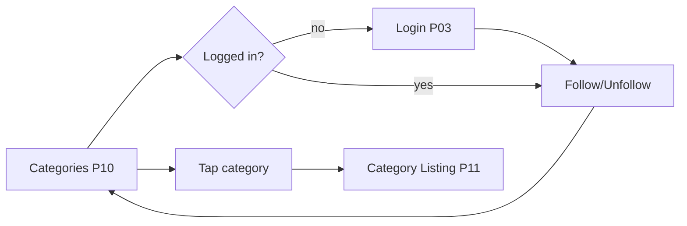

# P10 — Categories

## Metadata

| Field | Value |
|---|---|
| Page ID | P10 |
| Platforms | Mobile / Web |
| Roles | Guest / User / Reporter / Admin |
| Priority | P0 |
| Route / Path | `/categories` (mobile tab), `/categories` (web) |
| Prototype | `prototypes/web/p10-categories.html` |

## Purpose

Categories is the discovery hub of NewsWatch. It lets any visitor browse the
full taxonomy of topics (India, Sports, Business, Technology, …), see how much
content each holds, and follow the topics they care about. It is the starting
point for the second most common journey after the home feed: "I want news about
X". Following a category feeds the "Following" tab here and the personalised
home feed. The page must work for a logged-out Guest (read-only) and unlock
follow/unfollow for authenticated Users.

## UI Structure

### Mobile
- **Header (`header-height-mobile` = 62px, `--purple` background):** title
  "Categories" left-aligned, white, `weight-bold`; trailing `⌕` search icon
  (navigates to P12) and `⋮` overflow (opens P20 quick links). Default state:
  solid purple; on scroll the header gains `shadow-sm`.
- **Tab bar (sticky under header):** two pill tabs `All` and `Following` using
  `--purple` (active, white text) and transparent/`--purple-light` (inactive,
  `--muted` text). Height 40px, `radius-pill`, inset `space-4`. Animated
  underline/pill slides `dur-medium` `ease-standard`.
- **Body:** 2-column grid of category cards (`space-3` gutter, page padding
  `16–17px`). Each card uses `radius-xl`, `--white`, `shadow-card`, and contains
  a 56px round icon/image, category name (`weight-semibold`, 14px), article
  count (`--muted`, `font-size-meta`), and a follow affordance.
- **Follow affordance:** small pill button bottom-right of the card. Default
  outline (`--purple` border/text); following/filled (`--purple` bg, white
  text); press uses `--purple-dark`; disabled while request is in flight
  (opacity 0.6, spinner).
- **Loading:** skeleton grid of 6 grey cards, 8px shimmer sweep.
- **Empty (Following tab):** centered illustration, "You're not following any
  categories yet", CTA "Browse all categories" switches to All tab.

### Web
- Web header (`header-height-web` = 68px, white background, `--border` bottom
  border) persists from the global shell (S02): logo, nav (Home, Categories,
  Search, About), 230px search box, Login/avatar.
- Content is centered with `content-max-width` (900px) and `35px` page padding.
- Cards render in a responsive grid: 3 columns ≥1025px, 2 columns 769–1024px,
  2 columns ≤768px.
- Follow buttons reveal on card **hover** (desktop); on touch they are always
  visible. Hover on card raises `shadow-md` and translates `-2px` over
  `dur-fast`.

### Responsive behavior
- `xs` (0–390px): grid gutter `space-2`, icon 48px, card padding `space-3`.
- `mobile` (≤768px): 2-column grid, header turns purple, follow buttons always
  visible.
- `tablet` (769–1024px): 2-column grid, web header.
- `desktop` (≥1025px): 3-column grid, hover states enabled.
- Grid uses CSS `grid-template-columns: repeat(auto-fill, minmax(150px, 1fr))`
  with token gutters; list mode is a fallback when the user is offline and only
  cached categories are available.

## Features / Functional Requirements

| ID | Requirement | Priority |
|---|---|---|
| REQ-CAT-001 | The page MUST display all active categories with icon/image, name, and published article count. | P0 |
| REQ-CAT-002 | The page MUST provide `All` and `Following` tabs; `Following` requires authentication and shows a login prompt for Guests. | P0 |
| REQ-CAT-003 | Tapping a category card MUST navigate to P11 Category Listing with that category preselected. | P0 |
| REQ-CAT-004 | Authenticated Users MUST be able to follow/unfollow a category inline, with optimistic UI and rollback on failure. | P0 |
| REQ-CAT-005 | The follow count and "Following" tab MUST update immediately after a follow/unfollow without a full reload. | P1 |
| REQ-CAT-006 | Categories MUST be ordered by admin-defined `sortOrder`, then alphabetically. | P1 |
| REQ-CAT-007 | The page MUST cache the last-fetched category list for offline display. | P1 |
| REQ-CAT-008 | A category with zero published articles MUST still render (count `0`) unless an admin has hidden it. | P2 |
| REQ-CAT-009 | The page MUST support pull-to-refresh (mobile) and a retry affordance (web) when loading fails. | P1 |
| REQ-CAT-010 | Long-press (mobile) / right-click (web) on a card MAY open a contextual menu (Follow, Go to, Share). | P2 |

## User Interactions

- **Tap/click card:** navigates to P11; press feedback scales card to 0.98 over
  `dur-fast` then navigates.
- **Tap/click follow pill:** toggles follow state optimistically; icon swaps
  from `+` to `✓`; a toast "Following {Category}" appears (`z-toast`); on
  network failure the state rolls back and an error toast "Couldn't update
  follow. Try again." shows.
- **Tab switch:** pill slides; content cross-fades `dur-medium`; `Following`
  tab lazy-loads its list.
- **Pull-to-refresh (mobile):** `--purple` spinner; refresh replaces list and
  re-sorts.
- **Scroll:** sticky tab bar stays pinned under the header (`z-header`).
- **Guest follow tap:** opens P03 Login as a bottom sheet on mobile / modal on
  web; on success returns and completes the intended follow.
- **Animations:** card grid uses stagger fade-in of 20ms per card on first
  paint; `--purple` follows button uses a 150ms scale bounce on activation.

## Validation & Error States

| Field/Action | Rule | Error message |
|---|---|---|
| Follow (Guest) | Requires authenticated session | "Log in to follow categories" |
| Follow (network) | Request must succeed within 8s | "Couldn't update follow. Try again." |
| Category list load | HTTP 200 with array | "Couldn't load categories." with Retry |
| Search icon | N/A (navigates) | — |
| Refresh rate-limit | Max 1 auto-refresh / 30s | "You're refreshing too often." |

## Loading, Empty, Success States

- **Loading:** 6-card skeleton grid with `--border` blocks and a moving
  `--purple-light` shimmer; tabs render immediately and are interactive.
- **Empty (All):** rare; illustration + "No categories available yet" +
  "Check back soon" (no CTA for Users).
- **Empty (Following):** illustration + "You're not following any categories
  yet" + CTA "Browse all categories".
- **Error:** inline error card with `--error` icon, message, and "Retry" button.
- **Success:** full grid with counts; following cards show a filled state; a
  follower count may increment on the header of P11 on subsequent visits.

## User Flow

1. User arrives from the mobile bottom tab **Categories** or the web nav.
2. The page fetches `GET /api/v1/categories`; skeleton shows, then grid renders.
3. User taps `Following` (if logged in) to filter to followed categories, or
   taps the follow pill on a card.
4. System optimistically updates and calls `POST /api/v1/categories/{id}/follow`.
5. User taps a card.
6. Ends at **P11 Category Listing** for that category.



## Dependencies

- **Screens:** P03 Login, P11 Category Listing, P12 Search, P20 Settings.
- **Components:** CategoryCard, FollowButton, Tabs, SkeletonGrid, Toast, EmptyState.
- **Services/stores:** `categoryStore` (list, following set), `authStore`,
  `apiClient`, `cacheService`, `analytics`.
- **Backend endpoints:** `GET /api/v1/categories`,
  `GET /api/v1/categories/following`, `POST /api/v1/categories/{id}/follow`,
  `DELETE /api/v1/categories/{id}/follow`.

## API / Data Requirements

| Method | Endpoint | Purpose |
|---|---|---|
| GET | `/api/v1/categories?include=count,followed` | List active categories with counts and follow state |
| GET | `/api/v1/categories/following` | List categories the current user follows |
| POST | `/api/v1/categories/{id}/follow` | Follow a category |
| DELETE | `/api/v1/categories/{id}/follow` | Unfollow a category |

Response example:

```json
{
  "success": true,
  "data": [
    { "id": "b1f2...", "name": "India", "slug": "india", "iconUrl": "https://cdn/.../india.png", "articleCount": 1284, "followed": true, "sortOrder": 1 }
  ],
  "meta": { "nextCursor": null, "hasMore": false },
  "error": null
}
```

## Navigation

| Action | From | To |
|---|---|---|
| Tap category card | P10 | P11 `/categories/:slug` |
| Tap Search icon | P10 | P12 `/search` |
| Guest taps follow | P10 | P03 `/login` (then return) |
| Tap overflow | P10 | P20 `/settings` |
| Back (mobile) | P10 | Previous tab / P07 Home |
| Web nav item | P10 | P07 / P12 / P21 |

## Analytics Events

| Event | Trigger | Properties |
|---|---|---|
| `categories_view` | Page visible | `platform`, `tab`, `categoryCount` |
| `category_follow` | Follow succeeds | `categoryId`, `categorySlug` |
| `category_unfollow` | Unfollow succeeds | `categoryId` |
| `category_open` | Card tapped | `categoryId`, `categorySlug`, `position` |
| `categories_tab_change` | Tab switched | `tab` |
| `login_prompt_shown` | Guest follow attempt | `source: "categories"` |

## Open Questions

- Should "Following" show a merged timeline rather than a category list?
- Do we need per-category accent colours, or keep all chips `--purple`?
- Should article counts be cached for 5 minutes to reduce DB load?
- Should hidden/archived categories remain deep-linkable for SEO on web?
