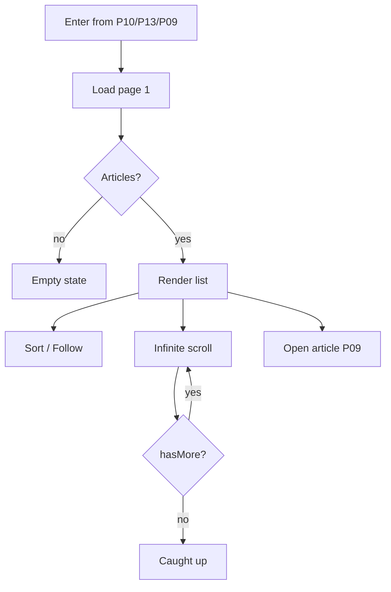

# P11 — Category Listing

## Metadata

| Field | Value |
|---|---|
| Page ID | P11 |
| Platforms | Mobile / Web |
| Roles | Guest / User / Reporter / Admin |
| Priority | P0 |
| Route / Path | `/categories/:slug` (web), `Categories → Category` (mobile stack) |
| Prototype | `prototypes/web/p11-category-listing.html` |

## Purpose

Category Listing shows every published article inside one category. It is the
destination after tapping a category card on P10, a suggested category in
search (P13), or a category badge on an article (P09). It gives readers a
focused view of a topic with sorting (Latest, Trending, Most Read), a follow
button for the category, and infinite scrolling so the reader can keep
consuming without dead ends.

## UI Structure

### Mobile
- **Header (62px, `--purple`):** back `‹` icon (white, 24px, tap target
  44px), category name centered `weight-bold` white, trailing follow `+`/`✓`
  pill and `⌕` icon. On scroll past 8px, header switches to white with
  `--text` and `shadow-sm` (transition `dur-medium`).
- **Sub-header (sticky):** sort chip row — `Latest` (default, active
  `--purple`), `Trending`, `Most Read`. Horizontal scroll, `radius-pill`,
  `space-2` gaps, edge fade mask. A short count line "1,284 articles".
- **Body:** single-column article list. Each row is an article card
  (`radius-xl`, `--white`, `shadow-card`) with a 110×78px thumbnail
  (`radius-md`), category chip (`--purple`, `radius-sm`, 11px), title
  (`weight-bold`, 14px, max 2 lines), snippet (`--muted`, 12px, max 2 lines),
  and meta row (author avatar 20px, reporter name, `◷ 2h ago`, `◉ views`).
- **Infinite scroll:** next page loads 400px before the bottom; a `--purple`
  circular spinner sits in a 56px footer.
- **End state:** "You're all caught up" divider with a `--border` rule.
- **Floating "Top" button:** appears after 3 screens, `--purple`, `radius-pill`,
  `z-scroll-indicator`.

### Web
- 68px white header from the global shell (S02). Below it a category hero strip:
  category name (`font-size-title` 34px, `weight-extrabold`), follower count,
  article count, and a follow button aligned right. Background `--purple-light`
  with `--purple-tint-border` bottom border, max width constrained to 900px
  content column, padding `35px`.
- Sort/filter bar sticky under the hero: segmented control `Latest | Trending |
  Most Read` plus a "Filter" button (opens category/date/source filter drawer).
- Article list is a 2-column grid ≥1025px (card image on top, 16:9), 1-column
  ≤1024px. Cards reuse the same tokens as mobile.
- A right-hand rail (desktop only, optional) shows "Trending in {Category}"
  top-5 compact list.

### Responsive behavior
- `xs`: thumbnail 92×66px, title 13px.
- `mobile` (≤768px): list view, purple header.
- `tablet` (769–1024px): single-column list, web header, no side rail.
- `desktop` (≥1025px): 2-column grid, sticky sort/filter bar, optional rail.

## Features / Functional Requirements

| ID | Requirement | Priority |
|---|---|---|
| REQ-CAT-011 | The page MUST list published articles scoped to the requested category, newest first by default. | P0 |
| REQ-CAT-012 | The page MUST support sort modes `Latest`, `Trending`, `Most Read` and persist the choice per session. | P0 |
| REQ-CAT-013 | The page MUST implement cursor-based infinite scroll with a visible end-of-list state. | P0 |
| REQ-CAT-014 | The header MUST offer a follow/unfollow button reflecting current state (Guest sees login prompt). | P0 |
| REQ-CAT-015 | Tapping an article card MUST open P09 Article Detail at the correct index within the category feed. | P0 |
| REQ-CAT-016 | The page MUST show an empty state when the category has no published articles. | P0 |
| REQ-CAT-017 | The page MUST deep-link on web (`/categories/sports`) and update the URL on category change. | P1 |
| REQ-CAT-018 | Pull-to-refresh (mobile) / refresh button (web) MUST reload page 1 and reset scroll to the sort bar. | P1 |
| REQ-CAT-019 | The page MUST apply an optional filter set (date range, reporter) via a filter drawer on web. | P2 |
| REQ-CAT-020 | The page SHOULD prefetch the next page images once the list is idle for 1s. | P2 |

## User Interactions

- **Back `‹`:** returns to the previous screen (P10, P13, or P07) preserving
  scroll position.
- **Sort chip tap:** instantly re-orders with a 150ms cross-fade; resets the
  cursor; scrolls to top under the sticky bar.
- **Card tap:** card scales 0.98 (`dur-fast`) then navigates to P09; the tapped
  article becomes the initial index of the category scroller.
- **Follow tap:** optimistic toggle; toast confirms; count updates with a
  `dur-medium` number roll animation.
- **Infinite scroll:** IntersectionObserver on a sentinel; spinner fades in
  after 250ms to avoid flicker on fast networks.
- **Pull-to-refresh:** `--purple` spinner, haptic light impact on trigger.
- **Empty CTA:** "Explore other categories" returns to P10.
- **Error retry:** inline "Retry" button re-issues the failed page request.

## Validation & Error States

| Field/Action | Rule | Error message |
|---|---|---|
| Category slug | Must resolve to an active category | "This category isn't available." |
| Sort value | One of `latest`, `trending`, `most_read` | Falls back silently to `latest` |
| Follow (Guest) | Requires auth | "Log in to follow" |
| Page load | HTTP 200 | "Couldn't load articles." + Retry |
| Next page | HTTP 200; on failure keep loaded items | "Couldn't load more." + Retry |
| Filter date range | `from` ≤ `to` | "Start date must be before end date." |

## Loading, Empty, Success States

- **Loading:** 5 skeleton article rows; hero strip skeleton for name/count.
- **Empty:** illustration + "{Category} has no articles yet" + CTA "Explore
  other categories"; follow button still visible.
- **Error:** full-page error block for first page; inline footer error for
  subsequent pages.
- **Success:** ordered article list, follow state synced, infinite scroll armed,
  "caught up" divider at the end.

## User Flow

1. User arrives from P10 (category card), P13 (suggested category), or P09
   (category badge).
2. System loads page 1 for the slug and renders the hero + list skeleton.
3. User optionally changes sort or follows the category.
4. User scrolls; next pages load automatically.
5. User taps an article.
6. Ends at **P09 Article Detail** inside the category feed context.



## Dependencies

- **Screens:** P10 Categories, P09 Article Detail, P12 Search, P03 Login.
- **Components:** ArticleCard, CategoryHero, SortChips, FollowButton,
  SkeletonList, EmptyState, FilterDrawer, ScrollToTop.
- **Services/stores:** `categoryStore`, `articleStore`, `authStore`,
  `apiClient`, `cacheService`, `analytics`.
- **Backend endpoints:** `GET /api/v1/categories/{slug}`,
  `GET /api/v1/categories/{slug}/articles`, follow endpoints from P10.

## API / Data Requirements

| Method | Endpoint | Purpose |
|---|---|---|
| GET | `/api/v1/categories/{slug}` | Category metadata, counts, follow state |
| GET | `/api/v1/categories/{slug}/articles?sort=&cursor=&limit=` | Paginated articles |
| POST | `/api/v1/categories/{id}/follow` | Follow category |
| DELETE | `/api/v1/categories/{id}/follow` | Unfollow category |

Response example:

```json
{
  "success": true,
  "data": [
    {
      "id": "a91c...",
      "title": "Rohit, Kohli Make It Count",
      "summary": "India's experienced duo delivered a steady performance...",
      "heroImageUrl": "https://cdn/.../cricket.jpg",
      "category": { "id": "c2...", "name": "Sports", "slug": "sports" },
      "author": { "id": "r7...", "displayName": "NewsWatch Sports", "avatarUrl": "https://cdn/.../s.png" },
      "publishedAt": "2026-09-22T08:15:00Z",
      "viewCount": 18240,
      "likeCount": 1200,
      "commentCount": 84
    }
  ],
  "meta": { "nextCursor": "eyJ...", "hasMore": true, "total": 1284 },
  "error": null
}
```

## Navigation

| Action | From | To |
|---|---|---|
| Back | P11 | P10 / P13 / P09 |
| Tap article | P11 | P09 `/article/:id?context=category&slug=:slug` |
| Tap follow (Guest) | P11 | P03 `/login` |
| Tap search | P11 | P12 `/search` |
| Tap reporter | P11 | P18 `/reporter/:id` (or P09 author) |
| Deep link | external | P11 `/categories/:slug` |

## Analytics Events

| Event | Trigger | Properties |
|---|---|---|
| `category_listing_view` | Page visible | `categoryId`, `slug`, `sort` |
| `category_sort_change` | Sort changed | `categoryId`, `sort` |
| `category_article_open` | Card tapped | `articleId`, `position`, `sort` |
| `category_page_loaded` | Next page loaded | `categoryId`, `page`, `cursor` |
| `category_follow_toggle` | Follow/unfollow | `categoryId`, `action` |
| `category_list_exhausted` | End reached | `categoryId`, `articlesLoaded` |

## Open Questions

- Should `Trending` be a time-windowed score (24h/7d) or an admin-curated list?
- Do we need a "Sources/Reporters" filter inside a category for v1?
- Should the web category hero show a curated cover image?
- Should sub-categories (e.g. "India → Politics") be introduced later?
