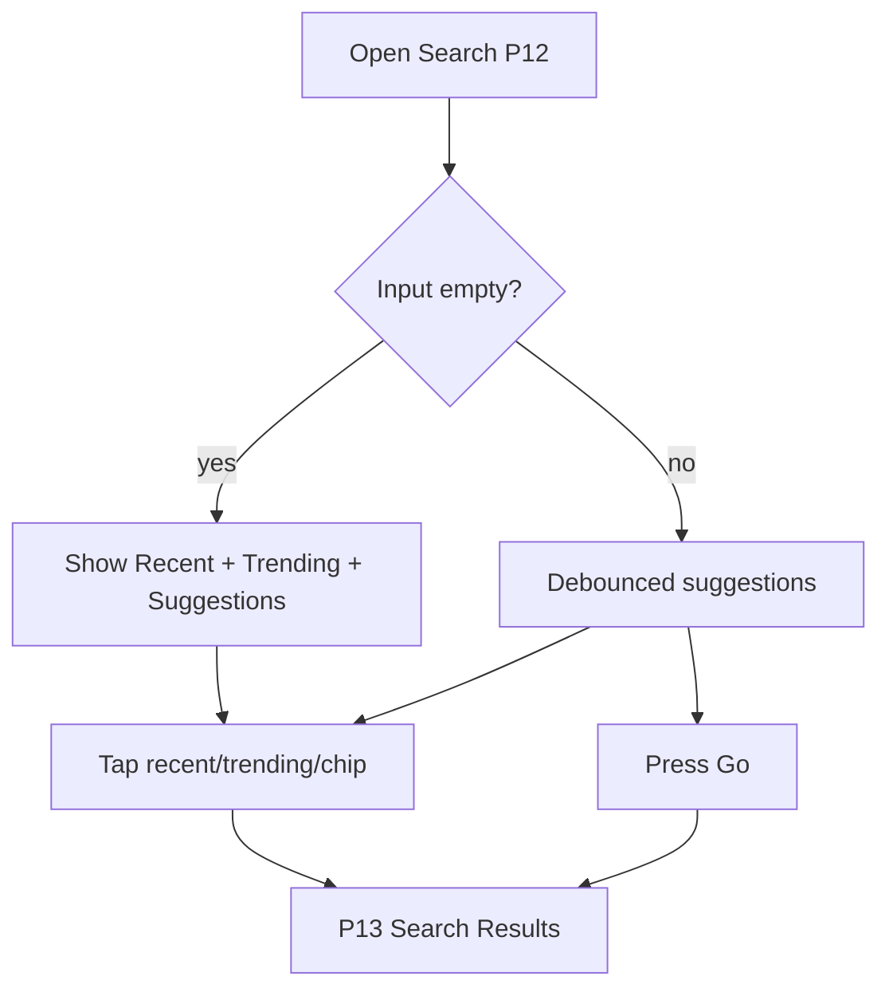

# P12 — Search

## Metadata

| Field | Value |
|---|---|
| Page ID | P12 |
| Platforms | Mobile / Web |
| Roles | Guest / User / Reporter / Admin |
| Priority | P0 |
| Route / Path | `/search` |
| Prototype | `prototypes/web/p12-search.html` |

## Purpose

Search is the entry point for intent-driven discovery. It presents a focused
search field with typing suggestions, recent searches (persisted locally and,
when logged in, synced to the account), trending searches across the platform,
and suggested categories/reporters. It hands the query to P13 Search Results.
The page exists to get a user from "I'm looking for something" to relevant
results in one input action, with voice search as an accessibility accelerator.

## UI Structure

### Mobile
- **Header (62px, `--white`):** back `‹` (24px, `--text`), a full-width search
  input (`search-height` 40px, `radius-md`, `--border` border, `--background`
  fill), and a "Cancel" text button (`--purple`, `weight-semibold`).
- **Search input:** magnifier icon (`⌕`) on the left, clear `×` on the right
  (appears only when text is non-empty), and a mic icon for voice search.
  Focused state: border `--purple`, `shadow-sm`, keyboard opens automatically
  on mount.
- **Recent searches:** section header "Recent" with "Clear all" (`--purple`).
  Rows: `⌕` icon, query text, `×` remove, trailing `↗` "fill into input" tap.
  Max 10 entries, newest first, persisted in AsyncStorage.
- **Trending searches:** horizontal chip wrap of top 8 queries, `radius-pill`,
  `--purple-light` bg, `--purple` text; leading `🔥`-equivalent icon (Lucide
  `trending-up`). Tap fills + submits.
- **Suggested categories:** horizontal scroll cards (64px tile, icon + name).
- **Suggested reporters:** horizontal scroll of round avatars (56px) + name +
  `✓` verified badge.
- **Voice search:** a bottom-sheet overlay with animated waveform and
  "Listening…"; cancel button. Uses OS speech-to-text; 8s auto-stop.
- **Keyboard:** autofocus, `returnKeyType="search"`.

### Web
- Uses the global header search box (`search-width` 230px, `search-height`
  40px). Expanding (on focus) turns it into an inline overlay panel that spans
  up to 560px, pushing a dropdown with the same sections (Recent, Trending,
  Categories, Reporters).
- If the user navigates directly to `/search`, a centered hero search field
  (`radius-lg`, 480px wide) appears with a large magnifier and placeholder
  "Search news, topics, reporters…".
- Results preview: pressing Enter or clicking a suggestion routes to P13; a
  `⌘K`/`Ctrl+K` shortcut focuses search from anywhere (documented in S02).

### Responsive behavior
- `xs`: input takes full width minus Cancel; recent rows 48px.
- `mobile` (≤768px): full-screen search experience.
- `tablet` (769–1024px): overlay panel 520px, sections shown as a two-column
  split (suggestions left, trending right).
- `desktop` (≥1025px): header dropdown panel, keyboard shortcuts active.

## Features / Functional Requirements

| ID | Requirement | Priority |
|---|---|---|
| REQ-SEARCH-001 | The page MUST provide a text input that debounces suggestions by 250ms. | P0 |
| REQ-SEARCH-002 | The page MUST show up to 10 recent searches, persisted and individually removable. | P0 |
| REQ-SEARCH-003 | The page MUST show trending searches fetched from the backend (top 8). | P1 |
| REQ-SEARCH-004 | The page MUST show suggested categories and suggested reporters when the query is empty. | P1 |
| REQ-SEARCH-005 | Submitting a query MUST navigate to P13 Search Results with the query encoded in the URL. | P0 |
| REQ-SEARCH-006 | A clear `×` button MUST clear the current input and refocus without leaving the page. | P0 |
| REQ-SEARCH-007 | Voice search SHOULD be available on supported devices and fill the input with the transcript. | P2 |
| REQ-SEARCH-008 | Recent searches MUST sync to the account when the user logs in (merge by timestamp). | P1 |
| REQ-SEARCH-009 | The page MUST record a search only after submission (not on typing). | P0 |
| REQ-SEARCH-010 | The page MUST guard against empty/whitespace-only queries. | P0 |
| REQ-SEARCH-011 | `⌘K`/`Ctrl+K` SHOULD focus search from any web page. | P2 |

## User Interactions

- **Focus input:** border animates to `--purple` (`dur-fast`); suggestion panel
  fades in `dur-medium`; recent/trending shown when empty.
- **Type:** after 250ms debounce, suggestions update with a subtle top-to-bottom
  stagger (12ms/row); stale responses are discarded by query token.
- **Tap recent row:** fills input and submits immediately (navigates to P13).
- **Tap `×` on a recent row:** removes it with a 180ms collapse animation.
- **Clear all:** confirmation inline ("Clear recent searches? Cancel / Clear").
- **Tap trending chip:** fills input and submits.
- **Tap mic:** requests microphone permission; on grant shows the listening
  sheet; transcript streams into the input; on cancel nothing is filled.
- **Tap `×` in input:** clears text and recent/trending returns; input refocuses.
- **Swipe down (mobile):** dismisses the keyboard, keeping the page.
- **Press Enter/Go:** submits for P13.

## Validation & Error States

| Field/Action | Rule | Error message |
|---|---|---|
| Query | Non-empty after trim, max 100 chars | "Enter something to search" |
| Query | Length ≤ 100 | "Search is limited to 100 characters" |
| Mic permission | OS permission required | "Microphone access is needed for voice search" |
| Voice transcript | Non-empty | "Didn't catch that. Try again." |
| Suggestions API | HTTP 200; expire stale | Silently ignore; keep last list |
| Trending API | HTTP 200 | Hide section on failure (no error toast) |
| Recent clear all | Requires confirm | N/A |

## Loading, Empty, Success States

- **Loading:** recent/trending section skeletons (3 shimmer rows; 6 pill
  placeholders) while the initial config loads.
- **Empty (no history):** "Recent" section hidden; trending + suggestions still
  shown.
- **Empty (no trending):** trending section hidden; categories/reporters shown.
- **Error:** non-blocking; sections hide individually; the input remains fully
  usable.
- **Success:** typing produces ranked suggestions; submission routes to P13 and
  the query is added to recent history.

## User Flow

1. User arrives from the global header search, P10 search icon, or `⌘K`.
2. Input autofocuses; recent + trending + suggestions render.
3. User types (debounced suggestions) or taps a suggestion/chip.
4. User submits; query is saved to history and analytics fires.
5. Ends at **P13 Search Results** with `?q=` in the URL.



## Dependencies

- **Screens:** P13 Search Results, P10 Categories, P09 Article Detail (suggestion
  preview), P03 Login (for syncing history).
- **Components:** SearchInput, SuggestionList, RecentSearchRow, TrendingChips,
  CategorySuggestionRail, ReporterSuggestionRail, VoiceSearchSheet, Toast.
- **Services/stores:** `searchStore` (query, suggestions, history),
  `authStore`, `apiClient`, `storageService`, `speechService`, `analytics`.
- **Backend endpoints:** `GET /api/v1/search/suggest`,
  `GET /api/v1/search/trending`, `GET /api/v1/search/recent`,
  `DELETE /api/v1/search/recent`.

## API / Data Requirements

| Method | Endpoint | Purpose |
|---|---|---|
| GET | `/api/v1/search/suggest?q=` | Typed suggestions (articles, categories, reporters) |
| GET | `/api/v1/search/trending?limit=8` | Trending queries |
| GET | `/api/v1/search/recent` | Server-synced recent searches (auth) |
| DELETE | `/api/v1/search/recent` | Clear all recent searches (auth) |
| DELETE | `/api/v1/search/recent/{id}` | Remove one recent search (auth) |

Response example:

```json
{
  "success": true,
  "data": {
    "queries": ["cricket", "sensex", "election results"],
    "categories": [{ "id": "c2...", "name": "Sports", "slug": "sports" }],
    "reporters": [{ "id": "r7...", "displayName": "Meera Rao", "verified": true, "avatarUrl": "https://cdn/.../m.png" }]
  },
  "meta": { "query": "cric" },
  "error": null
}
```

## Navigation

| Action | From | To |
|---|---|---|
| Submit query | P12 | P13 `/search?q=:query` |
| Tap category suggestion | P12 | P11 `/categories/:slug` |
| Tap reporter suggestion | P12 | P18 `/reporter/:id` (or profile) |
| Cancel/back | P12 | Previous screen |
| `⌘K` | any web page | P12 focused |

## Analytics Events

| Event | Trigger | Properties |
|---|---|---|
| `search_open` | Page/overlay shown | `source: "header" / "icon" / "shortcut"` |
| `search_query_submit` | Submitted | `query`, `queryLength`, `source` |
| `search_suggestion_tap` | Suggestion tapped | `query`, `suggestionType`, `position` |
| `search_voice_start` | Mic tapped | `platform` |
| `search_voice_result` | Transcript filled | `success` |
| `search_recent_clear` | Clear all | `count` |

## Open Questions

- Should recent searches sync server-side or remain device-local for privacy?
- Do we need typo tolerance / fuzzy matching at the API layer for v1?
- Should trending be global only, or per-category/region?
- Is voice search in scope for web v1 or mobile only?
