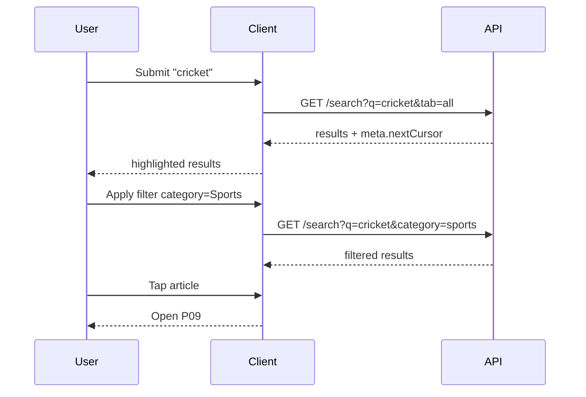

# P13 — Search Results

## Metadata

| Field | Value |
|---|---|
| Page ID | P13 |
| Platforms | Mobile / Web |
| Roles | Guest / User / Reporter / Admin |
| Priority | P0 |
| Route / Path | `/search?q=:query&tab=all&sort=relevance` |
| Prototype | `prototypes/web/p13-search-results.html` |

## Purpose

Search Results presents everything matching a query across the platform:
articles, categories, and reporters. It is reached from P12 and is fully
deep-linkable and shareable on web. The page must make matches obvious by
highlighting the query terms, let users narrow results with filters
(category, date, sort), handle the no-results case with helpful suggestions,
and paginate results. It also emits search analytics that power trending
queries and relevance tuning.

## UI Structure

### Mobile
- **Header (62px, `--purple` or white-on-scroll):** back `‹`, a compact search
  field pre-filled with the query (tappable to return to P12), and a filter
  icon (`⚙`/`sliders`) with an active-count badge.
- **Tab bar (sticky):** `All`, `Articles`, `Categories`, `Reporters` —
  horizontal scroll, active tab `--purple` with a 2px underline; inactive
  `--muted`. Result counts shown as superscript e.g. `Articles · 128`.
- **Result meta line:** "About 128 results (0.42s)" in `--muted`,
  `font-size-meta`, with a sort dropdown trigger on the right.
- **Body:** card list per tab:
  - **Articles:** thumbnail 110×78, category chip, title with query terms in a
    `<mark>` styled as `--purple-light` bg + `--purple` text `weight-semibold`,
    snippet with highlight, meta row.
  - **Categories:** row with icon, name (highlighted), article count, follow
    pill.
  - **Reporters:** row with avatar, name (highlighted), verified badge, article
    count, follow button.
- **Filter drawer (bottom sheet):** Category (multi-select chips), Date
  (Any / 24h / Week / Month / Year / Custom), Sort (Relevance / Latest / Most
  Read), and Apply/Reset buttons pinned to the sheet bottom.
- **Infinite scroll** with a 56px footer spinner and "no more results" divider.

### Web
- 68px web header with the search box pre-filled; result tabs beneath in a
  centered `content-max-width` (900px) column with `35px` padding.
- Two-pane layout ≥1025px: left sidebar (260px) with persistent filters
  (Category, Date, Sort) and a sticky "Clear filters" link; right pane with
  results. Tabs remain across the top of the results pane.
- Hover on a result card raises `shadow-md` and underlines the title in
  `--purple`; the `mark` highlight persists.
- Result count and elapsed time displayed in the sidebar footer.

### Responsive behavior
- `xs`: tabs scroll horizontally; highlight `mark` font-size inherits.
- `mobile` (≤768px): filters in a bottom sheet; single-column cards.
- `tablet` (769–1024px): filters collapse to a drawer triggered by the button.
- `desktop` (≥1025px): persistent left filter rail, two-pane results.

## Features / Functional Requirements

| ID | Requirement | Priority |
|---|---|---|
| REQ-SEARCH-012 | The page MUST display results for the query across All, Articles, Categories, and Reporters tabs. | P0 |
| REQ-SEARCH-013 | Matched query terms MUST be highlighted in titles/snippets/names using the `mark` style. | P0 |
| REQ-SEARCH-014 | The page MUST support filters: category (multi), date range, and sort (Relevance/Latest/Most Read). | P0 |
| REQ-SEARCH-015 | Filters MUST be reflected in the URL so results are shareable/back-navigable. | P1 |
| REQ-SEARCH-016 | The page MUST implement cursor-based pagination with infinite scroll and a web "Load more" fallback. | P0 |
| REQ-SEARCH-017 | The page MUST show a no-results state with suggested categories and a spelling-help hint. | P0 |
| REQ-SEARCH-018 | Tab switching MUST preserve the query and active filters. | P0 |
| REQ-SEARCH-019 | The page MUST emit search analytics (query, tab, result count, click-through). | P1 |
| REQ-SEARCH-020 | Tapping a result MUST navigate to the relevant detail page, preserving the query context on back. | P0 |
| REQ-SEARCH-021 | The page SHOULD debounce filter changes (300ms) and cancel superseded requests. | P1 |
| REQ-SEARCH-022 | An empty query MUST redirect to P12. | P0 |

## User Interactions

- **Tap search field:** returns to P12 with the current query for editing.
- **Tab switch:** results cross-fade `dur-medium`; tab underline slides; counts
  update; the URL `tab` param updates via `replaceState`.
- **Filter chip toggle:** optimistic; result list updates after 300ms debounce;
  active-count badge on the filter button increments.
- **Sort change:** instant re-fetch; scroll resets to the top of the list.
- **Card tap:** card scales 0.98 then navigates; analytics records position.
- **Pull-to-refresh (mobile) / Refresh (web):** re-runs the current query with
  current filters.
- **Clear filters:** resets to defaults with a fade; URL params removed.
- **Highlight:** `mark` terms have a 1s subtle flash on first render to draw
  the eye.

## Validation & Error States

| Field/Action | Rule | Error message |
|---|---|---|
| Query | Required, ≤100 chars | Redirect to P12 if empty |
| Date custom range | `from` ≤ `to`, not future-dated | "Start date must be before end date." |
| Page | HTTP 200 | "Couldn't load results." + Retry |
| Next page | HTTP 200; preserve loaded items on failure | "Couldn't load more." + Retry |
| Filter combo | Result set may be empty | Use no-results state, not an error |
| Rate limit | 429 | "Too many searches. Please wait a moment." |

## Loading, Empty, Success States

- **Loading:** 4 skeleton article cards (thumbnail + 2 text bars each); the
  tabs and count show placeholders (`—`).
- **Empty (no results):** centered illustration + "No results for '{query}'"
  + "Check your spelling or try a different keyword." + suggested trending
  chips + "Browse categories" CTA.
- **Empty (filtered to zero):** "{query} has no results in {category}" +
  "Clear filters" CTA.
- **Error:** inline error state with Retry; tabs remain usable.
- **Success:** highlighted, ranked results with counts and latency; infinite
  scroll; filters reflected in URL.

## User Flow

1. User arrives from P12 after submitting a query, or via a shared deep link.
2. System fetches All results and renders the tab with counts.
3. User switches tabs, applies filters, or changes sort.
4. User scrolls to load more.
5. User taps a result.
6. Ends at **P09 Article Detail**, **P11 Category Listing**, or **P18 Profile**
   depending on the result type.



## Dependencies

- **Screens:** P12 Search, P09 Article Detail, P11 Category Listing, P18 Profile.
- **Components:** HighlightedText, ResultCard, CategoryResultRow,
  ReporterResultRow, ResultTabs, FilterSheet, FilterSidebar, EmptyState,
  SkeletonCard, Pagination Sentry.
- **Services/stores:** `searchStore`, `filterStore`, `apiClient`, `analytics`.
- **Backend endpoints:** `GET /api/v1/search`,
  `GET /api/v1/search/articles`, `GET /api/v1/search/categories`,
  `GET /api/v1/search/reporters`, `GET /api/v1/search/trending`.

## API / Data Requirements

| Method | Endpoint | Purpose |
|---|---|---|
| GET | `/api/v1/search?q=&tab=&category=&dateFrom=&dateTo=&sort=&cursor=&limit=` | Unified or per-tab search |
| GET | `/api/v1/search/articles?...` | Articles-only results |
| GET | `/api/v1/search/categories?...` | Categories-only results |
| GET | `/api/v1/search/reporters?...` | Reporters-only results |

Response example:

```json
{
  "success": true,
  "data": {
    "articles": [
      {
        "id": "a91c...",
        "title": "Rohit, Kohli Make It Count in 3rd ODI",
        "summary": "India's experienced duo delivered a steady performance...",
        "heroImageUrl": "https://cdn/.../cricket.jpg",
        "highlights": { "title": ["Rohit", "Kohli"] },
        "category": { "id": "c2...", "name": "Sports", "slug": "sports" },
        "publishedAt": "2026-09-22T08:15:00Z"
      }
    ],
    "counts": { "articles": 128, "categories": 4, "reporters": 3 }
  },
  "meta": { "query": "cricket", "tookMs": 42, "nextCursor": "eyJ...", "hasMore": true },
  "error": null
}
```

## Navigation

| Action | From | To |
|---|---|---|
| Tap article result | P13 | P09 `/article/:id?from=search` |
| Tap category result | P13 | P11 `/categories/:slug` |
| Tap reporter result | P13 | P18 `/reporter/:id` |
| Tap search field | P13 | P12 `/search` |
| Back | P13 | P12 or previous screen |
| Deep link | external | P13 `/search?q=...` |

## Analytics Events

| Event | Trigger | Properties |
|---|---|---|
| `search_results_view` | Page visible | `query`, `tab`, `resultCount`, `tookMs` |
| `search_tab_change` | Tab switched | `query`, `tab` |
| `search_filter_apply` | Filters applied | `query`, `filters` |
| `search_result_click` | Result tapped | `query`, `resultType`, `resultId`, `position` |
| `search_results_empty` | No results | `query`, `filters` |
| `search_pagination` | Next page loaded | `query`, `page`, `tab` |
| `search_sort_change` | Sort changed | `query`, `sort` |

## Open Questions

- Should `Relevance` blend recency, or use pure text rank?
- Do we need saved searches / alerts in v1?
- Should report about/show "did you mean" spell correction from the API?
- Is full-text search over article body in scope, or titles+snippets only?
