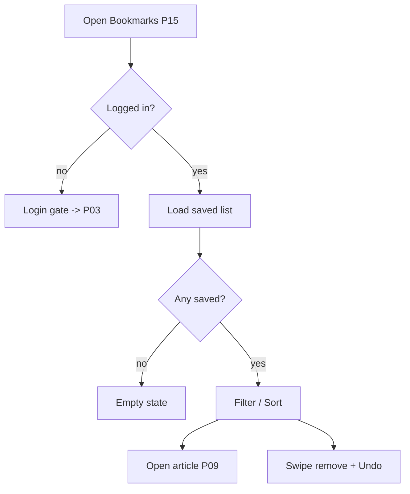

# P15 — Bookmarks / Saved

## Metadata

| Field | Value |
|---|---|
| Page ID | P15 |
| Platforms | Mobile / Web |
| Roles | User / Reporter / Admin (Guest is gated) |
| Priority | P1 |
| Route / Path | `/bookmarks` (mobile tab), `/bookmarks` (web) |
| Prototype | `prototypes/web/p15-bookmarks.html` |

## Purpose

Bookmarks is the reader's personal reading list. It collects every article the
user saved from the scroll reader (P08), article detail (P09), or feed (P07)
and keeps them in sync across devices via the account. It is authentication
gated: Guests are shown a login prompt rather than an empty list. The page lets
users re-find, filter, and remove saved articles, and is designed around quick
swipe-to-remove on mobile and hover actions on web.

## UI Structure

### Mobile
- **Header (62px, `--purple`):** title "Saved", trailing `⋮` with "Sort"
  (Newest saved / Oldest / Category) and "Clear all".
- **Filter tabs (sticky):** `All`, `Articles`, plus category chips derived from
  the saved set, and a `Read` / `Unread` segmented filter. Active chip uses
  `--purple`; inactive uses `--purple-light` / `--muted`.
- **Body:** single-column list of saved article cards (`radius-xl`, `--white`,
  `shadow-card`): thumbnail 110×78, category chip, title (2 lines), saved
  timestamp ("Saved 2h ago", `--muted`), and a trailing bookmark `⌷` icon that
  is filled `--purple` (indicating saved). Unread items show a 6px `--purple`
  dot on the left edge.
- **Swipe-to-remove:** swiping left reveals a `--error` "Remove" action
  (72px); full swipe triggers removal with a 200ms collapse + undo snackbar.
- **Undo snackbar:** "Removed from Saved" + "Undo" (5s), anchored above the
  tab bar (`z-toast`).
- **Pull-to-refresh** re-syncs from the server.

### Web
- 68px web header from S02. Title row: "Saved articles" (`font-size-title`
  34px, `weight-extrabold`), count, and a sort dropdown.
- Filter bar: category chips + `Read/Unread` toggle, and a "View" switch
  (list/grid). Grid mode is 3 columns ≥1025px, 2 columns tablet.
- Cards show a hover overlay with "Remove" and "Open"; bookmark icon filled.
- Bulk actions: checkboxes appear on hover/selection, enabling "Remove
  selected" (with confirm dialog) — P2.
- Empty state includes a prominent "Explore news" CTA to P07.

### Responsive behavior
- `xs`: thumbnail 92×66, one card per row.
- `mobile` (≤768px): list view, swipe actions, snackbar.
- `tablet` (769–1024px): 2-column grid or list, hover actions.
- `desktop` (≥1025px): 3-column grid option, bulk selection, sort dropdown.

## Features / Functional Requirements

| ID | Requirement | Priority |
|---|---|---|
| REQ-BOOK-001 | The page MUST require authentication and show a login gate for Guests. | P0 |
| REQ-BOOK-002 | The page MUST list all articles the user has saved, newest saved first. | P0 |
| REQ-BOOK-003 | The page MUST allow removing a bookmark inline (swipe mobile, button web) with undo. | P0 |
| REQ-BOOK-004 | The page MUST sync bookmarks across devices through the account. | P0 |
| REQ-BOOK-005 | The page MUST provide filters by category and read/unread state. | P1 |
| REQ-BOOK-006 | The page MUST allow sorting (Newest saved, Oldest, Category). | P1 |
| REQ-BOOK-007 | Tapping a saved article MUST open P09 and mark it read once scrolled. | P0 |
| REQ-BOOK-008 | The page MUST show an empty state when no bookmarks exist, with an "Explore news" CTA. | P0 |
| REQ-BOOK-009 | The page MUST reflect bookmark changes made elsewhere in the app in real time (optimistic store). | P0 |
| REQ-BOOK-010 | The page SHOULD support "Clear all" with a confirmation dialog. | P2 |
| REQ-BOOK-011 | The page SHOULD support bulk remove on web. | P2 |
| REQ-BOOK-012 | The page MUST show a saved-timestamp per item. | P1 |

## User Interactions

- **Tap card:** opens P09 with `from=bookmarks`; the article's saved state is
  preserved.
- **Tap bookmark icon:** removes the item with a 200ms collapse; undo snackbar
  for 5s restores it.
- **Swipe left (mobile):** reveals Remove; threshold 40% triggers full remove
  with haptic medium impact.
- **Filter chip tap:** filters with a 150ms cross-fade; count updates.
- **Sort change:** re-orders with a 200ms list transition.
- **Clear all:** opens a confirm dialog ("Remove all saved articles? This can't
  be undone." Cancel / Remove all); on confirm all collapse out.
- **Pull-to-refresh:** `--purple` spinner; reconciles local and server state.
- **Login gate:** Guest sees illustration + "Save articles to read later" +
  "Log in" CTA opening P03.

## Validation & Error States

| Field/Action | Rule | Error message |
|---|---|---|
| Access (Guest) | Auth required | Gate screen (not an error) |
| Remove | Request succeeds | "Couldn't remove. Try again." (item restored) |
| Clear all | Explicit confirm | N/A |
| Sync load | HTTP 200 | "Couldn't load your saved articles." + Retry |
| Offline | Show cached list | "You're offline. Showing saved items." |
| Undo window | 5s | "Undo" expires silently |

## Loading, Empty, Success States

- **Loading:** 5 skeleton rows with thumbnail and text bars; filter bar
  interactive.
- **Empty (authenticated, no saves):** bookmark illustration + "No saved
  articles yet" + "Tap the bookmark icon on any article to save it." +
  "Explore news" CTA.
- **Empty (filtered):** "No saved articles in {category}" + "Clear filters".
- **Gate (Guest):** illustration + "Save articles to read later" + "Log in".
- **Error:** inline error card with Retry.
- **Success:** full saved list, synced across devices; removing updates the
  global bookmark store and the article's P09 state.

## User Flow

1. User arrives from the bottom tab **Saved**, or by tapping a bookmark action.
2. If Guest, the login gate appears; after login the list loads.
3. User filters/sorts and taps an article, or swipes to remove.
4. System updates the bookmark store and syncs via API (`dur-fast` optimistic).
5. Ends by reading the article (P09) or returning to the list.



## Dependencies

- **Screens:** P03 Login, P09 Article Detail, P07 Home Feed, P18 Profile.
- **Components:** SavedArticleCard, BookmarkButton, FilterChips, SwipeableRow,
  UndoSnackbar, EmptyState, LoginGate, ConfirmDialog.
- **Services/stores:** `bookmarkStore`, `authStore`, `articleStore`,
  `apiClient`, `cacheService`, `analytics`.
- **Backend endpoints:** `GET /api/v1/bookmarks`,
  `POST /api/v1/bookmarks`, `DELETE /api/v1/bookmarks/{articleId}`,
  `DELETE /api/v1/bookmarks`.

## API / Data Requirements

| Method | Endpoint | Purpose |
|---|---|---|
| GET | `/api/v1/bookmarks?category=&status=&sort=&cursor=&limit=` | Paginated saved articles |
| POST | `/api/v1/bookmarks` | Save an article (`{ articleId }`) |
| DELETE | `/api/v1/bookmarks/{articleId}` | Remove one bookmark |
| DELETE | `/api/v1/bookmarks` | Clear all bookmarks |

Response example:

```json
{
  "success": true,
  "data": [
    {
      "articleId": "a91c...",
      "title": "Rohit, Kohli Make It Count in 3rd ODI",
      "summary": "India's experienced duo delivered...",
      "heroImageUrl": "https://cdn/.../cricket.jpg",
      "category": { "id": "c2...", "name": "Sports", "slug": "sports" },
      "read": false,
      "savedAt": "2026-09-22T16:40:00Z"
    }
  ],
  "meta": { "nextCursor": "eyJ...", "hasMore": true, "total": 42 },
  "error": null
}
```

## Navigation

| Action | From | To |
|---|---|---|
| Tap saved article | P15 | P09 `/article/:id?from=bookmarks` |
| Guest login CTA | P15 | P03 `/login` |
| Empty "Explore news" | P15 | P07 `/` |
| Tap category chip | P15 | P11 `/categories/:slug` |
| Bottom tab | any | P15 `/bookmarks` |

## Analytics Events

| Event | Trigger | Properties |
|---|---|---|
| `bookmarks_view` | Page visible | `count`, `platform` |
| `bookmark_remove` | Item removed | `articleId`, `method: "swipe" / "button"` |
| `bookmark_undo` | Undo tapped | `articleId` |
| `bookmark_open` | Article opened | `articleId`, `position` |
| `bookmarks_filter` | Filter applied | `filters` |
| `bookmarks_clear_all` | Clear all confirmed | `count` |
| `bookmarks_gate_shown` | Guest gate | — |

## Open Questions

- Should read/unread state be manual or automatic on scroll depth?
- Do we support collections/folders for saved articles in v1?
- Should bookmarks be shareable as a public list (future)?
- How many bookmarks per user before we paginate/warn?
