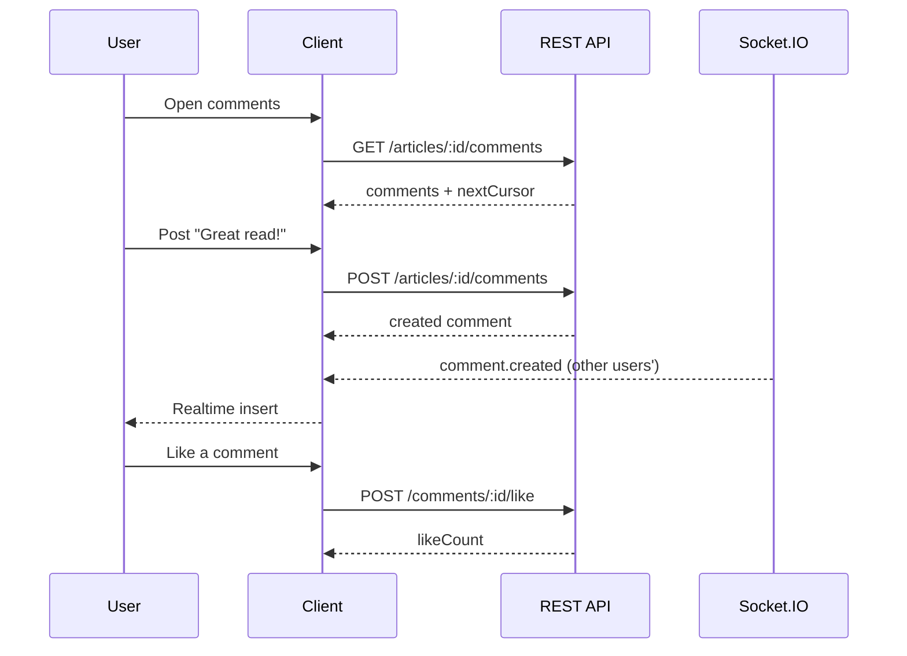

# P16 — Comments

## Metadata

| Field | Value |
|---|---|
| Page ID | P16 |
| Platforms | Mobile / Web |
| Roles | Guest (read-only) / User / Reporter / Admin |
| Priority | P1 |
| Route / Path | `/article/:articleId/comments` (modal/sheet), web: `/article/:id#comments` |
| Prototype | `prototypes/web/p16-comments.html` |

## Purpose

Comments turns reading into a conversation. It renders the comment thread for a
single article with threaded replies, a login-gated composer, like/reply/report
actions, pagination, realtime updates over Socket.IO, and moderation states
(hidden/removed). It can be opened as a full screen/sheet from the action bar
on P08/P09 or embedded at the bottom of the web article page. It must clearly
communicate moderation outcomes and keep the tone safe and ordered.

## UI Structure

### Mobile
- **Presentation:** bottom sheet (90% height, `radius-xl` top corners) from the
  P09 action bar's "Comments"; draggable to full height or dismiss.
- **Header (56px, `--white`):** drag handle (36×4px, `--border`), title
  "Comments ({count})", sort toggle (`Newest` / `Top`), close `×`.
- **Body:** virtualized list of comment rows. Each row: avatar 36px
  (`radius-pill`), name (`weight-semibold` 13px) + optional
  `Reporter`/`Author` badge (`--purple-light` chip), timestamp (`--muted`,
  `font-size-meta`), body (`--text-secondary`, 14px), and an action row:
  Like (`♡` + count), Reply, and overflow (`⋮` → Report/Copy/Block).
  - **Nested replies:** indented `space-6` with a 2px `--border` left rule;
    max depth 2 (deeper replies flatten with "@mention").
  - **Liked:** heart fills `--purple`; count increments with a 150ms pop.
  - **Moderation:** `hidden` comments show "Comment hidden by moderator" in
    `--muted` italic; `removed` comments show "This comment was removed" with a
    `--error` left accent (or are omitted for Guests).
- **Composer (pinned above keyboard / tab bar):** avatar + text field
  (`radius-lg`, `--background` fill, placeholder "Add a comment…"), emoji
  button, and a Send button (`--purple`, disabled until non-empty). When
  replying, a "Replying to @name" chip with `×` appears above the field.
- **Guest composer:** replaced by a "Log in to comment" bar with `--purple`
  CTA.
- **Pull-to-refresh** + "Load more" sentinel (cursor pagination).

### Web
- Embedded section at the bottom of P09 with max-width 900px, `35px` padding.
- Header row with count, sort (`Top` / `Newest`), and a "Subscribe to thread"
  toggle (P2).
- Composer is a full-width card at the top (sticky when scrolling the thread on
  wide screens). Textarea auto-grows to 6 lines; `⌘/Ctrl+Enter` submits.
- Comment rows show hover-revealed actions; reply editor opens inline.
- A compact "Live" indicator appears when socket connected; new comments fade
  in at the top with a "1 new comment" pill that scrolls to it.

### Responsive behavior
- `xs`: avatar 32px, body 13px, composer docked.
- `mobile` (≤768px): bottom sheet, tab bar hidden while open.
- `tablet` (769–1024px): embedded column, inline replies.
- `desktop` (≥1025px): two-column optional (thread left, composer sticky
  right); hover actions.

## Features / Functional Requirements

| ID | Requirement | Priority |
|---|---|---|
| REQ-COMMENT-001 | The page MUST list comments for the article with author, body, timestamp, and like count. | P0 |
| REQ-COMMENT-002 | The page MUST support threaded replies up to depth 2. | P0 |
| REQ-COMMENT-003 | The composer MUST require authentication; Guests see a login CTA. | P0 |
| REQ-COMMENT-004 | Users MUST be able to like/unlike a comment with optimistic count updates. | P0 |
| REQ-COMMENT-005 | Users MUST be able to reply to a comment, pre-filling the mention. | P0 |
| REQ-COMMENT-006 | Users MUST be able to report a comment; reports route to moderation. | P1 |
| REQ-COMMENT-007 | Comment list MUST paginate via cursor with "Load more" / infinite scroll, default 20 per page. | P0 |
| REQ-COMMENT-008 | New comments MUST arrive in realtime via Socket.IO room `article:{id}`. | P1 |
| REQ-COMMENT-009 | Moderation states `hidden` and `removed` MUST render distinctly; removed content MUST never be visible to Guests. | P0 |
| REQ-COMMENT-010 | The page MUST show an empty state when there are no comments. | P0 |
| REQ-COMMENT-011 | Comments MUST support sort by Newest and Top (likes/recency score). | P1 |
| REQ-COMMENT-012 | A user MAY delete their own comment within 15 minutes; afterwards only moderators can. | P2 |
| REQ-COMMENT-013 | The author of the article MUST be badged as "Author". | P1 |

## User Interactions

- **Open:** sheet slides up `dur-slow` `ease-standard`; backdrop
  `--scrim` fades in.
- **Send comment:** optimistic insert at the position per sort; on failure,
  mark "Failed — Retry" in `--error`.
- **Like:** instant heart fill + count pop; server reconciles; rollback on
  error with a subtle shake.
- **Reply:** taps focus the composer and show the "Replying to @name" chip;
  posting nests under the parent with an indent animation.
- **Load more:** spinner after 250ms; new items stagger 15ms.
- **Realtime:** incoming comments slide/fade in; if the user is scrolled away,
  a "N new comments" pill appears at the top.
- **Long-press / `⋮`:** contextual menu (Reply, Like, Report, Copy, Delete if
  own).
- **Report:** opens a reason sheet (Spam, Harassment, Hate, Misinformation,
  Other); submitting shows "Thanks, we'll review this."
- **Dismiss (mobile):** drag down or tap backdrop; unsent text prompts
  "Discard comment?".

## Validation & Error States

| Field/Action | Rule | Error message |
|---|---|---|
| Comment body | Required, trim non-empty | Send disabled; "Write something first" |
| Comment body | Max 2000 chars | "Comment is too long (max 2000)." |
| Rate limit | Max 5 comments / 60s | "You're commenting too fast. Try again shortly." |
| Reply target | Must exist / not removed | "This comment is no longer available." |
| Like | Auth required | "Log in to like comments" |
| Report | Auth required, reason required | "Select a reason to report." |
| Post failure | HTTP success | "Couldn't post your comment. Retry" |
| Load failure | HTTP 200 | "Couldn't load comments." + Retry |

## Loading, Empty, Success States

- **Loading:** 4 skeleton comment rows with avatar circle and two text bars;
  composer shows immediately for logged-in users.
- **Empty:** speech-bubble illustration + "No comments yet" + "Be the first to
  comment" (or "Log in to comment" for Guests).
- **Error:** inline error with Retry at the list level; per-comment failures are
  inline.
- **Success:** comment appears at the correct sort position; count in P09's
  action bar increments; a socket broadcast updates other viewers.

## User Flow

1. User taps "Comments" on the P09/P08 action bar.
2. The sheet/page opens and loads page 1 (Newest). If Guest, the composer area
   shows the login CTA.
3. Logged-in user types and sends a comment; it is optimistically inserted.
4. Other users' comments stream in via Socket.IO; replies nest under parents.
5. Ends when the user dismisses the sheet (back to P09) — the comment count
   reflects new total.



## Dependencies

- **Screens:** P09 Article Detail, P08 News Listing, P03 Login, P17 Notifications
  (reply notifications).
- **Components:** CommentSheet, CommentRow, ReplyRow, Composer, LikeButton,
  ReportSheet, ModerationBadge, EmptyState, SkeletonComment, NewCommentsPill.
- **Services/stores:** `commentStore`, `authStore`, `socketService`,
  `apiClient`, `analytics`.
- **Backend endpoints:** `GET /api/v1/articles/{id}/comments`,
  `POST /api/v1/articles/{id}/comments`, `POST /api/v1/comments/{id}/replies`,
  `POST /api/v1/comments/{id}/like`, `DELETE /api/v1/comments/{id}/like`,
  `POST /api/v1/comments/{id}/report`, `DELETE /api/v1/comments/{id}`.
- **Socket:** room `article:{id}`, events `comment.created`, `comment.updated`,
  `comment.deleted`, `comment.moderated`.

## API / Data Requirements

| Method | Endpoint | Purpose |
|---|---|---|
| GET | `/api/v1/articles/{id}/comments?sort=&cursor=&limit=20` | Paginated root comments with replies preview |
| POST | `/api/v1/articles/{id}/comments` | Create a root comment |
| POST | `/api/v1/comments/{id}/replies` | Create a reply |
| POST | `/api/v1/comments/{id}/like` | Like a comment |
| DELETE | `/api/v1/comments/{id}/like` | Unlike a comment |
| POST | `/api/v1/comments/{id}/report` | Report a comment |
| DELETE | `/api/v1/comments/{id}` | Delete own comment |

Response example:

```json
{
  "success": true,
  "data": [
    {
      "id": "cm1...",
      "articleId": "a91c...",
      "parentId": null,
      "author": { "id": "u3...", "displayName": "Neha S", "avatarUrl": "https://cdn/.../n.png", "role": "user" },
      "body": "Great read!",
      "likeCount": 12,
      "likedByMe": false,
      "replyCount": 2,
      "status": "visible",
      "createdAt": "2026-09-22T17:01:00Z",
      "replies": []
    }
  ],
  "meta": { "nextCursor": "eyJ...", "hasMore": true, "total": 84, "sort": "newest" },
  "error": null
}
```

## Navigation

| Action | From | To |
|---|---|---|
| Open comments | P08 / P09 action bar | P16 sheet `/article/:id/comments` |
| Guest CTA | P16 | P03 `/login` |
| Tap author | P16 | P18 `/reporter/:id` or reader profile |
| Close / back | P16 | P09 |
| Reply notification | P17 | P16 anchored at reply |
| Deep link (web) | external | P09 `#comments` |

## Analytics Events

| Event | Trigger | Properties |
|---|---|---|
| `comments_open` | Sheet/page visible | `articleId`, `commentCount` |
| `comment_submit` | Comment posted | `articleId`, `isReply`, `length` |
| `comment_like` | Like/unlike | `commentId`, `action` |
| `comment_reply` | Reply posted | `parentId` |
| `comment_report` | Report submitted | `commentId`, `reason` |
| `comment_sort_change` | Sort changed | `sort` |
| `comments_load_more` | Next page loaded | `cursor` |
| `comments_realtime_insert` | Socket insert | `count` |

## Open Questions

- Do comments support media/gif attachments or text only in v1?
- Should deep reply chains (>2) be allowed with a "view thread" page?
- Auto-moderation (profanity/AI) before publish, or post-hoc only?
- Do we notify users of likes on their comments, or replies only?
