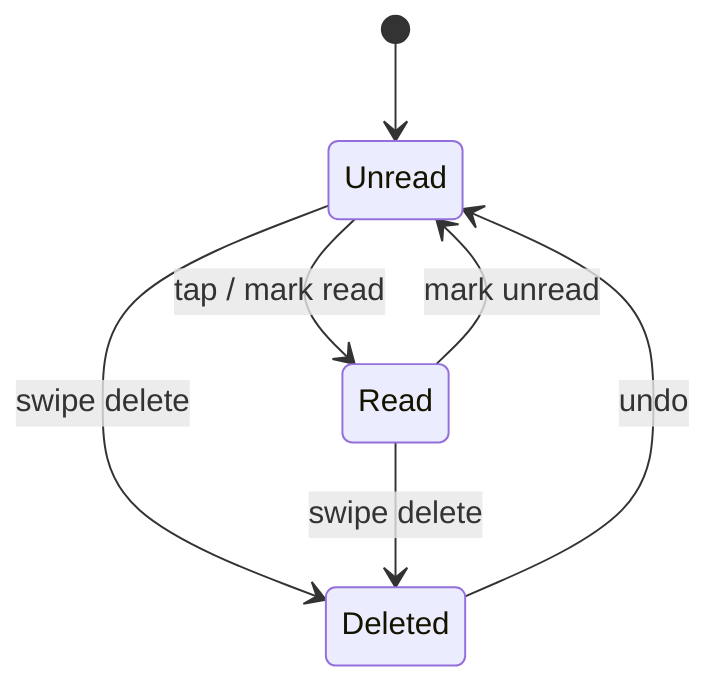

# P17 — Notifications

## Metadata

| Field | Value |
|---|---|
| Page ID | P17 |
| Platforms | Mobile / Web |
| Roles | User / Reporter / Admin (Guest sees prompt) |
| Priority | P1 |
| Route / Path | `/notifications` (mobile header bell / drawer), `/notifications` (web) |
| Prototype | `prototypes/web/p17-notifications.html` |

## Purpose

Notifications is the in-app inbox for everything that needs a reader's
attention: breaking news, new articles in followed categories, posts from
followed reporters, replies to comments, and system messages. It consolidates
FCM push with the persisted in-app feed, manages the unread badge count, and
deep-links each item to the right destination. It also owns the push
permission prompt lifecycle so users understand and control what they receive.

## UI Structure

### Mobile
- **Header (62px, `--purple`):** back `‹`, title "Notifications", trailing
  "Mark all read" (`✓✓`) and `⋮` (notification settings → P20).
- **Filter tabs (sticky):** `All`, `Unread`, `Mentions` (comment replies) —
  pill style, active `--purple`.
- **Body:** grouped list by day ("Today", "Yesterday", "Earlier") with sticky
  group headers (`--muted`, `font-size-meta`, uppercase).
  - **Row:** leading 40px round icon tinted per type, title (1 line,
    `weight-semibold`), body (2 lines, `--muted`), relative time, and a trailing
    8px `--purple` unread dot. Unread rows have a `--purple-light` background
    wash; read rows are `--white`.
  - **Type icons:** breaking (`--error` zap), category (`--purple` tag),
    reporter (`--purple` user), comment reply (`--info` message-circle),
    system (`--muted` info).
  - **Thumbnail variant:** article notifications may show a small 48px image on
    the right.
- **Swipe actions:** left swipe reveals "Mark read/unread"; right swipe reveals
  "Delete" (`--error`).
- **Push permission prompt:** a dismissible banner at the top ("Turn on
  notifications to get breaking news") with "Enable" (fires OS prompt) and
  "Not now" (snoozes 7 days).
- **Pull-to-refresh**, infinite scroll, "You're all caught up" end divider.

### Web
- Dropdown panel from the header bell (360px wide, `radius-lg`, `shadow-md`,
  `z-modal`) showing the latest 8 with a "View all" footer; the full page lives
  at `/notifications`.
- Full page: centered 720px column, `35px` padding, tabs `All / Unread /
  Mentions`, group headers, hover reveals Mark read/Delete.
- A toast/browser notification mirrors new items when the tab is unfocused
  (with permission).
- Header bell shows a numeric badge (99+ cap) using `--error` background.

### Responsive behavior
- `xs`: body 12px, icons 36px, group headers dense.
- `mobile` (≤768px): full page from bell; swipe actions enabled.
- `tablet` (769–1024px): 720px column, hover actions.
- `desktop` (≥1025px): dropdown + full page; browser notifications.

## Features / Functional Requirements

| ID | Requirement | Priority |
|---|---|---|
| REQ-NOTIF-001 | The page MUST list notifications newest first, grouped by day, paginated by cursor. | P0 |
| REQ-NOTIF-002 | Each notification MUST show a type icon, title, body, relative time, and read/unread state. | P0 |
| REQ-NOTIF-003 | Tapping a notification MUST mark it read and deep-link to its destination. | P0 |
| REQ-NOTIF-004 | Users MUST be able to mark a single notification or all notifications as read. | P0 |
| REQ-NOTIF-005 | The header bell/badge MUST show the unread count and update in realtime. | P0 |
| REQ-NOTIF-006 | The page MUST request push permission via a contextual prompt, not on first launch. | P0 |
| REQ-NOTIF-007 | Users MUST be able to delete a notification (swipe/button). | P1 |
| REQ-NOTIF-008 | Filtering by `Unread` and `Mentions` MUST be supported. | P1 |
| REQ-NOTIF-009 | Notification types MUST include breaking, category, reporter, comment_reply, system. | P0 |
| REQ-NOTIF-010 | The page MUST show an empty state per filter. | P0 |
| REQ-NOTIF-011 | Push permission denials MUST route users to OS settings with guidance. | P1 |
| REQ-NOTIF-012 | Guests MUST be prompted to log in to receive/sync notifications. | P1 |

## User Interactions

- **Tap row:** unread dot fades out, row background transitions to white
  (`dur-medium`), navigation occurs; badge decrements optimistically.
- **Mark all read:** all dots fade in a staggered 15ms sweep; a toast "All
  caught up" appears.
- **Swipe left (mobile):** reveals Mark read/unread; threshold 35% commits.
- **Swipe right (mobile):** reveals Delete; committing removes with a collapse
  and undo snackbar (5s).
- **Enable push:** triggers OS permission dialog; on grant a toast "You're all
  set"; on deny the banner switches to "Notifications are off — Open settings".
- **Realtime:** new items slide in at the top; if not on the page, the badge
  pulses with a 150ms scale.
- **Pull-to-refresh:** reconciles with the server; unread count recalculated.
- **Group headers:** stick to the top while their group is in view.

## Validation & Error States

| Field/Action | Rule | Error message |
|---|---|---|
| Mark read | Request succeeds | Rollback dot + "Couldn't update. Try again." |
| Mark all read | Request succeeds | "Couldn't mark all as read." |
| Delete | Request succeeds | "Couldn't delete." (item restored) |
| Load | HTTP 200 | "Couldn't load notifications." + Retry |
| Push permission | OS state | Denied → settings guidance, not an error |
| Deep link target | Exists | Fallback to P07 "Content unavailable." |

## Loading, Empty, Success States

- **Loading:** 6 skeleton rows with icon circle + text bars; tabs visible.
- **Empty (All):** bell illustration + "No notifications yet" + "We'll let you
  know when something happens."
- **Empty (Unread):** "You're all caught up" with a check illustration.
- **Empty (Mentions):** "No replies yet."
- **Gate (Guest):** "Log in to get notifications" + login CTA.
- **Error:** inline error with Retry.
- **Success:** unread badge accurate, items deep-link correctly, read state
  synced across devices.

## User Flow

1. User taps the header bell (or receives a push and taps it).
2. The notification opens its deep link and is marked read.
3. User returns to the inbox, filters, and marks/deletes items.
4. If push is off, the contextual banner offers to enable it.
5. Ends at the deep-linked destination (P09, P11, P16, etc.).



## Dependencies

- **Screens:** P09, P11, P16, P18, P20, P03 Login, S02 Shell (bell/badge).
- **Components:** NotificationRow, TypeIcon, DayGroupHeader, UnreadBadge,
  PushPermissionBanner, SwipeableRow, EmptyState, SkeletonRow.
- **Services/stores:** `notificationStore`, `pushService` (FCM),
  `socketService`, `authStore`, `apiClient`, `analytics`.
- **Backend endpoints:** `GET /api/v1/notifications`,
  `POST /api/v1/notifications/{id}/read`,
  `POST /api/v1/notifications/read-all`,
  `DELETE /api/v1/notifications/{id}`,
  `GET /api/v1/notifications/unread-count`,
  `POST /api/v1/devices` (register FCM token).
- **Socket:** room `user:{id}`, event `notification.created`.

## API / Data Requirements

| Method | Endpoint | Purpose |
|---|---|---|
| GET | `/api/v1/notifications?filter=&cursor=&limit=20` | Paginated notifications |
| GET | `/api/v1/notifications/unread-count` | Badge count |
| POST | `/api/v1/notifications/{id}/read` | Mark one read |
| POST | `/api/v1/notifications/read-all` | Mark all read |
| DELETE | `/api/v1/notifications/{id}` | Delete one |
| POST | `/api/v1/devices` | Register/refresh FCM device token |

Response example:

```json
{
  "success": true,
  "data": [
    {
      "id": "n1...",
      "type": "comment_reply",
      "title": "Neha S replied to your comment",
      "body": "\"Totally agree with this take...\"",
      "read": false,
      "deepLink": "/article/a91c?comment=cm9",
      "imageUrl": null,
      "createdAt": "2026-09-22T17:20:00Z"
    }
  ],
  "meta": { "nextCursor": "eyJ...", "hasMore": true, "unreadCount": 5 },
  "error": null
}
```

## Navigation

| Action | From | To |
|---|---|---|
| Tap breaking/category/reporter | P17 | P09 / P11 |
| Tap comment reply | P17 | P16 `/article/:id/comments` |
| Tap system | P17 | P20 / P21 |
| Tap bell (web) | any | P17 dropdown/`/notifications` |
| Open settings | P17 | P20 `/settings` |
| Guest CTA | P17 | P03 `/login` |

## Analytics Events

| Event | Trigger | Properties |
|---|---|---|
| `notifications_view` | Page visible | `filter`, `unreadCount` |
| `notification_open` | Row tapped | `notificationId`, `type` |
| `notification_mark_read` | Marked read | `notificationId`, `scope: "one" / "all"` |
| `notification_delete` | Deleted | `notificationId` |
| `notification_filter_change` | Filter changed | `filter` |
| `push_prompt_shown` | Banner shown | — |
| `push_permission_result` | OS result | `granted: true/false` |
| `push_token_register` | Token sent | `platform` |

## Open Questions

- Retention: how long are notifications kept before pruning?
- Do we support grouping (e.g. "10 new in Sports") into a digest row?
- Should reporters/admins get separate notification channels/types?
- Is email digest in scope for v1? (Product says no, confirm.)
