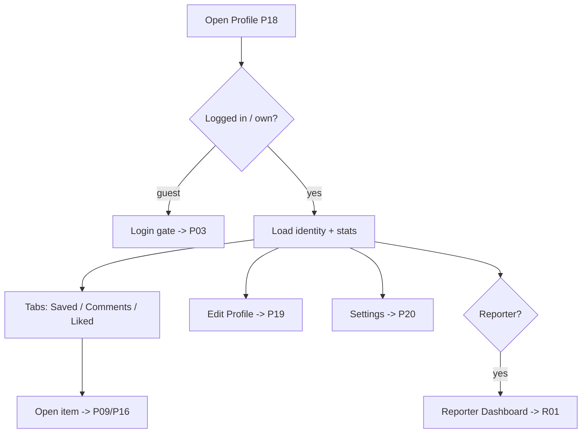

# P18 — Profile

## Metadata

| Field | Value |
|---|---|
| Page ID | P18 |
| Platforms | Mobile / Web |
| Roles | User / Reporter / Admin (Guest sees login gate) |
| Priority | P0 |
| Route / Path | `/profile` (self), `/reporter/:id` (public reporter) |
| Prototype | `prototypes/web/p18-profile.html` |

## Purpose

Profile is the user's identity and activity hub. It shows the user's avatar,
name, bio, and at-a-glance stats (bookmarks, comments, likes), plus tabbed
views of their Saved, Comments, and Liked content. It is the entry point to
Edit Profile (P19) and Settings (P20), and exposes a "Become a reporter" /
Reporter Dashboard entry when the account has the Reporter role. Public reporter
profiles reuse the same layout but show authored articles instead of personal
activity. Reporter, admin, and super_admin accounts additionally see
role-specific entries (e.g. Reporter Dashboard; admin console and
super-admin-only tools for admins).

## UI Structure

### Mobile
- **Header (62px, transparent over the cover):** back `‹` (left), share and
  overflow `⋮` (right; overflow = Settings), all white with a subtle top-
  gradient scrim for contrast.
- **Cover band:** 160px `--purple` → `--purple-dark` gradient, optionally
  user cover image.
- **Identity block (overlapping cover by 32px):** avatar 88px (`radius-pill`,
  white 3px ring, `shadow-card`), display name (`font-size-title-sm`,
  `weight-extrabold`), `@username` + verified badge (`--purple` check) if
  applicable, role chip (`User`/`Reporter`/`Admin`, `--purple-light`),
  bio (2 lines, `--muted`, "Add a bio" if empty).
- **Stats row (3 equal cells):** Saved, Comments, Likes — value
  (`weight-bold`, 16px) over label (`--muted`, `font-size-meta`). Cells
  tappable to switch to the matching tab. Dividers `--border`.
- **Actions row:** primary "Edit Profile" button (filled `--purple`,
  `radius-md`) and a secondary "Settings" button (outline). For Reporters an
  extra "Reporter Dashboard" button (ghost, `--purple`) routes to R01.
- **Tabs (sticky):** `Saved`, `Comments`, `Liked` — underline style, active
  `--purple`.
- **Tab content:** lists reuse P15 card, comment row, and article card
  components respectively; each paginates and has its own empty state.

### Web
- 68px web header from S02. Profile content in a centered 900px column.
- Two-column layout ≥1025px: left rail (cover + avatar + identity + stats +
  actions, sticky), right pane with tabs and content. Basic mode ≤1024px stacks
  vertically like mobile.
- Stats show as inline chips with counts; hover states on tabs/buttons.
- Public reporter view (`/reporter/:id`) replaces "Edit Profile" with a
  "Follow" button and shows follower count; tabs become `Articles`, `About`.

### Responsive behavior
- `xs`: avatar 72px, stats font 14px, cover 140px.
- `mobile` (≤768px): stacked layout, sticky identity, purple header gradient.
- `tablet` (769–1024px): stacked 900px column, web header.
- `desktop` (≥1025px): two-column with sticky left rail.

## Features / Functional Requirements

| ID | Requirement | Priority |
|---|---|---|
| REQ-PROF-001 | The page MUST display the user's avatar, display name, username, role, and bio. | P0 |
| REQ-PROF-002 | The page MUST show stats for Saved, Comments, and Likes, linking each to its tab. | P0 |
| REQ-PROF-003 | The page MUST provide tabs `Saved`, `Comments`, `Liked`, each paginated. | P0 |
| REQ-PROF-004 | The page MUST offer an "Edit Profile" action to P19. | P0 |
| REQ-PROF-005 | The page MUST offer a "Settings" entry to P20. | P0 |
| REQ-PROF-006 | Users with the Reporter role MUST see a Reporter Dashboard entry (R01). | P1 |
| REQ-PROF-007 | Reading-only visitors viewing a reporter profile MUST be able to follow/unfollow. | P1 |
| REQ-PROF-008 | The page MUST show per-tab empty states. | P0 |
| REQ-PROF-009 | Guests MUST be gated to login for their own profile. | P0 |
| REQ-PROF-010 | Reporters' public profiles MUST list their authored articles with status filtered to published. | P1 |
| REQ-PROF-011 | The page SHOULD support pull-to-refresh and realtime stat updates after actions elsewhere. | P2 |
| REQ-PROF-012 | The page MUST support a default avatar and initials fallback when no image exists. | P1 |

## User Interactions

- **Tap stat cell:** switches to the corresponding tab with a 150ms underline
  slide; scrolls the tab bar into view.
- **Tap Edit Profile:** navigates to P19; button press uses `--purple-dark`.
- **Tap Settings:** navigates to P20.
- **Tap Reporter Dashboard (Reporter):** navigates to R01 as a modal/stack
  push on mobile, a route change on web.
- **Tab switch:** content cross-fades `dur-medium`; per-tab scroll position is
  preserved.
- **Tap an item:** routes to P09 (Saved/Liked) or the parent article with the
  comment anchored (Comments).
- **Follow (reporter public view):** optimistic toggle with a 150ms pop and a
  toast.
- **Avatar tap (own profile):** opens a viewer with "Change photo" shortcut.
- **Pull-to-refresh:** re-fetches profile and the active tab.

## Validation & Error States

| Field/Action | Rule | Error message |
|---|---|---|
| Access (own) | Auth required | Login gate |
| Profile load | HTTP 200 | "Couldn't load profile." + Retry |
| Tab load | HTTP 200 | "Couldn't load {tab}." + Retry |
| Follow (Guest) | Auth required | "Log in to follow" |
| Reporter handle | Public profile exists | "Profile not found." → P07 |
| Image | Avatar upload validation handled in P19 | — |

## Loading, Empty, Success States

- **Loading:** cover/identity skeleton (circle avatar + two bars) and 3 stat
  placeholders; tab list shows 4 skeleton rows.
- **Empty (Saved):** "No saved articles yet" + "Explore news" CTA.
- **Empty (Comments):** "No comments yet" + "Join the conversation" CTA to P07.
- **Empty (Liked):** "No liked articles yet" + browse CTA.
- **Empty (reporter Articles):** "No published articles yet."
- **Gate (Guest):** illustration + "Log in to see your profile" + login CTA.
- **Success:** identity, stats, and active tab populated and in sync with other
  surfaces (P15/P16).

## User Flow

1. User opens the bottom **Profile** tab (or taps an author name → public
   reporter profile).
2. System loads identity + stats and the default `Saved` tab.
3. User taps a stat or tab to browse, or taps Edit Profile / Settings.
4. After editing (P19) the page reflects changes on return.
5. Ends at P09/P16 from a list item, or P19/P20 from actions.



## Dependencies

- **Screens:** P19 Edit Profile, P20 Settings, P15 Bookmarks, P16 Comments,
  P09 Article Detail, R01 Reporter Dashboard, P03 Login.
- **Components:** ProfileHeader, Avatar, StatsRow, ProfileTabs, SavedList,
  CommentList, LikedList, FollowButton, EmptyState, Skeleton.
- **Services/stores:** `profileStore`, `authStore`, `bookmarkStore`,
  `commentStore`, `likeStore`, `apiClient`, `analytics`.
- **Backend endpoints:** `GET /api/v1/users/me`,
  `GET /api/v1/users/{id}`, `GET /api/v1/users/me/stats`,
  `GET /api/v1/users/{id}/articles`, `POST /api/v1/users/{id}/follow`,
  `DELETE /api/v1/users/{id}/follow`.

## API / Data Requirements

| Method | Endpoint | Purpose |
|---|---|---|
| GET | `/api/v1/users/me` | Own profile |
| GET | `/api/v1/users/{id}` | Public profile |
| GET | `/api/v1/users/me/stats` | Saved/Comments/Likes counts |
| GET | `/api/v1/users/{id}/articles?cursor=&limit=` | Reporter's published articles |
| POST | `/api/v1/users/{id}/follow` | Follow a reporter |
| DELETE | `/api/v1/users/{id}/follow` | Unfollow a reporter |

Response example:

```json
{
  "success": true,
  "data": {
    "id": "u3...",
    "displayName": "Aarav Sharma",
    "username": "aarav",
    "bio": "News junkie. Cricket and markets.",
    "avatarUrl": "https://cdn/.../a.png",
    "role": "user",
    "verified": false,
    "stats": { "saved": 42, "comments": 17, "likes": 96 },
    "followerCount": 12,
    "followingCategories": ["sports", "business"]
  },
  "meta": {},
  "error": null
}
```

## Navigation

| Action | From | To |
|---|---|---|
| Edit Profile | P18 | P19 `/profile/edit` |
| Settings | P18 | P20 `/settings` |
| Reporter Dashboard | P18 | R01 `/reporter` |
| Saved tab item | P18 | P09 `/article/:id?from=profile` |
| Comments tab item | P18 | P16 `/article/:id/comments` |
| Author name (reader) | P09/P16 | P18 `/reporter/:id` |
| Guest CTA | P18 | P03 `/login` |
| Bottom tab | any | P18 `/profile` |

## Analytics Events

| Event | Trigger | Properties |
|---|---|---|
| `profile_view` | Page visible | `userId`, `isSelf`, `role` |
| `profile_tab_change` | Tab switched | `tab` |
| `profile_stat_tap` | Stat tapped | `stat` |
| `profile_edit_open` | Edit tapped | — |
| `profile_settings_open` | Settings tapped | — |
| `reporter_follow` | Follow/unfollow | `userId`, `action` |
| `profile_share` | Share tapped | `userId` |

## Open Questions

- Should readers have public profiles, or only reporters?
- Are follower/following lists in scope for v1?
- Do we show a "Reporter since" date or article count on public profiles?
- Should stats be realtime or refreshed on focus only?
