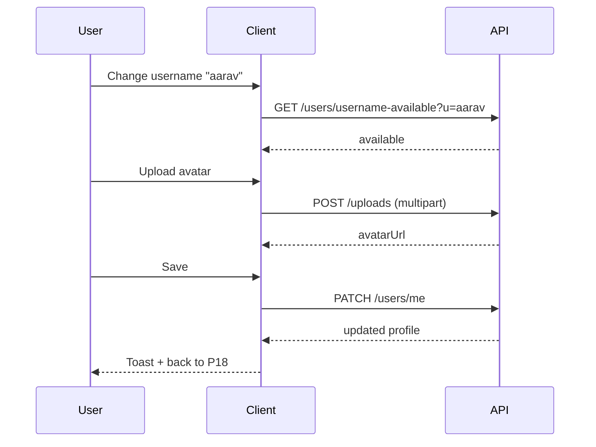

# P19 — Edit Profile

## Metadata

| Field | Value |
|---|---|
| Page ID | P19 |
| Platforms | Mobile / Web |
| Roles | User / Reporter / Admin |
| Priority | P1 |
| Route / Path | `/profile/edit` |
| Prototype | `prototypes/web/p19-edit-profile.html` |

## Purpose

Edit Profile lets a user maintain their account identity: display name,
username, bio, avatar, and contact details (email/phone). Email and phone
changes are sensitive and require verification (OTP / magic link) before they
take effect. The page enforces validation, optimistic image upload with
progress, and clear success/error feedback, and it keeps the profile shown on
P18 in sync.

## UI Structure

### Mobile
- **Header (62px, `--white`):** back `‹` with unsaved-changes guard, title
  "Edit Profile", trailing "Save" text button (`--purple`, `weight-semibold`)
  that is disabled until the form is dirty and valid.
- **Avatar block (centered):** avatar 96px (`radius-pill`, `shadow-card`),
  overlay camera icon button (36px, `--purple`), and a "Change photo" link.
  A "Remove photo" text action appears when a custom photo exists.
- **Form (page padding 16–17px):** stacked fields, each with a label
  (`font-size-meta`, `weight-semibold`, `--muted`) and helper text:
  - **Display name** — text input, `radius-md`, max 60 chars, live counter.
  - **Username** — `@` prefix affix, lowercase, `[a-z0-9_.]`, 3–24 chars,
    250ms availability check with `✓ available` / `✕ taken`.
  - **Bio** — multiline, max 160 chars, counter.
  - **Email** — current value shown read-only with a "Change" button.
  - **Phone** — current value shown read-only with a "Change" button.
- **Save bar (sticky bottom):** full-width primary "Save changes" button,
  disabled until dirty+valid; shows an inline spinner while saving.

### Web
- 68px header from S02; content in a centered 640px card (`radius-xl`,
  `shadow-card`, `35px` padding).
- Avatar on the left of the identity row with the same controls; form in a
  2-column grid at ≥1025px (name/username row 1, email/phone row 2, bio full
  width).
- Sticky action row at the card bottom: "Cancel" (ghost) and "Save changes"
  (filled). `⌘/Ctrl+S` triggers save.
- Email/phone change opens a modal with the verification flow.

### Responsive behavior
- `xs`: avatar 80px, fields full width, save bar full-width.
- `mobile` (≤768px): single column, sticky save bar, native image picker.
- `tablet` (769–1024px): single-column 640px card, drag-and-drop upload.
- `desktop` (≥1025px): two-column form, sticky footer actions, keyboard
  shortcut.

## Features / Functional Requirements

| ID | Requirement | Priority |
|---|---|---|
| REQ-PROF-013 | The page MUST allow editing display name, username, and bio. | P0 |
| REQ-PROF-014 | The page MUST validate and enforce username uniqueness with a debounced availability check. | P0 |
| REQ-PROF-015 | The page MUST allow avatar upload (camera/gallery on mobile, file/drag-drop on web) with preview and progress. | P0 |
| REQ-PROF-016 | The page MUST allow changing email or phone only after OTP/verification. | P0 |
| REQ-PROF-017 | Save MUST be disabled until the form is dirty and all visible validations pass. | P0 |
| REQ-PROF-018 | The page MUST guard against leaving with unsaved changes. | P1 |
| REQ-PROF-019 | The page MUST show inline field errors and a summary error on submit failure. | P0 |
| REQ-PROF-020 | The page SHOULD optimize/crop avatars client-side to ≤2MB (JPEG/PNG/WebP). | P1 |
| REQ-PROF-021 | Email/phone verification MUST support resend with a 60s cooldown. | P1 |
| REQ-PROF-022 | A successful save MUST update the P18 profile and any cached author identity immediately. | P0 |

## User Interactions

- **Avatar camera tap:** opens an action sheet (Take photo, Choose from
  library, Remove photo); crop UI then upload.
- **Image upload:** shows a 0–100% progress ring over the avatar; on success
  the new image fades in `dur-medium`; on failure the old image returns and an
  error toast appears.
- **Username typing:** after 250ms shows a spinner in the field's right slot,
  then `✓ available` (`--success`) or `✕ taken` (`--error`).
- **Change email/phone:** opens a modal; step 1 enter new value, step 2 enter
  OTP sent to it, step 3 success; "Resend" enabled after 60s.
- **Save:** button shows a spinner and disables; success shows a toast
  "Profile updated" and returns to P18 after 600ms.
- **Back with unsaved changes:** confirm dialog "Discard changes? You have
  unsaved edits." Keep editing / Discard.
- **Bio counter:** turns `--warning` at 140, `--error` at 160.

## Validation & Error States

| Field/Action | Rule | Error message |
|---|---|---|
| Display name | Required, 2–60 chars | "Enter your name (2–60 characters)" |
| Username | Required, 3–24, `[a-z0-9_.]`, unique | "Username must be 3–24 letters, numbers, _ or ." |
| Username | Unique | "That username is taken" |
| Bio | Optional, ≤160 chars | "Bio must be 160 characters or fewer" |
| Avatar | Type JPEG/PNG/WebP, ≤5MB source, ≤2MB processed | "Choose a JPG, PNG, or WebP under 5MB" |
| Email | Valid email format | "Enter a valid email address" |
| Email OTP | 6 digits, correct, not expired | "That code isn't right. Try again." |
| Phone | E.164 valid | "Enter a valid phone number" |
| Save | Server accepts | "Couldn't save changes. Try again." |

## Loading, Empty, Success States

- **Loading:** form field skeletons on first load; avatar placeholder with
  initials; Save disabled.
- **Empty:** N/A (fields are pre-populated; empty optional fields show
  placeholders).
- **Error:** inline field errors below inputs; a summary banner at the top for
  server errors.
- **Success:** toast "Profile updated", form becomes clean (Save disabled
  again), P18 and cached identities refresh.

## User Flow

1. User taps "Edit Profile" on P18.
2. System loads current profile into the form.
3. User edits fields and/or uploads an avatar.
4. For email/phone, the user completes OTP verification in the modal.
5. User taps Save; the profile updates and the app returns to P18.



## Dependencies

- **Screens:** P18 Profile, P20 Settings, P03 Login.
- **Components:** AvatarUploader, FormField, UsernameField, CharCounter,
  VerifyContactModal, ConfirmDiscardDialog, Toast, ProgressRing.
- **Services/stores:** `profileStore`, `authStore`, `uploadService`,
  `apiClient`, `validation`, `analytics`.
- **Backend endpoints:** `GET /api/v1/users/me`,
  `GET /api/v1/users/username-available`, `PATCH /api/v1/users/me`,
  `POST /api/v1/uploads/avatar`, `POST /api/v1/users/me/email/verify`,
  `POST /api/v1/users/me/phone/verify`.

## API / Data Requirements

| Method | Endpoint | Purpose |
|---|---|---|
| GET | `/api/v1/users/me` | Load editable profile |
| GET | `/api/v1/users/username-available?u=` | Username availability |
| PATCH | `/api/v1/users/me` | Update displayName, username, bio, avatarUrl |
| POST | `/api/v1/uploads/avatar` | Upload/process avatar |
| POST | `/api/v1/users/me/email/verify` | Request/confirm email change |
| POST | `/api/v1/users/me/phone/verify` | Request/confirm phone change |

Request example:

```json
{
  "displayName": "Aarav Sharma",
  "username": "aarav",
  "bio": "News junkie. Cricket and markets.",
  "avatarUrl": "https://cdn/.../a-new.png"
}
```

Response example:

```json
{
  "success": true,
  "data": { "id": "u3...", "displayName": "Aarav Sharma", "username": "aarav", "bio": "News junkie. Cricket and markets.", "avatarUrl": "https://cdn/.../a-new.png" },
  "meta": {},
  "error": null
}
```

Error example:

```json
{ "success": false, "data": null, "error": { "code": "VALIDATION_ERROR", "message": "Username is taken", "fields": { "username": "taken" } } }
```

## Navigation

| Action | From | To |
|---|---|---|
| Save success | P19 | P18 `/profile` |
| Back/discard | P19 | P18 `/profile` |
| Change password | P19 | P20 `/settings` |
| OTP verify | P19 | modal (stays on P19) |
| Deep link | external | P19 `/profile/edit` |

## Analytics Events

| Event | Trigger | Properties |
|---|---|---|
| `profile_edit_view` | Page visible | — |
| `profile_edit_save` | Save succeeds | `changedFields` |
| `avatar_upload` | Avatar uploaded | `sizeKb`, `mime`, `success` |
| `username_check` | Availability result | `available` |
| `contact_change_start` | Email/phone change | `field` |
| `contact_change_verify` | OTP verified | `field`, `success` |
| `profile_edit_discard` | Unsaved discard | — |

## Open Questions

- Can username be changed at all after creation, or once every N days?
- Do we support a cover image in addition to avatar for readers?
- Should phone be mandatory or optional for email-first accounts?
- Is there a display-name profanity filter before save?
