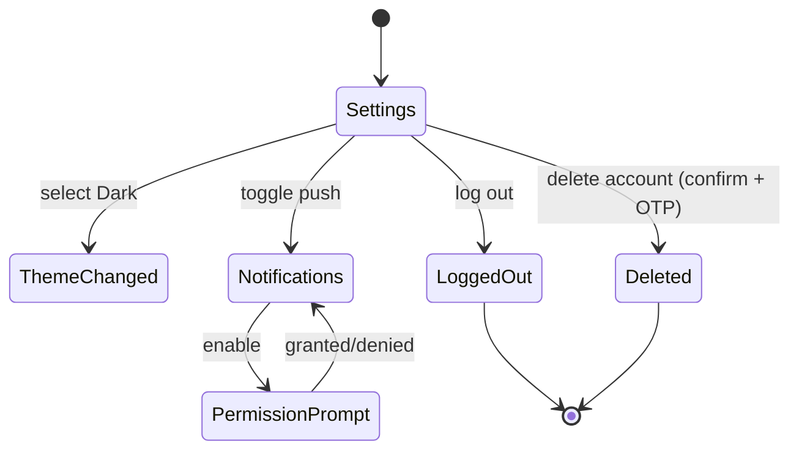

# P20 — Settings

## Metadata

| Field | Value |
|---|---|
| Page ID | P20 |
| Platforms | Mobile / Web |
| Roles | User / Reporter / Admin (Guest sees limited set) |
| Priority | P1 |
| Route / Path | `/settings` |
| Prototype | `prototypes/web/p20-settings.html` |

## Purpose

Settings is the control centre for the user's account, app behaviour, and
content experience. It groups account actions (profile, password, email/phone),
notification toggles, appearance (light/dark/system), language (English),
content preferences, privacy, cache management, the About/version block, logout,
and a guarded account-deletion flow. Appearance and content preferences apply
instantly across the app and persist locally and (when logged in) on the
account.

## UI Structure

### Mobile
- **Header (62px, `--white`):** back `‹`, title "Settings".
- **Body:** grouped section list (`radius-xl`, `--white`, `shadow-card` per
  group, page padding 16–17px). Each row is 52px: leading Lucide icon
  (`--muted`, active `--purple`), label (`weight-medium`), optional value
  (`--muted`), trailing chevron `›` or a control (Switch / segmented).
  - **Account:** Profile (→P18), Edit Profile (→P19), Change password,
    Email, Phone.
  - **Notifications:** Push notifications (Switch, triggers OS prompt if off),
    Breaking news (Switch), Category updates (Switch), Comment replies
    (Switch), Reporter posts (Switch), Email digest (Switch, P2).
  - **Appearance:** Theme segmented control `Light | Dark | System`
    (default System); Text size `Small | Medium | Large` (P2).
  - **Language:** Language row showing "English", with a "More coming soon"
    note.
  - **Content preferences:** Preferred categories (→ P10 multi-select),
    Autoplay video on Wi‑Fi (Switch), Data saver (Switch).
  - **Privacy:** Personalised recommendations (Switch), Activity visibility
    (segmented), Download my data (P2).
  - **Storage:** Clear cache (shows current size), Clear search history.
  - **About:** About NewsWatch (→P21), Terms, Privacy Policy, App version,
    Check for updates.
  - **Danger zone:** Log out, Delete account (`--error` text).
- **Switches:** `--purple` track when on, `--border` when off, 180ms thumb
  slide.
- **Segmented controls:** `radius-pill` track, active segment `--white` with
  `shadow-sm`.
- **Theme application:** instant with a 200ms cross-fade of the whole app.

### Web
- 68px header from S02; content in a two-column layout: left nav (240px) with
  the section list (Account, Notifications, Appearance, Language, Content,
  Privacy, Storage, About), right pane showing the selected section as cards.
- URL reflects the section: `/settings/notifications`, etc., so sections are
  deep-linkable and back/forward work.
- Toggles are same styling; destructive actions use a confirm modal.
- `Esc` returns to the previous section or P18.

### Responsive behavior
- `xs`: rows 48px, labels truncate, icon 18px.
- `mobile` (≤768px): single scrolling list; theme switch fades the app.
- `tablet` (769–1024px): two-column with a collapsible nav rail.
- `desktop` (≥1025px): persistent left nav, section routes in the URL.

## Features / Functional Requirements

| ID | Requirement | Priority |
|---|---|---|
| REQ-SET-001 | The page MUST group settings into Account, Notifications, Appearance, Language, Content, Privacy, Storage, About, and Danger zone. | P0 |
| REQ-SET-002 | Notification toggles MUST control push categories and request OS permission when enabling push. | P0 |
| REQ-SET-003 | Theme MUST support Light, Dark, and System and apply instantly and persistently. | P0 |
| REQ-SET-004 | Language MUST display English (only) with i18n-ready structure. | P1 |
| REQ-SET-005 | Content preferences MUST let users choose preferred categories and autoplay/data-saver options. | P1 |
| REQ-SET-006 | Clear cache MUST show current cache size and confirm before clearing. | P1 |
| REQ-SET-007 | Log out MUST confirm and clear tokens; Delete account MUST require strong confirmation. | P0 |
| REQ-SET-008 | About MUST show app version/build and link to About/Terms/Privacy (P21). | P1 |
| REQ-SET-009 | Settings MUST persist locally and sync to the account when logged in. | P0 |
| REQ-SET-010 | Privacy toggles MUST affect recommendation and visibility behaviour immediately. | P1 |
| REQ-SET-011 | The web page MUST deep-link per section (`/settings/{section}`). | P1 |
| REQ-SET-012 | Delete account MUST require typing a confirmation phrase and re-auth (OTP). | P0 |

## User Interactions

- **Switch toggle:** optimistic; 180ms thumb slide; on failure reverts with a
  toast.
- **Theme change:** instant cross-fade (`dur-medium`); respects
  `prefers-color-scheme` in System mode.
- **Preferred categories:** opens P10 in "selection mode"; saving returns with
  a toast and updates the feed.
- **Clear cache:** row shows size ("142 MB"); tap opens confirm "Clear cached
  images and data? Downloads and saved articles stay."; on confirm the size
  animates to 0 and a spinner shows briefly.
- **Log out:** confirm dialog "Log out of NewsWatch?"; on confirm tokens
  cleared and app returns to P03/P07 as Guest.
- **Delete account:** destructive modal explains permanence; user types
  "DELETE", re-authenticates via OTP, then account is scheduled/removed and the
  app returns to Guest state.
- **Check for updates:** polls version; shows "You're up to date" or an update
  CTA.
- **Row tap:** navigates with a right-slide push on mobile.

## Validation & Error States

| Field/Action | Rule | Error message |
|---|---|---|
| Push toggle on | OS permission granted | Denied → "Enable notifications in system settings" |
| Clear cache | Confirm required | N/A |
| Delete account | Phrase "DELETE" typed | "Type DELETE to confirm" |
| Delete account | OTP re-auth | "Enter the code sent to your email" |
| Theme persist | Storage write | "Couldn't save your theme preference" |
| Sync failure | Best-effort, keep local | Silent retry; toast on repeated failure |
| Logout | Confirm | N/A |

## Loading, Empty, Success States

- **Loading:** section skeletons on first load; switches disabled until
  preference state resolves (avoids flicker from default → stored).
- **Empty:** N/A.
- **Error:** inline banner for a failed section load with Retry; individual
  toggles show a toast on failure.
- **Success:** toggles persist, theme applies instantly, cache clears, logout
  returns to Guest, delete removes the account.

## User Flow

1. User opens Settings from P18 or the `⋮` menu.
2. System loads current preferences and renders groups.
3. User changes theme, notification toggles, or preferences; changes apply
   immediately and persist.
4. User clears cache or manages account actions.
5. Ends at P18, P21, or logged-out Guest state.



## Dependencies

- **Screens:** P18 Profile, P19 Edit Profile, P21 About, P10 Categories,
  P03 Login.
- **Components:** SettingsGroup, SettingsRow, Switch, SegmentedControl,
  ConfirmDialog, DangerZone, CacheSizeLabel, ThemeProvider.
- **Services/stores:** `settingsStore`, `authStore`, `pushService`,
  `themeProvider`, `cacheService`, `apiClient`, `analytics`.
- **Backend endpoints:** `GET /api/v1/users/me/preferences`,
  `PATCH /api/v1/users/me/preferences`,
  `POST /api/v1/users/me/delete`, `POST /api/v1/auth/logout`.

## API / Data Requirements

| Method | Endpoint | Purpose |
|---|---|---|
| GET | `/api/v1/users/me/preferences` | Load account preferences |
| PATCH | `/api/v1/users/me/preferences` | Save toggles/preferences |
| POST | `/api/v1/auth/logout` | Invalidate session/refresh token |
| POST | `/api/v1/users/me/delete` | Request account deletion (OTP-confirmed) |
| POST | `/api/v1/users/me/delete/confirm` | Confirm deletion with OTP |

Response example:

```json
{
  "success": true,
  "data": {
    "notifications": { "push": true, "breaking": true, "category": false, "commentReply": true, "reporter": false, "emailDigest": false },
    "appearance": { "theme": "system", "textSize": "medium" },
    "language": "en",
    "content": { "preferredCategories": ["sports", "business"], "autoplayWifi": true, "dataSaver": false },
    "privacy": { "personalised": true, "activityVisibility": "followers" }
  },
  "meta": {},
  "error": null
}
```

## Navigation

| Action | From | To |
|---|---|---|
| Profile / Edit | P20 | P18 / P19 |
| Preferred categories | P20 | P10 (selection mode) |
| About / Terms / Privacy | P20 | P21 `/about` |
| Log out | P20 | P03/P07 Guest |
| Delete account | P20 | P07 Guest (after confirmation) |
| Web section | P20 | `/settings/{section}` |
| Back | P20 | P18 |

## Analytics Events

| Event | Trigger | Properties |
|---|---|---|
| `settings_view` | Page visible | `section` |
| `settings_toggle` | Toggle changed | `key`, `value` |
| `settings_theme_change` | Theme set | `theme` |
| `settings_language_view` | Language opened | `value` |
| `settings_clear_cache` | Cache cleared | `freedMb` |
| `settings_logout` | Logged out | — |
| `account_delete_start` | Delete flow opened | — |
| `account_delete_confirm` | Deletion confirmed | — |
| `push_enable_attempt` | Push toggled on | `granted` |

## Open Questions

- Does "Delete account" hard-delete or soft-delete with a 30-day grace period?
- Is Text size (accessibility) in v1 scope?
- Do notification toggles map 1:1 to FCM topics on the backend?
- Should Settings be reachable from the bottom tab overflow as well as P18?
