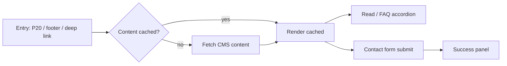

# P21 — About / Static Pages

## Metadata

| Field | Value |
|---|---|
| Page ID | P21 |
| Platforms | Mobile / Web |
| Roles | Guest / User / Reporter / Admin |
| Priority | P2 |
| Route / Path | `/about`, `/contact`, `/privacy`, `/terms`, `/faq` |
| Prototype | `prototypes/web/p21-about-static.html` |

## Purpose

About / Static Pages hosts the platform's non-article informational content:
About NewsWatch, Contact, Privacy Policy, Terms of Service, and FAQ, plus app
version and social links. Content is rendered from a CMS or static source so it
can be updated without an app release. It is publicly accessible to Guests,
referenced from Settings (P20), the web footer, and app store metadata, and
must render long-form rich text (headings, lists, links, tables) safely.

## UI Structure

### Mobile
- **Header (62px, `--white`):** back `‹`, page title (varies by route:
  "About", "Contact", "Privacy", "Terms", "FAQ"), optional trailing share.
- **About page body:**
  - Brand block: logo mark (`logo-icon` 34px, `--purple`), "newswatch"
    wordmark, tagline (`--muted`), and app version/build.
  - "Our mission" rich-text section.
  - Stat/highlight chips (e.g. "10M+ readers", "24×7 newsroom") in a 2-column
    grid.
  - Social links row: circular icon buttons (X, Facebook, Instagram, YouTube,
    LinkedIn) 40px, `--purple-light` bg, `--purple` icon; external-link
    behaviour.
  - Legal links list: Privacy Policy, Terms of Service, Contact, FAQ — rows
    with chevrons.
  - Footer: copyright, "Made with ❤" optional, version.
- **Contact page:** support email (mailto), feedback form (name, email, subject,
  message, submit), and office address; form submits to the API.
- **Rich content:** headings (`font-size-title-sm`), body
  (`font-size-body`, `line-height-body`), lists, blockquotes, links
  (`--purple`, underlined), images full width `radius-md`.
- **FAQ:** accordion list; each item expands with a 200ms height animation and
  rotating chevron; deep-linkable anchors (`#q-slug`).

### Web
- 68px header from S02; content in a centered 760px reading column with
  `35px` padding, on a `--white` card (`radius-xl`, `shadow-card`).
- Two-column variant for About ≥1025px: left = sticky section nav (About,
  Mission, Team, Contact, Legal), right = content with scroll-spy highlighting.
- FAQ uses the same accordion, centered 720px.
- Global web footer (S02) renders the same static links and social icons.
- Long pages show a "Last updated" date and a back-to-top button.

### Responsive behavior
- `xs`: body 14px, brand block stacks, social icons 36px.
- `mobile` (≤768px): single column, purple or white header per route.
- `tablet` (769–1024px): 760px column, accordion FAQ.
- `desktop` (≥1025px): optional section scroll-spy nav for About; footer links.

## Features / Functional Requirements

| ID | Requirement | Priority |
|---|---|---|
| REQ-SYS-001 | The page MUST render About, Contact, Privacy, Terms, and FAQ routes from CMS/static content. | P1 |
| REQ-SYS-002 | Content MUST support rich text (headings, lists, links, bold/italic, images, tables) with safe sanitization. | P0 |
| REQ-SYS-003 | The page MUST display the app version and build number (About). | P1 |
| REQ-SYS-004 | Social links MUST open in the system browser / external tab. | P2 |
| REQ-SYS-005 | The Contact form MUST validate and submit to the API, showing success/error feedback. | P1 |
| REQ-SYS-006 | FAQ MUST be an accordion with deep-linkable anchors. | P2 |
| REQ-SYS-007 | Web MUST deep-link each static page and render server-side for SEO. | P1 |
| REQ-SYS-008 | Content MUST be cached offline for the last viewed page (mobile). | P2 |
| REQ-SYS-009 | Legal pages MUST show a "Last updated" date. | P1 |
| REQ-SYS-010 | The page MUST work for Guests without authentication. | P0 |

## User Interactions

- **Tap legal/FAQ row:** navigates within the static stack with a right-slide
  push on mobile.
- **FAQ item tap:** expands/collapses with 200ms animation; chevron rotates
  90°/180°; only one open at a time (configurable).
- **Contact submit:** button shows a spinner; success shows an inline success
  panel "Thanks — we'll get back to you."; errors show field messages.
- **Social icon tap:** opens the external URL (in-app browser on mobile,
  new tab on web).
- **Link inside content:** internal links route within the app; external links
  open externally.
- **Copy support email:** long-press (mobile) / click icon (web) copies with a
  toast.
- **Back to top (web):** appears after 600px scroll; smooth-scrolls to top.

## Validation & Error States

| Field/Action | Rule | Error message |
|---|---|---|
| Contact name | Required, 2–80 chars | "Enter your name" |
| Contact email | Valid email | "Enter a valid email address" |
| Contact subject | Required, ≤120 chars | "Add a subject" |
| Contact message | Required, 10–2000 chars | "Your message must be at least 10 characters" |
| Content load | HTTP 200 | "Couldn't load this page." + Retry |
| External link | Reachable | Falls back to a toast "Couldn't open link" |
| Rate limit | Max 3 submissions / 10 min | "You've sent several messages. Please wait." |

## Loading, Empty, Success States

- **Loading:** page title skeleton + 3–5 body text-line skeletons; FAQ shows 4
  collapsed skeletons.
- **Empty:** "Content coming soon" for a route with no CMS entry (rather than a
  hard error).
- **Error:** inline error with Retry; navigation remains available.
- **Success:** rich content renders; the version is accurate; the contact form
  confirms; FAQ anchors resolve.

## User Flow

1. User arrives from Settings (P20), the web footer, an app-store link, or a
   deep link.
2. System compares the cached content version with the server and fetches if
   stale.
3. User reads the static content or opens FAQ items.
4. On Contact, the user submits the form and sees confirmation.
5. Ends on the same page or by navigating back / to P18/Settings.



## Dependencies

- **Screens:** P20 Settings, P18 Profile, S02 Shell (footer/header).
- **Components:** RichTextRenderer, Accordion, SectionNav, SocialLinks,
  ContactForm, VersionLabel, BackToTop, EmptyState.
- **Services/stores:** `contentStore` (CMS pages), `apiClient`,
  `cacheService`, `sharingService`, `analytics`.
- **Backend endpoints:** `GET /api/v1/content/{slug}`,
  `POST /api/v1/contact`, `GET /api/v1/app/version`.

## API / Data Requirements

| Method | Endpoint | Purpose |
|---|---|---|
| GET | `/api/v1/content/{slug}` | Fetch CMS/static page (about, privacy, terms, faq) |
| POST | `/api/v1/contact` | Submit contact/feedback form |
| GET | `/api/v1/app/version` | Latest app version/build + update info |

Response example:

```json
{
  "success": true,
  "data": {
    "slug": "about",
    "title": "About NewsWatch",
    "version": 7,
    "lastUpdated": "2026-08-01T00:00:00Z",
    "sections": [
      { "type": "heading", "level": 2, "text": "Our mission" },
      { "type": "paragraph", "text": "NewsWatch delivers fast, trustworthy reporting..." },
      { "type": "list", "ordered": false, "items": ["Speed", "Trust", "Engagement"] }
    ],
    "social": [
      { "platform": "x", "url": "https://x.com/newswatch" },
      { "platform": "youtube", "url": "https://youtube.com/@newswatch" }
    ]
  },
  "meta": {},
  "error": null
}
```

## Navigation

| Action | From | To |
|---|---|---|
| About | P20 / footer / deep link | P21 `/about` |
| Privacy / Terms | P20 / footer | P21 `/privacy`, `/terms` |
| FAQ | any | P21 `/faq` |
| Contact | footer / About | P21 `/contact` |
| External social | P21 | system browser / new tab |
| Back | P21 | P20 / previous screen |

## Analytics Events

| Event | Trigger | Properties |
|---|---|---|
| `static_page_view` | Page visible | `slug`, `version` |
| `faq_expand` | FAQ item opened | `questionId` |
| `contact_submit` | Form submitted | `success`, `hasSubject` |
| `social_link_click` | Social opened | `platform` |
| `static_page_error` | Load failed | `slug`, `errorCode` |

## Open Questions

- Which CMS (Strapi/Contentful/Sanity) is the source of truth?
- Should legal pages have in-app review/acknowledgement requirements?
- Is a team/leadership section wanted on About for v1?
- Do we need a careers or press page now or later?
